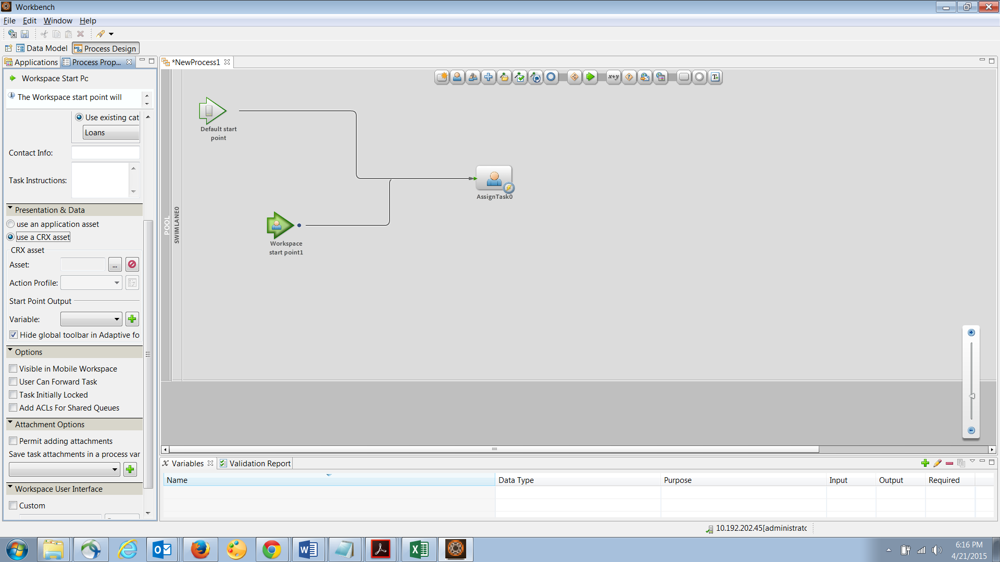
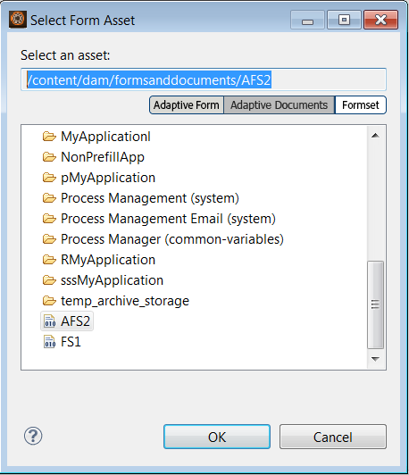

# Set di moduli in AEM Forms{#form-set-in-aem-forms}

## Panoramica {#overview}

I clienti devono spesso inviare più moduli per richiedere un servizio o un vantaggio. Comporta la ricerca di tutti i moduli rilevanti e la compilazione, l&#39;invio e il tracciamento separati. Inoltre, devono compilare i dettagli comuni più volte nei moduli. L’intero processo diventa complesso e soggetto a errori se coinvolge un numero elevato di moduli. La funzione Forms Set di AEM Forms può aiutare a semplificare l’esperienza utente in tali scenari.

Un set di moduli è un insieme di moduli di HTML5 raggruppati e presentati come un unico set di moduli agli utenti finali. Quando gli utenti finali iniziano a compilare un set di moduli, passano facilmente da un modulo all’altro. Alla fine, può inviare tutti i moduli con un solo clic.

AEM Forms fornisce agli autori dei moduli un’interfaccia utente intuitiva per creare, configurare e gestire i set di moduli. In qualità di autore, è possibile ordinare i moduli in una sequenza specifica che gli utenti finali dovranno seguire. È inoltre possibile applicare condizioni o espressioni di idoneità ai singoli moduli per controllarne la visibilità in base agli input degli utenti. Ad esempio, è possibile configurare il modulo dei dettagli del coniuge in modo che venga visualizzato solo quando lo stato civile specifica Sposato.

Inoltre, puoi configurare campi comuni in diversi moduli per condividere associazioni di dati comuni. Con le associazioni dati corrette, gli utenti finali devono compilare le informazioni comuni solo una volta che viene compilato automaticamente nei moduli successivi.

I set di moduli sono supportati anche nell’app AEM Forms, per consentire alla forza lavoro sul campo di portare offline un set di moduli, visitare i clienti, inserire i dati e sincronizzarli in un secondo momento con il server AEM Forms per inviare i dati dei moduli ai processi aziendali.

## Creazione e gestione di set di moduli {#creating-and-managing-form-set}

È possibile associare diversi XDP o modelli di modulo, creati con Designer, a un set di moduli. I set di moduli possono quindi essere utilizzati per eseguire selettivamente il rendering degli XDP in base ai valori immessi dagli utenti nei moduli iniziali e nei relativi profili.

Utilizza l&#39;[interfaccia utente di AEM Forms](https://experienceleague.adobe.com/en/docs/experience-manager-65/content/forms/getting-started/introduction-managing-forms) per gestire tutti i tuoi moduli, set di moduli e risorse correlate.

### Creare un set di moduli {#create-a-form-set}

Per creare un set di moduli, effettuare le seguenti operazioni:

1. Selezionare Forms > Forms e Documenti.
1. Seleziona Crea > Set di moduli.

1. Nella pagina Aggiungi proprietà, aggiungi i dettagli seguenti e fai clic su Avanti.

   * Titolo: specifica il titolo del documento. Il titolo ti aiuta a identificare il set di moduli nell’interfaccia utente di AEM Forms.
   * Descrizione: specifica le informazioni dettagliate sul documento.
   * Tag: specifica i tag per identificare in modo univoco il set di moduli. Aiuto sui tag per la ricerca nel set di moduli. Per creare i tag, digitate i nuovi nomi dei tag nella casella Tag.
   * URL di invio: specifica l’URL in cui vengono pubblicati i dati inviati per il caso di rappresentazione autonoma del set di moduli (caso di utilizzo di app non AEM Forms). I dati vengono inviati a questo endpoint come dati multipart/formdata con il seguente parametro di richiesta:
   * dataXML: questo parametro contiene una rappresentazione XML dei dati del set di moduli inviati. Se tutti i moduli del set di moduli utilizzano uno schema comune, il codice XML viene generato in base a tale schema. In caso contrario, il tag radice XML contiene un tag figlio per ogni modulo compilato nel set di moduli che contiene i dati per gli allegati del modulo.
   * formsetPath: percorso del set di moduli in CRXDE, che è stato inviato.
   * Profilo rendering HTML: è possibile configurare alcune opzioni, ad esempio campi mobili, allegati e supporto delle bozze (per la rappresentazione di set di moduli autonomi) per personalizzare l’aspetto, il comportamento e le interazioni del set di moduli. È possibile personalizzare o estendere il profilo esistente per modificare le impostazioni del profilo di HTML Form.

   

1. Nella schermata Seleziona moduli vengono visualizzati i moduli XDP o i file XDP disponibili. Cercare e selezionare i moduli da includere nel set di moduli, quindi fare clic su Aggiungi a set di moduli. Se necessario, cerca nuovamente i moduli da aggiungere. Dopo aver aggiunto tutti i moduli al set di moduli, fare clic su Avanti.

   >[!NOTE]
   >
   >Assicurati che i nomi dei campi nei moduli XDP non contengano il carattere punto. In caso contrario, gli script che tenteranno di risolvere i campi, che contengono caratteri punto, non saranno in grado di risolverli.

1. Nella pagina Configura moduli è possibile effettuare le seguenti operazioni:

   * Ordine dei moduli: trascinare i moduli per riordinarli. L’ordine dei moduli definisce l’ordine in cui i moduli vengono mostrati all’utente finale nell’app AEM Forms e nella rappresentazione autonoma.
   * Identificatore modulo: specifica un’identità univoca per i moduli da utilizzare nelle espressioni di idoneità.
   * Directory principale dati: per ogni modulo nel set di moduli, l’autore può configurare l’XPATH in cui i dati di quel particolare modulo sono posizionati nell’XML inviato. Per impostazione predefinita, il valore è /. Se tutti i moduli nel set di moduli sono associati a uno schema e condividono lo stesso schema XML, è possibile modificare questo valore. È consigliabile che in ogni campo del modulo sia specificata un&#39;associazione dati corretta nell&#39;XDP. Se due campi in due moduli diversi condividono la stessa associazione dati, il campo nel secondo modulo mostra i valori precompilati del primo modulo. Non associare due sottomaschere con lo stesso contenuto interno allo stesso nodo XML. Per ulteriori informazioni sulla struttura XML del set di moduli, vedere [Precompila XML per set di moduli](https://experienceleague.adobe.com/en/docs/experience-manager-65/content/forms/html5-forms/formset-in-aem-forms#prefill-xml-for-form-set).
   * Espressione di idoneità: specifica un&#39;espressione di JavaScript che valuta un valore booleano e indica se un modulo nel set di moduli è idoneo alla compilazione. Se false, all’utente non viene richiesto o non viene mostrato nemmeno il modulo da compilare. In genere, l’espressione si basa sui valori dei campi acquisiti prima del modulo. Le espressioni contengono anche chiamate al set di moduli API fs.valueOf per estrarre i valori compilati dall’utente in un campo di un modulo del set di moduli:

   *fs.valueOf(&lt;Identificatore modulo>, &lt;espressione fieldSom>) > &lt;valore>*

   Se ad esempio nel set di moduli sono presenti due moduli: spese aziendali e spese di viaggio, è possibile aggiungere uno snippet JavaScript nel campo Espressione idoneità per entrambi i moduli per verificare l&#39;input dell&#39;utente per il tipo di spesa in un modulo. Se l&#39;utente sceglie Spese commerciali, il modulo Spese commerciali viene visualizzato all&#39;utente finale. Oppure, se l’utente sceglie le spese di viaggio, viene eseguito il rendering di un modulo diverso per l’utente finale. Per ulteriori informazioni, consulta Espressione di idoneità.

   L&#39;autore può inoltre scegliere di rimuovere un modulo dal set di moduli utilizzando l&#39;icona Elimina presente nell&#39;angolo destro di ogni riga oppure di aggiungere un altro set di moduli utilizzando l&#39;icona &#39;**+**&#39; nella barra degli strumenti. Questa icona &#39;**+**&#39; reindirizza l&#39;utente al passaggio precedente della procedura guidata utilizzato per &#39;Selezionare moduli&#39;. Le selezioni esistenti vengono mantenute ed eventuali selezioni aggiuntive effettuate devono essere aggiunte al set di moduli utilizzando l’icona Aggiungi a set di moduli nella pagina.

   

   >[!NOTE]
   >
   >Tutti i moduli utilizzati nel set di moduli vengono gestiti dall’interfaccia utente di AEM Forms.

### Gestione di un set di moduli {#managing-a-form-set}

Una volta creato un set di moduli, è possibile eseguire le azioni seguenti su tale set di moduli:

* Clic singolo: quando il set di moduli viene creato ed elencato nella pagina della risorsa principale, è possibile fare clic singolo sul set di moduli per visualizzarlo. Un set di moduli si apre e visualizza tutti i modelli di modulo (XDP) del set di moduli.
* Modifica: facendo clic su Modifica dopo aver selezionato un set di moduli, viene visualizzata la schermata Configura moduli mostrata sopra in Passaggi per creare un set di moduli. Puoi eseguire tutte le funzionalità descritte al punto qui.
* Copia e incolla: consente di copiare l’intero set di moduli da una posizione e incollarlo nella stessa posizione o in qualsiasi altra cartella.
* Download: puoi scaricare il set di moduli con tutte le sue dipendenze.
* Avvia/Gestisci revisione: una volta creato il set di moduli, è possibile impostarne la revisione facendo clic su Avvia revisione. Una volta avviata la revisione di un set di moduli, l’utente visualizza l’opzione Gestisci revisione. Nella schermata Gestisci revisione, puoi aggiornare/terminare la revisione. Per le revisioni aggiunte, puoi controllare la revisione e aggiungere commenti, se necessario.
* Elimina: elimina il set di moduli completo. I moduli nel set di moduli eliminato rimangono nell’archivio.
* Pubblica/Annulla pubblicazione: pubblica/annulla la pubblicazione del set di moduli insieme a tutti i moduli in esso contenuti e alle relative risorse.
* Anteprima: l’anteprima offre due opzioni: Anteprima come HTML (senza dati) e Anteprima personalizzata con dati di esempio.
* Visualizza/Modifica proprietà: è possibile visualizzare/modificare le proprietà dei metadati di un set di moduli selezionato.


### Modificare un set di moduli {#edit-a-form-set}

Per modificare un set di moduli, effettuare le seguenti operazioni:

1. Selezionare Forms > Forms e Documenti.
1. Individuare il set di moduli da modificare. Passa il puntatore del mouse su di esso e seleziona Modifica ( ).
1. Nella pagina Configura moduli è possibile modificare quanto segue:

   * Ordine modulo
   * Identificatore modulo
   * Directory principale dati
   * Espressione di idoneità

   È inoltre possibile fare clic sull&#39;icona Elimina corrispondente per eliminare il modulo dal set di moduli.

## Set di moduli in Gestione processi {#form-set-in-process-management}

Dopo aver creato un set di moduli utilizzando l’interfaccia utente di AEM Forms Management, puoi utilizzare il set di moduli in un punto iniziale o assegnare un’attività task tramite Workbench.

### Utilizzo del set di moduli nell&#39;attività o nel punto iniziale {#using-form-set-in-task-or-start-point}

1. Durante la progettazione di un processo, nella sezione Presentazione e dati di Assegna attività/punto iniziale, seleziona **utilizza una risorsa CRX**. Viene visualizzato il browser Risorse di CRX.

   

1. Seleziona il set di moduli per filtrare il set di moduli nell’archivio di AEM (CRX).

   

1. Seleziona un set di moduli e fai clic su OK.

## Espressioni di idoneità {#eligibility-expressions}

Le espressioni di idoneità in un set di moduli vengono utilizzate per definire e controllare dinamicamente i moduli visualizzati a un utente. Ad esempio, per visualizzare un modulo specifico solo se l’utente appartiene a un determinato gruppo di età. Specificare e modificare un&#39;espressione di idoneità utilizzando Gestione moduli.

Un’espressione di idoneità può essere un’istruzione JavaScript valida che restituisce un valore booleano. L’ultima istruzione nello snippet di codice JavaScript viene considerata come un valore booleano che determina l’idoneità del modulo in base all’elaborazione del resto (righe precedenti) dello snippet di codice JavaScript. Se il valore dell’espressione è true, il modulo può essere visualizzato all’utente. Tali moduli sono noti come moduli idonei.

>[!NOTE]
>
>L’espressione di idoneità per il primo modulo nel set di moduli non viene eseguita. La prima maschera viene sempre visualizzata indipendentemente dalla relativa espressione di idoneità.

Oltre alle funzioni standard di JavaScript, il set di moduli espone anche l’API fs.valueOf che fornisce accesso al valore di un campo di un modulo in un set di moduli. Utilizza questa API per accedere al valore di un campo modulo in un set di moduli. La sintassi API è fs.valueOf (formUid, fieldSOM), dove:

* formUid (stringa): ID univoco di un modulo nel set di moduli. È possibile specificarlo durante la creazione del set di moduli nell’interfaccia utente di Forms Manager. Per impostazione predefinita, corrisponde al nome del modulo.
* fieldSOM (stringa): espressione SOM del campo nel modulo specificato da formUid. Espressione SOM o Espressione modello a oggetti di script utilizzata per fare riferimento a valori, proprietà e metodi all&#39;interno di un particolare modello a oggetti documento (DOM). Mentre il campo è selezionato, è possibile visualizzarlo in Designer modulo nella scheda Script.

>[!NOTE]
>
>Entrambi i parametri formUid e fieldSOM devono essere letterali stringa.

### Esempi {#examples}

Utilizzo valido dell’API:

`fs.valueOf("form1", "xfa.form.form1.subform1.field1")`

Utilizzo dell’API non valido:

```javascript
var formUid = "form1";
 var fieldSOM = "xfa.form.form1.subform1.field1"; fs.valueOf(formUid, fieldSOM);
```

## Precompila XML per set di moduli {#prefill-xml-for-form-set}

Il set di moduli è una raccolta di più moduli HTML5 con schemi comuni o diversi. Il set di moduli supporta la precompilazione dei campi modulo utilizzando un file XML. È possibile associare un file XML a un set di moduli in modo che, quando si apre un modulo nel set di moduli, alcuni campi del modulo vengano precompilati.

Il file XML di precompilazione viene specificato utilizzando il parametro dataRef dell&#39;URL del set di moduli. Il parametro dataRef specifica il percorso assoluto del file XML dati unito al set di moduli.

Ad esempio, sono disponibili tre maschere (form1, form2 e form3) nel set di maschere con la seguente struttura:

form1

campo
form1field

form2

campo
form2field

form3

campo
form3field

Ogni modulo ha un campo denominato comune, denominato &quot;field&quot; e un campo con nome univoco denominato &quot;form&lt;i>field&quot;.

È possibile precompilare questo set di moduli utilizzando un XML con la seguente struttura:

```xml
<?xml version="1.0" encoding="UTF-8" ?>
<formSetRootTag>
 <field>common field value</field>
 <form1field>value1</form1field>
 <form2field>value2</form2field>
 <form3field>value3</form3field>
</formSetRootTag>
```

>[!NOTE]
>
>Il tag radice XML può avere qualsiasi nome, ma i tag elemento corrispondenti ai campi devono avere lo stesso nome del campo. La gerarchia dell&#39;XML deve simulare la gerarchia del modulo, il che significa che l&#39;XML deve avere tag corrispondenti per il wrapping dei sottomoduli.

Lo snippet XML riportato sopra mostra che l&#39;XML di precompilazione per il set di moduli è un&#39;unione dei frammenti XML di precompilazione dei singoli moduli. Se alcuni campi nei diversi moduli hanno una gerarchia di dati o uno schema simile, i campi vengono precompilati con gli stessi valori. In questo esempio, tutti e tre i moduli sono precompilati con lo stesso valore per il campo comune, &quot;field&quot;. Si tratta di un modo semplice per trasferire i dati da un modulo all&#39;altro. A questo scopo è anche possibile associare i campi allo stesso schema o allo stesso riferimento dati. Se desideri segregare i dati del set di moduli in base allo schema dei moduli. Ciò può essere ottenuto specificando l’attributo &quot;data root&quot; del modulo, durante la creazione del set di moduli (il valore predefinito è &quot;/&quot;, che viene mappato sul tag root del set di moduli).

Nell&#39;esempio precedente, se si specificano le radici dati rispettivamente &quot;/form1&quot;, &quot;/form2&quot; e &quot;/form3&quot; per i tre moduli, è necessario utilizzare un XML precompilato della seguente struttura:

```xml
<?xml version="1.0" encoding="UTF-8" ?>
<formSetRootTag>
 <form1>
  <field>field value1</field>
  <form1field>value1</form1field>
 </form1>
 <form2>
  <field>field value2</field>
  <form2field>value2</form2field>
 </form2>
 <form3>
  <field>field value3</field>
  <form3field>value3</form3field>
 </form3>
</formSetRootTag>
```

In un set di moduli XML ha definito uno schema XML con la seguente sintassi:

```xml
<formset>
 <fs_data>
  <xdp:xdp xmlns:xdp="https://ns.adobe.com/xdp/">
  <xfa:datasets xmlns:xfa="https://www.xfa.org/schema/xfa-data/1.0/">
   <xfa:data>
   <rootElement>
    ... data ....
   </rootElement>
   </xfa:data>
  </xfa:datasets>
  </xdp:xdp>
 </fs_data>
 <fs_draft>
  ... private data...
 </fs_draft>
</formset>
```

>[!NOTE]
>
>Se sono presenti due moduli con radici di dati sovrapposte o se la gerarchia degli elementi di un modulo si sovrappone alla gerarchia della radice di dati di un altro modulo, nel file xml precompilato i valori degli elementi sovrapposti vengono uniti. L&#39;XML di invio ha una struttura simile a quella dell&#39;XML di precompilazione, ma l&#39;XML di invio ha più tag wrapper e alcuni tag di dati contestuali del set di moduli sono stati aggiunti alla fine.

### Descrizione elementi XML precompilati {#prefill-xml-elements-description}

Regole di sintassi per la creazione di un file XML di precompilazione:

* elementi padre: elementi che possono essere i relativi elementi padre, dove null indica che l&#39;elemento può trovarsi nella radice dell&#39;XML.
* cardinalità: descrive il numero di volte in cui l’elemento può essere utilizzato all’interno del suo elemento padre.
* submitXML: indica se l&#39;elemento è sempre presente(P) o facoltativo(O) in submit XML.
* prefillXML: indica se l’elemento è obbligatorio(R) o facoltativo(O) nel codice XML precompilato.
* elementi figlio: indica quali elementi possono essere i relativi elementi figlio.

### SET DI MODULI {#formset}

`parent elements:`

`null`

`cardinality: [0,1]`

`submitXML: P`

`prefillXML: O`

`children: fs_data`

Elemento principale dell&#39;XML del set di moduli. Si consiglia di non utilizzare questa parola come nome della radiceSubform di qualsiasi modulo del set di moduli.

### FS_DATA {#fs-data}

`parent elements:`

`formset`

cardinalità: [1]

submitXML: P

prefillXML: O

`children: xdp:xdp/rootElement`

La sottostruttura indica i dati dei moduli nel set di moduli. L’elemento è facoltativo nel codice XML precompilato solo se l’elemento del set di moduli non è presente

### XDP:XDP {#xdp-xdp}

`parent elements: fs_data/null`

`cardinality: [0,1]`

`submitXML: O`

`prefillXML: O`

`children: xfa:datasets`

Questo tag indica l&#39;inizio dell&#39;XML di HTML5 Form. Questo viene aggiunto nel codice XML di invio se è presente nel codice XML di precompilazione o se non è presente alcun codice XML di precompilazione. Questo tag può essere rimosso dal file XML di precompilazione.

### XFA:SET DI DATI {#xfa-datasets}

`parent elements: xdp:xdp`

`cardinality: [1]`

`submitXML: O`

`prefillXML: O`

`children: xfa:data`

### XFA:DATI {#xfa-data}

`parent elements: xfa:datasets`

`cardinality: [1]`

`submitXML: O`

`prefillXML: O`

`children: rootElement`

### ROOTELEMENT {#rootelement}

`parent elements: xfa:datasets/fs_data/null`

`cardinality: [0,1]`

`submitXML: P`

`prefillXML: O`

`children: controlled by the Forms in Form set`

Il nome rootElement è solo un segnaposto. Il nome effettivo viene scelto dai moduli utilizzati nel set di moduli. La sottostruttura che inizia con rootElement contiene i dati dei campi e delle sottomaschere all&#39;interno del Forms nel set di moduli. Esistono diversi fattori che determinano la struttura del rootElement e dei relativi elementi figlio.

In XML precompilato, questo tag è facoltativo, ma se manca, l’intero XML viene ignorato.

NOME DEL TAG DELL’ELEMENTO PRINCIPALE

Se nel file XML precompilato è presente un elemento principale, il nome di tale elemento viene utilizzato anche nel file XML di invio. Nei casi in cui non è disponibile alcun XML precompilato, il nome dell&#39;elemento radice è il nome del sottomodulo radice del primo modulo del set di moduli con la proprietà dataRoot impostata su &quot;/&quot;. Se tale modulo non è presente, il nome dell&#39;elemento radice è **fs_dummy_root**, che è una parola chiave riservata.

## Set di moduli nell’app AEM Forms {#formset-in-workspace-app}

L’app AEM Forms consente ai lavoratori sul campo di sincronizzare i loro dispositivi mobili con un server AEM Forms e di lavorare sulle loro attività. L’applicazione funziona anche quando il dispositivo non è in linea salvando i dati localmente sul dispositivo. Utilizzando le funzioni di annotazione, come le fotografie, i lavoratori sul campo possono fornire informazioni accurate da integrare nei processi aziendali.

<!-- Update link as it is a 404 - For more information on AEM Forms app, see [AEM Forms app overview](/help/forms/using/mobile-workspace-overview.md).-->

## Limitazioni note: pattern non completamente supportati nel set di moduli {#known-limitations-patterns-not-fully-supported-in-form-set}

I seguenti modelli di dati non sono completamente supportati nel set di moduli:

<table>
 <tbody>
  <tr>
   <td><strong>Pattern non completamente supportato nel set di moduli</strong></td>
   <td><strong>Esempio</strong></td>
  </tr>
  <tr>
   <td>Mancata corrispondenza tra dimensione di input e dimensione del pattern</td>
   <td><p>Se pattern= num{z,zzz}</p> <p>E input=</p> <p>12,345 o</p> <p>1,23</p> </td>
  </tr>
  <tr>
   <td>Modelli di clausole immagine con parentesi "(" ")"</td>
   <td>num{(zz,zzz)}</td>
  </tr>
  <tr>
   <td>Più pattern di dati</td>
   <td>num{zz,zzz} | num{z,zzz,zzz}</td>
  </tr>
  <tr>
   <td>Pattern per stenografia </td>
   <td><p>num.integer{},</p> <p>num.decimal{},</p> <p>num.percent{}, oppure</p> <p>num.currency{}</p> </td>
  </tr>
 </tbody>
</table>
