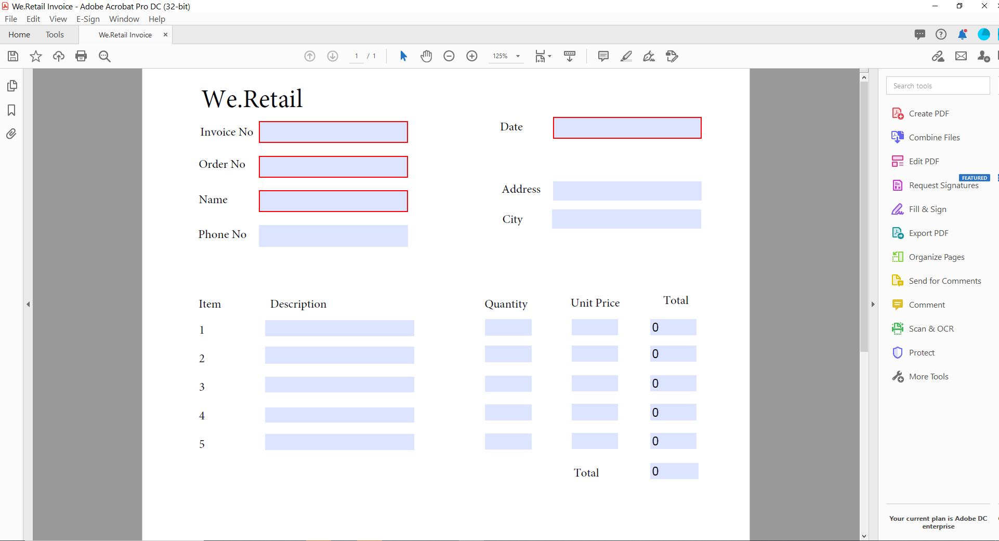
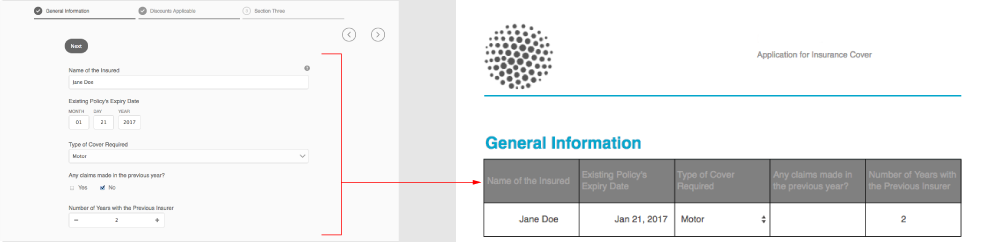

# Genera un documento di record per Adaptive Forms (componenti core)

## Panoramica {#overview}

Quando un modulo viene compilato o inviato, è possibile conservare un record del modulo, in formato cartaceo o in formato documento. Questo record è denominato documento di registrazione (DoR). Si tratta di una copia stampabile del modulo inviato. È inoltre possibile fare riferimento al documento di registrazione per le informazioni che i clienti hanno compilato in una data successiva oppure utilizzare il documento di record per archiviare i moduli e i contenuti insieme in formato PDF.


Per creare un documento di record, un modello basato su XFA o Acroform viene unito ai dati raccolti tramite un modulo adattivo. È possibile generare automaticamente un documento di record o on-demand. L’opzione su richiesta consente di specificare un modello XFA o Acrobat personalizzato per fornire un aspetto personalizzato al documento di record.

Operazioni disponibili:

* [Genera un documento di record basato su XFA](#generate-an-XFA-based-document-of-record)
* [Generare un documento di record basato su Acroform (Acrobat Form PDF)](#generate-an-Acroform-based-document-of-record)
* [Generazione automatica di un documento di record](#auto-generate-a-document-of-record)

## Prima di iniziare {#components-to-automatically-generate-a-document-of-record}

Prima di iniziare ad apprendere e a preparare le risorse necessarie per un documento di record:

**Modello di base:** Un modello XFA (file XDP) creato in Forms Designer o in un modulo Acrobat (AcroForm). [Modello di base](#base-template-of-a-document-of-record) viene utilizzato per specificare le informazioni sullo stile e il branding di un documento di record. Carica il modello XFA (file XDP) nella tua istanza AEM Forms prima.

**Modulo adattivo:** Modulo adattivo per il quale deve essere generato il documento di record.

## Genera un documento di record basato su XFA {#generate-an-XFA-based-document-of-record}

Carica il modello XFA (file XDP) nella tua istanza AEM Forms. Esegui i seguenti passaggi per configurare un modulo adattivo per utilizzare il modello XFA (file XDP) come modello per il documento di record:

1. Nell’istanza di authoring di Experience Manager, fai clic su **[!UICONTROL Forms]** > **[!UICONTROL Forms e documenti].**
1. Selezionare un modulo o crearne uno adattivo e fare clic su **[!UICONTROL Proprietà]**.
1. Nella finestra Proprietà, tocca **[!UICONTROL Modello Modulo]**.
1. Sulla  **[!UICONTROL Modello Modulo]** nella scheda **[!UICONTROL Seleziona da]** a discesa, seleziona **[!UICONTROL Modello dati modulo]**, **[!UICONTROL Schema]** o **[!UICONTROL Nessuno]**. È inoltre possibile selezionare un modello di modulo quando si crea un modulo.
1. Nella sezione Configurazione modello documento della scheda Modello modulo selezionare **Associa modello di modulo come modello di documento di record**. Selezionando questa opzione, vengono visualizzati tutti i modelli XFA (file XDP) disponibili sul computer. Selezionare il file appropriato. Inoltre, assicurati che lo stesso schema (schema dati) sia utilizzato per Modulo adattivo e per il modello XFA selezionato (file XDP).
1. Fai clic su **[!UICONTROL Fatto.]**

Il modulo adattivo è ora configurato per l’utilizzo di un file XDP come modello per Document of Record. I passaggi successivi sono i seguenti: [associare i componenti Modulo adattivo ai campi modello corrispondenti](#bind-adaptive-form-components-with-template-fields).

## Generare un documento di record basato su Acroform {#generate-an-Acroform-based-document-of-record}

Carica il tuo Adobe Acrobat PDF (Acroform) nella tua istanza AEM Forms. Esegui i seguenti passaggi per configurare un modulo adattivo per utilizzare Adobe Acrobat PDF (Acroform) come modello per il documento di record:

1. Nell’istanza di authoring di Experience Manager, fai clic su **[!UICONTROL Forms]** > **[!UICONTROL Forms e documenti].**
1. Selezionare un modulo o **[!UICONTROL Creare un modulo adattivo]** e fai clic su **[!UICONTROL Proprietà]**.
1. Nella finestra Proprietà, tocca **[!UICONTROL Modello Modulo]**.
1. Sulla  **[!UICONTROL Modello Modulo]** nella scheda **[!UICONTROL Seleziona da]** a discesa, seleziona **[!UICONTROL Modello dati modulo]**, **[!UICONTROL Schema]** o **[!UICONTROL Nessuno]**. È inoltre possibile selezionare un modello di modulo quando si crea un modulo.
1. Nella sezione Configurazione modello documento della scheda Modello modulo selezionare **Associa modello di modulo come modello di documento di record**. Selezionando questa opzione, vengono visualizzati tutti i PDF Acrobat (Acroform) disponibili sul computer. Selezionare l’Acroform da utilizzare.
1. Fai clic su **[!UICONTROL Fatto.]**

Il modulo adattivo è ora configurato per l’utilizzo di un Acroform come modello per Document of Record. I passaggi successivi sono i seguenti: [associare i componenti Modulo adattivo ai campi modello corrispondenti](#bind-adaptive-form-components-with-template-fields).

## Generazione automatica di un documento di record {#auto-generate-a-document-of-record}

Quando un Modulo adattivo è configurato per generare automaticamente un Documento di record, ogni volta che un modulo viene modificato, il relativo Documento di record viene aggiornato immediatamente. Ad esempio, se un campo viene rimosso da un modulo adattivo esistente, anche il campo corrispondente viene rimosso e non è visibile nel documento di record. Ci sono molti altri vantaggi nella generazione automatica del documento di record:

* Gli sviluppatori di moduli non devono gestire manualmente i binding dei dati. Il documento di record generato automaticamente si occupa degli aggiornamenti relativi al binding dei dati.
* Gli sviluppatori di moduli non devono nascondere manualmente i campi contrassegnati come esclusi dal documento di record. Il documento di record generato automaticamente è preconfigurato per escludere tali campi.
* L’opzione Documento di record generato automaticamente consente di risparmiare tempo per la creazione di un modello di modulo per il documento di record.
* L’opzione Documento di record generato automaticamente consente di utilizzare stili e apparenze diversi utilizzando modelli di base diversi. Consente di selezionare lo stile e l&#39;aspetto migliori per il documento di record della tua organizzazione. Se non si specifica lo stile, gli stili di sistema vengono impostati come predefiniti.
* Il documento generato automaticamente assicura che qualsiasi modifica del modulo venga immediatamente riflessa nel documento di registrazione.

Esegui i seguenti passaggi per configurare un modulo adattivo per generare automaticamente un documento di record:

1. Nell’istanza di authoring di Experience Manager, fai clic su **[!UICONTROL Forms]** > **[!UICONTROL Forms e documenti].**
1. Selezionare un modulo o crearne uno adattivo e fare clic su **[!UICONTROL Proprietà]**.
1. Nella finestra Proprietà, tocca **[!UICONTROL Modello Modulo]**.
1. Sulla  **[!UICONTROL Modello Modulo]** nella scheda **[!UICONTROL Seleziona da]** a discesa, seleziona **[!UICONTROL Modello dati modulo]**, **[!UICONTROL Schema]** o **[!UICONTROL Nessuno]**. È inoltre possibile selezionare un modello di modulo quando si crea un modulo.
1. Nella sezione Configurazione modello documento della scheda Modello modulo selezionare **Genera documento di registrazione**.
1. Fai clic su **[!UICONTROL Fatto.]**

## Binding dei componenti modulo adattivo con i campi modello {#bind-adaptive-form-components-with-template-fields}

Eseguire un binding dei campi modulo adattivo con i campi modello per visualizzare i dati del modulo acquisito nel campo del documento di record corrispondente. Per eseguire un binding dei componenti per modulo adattivo con i campi corrispondenti del modello di documento:

1. Aprire il Modulo adattivo configurato per l’utilizzo di un modello di modulo personalizzato per la modifica.

1. Seleziona un componente Modulo adattivo e fai clic su Apri Configura .  icona. Apre il browser delle proprietà.

1. Nel browser delle proprietà, sfoglia e seleziona un campo.

   * (Per il modello AcroForm) il **[!UICONTROL Campo di riferimento del binding del documento]** proprietà.
   * (Per il modello XFA) il **[!UICONTROL Riferimento di binding del modello dati]** proprietà.

1. Fai clic su **[!UICONTROL Salva]**.

<!-- 
In the following video Adaptive Form components are binded with corresponding Acroform template fields and the Document of Record is sent as an email attachment.
-->

È possibile utilizzare azioni di invio quali &quot;Invia e-mail&quot;, &quot;Richiama un flusso di lavoro AEM&quot;, &quot;Richiama un flusso di automazione dell&#39;alimentazione&quot; e altri [Inviare azioni](configuring-submit-actions.md) per ricevere un documento di registrazione.


## Aggiornamenti incrementali al modello Documento di record {#document-of-record-template-incremental-updates}

I moduli adattivi e i corrispondenti documenti dei modelli di record possono evolvere nel tempo. È possibile scegliere di aggiungere, rimuovere o modificare i campi in un modulo adattivo o in un modello di documento di record.

Quando apporti modifiche a un modello Documento di record e carichi il modello Documento di record modificato in AEM Forms, l’editor di Forms adattivo rileva automaticamente i binding modificati e ti informa sui componenti del modulo adattivo che richiedono nuovi binding. Consente di eseguire aggiornamenti incrementali a un modello di documento di record.

Ad esempio, un&#39;organizzazione, *We.Retail* ha un modello Document of Record basato su AcroForm, *we-retail-fattura.pdf*. Il modello si presenta come segue:



Dopo aver utilizzato il modello per un certo periodo di tempo, l&#39;organizzazione decide di rinominare `invoice-number` campo a `bill-number` campo e acquisisci l&#39;indirizzo e-mail degli acquirenti. Nome aggiornato da uno sviluppatore del `invoice-number` e aggiunge un campo e-mail al modello. Crea anche una nuova versione del modello denominato  *we-retail-fattura-v2.pdf*.


<!--

The developer uploads and applies to the updated template to the adaptive form. The adaptive form automatically detects and displays list of fields where binding has changed.


The form developer binds Adaptive Forms fields with corresponding Document of Record template.

-->

>[!VIDEO](assets/we-retail-binding.mp4)

Ora, quando viene inviato il modulo adattivo, viene generato un documento di record aggiornato.


## Considerazioni chiave durante l&#39;utilizzo del documento di registrazione {#key-considerations-when-working-with-document-of-record}

Considera le seguenti considerazioni e limitazioni quando lavori sul documento di record per Adaptive Forms.

* I modelli del documento di record non supportano il testo RTF. Pertanto, qualsiasi testo RTF nel modulo adattivo statico o nelle informazioni inserite dall’utente finale viene visualizzato come testo normale nel documento di registrazione.
* I frammenti di documento in un modulo adattivo non vengono visualizzati nel documento di record. Tuttavia, i frammenti di modulo adattivo sono supportati.
* Il binding del contenuto nel documento di record generato per il modulo adattivo basato su schema XML non è supportato.
* La versione localizzata del documento di record viene creata su richiesta per un&#39;impostazione internazionale quando l&#39;utente richiede il rendering del documento di record. La localizzazione del documento di record avviene insieme alla localizzazione del modulo adattivo. <!-- For more information on localization of Document of Record and Adaptive Forms see Using AEM translation workflow to localize Adaptive Forms and Document of Record.-->

<!-- ## Configure an adaptive form to generate  Document of Record {#adaptive-form-types-and-their-documents-of-record}

While creating an adaptive form, in the Form Model tab of Adaptive Form properties, select one the following option: 

* **None**
  Select the option to create an Adaptive Form without a form model. When the option is selected, the Document of Record is automatically generated for your Adaptive Form.

* **[Associate form template as a Document of Record template](creating-adaptive-form.md#create-an-adaptive-form-based-on-an-xfa-form-template)**
  
  Select the option to use an XFA Form as a template for Document of Record. 

* **[Generate Document of Record](creating-adaptive-form.md#create-an-adaptive-form-based-on-xml-or-json-schema)**
  Select the option to use an XFA Form as a template. When the option is selected, the Document of Record is automatically generated for your Adaptive Form. When you use an XML schema as a template for an Adaptive Form, ensure that the adaptive form and associated XFA Form use the same XML schema as your Adaptive Form
  

When you select a form model, configure Document of Record using options available under Document of Record Template Configuration. See [Document of Record Template Configuration](#document-of-record-template-configuration). -->

## Mappatura degli elementi del modulo adattivo {#mapping-of-adaptive-form-elements}

Nella tabella seguente sono descritti i componenti Modulo adattivo e i componenti XFA corrispondenti, nonché quelli visualizzati in un documento di record.

### Campi {#fields}

<table>
 <tbody>
  <tr>
   <th>Componente Modulo adattivo</th>
   <th>Componente XFA corrispondente</th>
   <th>Incluso per impostazione predefinita nel modello del documento di record?</th>
   <th>Note</th>
  </tr>
  <tr>
   <td>Pulsante</td>
   <td>Pulsante</td>
   <td>false</td>
   <td> </td>
  </tr>
  <tr>
   <td>Casella di selezione</td>
   <td>Casella di controllo</td>
   <td>vero</td>
   <td> </td>
  </tr>
  <tr>
   <td>Selettore data</td>
   <td>Campo data/ora</td>
   <td>vero</td>
   <td> </td>
  </tr>
  <tr>
   <td>Elenco a discesa</td>
   <td>Elenco a discesa</td>
   <td>vero</td>
   <td> </td>
  </tr>
  <tr>
   <td>Casella numerica</td>
   <td>Campo numerico</td>
   <td>vero</td>
   <td> </td>
  </tr>
  <tr>
   <td>Pulsante di scelta</td>
   <td>Pulsante di scelta</td>
   <td>vero</td>
   <td> </td>
  </tr>
  <tr>
   <td>Casella di testo</td>
   <td>Campo testo</td>
   <td>vero</td>
   <td> </td>
  </tr>
  <tr>
   <td>Pulsante Ripristina</td>
   <td>Pulsante Ripristina</td>
   <td>false</td>
   <td> </td>
  </tr>
  <tr>
   <td>Pulsante Invia</td>
   <td><p>Pulsante Invia per e-mail</p> <p>Pulsante Invia per HTTP</p> </td>
   <td>false</td>
   <td> </td>
  </tr>
  <tr>
   <td>Allegato file</td>
   <td> </td>
   <td>false</td>
   <td>Non disponibile nel modello Documento di record. Disponibile solo nel documento di registrazione attraverso gli allegati.</td>
  </tr>
 </tbody>
</table>

### Contenitori {#containers}

<table>
 <tbody>
  <tr>
   <th>Componente Modulo adattivo</th>
   <th>Componente XFA corrispondente</th>
   <th>Note</th>
  </tr>
  <tr>
   <td>Pannello<br /> </td>
   <td>Sottomodulo<br /> </td>
   <td>Il pannello ripetibile è associato a un sottomodulo ripetibile.</td>
  </tr>
 </tbody>
</table>

### Componenti statici {#static-components}

| Componente Modulo adattivo | Componente XFA corrispondente | Note |
|---|---|---|
| Immagine | Immagine | I componenti TextDraw e Image, associati o non associati, vengono sempre visualizzati nel documento di record per un modulo adattivo basato su XSD, a meno che non vengano esclusi utilizzando le impostazioni Document of Record. |
| Testo | Testo |

### Tabelle {#tables}

I componenti della tabella Forms adattivi, come intestazione, piè di pagina e mappa di riga, sono associati ai componenti XFA corrispondenti. È possibile mappare pannelli ripetibili su tabelle in Documento di record.

## Modello di base di un documento di record {#base-template-of-a-document-of-record}

Il modello di base fornisce informazioni su stile e aspetto al documento di record. Consente di personalizzare l&#39;aspetto predefinito del documento di record generato automaticamente. Ad esempio, è possibile utilizzare un modello di base per aggiungere il logo della società nell’intestazione e le informazioni sul copyright nel piè di pagina del documento di registrazione.

La pagina master di un modello di base viene utilizzata come pagina master per il modello Documento di record. La pagina master può contenere informazioni quali intestazione di pagina, piè di pagina e numero di pagina che è possibile applicare al documento di record. È possibile applicare tali informazioni al documento di record utilizzando il modello di base per la generazione automatica del documento di record. L’utilizzo di un modello base consente di modificare le proprietà predefinite dei campi.

Segui sempre [Convenzioni dei modelli di base](#base-template-conventions) quando si progetta un modello di base.

## Convenzioni dei modelli di base {#base-template-conventions}

Un modello di base viene utilizzato per definire l&#39;intestazione, il piè di pagina, lo stile e l&#39;aspetto di un documento di record. L’intestazione e il piè di pagina possono includere informazioni quali il logo dell’azienda e il testo del copyright. La prima pagina master del modello base viene copiata e utilizzata come pagina master per il documento di record, che contiene un&#39;intestazione, un piè di pagina, un numero di pagina o qualsiasi altra informazione che deve essere visualizzata in tutte le pagine del documento di record. Se si utilizza un modello di base non conforme alle convenzioni del modello di base, la prima pagina master del modello di base viene ancora utilizzata nel modello Documento di record. Si consiglia vivamente di progettare il modello di base in base alle sue convenzioni e di utilizzarlo per la generazione automatica di documenti di record.

**Convenzioni delle pagine master**

* Nel modello di base, denominare il sottomodulo principale come `AF_METATEMPLATE` e la pagina master come `AF_MASTERPAGE`.

* La pagina master con il nome `AF_MASTERPAGE` situato sotto `AF_METATEMPLATE` il sottomodulo principale è preferibile per l’estrazione di informazioni su intestazione, piè di pagina e stile.

* Se `AF_MASTERPAGE` è assente, viene utilizzata la prima pagina master presente nel modello base.

**Convenzioni di stile per i campi**

* Per applicare lo stile ai campi nel documento di record, il modello di base fornisce i campi che si trovano nel `AF_FIELDSSUBFORM` sotto il `AF_METATEMPLATE` sottomodulo principale.

* Le proprietà di questi campi vengono applicate ai campi nel documento di registrazione. Questi campi devono seguire `AF_<name of field in all caps>_XFO` convenzione di denominazione. Ad esempio, il nome del campo per la casella di controllo deve essere `AF_CHECKBOX_XFO`.

Per creare un modello di base, eseguire le operazioni seguenti in Forms Designer.

1. Fai clic su **[!UICONTROL File]** > **[!UICONTROL Nuovo]**.
1. Seleziona la **[!UICONTROL Basato su un modello]** opzione .

1. Seleziona la **[!UICONTROL Forms - Documento di registrazione]** categoria.
1. Seleziona **[!UICONTROL Modello di base DoR]**.
1. Fai clic su **[!UICONTROL Successivo]** e fornire le informazioni richieste.

1. (Facoltativo) Modificare lo stile e l’aspetto dei campi che si desidera applicare ai campi nel documento di record.
1. Salvare il modulo.
   

È ora possibile utilizzare il modulo salvato come modello di base per un documento di record. Non modificare o rimuovere gli script presenti nel modello di base.

**Modifica del modello di base**

* Non applicare alcuno stile sui campi del modello di base, è consigliabile rimuovere tali campi dal modello di base in modo che tutti gli aggiornamenti al modello di base vengano automaticamente prelevati.
* Durante la modifica del modello di base, non rimuovere, aggiungere o modificare script.

Seguire rigorosamente le convenzioni e le istruzioni di cui sopra per progettare un modello di base.

## Personalizzare le informazioni sul marchio nel documento di registrazione {#customize-the-branding-information-in-document-of-record}

Durante la generazione di un documento di record, è possibile modificare le informazioni di branding per il documento di record nella scheda Documento di record. La scheda Documento di record include opzioni quali logo, aspetto, layout, intestazione e piè di pagina, liberatoria e se si desidera includere o meno le opzioni della casella di controllo e dei pulsanti di scelta non selezionati.

Per localizzare le informazioni di branding immesse nella scheda Documento di record, accertati che le impostazioni internazionali del browser siano impostate in modo appropriato. Per personalizzare le informazioni di branding del documento di registrazione, esegui i seguenti passaggi:

1. Seleziona un pannello (pannello principale) nel documento di record e tocca .
1. Tocca . Viene visualizzata la scheda Documento di record.
1. Selezionare il modello predefinito o un modello personalizzato per il rendering del documento di record. Se si seleziona il modello predefinito, sotto il menu a discesa Modello viene visualizzata una miniatura del documento di record.
1. A seconda che si selezioni un modello predefinito o personalizzato, nella scheda Documento di record vengono visualizzate alcune o tutte le proprietà seguenti. Specificare le proprietà riportate di seguito per definire l&#39;aspetto del documento di record:

   1. **Proprietà base**:
      * **Modello**: Se desideri selezionare un modello personalizzato, sfoglia e seleziona un XDP sul tuo [!DNL AEM Forms] server. Se desideri utilizzare un modello non disponibile sul tuo [!DNL AEM Forms] server, devi prima caricare XDP nel tuo [!DNL AEM Forms] server.
      * **Colore accento**: Colore in cui viene eseguito il rendering del testo dell&#39;intestazione e delle righe separatore nel documento di record PDF.
      * **Famiglia di font**: Famiglia di font del testo nel Document of Record PDF.

      * **Includi oggetti modulo non associati a modelli dati**: L&#39;impostazione della proprietà include campi non associati di Modulo adattivo basato su schema nel documento di record.
      <!-- **Exclude hidden fields from the Document of Record**: Setting the property identifies the hidden fields for exclusion from Document of Record.-->

      * **Nascondere la descrizione dei pannelli**: L&#39;impostazione della proprietà esclude la descrizione del pannello/tabella dal documento di record. Applicabile per il pannello e la tabella.
   1. **Proprietà del campo modulo**:
      * **Per i componenti Casella di controllo e Pulsante di scelta, mostrare solo i valori selezionati**: L&#39;impostazione della proprietà visualizza solo i valori selezionati della casella di controllo e del pulsante di scelta in [!UICONTROL Documento di registrazione].
      * **Separatore per più valori**: Per visualizzare più valori è possibile scegliere un separatore, ad esempio una virgola o un&#39;interruzione di riga.
      * **Allineamento opzioni**: È possibile selezionare l’allineamento desiderato (orizzontale, verticale, uguale a modulo adattivo) per impostare l’allineamento dei campi, ad esempio la casella di controllo o il pulsante di scelta, su cui visualizzare l’allineamento [!UICONTROL Documento di registrazione]. Per impostazione predefinita, l’allineamento verticale è impostato per i campi in [!UICONTROL Documento di registrazione]. Impostazione delle proprietà dalla [!UICONTROL Proprietà campo modulo] di DoR sovrascrive le proprietà impostate nel [!UICONTROL Allineamento articolo] per i campi di un modulo adattivo. Nel caso in cui selezioni [!UICONTROL Uguale al modulo adattivo] l’allineamento configurato in un’istanza dell’autore di un modulo adattivo viene utilizzato per [!UICONTROL Documento di registrazione] campi.
      * **Numero di opzioni per l&#39;allineamento orizzontale**:È possibile impostare il numero di opzioni da visualizzare nel documento di record per l&#39;allineamento orizzontale.
   1. **Proprietà pagina mastro**:
      * **Immagine del logo**: Puoi scegliere di utilizzare l’immagine logo dal modulo adattivo, sceglierne uno da DAM o caricarne uno dal computer.
      * **Titolo modulo**: Titolo del DoR.
      * **Testo intestazione**: Testo visualizzato nella sezione di intestazione del documento di registrazione.
      * **Etichetta della liberatoria**: Etichetta della liberatoria.
      * **Disclaimer**: Testo che specifica la portata dei diritti e degli obblighi del documento di registrazione.
      * **Testo della liberatoria**: Testo della liberatoria.
      
   >[!NOTE]
   >
   >Se si utilizza un modello di modulo adattivo creato con una versione di Designer precedente alla versione 6.3, affinché le proprietà Colore accento e Famiglia font funzionino, assicurarsi che quanto segue sia presente nel modello di modulo adattivo sotto il sottomodulo principale:

   ```xml
   <proto>
   <font typeface="Arial"/>
   <fill>
   <color value="4,166,203"/>
   </fill>
   <edge>
   <color value="4,166,203"/>
   </edge>
   </proto>
   ```

1. Per salvare le modifiche al branding, tocca **[!UICONTROL Fine]**.


## Layout di tabelle e colonne per pannelli nel documento di registrazione {#table-and-column-layouts-for-panels-in-document-of-record}

Il modulo adattivo può essere lungo e contenere diversi campi del modulo. Potrebbe non essere necessario salvare un documento di record come copia esatta del modulo adattivo. Ora è possibile scegliere un layout di tabella o colonna per salvare uno o più pannelli Modulo adattivo nel PDF Document of Record.

Prima di generare un documento di record, nelle impostazioni di un pannello selezionare Layout per il documento di record per il pannello come Tabella o Colonna. I campi nel pannello vengono organizzati di conseguenza nel documento di registrazione.



Campi di un pannello di cui viene eseguito il rendering in un layout di tabella nel documento di record


Campi di un pannello di cui viene eseguito il rendering in un layout di colonna nel documento di record

## Impostazioni del documento di registrazione {#document-of-record-settings}

Le impostazioni del documento di record consentono di scegliere le opzioni che si desidera includere nel documento di record. Ad esempio, una banca accetta un modulo nome, età, numero di previdenza sociale e numero di telefono. Il modulo genera un numero di conto bancario e i dettagli della filiale. È possibile scegliere di visualizzare solo il nome, il numero di previdenza sociale, il conto bancario e i dettagli del ramo nel documento di registrazione.

L’impostazione del componente Documento di record è disponibile nelle relative proprietà. Per accedere alle proprietà di un componente, selezionalo e fai clic su  nella sovrapposizione. Le proprietà sono elencate nella barra laterale ed è possibile trovare le seguenti impostazioni.

**Impostazioni a livello di campo**

* **Escludi dal documento di registrazione**: Se si imposta la proprietà su true, il campo viene escluso dal documento di record. Si tratta di una proprietà modificabile in script denominata `excludeFromDoR`. Il suo comportamento dipende da **Escludere i campi dal DoR se nascosti** proprietà a livello di modulo.

* **Visualizza pannello come tabella:** L’impostazione della proprietà visualizza il pannello come tabella nel documento di record se il pannello contiene meno di 6 campi. Applicabile solo al pannello.
* **Escludi titolo dal documento di registrazione:** L&#39;impostazione della proprietà esclude il titolo del pannello/tabella dal documento di registrazione. Applicabile solo ai pannelli e alle tabelle.
* **Escludi descrizione dal documento di registrazione:** L&#39;impostazione della proprietà esclude la descrizione del pannello/tabella dal documento di registrazione. Applicabile solo ai pannelli e alle tabelle.

**Impostazioni a livello di modulo**

* **Includi campi non associati in DoR:** L&#39;impostazione della proprietà include campi non associati di Modulo adattivo basato su schema nel documento di record. Per impostazione predefinita è true.
<!-- **Exclude fields from DoR if hidden:** Set the property to exclude the hidden fields from Document of Record at form submission. When you enable [Revalidate on server](/help/forms/configuring-submit-actions.md#server-side-revalidation-in-adaptive-form-server-side-revalidation-in-adaptive-form), the server recomputes the hidden fields before excluding those fields from the Document of Record.->>