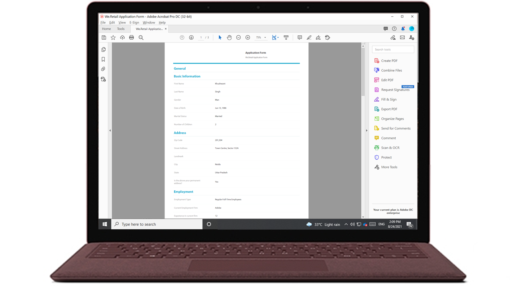
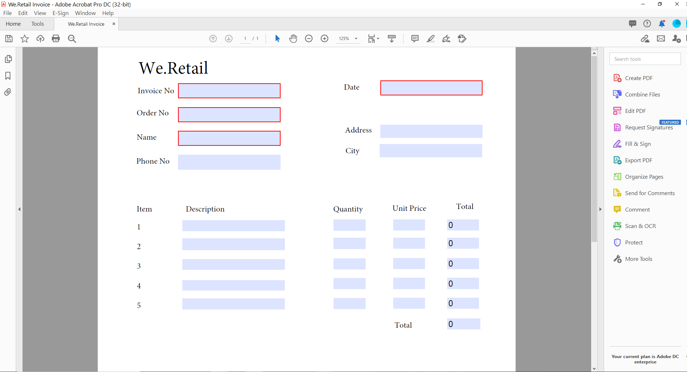
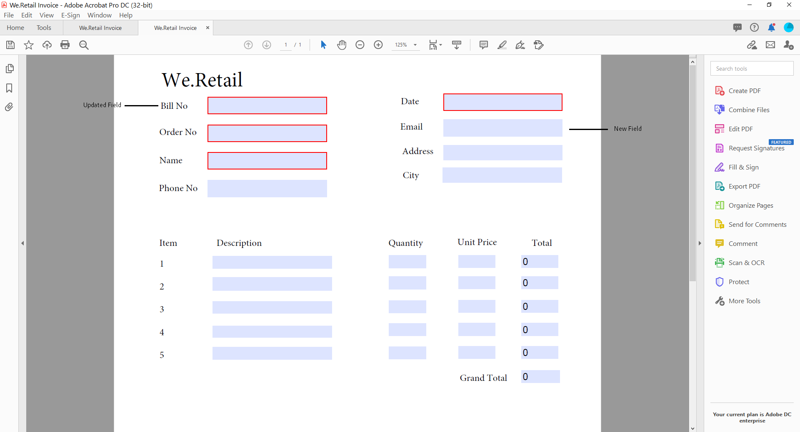
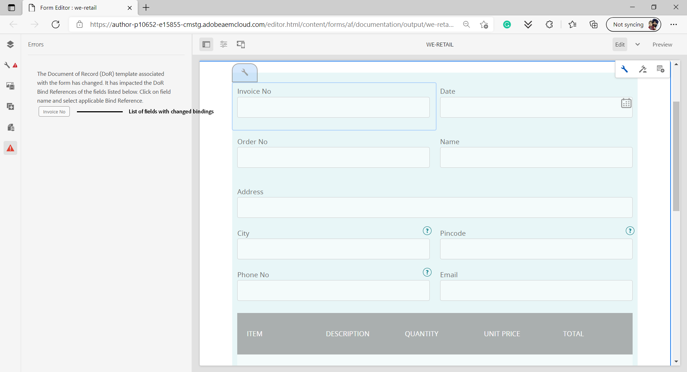
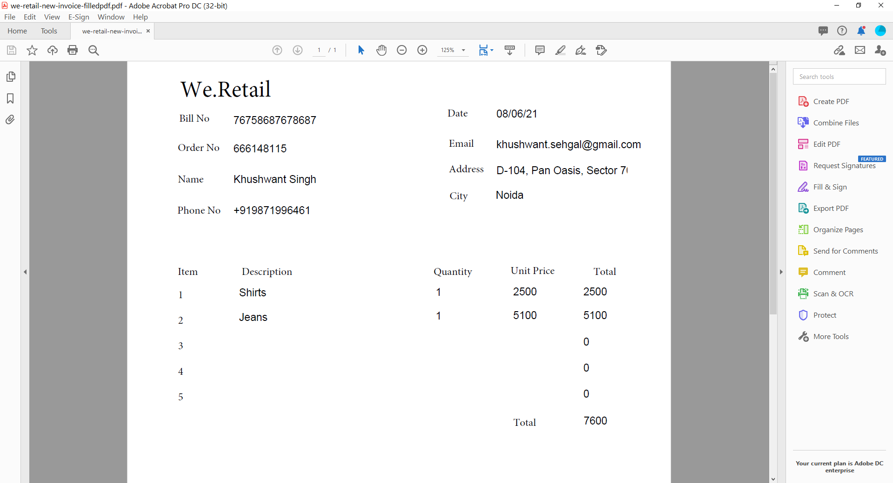
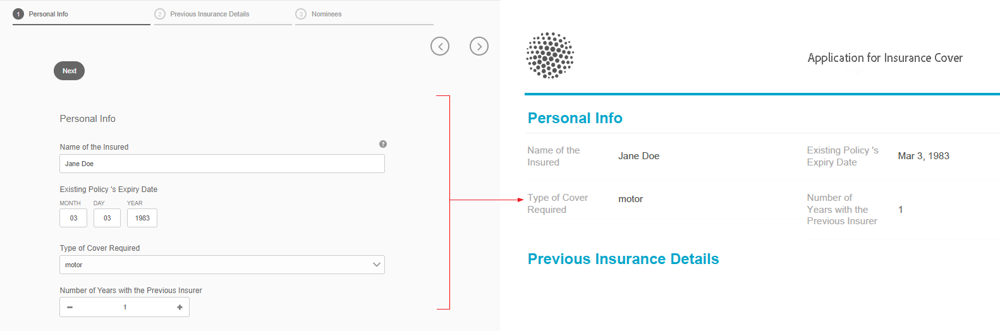

# Generare un PDF di invio (in precedenza documento di record) per Forms adattivo

>[!NOTE]
>
> Adobe consiglia di utilizzare l&#39;acquisizione dati moderna ed estensibile [Componenti core](https://experienceleague.adobe.com/docs/experience-manager-core-components/using/adaptive-forms/introduction.html?lang=it) per [la creazione di un nuovo Forms adattivo](/help/forms/creating-adaptive-form-core-components.md) o [l&#39;aggiunta di Forms adattivo alle pagine AEM Sites](/help/forms/create-or-add-an-adaptive-form-to-aem-sites-page.md). Questi componenti rappresentano un progresso significativo nella creazione di Forms adattivi, garantendo esperienze utente straordinarie. Questo articolo descrive un approccio precedente all’authoring di Forms adattivi utilizzando i componenti di base.


| Versione | Collegamento articolo |
| -------- | ---------------------------- |
| AEM 6.5 | [Fai clic qui](https://experienceleague.adobe.com/docs/experience-manager-65/forms/adaptive-forms-advanced-authoring/generate-document-of-record-for-non-xfa-based-adaptive-forms.html?lang=it) |
| AEM as a Cloud Service | Questo articolo |

## Panoramica {#overview}

Quando un modulo viene compilato o inviato, è possibile conservarne una registrazione, in formato cartaceo o in formato documento. Questo record è denominato Invio PDF (in precedenza Document of Record, o DoR). Si tratta di un PDF del modulo inviato, adatto alla stampa. È inoltre possibile fare riferimento al PDF di invio per le informazioni che i clienti hanno compilato in una data successiva o utilizzare il PDF di invio per archiviare moduli e contenuti insieme in formato PDF.



Per creare un PDF di invio, un modello basato su XFA o Acroform viene unito ai dati raccolti tramite un modulo adattivo. È possibile generare un PDF di invio automaticamente o su richiesta.
L’opzione on-demand consente di specificare un modello personalizzato basato su XFA o Acroform per fornire un aspetto personalizzato al PDF di invio.

Operazioni disponibili:

* [Generare un PDF di invio basato su XFA](#generate-an-XFA-based-document-of-record)
* [Generare un PDF di invio basato su Acroform (Acrobat Form PDF)](#generate-an-Acroform-based-document-of-record)
* [Generazione automatica di un PDF di invio](#auto-generate-a-document-of-record)

## Prima di iniziare {#components-to-automatically-generate-a-document-of-record}

Prima di iniziare ad apprendere e a preparare le risorse necessarie per un PDF di invio:

**Modello di base:** un modello XFA (file XDP) creato in Forms Designer o in un modulo Acrobat (AcroForm). [Il modello di base](#base-template-of-a-document-of-record) viene utilizzato per specificare le informazioni di stile e branding per un PDF di invio. Carica il modello XFA (file XDP) nell’istanza di AEM Forms prima di

**Modulo adattivo:** Modulo adattivo per il quale deve essere generato il PDF di invio.

## Generare un PDF di invio basato su XFA {#generate-an-XFA-based-document-of-record}

Carica il modello XFA (file XDP) nella tua istanza di AEM Forms. Per configurare un modulo adattivo per l’utilizzo del modello XFA (file XDP) come modello per il PDF di invio, effettua le seguenti operazioni:

1. Nell&#39;istanza di Experience Manager Author, fare clic su **[!UICONTROL Forms]** > **[!UICONTROL Forms e documenti].**
1. Selezionare un modulo e fare clic su **[!UICONTROL Proprietà]**.
1. Nella finestra Proprietà, selezionare **[!UICONTROL Modello modulo]**.
1. Nel menu a discesa **[!UICONTROL Seleziona da]** della scheda **[!UICONTROL Modello modulo]** selezionare **[!UICONTROL Schema]** o **[!UICONTROL Nessuno]**. È inoltre possibile selezionare un modello di modulo durante la creazione di un modulo.
1. Nella sezione Configurazione modello del documento record della scheda Modello modulo, selezionare **Associa modello modulo come modello del documento record**. Quando si seleziona questa opzione, vengono visualizzati tutti i modelli XFA (file XDP) disponibili sul computer. Selezionare il file appropriato. Inoltre, assicurati che venga utilizzato lo stesso schema (schema dati) per il modulo adattivo e il modello XFA selezionato (file XDP).
1. Fai clic su **[!UICONTROL Fine]**

Il modulo adattivo è ora configurato per utilizzare un file XDP come modello per l’invio in PDF. Il passaggio successivo consiste nel [associare i componenti del modulo adattivo ai campi modello corrispondenti](#bind-adaptive-form-components-with-template-fields).

## Generare un PDF di invio basato su Acroform {#generate-an-Acroform-based-document-of-record}

Carica Adobe Acrobat PDF (Acroform) nella tua istanza di AEM Forms. Per configurare un modulo adattivo per l’utilizzo di Adobe Acrobat PDF (Acroform) come modello per PDF di invio, effettua le seguenti operazioni:

1. Nell&#39;istanza di Experience Manager Author, fare clic su **[!UICONTROL Forms]** > **[!UICONTROL Forms e documenti].**
1. Selezionare un modulo e fare clic su **[!UICONTROL Proprietà]**.
1. Nella finestra Proprietà, selezionare **[!UICONTROL Modello modulo]**.
1. Nel menu a discesa **[!UICONTROL Seleziona da]** della scheda **[!UICONTROL Modello modulo]** selezionare **[!UICONTROL Schema]** o **[!UICONTROL Nessuno]**. È inoltre possibile selezionare un modello di modulo durante la creazione di un modulo.
1. Nella sezione Configurazione modello del documento record della scheda Modello modulo, selezionare **Associa modello modulo come modello del documento record**. Selezionando questa opzione, vengono visualizzati tutti i PDF di Acrobat (Acroform) disponibili sul computer. Selezionare il file appropriato.
1. Fai clic su **[!UICONTROL Fine]**

Il modulo adattivo è ora configurato per utilizzare un Acroform come modello per l’invio di PDF. Il passaggio successivo consiste nel [associare i componenti del modulo adattivo ai campi modello corrispondenti](#bind-adaptive-form-components-with-template-fields).

## Genera automaticamente un PDF di invio {#auto-generate-a-document-of-record}

Quando un modulo adattivo è configurato per generare automaticamente un PDF di invio, ogni volta che un modulo viene modificato, il relativo PDF di invio viene aggiornato immediatamente. Ad esempio, se un campo viene rimosso da un modulo adattivo esistente, anche il campo corrispondente viene rimosso e non è visibile nel PDF di invio. Esistono molti altri vantaggi della generazione automatica di un PDF di invio:

* Gli sviluppatori di moduli non devono mantenere manualmente le associazioni dati. Il PDF di invio generato automaticamente si occupa degli aggiornamenti relativi all’associazione dei dati.
* Gli sviluppatori di moduli non devono nascondere manualmente i campi contrassegnati come esclusi dal PDF di invio. I PDF di invio generati automaticamente sono preconfigurati per escludere tali campi.
* L’opzione PDF di invio generato automaticamente consente di risparmiare il tempo necessario per creare un modello di modulo per PDF di invio.
* L’opzione PDF di invio generato automaticamente consente di utilizzare stili e aspetti diversi utilizzando modelli di base diversi. Consente di selezionare lo stile e l’aspetto migliori per il PDF di invio per la tua organizzazione. Se non specificate lo stile, gli stili di sistema vengono impostati come predefiniti.
* Il PDF di invio generato automaticamente garantisce che qualsiasi modifica apportata al modulo venga immediatamente riportata nel PDF di invio.

Per configurare un modulo adattivo in modo da generare automaticamente un PDF di invio, effettua le seguenti operazioni:

1. Nell&#39;istanza di Experience Manager Author, fare clic su **[!UICONTROL Forms]** > **[!UICONTROL Forms e documenti].**
1. Selezionare un modulo e fare clic su **[!UICONTROL Proprietà]**.
1. Nella finestra Proprietà, selezionare **[!UICONTROL Modello modulo]**.
1. Nel menu a discesa **[!UICONTROL Seleziona da]** della scheda **[!UICONTROL Modello modulo]** selezionare **[!UICONTROL Schema]** o **[!UICONTROL Nessuno]**. È inoltre possibile selezionare un modello di modulo durante la creazione di un modulo.
1. Nella sezione Configurazione modello del documento record della scheda Modello modulo, selezionare **Genera documento record**.
1. Fai clic su **[!UICONTROL Fine]**

## Associare i componenti del modulo adattivo ai campi modello {#bind-adaptive-form-components-with-template-fields}

Associa campi modulo adattivo a campi modello per visualizzare i dati del modulo acquisiti nel campo PDF di invio corrispondente. Per associare i componenti del modulo adattivo ai campi modello del PDF di invio corrispondenti:

1. Apri il modulo adattivo configurato per l’utilizzo di un modello di modulo personalizzato per la modifica.

1. Seleziona un componente modulo adattivo e fai clic sull&#39;icona Configura . Apre il browser delle proprietà.

1. Nel browser delle proprietà, sfoglia e seleziona un campo.

   * (Per il modello AcroForm) la proprietà **[!UICONTROL Document of Record Bind Reference field]**.
   * (Per il modello XFA) la proprietà **[!UICONTROL Riferimento associazione modello dati]**.

1. Fai clic su **[!UICONTROL Salva]**.

<!-- 
In the following video, Adaptive Form components are bound with corresponding Acroform template fields and the Document of Record is sent as an email attachment.
-->

Puoi utilizzare Invia e-mail, l&#39;azione di invio del flusso di lavoro di Experience Manager insieme al passaggio [Documento di record e altre azioni di invio](configuring-submit-actions.md) per ricevere un PDF di invio.

## Aggiornamenti incrementali al modello PDF per l’invio {#document-of-record-template-incremental-updates}

I moduli adattivi e i corrispondenti modelli di PDF per l’invio possono evolvere nel corso del tempo. Puoi scegliere di aggiungere, rimuovere o modificare campi in un modulo adattivo o in un modello PDF per l’invio.

Quando modifichi un modello di PDF per l’invio e carichi il modello modificato in AEM Forms, l’editor di Forms adattivo rileva automaticamente le associazioni modificate e ti informa sui componenti del modulo adattivo che richiedono nuove associazioni. Consente di eseguire aggiornamenti incrementali a un modello PDF per l’invio.

Ad esempio, un&#39;organizzazione, *We.Retail*, dispone di un modello di PDF per l&#39;invio basato su AcroForm, *we-retail-invoib.pdf*. Il modello si presenta come segue:



Dopo aver utilizzato il modello per un certo periodo di tempo, l&#39;organizzazione decide di rinominare il campo `invoice-number` nel campo `bill-number` e di acquisire l&#39;indirizzo e-mail degli acquirenti. Uno sviluppatore aggiorna il nome del campo `invoice-number` e aggiunge un campo e-mail al modello. Inoltre, crea una nuova versione del modello denominata *we-retail-invov2.pdf*.



Lo sviluppatore carica il modello aggiornato e lo applica al modulo adattivo. Il modulo adattivo rileva e visualizza automaticamente l’elenco dei campi in cui è stata modificata l’associazione.



Lo sviluppatore di moduli associa i campi di Adaptive Forms al modello di PDF di invio corrispondente.

>[!VIDEO](assets/we-retail-binding.mp4)

Ora, quando il modulo adattivo viene inviato, viene creato un PDF di invio aggiornato.



## Considerazioni chiave durante l’utilizzo del PDF di invio {#key-considerations-when-working-with-document-of-record}

Tieni presenti le considerazioni e le limitazioni seguenti quando lavori su Submission PDF for Adaptive Forms.

* **Supporto Rich Text**: PDF di invio supporta i tag di markup HTML nei campi Rich Text. Per informazioni complete sui tag supportati e considerazioni sull&#39;accessibilità, vedere [Tag di markup HTML supportati in Invio PDF](html-markup-tags-support-in-document-of-record.md).
* I frammenti di documento in un modulo adattivo non vengono visualizzati nel PDF di invio. Tuttavia, sono supportati i frammenti di moduli adattivi.
* L’associazione del contenuto nel PDF di invio generato per un modulo adattivo basato su schema XML non è supportata.
* La versione localizzata di Submission PDF viene creata su richiesta per una lingua quando l’utente richiede il rendering di Submission PDF. La localizzazione del PDF di invio si verifica insieme alla localizzazione del Modulo adattivo. <!-- For more information on localization of Document of Record and Adaptive Forms see Using AEM translation workflow to localize Adaptive Forms and Document of Record.-->

<!-- ## Configure an adaptive form to generate  Document of Record {#adaptive-form-types-and-their-documents-of-record}

While creating an adaptive form, in the Form Model tab of Adaptive Form properties, select one the following option: 

* **None**
  Select the option to create an Adaptive Form without a form model. When the option is selected, the Document of Record is automatically generated for your Adaptive Form.

* **[Associate form template as a Document of Record template](creating-adaptive-form.md#create-an-adaptive-form-based-on-an-xfa-form-template)**
  
  Select the option to use an XFA Form as a template for Document of Record. 

* **[Generate Document of Record](creating-adaptive-form.md#create-an-adaptive-form-based-on-xml-or-json-schema)**
  Select the option to use an XFA Form as a template. When the option is selected, the Document of Record is automatically generated for your Adaptive Form. When you use an XML schema as a template for an Adaptive Form, ensure that the adaptive form and associated XFA Form use the same XML schema as your Adaptive Form
  

When you select a form model, configure Document of Record using options available under Document of Record Template Configuration. See [Document of Record Template Configuration](#document-of-record-template-configuration). -->

## Mappatura degli elementi del modulo adattivo {#mapping-of-adaptive-form-elements}

La tabella seguente descrive i componenti Modulo adattivo e i corrispondenti componenti XFA e se compaiono in un PDF di invio.

### Campi {#fields}

<table>
 <tbody>
  <tr>
   <th>Componente modulo adattivo</th>
   <th>Componente XFA corrispondente</th>
   <th>Incluso per impostazione predefinita nel modello PDF di invio?</th>
   <th>Note</th>
  </tr>
  <tr>
   <td>Pulsante</td>
   <td>Pulsante</td>
   <td>false</td>
   <td> </td>
  </tr>
  <tr>
   <td>Casella di selezione</td>
   <td>Casella di controllo</td>
   <td>vero</td>
   <td> </td>
  </tr>
  <tr>
   <td>Selettore data</td>
   <td>Campo data/ora</td>
   <td>vero</td>
   <td> </td>
  </tr>
  <tr>
   <td>Elenco a discesa</td>
   <td>Elenco a discesa</td>
   <td>vero</td>
   <td> </td>
  </tr>
  <tr>
   <td>Firma a mano</td>
   <td>Disegno a mano</td>
   <td>vero</td>
   <td> </td>
  </tr>
  <tr>
   <td>Casella numerica</td>
   <td>Campo numerico</td>
   <td>vero</td>
   <td> </td>
  </tr>
  <tr>
   <td>Casella password</td>
   <td>Campo password</td>
   <td>false</td>
   <td> </td>
  </tr>
  <tr>
   <td>Pulsante di scelta</td>
   <td>Pulsante di scelta</td>
   <td>vero</td>
   <td> </td>
  </tr>
  <tr>
   <td>Casella di testo</td>
   <td>Campo testo</td>
   <td>vero</td>
   <td> </td>
  </tr>
  <tr>
   <td>Pulsante Ripristina</td>
   <td>Pulsante Ripristina</td>
   <td>false</td>
   <td> </td>
  </tr>
  <tr>
   <td>Pulsante Invia</td>
   <td><p>Pulsante Invia e-mail</p> <p>Pulsante invio HTTP</p> </td>
   <td>false</td>
   <td> </td>
  </tr>
  <tr>
   <td>Termini e condizioni</td>
   <td> </td>
   <td>vero</td>
   <td> </td>
  </tr>
  <tr>
   <td>Allegato file</td>
   <td> </td>
   <td>false</td>
   <td>Non disponibile nel modello PDF di invio. Disponibile solo in Submission PDF tramite allegati.</td>
  </tr>
 </tbody>
</table>

### Contenitori {#containers}

<table>
 <tbody>
  <tr>
   <th>Componente modulo adattivo</th>
   <th>Componente XFA corrispondente</th>
   <th>Note</th>
  </tr>
  <tr>
   <td>Pannello<br /> </td>
   <td>Sottomodulo<br /> </td>
   <td>Il pannello ripetibile viene mappato su una sottomaschera ripetibile.</td>
  </tr>
 </tbody>
</table>

### Componenti statici {#static-components}

| Componente modulo adattivo | Componente XFA corrispondente | Note |
|---|---|---|
| Immagine | Immagine | I componenti TextDraw e Image, sia associati che non associati, vengono sempre visualizzati nel PDF di invio per un modulo adattivo basato su XSD, a meno che non vengano esclusi utilizzando le impostazioni del PDF di invio. |

### Tabelle {#tables}

I componenti della tabella Adaptive Forms, come intestazione, piè di pagina e riga, vengono mappati ai componenti XFA corrispondenti. Puoi mappare i pannelli ripetibili alle tabelle in Submission PDF.

## Modello base di un PDF di invio {#base-template-of-a-document-of-record}

Il modello base fornisce informazioni sullo stile e sull&#39;aspetto a Submission PDF. Consente di personalizzare l’aspetto predefinito del PDF di invio generato automaticamente. È ad esempio possibile utilizzare il modello base per aggiungere il logo della società nell&#39;intestazione e le informazioni sul copyright nel piè di pagina del PDF di invio.

La pagina master da modello base viene utilizzata come pagina master per il modello PDF di invio. La pagina master può contenere informazioni quali l&#39;intestazione di pagina, il piè di pagina e il numero di pagina che è possibile applicare al PDF di invio. È possibile applicare tali informazioni al PDF di invio utilizzando il modello base per la generazione automatica del PDF di invio. L&#39;utilizzo del modello di base consente di modificare le proprietà predefinite dei campi.

Segui sempre le [convenzioni del modello base](#base-template-conventions) durante la progettazione del modello base.

## Convenzioni modello base {#base-template-conventions}

Un modello base viene utilizzato per definire intestazione, piè di pagina, stile e aspetto per un PDF di invio. L&#39;intestazione e il piè di pagina possono includere informazioni quali il logo aziendale e il testo del copyright. La prima pagina master nel modello base viene copiata e utilizzata come pagina master per il PDF di invio, che contiene intestazione, piè di pagina, numero di pagina o qualsiasi altra informazione da visualizzare in tutte le pagine del PDF di invio. Se si utilizza un modello di base non conforme alle convenzioni del modello di base, la prima pagina master del modello di base viene ancora utilizzata nel modello PDF di invio. Si consiglia di progettare il modello di base in base alle relative convenzioni e di utilizzarlo per la generazione automatica di Submission PDF.

**Convenzioni pagina master**

* Nel modello di base, assegnare al sottomodulo principale il nome `AF_METATEMPLATE` e alla pagina master il nome `AF_MASTERPAGE`.

* La pagina master con il nome `AF_MASTERPAGE` che si trova sotto la sottomaschera principale `AF_METATEMPLATE` è preferita per l&#39;estrazione di informazioni su intestazione, piè di pagina e stile.

* Se `AF_MASTERPAGE` è assente, viene utilizzata la prima pagina master presente nel modello di base.

**Convenzioni di stile per i campi**

* Per applicare lo stile ai campi nel PDF di invio, il modello base fornisce i campi che si trovano nel sottomodulo `AF_FIELDSSUBFORM` sotto il sottomodulo principale `AF_METATEMPLATE`.

* Le proprietà di questi campi vengono applicate ai campi nel PDF di invio. Questi campi devono seguire la convenzione di denominazione `AF_<name of field in all caps>_XFO`. Ad esempio, il nome del campo per la casella di controllo deve essere `AF_CHECKBOX_XFO`.

Per creare un modello di base, eseguire le operazioni seguenti in Forms Designer.

1. Fare clic su **[!UICONTROL File]** > **[!UICONTROL Nuovo]**.
1. Seleziona l&#39;opzione **[!UICONTROL Basato su un modello]**.

1. Selezionare la categoria **[!UICONTROL Forms - Documento di record]**.
1. Selezionare **[!UICONTROL Modello base DoR]**.
1. Fai clic su **[!UICONTROL Avanti]** e fornisci le informazioni richieste.

1. (Facoltativo) Modificare lo stile e l&#39;aspetto dei campi che si desidera applicare ai campi nel PDF di invio.
1. Salvare il modulo.

È ora possibile utilizzare il modulo salvato come modello di base per il PDF di invio. Non modificare o rimuovere gli script presenti nel modello di base.

**Modifica del modello di base**

* Se non si applica alcuno stile ai campi nel modello di base, è consigliabile rimuovere tali campi dal modello di base in modo che gli aggiornamenti al modello di base vengano selezionati automaticamente.
* Durante la modifica del modello di base, non rimuovere, aggiungere o modificare gli script.

Segui rigorosamente le convenzioni e le istruzioni di cui sopra per progettare un modello di base.

## Personalizzare le informazioni di branding in Submission PDF {#customize-the-branding-information-in-document-of-record}

Durante la generazione di un PDF di invio, è possibile modificare le informazioni di branding per il PDF di invio nella scheda Documento record. La scheda Documento record include opzioni quali logo, aspetto, layout, intestazione e piè di pagina, liberatoria e se si desidera includere o meno le opzioni di caselle di controllo e pulsanti di scelta non selezionate.

Per localizzare le informazioni di branding immesse nella scheda Documento record, verificare che le impostazioni internazionali del browser siano impostate in modo appropriato. Per personalizzare le informazioni di branding di Submission PDF, effettuare le seguenti operazioni:

1. Selezionare un pannello (pannello principale) nel PDF di invio, quindi selezionare .
1. Seleziona . Viene visualizzata la scheda Documento record.
1. Selezionare il modello predefinito o un modello personalizzato per il rendering del PDF di invio. Se selezioni il modello predefinito, sotto il menu a discesa Modello viene visualizzata un’anteprima in miniatura del PDF di invio.
1. Se si seleziona un modello predefinito o personalizzato, nella scheda Documento record verranno visualizzate alcune delle seguenti proprietà o tutte le proprietà. Specificate le seguenti proprietà per definire l&#39;aspetto del PDF di invio:

   1. **Proprietà di base**:
      * **Modello**: se scegli di selezionare un modello personalizzato, sfoglia e seleziona un XDP nel server [!DNL AEM Forms]. Se desideri utilizzare un modello che non è già presente nel server [!DNL AEM Forms], devi prima caricare XDP nel server [!DNL AEM Forms].
      * **Colore accento**: colore in cui vengono riprodotti il testo di intestazione e le righe di separatore nel PDF di invio.
      * **Famiglia di caratteri**: famiglia di caratteri del testo nel PDF di invio.

        >[!NOTE]
        >
        > AEM Forms offre una varietà di font incorporati che si integrano facilmente con i file PDF. Per visualizzare l&#39;elenco dei caratteri supportati, [fare clic qui](/help/forms/supported-out-of-the-box-fonts.md).

      * **Includi oggetti modulo non associati al modello dati**: l&#39;impostazione della proprietà include campi non associati da Modulo adattivo basato su schema in PDF di invio.
      * **Escludi campi nascosti dal documento di record**: l&#39;impostazione della proprietà identifica i campi nascosti per l&#39;esclusione dal PDF di invio.
      * **Nascondi descrizione pannelli**: l&#39;impostazione della proprietà esclude la descrizione del pannello o della tabella dal PDF di invio. Applicabile per il pannello e la tabella.

      

   2. **Proprietà campo modulo**:
      * **Per i componenti Casella di controllo e Pulsante di opzione, mostrare solo i valori selezionati**: impostando la proprietà verranno visualizzati solo i valori selezionati della casella di controllo e del pulsante di opzione in [!UICONTROL Documento record].
      * **Separatore per più valori**: è possibile scegliere qualsiasi separatore, ad esempio virgola o interruzione di riga, per visualizzare più valori.
      * **Allineamento opzioni**: è possibile selezionare l&#39;allineamento desiderato (Orizzontale, Verticale, Come modulo adattivo) per impostare l&#39;allineamento per i campi, ad esempio la casella di controllo o il pulsante di scelta da visualizzare nel [!UICONTROL Documento record]. Per impostazione predefinita, l&#39;allineamento verticale è impostato per i campi in [!UICONTROL Documento di record]. L&#39;impostazione delle proprietà dalle [!UICONTROL proprietà campo modulo] del DoR sovrascrive le proprietà impostate in [!UICONTROL Allineamento elemento] per i campi di un modulo adattivo. Se si seleziona l&#39;opzione [!UICONTROL Come modulo adattivo], per i campi [!UICONTROL Documento record] viene utilizzato l&#39;allineamento configurato in un&#39;istanza di authoring del modulo adattivo.
      * **Numero di opzioni per l&#39;allineamento orizzontale**:You può impostare il numero di opzioni da visualizzare nel PDF di invio per l&#39;allineamento orizzontale.

      

   3. **Proprietà pagina master**:
      * **Immagine logo**: puoi scegliere di utilizzare l&#39;immagine del logo dal modulo adattivo, sceglierne una da DAM o caricarne una dal computer.
      * **Titolo modulo**: titolo del documento record.
      * **Testo intestazione**: Testo visualizzato nella sezione dell&#39;intestazione del PDF di invio.
      * **Etichetta liberatoria**: etichetta della liberatoria.
      * **Esclusione di responsabilità**: testo che specifica l&#39;ambito dei diritti e degli obblighi relativi all&#39;inoltro PDF.
      * **Testo liberatoria**: testo liberatoria.

      

   >[!NOTE]
   >
   >Se utilizzi un modello di modulo adattivo creato con una versione di Designer precedente alla 6.3, affinché le proprietà Colore accento e Famiglia font funzionino, accertati che nel modello di modulo adattivo nel sottomodulo principale sia presente quanto segue:

   ```xml
   <proto>
   <font typeface="Arial"/>
   <fill>
   <color value="4,166,203"/>
   </fill>
   <edge>
   <color value="4,166,203"/>
   </edge>
   </proto>
   ```

1. Per salvare le modifiche di branding, selezionare **[!UICONTROL Fine]**.

>[!NOTE]
> 
> Per visualizzare il titolo di un modulo personalizzato nel PDF di invio, modifica il **Titolo modulo personalizzato** in **Proprietà documento record** > **Proprietà pagina master**. Questo titolo personalizzato:
> 
> * Viene visualizzato nell’intestazione del PDF generato
> * Viene visualizzato come Titolo nelle proprietà del documento di PDF
> * Appare come titolo della vista iniziale all&#39;apertura del PDF

## Supporto per documenti di record nell’editor di moduli adattivi {#dor-support-in-adaptiveform}

Puoi configurare il modello [!UICONTROL Documento di record] direttamente dall&#39;editor di moduli adattivi o dall&#39;editor di modelli di moduli adattivi.

Esegui i seguenti passaggi dall’istanza di authoring dell’editor di moduli adattivi:

1. Seleziona il componente **[!UICONTROL Contenitore per modulo adattivo (principale)]**.
1. Fai clic sull’icona  per aprire le **[!UICONTROL proprietà]** del contenitore per modulo adattivo.
1. Apri la scheda **[!UICONTROL Modello del documento record]** e seleziona una delle seguenti opzioni:
   * **[!UICONTROL Nessuno]**: quando questa opzione è selezionata, non è stato creato il modello [!UICONTROL Documento record] per il modulo adattivo.
   * **[!UICONTROL Associa modello modulo come modello del documento record]**:When questa opzione è selezionata, il modulo XFA viene utilizzato come modello per il PDF di invio.
   * **[!UICONTROL Genera documento di record]**: quando questa opzione è selezionata, il modello [!UICONTROL Documento di record] viene generato automaticamente per il modulo adattivo.

1. Seleziona  per salvare le proprietà.


>[!NOTE]
>
>Quando il modello [!UICONTROL Documento record] viene creato utilizzando un editor modello modulo adattivo, sono disponibili solo due opzioni nella scheda [!UICONTROL Modello documento record]: [!UICONTROL Nessuno] e [!UICONTROL Genera documento record].

## Layout di tabella e colonna per i pannelli nel PDF di invio {#table-and-column-layouts-for-panels-in-document-of-record}

Il modulo adattivo potrebbe essere lungo e contenere diversi campi modulo. È possibile che non si desideri salvare un PDF di invio come copia esatta del modulo adattivo. Ora puoi scegliere un layout di tabella o colonna per salvare uno o più pannelli Modulo adattivo nel PDF di invio.

Prima di generare un PDF di invio, nelle impostazioni di un pannello, selezionate Layout per il documento di record del pannello come Tabella o Colonna. I campi nel pannello vengono organizzati di conseguenza nel PDF di invio.


Campi in un pannello di cui è stato eseguito il rendering in un layout di tabella nel PDF di invio



Riproduzione dei campi in un pannello in un layout di colonna nel PDF di invio

## Impostazioni PDF di invio {#document-of-record-settings}

Le impostazioni del PDF di invio consentono di scegliere le opzioni da includere nel PDF di invio. Ad esempio, una banca accetta in un modulo nome, età, numero di previdenza sociale e numero di telefono. Il modulo genera un numero di conto bancario e i dettagli della filiale. È possibile scegliere di visualizzare solo il nome, il numero di previdenza sociale, il conto bancario e i dettagli della filiale in PDF di invio.

L’impostazione del componente Documento di record è disponibile nelle relative proprietà. Per accedere alle proprietà di un componente, selezionarlo e fare clic su  nella sovrapposizione. Le proprietà sono elencate nella barra laterale e le impostazioni seguenti sono disponibili.

**Impostazioni a livello di campo**

* **Escludi dal documento record**: impostando la proprietà su true il campo viene escluso dal PDF di invio. Si tratta di una proprietà che supporta lo script denominata `excludeFromDoR`. Il suo comportamento dipende da **Escludi campi dal DoR se nascosto** proprietà a livello di modulo.

* **Visualizza il pannello come tabella:** Se si imposta la proprietà, il pannello viene visualizzato come tabella nel PDF di invio se il pannello contiene meno di 6 campi. Applicabile solo al pannello.
* **Escludi titolo da documento record:** L&#39;impostazione della proprietà esclude il titolo del pannello o della tabella dal PDF di invio. Applicabile solo al pannello e alla tabella.
* **Escludi descrizione da documento record:** L&#39;impostazione della proprietà esclude la descrizione del pannello o della tabella dal PDF di invio. Applicabile solo al pannello e alla tabella.

**Impostazioni livello modulo**

* **Includi campi non associati nel DoR:** L&#39;impostazione della proprietà include campi non associati del modulo adattivo basato su schema in PDF di invio. Per impostazione predefinita è true.
* **Escludere i campi dal DoR se nascosti:** Impostare la proprietà per escludere i campi nascosti dal PDF di invio all&#39;invio del modulo. Quando si abilita [Riconvalida nel server](/help/forms/configuring-submit-actions.md#server-side-revalidation-in-adaptive-form-server-side-revalidation-in-adaptive-form), il server ricalcola i campi nascosti prima di escluderli dal PDF di invio.

## Usa un file XCI personalizzato

Un file XCI consente di impostare varie proprietà di un documento. Forms as a Cloud Service ha un file XCI principale. È possibile utilizzare un file XCI personalizzato per ignorare una o più proprietà predefinite specificate nel file XCI principale. È ad esempio possibile scegliere di incorporare un tipo di carattere in un documento o di attivare la proprietà con tag per tutti i documenti. La tabella seguente specifica le opzioni XCI:

| Opzione XCI | Descrizione |
|--- |--- |
| config/present/pdf/creator | Identifica il creatore del documento utilizzando la voce Creator nel dizionario Document Information. Per informazioni su questo dizionario, vedere la [Guida di riferimento di PDF](https://opensource.adobe.com/dc-acrobat-sdk-docs/acrobatsdk/). |
| config/present/pdf/producer | Identifica il produttore del documento utilizzando la voce Producer nel dizionario Document Information. Per informazioni su questo dizionario, vedere la [Guida di riferimento di PDF](https://opensource.adobe.com/dc-acrobat-sdk-docs/acrobatsdk/). |
| config/present/layout | Controlla se l’output è un singolo pannello o impaginato. |
| config/present/pdf/compression/level | Specifica il grado di compressione da utilizzare durante la generazione di un documento PDF. |
| config/present/pdf/fontInfo/embed | Controlla l&#39;incorporamento del carattere nel documento di output. |
| config/present/pdf/scriptModel | Controlla se le informazioni specifiche XFA vengono incluse nel documento PDF di output. |
| config/present/common/data/adjustData | Controlla se l&#39;applicazione XFA regola i dati dopo l&#39;unione. |
| config/present/pdf/renderPolicy | Controlla se la generazione del contenuto della pagina viene eseguita sul server o differita al client. |
| config/present/common/locale | Specifica le impostazioni locali predefinite utilizzate nel documento di output. |
| config/present/destination | Quando è contenuto da un elemento presente, specifica il formato di output. Quando è contenuto in un elemento openAction, specifica l&#39;azione da eseguire all&#39;apertura del documento in un client interattivo. |
| config/present/output/type | Specifica il tipo di compressione da applicare a un file o il tipo di output da produrre. |
| config/present/common/temp/uri | Specifica l&#39;URI del modulo. |
| config/present/common/template/base | Specifica una posizione di base per gli URI nella progettazione del modulo. Quando questo elemento è assente o vuoto, la posizione della struttura del modulo viene utilizzata come base. |
| config/present/common/log/to | Controlla la posizione in cui vengono scritti i dati di log o di output. |
| config/present/output/to | Controlla la posizione in cui vengono scritti i dati di log o di output. |
| config/present/script/currentPage | Specifica la pagina iniziale all&#39;apertura del documento. |
| config/present/script/exclude | Indica a Forms as a Cloud Service quali eventi ignorare. |
| config/present/pdf/linearized | Controlla se il documento PDF di output è linearizzato. |
| config/present/script/runScript | Controlla il set di script eseguiti da Forms as a Cloud Service. |
| config/present/pdf/tagged | Controlla l&#39;inclusione dei tag nel documento PDF di output. I tag, nel contesto di PDF, sono informazioni aggiuntive incluse in un documento per esporre la struttura logica del documento. I tag facilitano l’accesso facilitato e la riformattazione. Ad esempio, un numero di pagina può essere contrassegnato come un artefatto in modo che un assistente vocale non lo enunci al centro del testo. Sebbene i tag rendano un documento più utile, aumentano anche le dimensioni del documento e il tempo di elaborazione necessario per crearlo. |
| config/present/pdf/fontInfo/alwaysEmbed | Specifica un tipo di carattere incorporato nel documento di output. |
| config/present/pdf/fontInfo/NeverEmbed | Specifica un tipo di carattere che non deve mai essere incorporato nel documento di output. |
| config/present/pdf/pdfa/part | Specifica il numero di versione della specifica PDF/A a cui è conforme il documento. |
| config/present/pdf/pdfa/amd | Specifica il livello di modifica della specifica PDF/A. |
| config/present/pdf/pdfa/conformance | Specifica il livello di conformità con la specifica PDF/A. |
| config/present/pdf/version | Specifica la versione del documento PDF da generare |
| config/present/pdf/version/map | Specifica i caratteri di fallback per il documento |

>[!NOTE]
>
> AEM Forms offre una varietà di font incorporati che si integrano facilmente con i file PDF. Per visualizzare l&#39;elenco dei caratteri supportati, [fare clic qui](/help/forms/supported-out-of-the-box-fonts.md).


### Utilizzare un file XCI personalizzato nell’ambiente Forms as a Cloud Service

1. Aggiungi il file XCI personalizzato al progetto di sviluppo.
1. Specificare la [proprietà in linea](/help/implementing/deploying/configuring-osgi.md) seguente:

   ```JSON
    {
     "xciFilePath": "[path of XCI file]"
    }
   ```

   Ad esempio,

   ```JSON
    {
     "xciFilePath": "/content/dam/formsanddocuments/customMinionProBoldAndTagged.xci"
    }
   ```

1. Distribuisci il progetto nell’ambiente Cloud Service.

### Utilizzare un file XCI personalizzato nell’ambiente di sviluppo Forms as a Cloud Service locale

1. Carica il file XCI nell’ambiente di sviluppo locale.
1. Aprire Gestione configurazione Cloud Service SDK. URL predefinito: <http://localhost:4502/system/console/configMgr>.
1. Individua e apri la configurazione **[!UICONTROL Adaptive Forms and Interactive Communication Web Channel]**.
1. Specifica il percorso del file XCI e fai clic su **[!UICONTROL Salva]**.


## Consulta anche {#see-also}

{{see-also}}
