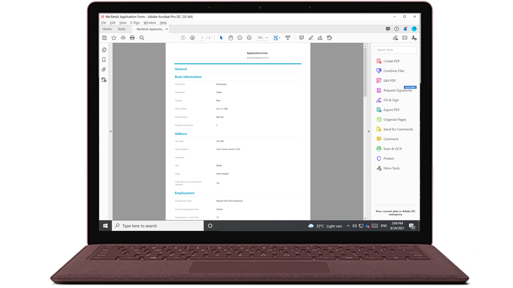

# Genera documento di record per Forms adattivo

## Panoramica {#overview}

Quando un modulo viene compilato o inviato, è possibile conservarne una registrazione, in formato cartaceo o in formato documento. Questo record è denominato documento record (DoR). Si tratta di una copia stampabile del modulo inviato. È inoltre possibile fare riferimento al documento record per le informazioni che i clienti hanno compilato in una data successiva oppure utilizzare il documento record per archiviare moduli e contenuti in formato PDF.



Per creare un documento record, un modello basato su XFA o Acroform viene unito ai dati raccolti tramite un modulo adattivo. È possibile generare un documento di record automaticamente o su richiesta.
L’opzione on-demand consente di specificare un modello personalizzato basato su XFA o Acroform per fornire un aspetto personalizzato al documento record.

Operazioni disponibili:

* [Generare un documento di record basato su XFA](#generate-an-XFA-based-document-of-record)
* [Generare un documento di record basato su Acroform (Acrobat Form PDF)](#generate-an-Acroform-based-document-of-record)
* [Generazione automatica di un documento di record](#auto-generate-a-document-of-record)

## Prima di iniziare {#components-to-automatically-generate-a-document-of-record}

Prima di iniziare ad apprendere e preparare le risorse necessarie per un documento di record:

**Modello di base:** Un modello XFA (file XDP) creato in Forms Designer o in un Acrobat Form (AcroForm). [Modello base](#base-template-of-a-document-of-record) viene utilizzato per specificare lo stile e le informazioni di branding per un documento di record. Carica il modello XFA (file XDP) nell’istanza di AEM Forms prima di

**Modulo adattivo:** Modulo adattivo per il quale deve essere generato il documento di record.

## Generare un documento di record basato su XFA {#generate-an-XFA-based-document-of-record}

Carica il modello XFA (file XDP) nella tua istanza di AEM Forms. Per configurare un modulo adattivo in modo che utilizzi il modello XFA (file XDP) come modello per il documento record, effettua le seguenti operazioni:

1. Nell’istanza Autore Experience Manager, fai clic su **[!UICONTROL Forms]** > **[!UICONTROL Forms e documenti].**
1. Seleziona un modulo e fai clic su **[!UICONTROL Proprietà]**.
1. Nella finestra Proprietà, tocca **[!UICONTROL Modello modulo]**.
1. Il giorno  **[!UICONTROL Modello modulo]** , nella scheda **[!UICONTROL Seleziona da]** a discesa, seleziona **[!UICONTROL Schema]** o **[!UICONTROL Nessuno]**. È inoltre possibile selezionare un modello di modulo durante la creazione di un modulo.
1. Nella sezione Configurazione modello del documento record della scheda Modello modulo, seleziona **Associa modello modulo come modello del documento record**. Quando si seleziona questa opzione, vengono visualizzati tutti i modelli XFA (file XDP) disponibili sul computer. Selezionare il file appropriato. Inoltre, assicurati che venga utilizzato lo stesso schema (schema dati) per il modulo adattivo e il modello XFA selezionato (file XDP).
1. Clic **[!UICONTROL Fine.]**

Il modulo adattivo è ora configurato per utilizzare un file XDP come modello per il documento di record. Il prossimo passo è: [associare componenti Modulo adattivo ai campi modello corrispondenti](#bind-adaptive-form-components-with-template-fields).

## Generare un documento di record basato su Acroform {#generate-an-Acroform-based-document-of-record}

Carica Adobe Acrobat PDF (Acroform) nella tua istanza di AEM Forms. Per configurare un modulo adattivo per l’utilizzo di Adobe Acrobat PDF (Acroform) come modello per documento record, effettua le seguenti operazioni:

1. Nell’istanza Autore Experience Manager, fai clic su **[!UICONTROL Forms]** > **[!UICONTROL Forms e documenti].**
1. Seleziona un modulo e fai clic su **[!UICONTROL Proprietà]**.
1. Nella finestra Proprietà, tocca **[!UICONTROL Modello modulo]**.
1. Il giorno  **[!UICONTROL Modello modulo]** , nella scheda **[!UICONTROL Seleziona da]** a discesa, seleziona **[!UICONTROL Schema]** o **[!UICONTROL Nessuno]**. È inoltre possibile selezionare un modello di modulo durante la creazione di un modulo.
1. Nella sezione Configurazione modello del documento record della scheda Modello modulo, seleziona **Associa modello modulo come modello del documento record**. Selezionando questa opzione, vengono visualizzati tutti i PDF di Acrobat (Acroform) disponibili sul computer. Selezionare il file appropriato.
1. Clic **[!UICONTROL Fine.]**

Il modulo adattivo è ora configurato per utilizzare un Acroform come modello per documento di record. Il prossimo passo è: [associare componenti Modulo adattivo ai campi modello corrispondenti](#bind-adaptive-form-components-with-template-fields).

## Genera automaticamente un documento di record {#auto-generate-a-document-of-record}

Quando un modulo adattivo è configurato per generare automaticamente un documento di record, ogni volta che un modulo viene modificato, il relativo documento di record viene aggiornato immediatamente. Ad esempio, se un campo viene rimosso da un modulo adattivo esistente, anche il campo corrispondente viene rimosso e non è visibile nel documento di record. Esistono molti altri vantaggi della generazione automatica di documenti di record. :

* Gli sviluppatori di moduli non devono mantenere manualmente le associazioni dati. Il documento di record generato automaticamente si occupa degli aggiornamenti relativi all’associazione dei dati.
* Gli sviluppatori di moduli non devono nascondere manualmente i campi contrassegnati come esclusi dal documento di record. Il documento di record generato automaticamente è preconfigurato per escludere tali campi.
* L’opzione Documento di record generato automaticamente consente di risparmiare il tempo necessario per creare un modello di modulo per il documento di record.
* L’opzione Documento di record generato automaticamente consente di utilizzare stili e aspetti diversi utilizzando diversi modelli di base. Consente di selezionare lo stile e l’aspetto migliori per il documento di record per la tua organizzazione. Se non specificate lo stile, gli stili di sistema vengono impostati come predefiniti.
* Il documento di record generato automaticamente assicura che qualsiasi modifica apportata al modulo venga immediatamente riportata nel documento di record.

Per configurare un modulo adattivo in modo da generare automaticamente un documento di record, effettua le seguenti operazioni:

1. Nell’istanza Autore Experience Manager, fai clic su **[!UICONTROL Forms]** > **[!UICONTROL Forms e documenti].**
1. Seleziona un modulo e fai clic su **[!UICONTROL Proprietà]**.
1. Nella finestra Proprietà, tocca **[!UICONTROL Modello modulo]**.
1. Il giorno  **[!UICONTROL Modello modulo]** , nella scheda **[!UICONTROL Seleziona da]** a discesa, seleziona **[!UICONTROL Schema]** o **[!UICONTROL Nessuno]**. È inoltre possibile selezionare un modello di modulo durante la creazione di un modulo.
1. Nella sezione Configurazione modello del documento record della scheda Modello modulo, seleziona **Genera documento di record**.
1. Clic **[!UICONTROL Fine.]**

## Associare i componenti del modulo adattivo ai campi modello {#bind-adaptive-form-components-with-template-fields}

Associa campi modulo adattivo a campi modello per visualizzare i dati del modulo acquisiti nel campo del documento di record corrispondente. Per associare i componenti Modulo adattivo ai campi modello del documento record corrispondenti:

1. Apri il modulo adattivo configurato per l’utilizzo di un modello di modulo personalizzato per la modifica.

1. Seleziona un componente Modulo adattivo e fai clic su Apri Configura  icona. Apre il browser delle proprietà.

1. Nel browser delle proprietà, sfoglia e seleziona un campo.

   * (per il modello AcroForm) **[!UICONTROL Campo di riferimento associazione documento di record]** proprietà.
   * (Per il modello XFA) il **[!UICONTROL Riferimento associazione modello dati]** proprietà.

1. Fai clic su **[!UICONTROL Salva]**.

<!-- 
In the following video Adaptive Form components are binded with corresponding Acroform template fields and the Document of Record is sent as an email attachment.
-->

Puoi utilizzare Invia e-mail, l’azione di invio del flusso di lavoro di Experience Manager insieme a [Passaggio del documento record e altre azioni di invio](configuring-submit-actions.md) per ricevere un documento di record.

## Aggiornamenti incrementali al modello del documento record {#document-of-record-template-incremental-updates}

I moduli adattivi e i corrispondenti modelli di documento record possono evolvere nel corso del tempo. Puoi scegliere di aggiungere, rimuovere o modificare campi in un modulo adattivo o in un modello per documento di record.

Quando apporti modifiche a un modello di documento record e carichi il modello di documento record modificato in AEM Forms, l’editor di Forms adattivo rileva automaticamente le associazioni modificate e ti informa sui componenti del modulo adattivo che richiedono nuove associazioni. Consente di apportare aggiornamenti incrementali a un modello di documento record.

Ad esempio, un’organizzazione, *We.Retail*, dispone di un modello di documento di record basato su AcroForm, *we-retail-invoc.pdf*. Il modello si presenta come segue:


Dopo aver utilizzato il modello per un certo periodo di tempo, l’organizzazione decide di rinominarlo `invoice-number` campo a `bill-number` e acquisire l’indirizzo e-mail degli acquirenti. Uno sviluppatore aggiorna il nome del `invoice-number` e aggiunge un campo e-mail al modello. Crea anche una nuova versione del modello denominata  *we-retail-invov2.pdf*.


Lo sviluppatore carica il modello aggiornato e lo applica al modulo adattivo. Il modulo adattivo rileva e visualizza automaticamente l’elenco dei campi in cui è stata modificata l’associazione.


Lo sviluppatore del modulo associa i campi di Adaptive Forms al modello del documento di record corrispondente.
>[!VIDEO](assets/we-retail-binding.mp4)

Ora, quando il modulo adattivo viene inviato, viene creato un documento di record aggiornato.


## Considerazioni chiave durante l’utilizzo del documento record {#key-considerations-when-working-with-document-of-record}

Quando lavori su un documento di record per Forms adattivo, tieni presenti le considerazioni e le limitazioni seguenti.

* I modelli di documento Record non supportano il formato RTF. Pertanto, qualsiasi testo RTF nel modulo adattivo statico o nelle informazioni fornite dall’utente finale viene visualizzato come testo normale nel documento di record.
* I frammenti di documento in un modulo adattivo non vengono visualizzati nel documento di record. Tuttavia, sono supportati i frammenti di moduli adattivi.
* L’associazione del contenuto nel documento record generato per un modulo adattivo basato su schema XML non è supportata.
* La versione localizzata del documento record viene creata su richiesta per una lingua quando l’utente richiede il rendering del documento record. La localizzazione del documento record si verifica insieme alla localizzazione del modulo adattivo. <!-- For more information on localization of Document of Record and Adaptive Forms see Using AEM translation workflow to localize Adaptive Forms and Document of Record.-->

<!-- ## Configure an adaptive form to generate  Document of Record {#adaptive-form-types-and-their-documents-of-record}

While creating an adaptive form, in the Form Model tab of Adaptive Form properties, select one the following option: 

* **None**
  Select the option to create an Adaptive Form without a form model. When the option is selected, the Document of Record is automatically generated for your Adaptive Form.

* **[Associate form template as a Document of Record template](creating-adaptive-form.md#create-an-adaptive-form-based-on-an-xfa-form-template)**
  
  Select the option to use an XFA Form as a template for Document of Record. 

* **[Generate Document of Record](creating-adaptive-form.md#create-an-adaptive-form-based-on-xml-or-json-schema)**
  Select the option to use an XFA Form as a template. When the option is selected, the Document of Record is automatically generated for your Adaptive Form. When you use an XML schema as a template for an Adaptive Form, ensure that the adaptive form and associated XFA Form use the same XML schema as your Adaptive Form
  

When you select a form model, configure Document of Record using options available under Document of Record Template Configuration. See [Document of Record Template Configuration](#document-of-record-template-configuration). -->

## Mappatura degli elementi del modulo adattivo {#mapping-of-adaptive-form-elements}

La tabella seguente descrive i componenti Modulo adattivo e i corrispondenti componenti XFA e se compaiono in un documento Record.

### Campi {#fields}

<table>
 <tbody>
  <tr>
   <th>Componente modulo adattivo</th>
   <th>Componente XFA corrispondente</th>
   <th>Incluso per impostazione predefinita nel modello del documento record?</th>
   <th>Note</th>
  </tr>
  <tr>
   <td>Pulsante</td>
   <td>Pulsante</td>
   <td>false</td>
   <td> </td>
  </tr>
  <tr>
   <td>Casella di selezione</td>
   <td>Casella di controllo</td>
   <td>vero</td>
   <td> </td>
  </tr>
  <tr>
   <td>Selettore data</td>
   <td>Campo data/ora</td>
   <td>vero</td>
   <td> </td>
  </tr>
  <tr>
   <td>Elenco a discesa</td>
   <td>Elenco a discesa</td>
   <td>vero</td>
   <td> </td>
  </tr>
  <tr>
   <td>Firma a mano</td>
   <td>Disegno a mano</td>
   <td>vero</td>
   <td> </td>
  </tr>
  <tr>
   <td>Casella numerica</td>
   <td>Campo numerico</td>
   <td>vero</td>
   <td> </td>
  </tr>
  <tr>
   <td>Casella password</td>
   <td>Campo password</td>
   <td>false</td>
   <td> </td>
  </tr>
  <tr>
   <td>Pulsante di scelta</td>
   <td>Pulsante di scelta</td>
   <td>vero</td>
   <td> </td>
  </tr>
  <tr>
   <td>Casella di testo</td>
   <td>Campo testo</td>
   <td>vero</td>
   <td> </td>
  </tr>
  <tr>
   <td>Pulsante Ripristina</td>
   <td>Pulsante Ripristina</td>
   <td>false</td>
   <td> </td>
  </tr>
  <tr>
   <td>Pulsante Invia</td>
   <td><p>Pulsante Invia per e-mail</p> <p>Pulsante Invia per HTTP</p> </td>
   <td>false</td>
   <td> </td>
  </tr>
  <tr>
   <td>Termini e condizioni</td>
   <td> </td>
   <td>vero</td>
   <td> </td>
  </tr>
  <tr>
   <td>Allegato file</td>
   <td> </td>
   <td>false</td>
   <td>Non disponibile nel modello del documento record. Disponibile solo nel documento record tramite allegati.</td>
  </tr>
 </tbody>
</table>

### Contenitori {#containers}

<table>
 <tbody>
  <tr>
   <th>Componente modulo adattivo</th>
   <th>Componente XFA corrispondente</th>
   <th>Note</th>
  </tr>
  <tr>
   <td>Pannello<br /> </td>
   <td>Sottomodulo<br /> </td>
   <td>Il pannello ripetibile viene mappato su una sottomaschera ripetibile.</td>
  </tr>
 </tbody>
</table>

### Componenti statici {#static-components}

| Componente modulo adattivo | Componente XFA corrispondente | Note |
|---|---|---|
| Immagine | Immagine | I componenti TextDraw e Image, sia associati che non associati, vengono sempre visualizzati nel documento di record per un modulo adattivo basato su XSD, a meno che non vengano esclusi utilizzando le impostazioni del documento di record. |
| Testo | Testo |

### Tabelle {#tables}

I componenti della tabella Adaptive Forms, come intestazione, piè di pagina e riga, vengono mappati ai componenti XFA corrispondenti. Puoi mappare i pannelli ripetibili alle tabelle nel documento di record.

## Modello base di un documento record {#base-template-of-a-document-of-record}

Il modello base fornisce informazioni sullo stile e sull&#39;aspetto del documento di record. Consente di personalizzare l’aspetto predefinito del documento di record generato automaticamente. Ad esempio, è possibile utilizzare il modello base per aggiungere il logo della società nell&#39;intestazione e le informazioni sul copyright nel piè di pagina del documento record.

La pagina master del modello base viene utilizzata come pagina master per il modello del documento record. La pagina master può contenere informazioni quali intestazione di pagina, piè di pagina e numero di pagina che è possibile applicare al documento di record. È possibile applicare tali informazioni al documento di record utilizzando il modello base per la generazione automatica del documento di record. L&#39;utilizzo del modello di base consente di modificare le proprietà predefinite dei campi.

Segui sempre [Convenzioni modello base](#base-template-conventions) quando si progetta un modello di base.

## Convenzioni modello base {#base-template-conventions}

Un modello di base viene utilizzato per definire intestazione, piè di pagina, stile e aspetto per un documento di record. L&#39;intestazione e il piè di pagina possono includere informazioni quali il logo aziendale e il testo del copyright. La prima pagina master del modello di base viene copiata e utilizzata come pagina master per il documento di record, che contiene intestazione, piè di pagina, numero di pagina o qualsiasi altra informazione da visualizzare in tutte le pagine del documento di record. Se si utilizza un modello di base non conforme alle convenzioni del modello di base, la prima pagina master del modello di base viene ancora utilizzata nel modello del documento record. È consigliabile progettare il modello di base in base alle relative convenzioni e utilizzarlo per la generazione automatica di documenti di record.

**Convenzioni della pagina mastro**

* Nel modello di base, assegna al sottomodulo principale il nome `AF_METATEMPLATE` e la pagina master come `AF_MASTERPAGE`.

* Pagina master con il nome `AF_MASTERPAGE` si trova sotto `AF_METATEMPLATE` la sottomaschera principale è preferibile per l&#39;estrazione di informazioni su intestazione, piè di pagina e stili.

* Se `AF_MASTERPAGE` è assente, viene utilizzata la prima pagina master presente nel modello di base.

**Convenzioni di stile per i campi**

* Per applicare lo stile ai campi del documento record, il modello di base fornisce i campi che si trovano nel `AF_FIELDSSUBFORM` sottometti sotto `AF_METATEMPLATE` sottomodulo principale.

* Le proprietà di questi campi vengono applicate ai campi del documento record. Questi campi devono seguire la `AF_<name of field in all caps>_XFO` convenzione di denominazione. Ad esempio, il nome del campo per la casella di controllo deve essere `AF_CHECKBOX_XFO`.

Per creare un modello di base, eseguire le operazioni seguenti in Forms Designer.

1. Clic **[!UICONTROL File]** > **[!UICONTROL Nuovo]**.
1. Seleziona la **[!UICONTROL In base a un modello]** opzione.

1. Seleziona la **[!UICONTROL Forms - Documento record]** categoria.
1. Seleziona **[!UICONTROL Modello base DoR]**.
1. Clic **[!UICONTROL Successivo]** e fornire le informazioni richieste.

1. (Facoltativo) Modificare lo stile e l&#39;aspetto dei campi che si desidera applicare ai campi del documento record.
1. Salvare il modulo.

È ora possibile utilizzare il modulo salvato come modello di base per il documento di record. Non modificare o rimuovere gli script presenti nel modello di base.

**Modifica del modello di base**

* Se non si applica alcuno stile ai campi nel modello di base, è consigliabile rimuovere tali campi dal modello di base in modo che gli aggiornamenti al modello di base vengano selezionati automaticamente.
* Durante la modifica del modello di base, non rimuovere, aggiungere o modificare gli script.

Segui rigorosamente le convenzioni e le istruzioni di cui sopra per progettare un modello di base.

## Personalizzare le informazioni di branding nel documento record {#customize-the-branding-information-in-document-of-record}

Durante la generazione di un documento record, è possibile modificare le informazioni di branding per il documento record nella scheda Documento record. La scheda Documento record include opzioni quali logo, aspetto, layout, intestazione e piè di pagina, liberatoria e se si desidera includere o meno le opzioni di caselle di controllo e pulsanti di scelta non selezionate.

Per localizzare le informazioni di branding immesse nella scheda Documento record, verificare che le impostazioni internazionali del browser siano impostate in modo appropriato. Per personalizzare le informazioni di branding del documento record, effettuare le seguenti operazioni:

1. Seleziona un pannello (pannello principale) nel documento di record, quindi tocca .
1. Tocca . Viene visualizzata la scheda Documento record.
1. Seleziona il modello predefinito o un modello personalizzato per il rendering del documento di record. Se selezioni il modello predefinito, sotto il menu a discesa Modello viene visualizzata un’anteprima in miniatura del documento di record.
1. A seconda che si selezioni un modello predefinito o personalizzato, nella scheda Documento record vengono visualizzate alcune o tutte le proprietà seguenti. Specificate le seguenti proprietà per definire l&#39;aspetto del documento record:

   1. **Proprietà base**:
      * **Modello**: se scegli di selezionare un modello personalizzato, sfoglia e seleziona un XDP sul tuo [!DNL AEM Forms] server. Se desideri utilizzare un modello che non è già presente nel [!DNL AEM Forms] server, devi prima caricare XDP nel tuo [!DNL AEM Forms] server.
      * **Colore accento**: colore con cui vengono riprodotti il testo dell’intestazione e le righe del separatore nel PDF del documento o del record.
      * **Famiglia font**: famiglia di caratteri del testo nel Document of Record PDF.
      * **Includi oggetti modulo non associati al modello dati**: l’impostazione della proprietà include i campi non associati dal modulo adattivo basato su schema nel documento di record.
      * **Escludi campi nascosti dal documento record**: l’impostazione della proprietà identifica i campi nascosti per l’esclusione dal documento di record.
      * **Nascondi descrizione pannelli**: l’impostazione della proprietà esclude la descrizione del pannello o della tabella dal documento di record. Applicabile per il pannello e la tabella.

      

   1. **Proprietà del campo modulo**:
      * **Per i componenti Casella di controllo e Pulsante di opzione, mostra solo i valori selezionati**: impostando la proprietà vengono visualizzati solo i valori selezionati delle caselle di controllo e dei pulsanti di scelta in [!UICONTROL Documento record].
      * **Separatore per più valori**: per visualizzare più valori, puoi scegliere qualsiasi separatore, ad esempio virgola o interruzione di riga.
      * **Allineamento opzioni**: puoi selezionare l’allineamento desiderato (Orizzontale, Verticale, Come modulo adattivo) per impostare l’allineamento dei campi, ad esempio la casella di controllo o il pulsante di opzione da visualizzare [!UICONTROL Documento record]. Per impostazione predefinita, l’allineamento verticale è impostato per i campi in [!UICONTROL Documento record]. Impostazione delle proprietà da [!UICONTROL Proprietà campo modulo] di DoR sovrascrive le proprietà impostate in [!UICONTROL Allineamento elemento] per i campi di un modulo adattivo. Nel caso, seleziona [!UICONTROL Come modulo adattivo] , l’allineamento configurato in un’istanza di authoring di moduli adattivi viene utilizzato per [!UICONTROL Documento record] campi.
      * **Numero di opzioni per l&#39;allineamento orizzontale**: è possibile impostare il numero di opzioni da visualizzare nel documento di record per l’allineamento orizzontale.

      

   1. **Proprietà pagina mastro**:
      * **Immagine logo**: puoi scegliere di utilizzare l’immagine del logo dal modulo adattivo, sceglierne una da DAM o caricarne una dal computer.
      * **Titolo modulo**: titolo del documento record.
      * **Testo intestazione**: testo che viene visualizzato nella sezione dell’intestazione del documento record.
      * **Etichetta liberatoria**: etichetta della liberatoria.
      * **Esclusione di responsabilità**: testo che specifica la portata dei diritti e degli obblighi sul documento record.
      * **Testo liberatoria**: testo della liberatoria.

      
   >[!NOTE]
   >
   >Se utilizzi un modello di modulo adattivo creato con una versione di Designer precedente alla 6.3, affinché le proprietà Colore accento e Famiglia font funzionino, accertati che nel modello di modulo adattivo nel sottomodulo principale sia presente quanto segue:

   ```xml
   <proto>
   <font typeface="Arial"/>
   <fill>
   <color value="4,166,203"/>
   </fill>
   <edge>
   <color value="4,166,203"/>
   </edge>
   </proto>
   ```

1. Per salvare le modifiche di branding, tocca **[!UICONTROL Fine]**.

## Supporto per documenti di record nell’editor di moduli adattivi {#dor-support-in-adaptiveform}

È possibile configurare [!UICONTROL Documento record] direttamente dall’editor di moduli adattivi o dall’editor di modelli di moduli adattivi.

Esegui i seguenti passaggi dall’istanza di authoring dell’editor di moduli adattivi:

1. Seleziona la **[!UICONTROL Contenitore modulo adattivo (radice)]** componente.
1. Clic  per aprire **[!UICONTROL Proprietà]** del contenitore Modulo adattivo.
1. Apri **[!UICONTROL Modello del documento record]** e selezionare una delle seguenti opzioni:
   * **[!UICONTROL Nessuno]**: quando questa opzione è selezionata, no [!UICONTROL Documento record] modello creato per il modulo adattivo.

   * **[!UICONTROL Associa modello modulo come modello del documento record]**:Quando questa opzione è selezionata, il modulo XFA viene utilizzato come modello per il documento di record.

   * **[!UICONTROL Genera documento di record]**: quando questa opzione è selezionata, il [!UICONTROL Documento record] viene generato automaticamente per il modulo adattivo.

1. Tocca  per salvare le proprietà.


>[!NOTE]
>
>Quando [!UICONTROL Documento record] Il modello viene creato utilizzando un editor di modelli di modulo adattivo, quindi sono disponibili solo due opzioni in [!UICONTROL Modello del documento record] scheda come [!UICONTROL Nessuno] e [!UICONTROL Genera documento di record].

## Layout di tabella e colonna per i pannelli nel documento record {#table-and-column-layouts-for-panels-in-document-of-record}

Il modulo adattivo potrebbe essere lungo e contenere diversi campi modulo. Potrebbe non essere necessario salvare un documento record come copia esatta del modulo adattivo. Ora puoi scegliere un layout di tabella o colonna per salvare uno o più pannelli Modulo adattivo in Document of Record PDF.

Prima di generare un documento di record, nelle impostazioni di un pannello, seleziona Layout per il documento di record del pannello come Tabella o Colonna. I campi nel pannello vengono organizzati di conseguenza nel documento di record.


Campi in un pannello di cui è stato eseguito il rendering in un layout di tabella nel documento record


Campi in un pannello di cui è stato eseguito il rendering in un layout di colonna nel documento record

## Impostazioni del documento record {#document-of-record-settings}

Le impostazioni del documento record consentono di scegliere le opzioni da includere nel documento record. Ad esempio, una banca accetta in un modulo nome, età, numero di previdenza sociale e numero di telefono. Il modulo genera un numero di conto bancario e i dettagli della filiale. È possibile scegliere di visualizzare solo il nome, il numero di previdenza sociale, il conto bancario e i dettagli della filiale nel documento record.

L’impostazione del componente Documento di record è disponibile nelle relative proprietà. Per accedere alle proprietà di un componente, selezionalo e fai clic su  nella sovrapposizione. Le proprietà sono elencate nella barra laterale e le impostazioni seguenti sono disponibili.

**Impostazioni a livello di campo**

* **Escludi da documento record**: impostando la proprietà su true il campo viene escluso dal documento di record. Questa è una proprietà che supporta lo script denominata `excludeFromDoR`. Il suo comportamento dipende da **Escludi campi dal DoR se nascosto** proprietà a livello di modulo.

* **Visualizza pannello come tabella:** Se si imposta la proprietà, il pannello viene visualizzato come tabella nel documento di record se il pannello contiene meno di 6 campi. Applicabile solo al pannello.
* **Escludi titolo da documento record:** L’impostazione della proprietà esclude il titolo del pannello o della tabella dal documento di record. Applicabile solo al pannello e alla tabella.
* **Escludi descrizione da documento record:** L’impostazione della proprietà esclude la descrizione del pannello o della tabella dal documento di record. Applicabile solo al pannello e alla tabella.

**Impostazioni livello modulo**

* **Includi campi non associati nel DoR:** L’impostazione della proprietà include campi non associati dal modulo adattivo basato su schema nel documento di record. Per impostazione predefinita è true.
* **Escludi campi dal DoR se nascosto:** Imposta la proprietà per escludere i campi nascosti dal documento record all’invio del modulo. Quando si abilita [Riconvalida sul server](/help/forms/configuring-submit-actions.md#server-side-revalidation-in-adaptive-form-server-side-revalidation-in-adaptive-form), il server ricalcola i campi nascosti prima di escluderli dal documento di record.

## Usa un file XCI personalizzato

Un file XCI consente di impostare varie proprietà di un documento. Forms as a Cloud Service ha un file XCI principale. È possibile utilizzare un file XCI personalizzato per ignorare una o più proprietà predefinite specificate nel file XCI principale. È ad esempio possibile scegliere di incorporare un tipo di carattere in un documento o di attivare la proprietà con tag per tutti i documenti. La tabella seguente specifica le opzioni XCI:

| Opzione XCI | Descrizione |
|--- |--- |
| config/present/pdf/creator | Identifica il creatore del documento utilizzando la voce Creator nel dizionario Document Information. Per informazioni su questo dizionario, vedere [Guida di riferimento di PDF](https://opensource.adobe.com/dc-acrobat-sdk-docs/acrobatsdk/). |
| config/present/pdf/producer | Identifica il produttore del documento utilizzando la voce Producer nel dizionario Document Information. Per informazioni su questo dizionario, vedere [Guida di riferimento di PDF](https://opensource.adobe.com/dc-acrobat-sdk-docs/acrobatsdk/). |
| config/present/layout | Controlla se l’output è un singolo pannello o impaginato. |
| config/present/pdf/compression/level | Specifica il grado di compressione da utilizzare durante la generazione di un documento PDF. |
| config/present/pdf/fontInfo/embed | Controlla l&#39;incorporamento del carattere nel documento di output. |
| config/present/pdf/scriptModel | Controlla se le informazioni specifiche XFA vengono incluse nel documento di output PDF. |
| config/present/common/data/adjustData | Controlla se l&#39;applicazione XFA regola i dati dopo l&#39;unione. |
| config/present/pdf/renderPolicy | Controlla se la generazione del contenuto della pagina viene eseguita sul server o differita al client. |
| config/present/common/locale | Specifica le impostazioni locali predefinite utilizzate nel documento di output. |
| config/present/destination | Quando è contenuto da un elemento presente, specifica il formato di output. Quando è contenuto in un elemento openAction, specifica l&#39;azione da eseguire all&#39;apertura del documento in un client interattivo. |
| config/present/output/type | Specifica il tipo di compressione da applicare a un file o il tipo di output da produrre. |
| config/present/common/temp/uri | Specifica l&#39;URI del modulo. |
| config/present/common/template/base | Specifica una posizione di base per gli URI nella progettazione del modulo. Quando questo elemento è assente o vuoto, la posizione della struttura del modulo viene utilizzata come base. |
| config/present/common/log/to | Controlla la posizione in cui vengono scritti i dati di log o di output. |
| config/present/output/to | Controlla la posizione in cui vengono scritti i dati di log o di output. |
| config/present/script/currentPage | Specifica la pagina iniziale all&#39;apertura del documento. |
| config/present/script/exclude | Indica a Forms as a Cloud Service quali eventi ignorare. |
| config/present/pdf/linearized | Controlla se il documento PDF di output è linearizzato. |
| config/present/script/runScript | Controlla il set di script eseguiti da Forms as a Cloud Service. |
| config/present/pdf/tagged | Controlla l&#39;inclusione dei tag nel documento PDF di output. I tag, nel contesto di PDF, sono informazioni aggiuntive incluse in un documento per esporre la struttura logica del documento. I tag facilitano l’accesso facilitato e la riformattazione. Ad esempio, un numero di pagina può essere contrassegnato come un artefatto in modo che un assistente vocale non lo enunci al centro del testo. Sebbene i tag rendano un documento più utile, aumentano anche le dimensioni del documento e il tempo di elaborazione necessario per crearlo. |
| config/present/pdf/fontInfo/alwaysEmbed | Specifica un tipo di carattere incorporato nel documento di output. |
| config/present/pdf/fontInfo/NeverEmbed | Specifica un tipo di carattere che non deve mai essere incorporato nel documento di output. |
| config/present/pdf/pdfa/part | Specifica il numero di versione della specifica PDF/A a cui è conforme il documento. |
| config/present/pdf/pdfa/amd | Specifica il livello di modifica della specifica PDF/A. |
| config/present/pdf/pdfa/conformance | Specifica il livello di conformità con la specifica PDF/A. |
| config/present/pdf/version | Specifica la versione del documento PDF da generare |
| config/present/pdf/version/map | Specifica i caratteri di fallback per il documento |

### Utilizzare un file XCI personalizzato nell’ambiente as a Cloud Service di Forms

1. Aggiungi il file XCI personalizzato al progetto di sviluppo.
1. Specifica quanto segue [proprietà inline](/help/implementing/deploying/configuring-osgi.md):

   ```JSON
    {
     "xciFilePath": "[path of XCI file]"
    }
   ```

   Ad esempio:

   ```JSON
    {
     "xciFilePath": "/content/dam/formsanddocuments/customMinionProBoldAndTagged.xci"
    }
   ```

1. Distribuisci il progetto nell’ambiente di Cloud Service.

### Utilizzare un file XCI personalizzato nell’ambiente di sviluppo as a Cloud Service Forms locale

1. Carica il file XCI nell’ambiente di sviluppo locale.
1. Apri Cloud Service SDK Configuration Manager. L’URL predefinito è: <http://localhost:4502/system/console/configMgr>.
1. Individuare e aprire **[!UICONTROL Canale web di comunicazione interattiva e Forms adattivo]** configurazione.
1. Specifica il percorso del file XCI e fai clic su **[!UICONTROL Salva]**.
