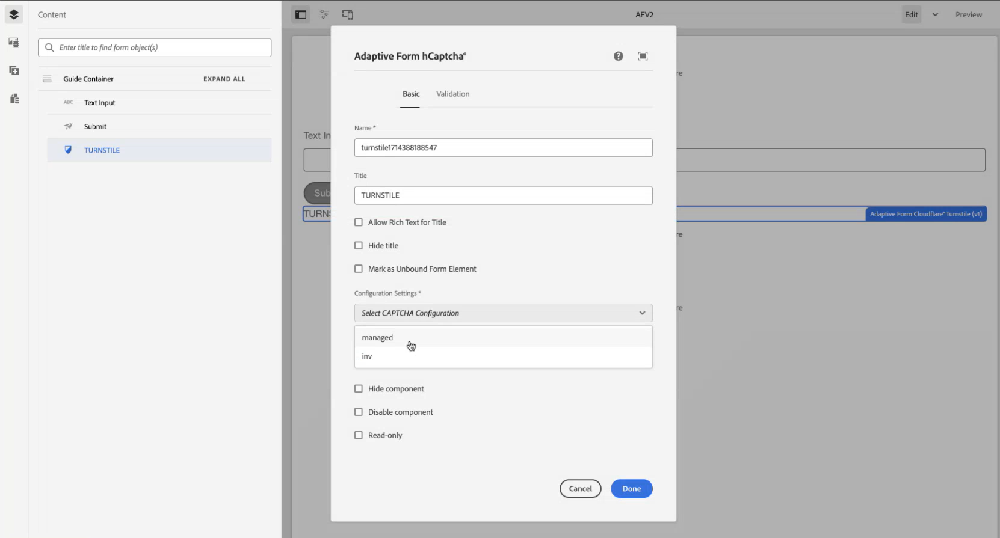

# Collegare l’ambiente AEM Forms con Turnstile {#connect-your-forms-environment-with-turnstile-service}

 Questa funzione è disponibile nel programma di adozione anticipata. Puoi scrivere a aem-forms-ea@adobe.com dal tuo ID e-mail ufficiale per partecipare al programma early adopter e richiedere l’accesso alla funzionalità. 

Il CAPTCHA (Completely Automated Public Turing test to tell Computers and Humans Apart) è un programma comunemente utilizzato nelle transazioni online per distinguere tra esseri umani e programmi o bot automatizzati. Rappresenta una sfida e valuta la risposta dell’utente per determinare se si tratta di un essere umano o di un bot che interagisce con il sito. Impedisce all’utente di procedere se il test non riesce e contribuisce a rendere sicure le transazioni online impedendo ai bot di pubblicare spam o avere scopi dannosi.

AEM Forms as a Cloud Service supporta le seguenti soluzioni CAPTCHA:

* [Tornello Cloudflare](#integrate-aem-forms-environment-with-turnstile-captcha)
* [Google reCAPTCHA](/help/forms/captcha-adaptive-forms-core-components.md)
* [hCaptcha](/help/forms/integrate-adaptive-forms-hcaptcha-core-components.md)

<!-- -->

## Integrare l’ambiente AEM Forms con Turnstile Captcha

Il Turnstile Captcha di Cloudflare è una misura di sicurezza che mira a proteggere moduli e siti da bot automatizzati, attacchi dannosi, spam e traffico automatizzato indesiderato. Presenta una casella di controllo all’invio del modulo per verificare che sia umana, prima di consentire loro di inviare il modulo. AEM Forms as a Cloud Service supporta Turnstile Captcha nei componenti core di Forms adattivi.

### Prerequisiti per integrare l’ambiente AEM Forms con Turnstile Captcha {#prerequisite}

Per configurare Turnstile per i componenti core di AEM Forms, è necessario ottenere [Chiave del sito e chiave segreta](https://developers.cloudflare.com/turnstile/get-started/) dal sito web Turnstile.

### Configura tornello {#steps-to-configure-hcaptcha}

Per integrare AEM Forms con il servizio Turnstile, effettuare le seguenti operazioni:

1. Crea un Contenitore di configurazione nell’ambiente as a Cloud Service AEM Forms. Un contenitore di configurazione contiene le configurazioni cloud utilizzate per collegare l’AEM a servizi esterni. Per creare e configurare un Contenitore di configurazione per collegare il tuo ambiente AEM Forms con Turnstile:
   1. Apri l’istanza as a Cloud Service di AEM Forms.
   1. Vai a **[!UICONTROL Strumenti > Generale > Browser configurazioni]**.
   1. Nel Browser configurazioni, puoi selezionare una cartella esistente o crearne una. Puoi creare una cartella e abilitare per essa l’opzione Configurazioni cloud o Abilitare l’opzione Configurazioni cloud per una cartella esistente:

      * Per creare una cartella e abilitare l’opzione Configurazioni cloud:
         1. Nel browser configurazioni, fai clic su **[!UICONTROL Crea]**.
         1. Nella finestra di dialogo Crea configurazione, specifica un nome e un titolo, quindi seleziona la **[!UICONTROL Configurazioni cloud]** opzione.
         1. Fai clic su **[!UICONTROL Crea]**.
      * Per abilitare l’opzione Configurazioni cloud per una cartella esistente:
         1. Nel browser configurazioni, seleziona la cartella e fai clic su **[!UICONTROL Proprietà]**.
         1. Nella finestra di dialogo Proprietà di configurazione, abilita **[!UICONTROL Configurazioni cloud]**.
         1. Seleziona **[!UICONTROL Salva e chiudi]** per salvare la configurazione e uscire dalla finestra di dialogo.

1. Configurare il Cloud Service:
   1. Nell’istanza di authoring dell’AEM, vai a  > **[!UICONTROL Cloud Service]** e seleziona **[!UICONTROL Tornello]**.
      
   1. Seleziona un Contenitore di configurazione, creato o aggiornato, come descritto nella sezione precedente. Seleziona **[!UICONTROL Crea]**.
      
   1. Specifica **[!UICONTROL Tipo di widget]** come gestito, **[!UICONTROL Titolo]**, **[!UICONTROL Nome]**, **[!UICONTROL Chiave sito]**, e **[!UICONTROL Chiave segreta]** per servizio tornello [ottenuto come prerequisito](#prerequisite).
   1. Fai clic su **[!UICONTROL Crea]**.

      

   >[!NOTE]
   > Gli utenti non devono modificare l’URL di convalida JavaScript lato client e l’URL di convalida lato server, in quanto sono già precompilati per la convalida lato client.

   Una volta configurato, il servizio Turnstile Captcha è disponibile per l’utilizzo in un [Modulo adattivo basato su componenti core](https://experienceleague.adobe.com/en/docs/experience-manager-core-components/using/adaptive-forms/introduction).

## Utilizzare il tornello in un modulo adattivo {#using-turnstile-core-components}

1. Apri l’istanza as a Cloud Service di AEM Forms.
1. Vai a **[!UICONTROL Forms]** > **[!UICONTROL Forms e documenti]**.
1. Seleziona un modulo adattivo e seleziona **[!UICONTROL Proprietà]**. Per **[!UICONTROL Contenitore configurazione]** , seleziona il Contenitore di configurazione contenente la Configurazione cloud che collega AEM Forms a Turnstile e fai clic su **[!UICONTROL Salva e chiudi]**.

   Se non disponi di un contenitore di configurazione di questo tipo, consulta la sezione [Collegare l’ambiente AEM Forms con Turnstile](#connect-your-forms-environment-with-turnstile-service) per scoprire come creare un contenitore di configurazione.

   

1. Seleziona un modulo adattivo e seleziona **[!UICONTROL Modifica]**. Il modulo adattivo si apre nell’editor di Forms adattivo.
1. Dal browser Componenti, trascina o aggiungi il **[!UICONTROL Turnstile modulo adattivo]** nel modulo adattivo.
1. Seleziona la **[!UICONTROL Turnstile modulo adattivo]** e fare clic su proprietà  icona. Apre la finestra di dialogo delle proprietà. Specifica le seguenti proprietà:

   

   * **[!UICONTROL Nome]:** Specificando il nome del componente Captcha, puoi identificare facilmente un componente modulo con il suo nome univoco sia nel modulo che nell’editor di regole.
   * **[!UICONTROL Titolo]:** Specifica il titolo del componente Captcha.
   * **[!UICONTROL Impostazioni di configurazione]:** Seleziona una configurazione cloud configurata per Turnstile.
   * **[!UICONTROL Messaggio di convalida]:** Fornisci un messaggio di convalida per la convalida Captcha all’invio del modulo.
   * **[!UICONTROL Messaggio di convalida script]**: questa opzione consente di immettere un messaggio da visualizzare se la convalida dello script non riesce.
     >[!NOTE]
     >Puoi avere più configurazioni cloud nell’ambiente per uno scopo simile. Quindi, scegli il servizio con attenzione. Se non è elencato alcun servizio, consulta [Collegare l’ambiente AEM Forms con Turnstile](#connect-your-forms-environment-with-turnstile-service) per scoprire come creare un Cloud Service che colleghi il tuo ambiente AEM Forms con il servizio Turnstile.
   * **Messaggio di errore:** Fornisci il messaggio di errore da visualizzare all’utente quando l’invio del Captcha non riesce.

1. Seleziona **[!UICONTROL Fine]**.

Ora, solo le forme legittime, in cui il compilatore di moduli elimina con successo la sfida posta dal servizio Turnstile sono consentite per l&#39;invio del modulo.

## Domande frequenti

* **D: Posso utilizzare più di un componente Captcha in un modulo adattivo?**
* **Ans:** L’utilizzo di più componenti Captcha in un modulo adattivo non è supportato. Inoltre, si sconsiglia di utilizzare un componente Captcha in un frammento o in un pannello contrassegnato per il caricamento lento.

## Consulta anche {#see-also}

{{see-also}}
