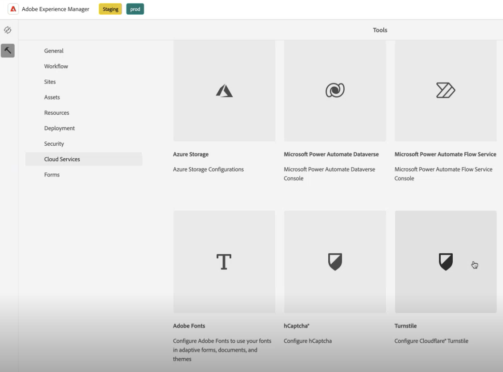
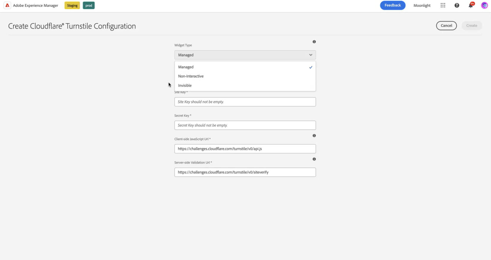

 Questa funzione è in fase di adozione anticipata. Per partecipare al programma per i primi utilizzatori, richiedi l’accesso alla funzionalità inviando una e-mail dal tuo account ufficiale all’indirizzo aem-forms-ea@adobe.com. 

Il CAPTCHA (Completely Automated Public Turing test to tell Computers and Humans Apart) è un programma comunemente utilizzato nelle transazioni online per distinguere tra esseri umani e programmi o bot automatizzati. Rappresenta una sfida e valuta la risposta dell’utente per determinare se si tratta di un essere umano o di un bot che interagisce con il sito. Impedisce all’utente di procedere se il test non riesce e contribuisce a rendere sicure le transazioni online impedendo ai bot di pubblicare spam o avere scopi dannosi.

AEM Forms as a Cloud Service supporta le seguenti soluzioni CAPTCHA:

* [Tornello Cloudflare](#integrate-aem-forms-environment-with-turnstile-captcha)
* [Google reCAPTCHA](/help/forms/captcha-adaptive-forms.md)
* [hCaptcha](/help/forms/integrate-adaptive-forms-hcaptcha.md)

## Integrare l’ambiente AEM Forms con Turnstile Captcha

Il Turnstile Captcha di Cloudflare è una misura di sicurezza che mira a proteggere moduli e siti da bot automatizzati, attacchi dannosi, spam e traffico automatizzato indesiderato. Presenta una casella di controllo all’invio del modulo per verificare che sia umana, prima di consentire loro di inviare il modulo. AEM Forms as a Cloud Service supporta Turnstile Captcha nei componenti core di Forms adattivi.

<!-- -->

### Prerequisiti per integrare l’ambiente AEM Forms con Turnstile Captcha {#prerequisite}

Per configurare Turnstile per i componenti core di AEM Forms, è necessario ottenere la [chiave del sito e la chiave segreta](https://developers.cloudflare.com/turnstile/get-started/) Turnstile dal sito Web Turnstile.

### Passaggi per configurare Turnstile per AEM Forms{#steps-to-configure-turnstile}

1. Crea un Contenitore di configurazione nell’ambiente AEM Forms as a Cloud Service. Un contenitore di configurazione contiene le configurazioni cloud utilizzate per collegare l’AEM a servizi esterni. Per creare e configurare un Contenitore di configurazione per collegare il tuo ambiente AEM Forms con Turnstile:
   1. Apri la tua istanza di AEM Forms as a Cloud Service.
   1. Vai a **[!UICONTROL Strumenti > Generale > Browser configurazioni]**.
   1. Nel Browser configurazioni, puoi selezionare una cartella esistente o crearne una. Puoi creare una cartella e abilitare per essa l’opzione Configurazioni cloud oppure abilitare l’opzione Configurazioni cloud per una cartella esistente:

      * **Per creare una cartella e abilitare l&#39;opzione Configurazioni cloud**:
         1. Nel browser configurazioni fare clic su **[!UICONTROL Crea]**.
         1. Nella finestra di dialogo Crea configurazione, specifica un nome e un titolo, quindi seleziona l&#39;opzione **[!UICONTROL Configurazioni cloud]**.
         1. Fai clic su **[!UICONTROL Crea]**.
      * Per abilitare l’opzione Configurazioni cloud per una cartella esistente:
         1. Nel Browser configurazioni, selezionare la cartella e selezionare **[!UICONTROL Proprietà]**.
         1. Nella finestra di dialogo Proprietà di configurazione, abilita **[!UICONTROL Configurazioni cloud]**.
         1. Seleziona **[!UICONTROL Salva e chiudi]** per salvare la configurazione e uscire dalla finestra di dialogo.

1. Configurare il Cloud Service:
   1. Nell&#39;istanza dell&#39;autore AEM, vai a  > **[!UICONTROL Cloud Service]** e seleziona **[!UICONTROL Turnstile]**.
      
   1. Seleziona un Contenitore di configurazione, creato o aggiornato, come descritto nella sezione precedente. Seleziona **[!UICONTROL Crea]**.
      
   1. Specificare **[!UICONTROL Tipo widget]** come gestito. Il tipo di widget può cambiare in base alla chiave ottenuta nel prerequisito **[!UICONTROL Titolo]**, **[!UICONTROL Nome]**, **[!UICONTROL Chiave sito]** e **[!UICONTROL Chiave segreta]** per il servizio tornstile [ottenuto nel prerequisito](#prerequisite). Seleziona **[!UICONTROL Crea]**.

      

>[!NOTE]
> Gli utenti non devono modificare l’URL di convalida JavaScript lato client e l’URL di convalida lato server, in quanto sono già precompilati per la convalida lato client.

Una volta configurato, il servizio Turnstile Captcha è disponibile per l’utilizzo in un modulo adattivo.

## Utilizzare Turnstile in un modulo adattivo{#using-turnstile-foundation-components}

1. Apri la tua istanza di AEM Forms as a Cloud Service.
1. Vai a **[!UICONTROL Forms]** > **[!UICONTROL Forms e documenti]**.
1. Seleziona un modulo adattivo e seleziona **[!UICONTROL Proprietà]**. Per l&#39;opzione **[!UICONTROL Contenitore configurazione]**, selezionare il Contenitore configurazione che contiene la configurazione cloud che connette AEM Forms con Turnstile, quindi selezionare **[!UICONTROL Salva e chiudi]**.

   Se non disponi di un Contenitore di configurazione di questo tipo, consulta la sezione [Connettere l&#39;ambiente AEM Forms con Turnstile](#connect-your-forms-environment-with-turnstile-service) per scoprire come creare un Contenitore di configurazione.

   

1. Seleziona un modulo adattivo e seleziona **[!UICONTROL Modifica]**. Il modulo adattivo si apre nell’editor di Forms adattivo.
1. Dal browser componenti, trascina il componente **[!UICONTROL Captcha]** nel modulo adattivo.
1. Seleziona il componente **[!UICONTROL Captcha]** e fai clic sull&#39;icona . Apre la finestra di dialogo delle proprietà.

   

   Specifica le seguenti proprietà:

   * **[!UICONTROL Titolo]:** Specifica il titolo del componente Captcha. Puoi identificare facilmente un componente modulo con il suo nome univoco sia nel modulo che nell&#39;editor di regole.
   * **[!UICONTROL Messaggio di convalida]:** Fornisci un messaggio di convalida per la convalida Captcha all&#39;invio del modulo.
   * **[!UICONTROL Convalida Captcha]:** È possibile selezionare una delle opzioni per la convalida Captcha:
      * All’invio del modulo
      * Su un’azione dell’utente.
   * **[!UICONTROL Servizio Captcha]:** Seleziona il servizio Captcha, qui selezioni il servizio Cloudfare Turnstile Captcha.
   * **[!UICONTROL Configurazione Captcha]:** Seleziona una configurazione cloud configurata per Turnstile. ad esempio, qui puoi selezionare la **chiave gestita**.
     >[!NOTE]
     >Puoi avere più configurazioni cloud nell’ambiente per uno scopo simile. Quindi, scegli il servizio con attenzione. Se non è elencato alcun servizio, consulta [Connettere l&#39;ambiente AEM Forms con Turnstile](#connect-your-forms-environment-with-turnstile-service) per scoprire come creare un Cloud Service che connette l&#39;ambiente AEM Forms con il servizio Turnstile.

   * **Messaggio di errore:** Fornisci il messaggio di errore da visualizzare all&#39;utente quando l&#39;invio Captcha non riesce.
   * **Dimensione Captcha:** È possibile selezionare la dimensione di visualizzazione della finestra di dialogo Sfida tornello. Utilizza l&#39;opzione **[!UICONTROL Compatta]** per visualizzare una finestra di dialogo di richiesta di verifica con tornello di piccole dimensioni e l&#39;opzione **[!UICONTROL Normale]** per visualizzare una finestra di dialogo di richiesta di verifica con tornello di dimensioni relativamente grandi.

     >[!NOTE]
     >Questo è applicabile per il tipo di widget Gestito e Non interattivo. Se il tipo di widget è invisibile, la proprietà size non è obbligatoria ed è disabilitata.

1. Seleziona **[!UICONTROL Fine]**.

Ora, solo le forme legittime, in cui il compilatore di moduli elimina con successo la sfida posta dal servizio Turnstile sono consentite per l&#39;invio del modulo.

## Domande frequenti

* **Q: posso utilizzare più di un componente Captcha in un modulo adattivo?**
* **Ans:** L&#39;utilizzo di più componenti Captcha in un modulo adattivo non è supportato. Inoltre, si sconsiglia di utilizzare un componente Captcha in un frammento o in un pannello contrassegnato per il caricamento lento.

## Consulta anche {#see-also}

{{see-also}}
