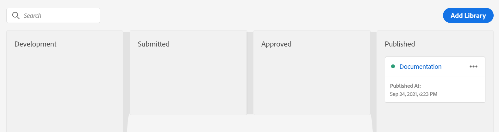

# Analisi dei moduli con Adobe Analytics e AEM Forms: guida completa {#integrate-aem-forms-with-adobe-analytics}

## Cos’è l’analisi dei moduli?

L’analisi dei moduli è il processo di raccolta, misurazione e analisi dei dati sul modo in cui gli utenti interagiscono con i moduli. Fornisce informazioni sul comportamento degli utenti, identifica i colli di bottiglia nel processo di completamento dei moduli e aiuta a ottimizzare i moduli per tassi di conversione migliori.

L’analisi dei moduli va oltre il semplice tracciamento dell’invio per fornire informazioni complete su ogni aspetto dell’esperienza utente. Analizzando il modo in cui gli utenti interagiscono con i singoli campi del modulo, i modelli di navigazione e i comportamenti di completamento, le organizzazioni possono apportare miglioramenti basati sui dati che influiscono in modo significativo sui risultati aziendali.

### Concetti fondamentali di Analytics per i moduli

**Tracciamento interazione utente**
L’analisi dei moduli acquisisce informazioni dettagliate sul modo in cui gli utenti interagiscono con i moduli, tra cui il tempo trascorso su ciascun campo, i movimenti del mouse, il comportamento di scorrimento e i pattern di interazione. Questi dati granulari consentono di identificare i problemi di usabilità e le opportunità di ottimizzazione.

**Analisi del modello comportamentale**
Analizzando i modelli di comportamento degli utenti in più sessioni di modulo, le organizzazioni possono identificare percorsi di utenti comuni, punti di abbandono tipici e percorsi di completamento corretti. Questa analisi consente miglioramenti mirati che soddisfano le reali esigenze degli utenti.

**Misurazione delle prestazioni**
L’analisi dei moduli fornisce metriche quantitative che misurano l’efficacia dei moduli, tra cui tassi di conversione, tempi di completamento, frequenze di errore e indicatori di soddisfazione degli utenti. Queste metriche consentono una valutazione obiettiva delle prestazioni dei moduli e dell’impatto sull’ottimizzazione.

### Perché l’analisi dei moduli è importante per il business

L’analisi dei moduli trasforma i dati grezzi sulle interazioni degli utenti in informazioni aziendali fruibili che determinano miglioramenti misurabili in diverse metriche aziendali chiave:

**Ottimizzazione tasso di conversione**
L’abbandono dei moduli è una sfida aziendale critica che influisce direttamente sui ricavi e sulla generazione di lead. Le ricerche mostrano che il 68% degli utenti abbandona i moduli prima del completamento, rendendo l’analisi dei moduli essenziale per identificare i punti di riconsegna. L’analisi dei moduli consente strategie di ottimizzazione delle conversioni mirate che possono aumentare in modo significativo le prestazioni dei moduli. Un’efficace ottimizzazione della conversione tramite l’analisi dei moduli offre miglioramenti misurabili nella generazione di lead e nell’acquisizione di clienti.

**Miglioramento esperienza utente**
Comprendere le difficoltà degli utenti e i punti critici consente alle organizzazioni di creare esperienze di modulo più fluide e intuitive. Ciò consente di aumentare la soddisfazione dei clienti, ridurre i costi di supporto e migliorare la percezione del marchio.

**Processo decisionale basato sui dati**
Invece di affidarsi a presupposti o best practice, l’analisi dei moduli fornisce dati concreti sull’analisi del comportamento degli utenti. Ciò consente un’ottimizzazione della conversione basata su evidenze che offre risultati significativamente migliori rispetto alle modifiche basate su intuizioni. L’analisi del comportamento degli utenti tramite il tracciamento delle prestazioni dei moduli garantisce che gli sforzi di ottimizzazione si concentrino sulle esigenze effettive degli utenti anziché sulle ipotesi.

**Misurazione e giustificazione del ROI**
L’analisi dei moduli quantifica l’impatto degli sforzi di ottimizzazione, fornendo metriche chiare che dimostrano il valore aziendale. Le organizzazioni possono misurare la correlazione diretta tra miglioramenti dei moduli e risultati aziendali come la generazione di lead, la conversione delle vendite e i costi di acquisizione dei clienti.

**Vantaggio competitivo**
Le esperienze formative superiori diventano un fattore di differenziazione competitivo nell&#39;acquisizione dei clienti. Le organizzazioni che utilizzano l’analisi dei moduli possono creare esperienze utente all’avanguardia in grado di superare la concorrenza e stimolare la crescita della quota di mercato.

### Metriche chiave di analisi dei moduli

Un’analisi efficace dei moduli si concentra sulle metriche che influiscono direttamente sui risultati aziendali e forniscono informazioni fruibili per l’ottimizzazione:

**Metriche di successo primarie**

- **Tasso di conversione modulo**: percentuale di visualizzazioni modulo che restituiscono invii corretti - la misura finale dell&#39;efficacia del modulo
- **Percentuale di abbandono moduli**: dove e perché gli utenti abbandonano la sessione, fornendo informazioni dirette su insight nei problemi di esperienza utente
- **Tempo di completamento**: quanto tempo impiegano gli utenti a completare i moduli, indicando la complessità e la qualità dell&#39;esperienza utente

**Indicatori di prestazioni dettagliati**

- **Analisi a livello di campo**: quali campi specifici causano problemi, consentendo attività di ottimizzazione mirate
- **Analisi del tasso di errore**: problemi di convalida ed errori dell&#39;utente che impediscono il completamento corretto del modulo
- **Modelli di utilizzo della Guida**: quando e dove gli utenti hanno bisogno di assistenza, indicando le aree da migliorare

**Metriche comportamentali avanzate**

- **Analisi del funnel di conversione**: percorso di utenti tramite moduli in più passaggi, con pattern di progressione e abbandono
- **Prestazioni del dispositivo e del browser**: fattori tecnici che influiscono sul completamento in diversi ambienti utente
- **Profondità coinvolgimento utente**: tempo trascorso su moduli, modelli di interazione dei campi e indicatori di attenzione utente

**Metriche di impatto aziendale**

- **Correlazione qualità lead**: rapporto tra il comportamento di completamento del modulo e la conversione del lead e il valore del cliente
- **Prestazioni Source traffico**: quali canali di marketing sono più determinanti per l&#39;invio di moduli di alta qualità
- **Impatto stagionale e sulla campagna**: differenze nelle prestazioni dei moduli in base alle attività di marketing e ai fattori esterni

## Vantaggi di Forms Analytics per il business

L’implementazione di analisi dei moduli offre un valore aziendale misurabile su più dimensioni. Le organizzazioni che sfruttano l’analisi dei moduli riscontrano in genere miglioramenti significativi nei tassi di conversione, nella soddisfazione degli utenti e nell’efficienza operativa.

### &#x200B;1. Ridurre l’abbandono dei moduli e aumentare le conversioni

L’abbandono dei moduli è una sfida aziendale critica che influisce direttamente sui ricavi e sulla generazione di lead:

- **Identificare i punti di riconsegna**: tenere traccia esattamente del punto in cui gli utenti abbandonano i moduli per individuare sezioni o campi problematici
- **Ottimizza flusso modulo**: ridisporre, semplificare o rimuovere i campi che causano i tassi di abbandono più elevati
- **Miglioramenti al test A/B**: verifica diverse varianti di modulo e misurane l&#39;impatto sui tassi di completamento
- **Ottimizzazione mobile**: identifica i problemi specifici dei dispositivi mobili che impediscono il completamento del modulo
- **Monitoraggio in tempo reale**: ricevere avvisi immediati in caso di peggioramento delle prestazioni del modulo

**Impatto aziendale**: in genere le aziende vedono un miglioramento significativo nei tassi di conversione dei moduli dopo l&#39;implementazione di ottimizzazioni basate su Analytics.

### &#x200B;2. Migliorare l’esperienza utente e la soddisfazione

L’analisi dei moduli fornisce informazioni approfondite sul comportamento degli utenti e sui punti critici:

- **Riduci tempo di completamento**: identifica i campi che richiedono troppo tempo per essere completati e semplifica il processo
- **Riduci al minimo la frustrazione degli utenti**: tieni traccia dei pattern di errore e dei problemi di convalida per migliorare l&#39;usabilità dei moduli
- **Ottimizza ordine campi**: disponi i campi nella sequenza più logica e intuitiva
- **Migliorare Guida e orientamento**: identifica dove gli utenti necessitano di assistenza e fornisce assistenza mirata
- **Esperienza multi-dispositivo**: garantisce prestazioni coerenti su desktop, tablet e dispositivi mobili

**Impatto aziendale**: una migliore esperienza utente porta a punteggi più elevati di soddisfazione del cliente e a una maggiore fedeltà al marchio.

### &#x200B;3. Miglioramenti apportati ai moduli basati sui dati

Sostituisci le supposizioni con dati concreti durante l’ottimizzazione dei moduli:

- **Decisioni basate su prove**: utilizza dati sul comportamento effettivo dell&#39;utente anziché presupposti per guidare i miglioramenti
- **Impatto sull&#39;ottimizzazione delle misure**: quantifica i risultati delle modifiche al modulo con analisi prima/dopo
- **Miglioramenti prioritari**: concentrarsi sulle modifiche che avranno il maggiore impatto sulle metriche aziendali
- **Ottimizzazione continua**: stabilisce cicli di miglioramento continui basati sui dati delle prestazioni
- **Segnalazione delle parti interessate**: fornisci metriche concrete per dimostrare le prestazioni dei moduli e il ROI

**Impatto aziendale**: in genere l&#39;ottimizzazione basata sui dati fornisce risultati significativamente migliori rispetto alle modifiche basate sull&#39;intuizione.

### &#x200B;4. Aumentare la qualità dei lead e l&#39;efficienza delle vendite

L’analisi dei moduli consente di ottimizzare non solo la quantità, ma anche la qualità delle richieste:

- **Integrazione punteggio lead**: correlare il comportamento del modulo alla qualità del lead e al potenziale di conversione
- **Attribuzione Source**: scopri quali origini di traffico generano invii di moduli di qualità più elevata
- **Profilatura progressiva**: ottimizzazione di moduli con più passaggi per raccogliere lead più qualificati
- **Informazioni sulla segmentazione**: identifica i modelli nel comportamento del modulo cliente di alto valore
- **Ottimizzazione handoff vendite**: fornire ai team di vendita il contesto relativo alle interazioni del modulo lead

**Impatto aziendale**: i lead di qualità superiore determinano tassi di conversione delle vendite più elevati e una riduzione dei costi di acquisizione dei clienti.

### &#x200B;5. Efficienza operativa e riduzione dei costi

L’analisi dei moduli favorisce i miglioramenti operativi all’interno dell’organizzazione:

- **Riduci ticket assistenza**: identifica e correggi i problemi comuni dei moduli che generano chiamate al servizio clienti
- **Ottimizzazione automatizzata**: imposta avvisi automatizzati e regole di ottimizzazione in base alle soglie delle prestazioni
- **Allocazione risorse**: concentra le risorse di sviluppo su moduli e campi con il maggiore impatto aziendale
- **Monitoraggio della conformità**: tieni traccia delle prestazioni dei moduli per la conformità alle normative e all&#39;accessibilità
- **Efficienza dell&#39;integrazione**: ottimizzazione delle integrazioni da modulo a sistema in base ai modelli di invio

**Impatto aziendale**: i miglioramenti operativi possono ridurre in modo significativo i costi di supporto relativi ai moduli.

### &#x200B;6. Vantaggio competitivo grazie a Forms di qualità superiore

L’analisi dei moduli consente alle organizzazioni di creare esperienze di modulo all’avanguardia:

- **Prestazioni benchmark**: confronto delle prestazioni dei moduli con gli standard di settore e con quelli della concorrenza
- **Opportunità di innovazione**: identifica opportunità di ottimizzazione uniche che i concorrenti potrebbero perdere
- **Fidelizzazione clienti**: esperienze di modulo superiori contribuiscono alla soddisfazione e alla fidelizzazione generali dei clienti
- **Differenziazione del mercato**: utilizza le informazioni analitiche dei moduli per creare vantaggi competitivi nell&#39;esperienza utente
- **Ottimizzazione scalabile**: applica modelli di modulo validi a più prodotti e campagne

**Impatto aziendale**: esperienze di modulo superiori possono diventare un importante differenziatore competitivo nell&#39;acquisizione dei clienti.

## Casi d’uso ed esempi di analisi dei moduli

Il modo in cui l’analisi dei moduli si applica agli scenari reali aiuta le organizzazioni a identificare le opportunità di ottimizzazione e a implementare strategie di misurazione efficaci. Di seguito sono riportati alcuni casi d’uso comuni a diversi settori e tipi di moduli.

### Forms per e-commerce e vendita al dettaglio

**Pagamento e pagamento in Forms**

- **Sfida**: l&#39;abbandono elevato del carrello durante il processo di pagamento influisce direttamente sui ricavi
- **Soluzione di analisi dei moduli**: tieni traccia dei tassi di completamento campo per campo e delle prestazioni dei moduli per identificare i punti di attrito
- **Risultati comuni**: i campi della carta di credito, la convalida dell&#39;indirizzo di spedizione e i passaggi di creazione dell&#39;account causano spesso l&#39;abbandono del modulo
- **Risultati ottimizzazione conversione**: in genere i rivenditori vedono un miglioramento significativo nel completamento dell&#39;estrazione dopo l&#39;ottimizzazione delle prestazioni dei moduli basata su Analytics
- **Analisi del comportamento degli utenti**: tieni traccia dei pattern di abbandono del carrello per capire quando e perché i clienti abbandonano il carrello durante l&#39;acquisto
- **Impatto aziendale**: la riduzione dell&#39;abbandono dei moduli si traduce direttamente in un aumento dei ricavi e in un miglioramento dei costi di acquisizione dei clienti

**Forms di registrazione e garanzia del prodotto**

- **Sfida**: bassi tassi di registrazione dei prodotti che influiscono sull&#39;assistenza clienti e sul marketing
- **Soluzione Analytics**: monitora le percentuali di completamento e identifica l&#39;impatto sul campo opzionale rispetto a quello richiesto
- **Strategia di ottimizzazione**: riduci i campi obbligatori e migliora l&#39;esperienza mobile
- **Impatto aziendale**: tassi di registrazione più elevati migliorano il valore del ciclo di vita del cliente e l&#39;efficienza del supporto

### Generazione di lead e B2B Forms

**Richiesta contatto e demo Forms**

- **Sfida**: bilanciamento della qualità del lead con i tassi di completamento dei moduli e riduzione dell&#39;abbandono dei moduli
- **Soluzione di analisi dei moduli**: verifica della correlazione tra prestazioni dei moduli, lunghezza dei moduli e qualità di conversione dei lead
- **Informazioni chiave**: la profilatura progressiva spesso supera le prestazioni dei moduli a pagina singola lunghi per l&#39;ottimizzazione della conversione
- **Analisi del comportamento degli utenti**: controlla in che modo la lunghezza del modulo influisce sui tassi di completamento e sui punteggi di qualità dei lead
- **Risultati ottimizzazione conversione**: le aziende B2B vedono un miglioramento significativo nella generazione di lead qualificati tramite l&#39;ottimizzazione delle prestazioni dei moduli
- **Impatto aziendale**: una migliore analisi dei moduli porta a lead di qualità superiore e tassi di conversione delle vendite migliorati

**Registrazione webinar ed eventi**

- **Sfida**: massimizzazione della partecipazione all&#39;evento durante la raccolta delle informazioni necessarie
- **Soluzione Analytics**: monitoraggio del completamento della registrazione rispetto alle percentuali di partecipazione effettive
- **Modelli comuni**: moduli più brevi aumentano le registrazioni ma possono ridurre la qualità della partecipazione
- **Best practice**: utilizza le analisi per trovare un equilibrio ottimale tra la lunghezza del modulo e la qualità dei partecipanti

### Forms servizi finanziari

**Richieste di prestito e di credito**

- **Sfida**: applicazioni complesse in più passaggi con tassi di abbandono elevati
- **Soluzione Analytics**: tieni traccia delle percentuali di completamento a ogni passaggio e identifica i punti di riconsegna
- **Informazioni critiche**: i passaggi di caricamento dei documenti e verifica del reddito spesso causano l&#39;abbandono
- **Strategia di ottimizzazione**: fornire indicatori di avanzamento chiari e funzionalità di salvataggio e ripristino
- **Considerazioni normative**: Analytics deve soddisfare i requisiti sulla privacy dei dati finanziari

**Offerta assicurativa e richieste di rimborso Forms**

- **Sfida**: raccolta di informazioni dettagliate mantenendo il coinvolgimento degli utenti
- **Soluzione Analytics**: monitoraggio del time-to-complete e del coinvolgimento a livello di campo
- **Risultati chiave**: la compilazione automatica e i valori predefiniti avanzati migliorano notevolmente i tassi di completamento
- **Impatto aziendale**: il miglioramento del completamento del modulo è direttamente correlato ai tassi di conversione dei criteri

### Forms medicali e medicali

**Registrazione del paziente e assunzione di Forms**

- **Sfida**: raccolta efficiente di informazioni mediche complete
- **Soluzione Analytics**: tieni traccia delle percentuali di completamento in diversi dati demografici dei pazienti
- **Accesso facilitato**: monitoraggio delle prestazioni su diversi dispositivi e strumenti di accesso facilitato
- **Priorità ottimizzazione**: ottimizzazione mobile essenziale per la soddisfazione del paziente
- **Requisiti di conformità**: conformità HIPAA essenziale per tutte le implementazioni di Analytics

**Pianificazione appuntamento Forms**

- **Sfida**: riduzione degli no-show e semplificazione del processo di prenotazione
- **Soluzione Analytics**: correlazione tra il comportamento di completamento del modulo e la partecipazione all&#39;appuntamento
- **Informazioni chiave**: le preferenze di conferma e promemoria influiscono in modo significativo sulla partecipazione
- **Opportunità di integrazione**: connettere analisi moduli con sistemi di gestione appuntamenti

### Forms per istituti di istruzione

**Applicazione e registrazione Forms**

- **Sfida**: gestione di applicazioni con più passaggi complesse con requisiti relativi ai documenti
- **Soluzione Analytics**: tieni traccia delle percentuali di completamento in diverse fasi dell&#39;applicazione
- **Metriche critiche**: modelli di utilizzo di salvataggio e recupero dei dati di completamento
- **Obiettivo ottimizzazione**: l&#39;esperienza mobile diventa sempre più importante per le applicazioni per studenti
- **Considerazioni sulla stagionalità**: le prestazioni variano in modo significativo durante i periodi di applicazione

**Registrazione al corso e feedback su Forms**

- **Sfida**: massimizzare il coinvolgimento degli studenti con i processi amministrativi
- **Soluzione Analytics**: monitora i tassi di completamento e identifica i problemi di esperienza utente
- **Informazioni chiave**: l&#39;integrazione con i portali degli studenti migliora le percentuali di completamento
- **Miglioramento continuo**: la revisione regolare delle analisi è essenziale per l&#39;ottimizzazione semestre-su-semestre

### Scenari comuni di analisi dei moduli

**Ottimizzazione di moduli con più passaggi**

I moduli con più passaggi in genere ottengono tassi di conversione più elevati dell’86% rispetto ai moduli a pagina singola se ottimizzati correttamente:

- **Analisi dettagliata**: tieni traccia delle percentuali di completamento a ogni passaggio del modulo
- **Impatto indicatore di avanzamento**: misura l&#39;effetto delle barre di avanzamento sui tassi di completamento
- **Utilizzo salvataggio e ripresa**: controlla in che modo il salvataggio delle bozze influisce sul completamento finale
- **Prestazioni mobili e desktop**: confronto delle percentuali di completamento tra i dispositivi

**Analisi delle prestazioni a livello di campo**

- **Campi obbligatori e facoltativi**: analisi dell&#39;impatto dei requisiti dei campi al completamento
- **Ottimizzazione dell&#39;ordine dei campi**: verifica di sequenze di campi diverse per un flusso ottimale
- **Modelli di errore di convalida**: identifica gli errori comuni degli utenti e migliora la convalida
- **Efficacia del testo della Guida**: misura l&#39;impatto delle linee guida sui campi sulle percentuali di completamento

**Prestazioni stagionali e campagne**

- **Analisi del Source del traffico**: confronta le prestazioni dei moduli tra i canali di marketing
- **Variazioni stagionali**: tieni traccia dei cambiamenti delle prestazioni dei moduli nel corso dell&#39;anno
- **Integrazione di Campaign**: correlare l&#39;analisi dei moduli con le prestazioni della campagna di marketing
- **Integrazione test A/B**: utilizza Analytics per misurare le varianti di test e ottimizzarle continuamente

## Scenari di implementazione di Real-World Form Analytics

Comprendere scenari di implementazione specifici aiuta le organizzazioni ad applicare in modo efficace l’analisi dei moduli in contesti aziendali diversi. Questi esempi reali mostrano come il tracciamento delle prestazioni dei moduli e l’ottimizzazione della conversione producono risultati di business misurabili.

### Ottimizzazione estrazione e-commerce

**Scenario**: il retailer online sta subendo un abbandono del carrello durante l&#39;estrazione

- **Implementazione di analisi modulo**: tenere traccia dell&#39;abbandono del carrello a livello di modulo con l&#39;analisi campo per campo
- **Risultati chiave**: il completamento del modulo di pagamento è diminuito in modo significativo al passaggio di verifica della carta di credito
- **Strategia di ottimizzazione della conversione**: modulo di pagamento semplificato, aggiunti indicatori di avanzamento, esperienza mobile ottimizzata
- **Risultati**: sostanziale riduzione dell&#39;abbandono dei moduli e aumento dei ricavi
- **Analisi del comportamento degli utenti**: gli utenti di dispositivi mobili identificati hanno registrato tassi di abbandono più elevati, che hanno portato alla riprogettazione della versione mobile

### Ottimizzazione modulo generazione lead

**Scenario**: società di software B2B alle prese con lead di bassa qualità provenienti dai moduli di contatto

- **Sfida sulle prestazioni del modulo**: tassi elevati di completamento dei moduli, ma conversione insufficiente da lead a cliente
- **Soluzione Analytics**: correlare il comportamento di completamento dei moduli con la qualità del lead e i risultati di vendita
- **Approccio di ottimizzazione**: integrazione di profiling progressivo e punteggio di lead implementata
- **Impatto aziendale**: miglioramento significativo della qualità del lead e aumento dei lead qualificati per le vendite
- **Ottimizzazione della conversione**: riduzione dell&#39;abbandono dei moduli e miglioramento della qualifica del lead

### Registrazione e ottimizzazione dell’onboarding

**Scenario**: piattaforma SaaS con abbandono iscrizione elevato durante il processo di onboarding

- **Analisi del comportamento degli utenti**: tieni traccia delle percentuali di completamento della registrazione e identifica i colli di bottiglia durante l&#39;onboarding
- **Informazioni analisi modulo**: abbandono significativo dell&#39;utente durante il passaggio di verifica dell&#39;account
- **Strategia di ottimizzazione**: processo di verifica semplificato, funzionalità di salvataggio e ripristino aggiunte
- **Risultati**: il completamento dell&#39;abbonamento e i tassi di attivazione degli utenti sono notevolmente aumentati
- **Impatto a lungo termine**: migliore completamento dell&#39;onboarding correlato a un valore più elevato per la durata del cliente

## Funzioni di analisi dei moduli in Adobe Analytics

Adobe Analytics fornisce funzionalità di tracciamento dei moduli di livello enterprise che consentono alle organizzazioni di acquisire informazioni dettagliate sulle interazioni degli utenti con i propri moduli. L’integrazione perfetta con AEM Forms offre sia potenti funzionalità di analisi pronte all’uso che sofisticate opzioni di personalizzazione scalabili in base alle esigenze aziendali.

### Perché scegliere Adobe Analytics per l’analisi dei moduli

**Prestazioni su scala Enterprise**
Adobe Analytics gestisce milioni di interazioni di moduli senza deteriorare le prestazioni, rendendolo ideale per siti web a traffico elevato e ambienti aziendali complessi. La solida infrastruttura della piattaforma garantisce una raccolta affidabile dei dati anche durante i periodi di picco di utilizzo.

**Funzionalità di segmentazione avanzate**
A differenza degli strumenti di analisi dei moduli di base, Adobe Analytics consente una segmentazione degli utenti sofisticata in base a comportamento, dati demografici, origini del traffico e criteri di business personalizzati. Ciò consente strategie di ottimizzazione mirate per specifici gruppi di utenti e scenari.

**Avvisi e informazioni in tempo reale**
Monitora le prestazioni dei moduli come avviene con dashboard in tempo reale e avvisi automatizzati. Identificare e risolvere immediatamente i problemi, evitando potenziali perdite di fatturato dovute a problemi di forma o al degrado delle prestazioni.

### Funzionalità di tracciamento predefinite

AEM Forms si integra perfettamente con [Adobe Analytics](https://experienceleague.adobe.com/docs/analytics-learn/tutorials/overview.html?lang=en) per acquisire e tenere traccia automaticamente delle metriche delle prestazioni per i moduli pubblicati. Puoi monitorare il comportamento degli utenti autenticati e anonimi senza ulteriore configurazione.

Prima di implementare l&#39;analisi dei moduli, verifica che l&#39;ambiente [AEM Forms sia configurato correttamente](/help/forms/setup-forms-cloud-service.md) e che [i moduli adattivi siano stati creati](/help/forms/creating-adaptive-form-core-components.md) utilizzando i Componenti core o [Componenti Foundation](/help/forms/creating-adaptive-form.md).

**Tracciamento completo evento modulo:**

Adobe Analytics acquisisce automaticamente un’immagine completa delle interazioni dei moduli utente:

- **Rendering moduli**: tieni traccia delle impression e delle visualizzazioni dei moduli per comprendere la portata e il coinvolgimento iniziale
- **Invii modulo**: monitora i completamenti completati con contesto di invio dettagliato e dati del percorso di utenti
- **Analisi dell&#39;abbandono del modulo**: acquisisci punti di abbandono precisi con granularità a livello di campo e contesto della sessione utente
- **Tracciamento errori di convalida**: registra i tipi di errore, la frequenza e i modelli di risoluzione per identificare i problemi di usabilità
- **Utilizzo del contenuto della Guida**: controlla quando gli utenti accedono alle risorse della Guida, indicando aree di confusione o complessità
- **Interazioni a livello di campo**: tieni traccia del coinvolgimento del singolo campo, del tempo trascorso e dei pattern di interazione
- **Comportamento salvataggio bozza**: comprendi le intenzioni dell&#39;utente e la complessità dei moduli tramite modelli di utilizzo di salvataggio e ripristino
- **Monitoraggio intersessione**: segui gli utenti in più sessioni di moduli per comprendere i percorsi di completamento

**Informazioni comportamentali avanzate:**

- **Analisi del tempo sul campo**: misura quanto tempo gli utenti trascorrono su ciascun campo del modulo per identificare i problemi di complessità
- **Modelli di spostamento del mouse**: tenere traccia dell&#39;esitazione e del coinvolgimento dell&#39;utente attraverso l&#39;analisi del comportamento del cursore
- **Tracciamento profondità scorrimento**: scopri come gli utenti navigano tra i moduli lunghi e identifica la lunghezza ottimale del modulo
- **Modelli di recupero errori**: analizzare la risposta degli utenti agli errori di convalida e il loro recupero

### Tracciamento Evento Personalizzato

Oltre agli eventi di modulo standard, Adobe Analytics consente un sofisticato tracciamento personalizzato:

- **Metriche specifiche per l&#39;azienda**: definisci gli eventi personalizzati utilizzando l&#39;editor di regole per tenere traccia delle interazioni dei moduli specifiche per l&#39;organizzazione
- **Mappatura Percorso utenti**: creazione di eventi personalizzati per tenere traccia di percorsi utente complessi tramite moduli in più passaggi
- **Analisi del funnel di conversione**: imposta eventi personalizzati per misurare punti di conversione e fasi di rilascio specifici
- **Eventi di integrazione**: tieni traccia delle interazioni dei moduli con sistemi e API esterni

### Funzionalità di reporting avanzate

Adobe Analytics fornisce funzionalità di reporting di livello enterprise per le prestazioni dei moduli:

- **Dashboard in tempo reale**: monitora le prestazioni dei moduli e le interazioni degli utenti man mano che si verificano
- **Analisi della segmentazione**: analizza le prestazioni dei moduli tra diversi gruppi di utenti, origini del traffico e dati demografici
- **Visualizzazione funnel**: visualizza la progressione dell&#39;utente tramite moduli con più passaggi e identifica le opportunità di ottimizzazione
- **Analisi per coorte**: tieni traccia dei miglioramenti delle prestazioni dei moduli nel tempo e misura l&#39;impatto dell&#39;ottimizzazione
- **Monitoraggio tra dispositivi**: scopri come gli utenti interagiscono con i moduli su diversi dispositivi e sessioni

### Vantaggi dell&#39;integrazione

L’integrazione di Adobe Analytics e AEM Forms offre vantaggi esclusivi:

- **Piattaforma dati unificata**: combina analisi modulo con un sito Web più ampio e analisi di marketing
- **Integrazione di Adobe Experience Cloud**: sfrutta le connessioni con Adobe Target, Campaign e altre soluzioni Experience Cloud
- **Sicurezza aziendale**: conformità integrata alle normative sulla privacy dei dati e ai requisiti di sicurezza aziendali
- **Architettura scalabile**: gestisci le interazioni dei moduli con volumi elevati senza influire sulle prestazioni
- **Supporto professionale**: accesso ai servizi di supporto e ottimizzazione Enterprise di Adobe

Dopo aver implementato i passaggi di integrazione descritti in questo articolo, puoi configurare e visualizzare report completi in [!DNL Adobe Analytics], come illustrato nel video seguente:

>[!VIDEO](https://video.tv.adobe.com/v/337262)

## Metriche chiave di analisi dei moduli da tracciare

Per un’implementazione efficace dell’analisi dei moduli è necessario concentrarsi sulle metriche che influiscono direttamente sui risultati aziendali. Sapere quali metriche assegnare priorità consente alle organizzazioni di prendere decisioni basate sui dati e ottimizzare le prestazioni dei moduli in modo efficace.

### Metriche delle prestazioni primarie

**Tasso di conversione modulo**

- **Definizione**: percentuale di visualizzazioni modulo che restituiscono invii riusciti
- **Calcolo**: (Invio modulo/Visualizzazioni modulo) × 100
- **Impatto aziendale**: correlato direttamente con la generazione di lead e gli obiettivi di ricavo
- **Obiettivo di ottimizzazione**: varia in base al settore e alla complessità dei moduli

**Frequenza di abbandono moduli**

- **Definizione**: percentuale di utenti che iniziano ma non completano i moduli
- **Calcolo**: (Avvio modulo - Completamenti modulo) / Avvio modulo × 100
- **Informazioni critiche**: identifica i problemi di esperienza utente e le opportunità di ottimizzazione
- **Benchmark**: tassi di abbandono elevati indicano in genere problemi significativi di usabilità

**Tempo medio di completamento**

- **Definizione**: tempo medio impiegato dagli utenti per completare i moduli dall&#39;inizio all&#39;invio
- **Analysis Focus**: identifica i moduli che richiedono troppo tempo e possono frustrare gli utenti
- **Obiettivo di ottimizzazione**: bilancia l&#39;accuratezza con l&#39;efficienza dell&#39;esperienza utente
- **Segmentazione**: confronta i tempi di completamento tra dispositivi, tipi di utente e origini traffico

### Analisi a livello di campo

**Percentuali di abbandono dei campi**

- **Misurazione**: percentuale di utenti che abbandonano i moduli in campi specifici
- **Valore ottimizzazione**: identifica i campi problematici che richiedono semplificazione o rimozione
- **Problemi comuni**: requisiti di convalida complessi, istruzioni non chiare o problemi tecnici
- **Azioni**: assegna priorità agli sforzi di ottimizzazione nei campi con tassi di abbandono più elevati

**Modelli di interazione campi**

- **Percentuali di click-through**: percentuale di utenti interessati da campi modulo specifici
- **Tempo sul campo**: tempo medio trascorso dagli utenti su singoli campi
- **Percentuali errori**: frequenza degli errori di convalida per campi specifici
- **Utilizzo della Guida**: frequenza con cui gli utenti accedono al contenuto della Guida per campi specifici

**Percentuali Di Completamento Campo**

- **Analisi progressiva**: tieni traccia delle percentuali di completamento mentre gli utenti passano da un campo all&#39;altro del modulo
- **Identificazione per l&#39;abbandono**: individuare i percorsi esatti in cui gli utenti abbandonano i moduli
- **Priorità ottimizzazione**: miglioramento dei campi con il tasso di completamento più elevato diminuito

### Metriche esperienza utente

**Analisi del tasso di errore**

- **Errori di convalida**: frequenza e tipi di errori di convalida del modulo
- **Errori tecnici**: problemi a livello di sistema che influiscono sulla funzionalità del modulo
- **Modelli di errore utente**: errori comuni commessi dagli utenti durante la compilazione dei moduli
- **Tracciamento risoluzione**: monitora in che modo i miglioramenti della frequenza di errori influiscono sulla conversione complessiva

**Prestazioni mobili e desktop**

I moduli mobili presentano in genere tassi di abbandono più elevati del 30% rispetto alle versioni desktop, il che rende cruciale l’ottimizzazione specifica per il dispositivo:

- **Tassi di conversione specifici per dispositivo**: confronto delle prestazioni dei moduli tra i tipi di dispositivo
- **Impatto design reattivo**: misura in che modo l&#39;ottimizzazione mobile influisce sulle percentuali di completamento
- **Usabilità interfaccia touch**: analisi dei pattern di interazione specifici per dispositivi mobili
- **Percorso multi-dispositivo**: tieni traccia degli utenti che avviano i moduli su un dispositivo e completano su un altro

**Metriche di caricamento pagina e prestazioni**

I Forms che vengono caricati in meno di 3 secondi hanno tassi di completamento più elevati del 70% rispetto ai moduli più lenti:

- **Tempo di caricamento modulo**: tempo necessario per il rendering completo dei moduli e per renderli interattivi
- **Tempo di risposta campo**: latenza tra input utente e risposta di sistema
- **Tempo di elaborazione invio**: durata dall&#39;invio del modulo alla conferma
- **Impatto sulle prestazioni**: correlazione tra tempi di caricamento e tassi di abbandono

### Metriche di analisi avanzate

**Analisi della segmentazione degli utenti**

- **Prestazioni Source traffico**: confronta i tassi di conversione dei moduli tra i canali di marketing
- **Prestazioni geografiche**: analizza i tassi di completamento dei moduli per località e lingua
- **Analisi del tipo di utente**: confronto delle prestazioni tra utenti nuovi e di ritorno
- **Informazioni demografiche**: comprendere come diversi gruppi di utenti interagiscono con i moduli

**Analisi funnel di conversione**

- **Progressione di moduli con più passaggi**: tenere traccia dell&#39;avanzamento dell&#39;utente tramite moduli complessi
- **Conversione fase per fase**: misura i tassi di completamento a ogni passaggio del modulo
- **Ottimizzazione funnel**: identificazione e risoluzione dei colli di bottiglia nella progressione del modulo
- **Integrazione test A/B**: confronto delle prestazioni funnel tra le varianti di modulo

**Metriche di impatto aziendale**

- **Punteggio qualità lead**: correlare il comportamento di completamento del modulo ai tassi di conversione lead
- **Attribuzione ricavi**: collega le richieste di moduli ai risultati di business effettivi
- **Valore ciclo di vita cliente**: analizzare il valore a lungo termine degli utenti acquisiti tramite moduli diversi
- **Costo per acquisizione**: calcola l&#39;efficienza marketing in base ai dati sulle prestazioni dei moduli

Nella figura seguente sono illustrate le azioni da eseguire prima di visualizzare i report in [!DNL Adobe Analytics]:


## Configurazione di analisi dei moduli per AEM Forms

L’implementazione dell’analisi dei moduli con Adobe Analytics e AEM Forms richiede una configurazione sistematica tra più componenti. Questa sezione fornisce indicazioni complete sulla configurazione, prerequisiti e best practice per un’implementazione corretta.

### Prerequisiti e requisiti

Prima di iniziare l’implementazione di analisi dei moduli, assicurati che l’ambiente soddisfi i seguenti requisiti:

>[!NOTE]
>
>Se riscontri problemi durante l&#39;installazione, consulta la [guida alla risoluzione dei problemi di AEM Forms](/help/forms/troubleshooting-installation-and-configuration.md) per informazioni sui problemi di installazione e configurazione.

**Accesso a Adobe Experience Cloud**

- Organizzazione Adobe Experience Cloud valida con licenze Adobe Analytics
- Accesso amministrativo agli ambienti Adobe Analytics e AEM Forms
- Accesso ad Adobe Launch (Raccolta dati) per la gestione e la configurazione dei tag

**Ambiente AEM Forms**

- [AEM Forms as a Cloud Service](/help/forms/setup-forms-cloud-service.md) o AEM Forms 6.5+ (installazioni on-premise/AMS)
- Funzionalità di authoring e pubblicazione di Forms abilitate
- Assicurati che l&#39;opzione [Forms sia disponibile](/help/forms/troubleshooting-installation-and-configuration.md#forms-option-is-unavailable) nel tuo ambiente AEM
- [Componenti core adattivi di Forms](/help/forms/creating-adaptive-form-core-components.md) o [Componenti di base](/help/forms/creating-adaptive-form.md) disponibili

**Requisiti tecnici**

- Browser web moderni con JavaScript abilitato per il tracciamento dell’analisi dei moduli
- Implementazione del protocollo HTTPS per la trasmissione sicura dei dati
- Configurazioni di firewall e rete appropriate per la raccolta dati di Adobe Analytics

**Autorizzazioni e accesso**

- Ruolo di amministratore Adobe Analytics per la configurazione della suite di rapporti
- Autorizzazioni di AEM Forms Author per la configurazione e la pubblicazione dei moduli
- Accesso per sviluppatori di Adobe Launch per l’implementazione di tag e la creazione di regole

### Guida dettagliata all’implementazione

#### &#x200B;1. Configurare Adobe Analytics {#Configure-adobe-analytics}

Prima di configurare [!DNL Adobe Analytics], creare:

- Un Adobe ID per accedere a [Adobe Experience Cloud](https://experience.adobe.com/#/home).
- Una [suite di rapporti](https://experienceleague.adobe.com/docs/analytics/admin/manage-report-suites/new-report-suite/t-create-a-report-suite.html).


### Installa le estensioni AEM Forms e [!DNL Adobe Analytics] {#install-extensions}

Per configurare le estensioni AEM Forms e [Adobe Analytics](https://experienceleague.adobe.com/docs/experience-platform/tags/extensions/adobe/analytics/overview.html), effettua le seguenti operazioni:

1. Accedi a Adobe Experience Cloud e seleziona un nome appropriato per l’azienda.

1. Seleziona **[!UICONTROL Launch/Data Collection]** e seleziona **[!UICONTROL Vai a Launch/Data Collection]**.

1. Selezionare **[!UICONTROL Nuova proprietà]** e specificare un nome per la configurazione.

1. Specifica un nome di dominio e seleziona **[!UICONTROL Salva]** per salvare la proprietà.

1. Seleziona il nome della configurazione disponibile nell’elenco Proprietà tag.

1. Nella sezione **[!UICONTROL Authoring]**, seleziona **[!UICONTROL Estensioni]**.

1. Seleziona **[!UICONTROL Catalogo]** e **[!UICONTROL Installa]** per l&#39;estensione **[!UICONTROL Adobe Experience Manager Forms]**. **[!UICONTROL Adobe Experience Manager Forms]** viene visualizzato nell&#39;elenco delle estensioni installate disponibili nella scheda **Installed**.

1. Seleziona **[!UICONTROL Installa]** per l&#39;estensione **[!UICONTROL Adobe Analytics]**.
1. Seleziona il nome della suite di rapporti negli elenchi a discesa **[!UICONTROL Suite di rapporti per lo sviluppo]**, **[!UICONTROL Suite di rapporti per la gestione temporanea]** e **[!UICONTROL Suite di rapporti sui prodotti]** e seleziona **[!UICONTROL Salva]** per salvare l&#39;estensione.

### Configurare gli elementi dati {#configure-data-elements}

Puoi selezionare uno qualsiasi degli elementi dati configurati in una regola creata per un evento. Quando si verifica un evento in un modulo adattivo, AEM Forms invia questi elementi dati a [!DNL Adobe Analytics].

Dopo aver installato l&#39;estensione **[!UICONTROL Adobe Experience Manager Forms]**, puoi creare i seguenti elementi dati:

<table>
 <tbody>
  <tr>
   <td>NomeCampo</th>
   <td>FieldTitle</th>
   <td>FormInstance</th>
  </tr>
  <tr>
   <td>NomeModulo<br /> </td>
   <td>FormTitle<br /> </td>
   <td>NomePagina</td>
  </tr>
  <tr>
   <td>PageURL<br /> </td>
   <td>Titolo pannello<br /> </td>
   <td>TimeSpent</td>
  </tr>
 </tbody>
</table>

Per configurare gli elementi dati, effettua le seguenti operazioni:

1. Nella sezione **[!UICONTROL Authoring]**, seleziona **[!UICONTROL Elementi dati]**.

1. Selezionare **[!UICONTROL Crea nuovo elemento dati]**.

1. Specifica un nome per l’elemento dati. Ad esempio, Titolo modulo per il tipo di elemento dati FormTitle.

1. Specifica **[!UICONTROL Adobe Experience Manager Forms]** come nome dell&#39;estensione.

1. Selezionare **[!UICONTROL Tipo elemento dati]**.

1. Seleziona **[!UICONTROL Salva]** per salvare l&#39;elemento dati.

>[!VIDEO](https://video.tv.adobe.com/v/337472)

### Configurare le regole {#configure-rules}

Per creare regole basate sull&#39;estensione **[!UICONTROL Adobe Experience Manager Forms]**, effettua le seguenti operazioni:

1. Nella sezione **[!UICONTROL Authoring]**, seleziona **[!UICONTROL Regole]**.

1. Seleziona **[!UICONTROL Crea nuova regola]**.

1. Specifica un nome per la regola. Ad esempio, Invio modulo per registrare gli invii dei moduli.

1. Nella sezione **[!UICONTROL Eventi]**, seleziona **[!UICONTROL Aggiungi]**.

1. Specifica **[!UICONTROL Adobe Experience Manager Forms]** come nome dell&#39;estensione.

1. Seleziona il tipo di evento. L&#39;input per il campo **[!UICONTROL Name]** viene popolato automaticamente in base al tipo di evento selezionato.

1. Seleziona **[!UICONTROL Mantieni modifiche]** per salvare l&#39;evento.

1. Nella sezione **[!UICONTROL Azioni]**, seleziona **[!UICONTROL Aggiungi]**.

1. Specifica **[!UICONTROL Adobe Analytics]** come nome dell&#39;estensione.

1. Selezionare **[!UICONTROL Imposta variabili]** come tipo di azione. Le opzioni disponibili nell’elenco a discesa includono:

   - **[!UICONTROL Imposta variabili]**: utilizzare questo tipo di azione per definire il tipo di evento per il quale gli elementi dati selezionati vengono inviati da AEM Forms a [!DNL Adobe Analytics].

   - **[!UICONTROL Invia beacon]**: utilizza questo tipo di azione per inviare dati da AEM Forms a [!DNL Adobe Analytics].

   - **[!UICONTROL Cancella variabili]**: utilizzare questo tipo di azione per cancellare la traccia dati in modo che l&#39;evento venga registrato una sola volta in [!DNL Adobe Analytics].

     L&#39;approccio consigliato consiste nell&#39;utilizzare il tipo di azione **[!UICONTROL Imposta variabili]** per configurare l&#39;evento e gli elementi dati, quindi utilizzare **[!UICONTROL Invia beacon]** per inviare i dati, quindi utilizzare **[!UICONTROL Cancella variabili]** per cancellare l&#39;analisi dei dati.

1. Nella sezione **[!UICONTROL Prop]**, mappa le opzioni della suite di rapporti disponibili nell&#39;elenco a discesa con gli elementi dati definiti utilizzando [Configura elementi dati](#configure-data-elements).

   Ad esempio, per inviare l&#39;elemento dati **Titolo modulo** da AEM Forms a [!DNL Adobe Analytics] quando si invia un modulo:
   1. Nella sezione **[!UICONTROL Prop]**, seleziona una proprietà per Titolo modulo disponibile nella suite di rapporti, quindi seleziona  per mapparla al Titolo modulo creato in [Configura elementi dati](#configure-data-elements).

      

   1. Seleziona **[!UICONTROL Aggiungi altro]** per aggiungere altri elementi dati all&#39;elenco.

1. Nella sezione **[!UICONTROL Eventi]**, seleziona un evento tra le opzioni disponibili nella suite di rapporti, quindi seleziona **[!UICONTROL Mantieni modifiche]**.

1. Nella sezione **[!UICONTROL Azioni]**, seleziona + e specifica **[!UICONTROL Adobe Analytics]** come nome dell&#39;estensione.

1. Selezionare **[!UICONTROL Invia beacon]** come tipo di azione. Nel riquadro di destra, selezionare **[!UICONTROL s.t()]** per inviare dati a [!DNL Adobe Analytics] e trattarli come visualizzazioni pagina oppure **[!UICONTROL s.tl()]** per inviare dati a [!DNL Adobe Analytics] e non trattarli come visualizzazioni pagina. Seleziona **[!UICONTROL Mantieni modifiche]**.

1. Nella sezione **[!UICONTROL Azioni]**, seleziona + e specifica **[!UICONTROL Adobe Analytics]** come nome dell&#39;estensione.

1. Selezionare **[!UICONTROL Cancella variabili]** come tipo di azione. Seleziona **[!UICONTROL Mantieni modifiche]**. Dopo aver eseguito questi passaggi, la sezione **[!UICONTROL Azioni]** viene visualizzata come:
   

   Personalizza la sezione **[!UICONTROL Azioni]** in base alle tue esigenze. Ad esempio, è possibile definire due passaggi **Invia beacon** in un flusso di azioni per inviare dati a [!DNL Adobe Analytics] e trattarli come una visualizzazione di pagina in un unico passaggio e inviare dati a [!DNL Adobe Analytics] senza considerarli come visualizzazione di pagina nel secondo passaggio.

   

1. Seleziona **[!UICONTROL Salva]** per salvare la regola.

   Puoi creare regole per tutti i tipi di evento, ad esempio Abbandona, Errore, Visita campo, Aiuto, Rendering, Salva e Invia.

>[!VIDEO](https://video.tv.adobe.com/v/337425)


### Flussi di pubblicazione {#publish-flow}

Dopo aver creato gli elementi dati e averli utilizzati nelle regole, pubblicare la configurazione per raccogliere i dati del modulo in [!DNL Adobe Analytics].

Per pubblicare la configurazione, effettua le seguenti operazioni:

1. Nella sezione **[!UICONTROL Pubblicazione]**, seleziona **[!UICONTROL Flusso di pubblicazione]**.

1. Selezionare **[!UICONTROL Aggiungi libreria]**, specificare un nome e selezionare l&#39;ambiente per la libreria.

1. Seleziona **[!UICONTROL Aggiungi tutte le risorse modificate]**, quindi seleziona **[!UICONTROL Salva e genera in sviluppo]**.

1. Nella sezione **[!UICONTROL Sviluppo]**, seleziona , quindi seleziona **[!UICONTROL Approva e pubblica in produzione]**.

1. Conferma che le modifiche e il flusso di pubblicazione verranno presto visualizzati nella sezione **[!UICONTROL Pubblicato]**.



## &#x200B;2. Configurare AEM Forms {#configure-aem-forms}

Prima di creare una configurazione di Adobe Launch, crea una [configurazione Adobe IMS utilizzando Adobe Launch come soluzione cloud](https://experienceleague.adobe.com/docs/experience-manager-learn/sites/integrations/experience-platform-launch/connect-aem-launch-adobe-io.html).

### Crea configurazione di Adobe Launch {#create-adobe-launch-configuration}

Per creare una configurazione di Adobe Launch, effettua le seguenti operazioni:

1. Nell&#39;istanza di AEM Forms Author, passa a **[!UICONTROL Strumenti]** > **[!UICONTROL Servizi cloud]** > **[!UICONTROL Configurazioni di Adobe Launch]**.

1. Selezionare una cartella per creare la configurazione e selezionare **[!UICONTROL Crea]**.

1. Specifica un titolo per la configurazione nel campo **[!UICONTROL Titolo]**.

1. Seleziona la [configurazione Adobe IMS associata](https://experienceleague.adobe.com/docs/experience-manager-learn/sites/integrations/experience-platform-launch/connect-aem-launch-adobe-io.html).

1. Selezionare il nome dell&#39;azienda utilizzata durante [la configurazione di Adobe Analytics](#Configure-adobe-analytics).

1. Selezionare il nome della proprietà creata durante [la configurazione di Adobe Analytics](#install-extensions).

1. Seleziona **[!UICONTROL Salva e chiudi]**.

1. Pubblica la configurazione.

### Abilita [!DNL Adobe Analytics] per un modulo adattivo {#enable-analytics-adaptive-form}

Per utilizzare la configurazione [!DNL Adobe Launch] in un modulo adattivo esistente:

1. Nell&#39;istanza Autore AEM Forms, passa a **[!UICONTROL Adobe Experience Manager]** > **[!UICONTROL Forms]** > **[!UICONTROL Forms e documenti]**.
1. Seleziona il modulo adattivo e seleziona **[!UICONTROL Proprietà]**.
1. Nella scheda **[!UICONTROL Base]**, seleziona il [contenitore di configurazione](#create-adobe-launch-configuration) utilizzato durante la creazione della configurazione di Adobe Launch.
1. Seleziona **[!UICONTROL Salva e chiudi]**. Modulo adattivo abilitato per [!DNL Adobe Analytics].
1. Pubblica il modulo.

Dopo aver abilitato [!DNL Adobe Analytics] per un modulo adattivo, puoi [convalidare](https://experienceleague.adobe.com/docs/launch-learn/implementing-in-websites-with-launch/implement-solutions/analytics.html?lang=en#validate-the-page-view-beacon) se esiste un flusso di eventi dati appropriato tra AEM Forms e [!DNL Adobe Analytics]. L’integrazione di AEM Forms con Adobe Analytics è completa. Ora puoi [configurare e visualizzare i rapporti in Adobe Analytics](#view-reports-adobe-analytics).

### Creare regole per acquisire eventi personalizzati (facoltativo) {#capture-custom-events}

Crea regole su campi specifici di un modulo adattivo utilizzando un editor di regole per inviare dati di Analytics da un modulo adattivo a [!DNL Adobe Analytics].

In un processo in due fasi, puoi definire una regola su un campo in un modulo adattivo. La regola invia un evento. Il nome dell’evento è mappato a un evento di acquisizione personalizzato in Adobe Launch.

Per creare regole utilizzando un editor di regole in un modulo adattivo:

1. Seleziona il campo e fai clic su  per aprire la pagina dell&#39;editor regole.
1. Definisci una condizione nella sezione [!UICONTROL When] della regola.
1. Nella sezione [!UICONTROL Then] della regola, seleziona **[!UICONTROL Dispatch Event]** dall&#39;elenco a discesa **[!UICONTROL Select Action]**.
1. Specificare il nome dell&#39;evento nel campo **[!UICONTROL Tipo Nome evento]**.

Ad esempio, se la data di nascita è precedente a una determinata data, AEM Forms invia l&#39;evento **Sicurezza**.


Per mappare l&#39;evento a un evento di acquisizione personalizzato in [!DNL Adobe Analytics]:

1. [Crea una regola](#configure-rules).

1. Nella sezione **[!UICONTROL Eventi]**, seleziona **[!UICONTROL Aggiungi]**.

1. Specifica **[!UICONTROL Adobe Experience Manager Forms]** come nome dell&#39;estensione.

1. Selezionare **[!UICONTROL Acquisisci evento personalizzato]** dall&#39;elenco a discesa **[!UICONTROL Tipo evento]**.

1. Specifica il nome dell&#39;evento specificato nel passaggio 4 durante la creazione di una regola utilizzando l&#39;editor di regole.

1. Selezionare **Mantieni modifiche** ed eseguire le altre azioni specificate in [Configura regole](#configure-rules).

## &#x200B;3. Configurare e visualizzare i report in [!DNL Adobe Analytics] {#view-reports-adobe-analytics}

Dopo aver configurato un modulo adattivo per l&#39;invio di dati evento a [!DNL Adobe Analytics], puoi iniziare a visualizzare i rapporti in [!DNL Adobe Analytics]:

1. Selezionare  e **[!UICONTROL Analytics]**.

1. Seleziona **[!UICONTROL Crea progetto]** e seleziona **[!UICONTROL Progetto vuoto]**.

1. Seleziona il nome della suite di rapporti dall’elenco a discesa in alto a destra nella figura a forma libera.

1. Specifica **Titolo modulo** nel testo **[!UICONTROL Cerca elementi dimensione]** per visualizzare tutti i titoli del modulo.

1. Rilascia il titolo del modulo adattivo nella casella di testo **[!UICONTROL Rilascia qui un segmento (o qualsiasi altro componente)]**.

1. Dalla sezione **[!UICONTROL Metriche]**, rilascia gli eventi da monitorare fino a **[!UICONTROL Rilascia qui una metrica (o qualsiasi altro componente)]**.

1. Seleziona  e rilascia un tipo di grafico nella sezione a forma libera. Analogamente, è possibile aggiungere più tipi di grafico alla sezione a forma libera.

1. Selezionate Ctrl + S e specificate un nome per salvare il progetto.

<!--

## Add AEM Forms and Adobe Analytics integration specific rules to Dispatcher {#forms-specific-rules-to-dispatcher}

Add AEM Forms and Adobe Analytics integration specific rules to filter the data traffic that is sent to the backend.

Perform the following steps to add AEM Forms and Adobe Analytics integration specific rules to Dispatcher for Experience Manager Forms as a Cloud Service:

1. Open your AEM Project and navigate to `\src\conf.dispatcher.d\filters`.
1. Open `filters.any` file for editing and add the following rule at the end of the file:

     ```json
     /00XX { /type "allow" /path "/content/forms/af/*" /method "POST" /selectors '(analyticsconfigparser)' /extension '(jsp|json)' }
     ```

1. Save and close the file.
1. Compile and deploy the project to your [!DNL AEM Forms] as a Cloud Service environment.


## Limitations {#limitations}

* Adobe Analytics can track form metrics only for authenticated users.

-->

## Configurazione avanzata analisi modulo

Oltre alla configurazione di base, Adobe Analytics offre opzioni di configurazione avanzate che consentono sofisticate funzionalità di tracciamento e analisi dei moduli. Queste funzioni avanzate consentono alle organizzazioni di ottenere informazioni più approfondite e implementare scenari di analisi complessi.

### Eventi personalizzati e tracciamento

**Creazione di eventi modulo personalizzati**

Gli eventi personalizzati consentono il tracciamento di interazioni specifiche per l’azienda che vanno oltre l’analisi dei moduli standard:

- **Eventi processo aziendale**: tenere traccia delle interazioni dei moduli in linea con flussi di lavoro aziendali specifici
- **Eventi di coinvolgimento degli utenti**: misura i comportamenti avanzati degli utenti come l&#39;anteprima del modulo, l&#39;utilizzo della guida dei campi o il completamento della sezione
- **Eventi di integrazione**: monitorare le interazioni dei moduli con sistemi esterni, API o servizi di terze parti
- **Eventi di prestazioni**: tieni traccia delle metriche delle prestazioni personalizzate, come i tempi di caricamento dei moduli o le percentuali di risposta dei campi

**Approccio all&#39;implementazione**

1. **Definisci i requisiti aziendali**: identifica interazioni modulo specifiche che forniscono valore aziendale
2. **Crea variabili personalizzate**: configura eVar e proprietà personalizzate in Adobe Analytics per dati specifici per l&#39;azienda
3. **Configura editor regole**: utilizza l&#39;editor regole di AEM Forms per attivare eventi personalizzati in base alle interazioni del modulo
4. **Mappa su eventi di Analytics**: connetti eventi modulo personalizzato al tracciamento eventi di Adobe Analytics
5. **Convalida implementazione**: verifica gli eventi personalizzati per garantire una raccolta dati e un reporting accurati

### Impostazione report avanzato

**Configurazione analisi multidimensionale**

- **Analisi tra moduli**: confronto delle prestazioni tra diversi tipi di moduli e processi aziendali
- **Mappatura Percorso utenti**: tieni traccia delle interazioni degli utenti in più moduli e punti di contatto
- **Modellazione attribuzione**: scopri in che modo diversi canali di marketing contribuiscono ai completamenti dei moduli
- **Analisi per coorte**: analisi dei miglioramenti delle prestazioni dei moduli nel tempo e nei segmenti utente

**Configurazione generazione rapporti in tempo reale**

- **Configurazione dashboard in tempo reale**: configura il monitoraggio delle prestazioni dei moduli in tempo reale
- **Configurazione avviso**: impostare avvisi automatici per problemi o anomalie delle prestazioni del modulo
- **Soglie prestazioni**: definizione di intervalli di prestazioni accettabili e trigger di monitoraggio
- **Segnalazione delle parti interessate**: crea rapporti automatizzati per diversi ruoli e responsabilità organizzativi

### Integrazione con altri strumenti di Adobe

**Integrazione Adobe Target**

- **Test A/B modulo**: verifica diverse varianti di modulo e misura l&#39;impatto sulle prestazioni
- **Personalization**: distribuisci esperienze di moduli personalizzate in base al comportamento degli utenti e ai dati di analisi
- **Ottimizzazione**: utilizza gli approfondimenti di analisi per informare le strategie di ottimizzazione di Target
- **Ottimizzazione della conversione**: combina l&#39;analisi dei moduli con sforzi di ottimizzazione della conversione più ampi

**Integrazione Adobe Campaign**

- **Lead Nurturing**: utilizza i dati di analisi dei moduli per informare le campagne di marketing via e-mail e di sviluppo dei lead
- **Segmentazione**: crea segmenti utente in base al comportamento di completamento dei moduli e ai pattern di coinvolgimento
- **Attribuzione campagna**: tieni traccia di come le campagne di marketing influenzano le prestazioni dei moduli e i tassi di completamento
- **Lifecycle Marketing**: integra l&#39;analisi dei moduli con strategie di marketing più ampie basate sul ciclo di vita del cliente

## Rapporti e informazioni su Form Analytics

Per un’ottimizzazione di successo è fondamentale comprendere come interpretare e agire sui dati di analisi dei moduli. Questa sezione tratta i rapporti chiave, la configurazione del dashboard e l’estrazione di informazioni fruibili.

### Informazioni sul dashboard di Analytics

**Dashboard indicatori prestazioni chiave**

- **Funnel di conversione modulo**: visualizza la progressione dell&#39;utente durante il processo di completamento del modulo
- **Analisi dell&#39;abbandono**: identifica punti specifici in cui gli utenti lasciano i moduli incompleti
- **Tendenze delle prestazioni**: tieni traccia delle modifiche delle prestazioni dei moduli nel tempo e identifica i modelli
- **Analisi comparativa**: confronto delle prestazioni tra moduli, periodi di tempo e segmenti utente diversi

**Dashboard delle metriche operative**

- **Attività modulo in tempo reale**: monitora l&#39;utilizzo del modulo corrente e le percentuali di completamento
- **Monitoraggio frequenza errori**: tieni traccia degli errori di convalida e dei problemi tecnici che influiscono sulle prestazioni del modulo
- **Prestazioni del dispositivo e del browser**: analisi delle prestazioni dei moduli in diversi ambienti tecnici
- **Prestazioni geografiche**: comprendi le variazioni delle prestazioni dei moduli in base alla posizione e alla lingua

### Rapporti chiave da monitorare

**Rapporti giornalieri sulle prestazioni**

- **Riepilogo completamento modulo**: panoramica giornaliera dell&#39;invio del modulo, tassi di abbandono e metriche di conversione
- **Analisi errori**: verifica giornaliera degli errori dei moduli, dei problemi di convalida e dei problemi tecnici
- **Prestazioni Source traffico**: analisi del modo in cui i diversi canali di marketing determinano i completamenti dei moduli
- **Prestazioni mobili e desktop**: analisi comparativa delle prestazioni dei moduli tra i tipi di dispositivi

**Analisi delle tendenze settimanale**

- **Identificazione dell&#39;andamento delle prestazioni**: analisi settimanale dei miglioramenti o delle riduzioni delle prestazioni dei moduli
- **Modelli di comportamento degli utenti**: analisi settimanale dei modelli di interazione degli utenti e delle tendenze di coinvolgimento
- **Valutazione dell&#39;impatto dell&#39;ottimizzazione**: valutazione dell&#39;impatto delle modifiche al modulo sulle metriche delle prestazioni
- **Benchmarking competitivo**: confronto delle prestazioni dei moduli con gli standard e i benchmark del settore

**Rapporti strategici mensili**

- **Analisi del ROI**: valutazione mensile dell&#39;impatto dell&#39;analisi dei moduli sui risultati e sui ricavi aziendali
- **Informazioni sull&#39;esperienza utente**: analisi completa dei miglioramenti dell&#39;esperienza utente e delle opportunità di ottimizzazione
- **Prestazioni dell&#39;integrazione**: analisi del modo in cui l&#39;integrazione di form analytics influisce sui processi di marketing e aziendali più ampi
- **Consigli strategici**: consigli basati sui dati per l&#39;ottimizzazione dei moduli e il miglioramento dei processi aziendali

### Estrazione di informazioni fruibili

**Informazioni sull&#39;ottimizzazione delle prestazioni**

- **Ottimizzazione a livello di campo**: identifica campi modulo specifici che richiedono miglioramenti o rimozioni
- **Miglioramento dell&#39;esperienza utente**: scopri i problemi di esperienza utente e implementa miglioramenti mirati
- **Ottimizzazione del tasso di conversione**: utilizza i dati di analisi per implementare le modifiche che migliorano i tassi di completamento dei moduli
- **Ottimizzazione delle prestazioni tecniche**: risolvere i problemi tecnici che influiscono sulle prestazioni di caricamento e invio dei moduli

**Informazioni sul processo aziendale**

- **Analisi della qualità del lead**: scopri in che modo il comportamento di completamento del modulo è correlato alla qualità e alla conversione del lead
- **Attribuzione marketing**: identifica quali canali e campagne di marketing sono all&#39;origine dell&#39;invio di moduli di alta qualità
- **Ottimizzazione del Percorso di clienti**: utilizza l&#39;analisi dei moduli per migliorare i processi più ampi di acquisizione e conservazione dei clienti
- **Allocazione risorse**: prendi decisioni basate sui dati su dove investire le risorse di ottimizzazione del modulo

## Risoluzione dei problemi relativi all’analisi dei moduli

Anche con un’attenta implementazione, le configurazioni di analisi dei moduli possono riscontrare problemi che influiscono sulla raccolta dei dati e sulla precisione del reporting. In questa sezione vengono fornite indicazioni sistematiche per la risoluzione dei problemi comuni.

### Problemi comuni di configurazione

**Problemi di raccolta dati**

- **Dati modulo mancanti**: verifica la configurazione di Adobe Launch e assicurati che la distribuzione dei tag sia corretta
- **Tracciamento eventi incompleto**: controlla la configurazione della regola e assicurati che tutti gli eventi del modulo siano mappati correttamente
- **Latenza dati**: comprendi i normali ritardi di elaborazione dei dati e identifica i ritardi di reporting anomali
- **Monitoraggio tra più domini**: risolvi i problemi con l&#39;analisi dei moduli in domini o sottodomini diversi

>[!TIP]
>
>Per ulteriori informazioni sulla risoluzione dei problemi, consulta le [guide alla risoluzione dei problemi di AEM Forms](/help/forms/troubleshooting-installation-and-configuration.md) e [guide alla risoluzione dei problemi di creazione moduli](/help/forms/form-creation-failing.md).

**Problemi di configurazione**

- **Mappatura suite di rapporti**: assicurati che i moduli inviino dati alla suite di rapporti Adobe Analytics corretta
- **Configurazione variabile**: verificare che le variabili personalizzate (eVar, prop) siano configurate e mappate correttamente
- **Problemi di logica delle regole**: debug delle regole di Adobe Launch che potrebbero non essere attivate correttamente
- **Problemi di autorizzazione**: risolvere i problemi di accesso che impediscono la corretta configurazione o la corretta visualizzazione dei dati

### Risoluzione della discrepanza dati

**Discrepanze tra Analytics e Sistema modulo**

- **Differenze nel numero di invii**: riconciliare le differenze tra il numero di invii di Adobe Analytics e quello di AEM Forms
- **Tracciamento del comportamento dell&#39;utente**: discrepanze di indirizzi nel tracciamento delle interazioni dell&#39;utente tra sistemi
- **Problemi relativi a fuso orario e data**: risolvi le discrepanze nei rapporti causate da differenze nella configurazione del fuso orario
- **Campionamento dei dati**: scopri quando e come il campionamento dei dati di Adobe Analytics influisce sulla precisione dell&#39;analisi dei moduli

**Coerenza dei dati tra piattaforme**

- **Monitoraggio di dispositivi mobili e desktop**: garantire una raccolta dati coerente su diversi tipi di dispositivi e piattaforme
- **Compatibilità browser**: problemi di tracciamento degli indirizzi specifici per determinati browser o versioni del browser
- **Integrazione di terze parti**: risolvere i problemi di coerenza dei dati con i sistemi e le integrazioni esterni
- **Dati in tempo reale e dati storici**: comprendere e risolvere le differenze tra i dati storici in tempo reale ed elaborati

### Ottimizzazione delle prestazioni

**Impatto sulle prestazioni di Analytics**

- **Prestazioni caricamento pagina**: riduci al minimo l&#39;impatto del tracciamento di Analytics sui tempi di caricamento dei moduli
- **Efficienza della raccolta dati**: ottimizzazione della raccolta dati per ridurre l&#39;utilizzo della larghezza di banda e migliorare l&#39;esperienza utente
- **Elaborazione in tempo reale**: configura l&#39;elaborazione di analisi in tempo reale per le esigenze di analisi dei moduli sensibili al tempo
- **Considerazioni sulla scalabilità**: assicurati che la configurazione di Analytics possa gestire l&#39;utilizzo di volumi elevati di moduli senza che si verifichi un calo delle prestazioni

**Prestazioni integrazione sistema**

- **Prestazioni API**: ottimizzazione delle integrazioni tra AEM Forms e Adobe Analytics per prestazioni migliori
- **Efficienza elaborazione dati**: migliora i flussi di lavoro di elaborazione dati per ridurre la latenza e migliorare la tempestività di reporting
- **Utilizzo risorse**: monitoraggio e ottimizzazione dell&#39;utilizzo delle risorse di sistema per la raccolta e l&#39;elaborazione dei dati di analisi
- **Ottimizzazione della rete**: configurare le impostazioni di rete per ottimizzare la trasmissione dei dati tra sistemi

## Best practice per l’analisi dei moduli

Per implementare correttamente l’analisi dei moduli, è necessario seguire le best practice consolidate che garantiscono una raccolta accurata dei dati, informazioni significative e processi di ottimizzazione sostenibili.

>[!TIP]
>
>Prima di implementare Analytics, assicurati che i moduli siano configurati correttamente utilizzando [le best practice di AEM Forms](/help/forms/introduction-forms-authoring.md) e le [azioni di invio](/help/forms/configuring-submit-actions.md) appropriate.

### Linee guida per l’implementazione

**Pianificazione strategica**

- **Allineamento obiettivo aziendale**: assicurati che l&#39;implementazione di analisi dei moduli sia allineata a specifici obiettivi aziendali e KPI
- **Coinvolgimento delle parti interessate**: coinvolgi le parti interessate chiave nella pianificazione per garantire che l&#39;analisi soddisfi le esigenze organizzative
- **Implementazione graduale**: implementa l&#39;analisi dei moduli in più fasi per gestire la complessità e garantire la corretta distribuzione
- **Definizione delle metriche di successo**: definisci chiaramente l&#39;aspetto del successo e come verrà misurato

**Implementazione tecnica**

- **Documentazione di configurazione**: gestisci la documentazione completa della configurazione di Analytics per riferimento futuro e risoluzione dei problemi
- **Protocolli di test**: implementa procedure di test approfondite per garantire una raccolta accurata dei dati prima della distribuzione di produzione
- **Controllo versione**: utilizza il controllo della versione per le modifiche alla configurazione di Analytics per abilitare il rollback in caso di problemi
- **Monitoraggio delle prestazioni**: monitora costantemente le prestazioni di implementazione di Analytics e l&#39;impatto sulla funzionalità dei moduli

### Considerazioni sulla privacy

**Conformità privacy dati**

- **Conformità RGPD**: assicurati che l&#39;implementazione di analisi dei moduli sia conforme alle normative europee sulla protezione dei dati
- **Conformità CCPA**: implementa i requisiti del California Consumer Privacy Act per la raccolta dei dati dei moduli e i diritti utente
- **Normative specifiche per il settore**: soddisfa i requisiti sanitari (HIPAA), finanziari (PCI DSS) e altri requisiti di privacy specifici per il settore
- **Gestione del consenso degli utenti**: implementa meccanismi di consenso appropriati per la raccolta e l&#39;elaborazione dei dati di Analytics

**Sicurezza dei dati**

- **Crittografia dati**: assicurarsi che tutti i dati di analisi dei moduli siano crittografati in transito e inattivi
- **Controlli di accesso**: implementare i controlli di accesso appropriati per i dati di Analytics e per il reporting
- **Conservazione dei dati**: definizione e applicazione di criteri di conservazione dei dati appropriati per le informazioni di analisi dei moduli
- **Audit Trail**: gestisci audit trail per l&#39;accesso ai dati di Analytics e le modifiche alla configurazione

### Strategie di ottimizzazione

**Processo di miglioramento continuo**

- **Valutazione regolare delle prestazioni**: stabilisce cicli di revisione regolari per valutare le prestazioni di analisi dei moduli e identificare le opportunità di ottimizzazione
- **Integrazione test A/B**: utilizza i dati di analisi dei moduli per informare le strategie di test A/B e misurare l&#39;impatto dell&#39;ottimizzazione
- **Integrazione feedback utenti**: combina dati di analisi quantitativa con feedback qualitativi degli utenti per informazioni complete sull&#39;ottimizzazione
- **Cross-Functional Collaboration**: promuove la collaborazione tra i team di marketing, UX, sviluppo e analisi per l&#39;ottimizzazione olistica

**Utilizzo avanzato di Analytics**

- **Analisi predittiva**: utilizza i dati cronologici di analisi dei moduli per prevedere il comportamento degli utenti e ottimizzare le esperienze dei moduli in modo proattivo
- **Integrazione di apprendimento automatico**: sfrutta le funzionalità di apprendimento automatico per identificare modelli e opportunità di ottimizzazione nei dati di analisi dei moduli
- **Ottimizzazione in tempo reale**: implementa l&#39;ottimizzazione dei moduli in tempo reale in base alle prestazioni e al comportamento degli utenti di Analytics correnti
- **Integrazione cross-channel**: integrazione di analisi dei moduli con analisi di percorso più ampie per un&#39;ottimizzazione completa dell&#39;esperienza utente

## Domande frequenti (FAQ)

Questa sezione completa sulle domande frequenti tratta le domande comuni sull’implementazione, la risoluzione dei problemi e l’ottimizzazione dell’analisi dei moduli, per aiutare gli utenti a tutti i livelli di esperienza.

### Domande preliminari

**D: Qual è la differenza tra analisi dei moduli e analisi generale dei siti Web?**

R: L’analisi dei moduli si concentra specificamente sulle interazioni degli utenti all’interno dei moduli, fornendo informazioni dettagliate sul comportamento a livello di campo, sui pattern di completamento e sui punti di abbandono. Mentre l’analisi generale dei siti web tiene traccia delle visualizzazioni di pagina e dei percorsi di utenti complessivi, l’analisi dei moduli offre dati granulari sulle esperienze utente specifiche dei moduli, sugli errori di convalida, sui tempi di completamento dei campi e sull’analisi del funnel di conversione all’interno dei moduli stessi.

**D: sono necessarie competenze tecniche per implementare l&#39;analisi dei moduli con Adobe Analytics?**

R: L’implementazione di base può essere eseguita con una conoscenza tecnica moderata, ma le configurazioni avanzate beneficiano di competenze tecniche. Adobe fornisce opzioni di configurazione automatizzate tramite Experience Cloud Setup Automation per implementazioni più semplici. Per implementazioni aziendali complesse con eventi personalizzati e reporting avanzato, si consiglia la collaborazione con sviluppatori o consulenti Adobe.

**D: quanto tempo ci vuole per visualizzare dati significativi dall&#39;analisi dei moduli?**

R: I dati iniziali vengono visualizzati entro 24-48 ore dall’implementazione, ma informazioni significative in genere richiedono 2-4 settimane di raccolta dati per identificare pattern e tendenze. Per la rilevanza statistica nelle decisioni di test A/B e ottimizzazione, concedi 4-6 settimane di raccolta dati, a seconda del volume di traffico del modulo.

**D: qual è il volume di traffico minimo necessario per un&#39;analisi efficace dei moduli?**

R: L’analisi dei moduli può fornire valore a qualsiasi livello di traffico, ma la rilevanza statistica per le decisioni di ottimizzazione in genere richiede almeno 100 invii di moduli alla settimana. Per test A/B e analisi avanzate, oltre 500 invii settimanali forniscono informazioni più affidabili. I moduli a traffico ridotto possono ancora beneficiare di informazioni qualitative sui modelli di comportamento degli utenti e sull’identificazione degli errori.

### Domande sull’implementazione e sulla configurazione

**Q: è possibile tenere traccia dei moduli in più domini o sottodomini?**

R: Sì, Adobe Analytics supporta il tracciamento dei moduli tra domini diversi tramite la corretta configurazione del codice di tracciamento di Adobe Analytics e l’implementazione di Adobe Launch. Configurazione coerente della suite di rapporti e configurazione del tracciamento tra più domini per mantenere l’integrità dei dati tra domini diversi.

**D: come posso gestire l&#39;analisi dei moduli con più passaggi o moduli basati su procedure guidate?**

R: I moduli con più passaggi richiedono una configurazione speciale per monitorare la progressione attraverso ogni passaggio. Implementa eventi personalizzati per il completamento dei passaggi, configura l’analisi funnel per visualizzare i punti di rilascio tra i passaggi e utilizza variabili personalizzate per monitorare i percorsi degli utenti durante la procedura guidata per i moduli. Adobe Analytics fornisce indicazioni specifiche per il tracciamento di moduli su più pagine.

**D: cosa succede ai dati di analisi se un utente completa un modulo offline o con JavaScript disabilitato?**

R: Adobe Analytics richiede JavaScript per la raccolta dei dati, pertanto non sarà possibile tenere traccia degli utenti con JavaScript disabilitato. Per scenari offline, implementa meccanismi di tracciamento dei fallback o raccolta di analisi lato server. Considerare l&#39;impatto sulla completezza dei dati e implementare metodi di tracciamento alternativi per i processi aziendali critici.

**D: come si tiene traccia delle prestazioni dei moduli su diversi dispositivi e browser?**

R: Adobe Analytics acquisisce automaticamente le informazioni sul dispositivo e sul browser con i dati di analisi dei moduli. Configura rapporti personalizzati per analizzare le prestazioni dei moduli in base al tipo di dispositivo, al browser, al sistema operativo e alla risoluzione dello schermo. Utilizza questi dati per identificare opportunità di ottimizzazione specifiche per il dispositivo e garantire esperienze di modulo coerenti tra le piattaforme.

### Domande sull’analisi e l’ottimizzazione dei dati

**D: quale percentuale di abbandono moduli considerare problematico?**

R: I tassi di abbandono delle forme variano in modo significativo in base al settore e alla complessità della forma. I moduli di contatto semplici hanno in genere tassi di abbandono più bassi, mentre i moduli in più passaggi complessi e i processi di pagamento e-commerce tendono ad avere tassi più elevati. Tassi di abbandono insolitamente elevati per il tipo di modulo e il settore specifici indicano opportunità di ottimizzazione.

**D: come posso identificare quali campi modulo causano il maggior abbandono?**

R: utilizzare il tracciamento a livello di campo di Adobe Analytics per analizzare i tassi di completamento per ciascun campo modulo. Cerca abbandoni significativi in campi specifici, tempo trascorso su campi specifici più a lungo della media e tassi di errore elevati per alcuni tipi di campi. La mappatura del calore e le registrazioni delle sessioni utente possono fornire ulteriore contesto per l’ottimizzazione a livello di campo.

**Q: è necessario ottimizzare la velocità o la completezza del modulo?**

R: L’equilibrio dipende dagli obiettivi aziendali. Per la generazione di lead, ottimizzate il completamento mantenendo la qualità del lead. Per la raccolta dettagliata dei dati (sondaggi, applicazioni), è importante migliorare l’esperienza utente in modo da ridurre gli attriti senza compromettere la qualità dei dati. Utilizza il test A/B per trovare il bilanciamento ottimale per il caso d’uso specifico.

**D: come posso misurare il ROI dell&#39;implementazione di analisi dei moduli?**

R: Calcolare il ROI misurando i miglioramenti nei tassi di conversione, nella qualità del lead e nell’efficienza operativa. Tieni traccia di metriche quali: aumento dei tassi di completamento dei moduli, riduzione dei ticket di supporto relativi ai problemi dei moduli, miglioramento dei tassi di conversione lead-cliente e riduzione dei costi di acquisizione dei clienti. Quantifica questi miglioramenti in base al costo dell’implementazione di Analytics e alle attività di ottimizzazione in corso.

### Domande tecniche e sulla risoluzione dei problemi

**D: perché rilevo delle discrepanze tra i conteggi di invio di Adobe Analytics e del mio sistema di moduli?**

R: Cause comuni includono: Errori di JavaScript che impediscono il tracciamento di Analytics, utenti che inviano i moduli più volte, traffico da bot che interessa un sistema ma non l’altro, differenze di fuso orario nel reporting e ritardi nell’elaborazione dei dati. Implementa regole di convalida, filtro bot e assicurati che le impostazioni del fuso orario siano coerenti tra i sistemi.

**D: come posso gestire l&#39;analisi dei moduli per le applicazioni a pagina singola?**

R: Le applicazioni a pagina singola richiedono una configurazione speciale per l’analisi dei moduli, in quanto non si verificano eventi di caricamento pagina tradizionali. Implementa il tracciamento degli eventi personalizzato per le interazioni dei moduli, utilizza le funzionalità di tracciamento di Adobe Analytics SPA, configura le visualizzazioni di pagina virtuali per i passaggi dei moduli e assicurati che gli elementi dei moduli dinamici vengano attivati correttamente.

**D: cosa devo fare se l&#39;analisi dei moduli influisce sulle prestazioni di caricamento delle pagine?**

R: Ottimizza l’implementazione di Analytics: caricando gli script di analisi in modo asincrono, implementando il caricamento lento per il tracciamento non critico, riducendo il numero di variabili ed eventi personalizzati, utilizzando configurazioni di regole efficienti in Adobe Launch e monitorando Core Web Vitals per garantire che l’analisi non influisca negativamente sull’esperienza utente.

**D: come posso garantire la conformità di analisi dei moduli alle normative sulla privacy?**

R: Implementare la conformità in materia di privacy ottenendo il consenso degli utenti per il tracciamento delle analisi, rendendo anonimi o pseudonimi i dati personali, implementando le policy di conservazione dei dati, fornendo meccanismi di opt-out, garantendo la conformità a RGPD/CCPA nella raccolta e nell’elaborazione dei dati e collaborando con i team legali per garantire la conformità normativa.

### Domande sull’implementazione avanzata

**Q: posso integrare analisi moduli con altre soluzioni Adobe Experience Cloud?**

R: Sì, Adobe Analytics si integra perfettamente con altre soluzioni Experience Cloud. Connettiti con Adobe Target per testare e personalizzare i moduli A/B, integrali con Adobe Campaign per lo sviluppo di lead in base al comportamento dei moduli, utilizza Adobe Audience Manager per la segmentazione avanzata e sfrutta Adobe Experience Platform per un’analisi completa del percorso di clienti.

**D: come si imposta l&#39;analisi predittiva per l&#39;abbandono dei moduli?**

R: implementa le analisi predittive raccogliendo dati completi sul comportamento degli utenti, utilizzando le funzionalità di machine learning di Adobe Analytics, implementando modelli di punteggio in tempo reale, configurando interventi automatizzati per scenari di abbandono ad alto rischio e perfezionando continuamente i modelli basati sui dati sulle prestazioni.

**D: qual è l&#39;approccio migliore per il tracciamento dell&#39;analisi dei moduli in un&#39;app mobile?**

R: L’analisi dei moduli per app mobili richiede l’implementazione di Adobe Analytics Mobile SDK. Configura eventi e variabili specifici per dispositivi mobili, implementa la raccolta e la sincronizzazione di dati offline, tieni traccia delle interazioni specifiche per dispositivi mobili (eventi di contatto, orientamento del dispositivo) e assicurati che l’attribuzione delle proprietà sia corretta tra le sessioni dell’app e le interazioni web.

**D: come si creano dashboard personalizzati per le diverse parti interessate?**

R: creare dashboard specifiche per il ruolo identificando le metriche chiave per ciascun gruppo di parti interessate (dirigenti, addetti al marketing, sviluppatori), utilizzando Adobe Analytics Workspace per creare visualizzazioni personalizzate, implementando pianificazioni di reporting automatizzate, creando funzionalità di drill-down per analisi dettagliate e fornendo formazione sull’interpretazione e l’utilizzo delle dashboard.

### Risoluzione dei problemi di Quick Fix

**Problemi comuni e soluzioni:**

| Problema | Correzione rapida | Soluzione dettagliata |
|-------|-----------|-------------------|
| Nessun dato visualizzato | Controllare l’implementazione di Adobe Launch | Verificare l’implementazione dei tag e la configurazione delle regole |
| Conteggi invio errati | Convalida attivazione evento | Rivedere la logica delle regole e la mappatura degli elementi dati |
| Dati a livello di campo mancanti | Configurare il tracciamento dei campi | Impostare variabili personalizzate per le interazioni dei campi |
| Problemi tra domini | Aggiorna configurazione di tracciamento | Implementare la configurazione corretta del tracciamento tra domini diversi |
| Problemi di tracciamento dei dispositivi mobili | Verifica implementazione mobile | Verifica la progettazione reattiva e gli eventi specifici per dispositivi mobili |
| Impatto sulle prestazioni | Ottimizzare la strategia di caricamento | Implementare regole di caricamento asincrono ed efficienti |

>[!MORELIKETHIS]
>
>*[Abilitare Adobe Analytics in un modulo adattivo](/help/forms/enable-adobe-analytics-adaptive-form-using-experience-cloud-setup-automation.md)
