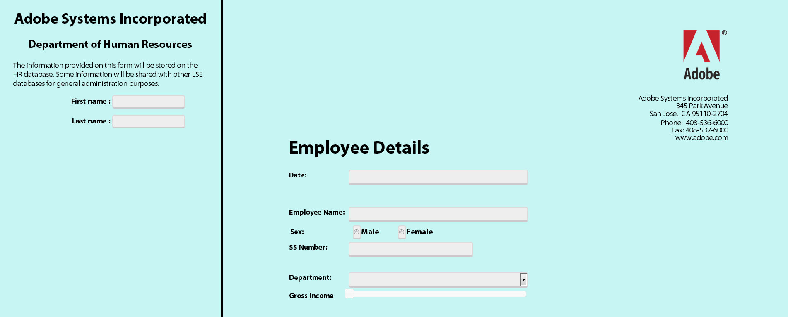

# Integrazione di Form Bridge con il portale personalizzato per HTML5 Forms{#integrating-form-bridge-with-custom-portal-for-html-forms}

<span class="preview"> La funzionalità HTML5 Forms è disponibile come parte del programma di accesso anticipato. Per richiedere l’accesso, invia un’e-mail dal tuo ID e-mail ufficiale (di lavoro) a aem-forms-ea@adobe.com.
</span>

FormBridge è un&#39;API bridge per HTML5 Forms che consente di interagire con un modulo. Per il riferimento all&#39;API FormBridge, vedere [Riferimento all&#39;API FormBridge](https://experienceleague.adobe.com/en/docs/experience-manager-65/content/forms/developer-reference/form-bridge-apis).

È possibile utilizzare l’API FormBridge per ottenere o impostare i valori dei campi modulo dalla pagina HTML e inviare il modulo. Ad esempio, puoi utilizzare l’API per creare un’esperienza simile a una procedura guidata.

Un’applicazione HTML esistente può utilizzare l’API FormBridge per interagire con un modulo e incorporarlo nella pagina HTML. Puoi utilizzare la procedura seguente per impostare il valore di un campo utilizzando l’API Bridge di Form.

## Integrazione di moduli HTML5 in una pagina web {#integrating-html-forms-to-a-web-page}

1. **Scegli un profilo o creane uno**

   1. Nell&#39;interfaccia di CRX DE, passare a: `https://'[server]:[port]'/crx/de`.
   1. Accedi con le credenziali di amministratore.
   1. Crea un profilo o scegli un profilo esistente.

      Per informazioni dettagliate su come creare un profilo, vedere [Creazione di un profilo](/help/forms/custom-profile.md).

1. **Modifica il profilo HTML**

   Includi il runtime XFA, la libreria locale XFA e lo snippet HTML del modulo XFA nel modulo di rendering dei profili, progetta la pagina web e inserisci il modulo all’interno della pagina web.

   Ad esempio, utilizza il seguente frammento di codice, per creare un’app con due campi di input e un modulo per dimostrare l’interazione tra il modulo e un’app esterna.

   ```xml
   <%@ page session="false"
                  contentType="text/html; charset=utf-8"%><%
   %><%@ taglib prefix="cq" uri="https://www.day.com/taglibs/cq/1.0" %><%
   %><!DOCTYPE html>
   <html manifest="${param.offlineSpec}">
       <head>
          <cq:include script="formRuntime.jsp"/>
           <!-- Portal Scripts and Styles -->
          <cq:include script="portalheader.jsp"/>
       </head>
       <body>
           <div id="leftdiv" >
               <div id="leftdivcontentarea">
                   <!-- Portal Body -->
                 <cq:include script="portalbody.jsp"/>
               </div>
           </div>
           <div id="rightdiv">
               <div id="formBody">
               <cq:include script="config.jsp"/>
               <!-- Form body -->
               <cq:include script="formBody.jsp"/>
               <!  --To assist in page transitions -- add navigation, based on scrolling -->
               <cq:include  script="../nav/scroll/nav_footer.jsp"/>
               <cq:include script="footer.jsp"/>
               </div>
           </div>
       </body>
   </html>
   ```

   >[!NOTE]
   >
   >La **riga 9** contiene un riferimento JSP aggiuntivo per gli stili CSS e i file JavaScript per progettare la pagina.
   >
   >
   >Il tag &lt;div id=&quot;rightdiv&quot;> della **riga 18** contiene lo snippet HTML del modulo XFA.
   >
   >
   >Lo stile della pagina è in due contenitori: **left** e **right**. Il contenitore corretto contiene il modulo. Il contenitore sinistro dispone di due campi di input e fa parte della pagina HTML esterna.
   >
   >
   >Nella schermata seguente viene illustrato come il modulo viene visualizzato in un browser.

   

   Il lato sinistro fa parte della **pagina HTML**. Il lato destro contenente i campi è il **modulo xfa**.

1. **Accesso ai campi modulo dalla pagina**

   Di seguito è riportato uno script di esempio che è possibile aggiungere per impostare i valori in un campo modulo.

   Ad esempio, se desideri impostare **NomeDipendente** utilizzando i valori dei campi **Nome** e **Cognome**, chiama la funzione **window.formBridge.setFieldValue**.

   Analogamente, è possibile leggere il valore chiamando l&#39;API **window.formBridge.getFieldValue**.

   ```javascript
   $(function() {
               $(".input").blur(function() {
                   window.formBridge.setFieldValue(
                               'xfa.form.form1.#subform[0].EmployeeName',
                                $("#lname").val()+' '+$("#fname").val()
                              )
                   });
           });
   ```
