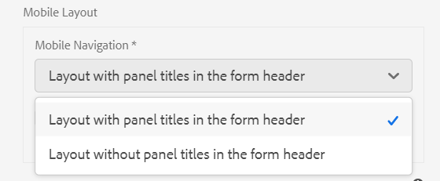

# Funzionalità di layout di Adaptive Forms {#layout-capabilities-of-adaptive-forms}

>[!NOTE]
>
> Adobe consiglia di utilizzare l&#39;acquisizione dati moderna ed estensibile [Componenti core](https://experienceleague.adobe.com/docs/experience-manager-core-components/using/adaptive-forms/introduction.html?lang=it) per [la creazione di un nuovo Forms adattivo](/help/forms/creating-adaptive-form-core-components.md) o [l&#39;aggiunta di Forms adattivo alle pagine AEM Sites](/help/forms/create-or-add-an-adaptive-form-to-aem-sites-page.md). Questi componenti rappresentano un progresso significativo nella creazione di Forms adattivi, garantendo esperienze utente straordinarie. Questo articolo descrive un approccio precedente all’authoring di Forms adattivi utilizzando i componenti di base.


| Versione | Collegamento articolo |
| -------- | ---------------------------- |
| AEM 6.5 | [Fai clic qui](https://experienceleague.adobe.com/docs/experience-manager-65/forms/adaptive-forms-basic-authoring/layout-capabilities-adaptive-forms.html) |
| AEM as a Cloud Service (Componenti core) | [Fai clic qui](/help/forms/layout-capabilities-adaptive-forms-core-components.md) |
| AEM as a Cloud Service (Componenti di base) | Questo articolo |

[!DNL Adobe Experience Manager] consente di creare Forms adattivo di facile utilizzo che offre esperienze dinamiche agli utenti finali. Il layout del modulo controlla il modo in cui gli elementi o i componenti vengono visualizzati in un modulo adattivo.

<!-- ## Prerequisite knowledge {#prerequisite-knowledge}

Before learning about the different layout capabilities of Adaptive Forms, read [Introduction to authoring forms](introduction-forms-authoring.md) to know more about Adaptive Forms. -->

## Tipi di layout {#types-of-layouts}

Un modulo adattivo offre i seguenti tipi di layout:

**[!UICONTROL Layout pannello]** Controlla la modalità di visualizzazione degli elementi o dei componenti di un pannello in un dispositivo.

**[!UICONTROL Layout dispositivo mobile]** Controlla la navigazione di un modulo su un dispositivo mobile. Se la larghezza del dispositivo è di 768 pixel o più, il layout viene considerato un layout Mobile e ottimizzato per un dispositivo mobile.

**[!UICONTROL Layout barra degli strumenti]** Controlla la posizione dei pulsanti di azione nella barra degli strumenti della barra degli strumenti o del pannello in un modulo.

Tutti questi layout di pannello sono definiti nella posizione `/libs/fd/af/layouts`.

Per modificare il layout di un modulo adattivo, utilizzare la modalità di creazione in [!DNL Experience Manager].

## [!UICONTROL Layout pannello] {#panel-layout}

Un autore di moduli può associare un layout a ciascun pannello di un modulo adattivo, incluso il pannello principale.

I layout del pannello sono disponibili nel percorso `/libs/fd/af/layouts/panel`. Selezionare il pannello e selezionare  per visualizzare le proprietà del pannello.


### [!UICONTROL Reattivo - tutto su una pagina senza navigazione] {#responsive-everything-on-one-page-without-navigation-br}

Utilizza questo layout di pannello per creare un layout reattivo che si adatta alle dimensioni dello schermo del dispositivo senza alcuna necessità di navigazione specializzata.

Utilizzando questo layout, puoi inserire più componenti del **[!UICONTROL Modulo adattivo per pannello]** uno dopo l&#39;altro all&#39;interno del pannello.


### [!UICONTROL Procedura guidata] {#wizard}

Utilizza questo layout di pannello per fornire una navigazione guidata all’interno di un modulo. Utilizzare ad esempio questo layout per acquisire informazioni obbligatorie in un modulo guidando gli utenti passo dopo passo.

Utilizza il componente **[!UICONTROL Modulo adattivo per pannello]** per fornire una navigazione dettagliata all&#39;interno di un pannello. Quando utilizzi questo layout, un utente passa al passaggio successivo solo dopo aver completato il passaggio corrente

```javascript
window.guideBridge.validate([], this.panel.navigationContext.currentItem.somExpression)
```


### [!UICONTROL Pannello a soffietto] {#layout-for-accordion-design}

Utilizzando questo layout, puoi inserire il componente **[!UICONTROL Modulo adattivo per pannello]** in un pannello con navigazione in stile Pannello a soffietto. Utilizzando questo layout, puoi anche creare pannelli ripetibili. I pannelli ripetibili consentono di aggiungere o rimuovere in modo dinamico i pannelli in base alle esigenze. Puoi definire il numero minimo e massimo di ripetizioni di un pannello. Inoltre, il titolo del pannello può essere determinato dinamicamente, in base alle informazioni fornite negli elementi del pannello.

L’espressione di riepilogo può essere utilizzata per mostrare i valori forniti dall’utente nel titolo del pannello ridotto a icona.


### [!UICONTROL Layout a schede: le schede vengono visualizzate a sinistra]{#tabbed-layout-tabs-appear-on-the-left}

Utilizzando questo layout, puoi inserire il componente **[!UICONTROL Modulo adattivo per pannello]** in un pannello con navigazione tramite schede. Le schede vengono posizionate a sinistra del contenuto del pannello.


Schede visualizzate a sinistra di un pannello

### [!UICONTROL Layout a schede: le schede vengono visualizzate nella parte superiore] {#tabbed-layout-tabs-appear-on-the-top}

Utilizzando questo layout, puoi inserire il componente **[!UICONTROL Modulo adattivo per pannello]** in un pannello con navigazione tramite schede. Le schede vengono posizionate sopra il contenuto del pannello.


## Layout dispositivi mobili {#mobile-layouts}

I layout mobili consentono una navigazione semplice sui dispositivi mobili con schermi relativamente più piccoli. I layout mobili utilizzano gli stili a schede o della procedura guidata per la navigazione dei moduli. L’applicazione di un layout mobile fornisce un unico layout per l’intero modulo.

Questo layout controlla la navigazione tramite una barra di navigazione e un menu di navigazione. La barra di navigazione mostra l&#39;icona **&lt;** e **>** per indicare **[!UICONTROL i passaggi di navigazione successivi]** e **[!UICONTROL precedenti]** nel modulo.

I layout mobili sono disponibili nel percorso `/libs/fd/af/layouts/mobile/`. Per impostazione predefinita, in Adaptive Forms sono disponibili i seguenti layout per dispositivi mobili.



Seleziona l&#39;opzione **[!UICONTROL Aggiungi elementi navigabili del layout reattivo al menu per dispositivi mobili]** per visualizzare le opzioni navigabili disponibili per un pannello nel layout per dispositivi mobili. Le opzioni navigabili sono visibili solo se si seleziona il layout **[!UICONTROL Reattivo]** per un pannello.

Quando si utilizza un layout Mobile, per accedere a vari pannelli del modulo tocca l’icona .

### [!UICONTROL Layout con titoli pannello nell&#39;intestazione modulo] {#layout-with-panel-titles-in-the-form-header}

Questo layout, come suggerisce il nome, mostra i titoli dei pannelli insieme al menu di navigazione e alla barra di navigazione. Questo layout fornisce anche le icone Successivo e Precedente per la navigazione.


### [!UICONTROL Layout senza titoli pannello nell&#39;intestazione modulo]{#layout-without-panel-titles-in-the-form-header}

Come suggerisce il nome, questo layout mostra solo il menu di navigazione e la barra di navigazione senza i titoli dei pannelli. Questo layout fornisce anche le icone Successivo e Precedente per la navigazione.


## Consulta anche {#see-also}

{{see-also}}


<!-- ## Toolbar layouts {#toolbar-layouts}

A Toolbar Layout controls positioning and display of any action buttons that you add to your Adaptive Forms. The layout can be added at a form level or at a panel level.


A list of Toolbar Layouts in Adaptive Forms

Toolbar layouts are available at `/libs/fd/af/layouts/toolbar` location. Adaptive Forms provide the following Toolbar Layouts, by default.

### [!UICONTROL Default layout for toolbar] {#default-layout-for-toolbar}

This layout is selected as the default layout when you add any action buttons in an Adaptive Form. Selecting this layout displays the same layout for both, desktop and mobile devices.

Also, you can add multiple toolbars containing action buttons configured with this layout. An action button is associated with a form control. You can configure the toolbars to be before or after a panel.


Default view for toolbar

### [!UICONTROL Mobile fixed layout for toolbar] {#mobile-fixed-layout-for-toolbar}

Select this layout to provide alternate layouts for desktop and mobile devices.

For the desktop layout, you can add Action buttons using some specific labels. Only one toolbar can be configured with this layout. If more than one toolbar is configured with this layout, there is an overlap for mobile devices and only one toolbar is visible. For example, you can have a toolbar at the bottom or the top of the form, or, after or before panels in the form.

For the Mobile layout, you can add action buttons using icons.


Mobile fixed layout for toolbar-->


