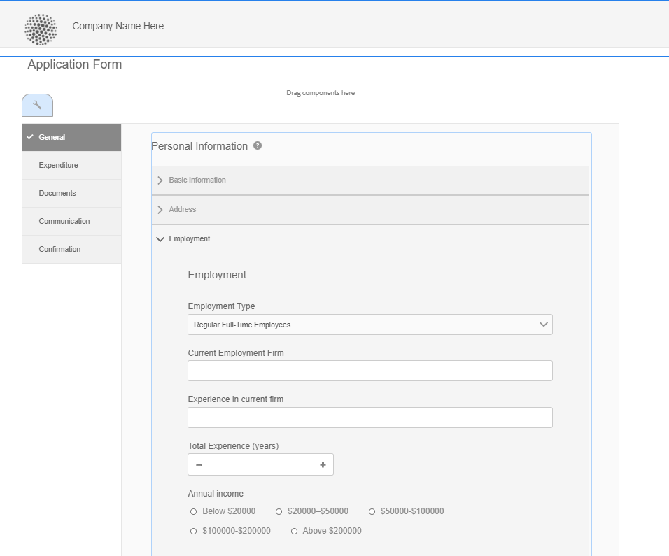
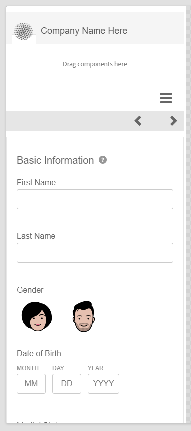

# Funzionalità di layout di Adaptive Forms {#layout-capabilities-of-adaptive-forms}

[!DNL Adobe Experience Manager] consente di creare un Forms adattivo di facile utilizzo che offre esperienze dinamiche agli utenti finali. Il layout del modulo controlla il modo in cui gli elementi o i componenti vengono visualizzati in un modulo adattivo.

<!-- ## Prerequisite knowledge {#prerequisite-knowledge}

Before learning about the different layout capabilities of Adaptive Forms, read [Introduction to authoring forms](introduction-forms-authoring.md) to know more about Adaptive Forms. -->

## Tipi di layout {#types-of-layouts}

Un Modulo adattivo fornisce i seguenti tipi di layout:

**[!UICONTROL Layout del pannello]** Controlla la modalità di visualizzazione degli elementi o dei componenti all’interno di un pannello su un dispositivo.

**[!UICONTROL Layout mobile]** Controlla la navigazione di un modulo su un dispositivo mobile. Se la larghezza del dispositivo è pari o superiore a 768 pixel, il layout viene considerato un layout mobile e ottimizzato per un dispositivo mobile.

**[!UICONTROL Layout barra degli strumenti]** Controlla la posizione dei pulsanti di azione nella barra degli strumenti o nel pannello di un modulo.

Tutti i layout di questi pannelli sono definiti nella `/libs/fd/af/layouts` posizione.

Per modificare il layout di un modulo adattivo, utilizzare la modalità di creazione in [!DNL Experience Manager].

## [!UICONTROL Layout pannello] {#panel-layout}

Un autore di moduli può associare un layout a ciascun pannello di un modulo adattivo, incluso il pannello principale.

I layout dei pannelli sono disponibili in `/libs/fd/af/layouts/panel` posizione. Tocca il pannello e seleziona  per visualizzare le proprietà del pannello.


### [!UICONTROL Reattivo : tutto su una pagina senza navigazione] {#responsive-everything-on-one-page-without-navigation-br}

Utilizza questo layout del pannello per creare un layout reattivo che si adatta alle dimensioni dello schermo del dispositivo senza necessità di una navigazione specializzata.

Utilizzando questo layout, è possibile inserire più **[!UICONTROL Modulo adattivo del pannello]** componenti uno dopo l’altro all’interno del pannello.


### [!UICONTROL Wizard] {#wizard}

Utilizzare questo layout del pannello per fornire la navigazione guidata all’interno di un modulo. Ad esempio, utilizzare questo layout quando si desidera acquisire informazioni obbligatorie in un modulo mentre gli utenti sono guidati passo dopo passo.

Utilizza la **[!UICONTROL Modulo adattivo del pannello]** per fornire una navigazione dettagliata all’interno di un pannello. Quando si utilizza questo layout, un utente passa al passaggio successivo solo al completamento del passaggio corrente

```javascript
window.guideBridge.validate([], this.panel.navigationContext.currentItem.somExpression)
```


### [!UICONTROL Pannello a soffietto] {#layout-for-accordion-design}

Utilizzando questo layout, è possibile inserire il **[!UICONTROL Modulo adattivo del pannello]** in un pannello con navigazione a soffietto. Utilizzando questo layout è possibile creare anche pannelli ripetibili. I pannelli ripetibili consentono di aggiungere o rimuovere dinamicamente i pannelli in base alle esigenze. Puoi definire il numero minimo e il numero massimo di ripetizioni di un pannello. Inoltre, il titolo del pannello può essere determinato dinamicamente, in base alle informazioni fornite negli elementi del pannello.

L’espressione Summary può essere utilizzata per mostrare i valori forniti dall’utente finale nel titolo del pannello minimizzato.



### [!UICONTROL Layout a schede - le schede vengono visualizzate a sinistra ]{#tabbed-layout-tabs-appear-on-the-left}

Utilizzando questo layout, è possibile inserire il **[!UICONTROL Modulo adattivo del pannello]** in un pannello con navigazione a schede. Le schede vengono posizionate a sinistra del contenuto del pannello.


Schede visualizzate a sinistra di un pannello

### [!UICONTROL Layout a schede - le schede vengono visualizzate nella parte superiore] {#tabbed-layout-tabs-appear-on-the-top}

Utilizzando questo layout, è possibile inserire il **[!UICONTROL Modulo adattivo del pannello]** Componente in un pannello con navigazione a schede. Le schede vengono posizionate sopra il contenuto del pannello.


## Layout dei dispositivi mobili {#mobile-layouts}

I layout per dispositivi mobili consentono una navigazione agevole sui dispositivi mobili con schermi relativamente più piccoli. I layout per dispositivi mobili utilizzano stili a schede o a procedura guidata per la navigazione nei moduli. L’applicazione di un layout mobile fornisce un singolo layout per l’intero modulo.

Questo layout controlla la navigazione tramite una barra di navigazione e un menu di navigazione. Viene visualizzata la barra di navigazione **&lt;** e **>** icona per indicare **[!UICONTROL next]** e **[!UICONTROL precedente]** passaggi di navigazione nel modulo.

I layout per dispositivi mobili sono disponibili in `/libs/fd/af/layouts/mobile/` posizione. Per impostazione predefinita, i seguenti layout per dispositivi mobili sono disponibili in Adaptive Forms.


Seleziona la **[!UICONTROL Aggiungi elementi navigabili con layout reattivo al menu mobile]** per visualizzare le opzioni navigabili disponibili per un pannello nel layout Mobile. Le opzioni navigabili sono visibili solo se si seleziona **[!UICONTROL Reattivo]** layout per un pannello.

Quando si utilizza un layout mobile, per accedere ai vari pannelli dei moduli è disponibile il menu del modulo.  icona.

### [!UICONTROL Layout con titoli dei pannelli nell’intestazione del modulo] {#layout-with-panel-titles-in-the-form-header}

Questo layout, come suggerisce il nome, mostra i titoli dei pannelli insieme al menu di navigazione e alla barra di navigazione. Questo layout include anche le icone Successivo e Precedente per la navigazione.


### [!UICONTROL Layout senza titoli del pannello nell’intestazione del modulo ]{#layout-without-panel-titles-in-the-form-header}

Questo layout, come suggerisce il nome, mostra solo il menu di navigazione e la barra di navigazione senza titoli del pannello. Questo layout include anche le icone Successivo e Precedente per la navigazione.



<!-- ## Toolbar layouts {#toolbar-layouts}

A Toolbar Layout controls positioning and display of any action buttons that you add to your Adaptive Forms. The layout can be added at a form level or at a panel level.


A list of Toolbar Layouts in Adaptive Forms

Toolbar layouts are available at `/libs/fd/af/layouts/toolbar` location. Adaptive Forms provide the following Toolbar Layouts, by default.

### [!UICONTROL Default layout for toolbar] {#default-layout-for-toolbar}

This layout is selected as the default layout when you add any action buttons in an Adaptive Form. Selecting this layout displays the same layout for both, desktop and mobile devices.

Also, you can add multiple toolbars containing action buttons configured with this layout. An action button is associated with a form control. You can configure the toolbars to be before or after a panel.


Default view for toolbar

### [!UICONTROL Mobile fixed layout for toolbar] {#mobile-fixed-layout-for-toolbar}

Select this layout to provide alternate layouts for desktop and mobile devices.

For the desktop layout, you can add Action buttons using some specific labels. Only one toolbar can be configured with this layout. If more than one toolbar is configured with this layout, there is an overlap for mobile devices and only one toolbar is visible. For example, you can have a toolbar at the bottom or the top of the form, or, after or before panels in the form.

For the Mobile layout, you can add action buttons using icons.


Mobile fixed layout for toolbar-->
