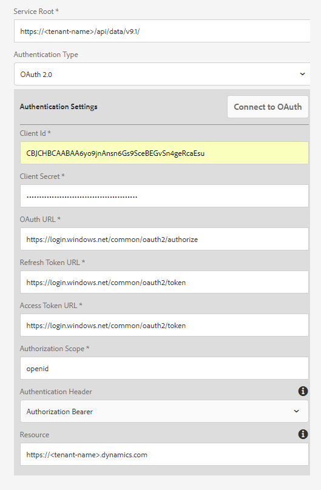

# [!DNL Microsoft Dynamics] Configurazione di OData {#microsoft-dynamics-odata-configuration}


[!DNL Microsoft Dynamics] è un software CRM (Customer Relationship Management) e ERP (Enterprise Resource Planning) che fornisce soluzioni aziendali per la creazione e la gestione di account cliente, contatti, lead, opportunità e casi. [[!DNL Experience Manager Forms] Integrazione dei dati](data-integration.md) fornisce una configurazione del servizio cloud OData per integrare Forms sia online che on-premise [!DNL Microsoft Dynamics] server. Consente di creare un modello dati modulo basato su entità, attributi e servizi definiti in [!DNL Microsoft Dynamics] servizio. Il modello dati modulo può essere utilizzato per creare un Forms adattivo che interagisca con [!DNL Microsoft Dynamics] per abilitare i flussi di lavoro aziendali. Esempio:

* Query [!DNL Microsoft Dynamics] server per i dati e precompilare Adaptive Forms
* Scrivere dati in [!DNL Microsoft Dynamics] sull’invio di moduli adattivi
* Scrivi dati in [!DNL Microsoft Dynamics] tramite entità personalizzate definite nel modello dati del modulo e viceversa

<!--[!DNL Experience Manager Forms] add-on package also includes reference OData configuration that you can use to quickly integrate [!DNL Microsoft Dynamics] with [!DNL Experience Manager Forms].-->

<!--When the package is installed, the following entities and services are available on your [!DNL Experience Manager Forms] instance:

* MS Dynamics OData Cloud Service (OData Service)-->
<!--* Form Data Model with preconfigured [!DNL Microsoft Dynamics] entities and services.-->

<!-- Preconfigured [!DNL Microsoft Dynamics] entities and services in a Form Data Model are available on your [!DNL Experience Manager Forms] instance only if the run mode for the [!DNL Experience Manager] instance is set as `samplecontent` (default). -->  MS Dynamics OData Cloud Service (OData Service) is available with all run modes. For more information on configuring run modes for an [!DNL Experience Manager] instance, see [Run Modes](https://experienceleague.adobe.com/docs/experience-manager-cloud-service/implementing/deploying/overview.html#runmodes).

## Prerequisiti {#prerequisites}

Prima di iniziare a configurare e configurare [!DNL Microsoft Dynamics], assicurati di disporre di:

<!--* Installed the [[!DNL Experience Manager Forms] add-on package](installing-configuring-aem-forms-osgi.md) -->
* Configurato [!DNL Microsoft Dynamics] 365 online o installato un&#39;istanza di uno dei seguenti [!DNL Microsoft Dynamics] versioni:

   * [!DNL Microsoft Dynamics] 365 locali
   * [!DNL Microsoft Dynamics] 2016 on-premise

* [Registrazione della domanda di [!DNL Microsoft Dynamics] online service with [!DNL Microsoft Azure] Active Directory](https://docs.microsoft.com/en-us/dynamics365/customer-engagement/developer/walkthrough-register-dynamics-365-app-azure-active-directory). Prendi nota dei valori dell’ID client (noto anche come ID applicazione) e del segreto client per il servizio registrato. Questi valori vengono utilizzati mentre [configurazione del servizio cloud per [!DNL Microsoft Dynamics] servizio](#configure-cloud-service-for-your-microsoft-dynamics-service).

## Imposta URL di risposta per registrato [!DNL Microsoft Dynamics] applicazione {#set-reply-url-for-registered-microsoft-dynamics-application}

Effettua le seguenti operazioni per impostare l&#39;URL di risposta per registrato [!DNL Microsoft Dynamics] domanda:

>[!NOTE]
>
>Utilizzare questa procedura solo durante l&#39;integrazione [!DNL Experience Manager Forms] online [!DNL Microsoft Dynamics] server.

1. Vai a [!DNL Microsoft Azure] Account Active Directory e aggiungi l&#39;URL di configurazione del servizio cloud seguente in **[!UICONTROL URL di risposta]** impostazioni per l&#39;applicazione registrata:

   `https://[server]:[port]/libs/fd/fdm/gui/components/admin/fdmcloudservice/createcloudconfigwizard/cloudservices.html`

   

1. Salva la configurazione.

## Configura [!DNL Microsoft Dynamics] per IFD {#configure-microsoft-dynamics-for-ifd}

[!DNL Microsoft Dynamics] utilizza l’autenticazione basata su attestazioni per fornire l’accesso ai dati su [!DNL Microsoft Dynamics] Server CRM per utenti esterni. Per abilitare questa funzione, procedi come segue per configurare [!DNL Microsoft Dynamics] per la distribuzione su Internet (IFD) e configurare le impostazioni di attestazione.

>[!NOTE]
>
>Utilizzare questa procedura solo durante l&#39;integrazione [!DNL Experience Manager Forms] con sede [!DNL Microsoft Dynamics] server.

1. Configura [!DNL Microsoft Dynamics] istanza locale per IFD, come descritto in [Configura IFD per [!DNL Microsoft Dynamics]](https://technet.microsoft.com/en-us/library/dn609803.aspx).
1. Esegui i seguenti comandi utilizzando Windows PowerShell per configurare le impostazioni delle attestazioni su IFD abilitato [!DNL Microsoft Dynamics]:

   ```shell
   Add-PSSnapin Microsoft.Crm.PowerShell
    $ClaimsSettings = Get-CrmSetting -SettingType OAuthClaimsSettings
    $ClaimsSettings.Enabled = $true
    Set-CrmSetting -Setting $ClaimsSettings
   ```

   Vedi [Registrazione app per CRM on-premise (IFD)](https://msdn.microsoft.com/sl-si/library/dn531010(v=crm.7).aspx#bkmk_ifd) per i dettagli.

## Configurare il client OAuth sul computer AD FS {#configure-oauth-client-on-ad-fs-machine}

Per registrare un client OAuth nel computer Active Directory Federation Services (AD FS) e concedere l&#39;accesso al computer AD FS, procedere come segue:

>[!NOTE]
>
>Utilizzare questa procedura solo durante l&#39;integrazione [!DNL Experience Manager Forms] con sede [!DNL Microsoft Dynamics] server.

1. Esegui il comando seguente:

   `Add-AdfsClient -ClientId “<Client-ID>” -Name "<name>" -RedirectUri "<redirect-uri>" -GenerateClientSecret`

   Dove:

   * `Client-ID` è un ID client che è possibile generare utilizzando qualsiasi generatore GUID.
   * `redirect-uri` è l’URL della [!DNL Microsoft Dynamics] Servizio cloud OData su [!DNL Experience Manager Forms]. Il servizio cloud predefinito installato con [!DNL Experience Manager Forms] viene distribuito al seguente URL:
      `https://'[server]:[port]'/libs/fd/fdm/gui/components/admin/fdmcloudservice/createcloudconfigwizard/cloudservices.html`

1. Esegui il seguente comando per concedere l&#39;accesso al computer AD FS:

   `Grant-AdfsApplicationPermission -ClientRoleIdentifier “<Client-ID>” -ServerRoleIdentifier <resource> -ScopeNames openid`

   Dove:

   * `resource` è [!DNL Microsoft Dynamics] URL organizzazione.

1. [!DNL Microsoft Dynamics] utilizza il protocollo HTTPS. Per richiamare endpoint AD FS da [!DNL Forms] server, installare [!DNL Microsoft Dynamics] certificato del sito all’archivio certificati Java utilizzando `keytool` sul computer in esecuzione [!DNL Experience Manager Forms].

## Configurare il servizio cloud per [!DNL Microsoft Dynamics] servizio {#configure-cloud-service-for-your-microsoft-dynamics-service}

Un servizio OData è identificato dall&#39;URL principale del servizio. Per configurare un servizio OData in [!DNL Experience Manager] as a Cloud Service, accertati di disporre dell&#39;URL principale del servizio ed effettua le seguenti operazioni:

<!--The **MS Dynamics OData Cloud Service (OData Service)** configuration comes with default OData configuration. To configure it to connect with your [!DNL Microsoft Dynamics] service, do the following.-->

>[!NOTE]
>
>Guida dettagliata alla configurazione [!DNL Microsoft Dynamics 365], on-line o on-premise, vedi [[!DNL Microsoft Dynamics] Configurazione OData](ms-dynamics-odata-configuration.md).

1. Vai a **[!UICONTROL Strumenti > Cloud Services > Origini dati]**. Tocca per selezionare la cartella in cui desideri creare una configurazione cloud.

   Vedi [Configurare la cartella per le configurazioni del servizio cloud](#cloud-folder) per informazioni sulla creazione e la configurazione di una cartella per le configurazioni del servizio cloud.

1. Tocca **[!UICONTROL Crea]** per aprire **[!UICONTROL Creazione guidata configurazione origine dati]**. Specifica un nome ed eventualmente un titolo per la configurazione, seleziona **[!UICONTROL Servizio OData]** dal **[!UICONTROL Tipo di servizio]** a discesa, se lo desideri, sfoglia e seleziona un’immagine in miniatura per la configurazione, quindi tocca **[!UICONTROL Successivo]**.
In **[!UICONTROL Impostazioni di autenticazione]** scheda:

   1. Immetti il valore per la **[!UICONTROL Directory principale servizio]** campo . Vai all’istanza di Dynamics e passa a **[!UICONTROL Riferimenti per sviluppatori]** per visualizzare il valore del campo Directory principale del servizio. Ad esempio, https://&lt;tenant-name>/api/data/v9.1/

   1. Seleziona **[!UICONTROL OAuth 2.0]** come tipo di autenticazione.

   1. Sostituisci i valori predefiniti nella **[!UICONTROL ID client]** (di cui anche **ID applicazione**), **[!UICONTROL Segreto client]**, **[!UICONTROL URL OAuth]**, **[!UICONTROL Aggiorna URL token]**, **[!UICONTROL URL token di accesso]** e **[!UICONTROL Risorsa]** campi con valori [!DNL Microsoft Dynamics] configurazione del servizio. È obbligatorio specificare l’URL dell’istanza di dinamica nel **[!UICONTROL Risorsa]** campo da configurare [!DNL Microsoft Dynamics] con un modello dati del modulo. Utilizza l’URL principale del servizio per derivare l’URL dell’istanza dinamica. Ad esempio: [https://org.crm.dynamics.com](https://org.crm.dynamics.com/).

   1. Specifica **[!UICONTROL openid]** in **[!UICONTROL Ambito di autorizzazione]** campo del processo di autorizzazione [!DNL Microsoft Dynamics].

      
Modello dati modulo
1. Fai clic su **[!UICONTROL Connettiti a OAuth]**. Viene reindirizzato a [!DNL Microsoft Dynamics] pagina di accesso.
1. Accedi con il tuo [!DNL Microsoft Dynamics] credenziali e accettazione per consentire la connessione della configurazione del servizio cloud [!DNL Microsoft Dynamics] servizio. L’impostazione di Form Data Model tra il servizio cloud e il servizio è una tantum.

   Sei la pagina di configurazione del servizio cloud Form Data Model , che visualizza un messaggio che informa che la configurazione OData è stata salvata correttamente.

Il servizio cloud Cloud Service OData di MS Dynamics (OData Service) è configurato e connesso con il servizio Dynamics. Modello dati modulo

## Crea modello dati modulo {#create-form-data-model}

<!--When you install the [!DNL Experience Manager Forms] package, a form data model, **[!DNL Microsoft Dynamics] FDM**, is deployed on your [!DNL Experience Manager] instance. By default, the Form Data Model uses [!DNL Microsoft Dynamics] service configured in the MS Dynamics OData Cloud Service (OData Service) as its data source.

On opening the Form Data Model for the first time, it connects to the configured [!DNL Microsoft Dynamics] service and fetches entities from your [!DNL Microsoft Dynamics] instance. The "contact" and "lead" entities from [!DNL Microsoft Dynamics] are already added in the form data model.

To review the form data model, go to **[!UICONTROL Form Data Model egrations]**. Select **[!DNL Microsoft Dynamics] FDM** and click **[!UICONTROL Edit]** to open the Form Data Model in edit mode. Alternatively, you can open the Form Data Model directly from the following URL:

`https://'[server]:[port]'/aem/fdm/editor.html/content/dam/formsanddocuments-fdm/ms-dynamics-fdm`
 Form Data Model 
-->

Dopo aver configurato il servizio cloud MS Dynamics OData Cloud Ser Form Data Model ce), è possibile utilizzare il servizio durante la creazione di modelli di dati del modulo. Per ulteriori informazioni, consulta [Crea modello dati modulo](create-form-data-models.md).

Successivamente, è possibile creare un modulo adattivo basato sul modello di modello dati modulo e utilizzarlo in vari casi di utilizzo del modulo adattivo, ad esempio:

* Precompilare il modulo adattivo eseguendo una query sulle informazioni da [!DNL Microsoft Dynamics] entità e servizi
* Richiama [!DNL Microsoft Dynamics] operazioni server definite in un modello dati modulo utilizzando le regole del modulo adattivo
* Scrivi dati del modulo inviati a [!DNL Microsoft Dynamics] entità

<!--It is recommended to create a copy of the Form Data Model provided with the [!DNL Experience Manager Forms] package and configure data models and services to suit your requirements. It will ensure that any future updates to the package do not override your form data model.-->

Per ulteriori informazioni sulla creazione e l’utilizzo di Form Data Model nei flussi di lavoro aziendali, consulta [Integrazione dei dati](data-integration.md).
