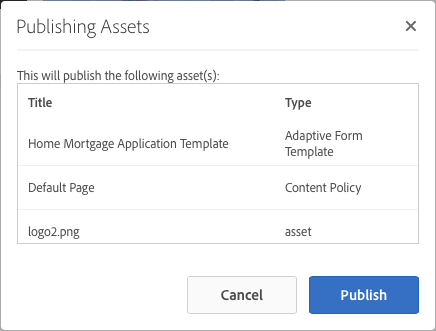

# Pubblicazione e annullamento della pubblicazione di moduli e documenti{#publishing-and-unpublishing-forms-and-documents}

[!DNL AEM Forms] consente di creare, pubblicare e annullare facilmente la pubblicazione dei moduli. Il [!DNL AEM Forms] Server fornisce due istanze: Author e Publish. L’istanza di authoring è per la creazione e la gestione di risorse e risorse del modulo. L’istanza di pubblicazione serve a mantenere le risorse e le risorse correlate disponibili per gli utenti finali.

## Risorse supportate   {#supported-assets-nbsp}

[!DNL AEM Forms] supporta i seguenti tipi di risorse:

* Moduli adattivi
* Documenti adattivi
* Frammenti di moduli adattivi
* Temi
* Modelli di modulo <!-- (XFA forms) -->
* PDF forms
* Documento (documenti Flat PDF)
* Set di moduli
* Risorsa (immagini, schemi e fogli di stile)

Inizialmente, tutte le risorse sono disponibili solo nell’istanza di authoring. Un amministratore o un autore di moduli può pubblicare tutte le risorse ad eccezione delle risorse.

Quando selezioni un modulo e lo pubblichi, vengono pubblicate anche le relative risorse e risorse. Tuttavia, le risorse dipendenti non vengono pubblicate. In questo contesto, le risorse e le risorse correlate sono risorse utilizzate o a cui fa riferimento una risorsa pubblicata. Le risorse dipendenti sono risorse che fanno riferimento a una risorsa pubblicata.

Il Forms adattivo può utilizzare alcune configurazioni, impostazioni e personalizzazioni che non vengono pubblicate automaticamente. È consigliabile pubblicare o attivare queste risorse prima di pubblicare un modulo adattivo.

* Modelli di modulo adattivo modificabili
* Configurazioni di Cloud Service per Adobe Sign, Typekit, reCAPTCHA e modelli dati modulo
* Le altre configurazioni dei servizi cloud vengono attivate solo se l’utente dispone di autorizzazioni di amministratore.
* Personalizzazioni. Questi includono, tra l’altro:

   * Layout personalizzati
   * Aspetti personalizzati
   * File CSS: utilizzato come input nella finestra di dialogo delle proprietà del contenitore Modulo adattivo
   * Categoria libreria client: scelta come input nella finestra di dialogo delle proprietà del contenitore di moduli adattivi
   * Qualsiasi altra libreria client che potrebbe essere inclusa nel modello di modulo adattivo.
   * Percorsi di progettazione

## Stati risorse {#asset-states}

Una risorsa può avere i seguenti stati:

* **Non più pubblicato:** Una risorsa che non è mai stata pubblicata (lo stato non pubblicato è applicabile solo alle risorse Forms). Le risorse di Gestione della corrispondenza non dispongono di uno stato Non pubblicato.)
* **Pubblicato**: risorsa pubblicata e disponibile nell’istanza Publish
* **Modificato**: risorsa modificata dopo la pubblicazione

## Pubblicare una risorsa {#publish-an-asset}

1. Accedi a [!DNL AEM Forms] server.
1. Per selezionare e pubblicare una risorsa, effettua una delle seguenti operazioni.

   1. Sposta il puntatore su una risorsa e tocca **[!UICONTROL Pubblica]** .
   1. Effettua una delle seguenti operazioni, quindi tocca Pubblica:

      * Se ti trovi nella vista a schede, tocca **[!UICONTROL Inserisci selezione]** , quindi tocca la risorsa. La risorsa è selezionata.
      * Nella vista a elenco, seleziona la casella di controllo di una risorsa. La risorsa è selezionata.
      * Tocca una risorsa per visualizzarne i dettagli.
      * Visualizzare le proprietà di una risorsa toccando Visualizza proprietà .

      >[!NOTE]
      >
      >Non selezionare più risorse. La pubblicazione di più risorse contemporaneamente non è supportata.

1. All’avvio del processo di pubblicazione, viene visualizzata una finestra di dialogo di conferma in cui sono elencate tutte le risorse e le risorse correlate. Nella finestra di dialogo che contiene le risorse correlate, tocca **[!UICONTROL Pubblica]**. La risorsa viene pubblicata e viene visualizzata la finestra di dialogo Pubblica esito positivo delle risorse.

   >[!NOTE]
   >
   >Per il Forms adattivo, insieme alle relative risorse, viene visualizzato anche il nome della pagina Modulo adattivo.

   

   Una finestra di dialogo di conferma con tutte le risorse e le risorse correlate.

   >[!NOTE]
   >
   >In Forms Manager, se l’utente non è autorizzato a pubblicare le risorse elencate, l’azione Pubblica è disabilitata. Una risorsa che richiede autorizzazioni aggiuntive viene visualizzata in rosso.

   Dopo la pubblicazione di una risorsa, le proprietà dei metadati della risorsa vengono copiate nell’istanza Publish e lo stato della risorsa viene modificato in Pubblicato. Anche lo stato delle risorse dipendenti pubblicate viene modificato in Pubblicato.

   <!-- After publishing an asset, you can use the Forms Portal to display all the assets on a web page. For more information, see [Introduction to publishing forms on a portal](introduction-publishing-forms.md).-->

## Pubblica tutte le risorse di gestione della corrispondenza {#publish-all-the-correspondence-management-assets}

[!DNL AEM Forms] consente di pubblicare tutte le risorse di Gestione della corrispondenza su un server in un’unica operazione. Le risorse pubblicate includono tutte le risorse di Gestione della corrispondenza e le relative dipendenze.

Per pubblicare tutte le risorse di Gestione della corrispondenza su un server, completa i passaggi seguenti:

1. Accedi a [!DNL AEM Forms] server.
1. Tocca **Adobe Experience Manager** nella barra di navigazione globale.
1. Tocca , quindi tocca **Forms**.
1. Tocca **Pubblica risorse di gestione della corrispondenza**.

   

   Viene visualizzata la pagina Pubblica tutte le risorse di gestione della corrispondenza con le informazioni relative all&#39;ultimo tentativo di pubblicazione delle risorse di gestione della corrispondenza.

   

1. Tocca **Pubblica** nel messaggio di conferma, tocca **OK**.

   Al termine di un processo batch, è possibile visualizzare i dettagli dell&#39;ultima esecuzione. Ciò include informazioni quali l’accesso dell’amministratore e se l’esecuzione del batch è riuscita o meno.

   >[!NOTE]
   >
   >Una volta avviato, il processo di pubblicazione non può essere annullato. Inoltre, mentre è in corso l’operazione di pubblicazione, non creare, eliminare, modificare o pubblicare risorse né avviare l’operazione Esporta tutte le risorse di gestione della corrispondenza.

## Automatizzare la pubblicazione e l&#39;annullamento della pubblicazione per Forms e documenti {#automate-publishing-and-unpublishing-for-forms-amp-documents}

[!DNL AEM Forms] consente di pianificare la pubblicazione e l’annullamento della pubblicazione delle risorse per Forms e Documenti. Puoi specificare la pianificazione nell’Editor metadati. Per ulteriori informazioni sulla gestione dei metadati del modulo, consulta [Gestione dei metadati del modulo.](manage-form-metadata.md)

Per pianificare la data e l’ora di pubblicazione e di annullamento della pubblicazione delle risorse di Forms e Documents, segui la procedura riportata di seguito:

1. Seleziona una risorsa e tocca **[!UICONTROL Visualizza proprietà]**. Viene visualizzata la pagina Proprietà metadati.
1. Nella pagina Proprietà metadati, tocca **[!UICONTROL Avanzate]**, quindi tocca **[!UICONTROL Modifica]** .
1. In **[!UICONTROL Ora di pubblicazione]** e **[!UICONTROL Ora di disattivazione pubblicazione]** , selezionare la data e l&#39;ora.\
   Tocca **[!UICONTROL Fine]** .

## Annullare la pubblicazione di una risorsa {#unpublish-an-asset}

1. Seleziona una risorsa pubblicata e tocca **[!UICONTROL Annulla pubblicazione]** .
1. Per selezionare e annullare la pubblicazione di una risorsa, utilizza una delle seguenti opzioni.

   1. Sposta il puntatore su una risorsa e tocca **[!UICONTROL Annulla pubblicazione]** .
   1. Effettua una delle seguenti operazioni, quindi tocca Annulla pubblicazione:

      * Se ti trovi nella vista a schede, tocca **[!UICONTROL Inserisci selezione]** , quindi tocca la risorsa. La risorsa è selezionata.

      * Nella vista a elenco, passa il puntatore su una risorsa e tocca  . La risorsa è selezionata.

      * Tocca una risorsa per visualizzarne i dettagli.
      * Visualizzare le proprietà di una risorsa toccando Visualizza proprietà .

1. All’avvio del processo di annullamento della pubblicazione, viene visualizzata una finestra di dialogo di conferma. Tocca **[!UICONTROL Annulla pubblicazione]**.

   >[!NOTE]
   >
   >Viene annullata la pubblicazione solo della risorsa selezionata e le relative risorse figlie e di riferimento, se presenti, non vengono annullate.

## Ripristinare una risorsa o una lettera nella versione precedentemente pubblicata {#revert-an-asset-or-letter-to-the-previously-published-version}

Ogni volta che si pubblica una risorsa o una lettera dopo averla modificata, viene creata una versione della risorsa o della lettera. Puoi ripristinare una risorsa o una lettera in una versione pubblicata in precedenza. Potrebbe essere necessario eseguire questa operazione se si verificano problemi con la versione corrente della risorsa o del documento.

>[!NOTE]
>
>Non ripristinare lo stato dell&#39;ultima lettera pubblicata se una risorsa dipendente utilizzata in tale lettera viene eliminata dal sistema.

1. Seleziona una risorsa e tocca **[!UICONTROL Ripristina la versione precedentemente pubblicata]** .
1. Prima di ripristinare la risorsa, viene visualizzata una finestra di dialogo di conferma. Tocca **[!UICONTROL Ripristina]**.

   Viene eseguito il rollback della risorsa o della lettera alla versione precedentemente pubblicata.

## Eliminare una risorsa {#delete-an-asset}

>[!NOTE]
>
>Quando si elimina una risorsa, questa viene rimossa dall’istanza di pubblicazione. Quando si elimina una risorsa, viene rimossa anche la cronologia delle versioni, ad eccezione della versione di base.

1. Seleziona una risorsa e tocca **[!UICONTROL Elimina]** .

   >[!NOTE]
   >
   >L’opzione Elimina è disponibile anche quando si toccano i dettagli di una risorsa oppure si visualizzano le proprietà di una risorsa toccando Visualizza proprietà .

1. Prima di eliminare la risorsa, viene visualizzata una finestra di dialogo di conferma. Tocca **[!UICONTROL Elimina]**.

   >[!NOTE]
   >
   >Solo la risorsa selezionata viene eliminata e le risorse dipendenti e non vengono eliminate. Per verificare i riferimenti di una risorsa, tocca  quindi seleziona una risorsa.
   >
   >
   >Se la risorsa che stai tentando di eliminare è una risorsa figlia di un’altra risorsa, non viene eliminata. Per eliminare una risorsa di questo tipo, rimuovi i relativi riferimenti da altre risorse, quindi riprova.

## Forms adattivo protetto {#protected-adaptive-forms}

È possibile abilitare l&#39;autenticazione per i moduli a cui si desidera che gli utenti selezionati accedano. Quando si abilita l&#39;autenticazione per i moduli, gli utenti visualizzano una schermata di accesso prima di accedervi. Solo gli utenti con credenziali autorizzate possono accedere ai moduli.

Per abilitare l&#39;autenticazione per i moduli:

1. Nel browser, apri configMgr nell’istanza Publish.\
   URL: `https://<hostname>:<PublishPort>/system/console/configMgr`

1. Nella console Web Adobe Experience Manager, fai clic su **Servizio di autenticazione Apache Sling** per configurarlo.
1. Nella finestra di dialogo Apache Sling Authentication Service che viene visualizzata, utilizza **+** per aggiungere percorsi.\
   Quando si aggiunge un percorso, il servizio di autenticazione viene abilitato per i moduli in tale percorso.
