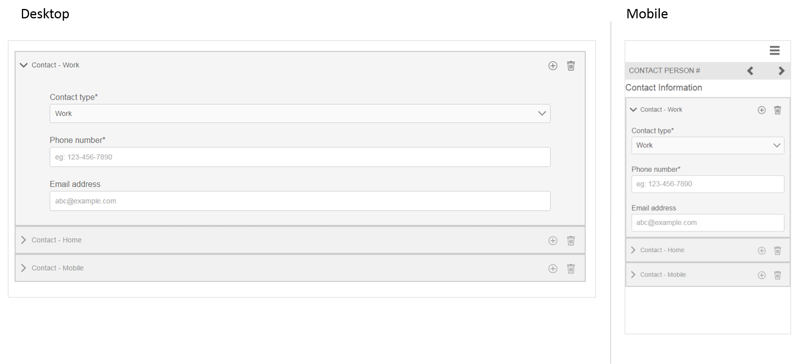

# Riferimento a frammenti di moduli adattivi {#reference-adaptive-form-fragments}

Frammento modulo adattivo è un gruppo di campi o un pannello contenente un gruppo di campi che è possibile utilizzare durante la creazione di un modulo. Consente di creare un modulo in modo semplice e rapido. Puoi trascinare un frammento di modulo adattivo in un modulo utilizzando il browser Risorse nella barra laterale e modificarlo nell’editor di moduli.

Per gli autori di Forms adattivi, i frammenti di riferimento sono forniti nel pacchetto [!DNL AEM Forms] [[!DNL AEM FORMS] FRAMMENTI DI RIFERIMENTO](https://www.adobeaemcloud.com/content/marketplace/marketplaceProxy.html?packagePath=/content/companies/public/adobe/packages/cq630/fd/AEM-FORMS-6.3-REFERENCE-FRAGMENTS). Include i seguenti frammenti:

* Indirizzo
* Informazioni di contatto
* Informazioni carta di credito
* Occupazione corrente
* Informazioni sui dipendenti
* Cronologia impiego
* Entrate e spese
* Nome
* Termini e condizioni
* Termini e condizioni con scarabocchio

Quando si installa il pacchetto, in Forms &amp; Documents viene creata una cartella Frammenti di riferimento contenente frammenti di riferimento. Per l&#39;installazione di un pacchetto, vedere [Distribuzione di pacchetti di contenuto tramite Cloud Manager e Gestione pacchetti](https://experienceleague.adobe.com/docs/experience-manager-cloud-service/implementing/deploying/overview.html#deploying-content-packages-via-cloud-manager-and-package-manager) e [Come utilizzare i pacchetti](https://experienceleague.adobe.com/docs/experience-manager-65/administering/contentmanagement/package-manager.html).

## Indirizzo {#address}

Include campi per specificare un indirizzo postale. I campi disponibili sono indirizzo, CAP, città, stato e paese. Include anche un servizio web preconfigurato che popola la città e lo stato per un codice postale statunitense specificato.

<!--[Click to enlarge

](assets/address-1.png)-->

## Informazioni di contatto {#contact-information}

Include campi per acquisire un numero di telefono e un indirizzo e-mail.

<!--[Click to enlarge

](assets/contact-info-1.png)-->

## Informazioni carta di credito {#credit-card-information}

Include campi per acquisire informazioni sulla carta di credito che possono essere utilizzate per elaborare i pagamenti.

## Occupazione corrente {#current-employment}

Include campi per acquisire i dettagli correnti sull&#39;impiego come lo stato, il campo di impiego, la designazione, l&#39;organizzazione e la data di iscrizione.

<!--[Click to enlarge

](assets/current-emp-1.png)-->

## Informazioni sui dipendenti {#dependents-information}

Include campi per specificare informazioni su una o più dipendenze, ad esempio il nome, la relazione e l&#39;età, in formato tabulare.

<!--[Click to enlarge

](assets/dependents-info-1.png)-->

## Cronologia impiego {#employment-history}

Include campi per acquisire la cronologia dell&#39;impiego. Consente di aggiungere più organizzazioni.

<!--[Click to enlarge

](assets/emp-history-1.png)-->

## Entrate e spese {#income-expenditure}

Include campi per acquisire flussi di cassa e spese mensili. I Forms che richiedono agli utenti di fornire dettagli finanziari possono utilizzare questo frammento per acquisire entrate e spese.

<!--[Click to enlarge

](assets/income-1.png)-->

## Nome {#name}

Include campi per specificare titolo, nome, secondo nome e cognome.

<!--[Click to enlarge

](assets/name-1.png)-->

## Termini e condizioni {#terms-conditions}

Specifica i termini e le condizioni che gli utenti devono accettare prima di inviare un modulo.

<!--[Click to enlarge

](assets/tnc-1.png)-->

## Termini e condizioni con scarabocchio {#terms-conditions-with-scribble}

Specifica i termini e le condizioni che gli utenti devono accettare e firmare prima di inviare un modulo.

<!--[Click to enlarge

](assets/tnc-scribble-1.png)-->
