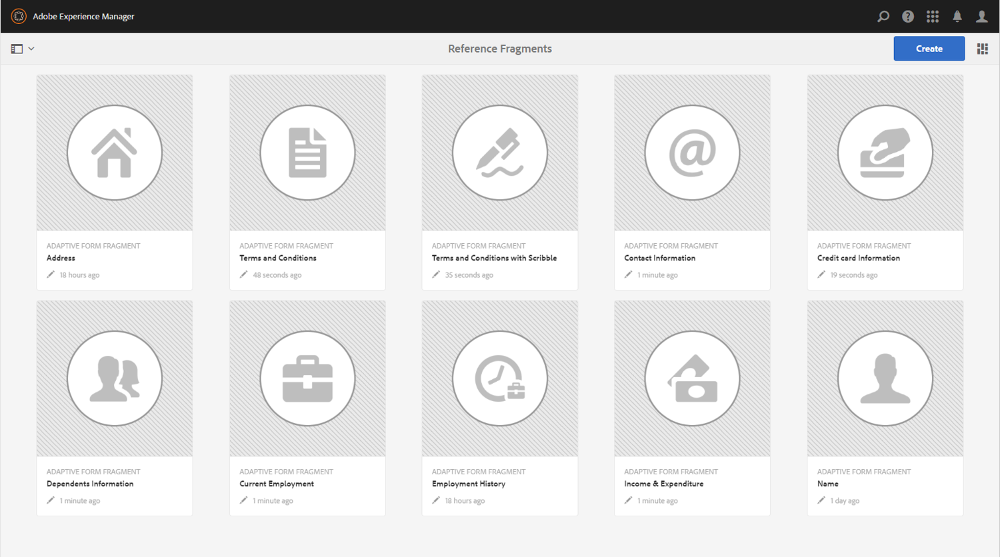
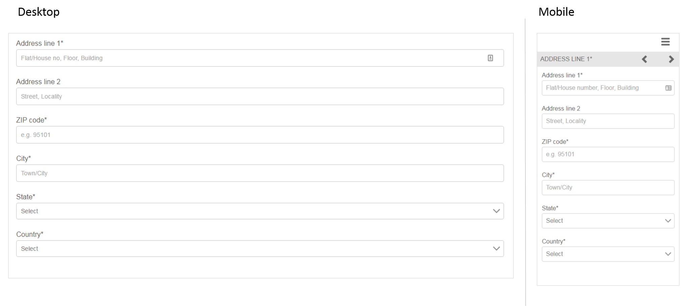

# Riferimenti a frammenti di modulo adattivi {#reference-adaptive-form-fragments}

Frammento di modulo adattivo è un gruppo di campi o un pannello contenente un gruppo di campi che è possibile utilizzare per creare un modulo. Consente di creare un modulo in modo semplice e rapido. È possibile trascinare un frammento di modulo adattivo in un modulo utilizzando il browser Risorse nella barra laterale e modificarlo nell’editor del modulo.

Per gli autori di Forms adattivi, i frammenti di riferimento sono forniti nella sezione [!DNL AEM Forms] pacchetto [[!DNL AEM FORMS] FRAMMENTI DI RIFERIMENTO](https://www.adobeaemcloud.com/content/marketplace/marketplaceProxy.html?packagePath=/content/companies/public/adobe/packages/cq630/fd/AEM-FORMS-6.3-REFERENCE-FRAGMENTS). Include i seguenti frammenti:

* Indirizzo
* Informazioni di contatto
* Informazioni sulla carta di credito
* Occupazione corrente
* Informazioni dipendenti
* Storia dell&#39;occupazione
* Entrate e spese
* Nome
* Termini e condizioni
* Termini e condizioni con Scribble

Quando installi il pacchetto, in Forms &amp; Documents viene creata una cartella di frammenti di riferimento contenente frammenti di riferimento. Per installare un pacchetto, vedi [Distribuzione di pacchetti di contenuti tramite Cloud Manager e Package Manager](https://experienceleague.adobe.com/docs/experience-manager-cloud-service/implementing/deploying/overview.html#deploying-content-packages-via-cloud-manager-and-package-manager) e [Come lavorare con i pacchetti](https://experienceleague.adobe.com/docs/experience-manager-65/administering/contentmanagement/package-manager.html?lang=it).

## Indirizzo {#address}

Include i campi per specificare l’indirizzo postale. I campi disponibili sono indirizzo, CAP, città, stato e paese. Include inoltre un servizio Web preconfigurato che compila la città e lo stato per un codice postale statunitense specificato.

<!--[Click to enlarge

](assets/address-1.png)-->

## Informazioni di contatto {#contact-information}

Include campi per l’acquisizione del numero di telefono e dell’indirizzo e-mail.

<!--[Click to enlarge

](assets/contact-info-1.png)-->

## Informazioni sulla carta di credito {#credit-card-information}

Include i campi per acquisire le informazioni sulle carte di credito che possono essere utilizzate per elaborare i pagamenti.

## Occupazione corrente {#current-employment}

Include campi per acquisire i dettagli attuali dell&#39;occupazione, come lo stato dell&#39;occupazione, il campo di impiego, la designazione, l&#39;organizzazione e la data di adesione.

<!--[Click to enlarge

](assets/current-emp-1.png)-->

## Informazioni dipendenti {#dependents-information}

Include campi per specificare informazioni su uno o più dipendenti, ad esempio nome, relazione ed età in formato tabella.

<!--[Click to enlarge

](assets/dependents-info-1.png)-->

## Storia dell&#39;occupazione {#employment-history}

Include campi per acquisire la cronologia dei processi. Consente di aggiungere più organizzazioni.

<!--[Click to enlarge

](assets/emp-history-1.png)-->

## Entrate e spese {#income-expenditure}

Include campi per acquisire il flusso di cassa mensile e le spese. Forms che richiede agli utenti di fornire dettagli finanziari può utilizzare questo frammento per acquisire entrate e spese.

<!--[Click to enlarge

](assets/income-1.png)-->

## Nome {#name}

Include campi per specificare titolo, nome, secondo nome e cognome.

<!--[Click to enlarge

](assets/name-1.png)-->

## Termini e condizioni {#terms-conditions}

Specifica i termini e le condizioni che gli utenti devono accettare prima di inviare un modulo.

<!--[Click to enlarge

](assets/tnc-1.png)-->

## Termini e condizioni con Scribble {#terms-conditions-with-scribble}

Specifica i termini e le condizioni che gli utenti devono accettare e firmare prima di inviare un modulo.

<!--[Click to enlarge

](assets/tnc-scribble-1.png)-->
