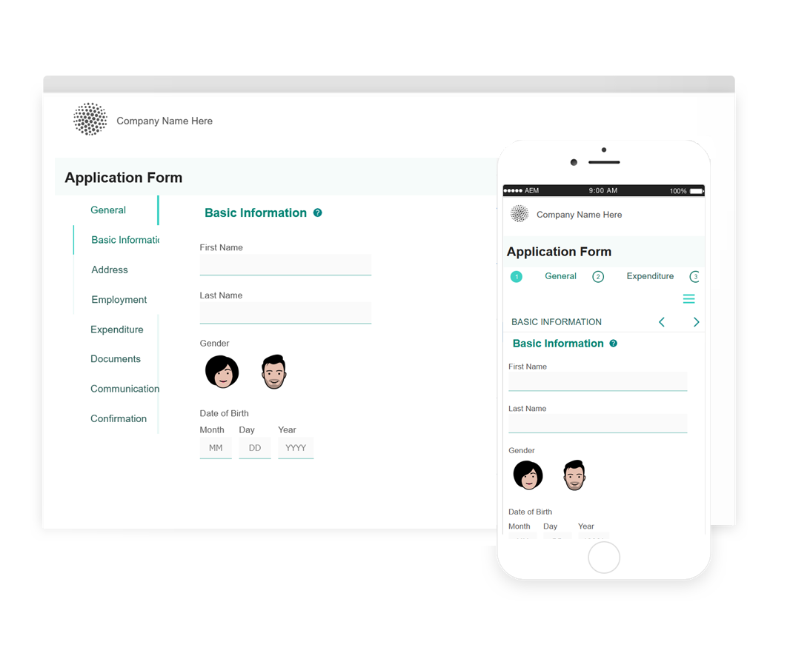

# Temi di riferimento, modelli e modelli dati modulo {#reference-themes-templates-and-data-models}

| Applicabile a | Collegamento articolo |
| -------- | ---------------------------- |
| Modulo adattivo basato su componenti core | [Fai clic qui](https://experienceleague.adobe.com/docs/experience-manager-core-components/using/adaptive-forms/sample-themes-templates-form-data-models-core-components.html) |
| Modulo adattivo basato su componenti di base | Questo articolo |

>[!NOTE]
>
> Adobe consiglia di utilizzare l&#39;acquisizione dati moderna ed estensibile [Componenti core](https://experienceleague.adobe.com/docs/experience-manager-core-components/using/adaptive-forms/introduction.html?lang=it) per [la creazione di un nuovo Forms adattivo](/help/forms/creating-adaptive-form-core-components.md) o [l&#39;aggiunta di Forms adattivo alle pagine AEM Sites](/help/forms/create-or-add-an-adaptive-form-to-aem-sites-page.md). Questi componenti rappresentano un progresso significativo nella creazione di Forms adattivi, garantendo esperienze utente straordinarie. Questo articolo descrive un approccio precedente all’authoring di Forms adattivi utilizzando i componenti di base.

AEM Forms as a Cloud Service fornisce più temi di riferimento, modelli e modelli di dati dei moduli (FDM) per aiutarti a iniziare rapidamente a creare un Forms adattivo. È possibile scaricare il [pacchetto di contenuti di riferimento dal portale di distribuzione software](https://experience.adobe.com/#/downloads/content/software-distribution/en/aemcloud.html?package=/content/software-distribution/it/details.html/content/dam/aemcloud/public/aem-forms-reference-content.ui.content-2.1.0.zip) e utilizzare [Gestione pacchetti](/help/implementing/developing/tools/package-manager.md) per installare il [pacchetto di contenuti di riferimento](https://experience.adobe.com/#/downloads/content/software-distribution/en/aemcloud.html?package=/content/software-distribution/it/details.html/content/dam/aemcloud/public/aem-forms-reference-content.ui.content-2.1.0.zip) nell&#39;ambiente di produzione, sviluppo o sviluppo locale per ottenere queste risorse di riferimento nel proprio ambiente.

I temi, i modelli e il modello dati modulo (FDM) inclusi nel pacchetto di contenuto di riferimento sono:

| Temi | Modelli | Modello dati modulo (FDM) |
|---------|----------|---------|
| Area di lavoro 3.0 | Base | Microsoft Dynamics 365 |
| Tranquilla | Vuoto | Salesforce |
| Urbano |   |  |
| Ultramarina |  |  |
| Beryl |  |  |
| Healthcare |  |   |
| FSI |   |   |

## Temi di riferimento {#reference-themes}

[Temi](/help/forms/themes.md) consente di applicare uno stile ai moduli senza una conoscenza approfondita del CSS. È possibile ottenere i temi seguenti installando il [pacchetto di contenuto di riferimento](https://experience.adobe.com/#/downloads/content/software-distribution/en/aemcloud.html?package=/content/software-distribution/it/details.html/content/dam/aemcloud/public/aem-forms-reference-content.ui.content-2.1.0.zip):

* Beryl
* Area di lavoro 3.0
* Tranquilla
* Urbano
* Ultramarina
* Healthcare
* FSI (Servizi finanziari e assicurativi)

Ogni tema contiene uno stile univoco ed elegante che puoi utilizzare per creare moduli adattivi deliziosi per i tuoi utenti. Contiene uno stile univoco per selettori quali pannello, casella di testo, casella numerica, pulsante di scelta, tabella e interruttore. Gli stili in questi temi sono basati su requisiti. Ad esempio, in uno scenario particolare è necessario un tema minimalista con font puliti. Il tema Liberty ti permette di ottenere questo aspetto.

I temi inclusi in questo pacchetto sono reattivi e lo stile in questi temi è definito per i display mobili e desktop. La maggior parte dei browser moderni su diversi dispositivi può eseguire il rendering di moduli applicati con uno di questi temi senza alcun problema.

Per ulteriori informazioni sull&#39;installazione del pacchetto, vedere [Come utilizzare i pacchetti](/help/implementing/developing/tools/package-manager.md).

## Beryl {#beryl}

Il tema Beryl enfatizza l&#39;uso di immagini di sfondo, trasparenza e icone grandi e piatte. Nella schermata seguente puoi vedere come si presenta il tema Beryl e come può migliorare lo stile del modulo.

## Area di lavoro 3.0 {#canvas}

Canvas 3.0 è il tema predefinito per Adaptive Forms ed evidenzia l&#39;uso di colori di base, trasparenza e icone piatte. Nella schermata seguente puoi vedere come si presenta il tema Canvas 3.0.

## Tranquilla {#tranquil}

Il tema Tranquilla fornisce sfumature chiare e scure della combinazione di colori Tranquil per evidenziare diversi componenti di una forma. Ad esempio, i pulsanti di scelta, i pannelli e le schede hanno una tonalità verde diversa.

## Urbano {#urbane}

Il tema Urbano enfatizza un aspetto minimalista e funzionale per la tua forma. Quando si applica il tema Urbane al modulo, è possibile vedere che i componenti sono piatti. I pannelli hanno contorni sottili per conferire un aspetto moderno.

## Ultramarina {#ultramarine}

Il tema Ultramarine utilizza tonalità blu profonde per evidenziare componenti quali schede, pannelli, caselle di testo e pulsanti.

## Healthcare {#healthcare}

Il tema Healthcare utilizza tonalità verdi profonde per evidenziare componenti come schede, pannelli, caselle di testo e pulsanti.

## FSI (Servizi finanziari e assicurativi)

Il tema FSI enfatizza un aspetto minimalista e funzionale per il modulo. Quando applichi il tema FSI al modulo, puoi vedere che i componenti del pannello sono gialli.

## Modelli di riferimento {#reference-templates}

[Modelli](/help/forms/themes.md) consente di definire la struttura iniziale del modulo, il contenuto e le azioni per i moduli. È possibile ottenere i seguenti modelli installando il [pacchetto di contenuto di riferimento](https://experience.adobe.com/#/downloads/content/software-distribution/en/aemcloud.html?package=/content/software-distribution/it/details.html/content/dam/aemcloud/public/aem-forms-reference-content.ui.content-2.1.0.zip):

* Base
* Vuoto

Il modello di base consente di creare rapidamente un modulo di iscrizione. Puoi utilizzarlo anche per visualizzare in anteprima la funzionalità dei componenti di Adaptive Forms Foundation. Fornisce un layout guidato per la presentazione sezione per sezione dei dati. Utilizza il modello vuoto per iniziare a creare un modulo adattivo da su un’area di lavoro vuota.

## Modello dati modulo di riferimento (FDM) {#reference-models}

Il Forms adattivo può quindi interagire con i server Microsoft Dynamics 365 e Salesforce per abilitare i flussi di lavoro aziendali. Ad esempio:

* Scrivere dati in Microsoft Dynamics 365 e Salesforce all’invio di moduli adattivi.
* Scrivere dati in Microsoft Dynamics 365 e Salesforce tramite entità personalizzate definite in Form Data Model (FDM) e viceversa.
* Eseguire una query su Microsoft Dynamics 365 e Salesforce Server per dati e precompilare Adaptive Forms.
* Leggi i dati da Microsoft Dynamics 365 e dal server Salesforce.

È possibile ottenere il seguente modello dati modulo installando il [pacchetto di contenuto di riferimento](https://experience.adobe.com/#/downloads/content/software-distribution/en/aemcloud.html?package=/content/software-distribution/it/details.html/content/dam/aemcloud/public/aem-forms-reference-content.ui.content-2.1.0.zip):

* Microsoft® Dynamics 365
* Salesforce

Per informazioni sull&#39;utilizzo di questi modelli, vedere [Configurare Microsoft Dynamics 365 e Salesforce Cloud Services](https://experienceleague.adobe.com/docs/experience-manager-cloud-service/content/forms/integrate/use-form-data-model/configure-msdynamics-salesforce.html?lang=en#configure-dynamics-cloud-service)

## Consulta anche {#see-also}

{{see-also}}