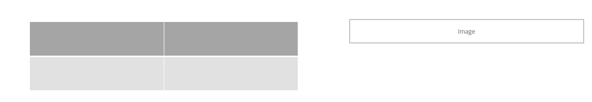
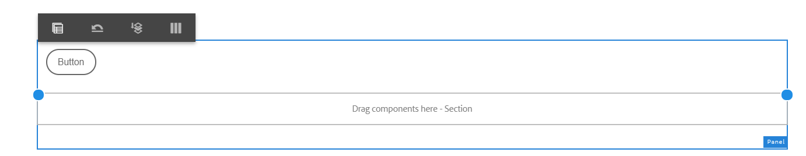

# Utilizzare la modalità Layout per ridimensionare i componenti {#use-layout-mode-to-resize-components}

L’interfaccia per la creazione di moduli adattivi consente di ridimensionare i componenti utilizzando la modalità Layout . Trascina i punti blu all’interno delle colonne per definire i punti iniziale e finale per posizionare i componenti. I punti blu vengono visualizzati dopo aver toccato il componente all’interno della griglia reattiva. La griglia reattiva è costituita da 12 colonne uguali. L’ombreggiatura del colore bianco e blu nelle colonne alternative differenzia una colonna dall’altra.

È possibile utilizzare la modalità Layout per ridimensionare i componenti per tutti i tipi di dispositivi, ad esempio desktop, tablet, telefoni e altri dispositivi più piccoli. Il tablet deriva automaticamente la configurazione del layout dalla versione desktop e i dispositivi più piccoli derivano la configurazione del layout dal telefono. Tuttavia, è possibile ignorare le configurazioni derivate automaticamente per definire una configurazione diversa per ogni tipo di dispositivo.

## Modalità Layout di accesso {#access-layout-mode}

Seleziona **[!UICONTROL Layout]** dall’elenco a discesa nella parte superiore dell’interfaccia per la creazione di moduli adattivi, accanto al **[!UICONTROL Anteprima]** opzione . Il modulo viene visualizzato in modalità Layout .

1. Accedi a [!DNL Adobe Experience Manager] istanza di authoring e passa a **[!UICONTROL Adobe Experience Manager]** > **[!UICONTROL Forms]** > **[!UICONTROL Forms e documenti]**.
1. Crea un nuovo o apri un esistente [Modulo adattivo](creating-adaptive-form.md).
1. Seleziona **[!UICONTROL Layout]** dall’elenco a discesa visualizzato nella parte superiore accanto al **[!UICONTROL Anteprima]** opzione . Il modulo viene visualizzato in modalità Layout .

   

## Ridimensiona i componenti {#resize-components}

1. In modalità Layout, tocca il componente da ridimensionare. I punti blu vengono visualizzati all’inizio e alla fine della griglia reattiva.
1. Trascina i punti blu per definire la posizione del componente nella griglia reattiva.

   

   La barra degli strumenti visualizzata dopo aver toccato i componenti è costituita dalle seguenti opzioni:

   * **[!UICONTROL Elemento padre]**: Seleziona l’elemento padre di un componente.
   * **[!UICONTROL Ripristina layout punto di interruzione]**: Annulla tutte le modifiche di ridimensionamento e applica il layout predefinito al componente.
   * **[!UICONTROL Mobile in nuova riga]**: Se sono presenti più componenti nella stessa riga, sposta il componente sulla riga successiva.

   È inoltre possibile utilizzare **[!UICONTROL Ripristina layout punto di interruzione]** ( ) a livello di pannello per annullare tutte le modifiche di ridimensionamento.

   >[!NOTE]
   >
   >Non è possibile ridimensionare la colonna di una tabella, la barra degli strumenti, il pulsante della barra degli strumenti e i componenti dell’area di destinazione utilizzando la modalità Layout. Utilizza la modalità Stile per ridimensionare questi componenti.

### Esempio {#example}

**Obiettivo:** Desideri inserire un componente tabella e un componente immagine e posizionarli paralleli l’uno all’altro in un modulo adattivo.

1. Inserire la tabella e i componenti immagine utilizzando [!UICONTROL Modifica] nel modulo adattivo. Il componente Immagine viene visualizzato dopo il componente Tabella.
1. Passa a [!UICONTROL Layout] e tocca [!UICONTROL Tabella] componente. I punti blu per ridimensionare il componente vengono visualizzati nelle colonne 1 e 12.
1. Trascina il punto blu nella colonna 12 della colonna 6 della griglia reattiva.

   

1. Analogamente, seleziona la [!UICONTROL Immagine] trascina il punto blu nella colonna 1 della colonna 7 della griglia reattiva. I componenti tabella e immagine vengono visualizzati in parallelo.

   

   Puoi selezionare il componente Immagine e toccare il pulsante **[!UICONTROL Mobile in nuova riga]** per spostare il componente Immagine sulla riga successiva, disponibile nella barra degli strumenti.

## Ridimensiona i pannelli {#resize-panels-layout-mode}

Per ridimensionare l’intero pannello invece dei singoli componenti, esegui i seguenti passaggi:

1. Tocca uno dei componenti del pannello da ridimensionare, seleziona , quindi seleziona la prima opzione nell’elenco a discesa, se il pannello è l’elemento padre diretto del componente.

   I punti blu vengono visualizzati all’inizio e alla fine della griglia reattiva.

1. Trascina i punti blu per definire la posizione del pannello nella griglia reattiva.
Puoi ripetere i passaggi 1 e 2 e selezionare  per spostare il pannello ridimensionato alla riga successiva.

## Definire il layout a più colonne per un pannello

Esegui i seguenti passaggi per definire il numero di colonne per un pannello:

1. In **[!UICONTROL Modifica]** , tocca il pannello, seleziona , quindi seleziona **[!UICONTROL Reattivo : tutto ciò che si trova sulla pagina senza navigazione]** dall&#39;opzione **[!UICONTROL Layout del pannello]** elenco a discesa.

1. Tocca  per salvare le proprietà.

1. In **[!UICONTROL Layout]** , tocca uno dei componenti del pannello e seleziona , quindi seleziona il pannello .

1. Tocca  e selezionare il numero di colonne dall&#39;elenco a discesa. Il numero di colonne può variare da 1 a 12. Il pannello viene diviso in un layout a più colonne.

## Abilita la nuova griglia reattiva per i vecchi layout reattivi {#enableresponsivegrid}

Abilitare la nuova griglia dinamica per i moduli creati con [!DNL Adobe Experience Manager] Forms 6.4 o versione precedente per ridimensionare i componenti.

>[!NOTE]
>
>Il passaggio alla nuova griglia reattiva elimina le proprietà di layout già definite per i componenti utilizzati nel modulo.

Esegui i seguenti passaggi per abilitare la nuova griglia dinamica:

1. Seleziona **[!UICONTROL Layout]** dall’elenco a discesa visualizzato nella parte superiore accanto al **[!UICONTROL Anteprima]** opzione . Viene visualizzata una conferma dell’abilitazione della modalità Layout .
1. Tocca **[!UICONTROL Sì]** per abilitare **[!UICONTROL Layout]** modalità del modulo.

### Incorporare un vecchio frammento in un modulo adattivo con un nuovo layout reattivo {#embed-an-old-fragment-in-an-adaptive-form-with-new-responsive-layout}

Il nuovo layout dinamico per Modulo adattivo consente di aggiungere al modulo un frammento di modulo adattivo con il vecchio layout reattivo. Tuttavia, il nuovo layout elimina le proprietà di layout già definite per i componenti utilizzati nel frammento. È possibile passare alla modalità Layout per definire le proprietà di layout dei componenti utilizzati nel frammento.

### Incorporare un frammento con un nuovo layout reattivo in un vecchio modulo adattivo {#embed-a-fragment-with-new-responsive-layout-in-an-old-adaptive-form}

Se si incorpora un frammento con un nuovo layout dinamico in un modulo adattivo con un vecchio layout dinamico, viene richiesto di abilitare la modalità Layout del modulo e di incorporarlo nuovamente.

Per attivare la modalità Layout, selezionare **[!UICONTROL Layout]** dall’elenco a discesa visualizzato nella parte superiore accanto al **[!UICONTROL Anteprima]** e tocca **[!UICONTROL Sì]** per confermare. Seleziona **[!UICONTROL Modifica]** per incorporare nuovamente il frammento.

## Disattiva la modalità Layout per i moduli con layout reattivo precedente {#disable-layout-mode-for-forms-with-old-responsive-layout}

È possibile disattivare la modalità Layout per i moduli con layout reattivo precedente modificando le proprietà del modello utilizzato nel modulo.

Esegui i seguenti passaggi per disabilitare la modalità Layout :

1. Seleziona **[!UICONTROL Strumenti]** > **[!UICONTROL Generale]** > **[!UICONTROL Modelli]** e aprire il modello utilizzato nel modulo in **[!UICONTROL Modifica]** modalità.
1. Seleziona il Contenitore modulo nel riquadro a sinistra e tocca **[!UICONTROL Criterio.]**

   

1. Tocca **[!UICONTROL Impostazioni layout]** e seleziona **[!UICONTROL Disattiva modalità Layout]**.
1. Tocca  per salvare le proprietà del modello.
