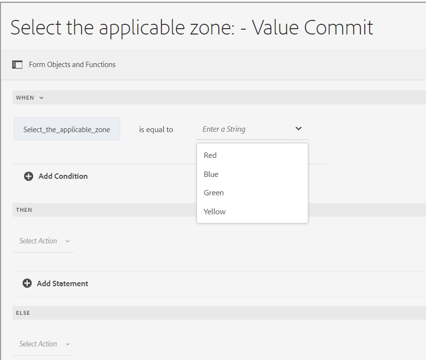

# Tipi di operatori ed eventi nell’editor di regole di un modulo adattivo basato su componenti core

In AEM Forms as a Cloud, l’editor di regole include vari tipi di operatori ed eventi che ti consentono di definire ed eseguire condizioni e azioni complesse con facilità.

I tipi di operatore disponibili nell’editor di regole di un modulo adattivo forniscono un framework affidabile per la creazione di condizioni precise. Consentono di manipolare i dati, eseguire calcoli e combinare più condizioni in modo logico e coerente. Sia che si stiano confrontando valori, eseguendo operazioni aritmetiche o manipolando stringhe, questi operatori garantiscono che le regole siano flessibili e potenti.

Gli eventi nell’editor delle regole fungono da trigger per l’attivazione delle regole. Definiscono le azioni specifiche che si verificano quando vengono soddisfatte determinate condizioni. Sfruttando diversi tipi di eventi, puoi automatizzare le risposte a un’ampia gamma di scenari, ad esempio interazioni degli utenti, orari pianificati, modifiche nei dati e stati del sistema. Con la possibilità di specificare questi trigger, puoi creare regole dinamiche e reattive che soddisfano i tuoi requisiti specifici.

Comprendendo e utilizzando i tipi di operatori e gli eventi disponibili, puoi sfruttare appieno il potenziale dell’editor di regole, che consente di creare regole efficienti ed efficaci in grado di soddisfare esigenze specifiche e migliorare le funzionalità generali del sistema.

## Tipi di operatori ed eventi disponibili nell’editor di regole {#available-operator-types-and-events-in-rule-editor}

L’editor di regole fornisce i seguenti operatori logici ed eventi utilizzando i quali è possibile creare regole.

* **È uguale a** - Controlla se l&#39;oggetto modulo corrisponde a un valore specificato.
* **Is Not Equal To** - Controlla se l&#39;oggetto modulo non corrisponde a un valore specificato.
* **Inizia con** - Controlla se l&#39;oggetto modulo inizia con una stringa specificata.
* **Termina con** - Controlla se l&#39;oggetto modulo termina con una stringa specificata.
* **Contiene** - Controlla se l&#39;oggetto modulo include una sottostringa specificata.
* **Does Not Contain** - Controlla se l&#39;oggetto modulo non include una sottostringa specificata.
* **È vuoto** - Controlla se l&#39;oggetto modulo è vuoto o non specificato.
* **Non è vuoto** - Controlla se l&#39;oggetto modulo è presente e non è vuoto.
* **Ha selezionato** - Restituisce true quando un utente seleziona una casella di controllo, un elenco a discesa o un pulsante di scelta specifica.
* **È inizializzato (evento)** - Restituisce true quando viene eseguito il rendering di un oggetto modulo nel browser.
* **È stato modificato (evento)** - Restituisce true quando un utente modifica il valore o la selezione di un oggetto modulo.
* **È selezionato (evento)** - Restituisce true quando un utente fa clic su un oggetto modulo, ad esempio un pulsante. Un utente può [aggiungere più condizioni al clic sul pulsante](/help/forms/rule-editor-core-components-usecases.md#set-focus-to-another-panel-on-button-click-if-the-first-panel-is-valid).
* **Valido** - Controlla se un oggetto modulo soddisfa i criteri di convalida.
* **Non valido** - Controlla se un oggetto modulo non soddisfa i criteri di convalida.

<!--
* **Navigation(event):** Returns true when the user clicks a navigation object. Navigation objects are used to move between panels. 
* **Step Completion(event):** Returns true when a step of a rule completes.
* **Successful Submission(event):** Returns true on successful submission of data to a form data model.
* **Error in Submission(event):**  Returns true on unsuccessful submission of data to a form data model. -->

### Tipi di regole disponibili nell’editor di regole {#available-rule-types-in-rule-editor}

L’editor di regole fornisce un set di tipi di regole predefiniti che è possibile utilizzare per scrivere regole. Esaminiamo in dettaglio ogni tipo di regola. Per ulteriori informazioni sulla scrittura di regole nell&#39;editor di regole, vedere [Scrivi regole](/help/forms/rule-editor-core-components-user-interface.md#write-rules).

#### [!UICONTROL Quando] {#whenruletype}

Il tipo di regola **[!UICONTROL When]** segue il costrutto della regola **condition-action-alternate action** oppure, a volte, solo il costrutto **condition-action**. In questo tipo di regola si specifica innanzitutto una condizione per la valutazione seguita da un&#39;azione da attivare se la condizione viene soddisfatta ( `True`). Durante l&#39;utilizzo del tipo di regola When, è possibile utilizzare più operatori AND e OR per creare [espressioni nidificate](/help/forms/rule-editor-core-components-usecases.md#nested-expressions).

Utilizzando il tipo di regola When, è possibile valutare una condizione in un oggetto modulo ed eseguire azioni su uno o più oggetti.

In parole semplici, una regola When tipica è strutturata come segue:

`When on Object A:`

`(Condition 1 AND Condition 2 OR Condition 3) is TRUE;`

`Then, do the following:`

`Action 2 on Object B;`
`AND`
`Action 3 on Object C;`

`Else, do the following:`

`Action 2 on Object C;`

Quando si dispone di un componente con più valori, ad esempio pulsanti di scelta o elenco, durante la creazione di una regola per tale componente le opzioni vengono recuperate e rese disponibili automaticamente al creatore della regola. Non è necessario digitare nuovamente i valori delle opzioni.

Ad esempio, un elenco include quattro opzioni: Rosso, Blu, Verde e Giallo. Durante la creazione della regola, le opzioni (pulsanti di scelta) vengono recuperate e rese disponibili automaticamente al creatore della regola come segue:

Durante la scrittura di una regola When, puoi attivare l&#39;azione Cancella valore di. Cancella valore dell&#39;azione cancella il valore dell&#39;oggetto specificato. L&#39;opzione Clear Value (Cancella valore) nell&#39;istruzione When consente di creare condizioni complesse con più campi. È possibile aggiungere l&#39;istruzione Else per aggiungere ulteriori condizioni

>[!NOTE]
>
> Quando il tipo di regola supporta solo istruzioni then-else a livello singolo.

##### Più campi consentiti in [!UICONTROL When] {#allowed-multiple-fields}

Nella condizione **When** è possibile aggiungere altri campi oltre al campo a cui viene applicata la regola.

Ad esempio, utilizzando il tipo di regola When, è possibile valutare una condizione su diversi oggetti modulo ed eseguire l&#39;azione:

Quando:

(Oggetto A Condizione 1)

E/O

(Oggetto B Condizione 2)

Quindi, effettua le seguenti operazioni:

Azione 1 sull&#39;oggetto A

_

**Considerazioni durante l&#39;utilizzo di più campi consentiti nella funzionalità condizione When**

* Assicurati che il componente core [&#x200B; sia impostato sulla versione 3.0.14 o successiva](https://github.com/adobe/aem-core-forms-components) per utilizzare questa funzione nell&#39;editor di regole.
* Se le regole vengono applicate a campi diversi all’interno della condizione When, la regola viene attivata anche se solo uno di questi campi viene modificato.
* È possibile aggiungere solo più campi nella condizione **When** per una regola **AND**. Impossibile eseguire una regola **OR**.

>[!NOTE]
>
> Per aggiungere più condizioni che includono un clic su pulsante, assicurati che l’evento clic su pulsante sia inserito come prima condizione. `When button is clicked AND text input equals '5'` ad esempio è valido, mentre `When text input equals '5' AND button is clicked` non è supportato.

<!--
* It is not possible to add multiple fields in the When condition while applying rules to a button.

##### To enable Allowed Multiple fields in When condition feature

Allowed Multiple fields in When condition feature is disabled by default. To enable this feature, add a custom property at the template policy:

1. Open the corresponding template associated with an Adaptive Form in the template editor.
1. Select the existing policy as **formcontainer-policy**.
1. Navigate to the **[!UICONTROL Structure]**  view and, from the **[!UICONTROL Allowed Components]** list, open the **[!UICONTROL Adaptive Forms Container]** policy.
1. Go to the **[!UICONTROL Custom Properties]** tab and to add a custom property, click **[!UICONTROL Add]**.
1. Specify the **Group Name** of your choice. For example, in our case, we added the group name as **allowedfeature**.
1. Add the **key** and **value** pair as follows:
   * key: fd:changeEventBehaviour
   * value: deps
1. Click **[!UICONTROL Done]**. -->

Se nella funzione Condizione When sono presenti più campi consentiti, segui i passaggi di risoluzione dei problemi descritti di seguito.

1. Apri il passaggio in modalità di modifica.
1. Apri il browser Contenuti e seleziona il componente **[!UICONTROL Contenitore guida]** del modulo adattivo.
1. Fare clic sull&#39;icona delle proprietà del Contenitore Guida TV . Viene visualizzata la finestra di dialogo Contenitore modulo adattivo (Adaptive Form Container).
1. Fai clic su Fine e salva di nuovo la finestra di dialogo.

**[!UICONTROL Nascondi]** Nasconde l&#39;oggetto specificato.

**[!UICONTROL Mostra]** mostra l&#39;oggetto specificato.

**[!UICONTROL Abilita]** Abilita l&#39;oggetto specificato.

**[!UICONTROL Disabilita]** Disabilita l&#39;oggetto specificato.

**[!UICONTROL Richiama servizio]** Richiama un servizio configurato in un modello dati modulo (FDM). Quando scegli l’operazione Richiama servizio, viene visualizzato un campo. Quando tocca il campo, vengono visualizzati tutti i servizi configurati in tutti i modelli di dati del modulo (FDM) nell&#39;istanza [!DNL Experience Manager]. Quando si sceglie un servizio Modello dati modulo, vengono visualizzati più campi in cui è possibile mappare gli oggetti modulo con i parametri di input per il servizio specificato. Puoi mappare i parametri di output tramite l’opzione payload dell’evento per il servizio specificato. Puoi anche creare regole per la gestione delle risposte di esito positivo e negativo dell’operazione Richiama servizio utilizzando l’editor di regole.

>[!NOTE]
>
> Per ulteriori informazioni sul servizio Invoke, [fai clic qui](/help/forms/invoke-service-enhancements-rule-editor.md).

Vedi la regola di esempio per richiamare i servizi del modello dati modulo (FDM).

Oltre al servizio Modello dati modulo, è possibile specificare un URL WSDL diretto per richiamare un servizio Web. Tuttavia, un servizio di modello dati modulo presenta molti vantaggi e l’approccio consigliato per richiamare un servizio.

Per ulteriori informazioni sulla configurazione dei servizi nel modello dati modulo, vedere [[!DNL Experience Manager Forms] Integrazione dati](data-integration.md).

**[!UICONTROL Imposta il valore di]** Calcola e imposta il valore dell&#39;oggetto specificato. È possibile impostare il valore dell&#39;oggetto su una stringa, il valore di un altro oggetto, il valore calcolato utilizzando un&#39;espressione o una funzione matematica, il valore di una proprietà di un oggetto o il valore di output di un servizio Form Data Model configurato. Quando si sceglie l&#39;opzione Servizio Web, vengono visualizzati tutti i servizi configurati in tutti i modelli di dati del modulo (FDM) nell&#39;istanza [!DNL Experience Manager]. Quando si sceglie un servizio Modello dati modulo, vengono visualizzati più campi in cui è possibile mappare gli oggetti modulo con i parametri di input e output per il servizio specificato.

Per ulteriori informazioni sulla configurazione dei servizi nel modello dati modulo, vedere [[!DNL Experience Manager Forms] Integrazione dati](data-integration.md).

Il tipo di regola **[!UICONTROL Imposta proprietà]** consente di impostare il valore di una proprietà dell&#39;oggetto specificato in base a un&#39;azione condizione. È possibile impostare la proprietà su una delle seguenti opzioni:
* visibile (booleano)
* label.value (Stringa)
* label.visible (booleano)
* description (String)
* abilitato (booleano)
* readOnly (booleano)
* obbligatorio (booleano)
* screenReaderText (stringa)
* valido (booleano)
* errorMessage (stringa)
* impostazione predefinita (numero, stringa, data)
* enumNames (Stringa[])
* chartType (String)

Ad esempio, consente di definire regole per visualizzare la casella di testo quando si fa clic su un pulsante. Per definire una regola è possibile utilizzare una funzione personalizzata, un oggetto modulo, una proprietà oggetto o un output di servizio.

Per definire una regola basata su una funzione personalizzata, selezionare **[!UICONTROL Output funzione]** dall&#39;elenco a discesa e trascinare una funzione personalizzata dalla scheda **[!UICONTROL Funzioni]**. Se l&#39;azione della condizione viene soddisfatta, la casella di immissione testo diventa visibile.

Per definire una regola basata su un oggetto modulo, selezionare **[!UICONTROL Oggetto modulo]** dall&#39;elenco a discesa e trascinare un oggetto modulo dalla scheda **[!UICONTROL Oggetti modulo]**. Se l’azione della condizione viene soddisfatta, la casella di immissione testo diventa visibile nel modulo adattivo.

Una regola Imposta proprietà basata su una proprietà oggetto consente di rendere visibile la casella di input di testo in un modulo adattivo basato su un’altra proprietà oggetto inclusa nel modulo adattivo.

La figura seguente illustra un esempio di attivazione dinamica della casella di controllo in base al fatto che una casella di testo viene nascosta o visualizzata in un modulo adattivo:

**[!UICONTROL Cancella valore di]** Cancella il valore dell&#39;oggetto specificato.

**[!UICONTROL Imposta stato attivo]** Imposta lo stato attivo sull&#39;oggetto specificato.

**[!UICONTROL Invia modulo]** invia il modulo.

**[!UICONTROL Reimposta]** Reimposta il modulo o l&#39;oggetto specificato.

**[!UICONTROL Convalida]** convalida il modulo o l&#39;oggetto specificato.

**[!UICONTROL Aggiungi istanza]** Aggiunge un&#39;istanza del pannello o della riga di tabella ripetibile specificata.

**[!UICONTROL Rimuovi istanza]** Rimuove un&#39;istanza del pannello o della riga di tabella ripetibile specificata.

**[!UICONTROL Output funzione]** Definisce una regola basata su funzioni predefinite o personalizzate.

**[!UICONTROL Passa a]** Passa ad altre risorse Adaptive Forms, ad esempio immagini o frammenti di documenti, oppure a un URL esterno. <!-- For more information, see [Add button to the Interactive Communication](create-interactive-communication.md#addbuttontothewebchannel). -->

**[!UICONTROL Evento di invio]** Attiva azioni o comportamenti specifici in base a condizioni o eventi predefiniti.

#### [!UICONTROL Imposta valore di] {#set-value-of}

Il tipo di regola **[!UICONTROL Imposta valore di]** consente di impostare il valore di un oggetto modulo a seconda che la condizione specificata sia soddisfatta o meno. Il valore può essere impostato sul valore di un altro oggetto, una stringa letterale, un valore derivato da un&#39;espressione matematica o una funzione, un valore di una proprietà di un altro oggetto o l&#39;output di un servizio del modello di dati modulo. Analogamente, è possibile verificare la presenza di una condizione su un componente, una stringa, una proprietà o valori derivati da una funzione o un&#39;espressione matematica.

Il tipo di regola **Imposta valore di** non è disponibile per tutti gli oggetti modulo, ad esempio pannelli e pulsanti della barra degli strumenti. Una regola Set Value Of standard ha la seguente struttura:

Impostare il valore dell&#39;oggetto A su:

(Stringa ABC) OPPURE
(proprietà dell&#39;oggetto X dell&#39;oggetto C) OPPURE
(valore da una funzione) OPPURE
(valore da un&#39;espressione matematica) OPPURE
(valore di output di un servizio di modello dati);

Quando (facoltativo):

(Condizione 1 AND Condizione 2 AND Condizione 3) è TRUE;

L&#39;esempio seguente seleziona il valore di `Question2` come `True` e imposta il valore di `Result` come `correct`.

Esempio di regola Imposta valore tramite il servizio Modello dati modulo.

#### [!UICONTROL Mostra] {#show}

Utilizzando il tipo di regola **[!UICONTROL Mostra]**, è possibile scrivere una regola per mostrare o nascondere un oggetto modulo in base al soddisfacimento o meno di una condizione. Il tipo di regola Show attiva anche l&#39;azione Nascondi nel caso in cui la condizione non sia soddisfatta o restituisca `False`.

Una regola Show tipica è strutturata come segue:

`Show Object A;`

`When:`

`(Condition 1 OR Condition 2 OR Condition 3) is TRUE;`

`Else:`

`Hide Object A;`

#### [!UICONTROL Nascondi] {#hide}

Analogamente al tipo di regola Mostra, è possibile utilizzare il tipo di regola **[!UICONTROL Nascondi]** per mostrare o nascondere un oggetto modulo in base al soddisfacimento o meno di una condizione. Il tipo di regola Nascondi attiva anche l&#39;azione Mostra se la condizione non è soddisfatta o restituisce `False`.

Una tipica regola Nascondi è strutturata come segue:

`Hide Object A;`

`When:`

`(Condition 1 AND Condition 2 AND Condition 3) is TRUE;`

`Else:`

`Show Object A;`

#### [!UICONTROL Abilita] {#enable}

Il tipo di regola **[!UICONTROL Enable]** consente di abilitare o disabilitare un oggetto modulo in base al soddisfacimento o meno di una condizione. Il tipo di regola Enable attiva anche l&#39;azione Disable nel caso in cui la condizione non sia soddisfatta o restituisca `False`.

Una regola di abilitazione tipica è strutturata come segue:

`Enable Object A;`

`When:`

`(Condition 1 AND Condition 2 AND Condition 3) is TRUE;`

`Else:`

`Disable Object A;`

#### [!UICONTROL Disattiva] {#disable}

Analogamente al tipo di regola Abilita, il tipo di regola **[!UICONTROL Disabilita]** consente di abilitare o disabilitare un oggetto modulo a seconda che una condizione sia soddisfatta o meno. Il tipo di regola Disable attiva anche l&#39;azione Enable nel caso in cui la condizione non sia soddisfatta o restituisca `False`.

Una regola di Disattivazione tipica è strutturata come segue:

`Disable Object A;`

`When:`

`(Condition 1 OR Condition 2 OR Condition 3) is TRUE;`

`Else:`

`Enable Object A;`

#### [!UICONTROL Convalida] {#validate}

Il tipo di regola **[!UICONTROL Convalida]** convalida il valore in un campo utilizzando un&#39;espressione. È ad esempio possibile scrivere un&#39;espressione per verificare che la casella di testo per specificare un nome non contenga caratteri o numeri speciali.

Una regola di convalida tipica è strutturata come segue:

`Validate Object A;`

`Using:`

`(Expression 1 AND Expression 2 AND Expression 3) is TRUE;`

>[!NOTE]
>
>Se il valore specificato non è conforme alla regola di convalida, è possibile visualizzare un messaggio di convalida per l&#39;utente. È possibile specificare il messaggio nel campo **[!UICONTROL Messaggio di convalida dello script]** nelle proprietà del componente nella barra laterale.

#### [!UICONTROL Spostati tra i pannelli]

Il tipo di regola **[!UICONTROL Naviga tra i pannelli]** consente di spostare lo stato attivo tra pannelli diversi in un modulo. Ad esempio, puoi creare un’espressione per spostare lo stato attivo sul pannello successivo.

Una tipica regola di **navigazione tra i pannelli** per spostare lo stato attivo sul pannello successivo è strutturata come segue:

`Navigate among the panels`

`Shift focus to the next item Object A;`

`When:`

`(Condition 1 OR Condition 2 OR Condition 3) is TRUE;`

Analogamente, puoi scrivere **Navigare tra i pannelli** regola per spostare lo stato attivo sul pannello precedente:

`Navigate among the panels`

`Shift focus to the previous item Object A;`

`When:`

`(Condition 1 OR Condition 2 OR Condition 3) is TRUE;`

Per ulteriori dettagli su come creare una regola per navigare in un pannello, [fai clic qui](/help/forms/rule-editor-core-components-usecases.md#navigating-between-panels-using-buttons).

#### [!UICONTROL Chiamata funzione asincrona]

Si tratta di una funzione pre-release accessibile tramite il [canale pre-release](https://experienceleague.adobe.com/docs/experience-manager-cloud-service/content/release-notes/prerelease.html?lang=it#new-features). 

Il tipo di regola **[!UICONTROL Chiamata funzione asincrona]** consente di eseguire funzioni asincrone. Consente di avviare una chiamata di funzione che funziona in modo indipendente dal thread di esecuzione principale, consentendo ad altri processi di continuare l’esecuzione senza attendere il completamento della funzione asincrona.

Una regola di chiamata della funzione asincrona tipica per eseguire la funzione asincrona è strutturata come segue:

`When:`

`(Condition 1 OR Condition 2 OR Condition 3) is TRUE;`

`Async Function call`

`[Callback Function];`

Per ulteriori informazioni sull&#39;utilizzo della chiamata alla funzione asincrona nell&#39;editor di regole visive, fare riferimento all&#39;articolo [Utilizzo di chiamate alle funzioni asincrone nell&#39;editor di regole](/help/forms/using-async-funct-in-rule-editor.md).

<!--
### [!UICONTROL Set Options Of] {#setoptionsof}

The **[!UICONTROL Set Options Of]** rule type enables you to define rules to add check boxes dynamically to the Adaptive Form. You can use a Form Data Model or a custom function to define the rule.

To define a rule based on a custom function, select **[!UICONTROL Function Output]** from the drop-down list, and drag-and-drop a custom function from the **[!UICONTROL Functions]** tab. The number of checkboxes defined in the custom function are added to the Adaptive Form.

To create a custom function, see [custom functions in rule editor](#custom-functions).

To define a rule based on a form data model:

1. Select **[!UICONTROL Service Output]** from the drop-down list.
1. Select the data model object.
1. Select a data model object property from the **[!UICONTROL Display Value]** drop-down list. The number of checkboxes in the Adaptive Form is derived from the number of instances defined for that property in the database.
1. Select a data model object property from the **[!UICONTROL Save Value]** drop-down list.

 -->

## Passaggio successivo

Comprendiamo ora diversi [esempi per un editor di regole per un modulo adattivo basato su componenti core](/help/forms/rule-editor-core-components-usecases.md).

## Consulta anche

{{see-also-rule-editor}}
