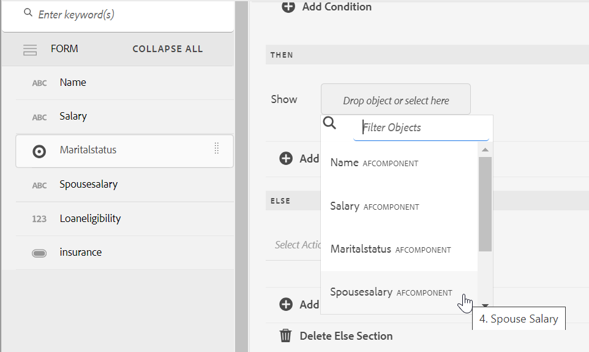
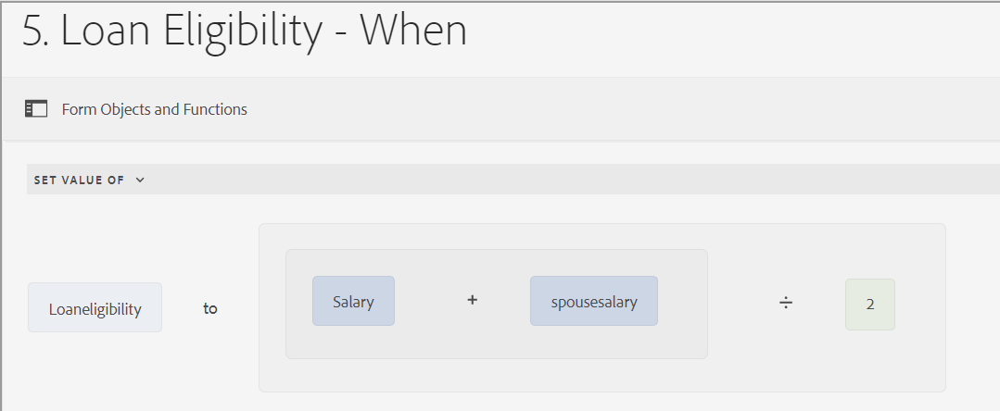

# Interfaccia utente dell’editor di regole per moduli adattivi basati su componenti core

L’interfaccia utente dell’Editor regole per Forms adattivo basato su componenti core ottimizza il processo di creazione dei moduli in Adobe Experience Manager (AEM). Consente sia agli utenti aziendali che agli sviluppatori di implementare comportamenti dinamici e logiche complesse nei moduli scrivendo regole che attivano azioni in base a condizioni predefinite, input utente e interazioni. Questa funzione supporta le funzionalità moderne di JavaScript fino a ES2022 e offre un editor visivo intuitivo che semplifica il processo di scrittura delle regole.
L’editor di regole è fondamentale per semplificare l’esperienza di compilazione dei moduli, garantendo sia precisione che efficienza. Consente la convalida o il ripristino di pannelli e moduli e l&#39;esecuzione di funzioni personalizzate per il calcolo dei valori degli oggetti modulo. Grazie al supporto delle condizioni nidificate e alla possibilità di richiamare i servizi del modello dati modulo, l’interfaccia utente dell’editor di regole è un componente fondamentale per la creazione di moduli reattivi, di facile utilizzo e adattivi.

## Interfaccia utente dell’editor di regole {#understanding-the-rule-editor-user-interface}

L’editor di regole fornisce un’interfaccia utente completa ma semplice per scrivere e gestire le regole. Puoi avviare l’interfaccia utente dell’editor di regole da un modulo adattivo in modalità di authoring.

Per avviare l’interfaccia utente dell’editor di regole:

1. Apri un modulo adattivo in modalità di authoring.
1. Selezionare l&#39;oggetto modulo per il quale si desidera scrivere una regola e nella barra degli strumenti del componente selezionare . Viene visualizzata l’interfaccia utente dell’editor di regole.

   

   Tutte le regole esistenti sugli oggetti modulo selezionati sono elencate in questa visualizzazione. Per informazioni sulla gestione delle regole esistenti, vedere [Gestire le regole](rule-editor.md#p-manage-rules-p).

1. Seleziona **[!UICONTROL Crea]** per scrivere una nuova regola. L’editor visivo dell’interfaccia utente dell’editor di regole si apre per impostazione predefinita quando si avvia l’editor di regole la prima volta.

   

Esaminiamo in dettaglio ogni componente dell’interfaccia utente dell’editor di regole.

### A. Visualizzazione delle regole dei componenti {#a-component-rule-display}

Visualizza il titolo dell&#39;oggetto modulo adattivo tramite il quale è stato avviato l&#39;editor di regole e il tipo di regola attualmente selezionato. Nell’esempio precedente, l’editor di regole viene avviato da un oggetto Modulo adattivo denominato Domanda 1 e il tipo di regola selezionato è Quando.

### B. Oggetti e funzioni del modulo {#b-form-objects-and-functions-br}

Il riquadro a sinistra nell&#39;interfaccia utente dell&#39;editor di regole include due schede: **[!UICONTROL Oggetti Forms]** e **[!UICONTROL Funzioni]**.

La scheda Oggetti modulo mostra una vista gerarchica di tutti gli oggetti contenuti nel modulo adattivo. Visualizza il titolo e il tipo degli oggetti. Durante la scrittura di una regola, è possibile trascinare gli oggetti modulo nell’editor di regole. Quando si trascina un oggetto o una funzione in un segnaposto durante la creazione o la modifica di una regola, il segnaposto assume automaticamente il tipo di valore appropriato.

Gli oggetti modulo a cui sono applicate una o più regole valide sono contrassegnati da un punto verde. Se una delle regole applicate a un oggetto modulo non è valida, l&#39;oggetto modulo viene contrassegnato con un punto giallo.

La scheda Funzioni include un set di funzioni incorporate, ad esempio Somma di, Min di, Max di, Media di, Numero di e Convalida modulo. È possibile utilizzare queste funzioni per calcolare i valori nei pannelli e nelle righe di tabella ripetibili e utilizzarli nelle istruzioni di azione e condizione durante la scrittura delle regole. Tuttavia, puoi anche creare funzioni personalizzate.

Nella figura sono illustrate alcune delle funzioni elencate di seguito:


>[!NOTE]
>
>È possibile eseguire la ricerca di testo su oggetti e funzioni, nomi e titoli nelle schede Oggetti e funzioni di Forms.

Nell&#39;albero sinistro degli oggetti modulo è possibile selezionare gli oggetti modulo per visualizzare le regole applicate a ciascuno degli oggetti. Non solo è possibile spostarsi tra le regole dei vari oggetti modulo, ma è anche possibile copiare e incollare le regole tra gli oggetti modulo. Per ulteriori informazioni, vedere [Copiare e incollare le regole](rule-editor.md#p-copy-paste-rules-p).

### C. Attivazione/disattivazione di funzioni e oggetti modulo {#c-form-objects-and-functions-toggle-br}

Quando viene toccato questo pulsante di attivazione, diventa attivo il riquadro Oggetti modulo o il riquadro Funzioni.

### D. Editor di regole visive {#visual-rule-editor}

L’editor di regole visive è l’area in cui si scrivono le regole nella modalità editor visivo dell’interfaccia utente dell’editor di regole. Ti consente di selezionare un tipo di regola e di definire di conseguenza condizioni e azioni. Quando si definiscono condizioni e azioni in una regola, è possibile trascinare gli oggetti modulo e le funzioni dal riquadro Oggetti modulo e funzioni.

Per ulteriori informazioni sull&#39;utilizzo di un editor di regole visive, vedere [Scrivere regole](rule-editor.md#p-write-rules-p).
<!-- 
### E. Visual-code editors switcher {#e-visual-code-editors-switcher}

Users in the forms-power-users group can access code editor. For other users, code editor is not available. If you have the rights, you can switch from visual editor mode to code editor mode of the rule editor, and conversely, using the switcher right above the rule editor. When you launch rule editor the first time, it opens in the visual editor mode. You can write rules in the visual editor mode or switch to the code editor mode to write a rule script. However, note that if you modify a rule or write a rule in code editor, you cannot switch back to the visual editor for that rule unless you clear the code editor.

[!DNL Experience Manager Forms] tracks the rule editor mode you used last to write a rule. When you launch the rule editor next time, it opens in that mode. However, you can also configure a default mode to open the rule editor in the specified mode. To do so:

1. Go to [!DNL Experience Manager] web console at `https://[host]:[port]/system/console/configMgr`.
1. Click to edit **[!UICONTROL Adaptive Form Configuration Service]**.
1. choose **[!UICONTROL Visual Editor]** or **[!UICONTROL Code Editor]** from the **[!UICONTROL Default Mode for Rule Editor]** drop-down

1. Click **[!UICONTROL Save]**.
-->

### E. Tasti Done e cancel {#done-and-cancel-buttons}

Il pulsante **[!UICONTROL Fine]** viene utilizzato per salvare una regola. È possibile salvare una regola incompleta. Tuttavia, i dati incompleti non sono validi e non vengono eseguiti. Le regole salvate su un oggetto modulo vengono elencate quando si avvia l’editor di regole la prossima volta dallo stesso oggetto modulo. Puoi gestire le regole esistenti in tale vista. Per ulteriori informazioni, vedere [Gestione regole](rule-editor.md#p-manage-rules-p).

Il pulsante **[!UICONTROL Annulla]** elimina le modifiche apportate a una regola e chiude l&#39;editor di regole.

## Scrivi regole {#write-rules}

È possibile scrivere regole utilizzando l&#39;editor di regole visive <!-- or the code editor. When you launch the rule editor the first time, it opens in the visual editor mode. You can switch to the code editor mode and write rules. However, if you write or modify a rule in code editor, you cannot switch to the visual editor for that rule unless you clear the code editor. When you launch the rule editor next time, it opens in the mode that you used last to create rule. -->

Vediamo innanzitutto come scrivere regole utilizzando un editor visivo.

+++ Utilizzo dell&#39;editor visivo {#using-visual-editor}

Comprendiamo come creare una regola in un editor visivo utilizzando il seguente modulo di esempio.


La sezione Requisiti del prestito nell&#39;esempio di modulo di domanda di prestito richiede ai richiedenti di specificare il loro stato civile, lo stipendio e, in caso di matrimonio, lo stipendio del coniuge. In base agli input dell’utente, la regola calcola l’importo di idoneità al prestito e viene visualizzata nel campo Idoneità al prestito. Per implementare lo scenario, applica le seguenti regole:

* Il campo Stipendio coniuge viene visualizzato solo quando lo stato civile è sposato.
* L’importo di ammissibilità al prestito è pari al 50% dello stipendio totale.

Per scrivere regole, esegui i seguenti passaggi:

1. Innanzitutto, scrivi la regola per controllare la visibilità del campo Stipendio coniuge in base all’opzione selezionata dall’utente per il pulsante di opzione Stato civile.

   Apri il modulo di richiesta di prestito in modalità di creazione. Selezionare il componente **[!UICONTROL Stato civile]** e selezionare . Quindi, seleziona **[!UICONTROL Crea]** per avviare l&#39;editor di regole.

   

   Quando si avvia l&#39;editor di regole, la regola When è selezionata per impostazione predefinita. Inoltre, l&#39;oggetto modulo (in questo caso, Stato civile) da cui è stato avviato l&#39;editor di regole è specificato nell&#39;istruzione When.

   Sebbene non sia possibile modificare l&#39;oggetto selezionato, è possibile utilizzare l&#39;elenco a discesa delle regole, come illustrato di seguito, per selezionare un altro tipo di regola. Se desideri creare una regola su un altro oggetto, seleziona Annulla per uscire dall’editor di regole e riavviarlo dall’oggetto modulo desiderato.

1. Seleziona l&#39;elenco a discesa **[!UICONTROL Seleziona stato]** e seleziona **[!UICONTROL è uguale a]**. Viene visualizzato il campo **[!UICONTROL Enter a String]**.

   

1. Nel campo **[!UICONTROL Immettere una stringa]** nella regola, selezionare **Sposato** dal menu a discesa.

   

   La condizione è stata definita come `When Marital Status is equal to Married`. Quindi, definisci l’azione da eseguire se questa condizione è True.

1. Nell&#39;istruzione Then, selezionare **[!UICONTROL Show]** dal menu a discesa **[!UICONTROL Select Action]**.

   

1. Trascina il campo **[!UICONTROL Stipendio coniuge]** dalla scheda Oggetti modulo del campo **[!UICONTROL Rilascia oggetto o seleziona qui]**. In alternativa, selezionare il campo **[!UICONTROL Rilascia l&#39;oggetto o seleziona qui]** e selezionare il campo **[!UICONTROL Stipendio coniuge]** dal menu a comparsa, che elenca tutti gli oggetti modulo nel modulo.

   

   Quindi, definisci l’azione da eseguire se questa condizione è False.
1. Fare clic su **[!UICONTROL Aggiungi sezione Else]** per aggiungere un&#39;altra condizione per il campo **[!UICONTROL Stipendio coniuge]**, nel caso in cui si selezioni Stato civile come singolo.

   


1. Nell&#39;istruzione Else, selezionare **[!UICONTROL Nascondi]** dal menu a discesa **[!UICONTROL Seleziona azione]**.
   

1. Trascina il campo **[!UICONTROL Stipendio coniuge]** dalla scheda Oggetti modulo del campo **[!UICONTROL Rilascia oggetto o seleziona qui]**. In alternativa, selezionare il campo **[!UICONTROL Rilascia l&#39;oggetto o seleziona qui]** e selezionare il campo **[!UICONTROL Stipendio coniuge]** dal menu a comparsa, che elenca tutti gli oggetti modulo nel modulo.
   

   La regola viene visualizzata come segue nell’editor di regole.

   

1. Per salvare la regola, fai clic su **[!UICONTROL Fine]**.

<!--
1. Repeat steps 1 through 5 to define another rule to hide the Spouse Salary field if the marital Status is Single. The rule appears as follows in the rule editor.

    -->

>[!NOTE]
>
> In alternativa, è possibile scrivere una regola Mostra nel campo Stipendio coniuge, anziché una regola Quando nel campo Stato civile, per implementare lo stesso comportamento.


1. Scrivere quindi una regola per calcolare l&#39;importo dell&#39;idoneità al prestito, che corrisponde al 50% dello stipendio totale, e visualizzarlo nel campo Idoneità al prestito. Per ottenere questo risultato, crea **[!UICONTROL Regole per il valore impostato su]** nel campo Ammissibilità al prestito.

   In modalità creazione, seleziona il campo **[!UICONTROL Idoneità prestito]** e seleziona . Quindi, seleziona **[!UICONTROL Crea]** per avviare l&#39;editor di regole.

1. Selezionare **[!UICONTROL Imposta valore di]** regola dal menu a discesa delle regole.

   

1. Seleziona **[!UICONTROL Seleziona opzione]** e scegli **[!UICONTROL Espressione matematica]**. Si apre un campo in cui scrivere espressioni matematiche.

   

1. Nel campo espressione:

   * Seleziona o trascina dalla scheda Oggetto Forms il campo **[!UICONTROL Stipendio]** nel primo campo **[!UICONTROL Rilascia oggetto o seleziona qui]**.

   * Seleziona **[!UICONTROL Plus]** dal campo **[!UICONTROL Seleziona operatore]**.

   * Seleziona o trascina dalla scheda Oggetto Forms il campo **[!UICONTROL Stipendio coniuge]** nell&#39;altro campo **[!UICONTROL Rilascia oggetto o seleziona qui]**.

   

1. Quindi, seleziona nell’area evidenziata intorno al campo espressione e seleziona **[!UICONTROL Estendi espressione]**.

   

   Nel campo espressione estesa, seleziona **[!UICONTROL diviso per]** dal campo **[!UICONTROL Seleziona operatore]** e **[!UICONTROL Numero]** dal campo **[!UICONTROL Seleziona opzione]**. Specificare quindi **[!UICONTROL 2]** nel campo numerico.

   

   >[!NOTE]
   >
   >È possibile creare espressioni complesse utilizzando componenti, funzioni, espressioni matematiche e valori di proprietà dal campo Seleziona opzione.

   Quindi, crea una condizione, che quando restituisce True, l’espressione viene eseguita.

1. Selezionare **[!UICONTROL Aggiungi condizione]** per aggiungere un&#39;istruzione When.

   

   Nell&#39;istruzione When:

   * Seleziona o trascina dalla scheda Oggetto Forms il campo **[!UICONTROL Stato civile]** nel primo campo **[!UICONTROL Rilascia oggetto o seleziona qui]**.

   * Selezionare **[!UICONTROL è uguale a]** dal campo **[!UICONTROL Seleziona operatore]**.

   * Seleziona Stringa nell&#39;altro **[!UICONTROL Rilascia l&#39;oggetto o seleziona qui]** campo e specifica **[!UICONTROL Sposato]** nel campo **[!UICONTROL Immetti una stringa]**.

   La regola viene infine visualizzata come segue nell’editor di regole.  

1. Seleziona **[!UICONTROL Fine]**. Salva la regola.

1. Ripetere i passaggi da 7 a 14 per definire un&#39;altra regola per calcolare l&#39;idoneità al prestito se lo stato civile è Single. La regola viene visualizzata come segue nell’editor di regole.

   

In alternativa, è possibile utilizzare la regola Imposta valore di per calcolare l&#39;idoneità al prestito nella regola Quando creata per mostrare-nascondere il campo Stipendio coniuge. La regola combinata risultante quando Stato civile è Singolo viene visualizzata come segue nell’editor delle regole.


È possibile scrivere una regola combinata per controllare la visibilità del campo Stipendio coniuge e calcolare l&#39;idoneità al prestito quando lo stato civile è Sposato utilizzando la condizione Else.


+++

### Supporto di funzioni ed espressioni matematiche nei parametri di input

I parametri di input ora supportano entrambi gli output di funzione, ad esempio concat, trim e join, nonché le espressioni matematiche. Questo miglioramento consente agli autori dei moduli di trasmettere direttamente i valori calcolati in modo dinamico, semplificando le configurazioni delle regole, riducendo la necessità di campi aggiuntivi e rendendo i moduli più adattabili a scenari logici e basati su calcoli complessi.


### Gestione delle regole interrotte

Le regole possono a volte interrompersi se un campo di riferimento viene spostato o eliminato. In questo caso, l’Editor regole contrassegna la regola interessata con un indicatore di punti rosso.

* Quando un campo viene spostato (ad esempio, da un pannello all’altro), la regola associata potrebbe interrompersi. In questo caso, apri la regola e salvala di nuovo. La regola viene ripristinata automaticamente.

* Quando un campo viene eliminato, la regola non può essere ripristinata.

  Per comprendere il problema, passa il cursore sullo stato della regola nell’Editor regole per visualizzare il messaggio di errore.

  

<!-- ### Using code editor {#using-code-editor}

Users added to the forms-power-users group can use code editor. The rule editor auto generates the JavaScript code for any rule you create using visual editor. You can switch from visual editor to the code editor to view the generated code. However, if you modify the rule code in the code editor, you cannot switch back to the visual editor. If you prefer writing rules in code editor rather than visual editor, you can write rules afresh in the code editor. The visual-code editors switcher helps you switch between the two modes.

The code editor JavaScript is the expression language of Adaptive Forms. All the expressions are valid JavaScript expressions and use Adaptive Forms scripting model APIs. These expressions return values of certain types. For the complete list of Adaptive Forms classes, events, objects, and public APIs, see [JavaScript Library API reference for Adaptive Forms](https://helpx.adobe.com/experience-manager/6-5/forms/javascript-api/index.html).

For more information about guidelines to write rules in the code editor, see [Adaptive Form Expressions](adaptive-form-expressions.md).

While writing JavaScript code in the rule editor, the following visual cues help you with the structure and syntax:

* Syntax highlights

* Auto Indentation

* Hints and suggestions for Form objects, functions, and their properties

* Auto completion of form component names and common JavaScript functions


-->

### Funzioni personalizzate nell’editor di regole {#custom-functions}

Oltre alle funzioni predefinite, come *Somma di*, elencate in **Output funzioni**, è possibile utilizzare anche funzioni personalizzate nell&#39;editor di regole. L’editor di regole supporta la sintassi JavaScript ECMAScript 2019 per gli script e le funzioni personalizzate. Per istruzioni sulla creazione di funzioni personalizzate, consulta l&#39;articolo [Funzioni personalizzate in Forms adattivo](/help/forms/create-and-use-custom-functions.md).

<!--

Ensure that the function you write is accompanied by the `jsdoc` above it. Adaptive Form supports the various [JavaScript annotations for custom functions](/help/forms/create-and-use-custom-functions.md#js-annotations).

For more information, see [jsdoc.app](https://jsdoc.app/).

Accompanying `jsdoc` is required:

* If you want custom configuration and description
* Because there are multiple ways to declare a function in `JavaScript,` and comments let you keep a track of the functions.

Supported `jsdoc` tags:

* **Private**
  Syntax: `@private`
  A private function is not included as a custom function.

* **Name**
  Syntax: `@name funcName <Function Name>`
  Alternatively `,` you can use: `@function funcName <Function Name>` **or** `@func` `funcName <Function Name>`.
  `funcName` is the name of the function (no spaces allowed).
  `<Function Name>` is the display name of the function.

* **Parameter**
  Syntax: `@param {type} name <Parameter Description>`
  Alternatively, you can use: `@argument` `{type} name <Parameter Description>` **or** `@arg` `{type}` `name <Parameter Description>`.
  Shows parameters used by the function. A function can have multiple parameter tags, one tag for each parameter in the order of occurrence.
  `{type}` represents parameter type. Allowed parameter types are:

    1. string
    2. number
    3. boolean
    4. scope
    5. string[]
    6. number[]
    7. boolean[]
    8. date
    9. date[]
    10. array
    11. object

   `scope` refers to a special globals object which is provided by forms runtime. It must be the last parameter and is not be visible to the user in the rule editor. You can use scope to access readable form and field proxy object to read properties, event which triggered the rule and a set of functions to manipulate the form.

   `object` type is used to pass readable field object in parameter to a custom function instead of passing the value.

   All parameter types are categorized under one of the above. None is not supported. Ensure that you select one of the types above. Types are not case-sensitive. Spaces are not allowed in the parameter name.  Parameter description can have multiple words.

* **Optional Parameter**
Syntax: `@param {type=} name <Parameter Description>` 
Alternatively, you can use: `@param {type} [name] <Parameter Description>`
By default all parameters are mandatory. You can mark a parameter optional by adding `=` in type of the parameter or by putting param name in square brackets.
   
   For example, let us declare `Input1` as optional parameter:
    * `@param {type=} Input1`
    * `@param {type} [Input1]`

* **Return Type**
  Syntax: `@return {type}`
  Alternatively, you can use `@returns {type}`.
  Adds information about the function, such as its objective.
  {type} represents the return type of the function. Allowed return types are:

    1. string
    2. number
    3. boolean
    4. string[]
    5. number[]
    6. boolean[]
    7. date
    8. date[]
    9. array
    10. object

  All other return types are categorized under one of the above. None is not supported. Ensure that you select one of the types above. Return types are not case-sensitive.

**Adding a custom function**

For example, you want to add a custom function which calculates area of a square. Side length is the user input to the custom function, which is accepted using a numeric box in your form. The calculated output is displayed in another numeric box in your form. To add a custom function, you have to first create a client library, and then add it to the CRX repository.

To create a client library and add it in the CRX repository, perform the following steps:

1. Create a client library. For more information, see [Using Client-Side Libraries](https://experienceleague.adobe.com/docs/experience-manager-cloud-service/implementing/developing/full-stack/clientlibs.html#developing).
2. In CRXDE, add a property `categories`with string type value as `customfunction` to the `clientlib` folder.

   >[!NOTE]
   >
   >`customfunction`is an example category. You can choose any name for the category you create in the `clientlib`folder.

After you have added your client library in the CRX repository, use it in your Adaptive Form. It lets you use your custom function as a rule in your form. To add the client library in your Adaptive Form, perform the following steps:

1. Open your form in edit mode.
   To open a form in edit mode, select a form and select **[!UICONTROL Open]**.
1. In the edit mode, select a component, then select  &gt; **[!UICONTROL Adaptive Form Container]**, and then select .
1. In the sidebar, under Name of Client Library, add your client library. ( `customfunction` in the example.)

   

1. Select the input numeric box, and select  to open the rule editor.
1. Select **[!UICONTROL Create Rule]**. Using options shown below, create a rule to save the squared value of the input in the Output field of your form.

   [](assets/add-custom-rule.png)
  
1. Select **[!UICONTROL Done]**. Your custom function is added.

   >[!NOTE]
   >
   > To invoke a form data model from rule editor using custom functions, [see here](/help/forms/using-form-data-model.md#invoke-services-in-adaptive-forms-using-rules-invoke-services). 

#### Function declaration supported types {#function-declaration-supported-types}

**Function Statement**

```javascript
function area(len) {
    return len*len;
}
```

This function is included without `jsdoc` comments.

**Function Expression**

```javascript
var area;
//Some codes later
/** */
area = function(len) {
    return len*len;
};
```

**Function Expression and Statement**

```javascript
var b={};
/** */
b.area = function(len) {
    return len*len;
}
```

**Function Declaration as Variable**

```javascript
/** */
var x1,
    area = function(len) {
        return len*len;
    },
    x2 =5, x3 =true;
```

Limitation: custom function picks only the first function declaration from the variable list, if together. You can use function expression for every function declared.

**Function Declaration as Object**

```javascript
var c = {
    b : {
        /** */
        area : function(len) {
            return len*len;
        }
    }
};
```

>[!NOTE]
>
>Ensure that you use `jsdoc` for every custom function. Although `jsdoc`comments are encouraged, include an empty `jsdoc`comment to mark your function as custom function. It enables default handling of your custom function.
-->

## Gestisci regole {#manage-rules}

Tutte le regole esistenti in un oggetto modulo vengono elencate quando si seleziona l&#39;oggetto e si seleziona . Puoi visualizzare il titolo e un’anteprima del riepilogo delle regole. Inoltre, l’interfaccia utente consente di espandere e visualizzare il riepilogo completo delle regole, modificarne l’ordine, modificarne le regole ed eliminarle.


Puoi eseguire le seguenti azioni sulle regole:

* **Espandi/comprimi**: la colonna Contenuto nell&#39;elenco delle regole visualizza il contenuto della regola. Se l&#39;intero contenuto della regola non è visibile nella visualizzazione predefinita, selezionare  per espanderlo.

* **Riordina**: tutte le nuove regole create sono sovrapposte nella parte inferiore dell&#39;elenco di regole. Le regole vengono eseguite dall&#39;alto verso il basso. La regola in alto viene eseguita per prima, seguita da altre regole dello stesso tipo. Ad esempio, se disponi di regole When, Show, Enable e When rispettivamente nella prima, seconda, terza e quarta posizione dall&#39;alto, la regola When nella parte superiore viene eseguita per prima seguita dalla regola When nella quarta posizione. Vengono quindi eseguite le regole Mostra e Abilita.
È possibile modificare l&#39;ordine di una regola toccando  o trascinandola nell&#39;ordine desiderato nell&#39;elenco.

* **Modifica**: per modificare una regola, selezionare la casella di controllo accanto al titolo della regola. Vengono visualizzate le opzioni per modificare ed eliminare la regola. Seleziona **[!UICONTROL Modifica]** per aprire la regola selezionata nell&#39;editor di regole.

* **Elimina**: per eliminare una regola, selezionarla e selezionare **[!UICONTROL Elimina]**.

* **Attiva/Disattiva**: quando è necessario sospendere temporaneamente l&#39;utilizzo di una regola, è possibile selezionare una o più regole e selezionare **[!UICONTROL Disattiva]** nella barra degli strumenti Azioni per disattivarle. Se una regola è disabilitata, non viene eseguita in fase di esecuzione. Per abilitare una regola disabilitata, selezionala e seleziona Abilita nella barra degli strumenti delle azioni. La colonna di stato della regola indica se la regola è abilitata o disabilitata.


## Regole di copia e incolla {#copy-paste-rules}

Per risparmiare tempo, puoi copiare e incollare una regola da un campo ad altri campi simili.

Per copiare e incollare le regole, effettuare le seguenti operazioni:

1. Selezionare l&#39;oggetto modulo da cui si desidera copiare una regola e nella barra degli strumenti del componente selezionare . Viene visualizzata l’interfaccia utente dell’editor di regole con l’oggetto modulo selezionato e le regole esistenti.

   

   Per informazioni sulla gestione delle regole esistenti, vedere [Gestire le regole](rule-editor.md#p-manage-rules-p).

1. Selezionare la casella di controllo accanto al titolo della regola per visualizzare le opzioni per la gestione della regola. Seleziona **[!UICONTROL Copia]**.

   

1. Selezionare un altro oggetto modulo in cui incollare la regola e selezionare **[!UICONTROL Incolla]**. Inoltre, puoi modificare la regola per apportarvi modifiche.

   >[!NOTE]
   >
   >È possibile incollare una regola in un altro oggetto modulo solo se tale oggetto supporta l&#39;evento della regola copiata. Ad esempio, un pulsante supporta l’evento clic. È possibile incollare una regola con un evento clic su un pulsante ma non su una casella di controllo.

1. Per salvare la regola, fai clic su **[!UICONTROL Fine]**.

## Passaggio successivo

Per comprendere i vari tipi di operatori e gli eventi nell&#39;editor di regole di un modulo adattivo, consulta l&#39;articolo [Tipi di operatori e eventi disponibili nell&#39;editor di regole di un modulo adattivo](/help/forms/rule-editor-core-components-events-operators.md).


## Consulta anche

{{see-also-rule-editor}}
