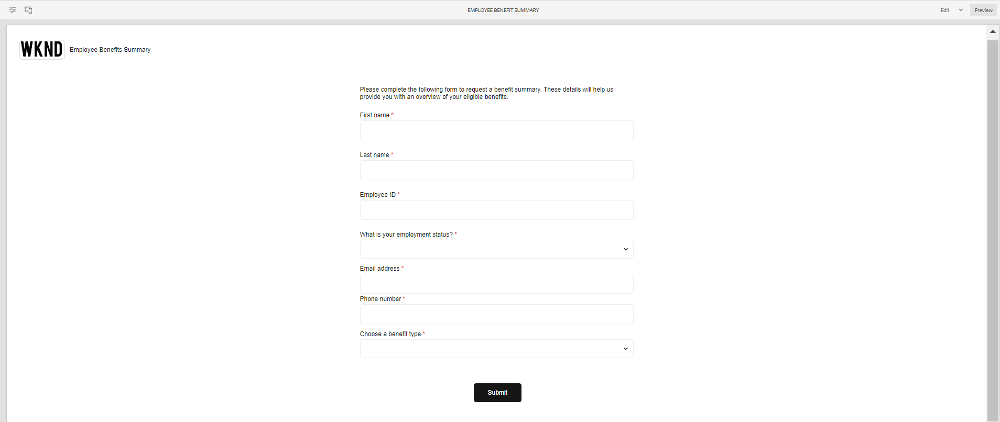

# Temi di esempio, modelli e modelli di dati dei moduli nei componenti core {#sample-themes-templates-and-data-models}

AEM Forms as a Cloud Service fornisce esempi di temi di riferimento, modelli e modelli di dati dei moduli per aiutarti a iniziare rapidamente a creare Adaptive Forms con i Componenti core. È possibile [abilitare i componenti core Adaptive Forms](https://experienceleague.adobe.com/docs/experience-manager-cloud-service/content/forms/setup-configure-migrate/enable-adaptive-forms-core-components.html?lang=it) sull’ambiente di sviluppo as a Cloud Service e locale di AEM Forms per ottenere modelli OOTB di esempio e per [utilizzare e personalizzare i temi di esempio](https://experienceleague.adobe.com/docs/experience-manager-cloud-service/content/forms/adaptive-forms-authoring/authoring-adaptive-forms-core-components/create-an-adaptive-form-on-forms-cs/using-themes-in-core-components.html) in [!DNL AEM Forms].

I temi di esempio, i modelli e i modelli di dati dei moduli inclusi nel pacchetto di contenuto di riferimento sono:

| Modelli | Temi | Modelli dati modulo |
---------|----------|---------
| Base | Area di lavoro | Microsoft® Dynamics 365 |
| Vuoto | WKND | Salesforce |
| Contattaci | Semaforo |  |
| Aggiornamento dei dettagli di contatto |   |   |
| Modulo di consenso | |  |
| Richiesta servizio di registro |  |  |
| Invia feedback |  |  |
| Iscrizione benefit |  |   |
| Sintetico benefit dipendenti |   |   |
| Richiesta di estratto conto |   |   |
| Modulo di ispezione di sicurezza |   |   |
| Ispezione del controllo di qualità |   |   |
| Richiesta di acquisto |  |  |

## Temi di esempio {#Sample-Themes}

I temi di esempio di riferimento aiutano gli autori a definire e personalizzare lo stile dei moduli; gli autori con conoscenze di base su CSS possono personalizzare il tema in base alle esigenze. Autori modulo [abilitare i componenti core Adaptive Forms](https://experienceleague.adobe.com/docs/experience-manager-cloud-service/content/forms/setup-configure-migrate/enable-adaptive-forms-core-components.html?lang=it) nell’ambiente di sviluppo as a Cloud Service e locale di AEM Forms, per ottenere questi temi descritti come segue:

### Area di lavoro {#Canvas}

Il tema Area di lavoro è il tema predefinito per le maschere e sottolinea l&#39;utilizzo di colori di base, trasparenza e icone piatte. Nella schermata seguente puoi vedere come si presenta il tema Canvas.

### WKND {#WKND}

Il tema WKND incarna un design vivace, fantasioso e coinvolgente per mostrare un aspetto elegante alle tue forme. Il tema è basato sull&#39;aspetto e lo stile di [Sito WKND](https://wknd.site/us/en.html) che è un sito web di viaggi e avventura basato su [Componenti core di Adobe Experience Manager](https://experienceleague.adobe.com/docs/experience-manager-core-components/using/introduction).

### Semaforo {#Easel}

Il tema semplice consente di creare un aspetto del modulo accattivante e facile da impostare, personalizzato per la semplicità e la facilità d’uso. Il tema di Easel è basato sul concetto di un supporto portatile utilizzato dagli artisti per sostenere una tela mentre lavorano sui loro dipinti.

## Modelli di esempio {#Sample-templates}

I modelli definiscono la struttura iniziale del modulo, il contenuto e le azioni da replicare nel modulo oppure utilizzano una struttura di modelli simile al modulo, ad esempio Modulo di consenso, Modulo di iscrizione benefit e molto altro ancora. Per ottenere i seguenti modelli: [abilitazione dei componenti core di Forms adattivi](https://experienceleague.adobe.com/docs/experience-manager-cloud-service/content/forms/setup-configure-migrate/enable-adaptive-forms-core-components.html?lang=it) in un ambiente di sviluppo as a Cloud Service o locale di AEM Forms. I modelli di esempio nei componenti core di Adaptive Forms sono:

### Base {#Basic}

Il modello di base consente di creare rapidamente un modulo per l’esperienza di iscrizione. Puoi utilizzarlo anche per visualizzare in anteprima la funzionalità di [Componenti core Forms adattivi](https://experienceleague.adobe.com/docs/experience-manager-core-components/using/adaptive-forms/introduction). Fornisce un layout guidato per la presentazione sezione per sezione dei dati.

>[!BEGINTABS]

>[!TAB Desktop]

>[!TAB Telefono]

{width:&quot;25%&quot;}

>[!TAB Tablet]

>[!ENDTABS]

### Vuoto {#Blank}

Un modello di area di lavoro vuoto consente di creare da zero una struttura di moduli adattivi, un contenuto e regole. Nessun componente modulo viene pre-incorporato nel modello vuoto.

>[!BEGINTABS]

>[!TAB Desktop]

>[!TAB Telefono]

{width:&quot;25%&quot;}

>[!TAB Tablet]

>[!ENDTABS]

### Contattaci {#Contact-Us}

Il modello di modulo Contattaci viene utilizzato per creare un modulo per facilitare la comunicazione tra i visitatori del sito web e gli amministratori. Gli utenti possono inviare query, feedback o richieste di supporto tramite il modulo.

### Aggiornamento dei dettagli di contatto {#Contact-Details-Update}

Il modello di aggiornamento dei dettagli di contatto consente agli autori di creare un modulo per l’aggiornamento dell’indirizzo e dei dettagli di contatto dei clienti. Il modulo aiuta inoltre i clienti ad aggiornare le informazioni personali relative all’abbonamento o ai vantaggi per garantire una comunicazione fluida e un accesso ininterrotto ai servizi o ai vantaggi.

### Modulo di consenso {#Consent-Form}

Il modello di modulo di consenso viene utilizzato per creare un modulo per l’acquisizione di un documento legale da parte di partecipanti che partecipano a un’attività specifica, a uno studio di ricerca, a una procedura medica o a qualsiasi situazione in cui possano essere coinvolti dati o diritti personali. Il modulo garantisce la trasparenza, tutela i diritti dei partecipanti e stabilisce una chiara comprensione di ciò che l&#39;individuo sta accettando.

### Registra richiesta servizio {#Log-Service-Request}

Il modello di richiesta del servizio di registro consente di creare un modulo che richiede servizi di registrazione specifici a un provider di servizi. Il modulo funge da richiesta formale per la creazione di un ticket che includa determinati eventi, attività o dati registrati per il monitoraggio o il tracciamento dello stato.

### Invia feedback {#Give-Feedback}

Fornire un modello di modulo di feedback consente di creare un modulo per fornire un feedback costruttivo a un&#39;altra persona o team. Il modulo contribuisce a garantire un feedback chiaro, specifico e actionable, promuovendo una comunicazione aperta e miglioramenti.

### Iscrizione benefit {#Benefits-Enrollment}

Il modello di modulo di iscrizione ai benefit viene utilizzato per creare un modulo per raccogliere informazioni essenziali dai dipendenti in merito ai benefit e alle opzioni di copertura preferiti. In genere accompagna il periodo di iscrizione ai benefit annuali.

### Sintetico benefit dipendenti {#Employee-Benefits-Summary}

Il modello di modulo Riepilogo benefit dipendente consente di creare un modulo per raccogliere dettagli essenziali sui vantaggi di un singolo utente. Consente di valutare la copertura in modo rapido e accurato, fornendo una panoramica completa per assistenza e supporto efficienti.

### Richiesta estratto conto {#Request-for-Account-Statement}

Il modello di estratto conto della richiesta consente di creare un modulo che avvia il processo di ottenimento di un estratto conto accurato e aggiornato dei clienti. Il rendiconto fornisce una registrazione dettagliata di transazioni finanziarie, attività o altre informazioni rilevanti sui clienti che utilizzano questo modulo.

### Ispezione di sicurezza {#Safety-Inspection}

Il modello di modulo per le ispezioni di sicurezza consente di creare un modulo per l&#39;immissione di dettagli per un ambiente di lavoro sicuro. Effettuando ispezioni regolari utilizzando questo modulo è possibile identificare potenziali rischi. Il modulo copre vari aspetti come le uscite di emergenza, la sicurezza antincendio, la sicurezza elettrica, i materiali pericolosi, i dispositivi di protezione personale, l&#39;ergonomia delle postazioni di lavoro per la sicurezza e il benessere di dipendenti, visitatori e clienti.

### Ispezione del controllo qualità {#Quality-Control-Inspection}

Il modello di modulo per l&#39;ispezione del controllo qualità consente di creare un modulo per valutare e documentare l&#39;aspetto visivo, le dimensioni, la funzionalità, la documentazione, i risultati dei test e la qualità complessiva di un prodotto o di un elemento. Consente di identificare i difetti, le non conformità e le azioni correttive necessarie per garantire il rispetto degli standard di qualità.

### Richiesta di acquisto {#Purchase-Request}

Il modello di modulo per la richiesta di acquisto consente di creare un modulo per avviare il processo di approvvigionamento e consentire ai dipendenti di richiedere formalmente l&#39;acquisto di beni o servizi necessari per il proprio lavoro. Il modulo acquisisce dettagli essenziali come la descrizione dell&#39;articolo, la quantità, il fornitore preferito (se applicabile), l&#39;allocazione del budget, la giustificazione per l&#39;acquisto, le informazioni di consegna e le approvazioni richieste.

## Modelli dati modulo di riferimento {#reference-models}

Dopo aver creato un’ [Modulo adattivo](https://experienceleague.adobe.com/docs/experience-manager-core-components/using/adaptive-forms/introduction.html?lang=en#adaptive-forms-core-components) in base a [Componente core](https://experienceleague.adobe.com/docs/experience-manager-core-components/using/adaptive-forms/introduction.html?lang=en#adaptive-forms-core-components), è possibile connettere il modulo con i server di database Microsoft® Dynamics 365 e Salesforce per abilitare i flussi di lavoro aziendali. Ad esempio:

* Scrivi dati in Microsoft® Dynamics 365 e Salesforce all’invio di moduli adattivi.
* Scrivi dati in Microsoft® Dynamics 365 e Salesforce tramite entità personalizzate definite in Modello dati modulo e viceversa.
* Effettua query sui server Microsoft® Dynamics 365 e Salesforce per i dati e precompila Forms adattivo.
* Leggi i dati da Microsoft® Dynamics 365 e dal server Salesforce.

È possibile ottenere i seguenti modelli di dati del modulo installando [Pacchetto di contenuti di riferimento](https://experience.adobe.com/#/downloads/content/software-distribution/en/aemcloud.html?package=/content/software-distribution/en/details.html/content/dam/aemcloud/public/aem-forms-reference-content.ui.content-2.1.0.zip):

* Microsoft® Dynamics 365
* Salesforce

Per informazioni sull’utilizzo di questi modelli, consulta [Configurazione di Microsoft® Dynamics 365 e dei servizi cloud Salesforce](https://experienceleague.adobe.com/docs/experience-manager-cloud-service/content/forms/integrate/use-form-data-model/configure-msdynamics-salesforce.html?lang=en#configure-dynamics-cloud-service)
