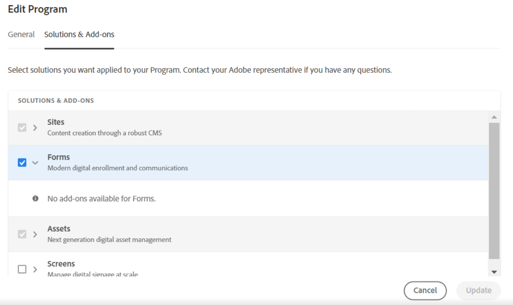

# Onboarding per [!DNL AEM Forms] as a Cloud Service {#overview}

| Versione | Collegamento articolo |
| -------- | ---------------------------- |
| AEM 6.5 | [Fai clic qui](https://experienceleague.adobe.com/docs/experience-manager-65/forms/install-aem-forms/osgi-installation/installing-configuring-aem-forms-osgi.html) |
| AEM as a Cloud Service | Questo articolo |

## Decidi utenti tipo {#personas-aem-forms-project}

<!-- When you sign up for the service, Adobe creates an Organization identifier for your company in the Adobe Identity Management System (IMS), where your users and their permissions can be managed. So, --> Prima di effettuare l’onboarding in un ambiente Forms as a Cloud Service di Adobe Experience Manager (AEM), decide gli utenti tipo e struttura un team per il progetto. Un tipico team di progetto [!DNL AEM Forms] ha i seguenti utenti tipo:

* **Esperienza utente (UX) Designer**: un Designer Esperienza utente (UX) definisce lo stile, il layout e il branding di [!DNL AEM Forms] risorse.

* **Professionista Forms**: un professionista Forms crea Forms adattivo, temi e modelli in base allo stile, al layout e al branding forniti dal Designer UX. Il professionista crea e integra anche un modulo adattivo con un modello di dati del modulo (FDM) e flussi di lavoro AEM. In genere, un professionista Forms esegue attività front-end correlate.

* **Sviluppatore Forms**: uno sviluppatore Forms sviluppa una soluzione di moduli personalizzata. Uno sviluppatore Forms esegue in genere uno sviluppo back-end come lo sviluppo di componenti personalizzati, flussi di lavoro AEM, servizi di precompilazione e altro ancora.

* **Amministratore AEM**: un amministratore AEM aiuta con la configurazione complessiva, ad esempio la configurazione degli utenti, il consolidamento dell&#39;ambiente, la configurazione delle origini dati, la configurazione delle e-mail e del software di terze parti. L’amministratore AEM supporta anche integrazioni quali l’integrazione con Adobe Analytics, Adobe Target e Adobe Sign.

* **Utente finale**: un utente interagisce con il modulo pubblicato e lo invia, firma i moduli inviati, tiene traccia delle applicazioni inviate tramite un portale Web e riceve comunicazioni personalizzate.

<!-- While onboarding to the service, assign the following AEM groups to [!DNL AEM Forms] as a Cloud Service based on their role:

| User type | AEM group |
|---|---|
| Form Practitioner | forms-users (AEM Forms Users), template-authors, workflow-user, workflow-editors, and fdm-author  |
| UX Designer| forms-users, template-authors|
| End-User| <ul> <li>When a user must login to view and submit an Adaptive Form, add such users to forms-users group. </li> <li>When no user authentication is required to access Adaptive Forms, do not assign any group to such users. </li> </ul>| -->

## Onboarding al servizio {#onboarding}

* [Onboarding](https://experienceleague.adobe.com/docs/experience-manager-cloud-service/content/onboarding/journey/overview.html?lang=it) in [!DNL Adobe Experience Manager] as a Cloud Service.

* (Solo per le sandbox) Dopo l&#39;onboarding del servizio, [crea](https://experienceleague.adobe.com/docs/experience-manager-cloud-manager/content/using/pipelines/production-pipelines.html?lang=en) e [esegui](https://experienceleague.adobe.com/docs/experience-manager-cloud-manager/content/using/code-deployment.html) entrambe le pipeline di produzione e non di produzione. As a Cloud Service Abilita e porta le funzionalità più recenti di [!DNL AEM Forms] nel tuo ambiente.

Puoi utilizzare Forms as a Cloud Service per creare un modulo adattivo (iscrizione digitale) o generare una comunicazione con il cliente. Dopo aver completato l&#39;[onboarding](https://experienceleague.adobe.com/docs/experience-manager-cloud-service/content/onboarding/journey/overview.html?lang=it) per l&#39;as a Cloud Service [!DNL Adobe Experience Manager], eseguire le azioni seguenti per abilitare le funzionalità di registrazione digitale di Forms o di comunicazione con i clienti. <!--You can also enable both the features-->:

1. Accedi a Cloud Manager e apri la tua istanza AEM Forms as a Cloud Service.
1. Apri l’opzione Modifica programma e vai alla scheda Soluzioni e componenti aggiuntivi:

   * Se hai un ambiente di produzione, seleziona l&#39;opzione **[!UICONTROL Forms - Comunicazioni]** per abilitare Forms - Registrazione digitale e Forms - Componente aggiuntivo Comunicazioni.

     

   <!-- If you have already enabled the **[!UICONTROL Forms - Digital Enrollment]** option, then select the **[!UICONTROL Forms - Communications Add-On]** option.  -->

   * Se si dispone di un ambiente sandbox, selezionare **[!UICONTROL Forms]** per abilitare il componente aggiuntivo Forms - Digital Enrollment e Forms - Communications.

     

1. Fai clic su **[!UICONTROL Aggiorna]**.
1. Esegui la pipeline di compilazione. Una volta completata la pipeline di build, la soluzione selezionata viene abilitata per il tuo ambiente.

>[!NOTE]
>
> Per abilitare e configurare le API di manipolazione dei documenti, aggiungere la regola seguente alla [configurazione Dispatcher](setup-local-development-environment.md#forms-specific-rules-to-dispatcher):
>
> `# Allow Forms Doc Generation requests`
> `/0062 { /type "allow" /method "POST" /url "/adobe/forms/assembler/*" }`

## Configurare gli utenti {#config-users}

Dopo aver completato l&#39;onboarding nel servizio, accedi all&#39;ambiente as a Cloud Service [!DNL AEM Forms], apri le istanze Author e Publish e aggiungi gli utenti ai [gruppi AEM](https://experienceleague.adobe.com/docs/experience-manager-learn/cloud-service/accessing/aem-users-groups-and-permissions.html#accessing) specifici di Forms, in base alla loro persona. Nella tabella seguente sono elencati i gruppi AEM specifici di Forms, disponibili con le opzioni predefinite, e i tipi di utente corrispondenti. La tabella fornisce anche il tipo di istanza AEM per ciascun tipo di utente:

| Tipi di utenti (utenti tipo) | Gruppi di utenti | Istanza AEM |
|---|---|---|
| Professionista del modulo /sviluppatore Forms | <ul> <li> [!DNL forms-users] </li><li> [!DNL template-author] </li><li> [!DNL workflow-users] </li><li> [!DNL workflow-editors] </li><li> [!DNL fdm-authors] </li></ul> | Istanza Autore |
| Designer esperienza utente (UX) | <ul> <li> [!DNL forms-users]</li><li> [!DNL template-author] </li></ul> | Istanza Autore |
| Amministratore AEM | <ul> <li>[!DNL aem-administrators],</li> <li>[!DNL fd-administrators] </li> </ul> | Istanza Autore e Publish |
| Utente finale | <ul> <li>Quando un utente deve effettuare l&#39;accesso per visualizzare e inviare un modulo adattivo, aggiungere tali utenti al gruppo [!DNL forms-users]. </li> <li>Se non è richiesta l’autenticazione utente per accedere a Adaptive Forms, non assegnare alcun gruppo a tali utenti. </li> </ul> | Istanza Autore e Publish |

Per ulteriori informazioni sui gruppi AEM specifici di Forms e sulle autorizzazioni corrispondenti, vedere [Gruppi e autorizzazioni](forms-groups-privileges-tasks.md).

<!-- You can also create  [user groups](https://experienceleague.adobe.com/docs/experience-manager-learn/cloud-service/accessing/aem-users-groups-and-permissions.html#accessing) specific  to your organization, assign policies, and [users](https://experienceleague.adobe.com/docs/experience-manager-learn/cloud-service/accessing/aem-users-groups-and-permissions.html#accessing) to the groups. The policies help control permissions of the users that are part of the group. For information a -->

## Passaggio successivo {#next-steps}

[Configurare un ambiente di sviluppo locale](setup-local-development-environment.md). È possibile utilizzare un ambiente di sviluppo locale per creare un modulo adattivo e le risorse correlate (temi, modelli, azioni di invio personalizzate, servizio di precompilazione e altro ancora). E [convertire i PDF forms in Forms adattivo](https://experienceleague.adobe.com/docs/aem-forms-automated-conversion-service/using/introduction.html?lang=it) senza effettuare l&#39;accesso a un ambiente di sviluppo cloud.

<!-- ### Business unit and end-users {#business-unit-and-end-users}

| Role| Organization| Description|
|-----|-------|-----|
| UX Designer                  | Customer/System Integrator/Partner | Defines user experience design (style, layout, branding) as per organizational requirements for Adaptive Forms to allow AEM Forms practitioners to design the corresponding themes and templates.                                     |
| Forms Practitioner           | Customer                           | Authors Adaptive Forms, creates Form Data Model integrations, and creates business workflows using the Experience Manager Workflows. Typically undertakes the front-end work.                                                         |
| Business Executive - Digital | Customer                           | Responsible for business unit's product marketing strategy and revenues, main business stakeholders for digital use cases, solutions, and service offerings for the end-users, signs off on the use case implementation and delivery. |
| Customer Experience Lead     | Customer                           | Business user persona. Authors, personalizes and updates Adaptive Forms fields/rules/styling, identifies, and prioritizes business needs. Validates business use-case with SI/Partner developers/practitioners during UAT.            |
| Forms Back-Office User       | Customer                           | End-user internal to organization filling forms, participating in back-office Forms workflows such as review/approval of applications and so on.                                                                                            |
| Forms End-User               | External to customer               | Interacts with and submits the published form as end customer or citizen, signs submitted forms, tracks her applications through web portal, receives personalized interactive communications.                                        |

### Project team {#project-team}

| Role | Org | Description|
|-----|-----|-----|
| Experience Manager Administrator | System Integrator /Partner/Customer | Helps with overall installation, configures SSL certificates, configures data sources, email, and other third-party software, integrations like Adobe Analytics, Adobe Target, Automated Forms Conversion Services with Experience Manager instance. |
| Project Manager                  | System Integrator /Partner/Customer | Converts customer use-case into technical requirements, manages schedule/cost/scope for overall project.                                                                                                                                             |
| Product Owner                    | System Integrator /Partner/Customer | Prioritizes and evaluates scrum team's work for high-quality delivery on time.                                                                                                                                                                       |
| Scrum Master                     | System Integrator /Partner/Customer | Ensures agile values and processes in place to deliver on defined requirements as per prioritization by PO.                                                                                                                                          |
| Infrastructure / security expert | System Integrator /Partner/Customer | Provisions and configures best possible infrastructure, security controls and infra processes to address current and projected RASP requirements.                                                                                                    |
| Technical Architect              | System Integrator /Partner/Customer | Provides best high-level architecture and infrastructure guidance for use-case implementation and address RASP (Reliability, Availability, Scalability, and Performance) and security challenges.                                                    | -->

<!-- ## Onboard to the service {#onboarding}

[Onboard](https://experienceleague.adobe.com/docs/experience-manager-cloud-service/onboarding/home.html) to the [!DNL Adobe Experience Manager] as a Cloud Service. 

After you onboard the service, configure a [local development environment](setup-local-development-environment.md). 

Administrators are responsible for managing Adobe software and services for their organization. Administrators grant access to developers in their organization to connect and use your [!DNL AEM Forms] as a Cloud Service program. When an administrator is provisioned for an organization, the administrator receives an email with title 'You now have administrator rights to manage Adobe software and services for your organization'. If you are an administrator, check your mailbox for email with previously mentioned title and proceed to [add users](https://experienceleague.adobe.com/docs/experience-manager-cloud-service/security/ims-support.html?lang=en#onboarding-users-in-admin-console) by way of IMS and assign [form-specific groups](forms-groups-privileges-tasks.md) to users based on their role.

## Next step {#next-steps} -->

<!-- ## Prerequisites {#prerequisites}

If you are new to AEM as a cloud service, contact your Adobe representative to create an organization identifier for your company in the Adobe Identity Management System (IMS). Once Adobe has created an organization for your company, your designated administrator is added as the first member of the organization. The administrator can setup an [!DNL AEM Forms] as a Cloud Service instance. 

## Onboard and set up a new environment {#onboard-and-setup-a-new-environment}

Log in to Cloud Manager and create a program. After the program is ready, create environments, add developers or users to environments, and run the pipeline to get the latest version of [!DNL AEM Forms] as a Cloud Service and start developing for your environment. The detailed steps are:

1. Contact your Adobe representative to create an organization identifier for your company in the Adobe Identity Management System (IMS) and provide access to an administrator in your organization.
1. Configure [Automated Forms Conversion Service](https://experienceleague.adobe.com/docs/aem-forms-automated-conversion-service/using/configure-service.html?lang=en). After a configuration is complete, a profile for Automated Forms Conversion Service is available in [Admin Console](https://adminconsole.adobe.com/).

    If the service is not available, log in to [Admin Console](https://adminconsole.adobe.com/). Use Adobe ID of administrator provisioned to use Automated Forms Conversion Service to login. Do not use any other ID or Federated ID to login.
    1. Click **[!UICONTROL Automated Forms Conversion Service]** option.
    1. Click **[!UICONTROL New Profile]** in the Products tab.
    1. Specify **[!UICONTROL Name]**, **[!UICONTROL Display Name]**, and **[!UICONTROL Description]** for the profile. Click **[!UICONTROL Done]**. A profile is created. 
1. Log in to [Cloud Manager](https://experience.adobe.com/#/@marketinghub/experiencemanager) and [create a program](https://docs.adobe.com/content/help/en/experience-manager-cloud-service/onboarding/getting-access/cloud-service-programs/creating-a-program.html) for your organization.
1. [Create environments](https://experienceleague.adobe.com/docs/experience-manager-cloud-service/implementing/using-cloud-manager/manage-environments.html?lang=en#adding-environments) within your program.
1. Log in to [Admin console](https://docs.adobe.com/content/help/en/experience-manager-cloud-service/onboarding/what-is-required/add-users-roles.html) and add developers or users to your organization.
1. Run the [build pipeline](https://docs.adobe.com/content/help/en/experience-manager-cloud-manager/using/how-to-use/deploying-code.html). It brings latest [!DNL Experience Manager Forms] as a Cloud Service features to your environment.
1. [Start developing](https://docs.adobe.com/content/help/en/experience-manager-cloud-service/implementing/developing/aem-project-content-package-structure.html) and creating Adaptive Forms on [!DNL Experience Manager Forms] as a Cloud Service environment.
1. Configure the [local development environment](setup-local-development-environment.md) for rapid development

## Configure dispatcher caching {#caching}

You can make dispatcher caching related configuration changes to code on your local development instance and deploy the changes to your [!DNL AEM Forms] as a Cloud Service instance. For details, see [update dispatcher configuration](setup-local-development-environment.md).
 -->
