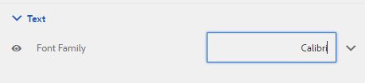
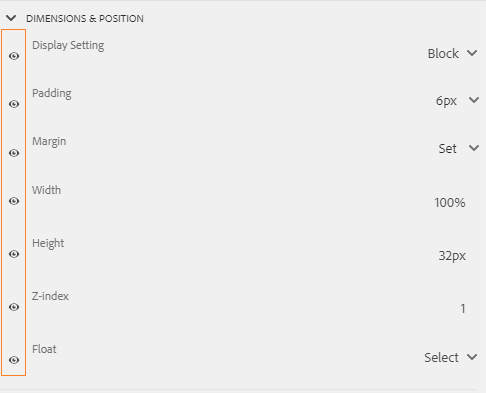

# Creazione e utilizzo di temi {#creating-and-using-themes}

>[!NOTE]
>
> Adobe consiglia di utilizzare l&#39;acquisizione dati moderna ed estensibile [Componenti core](https://experienceleague.adobe.com/docs/experience-manager-core-components/using/adaptive-forms/introduction.html?lang=it) per [la creazione di un nuovo Forms adattivo](/help/forms/creating-adaptive-form-core-components.md) o [l&#39;aggiunta di Forms adattivo alle pagine AEM Sites](/help/forms/create-or-add-an-adaptive-form-to-aem-sites-page.md). Questi componenti rappresentano un progresso significativo nella creazione di Forms adattivi, garantendo esperienze utente straordinarie. Questo articolo descrive un approccio precedente all’authoring di Forms adattivi utilizzando i componenti di base.

| Versione | Collegamento articolo |
| -------- | ---------------------------- |
| AEM 6.5 | [Fai clic qui](https://experienceleague.adobe.com/docs/experience-manager-65/forms/adaptive-forms-advanced-authoring/themes.html?lang=it) |
| AEM as a Cloud Service | Questo articolo |

È possibile creare e applicare temi per formattare un modulo adattivo<!-- or an interactive communication-->. Un tema contiene dettagli sullo stile dei componenti e dei pannelli. Gli stili includono proprietà quali i colori di sfondo, i colori degli stati, la trasparenza, l’allineamento e le dimensioni. Quando applichi un tema, lo stile specificato si riflette sui componenti corrispondenti. Il tema viene gestito in modo indipendente senza un riferimento a un modulo adattivo<!-- or interactive communication -->.

Puoi scaricare e installare [!DNL AEM Forms] pacchetto di contenuti di riferimento dal portale [Distribuzione software](https://experience.adobe.com/#/downloads/content/software-distribution/it/aemcloud.html) per importare i temi e i modelli di riferimento nel tuo ambiente.

## Creazione, download o caricamento di un tema {#creating-downloading-or-uploading-a-theme}

Un tema viene creato e salvato come entità separata, completa di metaproprietà come Forms adattivo. Consente di riutilizzare un tema in più Forms adattivi<!-- or  and interactive communications-->. È inoltre possibile spostare un tema in un&#39;istanza diversa e riutilizzarlo.

### Creazione di un tema {#creating-a-theme}

Per creare un tema:

1. Fare clic su **[!UICONTROL Adobe Experience Manager]**, su **[!UICONTROL Forms]** e su **[!UICONTROL Temi]**.

1. Nella pagina Temi fare clic su **[!UICONTROL Crea]** > **[!UICONTROL Tema]**.
Viene avviata una procedura guidata per creare un tema.

1. Specifica **[!UICONTROL Nome]** del tema.

1. Specifica un modulo per visualizzare in anteprima il tema nel campo **[!UICONTROL Anteprima predefinita per questo tema]**. Fare clic su **[!UICONTROL Usa predefinito]** per utilizzare il modulo predefinito per visualizzare l&#39;anteprima del tema.

1. Specificare un **[!UICONTROL contenitore configurazione]**. Puoi scegliere un **[!UICONTROL Contenitore configurazione]** che contiene i dettagli di configurazione di Adobe Font per il tuo account. Puoi anche lasciare vuota l&#39;opzione per il momento e specificare i dettagli in seguito da [proprietà tema](#metadata-of-a-theme).

1. Fai clic su **[!UICONTROL Crea]** e quindi su **[!UICONTROL Modifica]** per aprire il tema nell&#39;Editor temi, oppure fai clic su **[!UICONTROL Fine]** per tornare alla pagina dei temi.

### Differenza dai temi in Experience Manager 6.5 Forms e versioni precedenti {#difference-in-themes}

Temi creati in un’istanza di Cloud Service:

* Avere il numero di versione 2.

* Sono archiviati in `/content/dam/formsanddocuments-themes/<theme-name>/`

* Non fornire l’opzione libreria client. Non è possibile specificare una categoria e un percorso di libreria client.

* Non disponi delle autorizzazioni di scrittura e aggiornamento per la posizione /apps (il gruppo di utenti Forms non dispone dell’autorizzazione di scrittura e aggiornamento per la posizione /apps).

* Prima di caricare un tema creato in [!DNL Experience Manager Forms] 6.5 o versioni precedenti in un&#39;istanza di Cloud Service, verificare che il percorso della libreria client sia impostato su `etc/clientlibs/fd/themes`. Se la libreria client non esiste nella cartella `etc`, aggiornare manualmente il percorso in `etc/clientlibs/fd/themes`.  È possibile apportare la modifica nell&#39;istanza di [!DNL Experience Manager Forms] 6.5 o delle versioni precedenti. Dopo aver impostato la posizione della libreria client, un amministratore può caricare i temi nell’istanza di Cloud Service o utilizzare lo strumento Content Transfer (Trasferimento contenuti) per migrare i temi dalla versione 6.5 o dalle istanze della versione precedente all’istanza di Cloud Service.

  Inoltre, modifica il nome della categoria. Se il nome non viene modificato, potrebbe verificarsi un errore `theme with same category name exists`. La modifica del nome della categoria non influisce sul Forms adattivo che utilizza il tema.

### Download di un tema {#downloading-a-theme}

Puoi esportare i temi come file zip e utilizzarli in altri progetti o istanze Experience Manager. Per scaricare un tema:

1. Fare clic su **[!UICONTROL Adobe Experience Manager]**, su **[!UICONTROL Forms]** e quindi su **[!UICONTROL Temi]**.

1. Nella pagina Temi, **[!UICONTROL Seleziona]** un tema e fai clic su **[!UICONTROL Scarica]**. Viene visualizzata una finestra di dialogo con i dettagli del tema.

1. Fai clic su **[!UICONTROL Scarica]**. Il tema viene scaricato come file zip.

>[!NOTE]
>
>Se scarichi un tema a cui è associato un modulo adattivo e il modulo adattivo associato è basato su un modello personalizzato, scarica anche il modello personalizzato. Quando carichi il tema scaricato e il modulo adattivo, carica anche il relativo modello personalizzato.

### Caricamento di un tema {#uploading-a-theme}

Un utente con privilegi di amministratore può caricare un tema creato in [!DNL Experience Manager Forms] 6.5 o versioni precedenti.

Per caricare un tema:

1. Fare clic su **[!UICONTROL Adobe Experience Manager]**, su **[!UICONTROL Forms]** e quindi su **[!UICONTROL Temi]**.

1. Nella pagina Temi fare clic su **[!UICONTROL Crea]** > **[!UICONTROL Caricamento file]**.
1. Nella richiesta di caricamento file, sfoglia e seleziona un pacchetto tema nel computer e fai clic su **[!UICONTROL Carica]**.
Il tema caricato è disponibile nella pagina dei temi.

## Metadati di un tema {#metadata-of-a-theme}

Elenco delle metaproprietà di un tema (disponibili nella pagina delle proprietà di un tema).

<table>
 <tbody>
  <tr>
   <th>
<strong>ID</strong>
 
 
 </th>
   <th><strong>Nome</strong></th>
   <th><strong>Può essere modificato</strong></th>
   <th><strong>Descrizione proprietà</strong></th>
  </tr>
  <tr>
   <td>1.</td>
   <td>Titolo</td>
   <td>Sì</td>
   <td>Nome visualizzato del tema.</td>
  </tr>
  <tr>
   <td>2.</td>
   <td>Descrizione</td>
   <td>Sì</td>
   <td>Descrizione del tema.</td>
  </tr>
  <tr>
   <td>3.</td>
   <td>Tipo</td>
   <td>No</td>
   <td>
    <ul>
     <li>Tipo di risorsa.</li>
     <li>Il valore è sempre un tema.</li>
    </ul> </td>
  </tr>
  <tr>
   <td>4.</td>
   <td>Creato</td>
   <td>No</td>
   <td>Data di creazione del tema</td>
  </tr>
  <tr>
   <td>5.</td>
   <td>Nome autore</td>
   <td>Sì</td>
   <td>Autore del tema. Calcolato al momento della creazione del tema.</td>
  </tr>
  <tr>
   <td>6.</td>
   <td>Data ultima modifica</td>
   <td>No</td>
   <td>Data dell’ultima modifica del tema.</td>
  </tr>
  <tr>
   <td>7.</td>
   <td>Stato</td>
   <td>No</td>
   <td>Stato del tema (modificato/pubblicato).</td>
  </tr>
  <tr>
   <td>8.</td>
   <td>Ora di pubblicazione</td>
   <td>Sì</td>
   <td>Tempo per pubblicare automaticamente il tema.</td>
  </tr>
  <tr>
   <td>9.</td>
   <td>Ora di disattivazione pubblicazione</td>
   <td>Sì</td>
   <td>Tempo per annullare automaticamente la pubblicazione del tema.</td>
  </tr>
  <tr>
   <td>10.</td>
   <td>Tag</td>
   <td>Sì</td>
   <td>Etichetta associata al tema per l’identificazione utilizzata per migliorare la ricerca.</td>
  </tr>
  <!-- <tr>
   <td>11.</td>
   <td>References</td>
   <td>Links</td>
   <td>
    <ul>
     <li>Contains 'Referred by' section. Lists forms that use the theme.</li>
     <li>Since the theme does not refer to any other asset, there is no 'Refers' section.</li>
    </ul> </td>
  </tr>
   <tr>
   <td>12.</td>
   <td>Clientlib Location</td>
   <td>Yes</td>
   <td>
    <ul>
     <li>The user-defined repository path within '/etc' where the clientlibs corresponding to this theme are stored.</li>
     <li>Default value - '/etc/clientlibs/fd/themes' + relative path of theme asset.</li>
     <li>If the location does not exist, the folder hierarchy is auto-generated.</li>
     <li>When this value is changed, the clientlib node structure is moved to the new location entered.  <em><strong>Note:</strong> If you change default clientlib location, in the CRXDE repository assign <code>crx:replicate, rep:write, rep:glob:*, rep:itemNames:: js.txt, jcr:read </code>to <code>forms-users</code> and <code>crx:replicate</code>, <code>jcr:read </code>to <code>fd-service</code> in the new location. Also attach another ACL by adding <code>deny jcr:addChildNodes</code> for <code>forms-user</code></em></li>
    </ul> </td>
  </tr> 
  <tr>
   <td>13.</td>
   <td>Clientlib Category Name</td>
   <td>Yes</td>
   <td>
    <ul>
     <li>The user-defined clientlib category name for this theme.</li>
     <li>An error is displayed if the name is already in use by some other existing theme.</li>
     <li>Default value - computed using theme location.</li>
     <li>When this value is changed, the category name is updated on the corresponding clientlib node. Updating Clientlib Category Name in the jsp files is not required because clientlib category name is used by reference.</li>
    </ul> </td>
  </tr> -->
 </tbody>
</table>

## Informazioni sull’Editor tema {#about-the-theme-editor}

L&#39;Editor temi è un&#39;interfaccia intuitiva per utenti aziendali e web designer/sviluppatori che fornisce funzionalità necessarie per specificare facilmente lo stile dei vari elementi del modulo adattivo <!-- and interactive communication -->. Quando si crea un tema, questo viene memorizzato come entità separata, ad esempio i moduli <!--  , interactive communications, letters, document fragments, and data dictionaries-->.

L’Editor tema consente di personalizzare gli stili dei componenti a cui è applicato uno stile in un tema. È possibile personalizzare l&#39;aspetto di un modulo <!-- or interactive communication --> su un dispositivo.

L’Editor tema è suddiviso in due pannelli:

* **Area di lavoro** - Viene visualizzata sul lato destro. Viene visualizzato un esempio di modulo adattivo <!--  or interactive communication --> in cui tutte le modifiche di stile si riflettono immediatamente. È inoltre possibile selezionare gli oggetti direttamente dall&#39;area di lavoro per cercare gli stili ad essi associati e modificarli. L’area di lavoro è gestita da un righello di risoluzione dispositivo posto nella parte superiore. Se si seleziona un punto di interruzione di risoluzione dal righello, viene visualizzata l&#39;anteprima del modulo di esempio <!--  or interactive communication --> per la rispettiva risoluzione. L&#39;area di lavoro è trattata in dettaglio [sotto](themes.md#using-canvas).

* **Barra laterale*** visualizzata sul lato sinistro. Include i seguenti elementi:

   * **Selettore:** mostra il componente selezionato per lo stile e le relative proprietà alle quali è possibile applicare uno stile. Il selettore rappresenta tutti i componenti di un tipo. Se si seleziona un componente casella di testo in un tema per lo stile, tutte le caselle di testo nel modulo <!-- or interactive communication --> ereditano lo stile. I selettori consentono di selezionare un componente generico o un componente specifico per lo stile. Ad esempio, un componente campo è un componente generico e una casella di testo è un componente specifico.

     **Componente generico di stile:**
Un campo può essere un campo casella numerica, ad esempio età, oppure un campo casella di testo, ad esempio indirizzo.
Quando si applica uno stile a un campo, lo stile viene applicato a tutti i campi, ad esempio età, nome e indirizzo.

     **Componente specifico per lo stile**:
Un componente specifico influisce sugli oggetti della categoria specifica. Quando si applica uno stile al componente casella numerica nel tema, solo l&#39;oggetto casella numerica in eredita lo stile.

     Ad esempio, un campo casella di testo, ad esempio l&#39;indirizzo, che è più lungo, e un campo casella numerica, ad esempio l&#39;età, sono più brevi. È possibile selezionare un campo casella numerica, ridurne la lunghezza e applicarlo al modulo. La larghezza di tutti i campi casella numerica viene ridotta nel modulo.

     Quando personalizzi tutti i componenti campo con un colore di sfondo specifico, tutti i campi come età, nome e indirizzo ereditano il colore di sfondo. Quando si seleziona una casella numerica, ad esempio età, e se ne riduce la larghezza, la larghezza di tutte le caselle numeriche, ad esempio età, viene ridotto il numero di persone in una famiglia. La larghezza delle caselle di testo non viene modificata.

   * **Stato:** consente di personalizzare gli stili di un oggetto in uno stato specifico. È ad esempio possibile specificare l&#39;aspetto di un oggetto quando si trova nello stato predefinito, attivo, disattivato, al passaggio del mouse o di errore.
   * **Categorie di proprietà:** Le proprietà di stile sono suddivise in varie categorie. Ad esempio, Dimension &amp; Position, Testo, Sfondo, Bordo ed Effetti. In ogni categoria vengono fornite informazioni sullo stile. Ad esempio, in Sfondo è possibile specificare Colore sfondo e Immagine e sfumatura.

   * **Avanzate:** consente di aggiungere CSS personalizzati a un oggetto, che si sovrappone alle proprietà definite dai controlli visivi in caso di sovrapposizione.

   * **Visualizza CSS**: consente di visualizzare i CSS del componente selezionato.

  Inoltre, nella barra laterale, in basso è presente una freccia. Facendo clic sulla freccia, si ottengono altre due opzioni: **Simula esito positivo** e **Simula errore.** Queste opzioni, insieme alle opzioni descritte sopra, sono discusse in dettaglio [sotto](themes.md#using-rail).

 **A.** Barra laterale **B.** Area di lavoro

### Componenti di stile {#styling-components}

È possibile utilizzare un tema in più Forms<!-- and interactive communications --> adattivi, che importa la formattazione del componente specificata nel tema. È possibile assegnare stili a vari componenti, ad esempio titoli, descrizioni, pannelli, campi, icone e caselle di testo. I widget consentono di configurare le proprietà dei componenti in un tema. Non è necessario conoscere in precedenza CSS o LESS, ma è preferibile farlo, anche se la sezione CSS Overrides consente di scrivere codice CSS o di fornire selettori personalizzati. La sezione Sostituzioni CSS viene visualizzata quando si seleziona un componente nella barra laterale.

Opzioni nella barra laterale che consentono di selezionare e assegnare stili ai diversi componenti.

Facendo clic sul pulsante Modifica in corrispondenza di un componente nella barra laterale, il componente viene selezionato nell’area di lavoro e puoi applicare lo stile al componente utilizzando le opzioni nella barra laterale.

Alcuni componenti come casella di testo, casella numerica, pulsante di scelta e casella di controllo sono classificati in componenti generici come Campo. Ad esempio, si desidera personalizzare lo stile dei pulsanti di scelta. Per selezionare i pulsanti di scelta per lo stile, selezionare **[!UICONTROL Campo]** > **[!UICONTROL Widget]** > **[!UICONTROL Pulsante di scelta]**.

### Layout dei pannelli di stile {#styling-panel-layouts-br}

I temi in [!DNL AEM Forms] supportano lo stile degli elementi nel layout dei pannelli nei moduli<!-- and  interactive communications -->. È supportato lo stile degli elementi nei layout predefiniti e nei layout personalizzati.

I pannelli predefiniti includono:

* Schede a sinistra
* Schede superiori
* Pannello a soffietto
* Responsivo
* Procedura guidata
* Layout mobile

   * Titoli dei pannelli nell’intestazione
   * Senza titoli dei pannelli nell’intestazione

I selettori variano per ciascun layout.
La creazione di stili di layout personalizzati dall’Editor tema prevede:

* Definizione dei componenti di un layout a cui è possibile applicare uno stile e dei selettori CSS per identificare in modo univoco tali componenti.
* Definizione delle proprietà CSS che possono essere applicate a questi componenti.
* Definisci lo stile di questi componenti in modo interattivo dall’interfaccia utente.

### Stili diversi per schermi di dimensioni diverse {#different-styles-for-different-screen-sizes-br}

I layout per desktop e dispositivi mobili possono avere stili leggermente o completamente diversi. Per i dispositivi mobili, tablet e telefono condividono layout simili tranne che per le dimensioni dei componenti.

Utilizza i punti di interruzione dell’Editor tema per definire uno stile alternativo per schermi di dimensioni diverse. Potete selezionare un dispositivo di base o una risoluzione sulla quale iniziate a creare il tema e le varianti di stile per altre risoluzioni vengono generate automaticamente. Potete modificare esplicitamente lo stile di tutte le risoluzioni.

>[!NOTE]
>
>Il tema viene creato utilizzando un modulo<!-- or interactive communication--> e quindi applicato a moduli diversi<!-- or interactive communications-->. I punti di interruzione utilizzati nella creazione del tema possono essere diversi dal modulo <!-- or interactive communication --> a cui è applicato il tema. Le query multimediali CSS si basano sul modulo <!-- or interactive communication --> utilizzato nella creazione del tema e non sul modulo <!-- or interactive communication --> a cui viene applicato il tema.

### Modifica del contesto delle proprietà di stile nella barra laterale durante la selezione degli oggetti {#styling-properties-context-changes-in-sidebar-on-selecting-objects}

Quando selezioni un componente nell’area di lavoro, le relative proprietà di stile vengono elencate nella barra laterale. Selezionare il tipo di oggetto e il relativo stato, quindi specificarne lo stile.

### Stili utilizzati di recente nell’Editor tema {#recently-used-styles-in-theme-editor}

L’editor tema memorizza nella cache fino a dieci stili applicati a un componente. È possibile utilizzare gli stili memorizzati in cache con un altro componente di un tema. Gli stili utilizzati di recente sono disponibili sotto il componente selezionato nella barra laterale come casella di riepilogo. Inizialmente, l’elenco degli stili utilizzati di recente è vuoto.

Quando si applica uno stile a un componente, gli stili vengono memorizzati nella cache ed elencati nella casella di riepilogo. In questo esempio, l&#39;etichetta della casella di testo viene formattata in modo da modificare la dimensione e il colore del carattere. Puoi seguire passaggi simili per scegliere un’immagine o modificare i colori per assegnare uno stile a un componente. Osserva come lo stile viene memorizzato nella cache ed elencato nella casella di riepilogo quando viene modificato lo stile dell’etichetta del campo.

In questo esempio viene modificato lo stile dell’etichetta del campo e, quando per lo stile è selezionata l’opzione Descrizione pannello reattivo, viene aggiunta una voce di elenco nella libreria delle risorse. La voce nella libreria di risorse può essere utilizzata per modificare lo stile di Descrizione pannello reattivo.

Quando uno stile viene aggiunto nella libreria delle risorse, è disponibile per altri temi e nella [modalità di stile](inline-style-adaptive-forms.md) dell&#39;interfaccia utente dell&#39;editor di moduli. Analogamente, quando si utilizza la modalità di stile dell&#39;interfaccia utente dell&#39;editor di moduli <!-- or interactive communication editor --> per applicare uno stile a un componente, lo stile viene memorizzato nella cache ed è disponibile nei temi.

Il pulsante più (+) posto accanto alla libreria di risorse consente di salvare in modo permanente lo stile con il nome fornito. Il pulsante più salva lo stile anche se non fai clic sul pulsante Salva nella barra laterale per applicarlo a un componente. Il pulsante più per salvare uno stile da utilizzare successivamente non è disponibile in modalità stile.

Quando si specifica un nome personalizzato per uno stile, questo viene associato a un tema e non è più disponibile per altri temi. Per eliminare uno stile salvato:

1. Sulla barra degli strumenti CANVAS fare clic su **[!UICONTROL Opzioni tema]**  > **[!UICONTROL Gestisci stili]**.
1. Nella finestra di dialogo Gestisci stili, seleziona uno stile salvato e fai clic su **[!UICONTROL Elimina]**.

   

### Anteprima live, salvataggio ed eliminazione delle modifiche {#live-preview-save-and-discard-changes}

Le modifiche apportate allo stile si riflettono immediatamente nel modulo <!-- or interactive communication --> caricato nell&#39;area di lavoro. L’anteprima live ti consente di definire e visualizzare in modo interattivo l’impatto dello stile. Quando modifichi lo stile di un componente, il pulsante **[!UICONTROL Fine]** è abilitato nella barra laterale. Per mantenere le modifiche, utilizzare il pulsante **[!UICONTROL Fine]**.

>[!NOTE]
>
>Quando si immette un carattere non valido in un campo, il colore del bordo del campo diventa rosso e nell&#39;angolo superiore sinistro dello schermo viene visualizzato un messaggio di errore. Se ad esempio si immettono caratteri alfabetici in una casella di testo che accetta caratteri numerici come input, il colore del bordo della casella di input verrà modificato in rosso. Non puoi salvare un tema di questo tipo senza risolvere l’errore visualizzato al centro nella parte inferiore dello schermo.

### Tema con un altro modulo adattivo {#theme-with-another-adaptive-form}

Quando si crea un tema, questo viene creato con un modulo fornito con l&#39;Editor tema. In questo modulo viene fornito lo stile dei componenti. Anziché il modulo fornito con l&#39;Editor temi, è possibile selezionare un modulo <!-- or interactive communication --> desiderato per fornire lo stile e visualizzare in anteprima i risultati.

Per sostituire il modulo corrente o <!-- interactive communication --> nell&#39;area di lavoro dell&#39;Editor temi:

1. Nel pannello EDITOR TEMI, fai clic su **[!UICONTROL Opzioni tema]**  > **[!UICONTROL Configura]**.

1. Nella scheda Generale, sfogliare e selezionare un modulo <!-- or interactive communication --> per il campo **[!UICONTROL Modulo adattivo]**.

### Ripeti/Annulla {#redo-undo}

È possibile annullare o ripristinare le modifiche indesiderate che si verificano accidentalmente. Utilizzare i pulsanti Ripristina/Annulla nell&#39;area di lavoro.

I pulsanti Ripristina/Annulla vengono visualizzati quando si applica uno stile a un componente nell’Editor tema.

## Utilizzo dell’Editor tema {#using-the-theme-editor}

L’Editor tema consente di modificare un tema creato o caricato. Passa a **[!UICONTROL Forms e documenti]** > **[!UICONTROL Temi]**, quindi seleziona un tema e aprilo. Il tema viene aperto nell’Editor tema.

Come discusso in precedenza, l’Editor tema dispone di due pannelli: Barra laterale e Area di lavoro.

Personalizzazione dello stile dello stato di successo del componente Widget casella di testo nell’editor di temi. Il componente è selezionato nell’area di lavoro e il suo stato è selezionato nella barra laterale. Le opzioni di stile disponibili nella barra laterale vengono utilizzate per personalizzare l’aspetto di un componente.

### Utilizzo di Canvas {#using-canvas}

Il tema viene creato utilizzando il modulo predefinito o un modulo <!-- or interactive communication --> scelto. Nell&#39;area di lavoro viene visualizzata l&#39;anteprima del modulo o <!-- interactive communication --> utilizzato per creare il tema con le personalizzazioni specificate nel tema. Il righello sopra il modulo viene utilizzato per determinare il layout in base alle dimensioni della visualizzazione del dispositivo.

Nella barra degli strumenti Area di lavoro vengono visualizzati i seguenti elementi:

* **[!UICONTROL Attiva/Disattiva pannello laterale]** : consente di mostrare o nascondere la barra laterale.
* **[!UICONTROL Opzioni tema]** : fornisce tre opzioni

   * Configura: fornisce opzioni per selezionare il modulo di anteprima <!-- or interactive communication , base clientlib, --> e la configurazione di Adobe Fonts.
   * Visualizza CSS tema: genera CSS per il tema selezionato.
   * Gestisci stili: fornisce opzioni per gestire gli stili di testo e immagini
   * Aiuto: esegue una presentazione guidata dell’immagine dell’Editor tema.

* **[!UICONTROL Emulatore]** : emula l&#39;aspetto del tema per diverse dimensioni di visualizzazione. Una dimensione di visualizzazione viene trattata come punto di interruzione nell’emulatore. È possibile selezionare un punto di interruzione e specificarne uno stile. Ad esempio, Desktop e Tablet sono due punti di interruzione. È possibile specificare stili diversi per ogni punto di interruzione.

Quando selezioni un componente nell’area di lavoro, sopra di esso viene visualizzata la barra degli strumenti del componente. La barra degli strumenti del componente consente di selezionare i componenti o passare a componenti generici. Ad esempio, selezionate una casella di testo numerica in un pannello. Nella barra degli strumenti del componente sono visualizzate le seguenti opzioni:

* **[!UICONTROL Widget casella numerica]**: consente di selezionare il componente per personalizzarne l&#39;aspetto nella barra laterale.
* **[!UICONTROL Widget campo]**: consente di selezionare il componente generico per lo stile. In questo esempio, tutti i componenti di input testo (casella di testo/casella numerica/stepper numerico/input data) sono selezionati per lo stile.

* : consente di selezionare il componente principale per lo stile. Se selezioni la casella numerica e fai clic su questa icona, viene selezionato il componente Campo. Se selezioni il componente Campo e fai clic su questa icona, viene selezionato il pannello. Se continuate a toccare questa icona per selezionarla, finirete per selezionare il layout per lo stile.

>[!NOTE]
>
>Le opzioni disponibili nella barra degli strumenti del componente variano in base al componente selezionato.

### Utilizzo di Sidebar {#using-rail}

La barra laterale nell’editor temi fornisce opzioni per personalizzare gli stili dei componenti di un tema e utilizzare i selettori. I selettori consentono di selezionare un gruppo di componenti o di singoli componenti e di cercare i selettori nella barra laterale. Puoi scrivere selettori per i componenti personalizzati.

Quando selezioni un componente dall’area di lavoro o dai selettori nella barra laterale, questa mostra tutte le opzioni che consentono di personalizzare gli stili.
Di seguito sono riportate le opzioni visualizzate nella barra laterale quando si seleziona un componente:

* Stato
* Foglio delle proprietà
* Simula errore/esito positivo

#### Stato {#state}

Uno stato è un indicatore dell’interazione dell’utente con un componente. Ad esempio, quando un utente immette dati errati in una casella di testo, lo stato della casella di testo cambia in errore. L’editor tema consente di specificare lo stile per un particolare stato.

Le opzioni per la personalizzazione degli stili di stato variano a seconda dei componenti.

#### Foglio delle proprietà {#property-sheet}

<table>
 <tbody>
  <tr>
   <td><strong>Proprietà</strong></td>
   <td><strong>Utilizzare</strong></td>
  </tr>
  <tr>
   <td>
Dimensioni e posizione
 </td>
   <td>
Consente di applicare stili a allineamento, dimensioni, posizionamento e posizionamento dei componenti nel tema. 
 
Le opzioni disponibili sono Impostazioni di visualizzazione, Spaziatura interna, Margine, Larghezza, Altezza e Indice Z.
 
È inoltre possibile utilizzare la modalità Layout per definire la larghezza dei componenti mediante una semplice interfaccia con metodo di trascinamento. Per ulteriori informazioni, vedere <a href="resize-using-layout-mode.md">Utilizzare la modalità Layout per ridimensionare i componenti</a>.
 </td>
  </tr>
  <tr>
   <td>
Testo
 </td>
   <td>
Consente di personalizzare gli stili di testo nel componente del tema.
 
Si desidera ad esempio modificare l'aspetto del testo immesso nella casella di testo.
 
Le opzioni disponibili sono famiglia di caratteri, peso, colore, dimensione, altezza linea, allineamento testo, spaziatura, rientro testo, sottolineatura, corsivo, trasformazione testo, allineamento verticale, linea di base e direzione. 
 </td>
  </tr>
  <tr>
   <td>
Informazioni di base 
 </td>
   <td>
Consente di riempire lo sfondo del componente con un’immagine o un colore. 
 </td>
  </tr>
  <tr>
   <td>
Bordo
 </td>
   <td>
Consente di scegliere il bordo del componente. Ad esempio, si desidera che la casella di testo abbia un bordo rosso intenso con una linea tratteggiata. 
 
Le opzioni disponibili sono larghezza, stile, raggio e colore del bordo.
 </td>
  </tr>
  <tr>
   <td>
Effetti
 </td>
   <td>
Consente di aggiungere effetti speciali ai componenti quali opacità, modalità di fusione e ombre. 
 </td>
  </tr>
  <tr>
   <td>
Avanzato
 </td>
   <td>
Consente di aggiungere:

    <ul>
     <li>Proprietà per gli pseudo elementi <code>::before</code> e <code>::after</code> per aggiungere contenuto dopo o prima del contenuto predefinito nel selettore e assegnarvi uno stile.  Consulta <a href="https://www.w3schools.com/css/css_pseudo_elements.asp" target="_blank">Pseudo-elementi CSS</a>.</li>
     <li>Codice CSS personalizzato in linea con un componente.</li>
    </ul> 
Quando aggiungi un codice CSS personalizzato, questo sovrascrive la personalizzazione aggiunta utilizzando le opzioni nella barra laterale. 
 </td>
  </tr>
 </tbody>
</table>

#### Simula errore/esito positivo {#simulate-error-success}

Le opzioni Simula errore e Riuscito sono disponibili nella parte inferiore della barra laterale. Puoi visualizzarli utilizzando una freccia mostra/nascondi visibile nella parte inferiore della barra laterale. L’Editor tema consente di applicare stili a vari stati di un componente.

Ad esempio, è possibile aggiungere un campo numerico nel modulo e specificarne lo stile nell&#39;editor temi. Quando un utente digita un valore alfanumerico nel campo, si desidera modificare il colore di sfondo della casella di testo. Seleziona il campo numerico nel tema e utilizza l’opzione stato nella barra laterale. Selezionare lo stato Errore nella barra laterale e cambiare il colore di sfondo in rosso. Per visualizzare in anteprima il comportamento, puoi utilizzare l’opzione Simula errore disponibile nella barra laterale. Le opzioni Simula errore e Successo sono descritte in dettaglio di seguito:

* **Simula esito positivo**:
Consente di visualizzare l’aspetto di un componente se ne specifichi lo stile per lo stato di successo. Ad esempio, in un modulo, i clienti impostano la password. Gli utenti possono impostare la password in base alle linee guida fornite. Quando un utente digita una password seguendo tutte le linee guida fornite, la casella di testo diventa verde. Quando la casella di testo diventa verde, lo stato è Completato. Potete specificare lo stile di un componente in stato di successo e simularne l&#39;aspetto utilizzando l&#39;opzione Simula successo (Simulate Success).

* **Simula errore**:
Consente di visualizzare l’aspetto di un componente se ne specifichi lo stile per lo stato di errore. Ad esempio, in un modulo, i clienti impostano la password. Gli utenti possono impostare la password in base alle linee guida fornite. Quando un utente digita una password che non segue tutte le linee guida fornite, la casella di testo diventa rossa. Quando la casella di testo diventa rossa, si trova nello stato di errore. Potete specificare lo stile di un componente in stato di errore e simularne l&#39;aspetto utilizzando l&#39;opzione Simula errore (Simulate Error).

### Applicazione di uno stile a un componente {#styling-a-component}

Ad esempio, nel modulo sono disponibili due tipi di caselle di testo: una che accetta solo valori numerici e l&#39;altra che accetta valori alfanumerici. È possibile personalizzare lo stile della casella di testo che accetta solo valori numerici, ovvero una casella numerica.

Per personalizzare lo stile di un particolare componente (una casella numerica in questo esempio), effettuare le seguenti operazioni:

1. Nell’Editor temi, seleziona la casella numerica nell’area di lavoro.
1. Quando selezioni la casella numerica, puoi visualizzare la barra degli strumenti del componente con tre opzioni:

   * **[!UICONTROL Widget casella numerica]**
   * **[!UICONTROL Widget campo]**

1. Selezionare **[!UICONTROL Widget casella numerica]**.
1. Il titolo della barra laterale diventa Widget casella numerica e mostra le opzioni per personalizzarne l’aspetto.
Utilizza l&#39;opzione **[!UICONTROL Dimension e posizione]** nella barra laterale per personalizzare le dimensioni del componente. Verificare che lo stato sia **[!UICONTROL Predefinito]**.

Anziché selezionare **[!UICONTROL Widget casella numerica]**, selezionare **[!UICONTROL Widget campo]** nella barra degli strumenti del componente ed eseguire i passaggi indicati sopra. Quando si selezionano le dimensioni per l&#39;opzione **[!UICONTROL Widget campo]**, tutte le caselle di testo tranne la casella numerica hanno le stesse dimensioni.

### Campi di stile per un determinato stato {#styling-fields-given-state}

La barra degli strumenti del componente consente inoltre di specificare lo stile dei componenti in base ai diversi stati. Ad esempio, se un componente è disabilitato, si trova nello stato disabilitato. Gli stati comunemente utilizzati di un componente a cui è possibile applicare uno stile nell’editor di temi sono: Predefinito, Attiva, Disattivato, Errore, Operazione riuscita e Passaggio del mouse. Puoi selezionare un componente nell’area di lavoro e utilizzare l’opzione Stato nella barra laterale per personalizzarne l’aspetto.

Per personalizzare lo stile di un componente in uno stato specifico, effettuare le seguenti operazioni:

1. Seleziona un componente nell’area di lavoro, quindi seleziona l’opzione appropriata dalla barra degli strumenti del componente.
La barra laterale mostra le opzioni per personalizzare lo stile del componente.
1. Seleziona uno stato nella barra laterale. Ad esempio, Stato di errore.
1. Utilizza opzioni quali **[!UICONTROL Bordo, Sfondo]** nella barra laterale per personalizzare l&#39;aspetto del componente.
1. Utilizza l&#39;opzione **[!UICONTROL Simula errore]** nella parte inferiore della barra laterale per visualizzare l&#39;aspetto dello stile durante la modifica.

Quando personalizzi lo stile di un componente dopo averne specificato lo stato, la personalizzazione viene visualizzata solo per il componente per lo stato specificato. Ad esempio, se personalizzi lo stile del componente quando si seleziona lo stato del passaggio del mouse. La personalizzazione viene visualizzata per il componente quando si sposta il puntatore sul componente nel modulo renderizzato <!-- or interactive communication --> a cui si applica il tema.

Per simulare il comportamento di stati diversi da errore e successo, utilizzate la modalità Anteprima. Per utilizzare la modalità Anteprima, fare clic su **[!UICONTROL Anteprima]** nella barra degli strumenti della pagina.

### Layout degli stili per schermi più piccoli {#styling-layouts-for-smaller-displays}

Utilizza righello nell’area di lavoro per selezionare i punti di interruzione per i dispositivi con schermi più piccoli. Fare clic sull&#39;emulatore  nell&#39;area di lavoro per visualizzare righello e punti di interruzione. I punti di interruzione consentono di visualizzare in anteprima un modulo <!-- or interactive communication --> per dimensioni di visualizzazione relative a dispositivi diversi, ad esempio telefoni e tablet. Nell’Editor tema sono supportate più dimensioni di visualizzazione.

Per assegnare uno stile ai componenti per punti di interruzione diversi:

1. Nell&#39;area di lavoro selezionare un punto di interruzione sopra il righello.
Un punto di interruzione rappresenta un dispositivo mobile e le relative dimensioni di visualizzazione.
1. Utilizzare la barra laterale per personalizzare lo stile dei componenti del modulo <!-- or interactive communication --> nel tema per la dimensione di visualizzazione selezionata.
1. Assicurati che la personalizzazione sia salvata.

È possibile assegnare uno stile ai componenti del modulo <!-- or interactive communication --> per più dispositivi. I componenti del modulo <!-- and interactive communication --> per desktop e dispositivi mobili possono avere stili completamente diversi.

### Utilizzo di Web Fonts in un tema {#using-web-fonts-in-a-theme}

È ora possibile utilizzare i font disponibili in un servizio Web in un modulo adattivo <!-- or interactive communication -->. Predefinito, [Adobe Fonts](https://fonts.adobe.com/), il servizio font Web di Adobe, è disponibile come configurazione. Per utilizzare Adobe Fonts, crea un kit, aggiungi font e ottieni l&#39;ID del kit da [Adobe Fonts](https://fonts.adobe.com/).

Per configurare Adobe Fonts in Experience Manager, effettua le seguenti operazioni:

1. Nell&#39;istanza di authoring, fare clic su  **[!UICONTROL Adobe Experience Manager]** > **[!UICONTROL Strumenti]**  > **[!UICONTROL Distribuzione]** > **[!UICONTROL Servizi cloud]**.
1. Nella pagina **[!UICONTROL Servizi cloud]**, passa all&#39;opzione **[!UICONTROL Adobe Fonts]** e apri. Apri la cartella di configurazione e fai clic su **[!UICONTROL Crea]**.
1. Nella finestra di dialogo **[!UICONTROL Crea configurazione]**, specifica un titolo per la configurazione e fai clic su **[!UICONTROL Crea]**.

   Ti reindirizzano alla pagina di configurazione.

1. Nella finestra di dialogo Modifica componente visualizzata, specifica l&#39;ID kit e fai clic su **[!UICONTROL OK]**.

Per configurare un tema per l’utilizzo della configurazione di Adobe Fonts, effettua le seguenti operazioni:

1. Nell’istanza dell’autore, apri un tema nell’editor di temi.
1. Nell&#39;editor temi passare a **[!UICONTROL Opzioni tema]**  > **[!UICONTROL Configura]**.
1. Nel campo **[!UICONTROL Configurazione Adobe Fonts]**, seleziona un kit e fai clic su **[!UICONTROL Salva]**.

   Ora è possibile vedere che i font vengono aggiunti nella proprietà font-family del tema.

<!-- 

### Listing and selecting fonts in theme editor {#listing-and-selecting-fonts-in-theme-editor}

You can use the theme configuration service to add more fonts to the theme editor. Perform the following steps to add fonts:

1. Log in to Experience Manager Web Console with administrative privileges. URL for the Experience Manager Web Console is `https://'[server]:[port]'/system/console/configMgr`.
1. Open **[!UICONTROL Adaptive Form Theme Configuration Service]**.

   

1. Click +, specify the name of the font, and click **Save**. The font is added and available in theme editor. 
-->

#### Selezione di tipi di carattere nell&#39;editor temi {#selecting-fonts-in-theme-editor}

È possibile utilizzare il pulsante + per aggiungere un carattere. Quando si aggiunge un carattere, questo viene elencato nella barra laterale.

Oltre all’opzione di configurazione del tema, puoi anche aggiungere il font dall’editor stesso. Digitate il font da usare nel campo famiglia font sotto la barra laterale e premete il tasto Invio sulla tastiera.

Quando selezionate un carattere, questo viene aggiunto all&#39;elenco della famiglia di caratteri. Potete utilizzare l&#39;opzione Maschera (Mask) nell&#39;editor temi per disattivare o attivare i font elencati.

È possibile visualizzare il cambiamento del carattere del componente.

Il campo Famiglia di caratteri supporta più tipi di carattere. Quando digitate un font, il browser lo cerca e lo applica al componente selezionato. Se il browser non è in grado di trovare un carattere, cerca un carattere accanto ad esso nella famiglia. È possibile iniziare digitando il tipo di carattere specifico desiderato. Se non si trova il carattere da utilizzare, è possibile digitare un carattere generico nella famiglia e utilizzarlo.

#### Stili di maschera applicati nell’editor temi {#mask-styles-applied-in-theme-editor}

È possibile mascherare gli stili applicati a un tema. Nella barra laterale dell&#39;editor di temi puoi utilizzare l&#39;icona  per disattivare uno stile applicato. Se ad esempio si modificano le dimensioni di un componente in un modulo <!-- or interactive communication -->, è possibile utilizzare il pulsante Maschera a sinistra di una proprietà per disabilitarlo. Quando salvate un tema, le opzioni di mascheramento selezionate vengono mantenute.

L’esempio seguente mostra gli stili mascherati e non mascherati in un tema.

## Applicazione di un tema a un modulo {#applying-a-theme-to-a-form-or-interactive-communication-br}

Per applicare un tema a un modulo adattivo:

1. Apri il modulo in modalità di modifica. Per aprire un modulo in modalità di modifica, selezionare un modulo e fare clic su **[!UICONTROL Apri]**.
1. In modalità di modifica, seleziona un componente, quindi fai clic su  > **[!UICONTROL Contenitore modulo adattivo]**, quindi fai clic su .

   È possibile modificare le proprietà del modulo nella barra laterale.

1. Nella barra laterale fare clic su **[!UICONTROL Stile]**.
1. Seleziona il tema dall&#39;elenco a discesa **[!UICONTROL Tema modulo adattivo]** e fai clic su **[!UICONTROL Fine]** .

È inoltre possibile definire un tema per un modulo adattivo durante la sua creazione.

<!-- To apply a theme to an interactive communication:

1. Open your interactive communication in edit mode. To open a interactive communication in edit mode, select a form and click **Open**.
1. In the edit mode, select a component, then click  &gt;**Document Container**, and then click .

   You can edit properties of your form in the sidebar.

1. In the sidebar, under **Basic**, select your theme from the **Theme** drop-down and click **Done**  -->

### Modificare il tema di un modulo in fase di esecuzione {#change-theme-of-a-form-at-runtime}

Un tema consente di applicare uno stile ai diversi componenti di un modulo. È possibile utilizzare la proprietà `themeOverride` per modificare dinamicamente il tema di una maschera. Un URL tipico di un modulo è:

`https://<server>:<port>/content/forms/af/test.html`

È possibile utilizzare il parametro themeOverride per applicare un tema in fase di esecuzione.

`https://<server>:<port>/content/forms/af/test.html?themeOverride=/content/dam/formsanddocuments-themes/simpleEnrollmentTheme`

L&#39;opzione `themeOverride` consente di specificare il percorso di un tema. Cambia il tema del modulo e lo aggiorna con stili aggiornati.

## Ottenere un aspetto specifico utilizzando i temi {#specific-af-appearance}

Con [!DNL AEM Forms], insieme al tema predefinito dell&#39;area di lavoro, sono disponibili molti altri temi. Se si desidera progettare il modulo <!-- or interactive communication --> utilizzando altri temi e altre modifiche, copiare il tema dalla cartella Libreria temi. Incollare i temi copiati all&#39;esterno della cartella Libreria temi e modificare il tema copiato in base alle modifiche desiderate.

Per copiare un tema, effettuare le seguenti operazioni:

1. Nell&#39;istanza di authoring, passa a **[!UICONTROL Adobe Experience Manager]** > **[!UICONTROL Forms]** > **[!UICONTROL Temi]**.
1. Aprire la cartella Libreria temi.
1. Nella cartella Libreria temi, passa il puntatore sul tema predefinito corrispondente e seleziona **[!UICONTROL Copia]**.
1. Incollare il tema copiato all&#39;esterno della cartella Libreria temi.
1. Personalizza il tema copiato.

Dopo aver personalizzato il tema, applicarlo al modulo <!-- or interactive communication -->.

>[!NOTE]
>
>Non modificare i temi disponibili nella cartella Libreria temi. Questa cartella contiene i temi di sistema. Qualsiasi modifica apportata a questi temi viene sovrascritta durante l&#39;installazione di una versione più recente o di una correzione rapida di [!DNL AEM Forms].

## Impatto su altri casi d’uso dei moduli adattivi {#impact-on-other-adaptive-form-use-cases}

* **Pubblicazione/annullamento della pubblicazione di un modulo:** Quando si pubblica un modulo, viene pubblicato anche il tema applicato a (se non è già pubblicato)
* **Importa/esporta modulo:** Durante l&#39;importazione o l&#39;esportazione di un modulo, viene automaticamente importato o esportato anche il tema associato.
* **Riferimenti di un modulo:** La sezione Riferimenti nei riferimenti del modulo contiene una voce aggiuntiva per il tema.
* **Data dell&#39;ultima modifica di un modulo:** Aggiornato quando il tema associato viene modificato.
<!-- * **A/B Testing:** You can apply a different theme to two versions of the form in A/B testing. The information of the two themes is individually stored on the two guide containers. -->

## Sequenza di generazione CSS {#css-generation-sequence}

Quando selezioni Visualizza CSS, l’Editor tema raccoglie tutte le informazioni sullo stile e crea un CSS. Raccoglie le informazioni nel seguente ordine:

<!-- 1. Styling defined in the theme's base client library. -->
1. Stile definito dall’utente, specificato utilizzando le proprietà nella barra laterale.
1. Stile CSS fornito utilizzando l’opzione CSS Override.

Ad esempio, il colore di sfondo di una casella di testo è blu<!-- in the base client library-->. La modifica in rosa utilizzando le proprietà nella barra laterale. Quando si genera CSS, il colore di sfondo della casella di testo viene visualizzato come rosa. Dopo aver modificato il colore di sfondo utilizzando le proprietà, un altro autore utilizza l’opzione CSS override per modificare la casella di testo del colore di sfondo come bianco. Quando generi CSS, il colore di sfondo viene visualizzato come bianco nel CSS generato.

## Debug degli stili {#debugging-styles}

Quando si specificano gli stili per i componenti nell’Editor tema, viene generato un CSS. Quando si applica uno stile a un componente generico, viene applicato lo stile anche a più componenti inclusi in esso. Ad esempio, quando si applica uno stile a un campo, viene applicato anche lo stile alla casella di testo e all&#39;etichetta in esso contenuta. Quando si applica uno stile alla casella di testo all’interno del campo, viene applicato un proprio CSS. Se desideri eseguire il debug del CSS generato per il campo e il componente, l’Editor tema fornisce opzioni che ti consentono di visualizzare il CSS.

Puoi visualizzare il CSS generato utilizzando le seguenti opzioni:

* **Visualizza CSS** nella barra laterale: quando selezioni un componente nel tema, puoi visualizzare l&#39;opzione VISUALIZZA CSS nella barra laterale. Mostra il CSS generato, incluso il CSS per gli pseudo elementi `::before` e `::after`.
* **Visualizza opzione CSS tema** nella barra degli strumenti Area di lavoro: nella barra degli strumenti Area di lavoro, fare clic su  > **[!UICONTROL Visualizza CSS tema]**. Puoi visualizzare l’intero CSS del tema generato dalle proprietà definite nell’Editor tema.

## Risoluzione dei problemi, raccomandazioni e best practice {#troubleshooting-recommendations-and-best-practices}

* **Evitare risorse da un altro tema**

  Quando modifichi un tema, puoi sfogliare e aggiungere risorse (come immagini) da altri temi. Ad esempio, stai modificando lo sfondo di una pagina. Ad esempio, quando selezioni **[!UICONTROL Pagina]** > **[!UICONTROL Sfondo]** > **[!UICONTROL Aggiungi]** > **[!UICONTROL Immagine]**, viene visualizzata una finestra di dialogo che consente di sfogliare e aggiungere immagini in un altro tema.

* Se una risorsa viene aggiunta da un altro tema e l’altro tema viene spostato o eliminato, puoi riscontrare dei problemi con il tema corrente. Si consiglia di evitare di sfogliare e aggiungere risorse da altri temi.

<!-- * **Using base clientlib, theme editor, and inline styling**

    * **Base clientlib**:

      Base client library contains styling information. To use styling information in client-side libraries in themes.

        1. Navigate to **[!UICONTROL Experience Manager]** &gt; **[!UICONTROL Forms]** &gt; **[!UICONTROL Themes]**.
        1. In the Themes page, select a theme and click **[!UICONTROL Properties]**.
        1. In the Properties page that opens, click **[!UICONTROL Advanced]**.
        1. In the Advanced tab, in the Clientlib Location field, browse, and select the client-library you want to use.
        1. Click **[!UICONTROL Save]**.

      The styling you specify in client library is imported in the theme that uses it. For example, you specify styling for text box, numeric box, and switch in the client library. When you import your client library in the theme, styling for text box, numeric box, and switch is imported. You can then style other components using theme editor. -->
    È inoltre possibile creare un tema, crearne copie e quindi modificare lo stile fornito nei temi copiati per casi d&#39;uso simili.
    Consulta [Ottenere un aspetto specifico utilizzando i temi](#specific-af-appearance)
    
    * **Editor temi:**
    
    L&#39;Editor temi consente di creare temi con uno stile per il modulo &lt;!— o comunicazione interattiva —>. È possibile specificare lo stile dei componenti di un tema, che consente di conferire un aspetto uniforme a più moduli sviluppati. Si consiglia di specificare le informazioni sullo stile in un tema e quindi di applicare il tema a un modulo.
    
    * **Stile in linea:**
    
    È possibile applicare uno stile ai componenti utilizzando la modalità Stile nel modulo &lt;!— o comunicazione interattiva —> editor multicanale quando si utilizza un modulo. L’utilizzo della modalità stile per modificare lo stile dei componenti del modulo sovrascrive lo stile specificato nel tema. Per modificare lo stile di alcuni componenti di un modulo specifico, vedere [Stile in linea dei componenti](inline-style-adaptive-forms.md).

<!-- * **Using client-side libraries**

  If you want to create client libraries to import styling information, see [Using Client-Side Libraries](https://experienceleague.adobe.com/docs/experience-manager-cloud-service/implementing/developing/clientlibs.html). After you create a client library, you can import it in your theme using the steps mentioned above. -->

* **Modifica della larghezza del layout del pannello contenitore**

  La modifica della larghezza del layout del pannello contenitore non è consigliata. Quando si specifica la larghezza di un pannello contenitore, questo diventa statico e non si adatta a visualizzazioni diverse.

* **Utilizzo dell&#39;editor moduli o dell&#39;editor temi per l&#39;utilizzo di intestazione e piè di pagina**

  Utilizzare l&#39;editor tema se si desidera applicare uno stile a intestazione e piè di pagina utilizzando opzioni di stile quali stile, sfondo e trasparenza del carattere.
Se si desidera fornire informazioni quali un&#39;immagine del logo, il nome della società nell&#39;intestazione e le informazioni sul copyright nel piè di pagina, utilizzare le opzioni dell&#39;editor di moduli.

## Consulta anche {#see-also}

{{see-also}}
