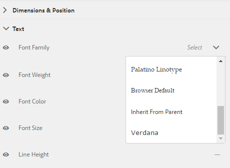
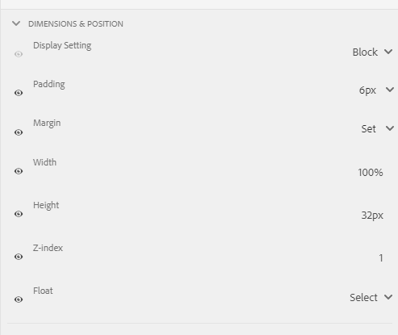

# Creazione e utilizzo dei temi {#creating-and-using-themes}

È possibile creare e applicare temi per stilizzare un modulo adattivo<!-- or an interactive communication-->. Un tema contiene dettagli di stile per i componenti e i pannelli. Gli stili includono proprietà quali colori di sfondo, colori dello stato, trasparenza, allineamento e dimensioni. Quando applichi un tema, lo stile specificato si riflette sui componenti corrispondenti. Il tema viene gestito in modo indipendente senza un riferimento a un modulo adattivo<!-- or interactive communication -->.

È possibile scaricare e installare [!DNL AEM Forms] pacchetto di contenuti di riferimento da [Distribuzione di software](https://experience.adobe.com/#/downloads/content/software-distribution/it/aemcloud.html) portale per importare temi e modelli di riferimento nell’ambiente.

## Creazione, download o caricamento di un tema {#creating-downloading-or-uploading-a-theme}

Un tema viene creato e salvato come entità separata, completo di meta-proprietà come Adaptive Forms. Consente di riutilizzare un tema in più Forms adattivo<!-- or  and interactive communications-->. È inoltre possibile spostare un tema in un&#39;istanza diversa e riutilizzarlo.

### Creazione di un tema {#creating-a-theme}

Per creare un tema:

1. Fai clic su **[!UICONTROL Adobe Experience Manager]**, fai clic su **[!UICONTROL Forms]** e fai clic su **[!UICONTROL Temi]**.

1. Nella pagina Temi , fai clic su **[!UICONTROL Crea]** > **[!UICONTROL Tema]**.
Viene avviata una procedura guidata per creare un tema.

1. Specifica **[!UICONTROL Nome]** del tema.

1. Specificare un modulo per visualizzare in anteprima il tema nel **[!UICONTROL Anteprima predefinita per questo tema]** campo . Fai clic su **[!UICONTROL Usa predefinito]** per utilizzare il modulo predefinito per visualizzare l’anteprima del tema.

1. Specifica una **[!UICONTROL Contenitore di configurazione]**. Puoi scegliere una **[!UICONTROL Contenitore di configurazione]** che contiene i dettagli di configurazione di Adobe Font per il tuo account. Puoi anche lasciare l’opzione vuota per ora e specificare i dettagli in un secondo momento da [proprietà del tema](#metadata-of-a-theme).

1. Fai clic su **[!UICONTROL Crea]** quindi fai clic su **[!UICONTROL Modifica]** per aprire il tema in Editor tema o fare clic su **[!UICONTROL Fine]** per tornare alla pagina dei temi.

### Differenza rispetto ai temi dell’Experience Manager 6.5 Forms e delle versioni precedenti {#difference-in-themes}

Temi creati su un&#39;istanza di Cloud Service:

* Avere la versione numero 2.

* Sono memorizzati in `/content/dam/formsanddocuments-themes/<theme-name>/`

* Non fornire l&#39;opzione client-library. Non è possibile specificare una categoria e un percorso della libreria client.

* Non disponi di autorizzazioni di scrittura e aggiornamento nel percorso /apps (il gruppo di utenti Forms non dispone di autorizzazioni di scrittura e aggiornamento nel percorso /apps).

* Prima di caricare un tema creato il [!DNL Experience Manager Forms] 6.5 o versioni precedenti di un&#39;istanza di Cloud Service, assicurati che il percorso della libreria client sia impostato su `etc/clientlibs/fd/themes`. Se la libreria client non esiste nel `etc` cartella, aggiorna manualmente la posizione in `etc/clientlibs/fd/themes`.  È possibile apportare modifiche al [!DNL Experience Manager Forms] 6.5 o versioni precedenti. Dopo aver impostato la posizione della libreria client, un amministratore può caricare i temi nell’istanza di Cloud Service o utilizzare lo strumento Content Transfer (Trasferimento contenuti) per migrare i temi dalle istanze 6.5 o della versione precedente all’istanza di Cloud Service.

   Inoltre, modifica il nome della categoria. Se il nome non viene modificato, viene visualizzato un errore `theme with same category name exists` potrebbe verificarsi. Quando modifichi il nome della categoria, non influisce sul Forms adattivo che utilizza il tema.

### Download di un tema {#downloading-a-theme}

Puoi esportare i temi come file zip e utilizzarli in altri progetti o istanze di Experience Manager. Per scaricare un tema:

1. Fai clic su **[!UICONTROL Adobe Experience Manager]**, fai clic su **[!UICONTROL Forms]**, quindi fai clic su **[!UICONTROL Temi]**.

1. Nella pagina Temi , **[!UICONTROL Seleziona]** un tema e fai clic su **[!UICONTROL Scarica]**. Viene visualizzata una finestra di dialogo con i dettagli del tema.

1. Fai clic su **[!UICONTROL Scarica]**. Il tema viene scaricato come file zip.

>[!NOTE]
>
>Se scarichi un tema a cui è associato un modulo adattivo e il modulo adattivo associato è basato su un modello personalizzato, scarica anche il modello personalizzato. Quando carichi il tema scaricato e il modulo adattivo, carica anche il relativo modello personalizzato.

### Caricamento di un tema {#uploading-a-theme}

Un utente con privilegi di amministratore può caricare un tema creato in [!DNL Experience Manager Forms] 6.5 o versioni precedenti.

Per caricare un tema:

1. Fai clic su **[!UICONTROL Adobe Experience Manager]**, fai clic su **[!UICONTROL Forms]**, quindi fai clic su **[!UICONTROL Temi]**.

1. Nella pagina Temi , fai clic su **[!UICONTROL Crea]** > **[!UICONTROL Caricamento file]**.
1. Nel prompt Caricamento file, sfoglia e seleziona un pacchetto tema sul computer e fai clic su **[!UICONTROL Carica]**.
Il tema caricato è disponibile nella pagina dei temi .

## Metadati di un tema {#metadata-of-a-theme}

Elenco di meta-proprietà di un tema (trovato nella pagina delle proprietà di un tema).

<table>
 <tbody>
  <tr>
   <th>
<strong>ID</strong>
 
 
 </th>
   <th><strong>Nome</strong></th>
   <th><strong>Può essere modificato</strong></th>
   <th><strong>Descrizione proprietà</strong></th>
  </tr>
  <tr>
   <td>1.</td>
   <td>Titolo</td>
   <td>Sì</td>
   <td>Nome visualizzato del tema.</td>
  </tr>
  <tr>
   <td>2.</td>
   <td>Descrizione</td>
   <td>Sì</td>
   <td>Descrizione del tema.</td>
  </tr>
  <tr>
   <td>3.</td>
   <td>Tipo</td>
   <td>No</td>
   <td>
    <ul>
     <li>Tipo di risorsa.</li>
     <li>Il valore è sempre Tema.</li>
    </ul> </td>
  </tr>
  <tr>
   <td>4.</td>
   <td>Creato</td>
   <td>No</td>
   <td>Data della creazione del tema</td>
  </tr>
  <tr>
   <td>5.</td>
   <td>Nome autore</td>
   <td>Sì</td>
   <td>Autore del tema. Calcolato al momento della creazione del tema.</td>
  </tr>
  <tr>
   <td>6.</td>
   <td>Data ultima modifica</td>
   <td>No</td>
   <td>Data dell'ultima modifica del tema.</td>
  </tr>
  <tr>
   <td>7.</td>
   <td>Stato</td>
   <td>No</td>
   <td>Stato del tema (Modificato/Pubblicato).</td>
  </tr>
  <tr>
   <td>8.</td>
   <td>Pubblica in tempo</td>
   <td>Sì</td>
   <td>Ora di pubblicare automaticamente il tema.</td>
  </tr>
  <tr>
   <td>9.</td>
   <td>Ora di disattivazione pubblicazione</td>
   <td>Sì</td>
   <td>Ora di annullare automaticamente la pubblicazione del tema.</td>
  </tr>
  <tr>
   <td>10.</td>
   <td>Tag</td>
   <td>Sì</td>
   <td>Etichetta collegata al tema di identificazione utilizzata per migliorare la ricerca.</td>
  </tr>
  <!-- <tr>
   <td>11.</td>
   <td>References</td>
   <td>Links</td>
   <td>
    <ul>
     <li>Contains 'Referred by' section. Lists forms that use the theme.</li>
     <li>Since the theme does not refer to any other asset, there is no 'Refers' section.</li>
    </ul> </td>
  </tr>
   <tr>
   <td>12.</td>
   <td>Clientlib Location</td>
   <td>Yes</td>
   <td>
    <ul>
     <li>The user-defined repository path within '/etc' where the clientlibs corresponding to this theme are stored.</li>
     <li>Default value - '/etc/clientlibs/fd/themes' + relative path of theme asset.</li>
     <li>If the location does not exist, the folder hierarchy is auto-generated.</li>
     <li>When this value is changed, the clientlib node structure is moved to the new location entered.  <em><strong>Note:</strong> If you change default clientlib location, in the CRXDE repository assign <code>crx:replicate, rep:write, rep:glob:*, rep:itemNames:: js.txt, jcr:read </code>to <code>forms-users</code> and <code>crx:replicate</code>, <code>jcr:read </code>to <code>fd-service</code> in the new location. Also attach another ACL by adding <code>deny jcr:addChildNodes</code> for <code>forms-user</code></em></li>
    </ul> </td>
  </tr> 
  <tr>
   <td>13.</td>
   <td>Clientlib Category Name</td>
   <td>Yes</td>
   <td>
    <ul>
     <li>The user-defined clientlib category name for this theme.</li>
     <li>An error is displayed if the name is already in use by some other existing theme.</li>
     <li>Default value - computed using theme location.</li>
     <li>When this value is changed, the category name is updated on the corresponding clientlib node. Updating Clientlib Category Name in the jsp files is not required because clientlib category name is used by reference.</li>
    </ul> </td>
  </tr> -->
 </tbody>
</table>

## Informazioni sull’editor di temi {#about-the-theme-editor}

Theme Editor è un’interfaccia intuitiva per utenti aziendali e web-designer/sviluppatori che fornisce le funzionalità necessarie per specificare lo stile dei vari moduli adattivi <!-- and interactive communication --> elementi facilmente. Quando crei un tema, questo viene memorizzato come entità separata, ad esempio i moduli <!--  , interactive communications, letters, document fragments, and data dictionaries-->.

L’Editor tema ti consente di personalizzare gli stili dei componenti formattati in un tema. È possibile personalizzare il modo in cui un modulo <!-- or interactive communication --> controlla un dispositivo.

L’Editor tema è diviso in due pannelli:

* **Canvas** - Appare sul lato destro. Mostra un esempio di modulo adattivo <!--  or interactive communication --> in cui tutte le modifiche allo stile riflettono istantaneamente. È inoltre possibile selezionare gli oggetti direttamente dall’area di lavoro per cercare gli stili ad essi associati e modificare tali stili. Un righello di risoluzione del dispositivo in alto governa il quadro. Quando si seleziona un punto di interruzione della risoluzione dal righello, viene visualizzata l’anteprima del modulo di esempio <!--  or interactive communication --> per la relativa risoluzione. L&#39;area di lavoro viene discussa in dettaglio [di seguito](themes.md#using-canvas).

* **Barra laterale**- Appare sul lato sinistro. Sono disponibili i seguenti elementi:

   * **Selettore:** Mostra il componente selezionato per lo stile e le relative proprietà che è possibile assegnare. Il selettore rappresenta tutti i componenti di un tipo. Se si seleziona un componente casella di testo in un tema per la formattazione, tutte le caselle di testo del modulo <!-- or interactive communication --> eredita lo stile. I selettori consentono di selezionare un componente generico o un componente specifico per lo stile. Ad esempio, un componente campo è un componente generico e una casella di testo è un componente specifico.

      **Componente generico dello stile:**
Un campo può essere un campo casella numerica, ad esempio età o un campo casella di testo, ad esempio indirizzo.
Quando si formatta un campo, vengono formattati tutti i campi, ad esempio età, nome e indirizzo.

      **Definizione dello stile di un componente specifico**: Un componente specifico influisce sugli oggetti della categoria specifica. Quando si applica uno stile al componente casella numerica nel tema, solo l’oggetto casella numerica nel testo eredita lo stile.

      Ad esempio, un campo casella di testo, ad esempio indirizzo più lungo e un campo casella numerica come età più breve. È possibile selezionare un campo casella numerica, ridurne la lunghezza e applicarlo al modulo. Nel modulo viene ridotta la larghezza di tutti i campi casella numerica.

      Quando si personalizzano tutti i componenti campo con un colore di sfondo specifico, tutti i campi, ad esempio età, nome e indirizzo, ereditano il colore di sfondo. Quando si seleziona una casella numerica, ad esempio l’età, e ne si riduce la larghezza, la larghezza di tutte le caselle numeriche, ad esempio l’età, viene ridotto il numero di persone in una famiglia. La larghezza delle caselle di testo non viene modificata.

   * **Stato:** Consente di personalizzare gli stili di un oggetto in uno stato specifico. Ad esempio, è possibile specificare l’aspetto di un oggetto quando è in stato di default, lo stato attivo, disattivato, passaggio del mouse o di errore.
   * **Categorie di proprietà:** Le proprietà di stile sono suddivise in varie categorie. Ad esempio Dimension e posizione, testo, sfondo, bordo ed effetti. Sotto ogni categoria vengono fornite informazioni sullo stile. Ad esempio, in Sfondo, puoi fornire Colore sfondo e Immagine e sfumatura.

   * **Avanzate:** Consente di aggiungere CSS personalizzati a un oggetto, che sostituisce le proprietà definite dai controlli visivi per determinare se è presente una sovrapposizione.

   * **Visualizza CSS**: Consente di visualizzare i CSS del componente selezionato.
   Inoltre, nella barra laterale, in basso è presente una freccia. Quando fai clic sulla freccia, ottieni altre due opzioni: **Simulazione riuscita** e **Simula errore.** Queste opzioni, insieme alle opzioni descritte sopra, sono discusse in dettaglio [di seguito](themes.md#using-rail).

 **A.** Barra laterale **B.** Canvas

### Componenti di stile {#styling-components}

Puoi utilizzare un tema in più Forms adattivo<!-- and interactive communications -->, che importa la formattazione del componente specificata nel tema. È possibile assegnare uno stile a vari componenti quali titoli, descrizioni, pannelli, campi, icone e caselle di testo. Utilizza i widget per configurare le proprietà dei componenti in un tema. La conoscenza preventiva di CSS o LESS non è necessaria ma desiderata, anche se la sezione CSS Overrides ti consente di scrivere codice CSS o fornire selettori personalizzati. La sezione Sostituzioni CSS viene visualizzata quando selezioni un componente nella barra laterale.

Opzioni nella barra laterale che consentono di selezionare e assegnare uno stile a componenti diversi.

Facendo clic sul pulsante di modifica rispetto a un componente nella barra laterale si seleziona il componente in Area di lavoro e il componente viene formattato utilizzando le opzioni nella barra laterale.

Alcuni componenti come casella di testo, casella numerica, pulsante di scelta e casella di controllo sono organizzati in categorie in componenti generici come Campo. Ad esempio, è consigliabile personalizzare lo stile dei pulsanti di scelta. Per selezionare i pulsanti di scelta per lo stile, selezionare **[!UICONTROL Campo]** > **[!UICONTROL Widget]** > **[!UICONTROL Pulsante di scelta]**.

### Layout dei pannelli di stile {#styling-panel-layouts-br}

Temi in [!DNL AEM Forms] supporto dello stile degli elementi nel layout dei pannelli nei moduli<!-- and  interactive communications -->. È supportato lo stile degli elementi nei layout predefiniti e nei layout personalizzati.

I pannelli preconfigurati includono:

* Schede a sinistra
* Schede superiori
* Pannello a soffietto
* Reattivo
* Procedura guidata
* Layout mobile

   * Titoli del pannello nell’intestazione
   * Senza titoli del pannello nell&#39;intestazione

I selettori variano a seconda del layout.
Lo stile di layout personalizzati dall’Editor tema comporta:

* Definizione dei componenti per un layout che può essere formattato e selettori CSS per l’identificazione univoca di tali componenti.
* Definizione delle proprietà CSS che possono essere applicate a questi componenti.
* Definisci lo stile di questi componenti in modo interattivo dall’interfaccia utente.

### Stili diversi per diverse dimensioni dello schermo {#different-styles-for-different-screen-sizes-br}

I layout desktop e mobili possono avere stili leggermente o completamente diversi. Per i dispositivi mobili, i tablet e il telefono condividono layout simili, ad eccezione delle dimensioni dei componenti.

Utilizza i punti di interruzione dell’Editor tema per definire lo stile alternativo per le diverse dimensioni dello schermo. È possibile selezionare un dispositivo o una risoluzione di base su cui iniziare a creare il tema e le varianti di stile per altre risoluzioni vengono generate automaticamente. È possibile modificare esplicitamente lo stile per tutte le risoluzioni.

>[!NOTE]
>
>Il tema viene creato per la prima volta utilizzando un modulo<!-- or interactive communication-->, e quindi applicato a moduli diversi<!-- or interactive communications-->. I punti di interruzione utilizzati nella creazione di un tema possono essere diversi dal modulo <!-- or interactive communication --> su cui viene applicato il tema. Le query multimediali CSS sono basate sul modulo <!-- or interactive communication --> utilizzato nella creazione di un tema e non nel modulo <!-- or interactive communication --> su cui viene applicato il tema.

### Modifica del contesto delle proprietà di stile nella barra laterale durante la selezione degli oggetti {#styling-properties-context-changes-in-sidebar-on-selecting-objects}

Quando selezionate un componente nell’area di lavoro, le relative proprietà di stile sono elencate nella barra laterale. Selezionare il tipo di oggetto e il relativo stato, quindi specificare lo stile.

### Stili utilizzati di recente nell’Editor tema {#recently-used-styles-in-theme-editor}

L’editor di temi memorizza in cache fino a dieci stili applicati a un componente. Puoi utilizzare gli stili memorizzati nella cache con altri componenti di un tema. Gli stili utilizzati di recente sono disponibili sotto il componente selezionato nella barra laterale come casella di riepilogo. Inizialmente, l’elenco degli stili utilizzati di recente è vuoto.

Mentre si formatta un componente, gli stili vengono memorizzati nella cache ed elencati nella casella di riepilogo. In questo esempio, l&#39;etichetta della casella di testo viene formattata per modificare la dimensione e il colore del font. Puoi seguire passaggi simili per scegliere un’immagine o cambiare i colori in base allo stile di un componente. Osserva come lo stile viene memorizzato nella cache ed elencato nella casella di riepilogo quando viene modificato lo stile dell’etichetta del campo.

In questo esempio, lo stile dell’etichetta del campo viene modificato e, quando è selezionata la descrizione del pannello reattivo per lo stile, una voce di elenco viene aggiunta nella libreria delle risorse. La voce nella libreria delle risorse può essere utilizzata per modificare lo stile della descrizione del pannello reattivo.

Quando viene aggiunto uno stile nella libreria delle risorse, è disponibile per altri temi e nella sezione [modalità stile](inline-style-adaptive-forms.md) dell’interfaccia utente dell’editor di moduli. Analogamente, quando si utilizza la modalità stile dell’editor di moduli <!-- or interactive communication editor --> Per personalizzare lo stile di un componente, lo stile è memorizzato nella cache ed è disponibile nei temi.

Il pulsante più della libreria di risorse consente di salvare in modo permanente lo stile con il nome specificato. Il pulsante più salva lo stile anche se non fai clic sul pulsante Salva nella barra laterale per applicare lo stile a un componente. Il pulsante più per salvare uno stile per un uso successivo non è disponibile in modalità stile.

Quando si fornisce un nome personalizzato per uno stile, lo stile è legato a un tema e non è più disponibile per altri temi. Per eliminare uno stile salvato:

1. Sulla barra degli strumenti CANVAS fare clic su **[!UICONTROL Opzioni tema]**  > **[!UICONTROL Gestione stili]**.
1. Nella finestra di dialogo Gestione stili, seleziona uno stile salvato e fai clic su **[!UICONTROL Elimina]**.

   

### Anteprima live, salvataggio ed eliminazione delle modifiche {#live-preview-save-and-discard-changes}

Le modifiche apportate allo stile vengono immediatamente applicate al modulo <!-- or interactive communication --> caricato nell&#39;area di lavoro. L’anteprima live consente di definire e visualizzare in modo interattivo l’impatto dello stile. Quando modifichi lo stile di un componente, la funzione **[!UICONTROL Fine]** è attivato nella barra laterale. Per mantenere le modifiche, utilizza le **[!UICONTROL Fine]** pulsante .

>[!NOTE]
>
>Quando un carattere non valido viene immesso in un campo, il colore del bordo del campo diventa rosso e nell’angolo in alto a sinistra dello schermo viene visualizzato un messaggio di errore. Ad esempio, se si immettono alfabeti in una casella di testo che accetta caratteri numerici come input, il colore del bordo della casella di input diventa rosso. Non è possibile salvare un tema di questo tipo senza risolvere l&#39;errore visualizzato al centro della schermata.

### Tema con un altro modulo adattivo {#theme-with-another-adaptive-form}

Quando si crea un tema, questo viene creato con un modulo fornito con l’Editor tema. È disponibile lo stile per i componenti di questo modulo. Invece del modulo fornito con l’Editor tema, è possibile selezionare un modulo <!-- or interactive communication --> di tua scelta per fornire lo stile e visualizzare in anteprima i risultati.

Per sostituire il modulo corrente o <!-- interactive communication --> nell&#39;area di lavoro dell&#39;editor di temi:

1. Nel pannello EDITOR TEMA, fai clic su **[!UICONTROL Opzioni tema]**  > **[!UICONTROL Configura]**.

1. Nella scheda Generale individuare e selezionare un modulo <!-- or interactive communication --> per **[!UICONTROL Modulo adattivo]** campo .

### Ripristina/Annulla {#redo-undo}

Puoi annullare o ripristinare le modifiche indesiderate che si verificano accidentalmente. Utilizzare i pulsanti Ripristina/Annulla nell’area di lavoro.

I pulsanti Ripristina/Annulla vengono visualizzati quando si applica uno stile a un componente nell’Editor tema.

## Utilizzo dell’editor di temi {#using-the-theme-editor}

L’Editor tema consente di modificare un tema creato o caricato. Passa a **[!UICONTROL Forms e documenti]** > **[!UICONTROL Temi]**, quindi seleziona un tema e aprilo. Il tema viene aperto nell’Editor tema.

Come illustrato in precedenza, l’Editor tema presenta due pannelli: Barra laterale e tela.

Personalizzazione dello stile dello stato di successo del componente Widget casella di testo nell&#39;Editor tema. Il componente viene selezionato in Area di lavoro e il relativo stato viene selezionato nella barra laterale. Le opzioni di stile disponibili nella barra laterale consentono di personalizzare l’aspetto di un componente.

### Utilizzo dell’area di lavoro {#using-canvas}

Il tema viene creato utilizzando il modulo preconfigurato o un modulo <!-- or interactive communication --> di tua scelta. Nell’area di lavoro viene visualizzata l’anteprima del modulo o <!-- interactive communication --> utilizzato per creare il tema con le personalizzazioni specificate nel tema. Il righello sopra il modulo viene utilizzato per determinare il layout in base alle dimensioni di visualizzazione del dispositivo.

Nella barra degli strumenti Area di lavoro sono disponibili le seguenti opzioni:

* **[!UICONTROL Attiva/Disattiva pannello laterale]** : Consente di mostrare o nascondere la barra laterale.
* **[!UICONTROL Opzioni tema]** : Fornisce tre opzioni

   * Configura: Fornisce opzioni per selezionare il modulo di anteprima <!-- or interactive communication , base clientlib, -->e la configurazione di Adobe Fonts.
   * Visualizza CSS tema: Genera CSS per il tema selezionato.
   * Gestione stili: Fornisce opzioni per gestire gli stili di testo e immagini
   * Aiuto: Esegue una visita guidata immagine dell&#39;Editor tema.

* **[!UICONTROL Emulatore]** : Emula l&#39;aspetto del tema per diverse dimensioni di visualizzazione. Le dimensioni di un display vengono trattate come punto di interruzione nell’emulatore. È possibile selezionare un punto di interruzione e specificarne uno stile. Ad esempio, Desktop e Tablet sono due punti di interruzione. Puoi specificare stili diversi per ogni punto di interruzione.

Quando selezioni un componente nell’area di lavoro, viene visualizzata la barra degli strumenti del componente sopra di esso. La barra degli strumenti del componente consente di selezionare i componenti o passare a componenti generici. Ad esempio, è possibile selezionare una casella di testo numerica in un pannello. Nella barra degli strumenti del componente sono disponibili le seguenti opzioni:

* **[!UICONTROL Widget Casella Numerica]**: Consente di selezionare il componente per personalizzarne l’aspetto nella barra laterale.
* **[!UICONTROL Widget campo]**: Consente di selezionare il componente generico da applicare allo stile. In questo esempio, tutti i componenti di input di testo (casella di testo/casella numerica/passaggio numerico/input data) sono selezionati per lo stile.

* : Consente di selezionare il componente principale per lo stile. Se si seleziona una casella numerica e si tocca questa icona, viene selezionato il componente Campo. Se selezioni il componente Campo e tocca questa icona, viene selezionato il pannello . Se continui a toccare questa icona per la selezione, finisci per selezionare il layout per la formattazione.

>[!NOTE]
>
>Le opzioni disponibili nella barra degli strumenti del componente variano a seconda del componente selezionato.

### Utilizzo della barra laterale {#using-rail}

La barra laterale nell’editor di temi fornisce opzioni per personalizzare gli stili per i componenti di un tema e utilizzare i selettori. I selettori consentono di selezionare un gruppo di componenti o singoli componenti e di cercare i selettori nella barra laterale. Puoi scrivere selettori per componenti personalizzati.

Quando selezionate un componente dall’area di lavoro o dai selettori nella barra laterale, la barra laterale mostra tutte le opzioni che consentono di personalizzare gli stili.
Di seguito sono riportate le opzioni visualizzate nella barra laterale quando si seleziona un componente:

* Stadio
* Foglio delle proprietà
* Simula errore/successo

#### Stadio {#state}

Uno stato è un indicatore dell’interazione dell’utente con un componente. Ad esempio, quando un utente immette dati errati in una casella di testo, lo stato della casella di testo diventa uno stato di errore. L’editor dei temi consente di specificare lo stile per uno stato specifico.

Le opzioni per personalizzare gli stili di stato variano per i diversi componenti.

#### Foglio delle proprietà {#property-sheet}

<table>
 <tbody>
  <tr>
   <td><strong>Proprietà</strong></td>
   <td><strong>Utilizzare</strong></td>
  </tr>
  <tr>
   <td>
Dimensioni e posizione
 </td>
   <td>
Consente di definire lo stile, le dimensioni, il posizionamento e il posizionamento dei componenti nel tema. 
 
Le opzioni disponibili sono: impostazione della visualizzazione, spaziatura, margine, larghezza, altezza e indice Z.
 
È inoltre possibile utilizzare la modalità Layout per definire la larghezza dei componenti mediante una semplice interfaccia a trascinamento della selezione. Per ulteriori informazioni, consulta <a href="resize-using-layout-mode.md">Utilizzare la modalità Layout per ridimensionare i componenti</a>.
 </td>
  </tr>
  <tr>
   <td>
Testo
 </td>
   <td>
Consente di personalizzare gli stili di testo nel componente del tema.
 
Ad esempio, si desidera modificare l’aspetto del testo immesso nella casella di testo.
 
Le opzioni disponibili sono famiglia di font, peso, colore, dimensione, altezza riga, allineamento testo, spaziatura lettere, rientro testo, sottolineatura, corsivo, trasformazione testo, allineamento verticale, linea di base e direzione. 
 </td>
  </tr>
  <tr>
   <td>
Informazioni di base 
 </td>
   <td>
Consente di riempire lo sfondo del componente con un’immagine o un colore. 
 </td>
  </tr>
  <tr>
   <td>
Bordo
 </td>
   <td>
Consente di scegliere l’aspetto del bordo del componente. Ad esempio, si desidera che la casella di testo abbia un bordo rosso profondo e spesso con una linea tratteggiata. 
 
Le opzioni disponibili sono larghezza, stile, raggio e colore del bordo.
 </td>
  </tr>
  <tr>
   <td>
Effetti
 </td>
   <td>
Consente di aggiungere effetti speciali ai componenti quali opacità, modalità di fusione e ombre. 
 </td>
  </tr>
  <tr>
   <td>
Avanzate 
 </td>
   <td>
Consente di aggiungere:

    <ul>
     <li>Proprietà per <code>::before</code> e <code>::after</code> elementi pseudo per aggiungere contenuto dopo o prima del contenuto predefinito nel selettore e formattarlo.  Vedi <a href="https://www.w3schools.com/css/css_pseudo_elements.asp" target="_blank">Pseudo-elementi CSS</a>.</li>
     <li>Codice CSS personalizzato in linea con un componente.</li>
    </ul> 
Quando aggiungi un codice CSS personalizzato, sostituisce la personalizzazione aggiunta utilizzando le opzioni nella barra laterale. 
 </td>
  </tr>
 </tbody>
</table>

#### Simula errore/successo {#simulate-error-success}

Le opzioni Errore di simulazione e Successo sono disponibili nella parte inferiore della barra laterale. È possibile visualizzarli utilizzando una freccia mostra/nascondi visibile nella parte inferiore della barra laterale. Utilizzando l’editor di temi, puoi assegnare uno stile a vari stati di un componente.

Ad esempio, è possibile aggiungere un campo numerico nel modulo e specificarne lo stile nell’editor di temi. Quando un utente digita un valore alfanumerico nel campo, si desidera modificare il colore di sfondo della casella di testo. Selezionate il campo numerico nel tema e utilizzate l&#39;opzione stato nella barra laterale. Selezionate lo stato Errore nella barra laterale e cambiate il colore di sfondo in rosso. Per visualizzare un’anteprima del comportamento, puoi utilizzare l’opzione Simula errore disponibile nella barra laterale. Le opzioni Errore di simulazione e Successo sono descritte in dettaglio di seguito:

* **Simulazione riuscita**: Consente di visualizzare l’aspetto di un componente se si specifica lo stile per lo stato di successo. Ad esempio, in un modulo i clienti impostano la password. Gli utenti possono impostare la password in base alle linee guida fornite. Quando un utente digita una password seguendo tutte le linee guida fornite, la casella di testo diventa verde. Quando la casella di testo diventa verde, lo stato è riuscito. Potete specificare lo stile di un componente in stato di successo e simularne l’aspetto utilizzando l’opzione Simula successo .

* **Errore Simulazione**: Consente di visualizzare l’aspetto di un componente se si specifica lo stile per lo stato di errore. Ad esempio, in un modulo i clienti impostano la password. Gli utenti possono impostare la password in base alle linee guida fornite. Quando un utente digita una password che non rispetta tutte le linee guida fornite, la casella di testo diventa rossa. Quando la casella di testo diventa rossa, si verifica uno stato di errore. È possibile specificare lo stile di un componente in stato di errore e simularne l’aspetto utilizzando l’opzione Simula errore.

### Stile di un componente {#styling-a-component}

Ad esempio, nel modulo sono disponibili due tipi di caselle di testo: che accetta solo valori numerici e altri che accettano valori alfanumerici. È possibile personalizzare lo stile della casella di testo che accetta solo valori numerici (casella numerica).

Per personalizzare lo stile di un particolare componente (una casella numerica in questo esempio), effettua le seguenti operazioni:

1. Nell’Editor tema, selezionare la casella numerica nell’area di lavoro.
1. Quando si seleziona la casella numerica, è possibile visualizzare la barra degli strumenti del componente con tre opzioni:

   * **[!UICONTROL Widget casella numerica]**
   * **[!UICONTROL Widget campo]**

1. Seleziona **[!UICONTROL Widget Casella Numerica]**.
1. Il titolo della barra laterale diventa Widget per casella numerica e mostra le opzioni per personalizzarne l’aspetto.
Utilizzo **[!UICONTROL Dimension e posizione]** nella barra laterale per personalizzare le dimensioni del componente. Assicurati che lo Stato sia **[!UICONTROL Predefinito]**.

Invece di selezionare **[!UICONTROL Widget Casella Numerica]**, seleziona **[!UICONTROL Widget campo]** nella barra degli strumenti del componente ed esegui i passaggi precedenti. Quando selezioni le dimensioni per **[!UICONTROL Widget campo]** le dimensioni di tutte le caselle di testo, ad eccezione della casella numerica, sono uguali.

### Campi di stile per un dato stato {#styling-fields-given-state}

Con la barra degli strumenti dei componenti è inoltre possibile specificare lo stile dei componenti per i diversi stati. Ad esempio, se un componente è disabilitato, lo stato è disabilitato. Gli stati comunemente utilizzati di un componente che è possibile definire nell’editor di temi sono: Predefinito, Attiva, Disabilitata, Errore, Successo e passaggio del mouse. Potete selezionare un componente nell’area di lavoro e utilizzare l’opzione Stato nella barra laterale per personalizzarne l’aspetto.

Per personalizzare lo stile di un componente in uno stato specifico, effettua le seguenti operazioni:

1. Seleziona un componente nell’area di lavoro e seleziona l’opzione appropriata dalla barra degli strumenti del componente.
La barra laterale mostra le opzioni per personalizzare lo stile del componente.
1. Seleziona uno stato nella barra laterale. Ad esempio, Stato errore.
1. Usa opzioni quali **[!UICONTROL Bordo, sfondo]** nella barra laterale per personalizzare l’aspetto del componente.
1. Utilizza la **[!UICONTROL Errore Simulazione]** nella parte inferiore della barra laterale per visualizzare l’aspetto dello stile durante la modifica.

Quando si personalizza lo stile di un componente dopo averne specificato lo stato, viene visualizzata la personalizzazione solo per lo stato specificato. Ad esempio, se personalizzi lo stile del componente quando lo stato del passaggio del mouse è selezionato. Viene visualizzata la personalizzazione del componente quando si sposta il puntatore sul componente nel modulo di cui è stato effettuato il rendering <!-- or interactive communication --> a cui si applica il tema.

Per simulare il comportamento di stati diversi da errore e successo, utilizza la modalità Anteprima . Per utilizzare la modalità Anteprima, fai clic su **[!UICONTROL Anteprima]** nella barra degli strumenti della pagina.

### Layout di stile per display più piccoli {#styling-layouts-for-smaller-displays}

Utilizza il righello nell’area di lavoro per selezionare i punti di interruzione per i dispositivi con display più piccoli. Fai clic su emulatore  in Area di lavoro per visualizzare righello e punti di interruzione. I punti di interruzione consentono di visualizzare in anteprima un modulo <!-- or interactive communication --> per le dimensioni del display relative a diversi dispositivi, come telefoni e tablet. Nell’Editor tema sono supportate più dimensioni di visualizzazione.

Per assegnare uno stile ai componenti per diversi punti di interruzione:

1. Nell’area di lavoro, seleziona un punto di interruzione sopra il righello.
Un punto di interruzione rappresenta un dispositivo mobile e le relative dimensioni di visualizzazione.
1. Utilizzare la barra laterale per personalizzare lo stile del modulo <!-- or interactive communication --> componenti del tema per la dimensione di visualizzazione selezionata.
1. Assicurati che la personalizzazione sia salvata.

È possibile creare uno stile per il modulo <!-- or interactive communication --> componenti per più dispositivi. Modulo <!-- and interactive communication --> i componenti per desktop e dispositivi mobili possono avere stili completamente diversi.

### Utilizzo di Web Fonts in un tema {#using-web-fonts-in-a-theme}

È ora possibile utilizzare i font disponibili in un servizio Web in un modulo adattivo <!-- or interactive communication -->. preconfigurato, [Adobe Fonts](https://fonts.adobe.com/), il servizio font web Adobe è disponibile come configurazione. Per utilizzare Adobe Fonts, crea un kit, aggiungi font e ottieni l’ID kit da [Adobe Fonts](https://fonts.adobe.com/).

Per configurare Adobe Fonts in Experience Manager, esegui i seguenti passaggi:

1. Nell’istanza di authoring, fai clic su **[!UICONTROL Adobe Experience Manager ]**>**[!UICONTROL  Strumenti ]** >**[!UICONTROL  Distribuzione ]**>**[!UICONTROL  Cloud Services ]**.
1. Sulla **[!UICONTROL Cloud Services]** pagina, accedere a e aprire **[!UICONTROL Adobe Fonts]** opzione . Apri la cartella di configurazione e fai clic su **[!UICONTROL Crea]**.
1. Sulla **[!UICONTROL Crea configurazione]** , specifica un titolo per la configurazione e fai clic su **[!UICONTROL Crea]**.

   Verrai reindirizzato alla pagina di configurazione.

1. Nella finestra di dialogo Modifica componente visualizzata, specifica l’ID kit e fai clic su **[!UICONTROL OK]**.

Per configurare un tema per l&#39;utilizzo della configurazione di Adobe Fonts, esegui i seguenti passaggi:

1. Nell’istanza di authoring, apri un tema nell’editor di temi.
1. Nell’editor di temi, passa a **[!UICONTROL Opzioni tema]**  > **[!UICONTROL Configura]**.
1. In **[!UICONTROL Configurazione Adobe Fonts]** selezionare un kit e fare clic su **[!UICONTROL Salva]**.

   Ora è possibile vedere che i font vengono aggiunti nella proprietà font-family del tema.

<!-- >
### Listing and selecting fonts in theme editor {#listing-and-selecting-fonts-in-theme-editor}

You can use the theme configuration service to add more fonts to the theme editor. Perform the following steps to add fonts:

1. Log in to Experience Manager Web Console with administrative privileges. URL for the Experience Manager Web Console is `https://'[server]:[port]'/system/console/configMgr`.
1. Open **[!UICONTROL Adaptive Form Theme Configuration Service]**.

   

1. Click +, specify the name of the font, and click **Save**. The font is added and available in theme editor. -->

#### Selezione dei font nell’editor di temi {#selecting-fonts-in-theme-editor}

È possibile utilizzare il pulsante + per aggiungere un font. Quando aggiungi un font, questo viene elencato nella barra laterale.

Oltre all’opzione di configurazione del tema, puoi anche aggiungere il font dall’editor di temi stesso. Digitare il font che si desidera utilizzare nel campo della famiglia di font sotto la barra laterale e premere il tasto di ritorno sulla tastiera.

Quando si seleziona un font, questo viene aggiunto nell’elenco della famiglia di font. È possibile utilizzare l&#39;opzione Maschera nell&#39;editor di temi per disabilitare o abilitare i font elencati.

È possibile visualizzare la modifica del font del componente.

Il campo Famiglia font supporta più font. Quando digitate un font, il browser lo cerca e lo applica al componente selezionato. Se il browser non è in grado di trovare un font, cerca un font accanto ad esso nella famiglia. Puoi iniziare digitando il font specifico che stai cercando. Se non si trova il font che si desidera utilizzare, è possibile digitare un font generico nella famiglia e utilizzarlo.

#### Stili di maschera applicati nell’editor di temi {#mask-styles-applied-in-theme-editor}

È possibile mascherare gli stili applicati in un tema. Nella barra laterale dell’editor di temi, puoi utilizzare la per disabilitare uno stile applicato. Ad esempio, se modifichi le dimensioni di un componente in un modulo <!-- or interactive communication -->, quindi puoi usare il pulsante maschera a sinistra di una proprietà per disattivarla. Quando salvi un tema, vengono mantenute le opzioni di mascheramento selezionate.

L’esempio seguente mostra gli stili mascherati e non mascherati in un tema.

## Applicazione di un tema a un modulo {#applying-a-theme-to-a-form-or-interactive-communication-br}

Per applicare un tema a un modulo adattivo:

1. Apri il modulo in modalità di modifica. Per aprire un modulo in modalità di modifica, selezionalo e fai clic su **[!UICONTROL Apri]**.
1. In modalità di modifica, seleziona un componente, quindi fai clic su  > **[!UICONTROL Contenitore di moduli adattivi]**, quindi fai clic su .

   È possibile modificare le proprietà del modulo nella barra laterale.

1. Nella barra laterale, fai clic su **[!UICONTROL Stile]**.
1. Seleziona il tema dal **[!UICONTROL Tema modulo adattivo]** a discesa e fai clic su **[!UICONTROL Fine]** .

È inoltre possibile definire un tema per un modulo adattivo quando lo si crea.

<!-- To apply a theme to an interactive communication:

1. Open your interactive communication in edit mode. To open a interactive communication in edit mode, select a form and click **Open**.
1. In the edit mode, select a component, then click  &gt;**Document Container**, and then click .

   You can edit properties of your form in the sidebar.

1. In the sidebar, under **Basic**, select your theme from the **Theme** drop-down and click **Done**  -->

### Modificare il tema di un modulo in fase di esecuzione {#change-theme-of-a-form-at-runtime}

Un tema utilizza diversi componenti di un modulo. È possibile utilizzare `themeOverride` per modificare dinamicamente il tema di un modulo. Un URL tipico di un modulo è:

`https://<server>:<port>/content/forms/af/test.html`

Puoi utilizzare il parametro themeOverride per applicare un tema in fase di esecuzione.

`https://<server>:<port>/content/forms/af/test.html?themeOverride=/content/dam/formsanddocuments-themes/simpleEnrollmentTheme`

La `themeOverride` consente di fornire un percorso a un tema. Cambia il tema del modulo e lo aggiorna con gli stili aggiornati.

## Ottenere un aspetto specifico utilizzando i temi {#specific-af-appearance}

Con [!DNL AEM Forms], oltre al tema predefinito dell’area di lavoro, sono disponibili molti altri temi. Per progettare il modulo <!-- or interactive communication --> utilizzando altri temi, insieme ad altre modifiche, copia il tema dalla cartella Libreria temi. Incolla i temi copiati all&#39;esterno della cartella Libreria temi e modifica il tema copiato in base alle modifiche desiderate.

Per copiare un tema, esegui le seguenti operazioni:

1. Nell’istanza di authoring, passa a **[!UICONTROL Adobe Experience Manager]** > **[!UICONTROL Forms]** > **[!UICONTROL Temi]**.
1. Apri la cartella Libreria temi .
1. Nella cartella Libreria temi, passa il puntatore del mouse sul tema predefinito corrispondente e tocca **[!UICONTROL Copia]**.
1. Incolla il tema copiato all&#39;esterno della cartella Libreria temi.
1. Personalizza il tema copiato.

Dopo aver personalizzato il tema, applicarlo al modulo <!-- or interactive communication -->.

>[!NOTE]
>
>Non modificare i temi disponibili nella cartella Libreria temi. Questa cartella contiene i temi di sistema. Qualsiasi modifica apportata a questi temi viene sovrascritta al momento dell&#39;installazione di una versione più recente o di una correzione rapida di [!DNL AEM Forms].

## Impatto su altri casi di utilizzo di moduli adattivi {#impact-on-other-adaptive-form-use-cases}

* **Pubblicare o annullare la pubblicazione di un modulo:** Quando si pubblica un modulo, viene pubblicato anche il tema applicato a (se non è già pubblicato)
* **Importare/esportare un modulo:** Durante l’importazione o l’esportazione di un modulo, anche il tema associato viene importato o esportato automaticamente.
* **Riferimenti di un modulo:** La sezione Riferimenti nei riferimenti al modulo contiene una voce aggiuntiva per il tema.
* **Data e ora dell’ultima modifica di un modulo:** Aggiornato quando il tema associato viene modificato.
<!-- * **A/B Testing:** You can apply a different theme to two versions of the form in A/B testing. The information of the two themes is individually stored on the two guide containers. -->

## Sequenza di generazione CSS {#css-generation-sequence}

Quando selezioni Visualizza CSS, l’Editor tema raccoglie tutte le informazioni sullo stile e crea un CSS. Raccoglie le informazioni nel seguente ordine:

<!-- 1. Styling defined in the theme's base client library. -->
1. Stile definito dall’utente, specificato utilizzando le proprietà nella barra laterale.
1. Stile CSS fornito utilizzando l’opzione Override CSS.

Ad esempio, il colore di sfondo di una casella di testo è blu<!-- in the base client library-->. Lo si cambia in rosa utilizzando le proprietà nella barra laterale. Quando si genera CSS, il colore di sfondo della casella di testo viene visualizzato come rosa. Dopo aver modificato il colore di sfondo utilizzando le proprietà, un altro autore utilizza l’opzione di sostituzione CSS per modificare la casella di testo del colore di sfondo in bianco. Quando generi CSS, il colore di sfondo viene visualizzato come bianco nel CSS generato.

## Debug degli stili {#debugging-styles}

Quando specifichi gli stili per i componenti nell’Editor tema, viene generato un CSS. Quando si formatta un componente generico, vengono formattati anche più componenti inclusi in esso. Ad esempio, quando si formatta un campo, anche la casella di testo e l’etichetta al suo interno vengono formattate. Quando si formatta la casella di testo all’interno del campo, ottiene il proprio CSS. Se desideri eseguire il debug del CSS generato per il campo e il componente, l’Editor tema fornisce opzioni che consentono di visualizzare CSS.

Puoi visualizzare i CSS generati utilizzando le seguenti opzioni:

* **Visualizza CSS** nella barra laterale: Quando selezioni un componente nel tema, puoi visualizzare l’opzione VIEW CSS nella barra laterale. Mostra il CSS generato, incluso CSS per `::before` e `::after` pseudo elementi.
* **Visualizza CSS tema** nella barra degli strumenti dell’area di lavoro: Nella barra degli strumenti Area di lavoro, fai clic su  > **[!UICONTROL Visualizza CSS tema]**. Puoi visualizzare l’intero CSS del tema generato dalle proprietà definite nell’Editor tema.

## Risoluzione dei problemi, raccomandazioni e best practice {#troubleshooting-recommendations-and-best-practices}

* **Evitare risorse da un altro tema**

   Quando modifichi un tema, puoi sfogliare e aggiungere risorse (come le immagini) da altri temi. Ad esempio, si sta modificando lo sfondo di una pagina. Ad esempio, quando selezioni **[!UICONTROL Pagina]** > **[!UICONTROL Sfondo]** > **[!UICONTROL Aggiungi]** > **[!UICONTROL Immagine]**, viene visualizzata una finestra di dialogo che consente di sfogliare e aggiungere immagini in altri temi.

* Puoi riscontrare problemi con il tema corrente se una risorsa viene aggiunta da un altro tema e l’altro tema viene spostato o eliminato. È consigliabile evitare di sfogliare e aggiungere risorse da altri temi.

<!-- * **Using base clientlib, theme editor, and inline styling**

    * **Base clientlib**:

      Base client library contains styling information. To use styling information in client-side libraries in themes.

        1. Navigate to **[!UICONTROL Experience Manager]** &gt; **[!UICONTROL Forms]** &gt; **[!UICONTROL Themes]**.
        1. In the Themes page, select a theme and click **[!UICONTROL Properties]**.
        1. In the Properties page that opens, click **[!UICONTROL Advanced]**.
        1. In the Advanced tab, in the Clientlib Location field, browse, and select the client-library you want to use.
        1. Click **[!UICONTROL Save]**.

      The styling you specify in client library is imported in the theme that uses it. For example, you specify styling for text box, numeric box, and switch in the client library. When you import your client library in the theme, styling for text box, numeric box, and switch is imported. You can then style other components using theme editor. -->
    Puoi anche creare un tema, crearne copie e quindi modificare lo stile fornito nei temi copiati per casi d’uso simili.
    Consulta [Ottenere un aspetto specifico utilizzando i temi](#specifiche-af-Appear)
    
    * **Editor tema:**
    
    L’Editor tema consente di creare temi per lo stile del modulo &lt;!>— o comunicazione interattiva —>. È possibile specificare lo stile dei componenti di un tema, che consenta la coerenza dell’aspetto generale tra più moduli &lt;!>— o comunicazioni interattive —> si sviluppa. È consigliabile specificare le informazioni sullo stile in un tema e quindi applicare il tema a un modulo.
    
    * **Stile in linea:**
    
    È possibile assegnare uno stile ai componenti utilizzando la modalità Stile nel modulo &lt;!>— o comunicazione interattiva —> editor multicanale quando si lavora con un modulo. L’utilizzo della modalità stile per modificare lo stile del componente modulo ha la precedenza sullo stile specificato nel tema. Per modificare lo stile di alcuni componenti di un modulo specifico, consultare [Stile in linea dei componenti](inline-style-adaptive-forms.md).

<!-- * **Using client-side libraries**

  If you want to create client libraries to import styling information, see [Using Client-Side Libraries](https://experienceleague.adobe.com/docs/experience-manager-cloud-service/implementing/developing/clientlibs.html). After you create a client library, you can import it in your theme using the steps mentioned above. -->

* **Modifica della larghezza del layout del pannello contenitore**

   Si sconsiglia di modificare la larghezza del layout del pannello contenitore. Quando si specifica la larghezza di un pannello contenitore, questo diventa statico e non si adatta a diversi schermi.

* **Quando utilizzare l’editor di moduli o di temi per lavorare con intestazione e piè di pagina**

   Utilizza l’editor di temi se desideri assegnare uno stile a intestazione e piè di pagina utilizzando opzioni di stile quali stile del font, sfondo e trasparenza.
Per fornire informazioni quali un’immagine logo, il nome dell’azienda nell’intestazione e le informazioni sul copyright nel piè di pagina, utilizzare le opzioni dell’editor moduli.
