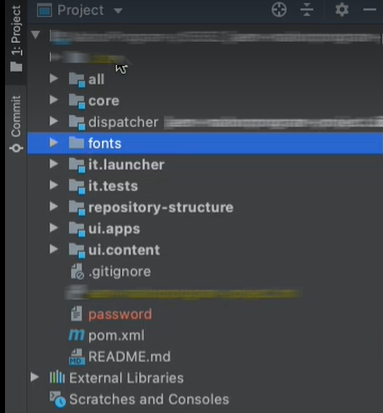

# Usa caratteri personalizzati

È possibile utilizzare Forms as a Cloud Service Communications per combinare un modello XDP, un documento PDF basato su XDP o Acrobat Form (AcroForm) con dati XML per generare documenti PDF. È inoltre possibile utilizzare le comunicazioni per combinare, ridisporre e migliorare i documenti PDF e XDP e ottenere informazioni sui documenti PDF.

Oltre alle operazioni precedentemente menzionate, è possibile utilizzare i font inclusi in Cloud Service o i font personalizzati (font approvati dall’organizzazione) per eseguire il rendering dei documenti PDF generati. Puoi utilizzare il progetto di sviluppo Cloud Service per aggiungere font personalizzati al tuo ambiente Cloud Service.

## Comportamento dei documenti di PDF

È possibile [incorporare un tipo di carattere](https://adobedocs.github.io/experience-manager-forms-cloud-service-developer-reference/references/output-sync/#tag/PrintedOutputOptions) in un documento di PDF. Quando un carattere è incorporato, il documento PDF viene visualizzato in modo identico su tutte le piattaforme. Utilizza font incorporati per garantire un aspetto coerente. Quando un font non è incorporato, il rendering del font dipende dalle impostazioni di rendering dei client visualizzatore di PDF come Acrobat o Acrobat Reader. Se il font è disponibile nel computer client, PDF utilizza il font specificato, altrimenti PDF viene riprodotto con un font di fallback predefinito.

## Aggiungere font personalizzati all’ambiente Forms as a Cloud Service {#custom-fonts-cloud-service}

Per aggiungere font personalizzati all&#39;ambiente Cloud Service:

1. Imposta e apri il [progetto di sviluppo locale](setup-local-development-environment.md). Puoi utilizzare qualsiasi IDE a tua scelta.
1. Nella struttura di cartelle di livello superiore del progetto, crea una cartella (modulo) per salvare i font personalizzati e aggiungerli alla cartella. Ad esempio, font/src/main/resources
   

1. Apri il file pom.xml del modulo font del progetto di sviluppo.
1. Aggiungi il plug-in jar al file pom:

   ```xml
   <plugin>
       <groupId>org.apache.maven.plugins</groupId>
       <artifactId>maven-jar-plugin</artifactId>
       <version>3.1.2</version>
       <configuration>
           <archive>
               <manifest>
                   <addDefaultEntries/>
                   <addDefaultImplementationEntries/>
               </manifest>
           </archive>
       </configuration>
   </plugin>
   ```

1. Aggiungi la voce del manifesto `<Font-Archive-Version>` al file con estensione pom e imposta il valore della versione su 1:

   ```xml
   <plugin>
       <groupId>org.apache.maven.plugins</groupId>
       <artifactId>maven-jar-plugin</artifactId>
       <version>3.1.2</version>
       <configuration>
           <archive>
               <manifest>
                   <addDefaultEntries/>
                   <addDefaultImplementationEntries/>
               </manifest>
               <manifestEntries>
                   <Font-Archive-Version>1</Font-Archive-Version>
                   <Font-Archive-Contents>/</Font-Archive-Contents>
               </manifestEntries> 
           </archive>
       </configuration>
   </plugin>
   ```

1. Aggiungi la cartella dei font a `<modules>` elencata nel file POM. Ad esempio:

   ```xml
   <modules>
       <module>all</module>
       <module>core</module>
       <module>ui.frontend</module>
       <module>ui.apps</module>
       <module>ui.apps.structure</module>
       <module>ui.config</module>
       <module>ui.content</module>
       <module>it.tests</module>
       <module>dispatcher</module>
       <module>dispatcher.ams</module>
       <module>dispatcher.cloud</module>
       <module>ui.tests</module>
       <module>fonts</module>
   </modules>
   ```

   La cartella font contiene tutti i font personalizzati.

1. Archivia il codice aggiornato e [esegui la pipeline](/help/implementing/cloud-manager/deploy-code.md) per distribuire i font nell&#39;ambiente Cloud Service.

1. (Facoltativo) Apri il prompt dei comandi, accedi alla cartella del progetto locale ed esegui il comando seguente. Il comando consente di inserire i font in un file .jar insieme alle relative informazioni. È possibile utilizzare il file .jar per aggiungere caratteri personalizzati a un ambiente di sviluppo locale di Forms Cloud Service.

   ```shell
   mvn clean install
   ```

## Aggiunta di font personalizzati all&#39;ambiente di sviluppo Forms Cloud Service locale {#custom-fonts-cloud-service-sdk}

1. Avvia l’ambiente di sviluppo locale.
1. Passare alla cartella `<aem install directory>/crx-quickstart/install`.
1. Posizionare `<jar file contaning custom fonts and relevant deployment code>.jar` nella cartella di installazione. Se non si dispone del file .jar, eseguire i passaggi elencati nella sezione [Aggiungere caratteri personalizzati all&#39;ambiente Forms as a Cloud Service](#custom-fonts-cloud-service) per generare il file.
1. Esegui l&#39;ambiente SDK basato su [docker](setup-local-development-environment.md#docker-microservices)


   >[!NOTE]
   >
   >Ogni volta che si distribuisce un file .jar dei caratteri personalizzati aggiornato nell&#39;ambiente di sviluppo locale, riavviare l&#39;ambiente SDK basato su docker.
