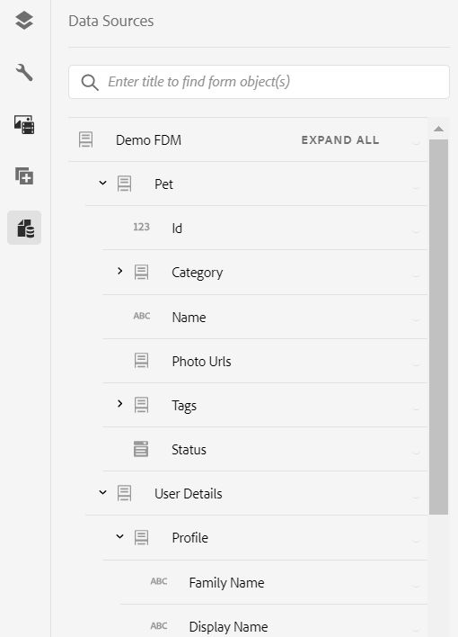

# Usa modello dati modulo (FDM) {#use-form-data-model}

| Versione | Collegamento articolo |
| -------- | ---------------------------- |
| AEM 6.5 | [Fai clic qui](https://experienceleague.adobe.com/docs/experience-manager-65/forms/form-data-model/using-form-data-model.html?lang=it) |
| AEM as a Cloud Service | Questo articolo |

L&#39;integrazione dei dati di [!DNL Experience Manager Forms] consente di utilizzare diverse origini dati back-end per creare un modello dati modulo (FDM) che è possibile utilizzare come schema in vari flussi di lavoro di Forms <!--and interactive communications--> adattivi. Richiede la configurazione delle origini dati e la creazione di un modello dati modulo (FDM) basato su oggetti e servizi del modello dati disponibili nelle origini dati. Per ulteriori informazioni, consulta:

* [Integrazione dei dati di [!DNL Experience Manager Forms]](data-integration.md)
* [Configurare origini dati](configure-data-sources.md)
* [Crea modello dati modulo (FDM)](create-form-data-models.md)
* [Utilizzare il modello dati del modulo (FDM)](work-with-form-data-model.md)

Un modello dati modulo (FDM) è un’estensione dello schema JSON che puoi utilizzare per:

* [Creazione di Forms e frammenti adattivi](#create-af)
  <!--* [Create interactive communications and building blocks like text, list, and condition fragments](#create-ic)-->
* [Anteprima con dati di esempio](#preview-ic)
* [Utilizzo del servizio Modello dati modulo](#prefill)
* [Riscrivere i dati del modulo adattivo inviati nelle origini dati](#write-af)
* [Richiama servizi tramite regole modulo adattivo](#invoke-services)

## Creazione di Forms e frammenti adattivi {#create-af}

È possibile creare [Forms adattivo](creating-adaptive-form.md) e frammenti di moduli adattivi <!-- [Adaptive Form Fragments](adaptive-form-fragments.md) --> in base a un modello di dati del modulo (FDM). Per utilizzare un modello dati modulo (FDM) durante la creazione di un modulo adattivo o di un frammento di modulo adattivo, effettua le seguenti operazioni:

1. Nella scheda Modello modulo della schermata Aggiungi proprietà, selezionare **[!UICONTROL Modello dati modulo]** nell&#39;elenco a discesa **[!UICONTROL Seleziona da]**.

   

2. Selezionare per espandere **[!UICONTROL Seleziona modello dati modulo]**. Sono elencati tutti i modelli dati modulo (FDM) disponibili.

   Seleziona un dal modello dati.

   

3. (**Solo frammenti di moduli adattivi**) È possibile creare un frammento di modulo adattivo basato su un solo oggetto modello dati in un modello dati del modulo (FDM). Espandi il menu a discesa **[!UICONTROL Definizioni modello dati modulo]**. Elenca tutti gli oggetti modello dati nel modello dati modulo (FDM) specificato. Seleziona un oggetto modello dati dall’elenco.

   

   Una volta creato il modulo adattivo o il frammento di modulo adattivo basato su un modello dati modulo (FDM), gli oggetti del modello dati modulo vengono visualizzati nella scheda **[!UICONTROL Origini dati]** del browser Contenuto nel generatore di moduli adattivi.

   >[!NOTE]
   >
   >Per un frammento di modulo adattivo, nella scheda Origini dati vengono visualizzati solo l’oggetto modello dati selezionato al momento dell’authoring e i relativi oggetti modello dati associati.

   

   Per aggiungere campi modulo, puoi trascinare gli oggetti modello dati nel modulo adattivo o nel frammento. I campi modulo aggiunti mantengono le proprietà dei metadati e l’associazione con le proprietà dell’oggetto modello dati. L’associazione assicura che i valori dei campi vengano aggiornati nelle origini dati corrispondenti all’invio del modulo e precompilati al momento del rendering del modulo.

<!-- ## Create interactive communications {#create-ic}

You can create an interactive communication based on a Form Data Model that you can use to prefill interactive communication with data from configured data sources. In addition, the building blocks of an interactive communication, such as text, list, and condition document fragments can be based on a form data model.

You can choose a Form Data Model when creating an interactive communication or a document fragment. The following image shows the General tab of the Create Interactive Communication dialog.

General tab of Create Interactive Communication dialog

For more information, see:

[Create an interactive communication](create-interactive-communication.md)

[Text in Interactive Communications](texts-interactive-communications.md)

[Conditions in Interactive Communications](conditions-interactive-communications.md)

[List fragments](lists.md) -->

## Anteprima con dati di esempio {#preview-ic}

L’editor modello dati modulo consente di generare e modificare dati di esempio per gli oggetti modello dati nel modello dati modulo (FDM). È possibile utilizzare questi dati per visualizzare in anteprima e testare <!--interactive communications and--> Forms adattivo. È necessario generare i dati di esempio prima di visualizzare l&#39;anteprima come descritto in [Utilizzare il modello dati del modulo](work-with-form-data-model.md#sample).

<!--To preview an interactive communication with sample Form Data Model data:

1. On [!DNL  Experience Manager] author instance, navigate to **[!UICONTROL Forms > Forms & Documents]**.
1. Select an interactive communication and select **[!UICONTROL Preview]** in the toolbar to select **[!UICONTROL Web Channel]**, **[!UICONTROL Print Channel]**, or **[!UICONTROL Both Channels]** to preview the interactive communication.
1. In the Preview [*channel*] dialog, ensure that **[!UICONTROL Test Data of Form Data Model]** is selected and select **[!UICONTROL Preview]**.

The interactive communication opens with prefilled sample data.

-->

Per visualizzare in anteprima un modulo adattivo con dati di esempio, apri il modulo adattivo in modalità di creazione e seleziona **[!UICONTROL Anteprima]**.

## Precompilare utilizzando il servizio Modello dati modulo {#prefill}

[!DNL Experience Manager Forms] fornisce il servizio di precompilazione del modello dati del modulo preconfigurato che è possibile abilitare per Forms adattivo <!--and interactive communications--> basato sul modello dati del modulo (FDM). Il servizio di precompilazione interroga le origini dati per gli oggetti modello dati nel modulo adattivo <!--and interactive communication--> e di conseguenza esegue la precompilazione dei dati durante il rendering del modulo o della comunicazione.

Per abilitare il servizio di precompilazione del modello dati del modulo per un modulo adattivo, apri le proprietà del contenitore del modulo adattivo e seleziona **[!UICONTROL servizio di precompilazione del modello dati del modulo]** dall&#39;elenco a discesa **[!UICONTROL Servizio di precompilazione]** nel pannello a soffietto Base. Quindi, salva le proprietà.

<!--To configure Form Data Model prefill service in an interactive communication, you can select Form Data Model Prefill Service in the Prefill Service drop-down while creating it or later by modifying the properties.

Edit Properties dialog for an interactive communication-->

## Scrivere i dati del modulo adattivo inviati nelle origini dati {#write-af}

Quando un utente invia un modulo basato su un modello dati modulo (FDM), è possibile configurare il modulo in modo che scriva i dati inviati per un oggetto modello dati nelle relative origini dati. Per ottenere questo caso d&#39;uso, [!DNL Experience Manager Forms] fornisci [Azione di invio modello dati modulo](configuring-submit-actions.md), disponibile come standard solo per Forms adattivo basato su un modello dati modulo (FDM). Scrive i dati inviati per un oggetto modello dati nella relativa origine dati.

Per configurare l’azione di invio Modello dati modulo:

1. Apri il browser Contenuto e seleziona il componente **[!UICONTROL Contenitore guida]** del modulo adattivo.
1. Fare clic sull&#39;icona delle proprietà del Contenitore Guida TV . Viene visualizzata la finestra di dialogo Contenitore modulo adattivo (Adaptive Form Container).
1. Fare clic sulla scheda **[!UICONTROL Invio]**.
1. Dall&#39;elenco a discesa **[!UICONTROL Azione invio]**, selezionare **[!UICONTROL Invia utilizzando il modello dati modulo]**.

   

1. Specificare il modello dati **[!UICONTROL da inviare]**.
1. Fai clic su **[!UICONTROL Fine]**

All’invio del modulo, i dati per l’oggetto modello dati configurato vengono scritti nella rispettiva origine dati. È inoltre possibile inviare un allegato modulo all&#39;origine dati utilizzando un modello dati modulo (FDM) e un documento di record (DoR). Per informazioni sul modello dati modulo (FDM), vedere [[!DNL AEM Forms] Integrazione dati](data-integration.md).

<!---->

>[!NOTE]
>
> AEM as a Cloud Service offre diverse azioni di invio pronte all’uso per la gestione degli invii di moduli. Ulteriori informazioni su queste opzioni sono disponibili nell&#39;articolo [Azione di invio modulo adattivo](/help/forms/configure-submit-actions-core-components.md).

È inoltre possibile inviare gli allegati del modulo a un&#39;origine dati utilizzando la proprietà dell&#39;oggetto modello dati binario. Per inviare allegati a un&#39;origine dati JDBC, effettuare le seguenti operazioni:

1. Aggiungi un oggetto modello dati che include una proprietà binaria al modello dati del modulo (FDM).
1. Nel modulo adattivo, trascina il componente **[!UICONTROL File allegato]** dal browser Componenti al modulo adattivo.
1. Seleziona per selezionare il componente aggiunto e seleziona  per aprire il browser Proprietà del componente.
1. Nel campo Riferimento binding, selezionare  e passare alla selezione della proprietà binaria aggiunta nel modello dati del modulo (FDM). Configura altre proprietà, a seconda delle necessità.

   Seleziona  per salvare le proprietà. Il campo dell&#39;allegato è ora associato alla proprietà binaria del modello dati del modulo (FDM).

1. Nella sezione Invio delle proprietà Contenitore modulo adattivo, abilita **[!UICONTROL Invia allegati modulo]**. Invia l’allegato nel campo della proprietà binaria all’origine dati al momento dell’invio del modulo.

## Richiama servizi in Adaptive Forms utilizzando le regole {#invoke-services}

In un modulo adattivo basato su un modello dati modulo è possibile [creare regole](rule-editor.md) per richiamare i servizi configurati nel modello dati modulo. L&#39;operazione **[!UICONTROL Richiama servizi]** in una regola elenca tutti i servizi disponibili nel modello di dati del modulo (FDM) e consente di selezionare i campi di input e output per il servizio. È inoltre possibile utilizzare il tipo di regola **[!UICONTROL Imposta valore]** per richiamare un servizio Modello dati modulo e impostare il valore di un campo sull&#39;output restituito dal servizio.

Ad esempio, la regola seguente richiama un servizio get che utilizza come input l&#39;ID dipendente e i valori restituiti vengono inseriti nei campi ID dipendente, Cognome, Nome e Genere corrispondenti nel modulo.

È inoltre possibile utilizzare l&#39;API `guidelib.dataIntegrationUtils.executeOperation` per scrivere un JavaScript nell&#39;editor di codice per l&#39;editor di regole. <!-- For API details, see [API to invoke Form Data Model service](invoke-form-data-model-services.md).-->

### Richiama un modello dati modulo (FDM) utilizzando funzioni personalizzate {#invoke-form-data-model-using-custom-functions}

È possibile [richiamare un modello dati modulo dall&#39;editor regole utilizzando funzioni personalizzate](/help/forms/rule-editor.md#custom-functions-in-rule-editor-custom-functions). Per richiamare il modello dati del modulo (FDM), aggiungi un modello dati del modulo al inserisco nell&#39;elenco Consentiti di. Per aggiungere un modello dati modulo a un elenco Consentiti:

1. Passa alla console Web di Experience Manager all&#39;indirizzo `https://server:host/system/console/configMgr`.
1. Individua **[!UICONTROL Inserimento in whitelist a livello di modulo adattivo del modello dati del modulo per chiamata di servizio - Configuration Factory]**.
1. Fai clic sull&#39;icona  per aggiungere la configurazione.
1. Aggiungi **[!UICONTROL Schema percorso contenuto]** per specificare il percorso del Forms adattivo.  Per impostazione predefinita, il valore è `/content/forms/af/(.*)`, che include tutti i Forms adattivi. Puoi anche specificare il percorso per un modulo adattivo specifico.
1. Aggiungi **[!UICONTROL Modello dati modulo pattern]** per specificare il percorso del modello dati modulo (FDM). Per impostazione predefinita, il valore è `/content/dams/formsanddocuments-fdm/(.*)`, che include tutto il modello dati del modulo (FDM). È inoltre possibile specificare il percorso per un modello di dati modulo (FDM) specifico.
1. Salva le impostazioni.

La configurazione aggiunta viene salvata nell&#39;inserimento nella whitelist a livello di modulo adattivo del modello dati del modulo per chiamata di servizio - Configuration Factory **[!UICONTROL .]**

>[!VIDEO](https://video.tv.adobe.com/v/3423977/adaptive-forms-custom-function-rule-editor)

>[!NOTE]
>
> Per richiamare un modello dati modulo (FDM) dall’editor di regole utilizzando funzioni personalizzate tramite un progetto di archetipo AEM:
>
>1. [Crea un file di configurazione](https://github.com/adobe/aem-core-forms-components/blob/master/it/config/src/main/content/jcr_root/apps/system/config/com.adobe.aemds.guide.factory.impl.AdaptiveFormFDMConfigurationFactoryImpl~core-components-it.cfg.json).
>1. Imposta le proprietà di getContentPathPattern e getFormDataModelPathPattern.
>1. Distribuisci il progetto.

## Articoli correlati

{{af-submit-action}}

