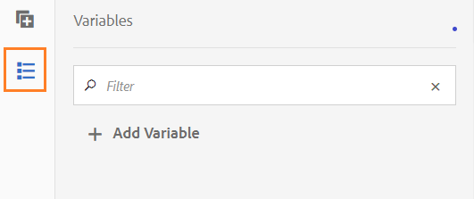

# Variabili nei flussi di lavoro AEM incentrati su Forms {#variables-in-aem-forms-workflows}

| Versione | Collegamento articolo |
| -------- | ---------------------------- |
| AEM 6.5 | [Fai clic qui](https://experienceleague.adobe.com/docs/experience-manager-65/forms/workflows/variable-in-aem-workflows.html) |
| AEM as a Cloud Service | Questo articolo |

Una variabile in un modello di flusso di lavoro è un modo per memorizzare un valore in base al relativo tipo di dati. Puoi utilizzare il nome della variabile in qualsiasi passaggio del flusso di lavoro per recuperare il valore memorizzato nella variabile. È inoltre possibile utilizzare i nomi delle variabili per definire le espressioni per l&#39;adozione delle decisioni di instradamento.

Nei modelli di flusso di lavoro dell’AEM puoi effettuare le seguenti operazioni:

* [Creare una variabile](variable-in-aem-workflows.md#create-a-variable) di un tipo di dati in base al tipo di informazioni che si desidera memorizzare.
* [Imposta un valore per la variabile](variable-in-aem-workflows.md#set-a-variable) mediante il passaggio del flusso di lavoro Imposta variabile.
* [Utilizzare la variabile](variable-in-aem-workflows.md#use-a-variable) in tutto [!DNL AEM Forms] Passaggi del flusso di lavoro per recuperare il valore memorizzato e nei passi OR Split e Goto per definire un’espressione di indirizzamento.

Il video seguente illustra come creare, impostare e utilizzare le variabili nei modelli di flussi di lavoro AEM:

>[!VIDEO](assets/variables_introduction_1_1.mp4)

Le variabili sono un&#39;estensione del [MetaDataMap](https://helpx.adobe.com/experience-manager/6-5/sites/developing/using/reference-materials/javadoc/com/adobe/granite/workflow/metadata/MetaDataMap.html) di rete. È possibile utilizzare [MetaDataMap](https://helpx.adobe.com/experience-manager/6-5/sites/developing/using/reference-materials/javadoc/com/adobe/granite/workflow/metadata/MetaDataMap.html) in ECMAScript per accedere ai metadati salvati utilizzando variabili.

## Creare una variabile {#create-a-variable}

Puoi creare le variabili utilizzando la sezione Variabili disponibile nella barra laterale del modello di flusso di lavoro. Le variabili del flusso di lavoro dell’AEM supportano i seguenti tipi di dati:

* **Tipi di dati di base**: Long, Double, Boolean, Date e String
* **Tipi di dati complessi**: [Documento](https://helpx.adobe.com/experience-manager/6-5/forms/javadocs/com/adobe/aemfd/docmanager/Document.html), [XML](https://docs.oracle.com/javase/8/docs/api/org/w3c/dom/Document.html), [JSON](https://static.javadoc.io/com.google.code.gson/gson/2.3/com/google/gson/JsonObject.html), e l’istanza del modello dati modulo.

>[!NOTE]
>
>I flussi di lavoro supportano solo il formato ISO8601 per le variabili di tipo Data.

Utilizzare il tipo di dati ArrayList per creare raccolte di variabili. È possibile creare una variabile ArrayList per tutti i tipi di dati primitivi e complessi. Ad esempio, creare una variabile ArrayList e selezionare Stringa come sottotipo per memorizzare più valori stringa utilizzando la variabile.

Per creare una variabile:

1. In un’istanza AEM, passa a Strumenti  > Workflow > Modelli.
1. Seleziona **[!UICONTROL Crea]** e specifica il titolo e un nome facoltativo per il modello di flusso di lavoro. Seleziona il modello e seleziona **[!UICONTROL Modifica]**.
1. Seleziona l’icona delle variabili disponibile nella barra laterale del modello di flusso di lavoro e seleziona **[!UICONTROL Aggiungi variabile]**.

   

1. Nella finestra di dialogo Aggiungi variabile, specifica il nome e seleziona il tipo di variabile.
1. Seleziona il tipo di dati dalla **[!UICONTROL Tipo]** e specificare i seguenti valori:

   * Tipo di dati primitivo: specifica un valore predefinito facoltativo per la variabile.
   * JSON o XML: specifica un percorso JSON o schema XML facoltativo. Il sistema convalida il percorso dello schema durante la mappatura e l&#39;archiviazione delle proprietà disponibili in questo schema in un&#39;altra variabile.
   * Modello dati modulo: specifica un percorso per il modello dati modulo.
   * ArrayList - Specificare un sottotipo per la raccolta.

1. Specifica una descrizione facoltativa per la variabile e seleziona  per salvare le modifiche. La variabile viene visualizzata nell’elenco disponibile nel riquadro a sinistra.

Quando crei delle variabili, prendi in considerazione le seguenti procedure:

* Crea tutte le variabili necessarie per un flusso di lavoro. Tuttavia, per conservare le risorse del database, utilizza il numero minimo di variabili richieste e, se possibile, riutilizza le variabili.
* Per le variabili viene fatta distinzione tra maiuscole e minuscole. Assicurati di fare riferimento alle variabili utilizzando la stessa maiuscola/minuscola nel flusso di lavoro.
* Evita di usare caratteri speciali nel nome della variabile

## Imposta una variabile {#set-a-variable}

È possibile utilizzare il passo Imposta variabile per impostare il valore di una variabile e definire l&#39;ordine in cui i valori vengono impostati. La variabile viene impostata nell’ordine in cui le mappature delle variabili sono elencate nel passaggio Imposta variabile.

Le modifiche ai valori delle variabili influiscono solo sull&#39;istanza del processo in cui si verifica la modifica. Ad esempio, quando viene avviato un flusso di lavoro e i dati delle variabili cambiano, le modifiche influiscono solo su tale istanza del flusso di lavoro. Le modifiche non influiscono su altre istanze del flusso di lavoro avviate in precedenza o in un secondo momento.

A seconda del tipo di dati della variabile, puoi utilizzare le seguenti opzioni per impostare il valore di una variabile:

* **Valore letterale:** Utilizza l’opzione quando conosci il valore esatto da specificare. È inoltre possibile utilizzare l’opzione per specificare un JSON sotto forma di stringa.

* **Espressione:** Utilizza l’opzione quando il valore da utilizzare viene calcolato in base a un’espressione. L’espressione viene creata nell’editor di espressioni fornito.

* **Notazione in punti JSON:** Utilizza l’opzione per recuperare un valore da una variabile di tipo JSON o FDM.
* **XPATH:** Utilizzare l&#39;opzione per recuperare un valore da una variabile di tipo XML.

* **Relativo al payload:** Utilizza l’opzione quando il valore da salvare nella variabile è disponibile in un percorso relativo al payload.

* **Percorso assoluto:** Utilizza l’opzione quando il valore da salvare nella variabile è disponibile in un percorso assoluto.

È inoltre possibile aggiornare elementi specifici di una variabile di tipo JSON o XML utilizzando la notazione JSON DOT o XPATH.

### Aggiungi mappatura tra variabili {#add-mapping-between-variables}

Per aggiungere la mappatura tra le variabili:

1. Nella pagina di modifica del flusso di lavoro, seleziona l’icona Passaggi disponibile nella barra laterale del modello di flusso di lavoro.
1. Trascina la selezione **[!UICONTROL Imposta variabile]** passa all’editor del flusso di lavoro, seleziona il passaggio e fai clic su  (Configura).
1. Nella finestra di dialogo Imposta variabile, seleziona **[!UICONTROL Mappatura]** > **[!UICONTROL Aggiungi mappatura]**.
1. In **Mappa variabile** , selezionare la variabile per la memorizzazione dei dati, selezionare la modalità di mappatura e specificare un valore da memorizzare nella variabile. Le modalità di mappatura variano in base al tipo di variabile.
1. Mappa più variabili per creare un’espressione significativa. Seleziona  per salvare le modifiche.

### Esempio 1: eseguire una query su una variabile XML per impostare il valore per una variabile stringa {#example-query-an-xml-variable-to-set-value-for-a-string-variable}

Selezionare una variabile di tipo XML per memorizzare un file XML. Eseguire una query sulla variabile XML per impostare il valore di una variabile stringa per la proprietà disponibile nel file XML. Utilizzare **Specifica XPATH per la variabile XML** per definire la proprietà da memorizzare nella variabile stringa.

In questo esempio, seleziona un **formdata** Variabile XML in cui memorizzare **cc-app.xml** file. Eseguire una query su **formdata** variabile per impostare il valore per **indirizzo e-mail** variabile stringa per memorizzare il valore per **emailAddress** proprietà disponibile in **cc-app.xml** file.

>[!VIDEO](https://helpx.adobe.com/content/dam/help/en/experience-manager/6-5/forms/using/set_variable_example1.mp4 "Imposta il valore di una variabile")

### Esempio 2: utilizzare un’espressione per memorizzare un valore basato su altre variabili {#example2}

Utilizza un’espressione per calcolare la somma delle variabili e memorizzare il risultato in una variabile.

In questo esempio, utilizza l’editor espressioni per definire un’espressione per calcolare la somma di **assetscost** e **balanceamount** e archiviare il risultato in **totalvalue** variabile.

>[!VIDEO](https://helpx.adobe.com/content/dam/help/en/experience-manager/6-5/forms/using/variables_expression.mp4)

## Utilizza editor di espressioni {#use-expression-editor}

Puoi anche utilizzare le espressioni per calcolare il valore di una variabile in fase di esecuzione. Le variabili forniscono un editor di espressioni per definire le espressioni.

Utilizza l’editor di espressioni per:

* Imposta il valore delle variabili utilizzando altre variabili del flusso di lavoro, numeri o espressioni matematiche.
* Utilizzare variabili del flusso di lavoro, stringhe, numeri o espressioni all’interno di un’espressione matematica
* Aggiungi condizioni per impostare i valori delle variabili.
* Aggiungi operatori tra condizioni.


Si basa sull’editor di regole di Forms adattivo con le seguenti modifiche. Editor regole nelle variabili:

* Non supporta funzioni.
* Non fornisce un’interfaccia utente per visualizzare il riepilogo delle regole
* Non dispone di editor di codice.
* Non supporta l&#39;abilitazione e la disabilitazione del valore di un oggetto.
* Non supporta l&#39;impostazione della proprietà di un oggetto.
* Non supporta la chiamata di un servizio web.

Per ulteriori informazioni, consulta [Editor regole di Forms adattivo](rule-editor.md).

## Utilizza una variabile {#use-a-variable}

È possibile utilizzare le variabili per recuperare input e output o salvare il risultato di un passaggio. L’editor del flusso di lavoro fornisce due tipi di passaggi del flusso di lavoro:

* Passaggi del flusso di lavoro con supporto per le variabili
* Passaggi del flusso di lavoro senza supporto per le variabili

### Passaggi del flusso di lavoro con supporto per le variabili {#workflow-steps-with-support-for-variables}

Passaggio Vai a, Passaggio di suddivisione OR e tutto [!DNL AEM Forms] I passaggi del flusso di lavoro supportano le variabili.

#### O Dividi passaggio {#or-split-step}

La suddivisione OR crea una suddivisione nel flusso di lavoro, dopo la quale è attivo un solo ramo. Questo passaggio ti consente di introdurre nel flusso di lavoro i percorsi di elaborazione condizionale. Puoi aggiungere i passaggi del flusso di lavoro a ogni ramo in base alle esigenze.

È possibile definire un&#39;espressione di indirizzamento per un ramo utilizzando una definizione di regola, uno script ECMA o uno script esterno.

È possibile utilizzare le variabili per definire l’espressione di indirizzamento utilizzando l’editor di espressioni. Per ulteriori informazioni sull&#39;utilizzo delle espressioni di instradamento per la fase di suddivisione OR, vedere [O Dividi passaggio](https://experienceleague.adobe.com/docs/experience-manager-65/developing/extending-aem/extending-workflows/workflows-step-ref.html#extending-aem#or-split).

In questo esempio, prima di definire l&#39;espressione di instradamento, utilizzate [esempio 2](variable-in-aem-workflows.md#example2) per impostare il valore per **totalvalue** variabile. Il ramo 1 è attivo se il valore della proprietà **totalvalue** è maggiore di 50000. Allo stesso modo, puoi definire una regola per rendere attivo il Ramo 2 se il valore di **totalvalue** è minore di 50000.

>[!VIDEO](https://helpx.adobe.com/content/dam/help/en/experience-manager/6-5/forms/using/variables_orsplit_example.mp4)

Analogamente, selezionate un percorso di script esterno o specificate lo script ECMA per instradare le espressioni per valutare il ramo attivo. Seleziona **[!UICONTROL Rinomina ramo]** per specificare un nome alternativo per la filiale.

<!-- For more examples, see [Create a workflow model](aem-forms-workflow.md#create-a-workflow-model). -->

#### Vai al passaggio {#go-to-step}

Il **Vai al passaggio** consente di specificare il passaggio successivo nel modello di flusso di lavoro da eseguire, a seconda del risultato di un&#39;espressione di instradamento.

Analogamente alla fase di suddivisione OR, potete definire l&#39;espressione di indirizzamento per la fase Vai a (Goto) utilizzando una definizione di regola, uno script ECMA o uno script esterno.

È possibile utilizzare le variabili per definire l’espressione di indirizzamento utilizzando l’editor di espressioni. Per ulteriori informazioni sull&#39;utilizzo delle espressioni di instradamento per la fase Vai a, vedere [Vai al passaggio](https://experienceleague.adobe.com/docs/experience-manager-65/developing/extending-aem/extending-workflows/workflows-step-ref.html#extending-aem#goto-step).


In questo esempio, il passo Vai a specifica il passo successivo Verifica richiesta carta di credito se il valore per **azione intrapresa** la variabile è uguale a **Ulteriori informazioni necessarie**.

Per ulteriori esempi sull&#39;utilizzo della definizione delle regole nel passaggio Vai a, vedi [Simulazione di un ciclo For](https://experienceleague.adobe.com/docs/experience-manager-65/developing/extending-aem/extending-workflows/workflows-step-ref.html#extending-aem#simulateforloop).

#### Passaggi del flusso di lavoro incentrati su Forms {#forms-workflow-centric-workflow-steps}

Tutti [!DNL AEM Forms] I passaggi del flusso di lavoro supportano le variabili. Per ulteriori informazioni, consulta [Flusso di lavoro incentrato su Forms su OSGi](aem-forms-workflow-step-reference.md).

### Passaggi del flusso di lavoro senza supporto per le variabili {#workflow-steps-without-support-for-variables}

È possibile utilizzare [MetaDataMap](https://helpx.adobe.com/experience-manager/6-5/sites/developing/using/reference-materials/javadoc/com/adobe/granite/workflow/metadata/MetaDataMap.html) per accedere alle variabili nei passaggi del flusso di lavoro che non supportano le variabili.

#### Recupera il valore della variabile {#retrieve-the-variable-value}

Utilizza le seguenti API nello script ECMA per recuperare i valori per le variabili esistenti in base al tipo di dati:

| Tipo di dati variabile | API |
|---|---|
| Primitiva (Long, Double, Boolean, Date e String) | workItem.getWorkflowData().getMetaDataMap().get(variableName, type) |
| Documento | Packages.com.adobe.aemfd.docmanager.Document doc = workItem.getWorkflowData().getMetaDataMap().get(&quot;docVar&quot;, Packages.com.adobe.aemfd.docmanager.Document.class); |
| XML | Packages.org.w3c.dom.Document xmlObject = workItem.getWorkflowData().getMetaDataMap().get(variableName, Packages.org.w3c.dom.Document.class); |
| Modello dati modulo | Packages.com.adobe.aem.dermis.api.FormDataModelInstance fdmObject = workItem.getWorkflowData().getMetaDataMap().get(variableName, Packages.com.adobe.aem.dermis.api.FormDataModelInstance.class); |
| JSON | Packages.com.google.gson.JsonObject jsonObject = workItem.getWorkflowData().getMetaDataMap().get(variableName, Packages.com.google.gson.JsonObject.class); |


**Esempio**

Recupera il valore del tipo di dati stringa utilizzando la seguente API:

```javascript
workItem.getWorkflowData().getMetaDataMap().get(accname, Packages.java.lang.String)
```

#### Aggiornare il valore della variabile {#update-the-variable-value}

Utilizza la seguente API nello script ECMA per aggiornare il valore di una variabile:

```javascript
workItem.getWorkflowData().getMetaDataMap().put(variableName, value)
```

**Esempio**

```javascript
workItem.getWorkflowData().getMetaDataMap().put(salary, 50000)
```

Aggiorna il valore della proprietà **stipendio** variabile da 50000.

### Impostare le variabili per richiamare i flussi di lavoro {#apiinvokeworkflow}

Puoi utilizzare un’API per impostare le variabili e trasmetterle alle istanze del flusso di lavoro.

[workflowSession.startWorkflow](https://helpx.adobe.com/experience-manager/6-5/sites/developing/using/reference-materials/javadoc/com/adobe/granite/workflow/WorkflowSession.html#startWorkflow-com.adobe.granite.workflow.model.WorkflowModel-com.adobe.granite.workflow.exec.WorkflowData-java.util.Map-) utilizza model, wfData e metaData come argomenti. Utilizza MetaDataMap per impostare il valore della variabile.

In questa API, il **variableName** variabile impostata su **valore** utilizzando metaData.put(variableName, value);

```javascript
import com.adobe.granite.workflow.model.WorkflowModel;
import com.adobe.granite.workflow.metadata.MetaDataMap;
import com.adobe.aemfd.docmanager.Document;

/*Assume that you already have a workflowSession and modelId along with the payloadType and payload*/
WorkflowData wfData = workflowSession.newWorkflowData(payloadType, payload);
MetaDataMap metaData = wfData.getMetaDataMap();
metaData.put(variableName, value); //Create a variable "variableName" in your workflow model
WorkflowModel model = workflowSession.getModel(modelId);
workflowSession.startWorkflow(model, wfData, metaData);
```

**Esempio**

Inizializzare **doc** oggetto documento su un percorso (&quot;a/b/c&quot;) e impostare il valore del **docVar** al percorso memorizzato nell&#39;oggetto documento.

```javascript
import com.adobe.granite.workflow.WorkflowSession;
import com.adobe.granite.workflow.exec.WorkflowData;
import com.adobe.granite.workflow.model.WorkflowModel;
import com.adobe.granite.workflow.metadata.MetaDataMap;
import com.adobe.aemfd.docmanager.Document;

/*This example assumes that you already have a workflowSession and modelId along with the payloadType and payload */
WorkflowData wfData = workflowSession.newWorkflowData(payloadType, payload);
MetaDataMap metaData = wfData.getMetaDataMap();
Document doc = new Document("/a/b/c");// initialize a document object
metaData.put("docVar",doc); //Assuming that you have created a variable "docVar" of type Document in your workflow model
WorkflowModel model = workflowSession.getModel(modelId);
workflowSession.startWorkflow(model, wfData, metaData);
```

## Modificare una variabile {#edit-a-variable}

1. Nella pagina Modifica flusso di lavoro, seleziona l’icona Variabili disponibile nella barra laterale del modello di flusso di lavoro. La sezione Variabili nel riquadro a sinistra visualizza tutte le variabili esistenti.
1. Seleziona la  (Modifica) accanto al nome della variabile da modificare.
1. Modifica le informazioni sulla variabile e seleziona  per salvare le modifiche. Impossibile modificare il **[!UICONTROL Nome]** e **[!UICONTROL Tipo]** campi per una variabile.

## Eliminare una variabile {#delete-a-variable}

Prima di eliminare la variabile, rimuovi tutti i riferimenti della variabile dal flusso di lavoro. Assicurati che la variabile non venga utilizzata nel flusso di lavoro.

Per eliminare una variabile:

1. Nella pagina Modifica flusso di lavoro, seleziona l’icona Variabili disponibile nella barra laterale del modello di flusso di lavoro. La sezione Variabili nel riquadro a sinistra visualizza tutte le variabili esistenti.
1. Seleziona l’icona Elimina accanto al nome della variabile da eliminare.
1. Seleziona  per confermare ed eliminare la variabile.

## Riferimenti {#references}

Per ulteriori esempi sull’utilizzo delle variabili in [!DNL AEM Forms] Passaggi del flusso di lavoro, vedi [Variabili nei flussi di lavoro AEM](https://helpx.adobe.com/experience-manager/kt/forms/using/authoring_variables_in_aem_forms-workflow1.html).
