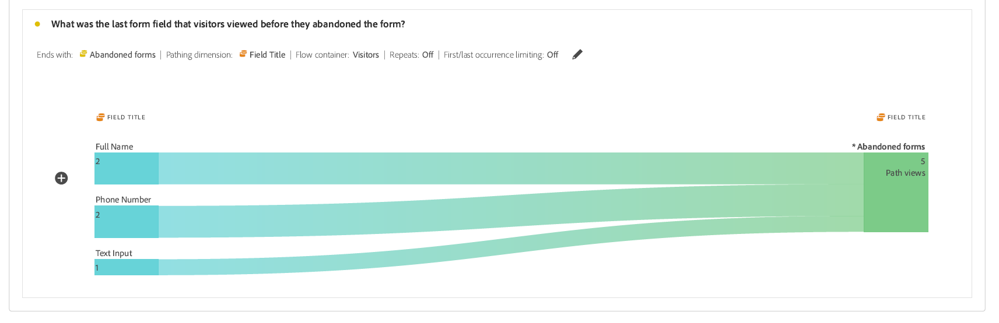

# Visualizzazione e comprensione dei rapporti di analisi adattiva di Forms {#viewing-and-understanding-aem-forms-analytics-reports}

| Versione | Collegamento articolo |
| -------- | ---------------------------- |
| AEM as a Cloud Service | Questo articolo |
| AEM 6.5 | [Fai clic qui](https://experienceleague.adobe.com/docs/experience-manager-65/forms/integrate-aem-forms-with-experience-cloud-solutions/view-understand-aem-forms-analytics-reports.html) |

Nel panorama in rapida evoluzione dell’analisi digitale, è fondamentale rimanere in sintonia con le tendenze globali per prendere decisioni informate e ottimizzare le esperienze digitali. Per risolvere questo problema, Forms adattivo si integra perfettamente con Adobe Analytics per acquisire e tenere traccia delle metriche delle prestazioni per i moduli e i documenti pubblicati. L’obiettivo alla base dell’analisi di queste metriche è prendere decisioni basate sui dati, utilizzando metriche e analisi per migliorare l’usabilità e l’efficacia dei moduli.

Acquisendo e tenendo traccia degli indicatori di prestazioni chiave, le aziende possono individuare aree di miglioramento, ottimizzare le esperienze utente e, in ultima analisi, ottenere risultati migliori per creare esperienze cliente eccezionali.

## Configurare Adobe Analytics per Adaptive Forms {#setup-adobe-analytics-to-aem-forms}

Per il rapporto di AEM Forms Analytics, devi innanzitutto integrare Adobe Analytics in AEM Forms tramite Experience Cloud Setup Automation. Experience Cloud Setup Automation in Adaptive Forms richiede una licenza Adobe Analytics, Data Collection (in precedenza Adobe Launch) per gestire gli script di tracciamento e l’integrazione con l’API Experience Platform Launch per l’aggregazione dati semplificata e la generazione di informazioni. Visita [Abilita Adobe Analytics per un modulo adattivo tramite Experience Cloud Setup Automation](/help/forms/enable-adobe-analytics-adaptive-form-using-experience-cloud-setup-automation.md) per informazioni complete sulla configurazione.

## Visualizzare il rapporto di Adaptive Forms Adobe Analytics {#view-adobe-analytics-report}

1. Nell&#39;istanza di AEM, vai a **[!UICONTROL Forms]** >> **[!UICONTROL Forms e documento]**.
1. Seleziona il modulo, vedrai che Adobe Analytics è integrato come mostrato a sinistra, nel Forms attivato per Adobe Analytics.

   {width="100%"}

1. Fai clic su **Adobe Analytics** per visualizzare il tuo report e analizzare i dati sulle prestazioni.

## Rapporto di analisi di Adaptive Forms {#understanding-aem-forms-analytics-reports}

Adobe Analytics offre una gamma completa di metriche delle prestazioni di Adaptive Forms progettate per fornire informazioni preziose sull’utilizzo dei moduli. Queste metriche sono:

### **Come stanno andando le prestazioni di Adaptive Forms?** {#how-your-adaptive-form-is-performing}

Contiene le metriche Rendering moduli, Invio moduli, Errori di convalida e Visitatori univoci, che consentono di valutare l’utilizzo e l’efficacia dei moduli:

* **Rappresentazioni modulo**: le rappresentazioni del modulo mostrano il numero di volte in cui il modulo è stato sottoposto a rendering o aperto.

* **Invii di moduli**: gli invii di moduli indicano quante volte i moduli adattivi sono stati completati e inviati correttamente dagli utenti.

* **Errori di convalida**: l&#39;errore di convalida visualizza il numero totale di errori correlati alla convalida che si sono verificati nei campi dei moduli.

* **Visitatori univoci**: i visitatori univoci rappresentano il numero di volte in cui un visitatore esegue il rendering del modulo. Per ulteriori informazioni sui visitatori univoci, vedi [Visitatori univoci, visite e comportamento del cliente](https://experienceleague.adobe.com/docs/analytics/components/metrics/visits.html).

  {width="100%"}

### **Visitatori ai moduli** {#visitors-to-your-forms}

Consente di ottenere informazioni utili sull’attività del visitatore nei moduli:

* **Visite e invii**: descrive la frequenza delle visite ai moduli in un intervallo di date e il numero corrispondente di invii di moduli. Per ulteriori informazioni, fai clic su [Visite](https://experienceleague.adobe.com/docs/analytics/components/metrics/visits.html).
* **Visitatori unici e relativo totale di visite**: distingue tra utenti nuovi e utenti di ritorno. Ad esempio, un visitatore può visitare il tuo sito ogni giorno per un mese, ma continua a contare come un singolo visitatore univoco. Visita [Visitatori univoci](https://experienceleague.adobe.com/docs/analytics/components/metrics/unique-visitors.html) per informazioni dettagliate.

  {width="100%"}

### **Tipo di dispositivo** {#device-type}

Tipo di dispositivo consente di identificare il tipo di dispositivo utilizzato per accedere ai moduli. Classifica il tipo di dispositivo come Tipo di dispositivo mobile. Ad esempio, in questo caso, è Tipo di dispositivo mobile: Altro e Tipo di dispositivo mobile: Telefono cellulare. I vari tipi di dispositivi mobili includono telefono cellulare, tablet, lettore multimediale, console di gioco e altro ancora.

{width="100%"}

### **Suddivisione geografica** {#geographical-breakdown}

Mostra la posizione da cui si accede a Forms. Fornisce informazioni specifiche per l&#39;area geografica degli utenti del modulo. Ad esempio, è possibile vedere che un utente del modulo include informazioni specifiche per l&#39;area geografica dell&#39;India, come illustrato nell&#39;immagine.

{width="100%"}

### **Principali origini del traffico e moduli popolari** {#top-sources-of-traffic-and-popular-forms}

In questo modo è possibile identificare l&#39;origine primaria o il collegamento da cui si fa riferimento ai moduli. Ad esempio, nell&#39;immagine seguente sono presenti istanze di ricerca per i moduli adattivi in cui il 18,9% è **Digitato/Contrassegnato con segnalibro**, il 70,49% è basato su **Motori di ricerca** e il 24% proviene da **Altri siti Web**. Puoi definire gli elementi dimensionali in base alle tue esigenze. Inoltre, puoi individuare i moduli più visitati o più popolari.

{width="100%"}

### **Attività utente nei primi moduli** {#user-activity-on-top-forms}

Una visualizzazione completa del coinvolgimento degli utenti con visite sul campo, rappresentazioni dei moduli, errori di convalida, moduli abbandonati e invii di moduli fornisce informazioni approfondite sui moduli più attivi. Nell’immagine riportata di seguito, puoi vedere che il modulo di richiesta è il più attivo in base alle metriche Evento modulo.

{width="100%"}

### **Timeline per il tempo trascorso sui moduli** {#timeline-for-time-spent-on-forms}

È il tempo che gli utenti dedicano ai moduli nel tempo che consente di identificare i pattern di coinvolgimento.

{width="100%"}

### **Aree in cui i visitatori richiedono assistenza per la compilazione del modulo** {#areas-requiring-assistance}

Metriche quali visualizzazioni dell’Aiuto, errori di convalida e visite sul campo rivelano dove gli utenti hanno bisogno di assistenza o come possiamo tracciare gli errori nei campi. Nell&#39;immagine seguente, ad esempio, viene visualizzato in un modulo con campi quali **Nome completo**, **Numero di telefono**, **DoB**. Il campo **Nome completo** contiene 12 visite, su 12 visite 8 visite contengono un errore di convalida e 1 icona di aiuto su cui è stato fatto clic per visualizzare la Guida in linea relativa a questo campo. Puoi visualizzare i dati delle metriche per altri campi modulo.

{width="100%"}

### **Ultimo campo modulo visualizzato dai visitatori prima dell&#39;abbandono del modulo** {#last-form-field-that-visitors-viewed}

Consente di analizzare i campi del modulo in cui gli utenti hanno trascorso del tempo prima di abbandonare il modulo. Ad esempio, nell&#39;immagine seguente, su 5 moduli abbandonati, due sono rimasti nel campo **Nome completo**, due nel campo **Numero di telefono** e uno nel campo **Input testo**.

{width="100%"}

## Consulta anche {#see-also}

* [Abilitare Adobe Analytics per un modulo adattivo tramite Experience Cloud Setup Automation](/help/forms/enable-adobe-analytics-adaptive-form-using-experience-cloud-setup-automation.md)
* [Aggiungere un modulo adattivo a una pagina o a un frammento di esperienza di AEM Sites](/help/forms/create-or-add-an-adaptive-form-to-aem-sites-page.md)
* [Integrare AEM Forms con Adobe Analytics](/help/forms/integrate-aem-forms-with-adobe-analytics.md)
