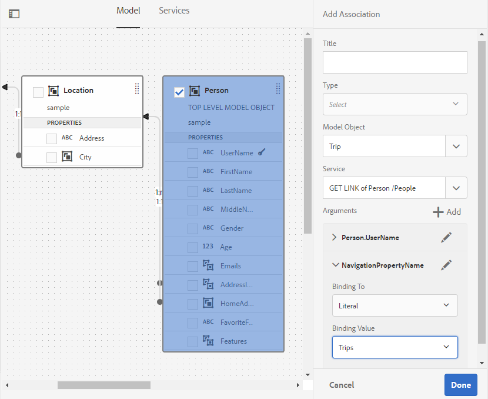

# Utilizzare il modello dati del modulo {#work-with-form-data-model}

| Versione | Collegamento articolo |
| -------- | ---------------------------- |
| AEM 6.5 | [Fai clic qui](https://experienceleague.adobe.com/docs/experience-manager-65/forms/form-data-model/work-with-form-data-model.html?lang=it) |
| AEM as a Cloud Service | Questo articolo |


L’editor FDM (Form Data Model) fornisce un’interfaccia utente e strumenti intuitivi per la modifica e la configurazione di un modello dati modulo (FDM). Utilizzando l’editor, puoi aggiungere e configurare oggetti, proprietà e servizi del modello dati dalle origini dati associate nel modello dati del modulo (FDM). Inoltre, consente di creare oggetti e proprietà del modello dati senza origini dati e di associarli successivamente ai rispettivi oggetti e proprietà del modello dati. È inoltre possibile generare e modificare dati di esempio per le proprietà dell&#39;oggetto modello dati che è possibile utilizzare per precompilare il Forms adattivo <!--and interactive communications--> durante l&#39;anteprima. Puoi testare gli oggetti e i servizi del modello dati configurati in un modello dati modulo (FDM) per assicurarti che sia correttamente integrato con le origini dati.

Se hai poca esperienza con l’integrazione dei dati in Forms e non hai configurato un’origine dati o creato un modello dati del modulo (FDM), consulta i seguenti argomenti:

* [Integrazione dei dati di [!DNL Experience Manager Forms]](data-integration.md)
* [Configurare origini dati](configure-data-sources.md)
* [Crea modello dati modulo (FDM)](create-form-data-models.md)

Continua a leggere per i dettagli sulle varie attività e configurazioni che puoi eseguire utilizzando l’editor del modello dati modulo.

>[!NOTE]
>
>Per poter creare e utilizzare il modello di dati modulo (FDM) è necessario essere membri sia del gruppo **fdm-author** che del gruppo **forms-user**. Contatta l&#39;amministratore [!DNL Experience Manager] per diventare membro dei gruppi.

## Aggiungere oggetti e servizi del modello dati {#add-data-model-objects-and-services}

Se è stato creato un modello dati modulo (FDM) con origini dati, è possibile utilizzare l&#39;editor modello dati modulo per aggiungere servizi e oggetti modello dati, configurarne le proprietà, creare associazioni tra oggetti modello dati e testare il modello dati modulo (FDM) e i servizi.

È possibile aggiungere oggetti e servizi modello dati da origini dati disponibili nel modello dati modulo (FDM). Gli oggetti modello dati aggiunti vengono visualizzati nella scheda Modello, mentre i servizi aggiunti vengono visualizzati nella scheda Servizi.

Per aggiungere oggetti e servizi del modello dati:

1. Accedi all’istanza di authoring [!DNL Experience Manager], passa a **[!UICONTROL Forms > Integrazioni dati]** e apri il modello dati modulo (FDM) in cui desideri aggiungere oggetti modello dati.
1. Nel riquadro Origini dati espandere Origini dati per visualizzare i servizi e gli oggetti modello dati disponibili.
1. Selezionare gli oggetti e i servizi del modello dati che si desidera aggiungere al modello dati modulo e selezionare **[!UICONTROL Aggiungi selezionati]**.

   

   Servizi e oggetti modello dati selezionati

   Nella scheda **[!UICONTROL Modello]** viene visualizzata una rappresentazione grafica di tutti gli oggetti modello dati e delle relative proprietà aggiunti al modello dati del modulo (FDM). Ogni oggetto modello dati è rappresentato da una casella nel modello dati del modulo (FDM).

   

   Nella scheda **[!UICONTROL Modello]** vengono visualizzati gli oggetti modello dati aggiunti

   >[!NOTE]
   >
   >È possibile tenere e trascinare le caselle degli oggetti modello dati per organizzarle nell&#39;area del contenuto. Tutti gli oggetti modello dati aggiunti nel modello dati modulo (FDM) sono disattivati nel riquadro Origini dati.

   Nella scheda **[!UICONTROL Servizi]** sono elencati i servizi aggiunti.

   

   Nella scheda **[!UICONTROL Servizi]** sono visualizzati i servizi del modello dati

   >[!NOTE]
   >
   >Oltre agli oggetti modello dati e ai servizi, il documento metadati servizio OData include proprietà di navigazione che definiscono l&#39;associazione tra due oggetti modello dati. Per ulteriori informazioni, vedere [Utilizzo delle proprietà di navigazione dei servizi OData](#work-with-navigation-properties-of-odata-services).

1. Seleziona **[!UICONTROL Salva]** per salvare l&#39;oggetto modello modulo.

   >[!NOTE]
   >
   >Puoi richiamare i servizi configurati nella scheda Servizi di un modello dati modulo (FDM) utilizzando le regole del modulo adattivo. I servizi configurati sono disponibili nell&#39;azione Richiama servizi dell&#39;editor di regole Per ulteriori informazioni sull&#39;utilizzo di questi servizi nelle regole dei moduli adattivi, vedere Richiama servizi e Imposta valore delle regole nell&#39;[editor di regole](rule-editor.md).

## Creare oggetti modello dati e proprietà figlio {#create-data-model-objects-and-child-properties}

### Creare oggetti modello dati {#create-data-model-objects}

Sebbene sia possibile aggiungere oggetti modello dati da origini dati configurate, è anche possibile creare oggetti modello dati o entità senza origini dati. È utile in particolare se non hai configurato le origini dati nel modello dati del modulo (FDM).

Per creare un oggetto modello dati senza origini dati:

1. Accedi all’istanza di authoring [!DNL Experience Manager], passa a **[!UICONTROL Forms > Integrazioni dati]** e apri il modello dati modulo (FDM) in cui desideri creare un oggetto o un’entità modello dati.
1. Seleziona **[!UICONTROL Crea entità]**.
1. Nella finestra di dialogo [!UICONTROL Crea modello dati], specifica un nome per l&#39;oggetto modello dati e seleziona **[!UICONTROL Aggiungi]**. Un oggetto modello dati viene aggiunto al modello dati del modulo (FDM). L’oggetto modello dati appena aggiunto non è associato a un’origine dati e non dispone di proprietà come mostrato nell’immagine seguente.

   

Successivamente, puoi aggiungere proprietà secondarie negli oggetti modello dati non associati.

### Aggiungi proprietà figlio {#child-properties}

L’editor modello dati modulo consente di creare proprietà secondarie in un oggetto modello dati. La proprietà creata non è associata ad alcuna proprietà in un&#39;origine dati. In seguito, potrai associare la proprietà figlio a un’altra proprietà nell’oggetto modello dati contenitore.

Per creare una proprietà figlio:

1. In un modello dati modulo, selezionare un oggetto modello dati e selezionare **[!UICONTROL Crea proprietà figlio]**.
1. Nella finestra di dialogo **[!UICONTROL Crea proprietà secondaria]**, specifica un nome e un tipo di dati per la proprietà rispettivamente nei campi **[!UICONTROL Nome]** e **[!UICONTROL Tipo]**. Facoltativamente, puoi specificare un titolo e una descrizione per la proprietà.
1. Abilita Calcolato se la proprietà è una proprietà calcolata. Il valore di una proprietà calcolata viene valutato in base a una regola o a un&#39;espressione. Per ulteriori informazioni, vedere [Modifica proprietà](#properties).
1. Se l’oggetto modello dati è associato a un’origine dati, la proprietà figlio aggiunta viene automaticamente associata alla proprietà dell’oggetto modello dati padre con lo stesso nome e tipo di dati.

   Per associare manualmente una proprietà figlio a una proprietà oggetto modello dati, selezionare l&#39;icona Sfoglia accanto al campo **[!UICONTROL Associa riferimento]**. Nella finestra di dialogo **[!UICONTROL Seleziona oggetto]** sono elencate tutte le proprietà dell&#39;oggetto modello dati padre. Seleziona una proprietà a cui associarti e fai clic sull’icona di spunta. È possibile selezionare solo una proprietà dello stesso tipo di dati della proprietà figlio.

1. Seleziona **[!UICONTROL Fine]** per salvare la proprietà figlio e seleziona **[!UICONTROL Salva]** per salvare il modello dati del modulo. La proprietà figlio viene ora aggiunta all’oggetto modello dati.

Dopo aver creato gli oggetti e le proprietà del modello dati, è possibile continuare a creare il Forms adattivo <!--and interactive communications--> in base al modello dati del modulo (FDM). Successivamente, quando saranno disponibili e configurate le origini dati, sarà possibile associare il modello dati del modulo (FDM) alle origini dati. Il binding viene aggiornato automaticamente nel Forms adattivo associato <!--and interactive communications-->. Per ulteriori informazioni sulla creazione di un Forms adattivo <!--and interactive communications--> tramite il modello dati modulo, vedere [Utilizzare il modello dati modulo](using-form-data-model.md).

### Associare oggetti e proprietà del modello dati {#bind-data-model-objects-and-properties}

Quando le origini dati che si desidera integrare con il modello dati modulo sono disponibili, è possibile aggiungerle al modello dati modulo come descritto in [Aggiorna origini dati](create-form-data-models.md#update). Quindi, per associare gli oggetti e le proprietà del modello di dati non associati, effettua le seguenti operazioni:

1. Nel modello dati del modulo selezionare l&#39;origine dati non associata che si desidera associare a un&#39;origine dati.
1. Seleziona **[!UICONTROL Modifica proprietà]**.
1. Nel riquadro **[!UICONTROL Modifica proprietà]** selezionare l&#39;icona Sfoglia accanto al campo **[!UICONTROL Associazione]**. Viene aperta la finestra di dialogo **[!UICONTROL Seleziona oggetto]** in cui sono elencate le origini dati aggiunte nel modello dati del modulo.

   

1. Espandi la struttura delle origini dati e seleziona un oggetto modello dati da associare, quindi fai clic sull’icona di spunta.
1. Seleziona **[!UICONTROL Fine]** per salvare le proprietà, quindi seleziona **[!UICONTROL Salva]** per salvare il modello dati del modulo. L’oggetto modello dati è ora associato a un’origine dati. L’oggetto modello dati non è più contrassegnato come Non associato.

   

## Configurare i servizi {#configure-services}

Per leggere e scrivere dati per un oggetto modello dati, eseguire le operazioni seguenti per configurare i servizi di lettura e scrittura:

1. Selezionare la casella di controllo nella parte superiore di un oggetto modello dati per selezionarlo e selezionare **[!UICONTROL Modifica proprietà]**.

   

   Modificare le proprietà per configurare i servizi di lettura e scrittura per un oggetto modello dati

   Viene visualizzata la finestra di dialogo [!UICONTROL Modifica proprietà].

   

   Finestra di dialogo Modifica proprietà

   >[!NOTE]
   >
   >Oltre agli oggetti modello dati e ai servizi, il documento metadati servizio OData include proprietà di navigazione che definiscono l&#39;associazione tra due oggetti modello dati. Quando si aggiunge un&#39;origine dati del servizio OData a un modello dati del modulo (FDM), è disponibile un servizio in Modello dati modulo (FDM) per tutte le proprietà di navigazione in un oggetto modello dati. È possibile utilizzare questo servizio per leggere le proprietà di navigazione dell&#39;oggetto modello dati corrispondente.
   >
   >
   >Per ulteriori informazioni sull&#39;utilizzo del servizio, vedere [Utilizzo delle proprietà di navigazione dei servizi OData](#work-with-navigation-properties-of-odata-services).

1. Attiva **[!UICONTROL Oggetto di primo livello]** per specificare se l&#39;oggetto modello dati è un oggetto modello di primo livello.

   Gli oggetti modello dati configurati in un modello dati modulo (FDM) sono disponibili per l’utilizzo nella scheda Oggetti modello dati nel browser Contenuto di un modulo adattivo basato sul modello dati modulo (FDM). Quando si aggiunge un&#39;associazione tra due oggetti modello dati, l&#39;oggetto modello dati a cui si sta effettuando l&#39;associazione è nidificato sotto l&#39;oggetto modello dati a cui si sta associando nella scheda **[!UICONTROL Oggetti modello dati]**. Se il modello dati nidificato è un oggetto di livello principale, verrà visualizzato separatamente anche nella scheda **[!UICONTROL Oggetti modello dati]**. Di conseguenza, vengono visualizzate due voci, una all&#39;interno e un&#39;altra all&#39;esterno della gerarchia nidificata, che potrebbero confondere gli autori del modulo. Per fare in modo che l&#39;oggetto modello dati associato venga visualizzato solo nella gerarchia nidificata, disattivare la proprietà Oggetto di livello superiore.

1. Selezionare i servizi di lettura e scrittura per gli oggetti modello dati selezionati. Vengono visualizzati gli argomenti per i servizi.

   

   Servizi di lettura e scrittura configurati per l&#39;origine dati dipendente

1. Selezionare  per l&#39;argomento del servizio di lettura per [associare l&#39;argomento a un attributo del profilo utente, un attributo di richiesta o un valore letterale](#bindargument) e specificare il valore di associazione.
1. Seleziona **[!UICONTROL Fine]** per salvare l&#39;argomento, **[!UICONTROL Fine]** per salvare le proprietà, quindi **[!UICONTROL Salva]** per salvare il modello di dati del modulo.

### Associa argomenti servizio di lettura {#bindargument}

Associare l&#39;argomento del servizio di lettura a un attributo del profilo utente, a un attributo della richiesta o a un valore letterale basato su un valore di associazione. Il valore viene passato al servizio come argomento per recuperare i dettagli associati al valore specificato dall&#39;origine dati.

#### Valore letterale {#literal-value}

Selezionare **[!UICONTROL Letterale]** dal menu a discesa **[!UICONTROL Associazione a]** e immettere un valore nel campo **[!UICONTROL Valore associazione]**. I dettagli associati al valore vengono recuperati dall’origine dati. Utilizza questa opzione per recuperare i dettagli associati a un valore statico.

In questo esempio, i dettagli associati a **4367655678**, come valore per l&#39;argomento `mobilenum`, vengono recuperati dall&#39;origine dati. I dettagli associati se si passa il valore per un argomento numero di cellulare possono includere proprietà quali nome cliente, indirizzo cliente e città.


#### Attributo profilo utente {#user-profile-attribute}

Selezionare **[!UICONTROL Attributo profilo utente]** dal menu a discesa **[!UICONTROL Associazione a]** e immettere il nome dell&#39;attributo nel campo **[!UICONTROL Valore associazione]**. I dettagli dell&#39;utente connesso all&#39;istanza [!DNL Experience Manager] vengono recuperati dall&#39;origine dati in base al nome dell&#39;attributo.

Il nome dell&#39;attributo specificato nel campo **[!UICONTROL Valore di binding]** deve includere il percorso di binding completo fino al nome dell&#39;attributo dell&#39;utente. Apri il seguente URL per accedere ai dettagli utente su CRXDE:

`https://[server-name]:[port]/crx/de/index.jsp#/home/users/`


In questo esempio, specificare `profile.empid` nel campo **[!UICONTROL Valore binding]** per l&#39;utente `grios`.


L&#39;argomento `id` accetta il valore dell&#39;attributo `empid` del profilo utente e lo trasmette come argomento al servizio di lettura. Legge e restituisce i valori delle proprietà associate dall&#39;oggetto modello dati dipendente per `empid` associato all&#39;utente connesso.

#### Richiedi attributo {#request-attribute}

Utilizza l’attributo request per recuperare le proprietà associate dall’origine dati.

1. Selezionare **[!UICONTROL Richiedi attributo]** dal menu a discesa **[!UICONTROL Associazione a]** e immettere il nome dell&#39;attributo nel campo **[!UICONTROL Valore associazione]**.

1. Crea una [sovrapposizione](https://experienceleague.adobe.com/docs/experience-manager-cloud-service/implementing/developing/full-stack/overlays.html?lang=it#developing) per head.jsp. Per creare la sovrapposizione, aprire CRX DE e copiare il file `https://<server-name>:<port number>/crx/de/index.jsp#/libs/fd/af/components/page2/afStaticTemplatePage/head.jsp` in `https://<server-name>:<port number>/crx/de/index.jsp#/apps/fd/af/components/page2/afStaticTemplatePage/head.jsp`

   >[!NOTE]
   >
   > * Se utilizzi un modello statico, sovrapponi head.jsp in:
   >   `/libs/fd/af/components/page2/afStaticTemplatePage/head.jsp`
   > * Se utilizzi un modello modificabile, sovrapponi aftemplatedpage.jsp in:
   >   `/libs/fd/af/components/page2/aftemplatedpage/aftemplatedpage.jsp`

1. Imposta [!DNL paramMap] per l&#39;attributo di richiesta. Ad esempio, includi il seguente codice nel file .jsp nella cartella delle app:

   ```javascript
   <%Map paraMap = new HashMap();
    paraMap.put("<request_attribute>",request.getParameter("<request_attribute>"));
    request.setAttribute("paramMap",paraMap);
   ```

   Ad esempio, utilizza il codice seguente per recuperare il valore petid dall’origine dati:


   ```javascript
   <%Map paraMap = new HashMap();
   paraMap.put("petId",request.getParameter("petId"));
   request.setAttribute("paramMap",paraMap);%>
   ```

I dettagli vengono recuperati dall’origine dati in base al nome dell’attributo specificato nella richiesta.

Ad esempio, specificando l&#39;attributo come `petid=100` nella richiesta, vengono recuperate le proprietà associate al valore dell&#39;attributo dall&#39;origine dati.

## Aggiungi associazioni {#add-associations}

In genere, esistono associazioni create tra oggetti modello dati in un&#39;origine dati. L’associazione può essere uno a uno o uno a molti. Ad esempio, a un dipendente possono essere associate più persone a carico. È definita associazione uno-a-molti ed è rappresentata da `1:n` sulla linea che collega gli oggetti modello dati associati. Tuttavia, se un&#39;associazione restituisce un nome di dipendente univoco per un determinato ID dipendente, viene definita associazione uno-a-uno.

Quando si aggiungono oggetti modello dati associati in un&#39;origine dati a un modello dati modulo (FDM), le relative associazioni vengono mantenute e visualizzate come collegate da linee freccia. È possibile aggiungere associazioni tra oggetti modello dati tra origini dati diverse in un modello dati modulo (FDM).

>[!NOTE]
>
>Le associazioni predefinite in un&#39;origine dati JDBC non vengono mantenute nel modello dati del modulo (FDM). Devi crearli manualmente.

Per aggiungere un&#39;associazione:

1. Selezionare la casella di controllo nella parte superiore di un oggetto modello dati per selezionarlo e selezionare **[!UICONTROL Aggiungi associazione]**. Viene visualizzata la finestra di dialogo Aggiungi associazione.

   

   >[!NOTE]
   >
   >Oltre agli oggetti modello dati e ai servizi, il documento metadati servizio OData include proprietà di navigazione che definiscono l&#39;associazione tra due oggetti modello dati. Puoi utilizzare queste proprietà di navigazione quando aggiungi associazioni in Form Data Model (FDM). Per ulteriori informazioni, vedere [Utilizzo delle proprietà di navigazione dei servizi OData](#work-with-navigation-properties-of-odata-services).

   Viene visualizzata la finestra di dialogo [!UICONTROL Aggiungi associazione].

   

   Finestra di dialogo Aggiungi associazione

1. Nel riquadro Aggiungi associazione:

   * Specificare un titolo per l&#39;associazione.
   * Selezionare il tipo di associazione: **[!UICONTROL Da uno a uno]** o **[!UICONTROL Da uno a molti]**.
   * Seleziona l’oggetto modello dati da associare.
   * Selezionare il servizio di lettura per leggere i dati dall&#39;oggetto modello selezionato. Viene visualizzato l&#39;argomento del servizio di lettura. Se necessario, modificare l&#39;argomento e associarlo alla proprietà dell&#39;oggetto modello dati da associare.

   Nell&#39;esempio seguente, l&#39;argomento predefinito per il servizio di lettura dell&#39;oggetto modello dati Dependents è `dependentid`.

   

   L&#39;argomento predefinito per il servizio di lettura Dipendenti è dependentid

   Tuttavia, l&#39;argomento deve essere una proprietà comune tra l&#39;oggetto modello dati associato, che in questo esempio è `Employeeid`. Pertanto, l&#39;argomento `Employeeid` deve essere associato alla proprietà `id` dell&#39;oggetto modello dati Dipendenti per recuperare i dettagli dei dipendenti associati dall&#39;oggetto modello dati Dipendenti.

   

   Argomento e associazione aggiornati

   Seleziona **[!UICONTROL Fine]** per salvare l&#39;argomento.

1. Seleziona **[!UICONTROL Fine]** per salvare l&#39;associazione, quindi **[!UICONTROL Salva]** per salvare il modello dati del modulo.
1. Ripeti i passaggi per creare altre associazioni, in base alle esigenze.

>[!NOTE]
>
>L’associazione aggiunta viene visualizzata nella casella dell’oggetto modello dati con il titolo specificato e una linea che collega gli oggetti modello dati associati.
>
>È possibile modificare un&#39;associazione selezionando la relativa casella di controllo e selezionando **[!UICONTROL Modifica associazione]**.


## Modifica proprietà {#properties}

È possibile modificare le proprietà degli oggetti modello dati, le relative proprietà e i servizi aggiunti nel modello dati modulo (FDM).

Per modificare le proprietà:

1. Selezionare la casella di controllo accanto a un oggetto modello dati, a una proprietà o a un servizio nel modello dati modulo (FDM).
1. Selezionare **[!UICONTROL Modifica proprietà]**. Viene aperto il riquadro **[!UICONTROL Modifica proprietà]** per l&#39;oggetto modello, la proprietà o il servizio selezionato.

   * **[!UICONTROL Oggetto modello dati]**: specificare i servizi di lettura e scrittura e gli argomenti di modifica.
   * **[!UICONTROL Proprietà]**: specificare il tipo, il sottotipo e il formato per la proprietà. È inoltre possibile specificare se la proprietà selezionata è la chiave primaria per l&#39;oggetto modello dati.
   * **[!UICONTROL Servizio]**: specificare l&#39;oggetto modello di input, il tipo di output e gli argomenti per il servizio. Per un servizio Get, è possibile specificare se deve restituire un array.

     

   Finestra di dialogo Modifica proprietà per un servizio di recupero

1. Seleziona **[!UICONTROL Fine]** per salvare le proprietà, quindi **[!UICONTROL Salva]** per salvare il modello dati del modulo.

### Creare proprietà calcolate {#computed}

Una proprietà calcolata è quella il cui valore viene calcolato in base a una regola o a un&#39;espressione. Utilizzando una regola è possibile impostare il valore di una proprietà calcolata su una stringa letterale, un numero, il risultato di un&#39;espressione matematica o il valore di un&#39;altra proprietà nel modello dati del modulo (FDM).

Ad esempio, puoi creare una proprietà calcolata **FullName** il cui valore è il risultato della concatenazione delle proprietà esistenti **FirstName** e **LastName**. Per eseguire questa operazione:

1. Creare una nuova proprietà con il nome `FullName` il cui tipo di dati è String.
1. Abilita **[!UICONTROL Computed]** e seleziona **[!UICONTROL Done]** per creare la proprietà.

   

   Viene creata la proprietà calcolata FullName. Osserva l’icona accanto alla proprietà per rappresentare una proprietà calcolata.

   

1. Selezionare la proprietà FullName e selezionare **[!UICONTROL Modifica regola]**. Viene visualizzata una finestra dell’editor di regole.
1. Nella finestra dell&#39;editor di regole, seleziona **[!UICONTROL Crea]**. Viene visualizzata una finestra della regola **[!UICONTROL Imposta valore]**.

   Dall&#39;elenco a discesa Seleziona opzione, selezionare **[!UICONTROL Espressione matematica]**. Altre opzioni disponibili sono **[!UICONTROL Oggetto modello dati modulo]** e **[!UICONTROL Stringa]**.

1. Nell&#39;espressione matematica, selezionare **[!UICONTROL FirstName]** e **[!UICONTROL LastName]** rispettivamente nel primo e nel secondo oggetto. Seleziona **[!UICONTROL più]** come operatore.

   Seleziona **[!UICONTROL Fine]**, quindi seleziona **[!UICONTROL Chiudi]** per chiudere la finestra dell&#39;editor di regole. La regola è simile alla seguente.

   

1. Nel modello dati modulo (FDM), selezionare **[!UICONTROL Salva]**. Proprietà calcolata configurata.

## Utilizzare le proprietà di navigazione dei servizi OData {#work-with-navigation-properties-of-odata-services}

Nei servizi OData, le proprietà di navigazione vengono utilizzate per definire le associazioni tra due oggetti modello dati. Queste proprietà sono definite su un tipo di entità o su un tipo complesso. Ad esempio, nell&#39;estratto seguente dal file di metadati dei servizi di esempio OData [TripPin](https://www.odata.org/blog/trippin-new-odata-v4-sample-service/) di esempio, l&#39;entità persona contiene tre proprietà di navigazione: Friends, BestFriend e Trips.

Per ulteriori informazioni sulle proprietà di navigazione, vedere la [documentazione OData](https://docs.oasis-open.org/odata/odata/v4.0/errata03/os/complete/part3-csdl/odata-v4.0-errata03-os-part3-csdl-complete.html#_Toc453752536).

```xml
<edmx:Edmx xmlns:edmx="https://docs.oasis-open.org/odata/ns/edmx" Version="4.0">
<script/>
<edmx:DataServices>
<Schema xmlns="https://docs.oasis-open.org/odata/ns/edm" Namespace="Microsoft.OData.Service.Sample.TrippinInMemory.Models">
<EntityType Name="Person">
<Key>
<PropertyRef Name="UserName"/>
</Key>
<Property Name="UserName" Type="Edm.String" Nullable="false"/>
<Property Name="FirstName" Type="Edm.String" Nullable="false"/>
<Property Name="LastName" Type="Edm.String"/>
<Property Name="MiddleName" Type="Edm.String"/>
<Property Name="Gender" Type="Microsoft.OData.Service.Sample.TrippinInMemory.Models.PersonGender" Nullable="false"/>
<Property Name="Age" Type="Edm.Int64"/>
<Property Name="Emails" Type="Collection(Edm.String)"/>
<Property Name="AddressInfo" Type="Collection(Microsoft.OData.Service.Sample.TrippinInMemory.Models.Location)"/>
<Property Name="HomeAddress" Type="Microsoft.OData.Service.Sample.TrippinInMemory.Models.Location"/>
<Property Name="FavoriteFeature" Type="Microsoft.OData.Service.Sample.TrippinInMemory.Models.Feature" Nullable="false"/>
<Property Name="Features" Type="Collection(Microsoft.OData.Service.Sample.TrippinInMemory.Models.Feature)" Nullable="false"/>
<NavigationProperty Name="Friends" Type="Collection(Microsoft.OData.Service.Sample.TrippinInMemory.Models.Person)"/>
<NavigationProperty Name="BestFriend" Type="Microsoft.OData.Service.Sample.TrippinInMemory.Models.Person"/>
<NavigationProperty Name="Trips" Type="Collection(Microsoft.OData.Service.Sample.TrippinInMemory.Models.Trip)"/>
</EntityType>
```

Quando si configura un servizio OData in un modello dati modulo (FDM), tutte le proprietà di navigazione in un contenitore di entità vengono rese disponibili tramite un servizio nel modello dati modulo (FDM). In questo esempio del servizio OData TripPin, le tre proprietà di navigazione nel contenitore di entità `Person` possono essere lette utilizzando un servizio `GET LINK` nel modello di dati del modulo (FDM).

Di seguito viene evidenziato il servizio `GET LINK of Person /People` nel Form Data Model (FDM), che è un servizio combinato per le tre proprietà di navigazione nell&#39;entità `Person` del servizio OData TripPin.


Dopo aver aggiunto il servizio `GET LINK` alla scheda Servizi nel Form Data Model (FDM), è possibile modificare le proprietà per scegliere l&#39;oggetto modello di output e la proprietà di navigazione da utilizzare nel servizio. Ad esempio, il servizio `GET LINK of Person /People` seguente nell&#39;esempio seguente utilizza Trip come oggetto modello di output e la proprietà di navigazione come Trips.


>[!NOTE]
>
>I valori disponibili nel campo **[!UICONTROL Valore predefinito]** dell&#39;argomento **NavigationPropertyName** dipendono dallo stato dell&#39;array **[!UICONTROL Return?Pulsante di attivazione/disattivazione]**. Quando è abilitata, mostra le proprietà di navigazione del tipo Raccolta.

In questo esempio, è inoltre possibile scegliere l&#39;oggetto modello di output come oggetto Person e l&#39;argomento proprietà di navigazione come Friends o BestFriend (a seconda che l&#39;array **[!UICONTROL Return sia o meno?]** è abilitato o disabilitato).


Analogamente, è possibile scegliere un servizio `GET LINK` e configurarne le proprietà di navigazione quando si aggiungono associazioni nel modello di dati del modulo (FDM). Tuttavia, per poter selezionare una proprietà di navigazione, verificare che il campo **[!UICONTROL Associazione a]** sia impostato su **[!UICONTROL Letterale]**.



## Generare e modificare i dati di esempio {#sample}

L’editor FDM (Form Data Model) consente di generare dati di esempio per tutte le proprietà dell’oggetto modello dati, incluse le proprietà calcolate, in un modello dati modulo. Si tratta di un set di valori casuali conformi al tipo di dati configurato per ogni proprietà. È inoltre possibile modificare e salvare i dati, che vengono mantenuti anche se si rigenerano i dati di esempio.

Per generare e modificare i dati di esempio, effettuare le seguenti operazioni:

1. Aprire un modello di dati del modulo e selezionare **[!UICONTROL Modifica dati di esempio]**. Genera e visualizza i dati di esempio nella finestra Modifica dati di esempio.

   

1. Nella finestra **[!UICONTROL Modifica dati di esempio]**, modificare i dati in base alle esigenze e selezionare **[!UICONTROL Salva]**.

<!--Next, you can use the sample data to prefill and test interactive communications based on the form data model. For more information, see [Use form data model](using-form-data-model.md).-->

## Test di servizi e oggetti del modello dati {#test-data-model-objects-and-services}

Il modello dati del modulo (FDM) è configurato, ma prima di metterlo in uso, è possibile verificare se gli oggetti e i servizi del modello dati configurati funzionano come previsto. Per testare gli oggetti e i servizi del modello dati:

1. Selezionare un oggetto modello dati o un servizio nel modello dati modulo (FDM) e selezionare rispettivamente **[!UICONTROL Oggetto modello test]** o **[!UICONTROL Servizio test]**.

   Viene visualizzata la finestra Test modello dati modulo.

   

1. Nella finestra [!UICONTROL Test modello dati modulo], selezionare l&#39;oggetto o il servizio del modello dati da verificare nel riquadro di input.

1. Specificare un valore di argomento nel codice di test e selezionare **[!UICONTROL Test]**. In caso di esito positivo, il test restituisce l’output nel riquadro Output.

   

Analogamente, è possibile eseguire il test di altri servizi e oggetti del modello dati nel modello dati del modulo (FDM).

## Convalida automatica dei dati di input {#automated-validation-of-input-data}

Il Form Data Model (FDM) convalida i dati ricevuti come input durante il richiamo dell’API DermisBridge (in base ai criteri di convalida disponibili nel Form Data Model). La convalida si basa sul flag `ValidationOptions` impostato nell&#39;oggetto query utilizzato per richiamare l&#39;API.

Il flag può essere impostato su uno qualsiasi dei seguenti valori:

* **FULL**: FDM esegue la convalida in base a tutti i vincoli
* **OFF**: nessuna convalida
* **BASE**: FDM esegue la convalida in base ai vincoli &#39;required&#39; e &#39;nullable&#39;

Se non viene impostato alcun valore per il flag `ValidationOptions`, viene eseguita la convalida **BASIC** sui dati di input.

Di seguito è riportato un esempio di impostazione del flag di convalida su **FULL**:

```java
operationOptions.setValidationOptions(ValidationOptions.FULL);
```

>[!NOTE]
>
>Il valore fornito per un attributo nei dati di input deve corrispondere al tipo di dati definito per l&#39;attributo nel documento di metadati.\
>Se il valore non corrisponde al tipo di dati definito per l&#39;attributo, l&#39;API DermisBridge visualizza un&#39;eccezione indipendentemente dal valore del flag `ValidationOptions`. Se il livello di registro è impostato su Debug, viene registrato un errore nel file **error.log**.

Il modello di dati del modulo convalida i dati di input in base a un elenco di vincoli del tipo di dati. L’elenco dei vincoli per i dati di input può variare in base all’origine dati.

Nella tabella seguente sono elencati i vincoli per i dati di input basati sull&#39;origine dati:

<table>
 <tbody> 
  <tr> 
   <td>Vincoli</td> 
   <td>Descrizione</td> 
   <td>Input origine dati</td> 
  </tr> 
  <tr> 
   <td>obbligatorio</td> 
   <td>Se true, il parametro deve essere incluso nei dati di input.</td> 
   <td>Swagger, WSDL e database</td> 
  </tr> 
  <tr> 
   <td>nullable</td> 
   <td>Se true, il valore del parametro può essere impostato su Null nei dati di input.</td> 
   <td>WSDL, Odata e database</td> 
  </tr> 
  <tr> 
   <td>massimo</td> 
   <td>Specifica il limite superiore per i valori numerici. Il valore massimo specificato come limite superiore può essere assegnato anche al parametro nei dati di input.</td> 
   <td>Swagger e WSDL</td> 
  </tr> 
  <tr> 
   <td>minimo</td> 
   <td>Specifica il limite inferiore per i valori numerici. Il valore minimo specificato come limite inferiore può anche essere assegnato al parametro nei dati di input.</td> 
   <td>Swagger e WSDL</td> 
  </tr> 
  <tr> 
   <td>exclusiveMaximum</td> 
   <td>Specifica il limite superiore per i valori numerici. Il valore massimo specificato come limite superiore non deve essere assegnato al parametro nei dati di input.</td> 
   <td>Swagger e WSDL</td> 
  </tr> 
  <tr> 
   <td>exclusiveMinimum</td> 
   <td>Specifica il limite inferiore per i valori numerici. Il valore minimo specificato come limite inferiore non deve essere assegnato al parametro nei dati di input.</td> 
   <td>Swagger e WSDL</td> 
  </tr> 
  <tr> 
   <td>minLength</td> 
   <td>Specifica il limite inferiore per il numero di caratteri inclusi in una stringa. Il valore minimo specificato come limite inferiore può anche essere assegnato al parametro nei dati di input.</td> 
   <td>Swagger e WSDL</td> 
  </tr> 
  <tr> 
   <td>maxLength</td> 
   <td>Specifica il limite superiore per il numero di caratteri inclusi in una stringa. Il valore massimo specificato come limite superiore può essere assegnato anche al parametro nei dati di input.</td> 
   <td>Swagger, WSDL, Odata e database</td> 
  </tr> 
  <tr> 
   <td>pattern</td> 
   <td>Specifica una sequenza fissa di caratteri. La stringa di input viene convalidata correttamente solo se i caratteri sono conformi al modello specificato.</td> 
   <td>Swagger</td> 
  </tr> 
  <tr> 
   <td>minItems</td> 
   <td>Specifica il numero minimo di elementi in un array. Il valore minimo specificato come limite inferiore può anche essere assegnato al parametro nei dati di input.</td> 
   <td>Swagger e WSDL</td> 
  </tr> 
  <tr> 
   <td>maxItems</td> 
   <td>Specifica il numero massimo di elementi in un array. Il valore massimo specificato come limite superiore può essere assegnato anche al parametro nei dati di input.</td> 
   <td>Swagger e WSDL</td> 
  </tr> 
  <tr> 
   <td>uniqueItems</td> 
   <td>Se true, tutti gli elementi dell'array devono essere univoci nei dati di input.</td> 
   <td>Swagger</td> 
  </tr> 
  <tr> 
   <td>enum (stringa)<br /> <br /> </td> 
   <td>Limita il valore di un parametro nei dati di input a un set fisso di valori stringa. Deve essere un array con almeno un elemento, in cui ogni elemento è univoco.</td> 
   <td>Swagger, WSDL e Odata</td> 
  </tr> 
  <tr> 
   <td>enum (numero)<br /> <br /> </td> 
   <td>Limita il valore di un parametro nei dati di input a un set fisso di valori numerici. Deve essere un array con almeno un elemento, in cui ogni elemento è univoco.</td> 
   <td>WSDL</td> 
  </tr> 
 </tbody> 
</table>

In questo esempio, i dati di input vengono convalidati in base ai vincoli massimi, minimi e obbligatori definiti nel file Swagger. I dati di input soddisfano i criteri di convalida solo se è presente l’ID ordine e il suo valore è compreso tra 1 e 10.

```json
   parameters: [
   {
   name: "orderId",
   in: "path",
   description: "ID of pet that must be fetched",
   required: true,
   type: "integer",
   maximum: 10,
   minimum: 1,
   format: "int64"
   }
   ]
```

Se i dati di input non soddisfano i criteri di convalida, viene visualizzata un&#39;eccezione. Se il livello di registro è impostato su **Debug**, viene registrato un errore nel file **error.log**. Ad esempio:

```verilog
21.01.2019 17:26:37.411 *ERROR* com.adobe.aem.dermis.core.validation.JsonSchemaValidator {"errorCode":"AEM-FDM-001-044","errorMessage":"Input validations failed during operation execution.","violations":{"/orderId":["numeric instance is greater than the required maximum (maximum: 10, found: 16)"]}}
```

## Passaggi successivi {#next-steps}

Si dispone di un modello di dati del modulo di lavoro (FDM) pronto per l&#39;uso nei flussi di lavoro di Forms <!--and interactive communications--> adattivi. Per ulteriori informazioni, vedere [Utilizzare il modello di dati del modulo (FDM)](using-form-data-model.md).
