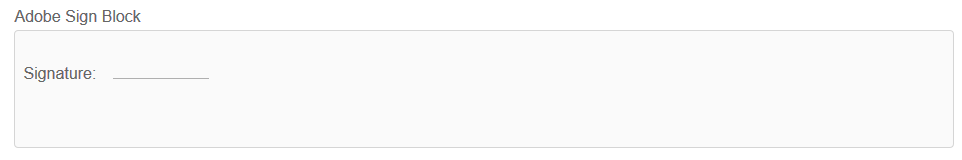

# Utilizzare [!DNL Adobe Sign] in un modulo adattivo {#using-adobe-sign-in-an-adaptive-form}

<span class="preview"> L’Adobe consiglia di utilizzare l’acquisizione dati moderna ed estensibile [Componenti core](https://experienceleague.adobe.com/docs/experience-manager-core-components/using/adaptive-forms/introduction.html?lang=it) per [creazione di un nuovo Forms adattivo](/help/forms/creating-adaptive-form-core-components.md) o [aggiunta di Forms adattivo alle pagine AEM Sites](/help/forms/create-or-add-an-adaptive-form-to-aem-sites-page.md). Questi componenti rappresentano un progresso significativo nella creazione di Forms adattivi, garantendo esperienze utente straordinarie. Questo articolo descrive un approccio precedente all’authoring di Forms adattivi utilizzando i componenti di base. </span>


| Versione | Collegamento articolo |
| -------- | ---------------------------- |
| AEM 6.5 | [Fai clic qui](https://experienceleague.adobe.com/docs/experience-manager-65/forms/adaptive-forms-advanced-authoring/working-with-adobe-sign.html) |
| AEM as a Cloud Service | Questo articolo |


[!DNL Adobe Sign] abilita i flussi di lavoro di firma elettronica per Adaptive Forms. Le firme elettroniche migliorano i flussi di lavoro per l&#39;elaborazione di documenti per questioni legali, vendite, retribuzioni, gestione delle risorse umane e altre aree.

In un tipico [!DNL Adobe Sign] e nello scenario Forms adattivo, un utente compila un modulo adattivo da applicare a un servizio che richiede le firme di una o più parti. Ad esempio, una richiesta di mutuo e carta di credito richiede la firma legale da parte di tutti i mutuatari e i corichiedenti. Per abilitare i flussi di lavoro di firma elettronica per scenari simili, è possibile integrare [!DNL Adobe Sign] con un modulo adattivo. Altri esempi sono: puoi utilizzare [!DNL Adobe Sign] a:

* Chiudere le offerte da qualsiasi dispositivo con procedure di proposta, preventivo e contratto completamente automatizzate.
* Completa i processi relativi alle risorse umane più rapidamente e offri ai tuoi dipendenti le esperienze digitali.
* Ridurre i tempi di ciclo del contratto e integrare i fornitori più rapidamente.
* Crea flussi di lavoro digitali che automatizzano i processi più comuni.

[!DNL Adobe Sign] integrazione con [!DNL AEM Forms] supporta:

* Flussi di lavoro di firma per utente singolo e multiplo
* Flussi di lavoro di firma sequenziali e simultanei
* Firma dei moduli come utente anonimo o connesso
* Processi di firma dinamici (integrazione con [!DNL AEM Forms] Workflow)
* Autenticazione tramite knowledge base, telefono, profili social e documento ufficiale
* Assegna ruoli a ogni destinatario del contratto. Adobe Sign per i livelli di servizio business ed enterprise hanno la possibilità di espandere [ruoli per i destinatari del contratto](#addsignerstoanadaptiveform).

<!-- * In-form and out-of-form signing experiences -->

## Prerequisiti {#prerequisites}

Prima di utilizzare [!DNL Adobe Sign] in un modulo adattivo:

* Assicurati che [!DNL AEM Forms] as a Cloud Service è configurato per l’utilizzo di Adobe Sign. Per ulteriori informazioni, consulta [Integrare Adobe Sign con [!DNL AEM Forms]](adobe-sign-integration-adaptive-forms.md).
* Tieni pronto l’elenco dei destinatari. È necessario almeno un indirizzo e-mail per ogni destinatario.

## Configura [!DNL Adobe Sign] per un modulo adattivo {#configure-adobe-sign-for-an-adaptive-form}

Per configurare [!DNL Adobe Sign] per un modulo adattivo:

1. [Abilita [!DNL Adobe Sign] per un modulo adattivo](#enableadobsignforanadaptiveform)
1. [Aggiungi [!DNL Adobe Sign] campi in un modulo adattivo](#addadobesignfieldstoanadaptiveform)
1. [Seleziona [!DNL Adobe Sign] Cloud Service per un modulo adattivo](#select-adobe-sign-cloud-service-and-signing-order)

1. [Aggiungi [!DNL Adobe Sign] destinatario di un modulo adattivo](#addsignerstoanadaptiveform)
1. [Seleziona Azione di invio per un modulo adattivo](#selectsubmitactionforanadaptiveform)


### Abilita [!DNL Adobe Sign] per un modulo adattivo  {#enableadobesign}

È possibile abilitare [!DNL Adobe Sign] per un modulo adattivo esistente o crea un [!DNL Adobe Sign] è stato abilitato Adaptive Form. Scegliere una delle opzioni seguenti:

* [Creare un [!DNL Adobe Sign] Modulo adattivo abilitato](#create-an-adaptive-form-for-adobe-sign)
* [Abilita [!DNL Adobe Sign] per un modulo adattivo esistente](#editafsign).

#### Creazione di un modulo adattivo per Adobe Sign {#create-an-adaptive-form-for-adobe-sign}

Per creare un modulo adattivo abilitato alla firma:

1. Accedi a **[!UICONTROL Adobe Experience Manager]** > **[!UICONTROL Forms]** > **[!UICONTROL Forms e documenti]**.
1. Tocca **[!UICONTROL Crea]** e seleziona **[!UICONTROL Modulo adattivo]**. Viene visualizzato un elenco di modelli. Seleziona un modello e tocca **[!UICONTROL Successivo]**.
1. In **[!UICONTROL Base]** scheda:

   1. Specifica la **[!UICONTROL Nome]** e **[!UICONTROL Titolo]** per il modulo adattivo.

   1. Seleziona la [Contenitore configurazione](adobe-sign-integration-adaptive-forms.md#configure-adobe-sign-with-aem-forms) creato durante [integrazione [!DNL Adobe Sign] con [!DNL AEM Forms]](adobe-sign-integration-adaptive-forms.md).

   Il contenitore di configurazione contiene [!DNL Adobe Sign] Cloud Service configurati per l’ambiente. Questi servizi sono disponibili per la selezione nell’editor di moduli adattivi.

1. In **[!UICONTROL Modello modulo]** , selezionare una delle opzioni seguenti:

   * Se si dispone di un modello di modulo personalizzato e si richiede un documento di record basato sul modello di modulo, selezionare **[!UICONTROL Associa modello modulo come modello del documento record]** e selezionare un modello di documento record. Quando si utilizza l&#39;opzione, i documenti inviati per la firma visualizzano solo i campi basati sul modello di modulo associato. Non visualizza tutti i campi del modulo adattivo.

   * Se non si dispone di un modello di modulo personalizzato, selezionare **[!UICONTROL Genera documento di record]** opzione. Quando utilizzi l’opzione, nel documento inviato per la firma vengono visualizzati tutti i campi del modulo adattivo.

1. Tocca **[!UICONTROL Crea.]** Viene creato un modulo adattivo abilitato alla firma. Puoi aggiungere il tuo [!DNL Adobe Sign] nel modulo e inviarlo per la firma.

#### Abilita [!DNL Adobe Sign] per un modulo adattivo {#editafsign}

Da utilizzare [!DNL Adobe Sign] in un modulo adattivo esistente:

1. Accedi a **[!UICONTROL Adobe Experience Manager]** > **[!UICONTROL Forms]** > **[!UICONTROL Forms e documenti]**.
1. Seleziona il modulo adattivo e tocca **[!UICONTROL Proprietà]**.
1. In **[!UICONTROL Base]** , seleziona la scheda [Contenitore configurazione](adobe-sign-integration-adaptive-forms.md#configure-adobe-sign-with-aem-forms) creato durante l’integrazione [!DNL Adobe Sign] con [!DNL AEM Forms].
1. In **[!UICONTROL Modalità modulo]** , selezionare una delle opzioni seguenti:

   * Se si dispone di un modello di modulo personalizzato e si richiede un documento di record basato sul modello di modulo, selezionare **[!UICONTROL Associa modello modulo come modello del documento record]** e selezionare un modello di documento record. Quando si utilizza l&#39;opzione, i documenti inviati per la firma visualizzano solo i campi basati sul modello di modulo associato. Non visualizza tutti i campi del modulo adattivo.

   * Se non si dispone di un modello di modulo personalizzato, selezionare **[!UICONTROL Genera documento di record]** opzione. Quando utilizzi l’opzione, nel documento inviato per la firma vengono visualizzati tutti i campi del modulo adattivo.

1. Tocca **[!UICONTROL Salva e chiudi]**. Il modulo adattivo è abilitato per [!DNL Adobe Sign]. Ora puoi aggiungere il tuo [!DNL Adobe Sign] nel modulo e inviarlo per la firma.

### Aggiungi [!DNL Adobe Sign] campi in un modulo adattivo {#addadobesignfieldstoanadaptiveform}

[!DNL Adobe Sign] dispone di vari campi che possono essere inseriti in un modulo adattivo. Questi campi accettano diversi tipi di dati, ad esempio firme, iniziali, società o titoli, e consentono di raccogliere ulteriori informazioni durante la firma, insieme alle firme. È possibile utilizzare [!DNL Adobe Sign] Blocca componente da posizionare [!DNL Adobe Sign] campi in varie posizioni in un modulo adattivo.

Per aggiungere campi a un modulo adattivo e personalizzare varie opzioni relative a tali campi:

1. Trascinamento della selezione **[!UICONTROL Blocco Adobe Sign]** dal browser componenti al modulo adattivo. Il [!DNL Adobe Sign] Il componente di blocco ha tutti i [!DNL Adobe Sign] campi. Per impostazione predefinita, aggiunge **[!UICONTROL Firma]** al modulo adattivo.

   

   Per impostazione predefinita, il [!DNL Adobe Sign] Il blocco non è visibile nel modulo adattivo pubblicato. È visibile solo nei documenti di firma. È possibile modificare la visibilità di [!DNL Adobe Sign] Blocca dalle proprietà del [!DNL Adobe Sign] Blocca componente.

   >[!NOTE]
   >
   >  * Utilizzo di [!DNL Adobe Sign] il blocco non è obbligatorio [!DNL Adobe Sign] in un modulo adattivo. Se non usa [!DNL Adobe Sign] blocca e aggiungi i campi per i destinatari, quindi il campo firma predefinito viene visualizzato nella parte inferiore dei documenti di firma.
   >  * Utilizzare [!DNL Adobe Sign] solo per i Forms adattivi che generano automaticamente documenti di record. Se utilizzi un XDP personalizzato per generare un documento di record o un modulo adattivo basato su modello di modulo, [!DNL Adobe Sign] blocco non supportato.


1. Seleziona la **[!UICONTROL Blocco Adobe Sign]** e tocca il pulsante **[!UICONTROL Modifica]**  icona. Vengono visualizzate le opzioni per aggiungere campi e formattare l&#39;aspetto di un campo.

   

   **R.** Seleziona e aggiungi [!DNL Adobe Sign] campi. **B.** Espandi [!DNL Adobe Sign] blocco alla visualizzazione a schermo intero

1. Tocca il **[!UICONTROL Adobe Sign]** Campo  icona. Vengono visualizzate le opzioni per selezionare e aggiungere [!DNL Adobe Sign] campi.

   Espandi **[!UICONTROL Tipo]** campo a discesa per selezionare un [!DNL Adobe Sign] e tocca il pulsante Fine  icona per aggiungere il campo selezionato a [!DNL Adobe Sign] blocco. Il **[!UICONTROL Tipo]** Il campo a discesa include i campi Firma, Informazioni destinatario e Tipi di campo Dati. [!DNL Adobe Sign] Integrazione con l’AEM [!DNL Forms] campi di supporto elencati nella [!UICONTROL Tipo] solo casella a discesa. Per informazioni dettagliate su [!DNL Adobe Sign] campi, vedi [Documentazione di Adobe Sign](https://helpx.adobe.com/sign/help/field-types.html).

   

   È obbligatorio fornire un nome univoco per un campo. Puoi anche selezionare l’opzione richiesta per contrassegnare un campo come obbligatorio. Oltre al **[!UICONTROL Nome]** e **[!UICONTROL Obbligatorio]** opzione, alcuni [!DNL Adobe Sign] hanno più opzioni. Ad esempio, maschera e su più righe. Inoltre, specifica un nome univoco per ogni [!DNL Adobe Sign] se i campi si trovano nello stesso campo o in un campo diverso [!DNL Adobe Sign] blocchi.

   Se si seleziona **[!UICONTROL Firma digitale]** dall’elenco a discesa, puoi applicare le firme digitali al modulo adattivo:

   * Online utilizzando le firme cloud per firmare con un [ID digitale](https://helpx.adobe.com/sign/kb/digital-certificate-providers.html) ospitato da un provider di servizi di trust.
   * In locale, scaricando il documento con Adobe Acrobat o Reader utilizzando una smart card, un token USB o un ID digitale basato su file.

### Abilita [!DNL Adobe Sign] per un modulo adattivo {#enableadobsignforanadaptiveform}

Pronti all’uso, [!DNL Adobe Sign] non è abilitato per un modulo adattivo. Per abilitare questa funzione:

1. Nel browser Contenuti, tocca **[!UICONTROL Contenitore modulo]**, e tocca il **[!UICONTROL Configura]**  icona. Apre il browser delle proprietà e visualizza le proprietà del contenitore Modulo adattivo.
1. Nel browser delle proprietà, espandi la sezione **[!UICONTROL Firma elettronica]** Pannello a soffietto e seleziona la **[!UICONTROL Abilita Adobe Sign]** opzione. Abilita [!DNL Adobe Sign] per un modulo adattivo.

### Seleziona [!DNL Adobe Sign] Cloud Service e ordine di firma {#select-adobe-sign-cloud-service-and-signing-order}

È possibile configurare più [!DNL Adobe Sign] servizi per un&#39;istanza dell&#39;AEM [!DNL Forms]. È consigliabile disporre di un insieme separato di servizi per ciascuna funzione (risorse umane, finanze e altro ancora). Semplifica il tracciamento e il reporting dei documenti firmati. Ad esempio, una banca dispone di più reparti. È possibile disporre di una configurazione separata per ciascun reparto per un migliore tracciamento dei documenti.

Un documento può avere anche più destinatari. Ad esempio, un&#39;applicazione con carta di credito può avere più richiedenti. Una banca richiede le firme di tutti i richiedenti prima di iniziare l&#39;elaborazione della domanda. Per scenari con più destinatari, è possibile scegliere di firmare il documento in ordine sequenziale o simultaneo.

Per selezionare un Cloud Service e un ordine di firma:


1. Nel browser Contenuti, tocca **[!UICONTROL Contenitore modulo]**, e tocca il **[!UICONTROL Configura]**  icona. Apre il browser delle proprietà e visualizza le proprietà del contenitore Modulo adattivo.
1. Nel browser delle proprietà, espandi la sezione **[!UICONTROL Firma elettronica]** Pannello a soffietto e seleziona la **[!UICONTROL Abilita Adobe Sign]** opzione. Abilita [!DNL Adobe Sign] per un modulo adattivo.
1. Seleziona un Cloud Service dall’elenco già configurato di [!DNL Adobe Sign] Cloud Service.

   Se il **[!UICONTROL Adobe Sign Cloud Service]** è vuoto, segui la [Configura [!DNL Adobe Sign] con [!DNL AEM Forms]](adobe-sign-integration-adaptive-forms.md) articolo per configurare il servizio.

   Il menu a discesa elenca i Cloud Service presenti nel `global` cartella in Strumenti > **[!UICONTROL Cloud Service]** > **[!UICONTROL Adobe Sign]**. Inoltre, il menu a discesa elenca anche i Cloud Service presenti nella cartella selezionata nel **[!UICONTROL Contenitore configurazione]** quando crei un modulo adattivo.

1. Selezionare l&#39;ordine di firma dalla **[!UICONTROL I destinatari possono completare]** . I destinatari possono firmare un modulo adattivo **[!UICONTROL In sequenza]** - uno dopo l&#39;altro, o **[!UICONTROL Contemporaneamente]** - in qualsiasi ordine.

   In ordine sequenziale, un destinatario riceve il contratto Adobe Sign alla volta. Dopo che il destinatario ha completato l&#39;azione assegnata, l&#39;accordo viene inviato al destinatario successivo e così via.

   In ordine simultaneo, tutti i destinatari ricevono l’accordo Adobe Sign e possono agire in parallelo tra loro.

1. Utilizzare il campo ID accordo per associare un bindref all&#39;ID accordo (agreementId). Aggiunge l’ID contratto alla sezione afBoundData dei dati di invio per i moduli basati su schema. L’ID contratto viene aggiunto anche alla sezione afSubmissionInfo nei dati inviati per tutti i moduli abilitati per Adobe Sign. È possibile utilizzare l&#39;ID accordo per tenere traccia dello stato dell&#39;accordo utilizzando un codice personalizzato (è necessaria l&#39;implementazione personalizzata).

1. [Aggiungere destinatari a un modulo adattivo](working-with-adobe-sign.md#addsignerstoanadaptiveform) e tocca Fine  per salvare le modifiche.

### Aggiungere destinatari a un modulo adattivo {#addsignerstoanadaptiveform}

Puoi avere uno o più destinatari per un accordo Adobe Sign. Quando aggiungi un destinatario, puoi anche configurare i dettagli di autenticazione per il destinatario e selezionare se il compilatore del modulo e il destinatario sono la stessa persona. Per aggiungere e fornire vari dettagli su un destinatario, effettua le seguenti operazioni:

1. Nel browser Contenuti, tocca **[!UICONTROL Contenitore modulo]**, e tocca il **[!UICONTROL Configura]**  icona. Apre il browser delle proprietà con le proprietà del contenitore Modulo adattivo.
1. Nel browser delle proprietà, espandi la sezione **[!UICONTROL Firma elettronica]** Pannello a soffietto e seleziona la **[!UICONTROL Abilita Adobe Sign]** opzione. Abilita [!DNL Adobe Sign] per un modulo adattivo.
1. Tocca **[!UICONTROL Aggiungi destinatario]**. Aggiunge un destinatario al modulo adattivo. È possibile aggiungere più destinatari a un modulo adattivo. Tutti i destinatari ricevono un accordo Adobe Sign sull’invio del modulo adattivo.
   

1. Fai clic su **[!UICONTROL Modifica]**  per specificare le seguenti informazioni sul destinatario:

   * **[!UICONTROL Titolo]:** Specifica un titolo per identificare in modo univoco un destinatario.

   * **[!UICONTROL Il destinatario è anche la persona che deve compilare il modulo?]:** Seleziona **[!UICONTROL Sì]**, se il compilatore del modulo e il primo destinatario sono la stessa persona. <!-- If the option is set to **No,** then do not use the signature step component in the Adaptive Form. If the form contains a Signature Step component, then the field is automatically set to Yes. -->

   * **[!UICONTROL Ruolo destinatario]:** Seleziona il ruolo di un destinatario. Adobe Sign per i livelli di servizio business ed enterprise hanno la possibilità di espandere [ruoli per i destinatari del contratto](https://helpx.adobe.com/sign/using/set-up-signer-approver-roles.html), oltre a **Firmatario**, per soddisfare meglio i requisiti del flusso di lavoro.

   * **[!UICONTROL Indirizzo e-mail destinatario]:** Specifica l’indirizzo e-mail del destinatario. Il destinatario riceve il contratto Adobe Sign relativo all’indirizzo e-mail specificato. Puoi scegliere di utilizzare un indirizzo e-mail fornito in un campo del modulo, nel profilo utente di Experience Manager dell’utente connesso, oppure immettere manualmente un indirizzo e-mail. È un passaggio obbligatorio.

     >[!NOTE]
     >
     >Assicurati che l’indirizzo e-mail del primo destinatario o dell’unico destinatario (se esiste un solo destinatario) non sia identico a [!DNL Adobe Sign] account utilizzato per configurare i Cloud Service AEM.

   * **[!UICONTROL Metodo di autenticazione destinatario]:** Specifica il metodo per autenticare un destinatario prima di aprire l’accordo Adobe Sign. Puoi scegliere tra telefono, knowledge base, autenticazione basata su identità social e [Documento ufficiale](https://helpx.adobe.com/sign/using/adobesign-authentication-government-id.html) per [!DNL Adobe Acrobat Sign]. Per [!DNL Adobe Acrobat Sign for Government] puoi scegliere tra l’autenticazione tramite telefono e basata su knowledge base.

   >[!NOTE]
   >
   >    * Per impostazione predefinita, l’autenticazione basata su identità social fornisce un’opzione per eseguire l’autenticazione utilizzando Facebook, Google e LinkedIn. Puoi contattare [!DNL Adobe Sign] supporto per abilitare altri provider di autenticazione social.
   >

   * **[!DNL Adobe Sign]campi da compilare o firmare:** Seleziona [!DNL Adobe Sign] campi per il destinatario. Un modulo adattivo può avere più [!DNL Adobe Sign] campi. Puoi scegliere di abilitare campi specifici per un destinatario. Nel campo vengono visualizzati tutti i [!DNL Adobe Sign] Blocchi. Quando selezioni un blocco, vengono selezionati tutti i campi del blocco. Puoi utilizzare l’icona X per deselezionare un campo.

   

   L’immagine precedente presenta due esempi [!DNL Adobe Sign] Blocchi: Informazioni personali e dettagli dell’ufficio

   Tocca il  icona. Il destinatario viene aggiunto.

### Seleziona Azione di invio per un modulo adattivo {#selectsubmitactionforanadaptiveform}

Dopo, aggiungi [!DNL Adobe Sign] campi in un modulo adattivo, abilita [!DNL Adobe Sign] dal contenitore modulo, seleziona [!DNL Adobe Sign] Cloud Service e aggiungi i destinatari del contratto di Adobe Sign, seleziona un’azione di invio appropriata per il modulo adattivo. Per informazioni dettagliate sulle azioni di invio di Adaptive Forms, consulta [Configurazione dell’azione di invio](configuring-submit-actions.md).

La firma e l’invio di un modulo sono indipendenti l’uno dall’altro. L’invio di un modulo adattivo ha luogo subito dopo la creazione di un accordo Adobe Sign dopo l’invio di un modulo da parte dell’utente. [!DNL AEM Forms] as a Cloud Service non attende che i destinatari firmino o completino altre azioni per inviare un modulo adattivo. Un modulo viene inviato non appena un utente fa clic sul pulsante Invia o quando un passaggio di riepilogo visualizza il riepilogo del modulo.

Inoltre, un’ [!DNL Adobe Sign] Il modulo adattivo abilitato incorpora l’ID del contratto Adobe Sign per l’invio dei dati. È possibile utilizzare l&#39;ID accordo per tenere traccia dello stato dell&#39;accordo utilizzando un codice personalizzato (è necessaria l&#39;implementazione personalizzata).

L’ID contratto Adobe Sign (agreementId) è incluso nei dati di invio del modulo adattivo. Per impostazione predefinita, l&#39;ID contratto è presente nel `afSubmissionInfo` nodo dei dati inviati.

```xml
   <?xml version="1.0" encoding="UTF-8"?>
   <afData>
      <afUnboundData>
         <data>
            <textbox1613455050902>ff</textbox1613455050902>
         </data>
      </afUnboundData>
      <afBoundData>
         <data xmlns:xfa="http://www.xfa.org/schema/xfa-data/1.0/" />
      </afBoundData>
      <afSubmissionInfo>
         <lastFocusItem>guide[0].guide1[0].guideRootPanel[0].textbox1613455050902[0]</lastFocusItem>
         <stateOverrides />
         <signers>
            <signer0>
               <email />
            </signer0>
         </signers>
         <afPath>/content/dam/formsanddocuments/testsign</afPath>
         <afSubmissionTime>20210311031009</afSubmissionTime>
         <agreementId>xxxxxxxxxxxxxxxxxxxxxxxxxxxxxxxxxxxxxxxxxxxxx</agreementId>
      </afSubmissionInfo>
   </afData>
```

Facoltativamente, è anche possibile associare un bindref all&#39;ID contratto (agreementId). Aggiunge l&#39;ID contratto alla sezione afBoundData dei dati inviati. Ad esempio, nei seguenti dati inviati, l&#39;ID contratto è associato a `<userName>` nodo:

```xml
      <?xml version="1.0" encoding="UTF-8"?>
      <afData>
         <afUnboundData>
            <data />
         </afUnboundData>
         <afBoundData>
            <config xmlns:xfa="http://www.xfa.org/schema/xfa-data/1.0/" xmlns:xsi="http://www.w3.org/2001/XMLSchema-instance">
               <userName>3AAABLblqZhC2MWu7GFauKh45j_t2ih8mAtmbdIcNSl1HgQubhMJfDaDfylyN7NQiYRam_44ISKm45enIOafHqWZrdaxShf9r</userName>
               <dateOfBirth>0001-01-01</dateOfBirth>
            </config>
         </afBoundData>
         <afSubmissionInfo>
            <lastFocusItem>guide[0].guide1[0].guideRootPanel[0].projectDetails[0]</lastFocusItem>
            <stateOverrides />
            <signers>
               <signer0>
                  <email />
               </signer0>
            </signers>
            <afPath>/content/dam/formsanddocuments/testathon2021-1/gaurav/xsd-based</afPath>
            <afSubmissionTime>20210311095211</afSubmissionTime>
            <agreementId>xxxxxxxxxxxxxxxxxxxxxxxxxxxxxxxxxxxxxxxxxxxx</agreementId>
         </afSubmissionInfo>
      </afData>
```

<!-- Remove when forms portal goes live
>[!NOTE]
>
>Data of the Adaptive Form is stored temporarily on Forms Portal. It is recommended to use [custom storage for Forms Portal](/help/forms/using/configuring-draft-submission-storage.md). It ensures that the PII (personally identifiable information) data is not stored on AEM servers. 
-->

L’esperienza di firma del modulo è pronta. Puoi visualizzare in anteprima il modulo per verificare l’esperienza di firma. Nel modulo pubblicato: [!DNL Adobe Sign] I campi di blocco vengono visualizzati quando un destinatario riceve il modulo per la firma tramite un messaggio e-mail. Quando **[!UICONTROL Quando sono uguali il destinatario e la persona che compila il modulo?]** l’opzione è contrassegnata come sì e la condizione è soddisfatta, l’utente viene reindirizzato al contratto di Adobe Sign dopo l’invio e può firmare il documento immediatamente, invece di attendere che il contratto venga visualizzato nell’e-mail.

## Configurare le firme cloud per un modulo adattivo {#configure-cloud-signatures-for-an-adaptive-form}

Le firme digitali basate sul cloud o firme remote sono una nuova generazione di firme digitali che funzionano su desktop, dispositivi mobili e Web e soddisfano i massimi livelli di conformità e garanzia per l&#39;autenticazione dei destinatari. È possibile firmare un modulo adattivo con firme digitali basate su cloud.

Dopo [modifica delle proprietà di un modulo adattivo per Adobe Sign](working-with-adobe-sign.md#enableadobesign), per aggiungere un campo di firma cloud a un modulo adattivo, effettua le seguenti operazioni:

1. Trascinamento della selezione **[!UICONTROL Blocco Adobe Sign]** dal browser componenti al modulo adattivo. Il [!UICONTROL Blocco Adobe Sign] il componente dispone di tutti i [!DNL Adobe Sign] campi. Per impostazione predefinita, aggiunge **[!UICONTROL Firma]** al modulo adattivo.

   

1. Seleziona la **[!UICONTROL Blocco Adobe Sign]** e tocca il pulsante **[!UICONTROL Modifica]**  icona. Vengono visualizzate le opzioni per aggiungere campi e formattare l&#39;aspetto di un campo.

   

   **R.** Seleziona e aggiungi [!DNL Adobe Sign] campi. **B.** Espandi [!DNL Adobe Sign] blocco alla visualizzazione a schermo intero

1. Tocca il **[!UICONTROL Campo Adobe Sign]**  icona. Vengono visualizzate le opzioni per selezionare e aggiungere [!DNL Adobe Sign] campi.

   Espandi **[!UICONTROL Tipo]** campo a discesa da selezionare **[!UICONTROL Firma digitale]** e tocca il **[!UICONTROL Fine]** icona per aggiungere il campo selezionato a [!DNL Adobe Sign] blocco.

   

   È obbligatorio fornire un nome univoco per un campo.

   Applica firme digitali al modulo adattivo utilizzando:

   * Firme cloud: firma con un [ID digitale](https://helpx.adobe.com/sign/kb/digital-certificate-providers.html) ospitato da un provider di servizi di trust.
   * Adobe Acrobat o Reader: scarica e apri il documento con Adobe Acrobat o Reader per firmare utilizzando una smart card, un token USB o un ID digitale basato su file.

     >[!NOTE]
     >
     > La firma digitale è applicabile anche a [!DNL Adobe Acrobat Sign for Government] ma non è possibile applicarlo utilizzando le firme cloud.

   Dopo aver aggiunto il campo della firma cloud al modulo adattivo, esegui i seguenti passaggi per completare il processo di configurazione:

   * [Abilitare Adobe Sign per un modulo adattivo](#enableadobsignforanadaptiveform)
   * [Seleziona Adobe Sign Cloud Service per un modulo adattivo](#selectadobesigncloudserviceforanadaptiveform)
   * [Aggiungere destinatari a un modulo adattivo](#addsignerstoanadaptiveform)
   * [Seleziona Azione di invio per un modulo adattivo](#selectsubmitactionforanadaptiveform)

### Configurare il componente per la pagina di ringraziamento o il passaggio di riepilogo {#configure-the-thank-you-page-or-summary-step-component}

Il **[!UICONTROL Passaggio di riepilogo]** Il componente invia automaticamente il modulo, compila le informazioni all&#39;interno della pagina di riepilogo personalizzata e visualizza il riepilogo del modulo inviato. Il componente Passaggio di riepilogo occupa l’intera larghezza disponibile per il modulo. Si consiglia di non avere altri componenti nella sezione contenente il componente Passaggio di riepilogo.

## Domande frequenti {#frequently-asked-questions}

**D:** È possibile incorporare un modulo adattivo in un altro modulo adattivo. Il modulo adattivo incorporato può essere [!DNL Adobe Sign] abilitato?
**Ans:** No, Experience Manager Forms non supporta l’utilizzo di un modulo adattivo che incorpora un [!DNL Adobe Sign] Modulo adattivo abilitato per la firma

**D:** Quando creo un modulo adattivo utilizzando il modello avanzato e lo apro per la modifica, viene visualizzato un messaggio di errore di tipo &quot;La firma elettronica o i destinatari non sono configurati correttamente&quot;. viene visualizzato. Come si risolve il messaggio di errore?
**Ans:** Il modulo adattivo creato utilizzando il modello avanzato è configurato per l’utilizzo [!DNL Adobe Sign]. Per risolvere l’errore, crea e seleziona una [!DNL Adobe Sign] configurazione cloud e configurazione di un [!DNL Adobe Sign] destinatario del modulo adattivo.

**D:** Posso utilizzare [!DNL Adobe Sign] tag di testo in un componente testo statico di un modulo adattivo?
**Ans:** Sì, puoi utilizzare i tag di testo in un componente testo per aggiungere [!DNL Adobe Sign] campi in un documento di record (solo opzione Documento di record generato automaticamente) abilitato Modulo adattivo. Per informazioni sulla procedura e sulle regole per creare un tag di testo, consulta [Documentazione di Adobe Sign](https://helpx.adobe.com/sign/using/text-tag.html). Inoltre, Adaptive Forms dispone di un supporto limitato per i tag di testo. È possibile utilizzare i tag di testo per creare solo i campi che [Blocco Adobe Sign](working-with-adobe-sign.md#configure-cloud-signatures-for-an-adaptive-form) supporta.

## Risoluzione dei problemi {#troubleshoot}

### [!DNL Adobe Sign] errori di contratto {#adobe-sign-agreement-failures}

**Problema**
Quando [!DNL Adobe Sign] è configurato per un modulo adattivo, il servizio non riesce a creare un [!DNL Adobe Sign] contratto per il modulo adattivo sottostante.

**Risoluzione**

* Controlla la [configurazione di Adobe Sign Cloud Service](adobe-sign-integration-adaptive-forms.md) utilizzato nel modulo adattivo.
* Assicurati che l’applicazione API su [!DNL Adobe Sign] server utilizzato per configurare [!DNL Adobe Sign] Il Cloud Service dispone delle autorizzazioni necessarie.
* Se utilizzi più [!DNL Adobe Sign] Cloud Service, selezionare **[!UICONTROL URL OAuth]** di tutti i servizi allo stesso **[!UICONTROL Condivisione Adobe Sign]**.

* Utilizza indirizzi e-mail separati per configurare [!DNL Adobe Sign] e per il primo o un singolo destinatario. L’indirizzo e-mail del primo destinatario o dell’unico destinatario (se presente, il singolo destinatario) non può essere identico a [!DNL Adobe Sign] account utilizzato per configurare i Cloud Service AEM.

>[!MORELIKETHIS]
>
>* [ [!DNL Adobe Sign] Integrare con [!DNL AEM Forms]](adobe-sign-integration-adaptive-forms.md)
>* [Best practice per l’utilizzo di [!DNL Adobe Sign] con Forms adattivo](https://medium.com/adobetech/using-adobe-sign-to-e-sign-an-adaptive-form-heres-the-best-way-to-do-it-dc3e15f9b684)


## Consulta anche {#see-also}

{{see-also}}