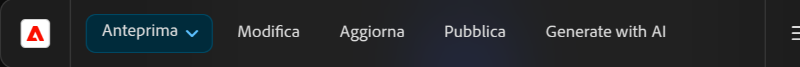

# Funzione Genera varianti - Integrata negli editor di AEM {#generate-variations-integrated-in-aem-editors}

Se stai cercando un modo per ottimizzare i canali digitali e accelerare la creazione di contenuti, puoi utilizzare la funzione Genera varianti integrata negli editor AEM.

La funzione Generare varianti utilizza l’intelligenza artificiale generativa (IA) per creare varianti di contenuto in base ai tuoi input. Dopo aver creato le varianti, puoi utilizzare il contenuto del tuo sito Web e misurarne il successo utilizzando la funzionalità [Sperimentazione](https://www.aem.live/docs/experimentation) di [Edge Delivery Services](/help/edge/overview.md).

Questo consente di accelerare la velocità dei contenuti creando rapidamente i contenuti del brand in pochi minuti. Di conseguenza aiuta a migliorare la conversione con le nuove varianti di copia.

Puoi [accedere alla funzione Genera varianti](#access-generate-variations) dai seguenti editor ([una che sono stati volta configurati](#access-generate-variations)):

* [all’interno della barra laterale di AEM Edge Delivery Services; per l’authoring basato su documenti](#access-aem-sidekick)
* [all’interno dell’editor universale](#access-aem-universal-editor)
* [all’interno dell’editor di frammenti di contenuto](#access-aem-content-fragment-editor)

>[!IMPORTANT]
>
>Questa pagina utilizza l’authoring basato su documenti come base per gli esempi, ma i principi si applicano agli altri editor.

>[!NOTE]
>
>In tutti i casi, per utilizzare la funzione Genera varianti è necessario assicurarsi che siano soddisfatti i [prerequisiti di accesso](#access-prerequisites).

>[!NOTE]
>
>Si consiglia di utilizzare questa versione poiché, anche se [è ancora possibile accedere direttamente alla versione autonoma della funzione Genera varianti](/help/generative-ai/generate-variations.md), in futuro diventerà obsoleta.

Puoi effettuare le seguenti operazioni:

* [Selezionare il contenuto che desideri utilizzare](#select-the-content): da blocchi esistenti del contenuto
   * Il blocco selezionato controlla ciò che viene mostrato e le azioni disponibili
* [Descrivere le modifiche desiderate](#describe-the-changes-you-want)
* [Genera varianti del contenuto](#generate-copy), quindi [se lo desideri, intraprendi altre azioni](#take-further-action-on-a-variation)
* [Selezionare e utilizzare una variante](#use-a-generated-variation)
* Rivedere la [cronologia](#history)
* Visualizzare i [preferiti](#favorites)

## Note legali e di utilizzo {#legal-usage-note}

<!--
Generative AI and Generate Variations for AEM are powerful tools – but **you** are responsible for use of the output.

Your inputs to the service should be tied to a context. This context can be your branding materials, website content, data, schemas for such data, templates, or other trusted documents.

You must evaluate the accuracy of any output as appropriate to your use case.

Before using Generate Variations you are recommended to read the [Adobe Experience Cloud Generative AI User Guidelines](https://www.adobe.com/legal/licenses-terms/adobe-dx-gen-ai-user-guidelines.html).
-->

[L’utilizzo della funzione Genera varianti](#generative-action-usage) è legato al consumo di azioni generative.

>[!NOTE]
>
>Consulta la [Scheda informativa sulla sicurezza per i dettagli su come generare una variante in AEM](https://www.adobe.com/content/dam/cc/en/trust-center/ungated/whitepapers/experience-cloud/aem-sites-generate-variations-security-fact-sheet.pdf).

## Panoramica {#overview}

Quando apri la funzione Genera varianti integrata in un editor, l’estensione viene visualizzata come un pannello mobile con tre schede.


* L’editor:
   * Mostra il flusso di contenuto nell’editor.
   * Qui puoi selezionare un blocco di contenuti da utilizzare nella funzione **Genera varianti**.
* **Genera varianti**:
   * È un pannello mobile con tre schede, che può essere riposizionato come desideri
   * [Genera](#get-started-with-generate-variations):
      * Mostra il [contenuto selezionato](#select-the-content).
      * Fornisce **suggerimenti** di esempio per le modifiche.
      * Consente di [descrivere le modifiche desiderate](#describe-the-changes-you-want).
      * Consente di [generare](#generate-copy) nuove varianti.
      * Mostra le varianti generate. <!--, together with their [brand score](#the-brand-score).-->
      * [Consente di intraprendere ulteriori azioni su una variante](#take-further-action-on-a-variation).
      * [Consente di utilizzare una variante generata](#use-a-generated-variation).
   * [Cronologia](#history)
      * Mostra la cronologia recente delle generazioni.
   * [Preferiti](#favorites):
      * Mostra i risultati delle generazioni precedenti che sono stati contrassegnati come Preferiti.
   * **Termini IA generativa di Adobe**: collegamenti alle [linee guida per l’utente dell’IA generativa di Adobe Experience Cloud](https://www.adobe.com/legal/licenses-terms/adobe-dx-gen-ai-user-guidelines.html).

## Introduzione alla funzione Genera varianti {#get-started-with-generate-variations}

L’interfaccia ti guida nel processo di generazione dei contenuti. Dopo aver aperto l’interfaccia, il primo passaggio consiste nella selezione del blocco di contenuti che desideri utilizzare.

### Selezionare il contenuto {#select-the-content}

Dal flusso di contenuto principale dell’editor, seleziona il contenuto per il quale desideri generare varianti. Questa **selezione** verrà visualizzata nella scheda **Genera**.

### Descrivere le modifiche desiderate {#describe-the-changes-you-want}

Per generare varianti del contenuto è necessario descrivere le modifiche desiderate. Puoi selezionare uno dei **suggerimenti** forniti oppure fornire una descrizione personalizzata.

Puoi anche specificare **Modificatori** per fornire più contesto:

* **Riferimento a una pagina Web**
Fornisci un URL per fornire più contesto.
* **Carica descrizione del contenuto**
Aggiorna un file `.docx` contenente i dettagli della descrizione del contenuto (10 MB o meno).

### Generare la copia {#generate-copy}

Dopo aver descritto le modifiche desiderate, seleziona **Genera** per visualizzare le risposte dell’IA generativa.


<!--
### The Brand Score {#the-brand-score}

The brand score shows you how on-brand the generated variation is.
-->

### Intraprendere ulteriori azioni su una variante {#take-further-action-on-a-variation}

Quando selezioni una singola variante, puoi utilizzare le azioni seguenti:

* **Modifica**
   * Puoi modificare il testo della variante generata.

      * Gli aggiornamenti possono essere visualizzati in anteprima nella pagina web.

   * Salva le modifiche per un utilizzo successivo.
* **Preferita**
   * Aggiungi un contrassegno a questa variante per un riferimento futuro.
   * Una volta contrassegnata, verrà visualizzata nella scheda [Preferiti](#favorites).
* **Base logica dell’intelligenza artificiale**
   * Per una maggiore trasparenza, questa opzione fornisce una breve descrizione del motivo per cui l’intelligenza artificiale generativa ha generato quella particolare variante.

### Utilizzare una variante generata {#use-a-generated-variation}

Per utilizzare il contenuto generato con l’intelligenza artificiale generativa, devi prima selezionare ed **esportare in CSV**.

Dopo l’esportazione, puoi utilizzare il contenuto altrove, ad esempio durante l’authoring di contenuti per il sito web. Puoi anche eseguire un [esperimento](https://www.aem.live/docs/experimentation).

>[!NOTE]
>
>Quando accedi alla funzione Genera varianti dall’[editor universale AEM](#access-aem-universal-editor) o dall’[editor dei frammenti di contenuto AEM](#access-aem-content-fragment-editor), il contenuto generato selezionato viene salvato automaticamente in AEM.

## Cronologia {#history}

Questa scheda visualizza l’attività passata dopo aver selezionato **Genera**. viene aggiunta una voce **Cronologia**.

Se, in un secondo momento, selezioni lo stesso contenuto nel flusso principale e apri la scheda **Cronologia**, verranno visualizzate tutte le varianti generate per quel blocco.

## Preferiti {#favorites}

Dopo aver esaminato il contenuto, puoi salvare le varianti selezionate come preferite.

Una volta salvate, vengono visualizzate in **Preferiti**. I preferiti sono persistenti (fino a quando li **elimini dai preferiti** o cancelli la cache del browser).

* Puoi **modificare**, **eliminare dai preferiti** o mostrare la **Base logica dell’intelligenza artificiale** per una voce.
* Una volta selezionata una variante, puoi anche **esportarla in CSV**.

## Utilizzo azione generativa {#generative-action-usage}

La gestione dell’utilizzo dipende dall’azione intrapresa:

* Generare varianti

  Una generazione di una variante di copia è uguale a un’azione generativa. In qualità di cliente, hai un certo numero di azioni generative che vengono fornite con la tua licenza AEM. Una volta utilizzato il diritto di base, puoi acquistare azioni aggiuntive.

  >[!NOTE]
  >
  >Consulta [Adobe Experience Manager: Cloud Service | Descrizione del prodotto](https://helpx.adobe.com/it/legal/product-descriptions/aem-cloud-service.html) per ulteriori dettagli sui diritti di base e rivolgiti al team del tuo account per acquistare più azioni generative.

## Accedere a Genera varianti {#access-generate-variations}

Dopo aver soddisfatto i prerequisiti, puoi accedere a Genera varianti da AEM as a Cloud Service o dalla barra laterale di Edge Delivery Services.

### Prerequisiti di accesso {#access-prerequisites}

Per utilizzare Genera varianti è necessario assicurarsi che i prerequisiti siano soddisfatti:

* [Accesso ad Experience Manager as a Cloud Service con Edge Delivery Services](#access-to-aemaacs-with-edge-delivery-services)

#### Accesso ad Experience Manager as a Cloud Service con Edge Delivery Services{#access-to-aemaacs-with-edge-delivery-services}

Gli utenti che hanno bisogno di accedere a Genera varianti devono avere diritto a un ambiente Experience Manager as a Cloud Service con Edge Delivery Services.

>[!NOTE]
>
>Se il tuo contratto per AEM Sites as a Cloud Service non include Edge Delivery Services, dovrai firmare un nuovo contratto per ottenere l’accesso.
>
>Rivolgiti al team del tuo account per scoprire come passare ad AEM Sites as a Cloud Service con Edge Delivery Services.

Per concedere l’accesso a utenti specifici, assegna il loro account utente al rispettivo profilo di prodotto. Consulta [Assegnazione dei profili di prodotto AEM per ulteriori dettagli](/help/journey-onboarding/assign-profiles-cloud-manager.md).

### Accesso da AEM Sidekick per l’authoring basato su documenti {#access-aem-sidekick}

L’accesso da AEM Sidekick viene utilizzato per l’[authoring basato su documenti](https://www.aem.live/docs/aem-authoring).

Sono necessarie alcune configurazioni prima di poter accedere a Genera varianti dalla barra laterale (di Edge Delivery Services).

>[!NOTE]
>
>Per informazioni su come installare e configurare la barra laterale, consulta il documento [Installazione della barra laterale di AEM](https://www.aem.live/docs/sidekick-extension).

Per utilizzare la funzione Genera varianti nella barra laterale (di Edge Delivery Services), includi le seguenti configurazioni nei progetti di Edge Delivery Services.

1. Abilita l’app in:

   * `tools/sidekick/config.json`

   Deve essere unito alla configurazione esistente e quindi implementato.

   Ad esempio:

   ```prompt
   {
     "plugins": [
       {
         "id": "aem-genai-variations",
         "titleI18n": {
           "en": "Generate with AI"
         },
         "environments": [
           "preview"
         ],
         "includePaths": [
           "**.docx**"
         ],
         "event": "aem-genai-variations-sidekick"
       }
     ]
   }
   ```

1. Crea:

   * `/tools/sidekick/aem-genai-variations.js`

   Devi creare questo file con il seguente contenuto:

   ```prompt
   (function () {
     let isAEMGenAIVariationsAppLoaded = false;
     function loadAEMGenAIVariationsApp() {
       const script = document.createElement('script');
       script.src = 'https://experience.adobe.com/solutions/aem-sites-genai-aem-genai-variations-mfe/static-assets/resources/sidekick/client.js?source=plugin';
       script.onload = function () {
         isAEMGenAIVariationsAppLoaded = true;
       };
       script.onerror = function () {
         console.error('Error loading AEMGenAIVariationsApp.');
       };
       document.head.appendChild(script);
     }
   
     function handlePluginButtonClick() {
       if (!isAEMGenAIVariationsAppLoaded) {
         loadAEMGenAIVariationsApp();
       }
     }
   
     // The code snippet for the Sidekick V1 extension, https://chromewebstore.google.com/detail/aem-sidekick/ccfggkjabjahcjoljmgmklhpaccedipo?hl=en
     const sidekick = document.querySelector('helix-sidekick');
     if (sidekick) {
       // sidekick already loaded
       sidekick.addEventListener('custom:aem-genai-variations-sidekick', handlePluginButtonClick);
     } else {
       // wait for sidekick to be loaded
       document.addEventListener('sidekick-ready', () => {
         document.querySelector('helix-sidekick')
           .addEventListener('custom:aem-genai-variations-sidekick', handlePluginButtonClick);
       }, { once: true });
     }
   
     // The code snippet for the Sidekick V2 extension, https://chromewebstore.google.com/detail/aem-sidekick/igkmdomcgoebiipaifhmpfjhbjccggml?hl=en
     const sidekickV2 = document.querySelector('aem-sidekick');
     if (sidekickV2) {
       // sidekick already loaded
       sidekickV2.addEventListener('custom:aem-genai-variations-sidekick', handlePluginButtonClick);
     } else {
       // wait for sidekick to be loaded
       document.addEventListener('sidekick-ready', () => {
         document.querySelector('aem-sidekick')
           .addEventListener('custom:aem-genai-variations-sidekick', handlePluginButtonClick);
       }, { once: true });
     }
   }());
   ```

1. Aggiorna:

   * `/scripts/scripts.js`

   Deve essere aggiornato per includere la seguente istruzione nella funzione `loadLazy()`:

   ```prompt
     import('../tools/sidekick/aem-genai-variations.js');
   ```

   In questo modo `/tools/sidekick/aem-genai-variations.js` viene caricato come parte del processo di caricamento lento.

   

1. Potresti doverti assicurare che gli utenti abbiano [Accesso ad Experience Manager as a Cloud Service con Edge Delivery Services](#access-to-aemaacs-with-edge-delivery-services).

1. Puoi quindi accedere alla funzione selezionando **Genera con l’IA** dalla barra degli strumenti Sidekick:

   

### Accesso dall’editor universale di AEM {#access-aem-universal-editor}

L’accesso dall’[editor universale di AEM](/help/sites-cloud/authoring/universal-editor/authoring.md) è implementato come estensione.

* Per informazioni dettagliate su come effettuare l’authoring con l’editor universale, consulta il documento [Authoring dei contenuti con l’editor universale.](/help/sites-cloud/authoring/universal-editor/authoring.md#generate-variations)
* Per informazioni dettagliate su come abilitare l’estensione, consulta il documento [Extension Manager in AEM Experience Manager.](https://developer.adobe.com/uix/docs/extension-manager/)

### Accesso dall’ editor frammenti di contenuto di AEM {#access-aem-content-fragment-editor}

L’accesso dall’[editor frammenti di contenuto di AEM](/help/sites-cloud/administering/content-fragments/authoring.md#generate-variations-ai) è implementato come estensione. Per ulteriori dettagli, consulta [Extension Manager in AEM Experience Manager](https://developer.adobe.com/uix/docs/extension-manager/).

## Ulteriori informazioni {#further-information}

Per ulteriori informazioni, consulta anche:

* [Genera varianti GenAI su GitHub](https://github.com/adobe/aem-genai-assistant#setting-up-aem-genai-assistant)
* [Sperimentazione di Edge Delivery Services](https://www.aem.live/docs/experimentation)
* [IA generativa nei prodotti Experience Cloud](https://experienceleague.adobe.com/it/docs/core-services/interface/features/generative-ai)

   * [IA generativa nei prodotti Experience Cloud - Adobe Experience Manager](https://experienceleague.adobe.com/it/docs/core-services/interface/features/generative-ai#aem)

* [Pagina di destinazione Generare varianti in Experience Cloud](https://experience.adobe.com/solutions/aem-sites-genai-aem-genai-variations-mfe/static-assets/resources/ga.html?lang=it)

* [IA generativa in AEM as a Cloud Service](/help/ai-in-aem/overview.md#generative-ai-in-aem)

## Cronologia delle versioni {#release-history}

Per informazioni dettagliate sulle versioni correnti e precedenti, consulta le [Note sulla versione per Genera varianti](/help/generative-ai/release-notes-generate-variations.md)
