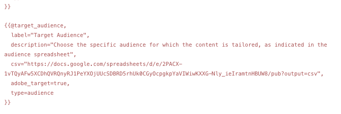

# Generare varianti {#generate-variations}

Se stai cercando un modo per ottimizzare i canali digitali e accelerare la creazione di contenuti, puoi utilizzare Genera varianti. Genera varianti utilizza l’intelligenza artificiale generativa (AI) per creare varianti di contenuto in base alle richieste; queste richieste vengono fornite da Adobe oppure create e gestite dagli utenti. Dopo aver creato le varianti, puoi utilizzare il contenuto del sito web e misurarne il successo utilizzando [Sperimentazione](https://www.aem.live/docs/experimentation) funzionalità di [Edge Delivery Services](/help/edge/overview.md).

È possibile [accedere a Genera varianti](#access-generate-variations) da:

* [all’interno di Adobe Experience Manager (AEM) as a Cloud Service](#access-aemaacs)
* [il Sidekick dei Edge Delivery Services AEM](#access-aem-sidekick)
* [nell’Editor frammenti di contenuto](/help/sites-cloud/administering/content-fragments/authoring.md#generate-variations-ai)

>[!NOTE]
>
>In tutti i casi, per utilizzare Genera varianti è necessario assicurarsi che [prerequisiti di accesso](#access-prerequisites) sono soddisfatte.

Puoi effettuare le seguenti operazioni:

* [Introduzione](#get-started) utilizzando un modello di prompt creato da Adobe per un caso d’uso specifico.
* È possibile [modifica un prompt esistente](#edit-the-prompt)
* Oppure [creare e utilizzare le proprie richieste](#create-prompt):
   * [Salvare le richieste](#save-prompt) per utilizzi futuri
   * [Accedere e utilizzare i prompt condivisi](#select-prompt) in tutta l’organizzazione
* Definisci il [pubblico](#audiences) segmenti da utilizzare nel prompt quando [generazione di contenuti personalizzati specifici per il pubblico](#generate-copy).
* Visualizza l’anteprima dell’output accanto al prompt, prima di apportare modifiche e di perfezionare i risultati, se necessario.
* Utilizzare [Adobe Express per generare le immagini](#generate-image) in base alle varianti di copia; questo utilizza le funzionalità di intelligenza artificiale generativa del Firefly.
* Seleziona il contenuto da utilizzare sul tuo sito web o in un esperimento.

## Note legali e di utilizzo {#legal-usage-note}

Generative AI e Generate Variations for AEM sono strumenti potenti, ma **tu** sono responsabili dell’utilizzo dell’output.

I dati immessi nel servizio devono essere legati a un contesto. Questo contesto può essere costituito dai materiali di branding, dal contenuto del sito Web, dai dati, dagli schemi per tali dati, dai modelli o da altri documenti attendibili.

Devi valutare l’accuratezza di qualsiasi output in base al tuo caso d’uso.

Prima di utilizzare Genera varianti è necessario accettare il [Adobe di linee guida utente per l’intelligenza artificiale generativa](https://www.adobe.com/legal/licenses-terms/adobe-dx-gen-ai-user-guidelines.html).

[Utilizzo di Genera varianti](#generative-action-usage) è legato al consumo di azioni generative.

## Panoramica {#overview}

Quando apri Genera varianti (ed espandi il pannello a sinistra) viene visualizzato:


* Pannello a destra
   * Dipende dalla selezione effettuata nel menu di navigazione a sinistra.
   * Per impostazione predefinita, **Modelli di richiesta** vengono visualizzati.
* Navigazione a sinistra
   * A sinistra di **Genera varianti**, è disponibile l’opzione (menu sandwich) per espandere o nascondere il pannello di navigazione sinistro.
   * **Modelli di richiesta**:
      * Mostra collegamenti ai vari prompt, che possono includere i prompt:
         * Fornito dall’Adobe per aiutarti a generare il contenuto; contrassegnato con l’icona dell’Adobe.
         * Creato da te stesso.
         * Creato nell’organizzazione IMS; contrassegnato con un’icona che mostra più teste.
      * Include [Nuovo prompt](#create-prompt) per la creazione di un prompt personalizzato.
      * È possibile **Elimina** prompt creati personalmente o nell’organizzazione IMS. Questa operazione viene eseguita utilizzando il menu a cui si accede con l’ellisse sulla scheda appropriata.
   * [Preferiti](#favorites): mostra i risultati delle generazioni precedenti contrassegnati come Preferiti.
   * [Recenti](#recents): fornisce collegamenti ai prompt e ai relativi input utilizzati di recente.
   * **Guida e domande frequenti**: collegamenti alla documentazione, incluse le domande frequenti.
   * **Linee guida per gli utenti**: collegamenti alle linee guida legali.

## Introduzione {#get-started}

L’interfaccia ti guida attraverso il processo di generazione dei contenuti. Dopo aver aperto l’interfaccia, il primo passaggio consiste nella selezione del prompt da utilizzare.

### Seleziona richiesta {#select-prompt}

Dal pannello principale, puoi selezionare:

* un modello di richiesta fornito da Adobe per iniziare a generare contenuti,
* il [Nuovo prompt](#create-prompt) per creare un prompt personalizzato,
* un modello creato esclusivamente per l&#39;uso personale,
* un modello creato da te o da un utente dell’organizzazione.

Per differenziare:

* I prompt forniti dall&#39;Adobe sono contrassegnati con l&#39;icona Adobe
* Le richieste disponibili in tutta l’organizzazione IMS sono contrassegnate da un’icona a più testine.
* I prompt privati non sono contrassegnati in modo specifico.


### Fornisci input {#provide-inputs}

Ogni prompt richiede di fornire determinate informazioni in modo che sia in grado di recuperare il contenuto appropriato dall’intelligenza artificiale generativa.

I campi di input ti guidano attraverso le informazioni necessarie. Per facilitare questa fase, alcuni campi dispongono di valori predefiniti che è possibile utilizzare o modificare in base alle esigenze e descrizioni che spiegano i requisiti.

Esistono diversi campi di input chiave comuni a più prompt (alcuni campi non sono sempre disponibili):

* **Numero di**/**Numero di**
   * Puoi selezionare quante varianti di contenuto desideri creare in una generazione.
   * A seconda del prompt, potrebbe essere presente una delle varie etichette, ad esempio Conteggio, Numero di varianti, Numero di idee e altre.
* **Origine pubblico**/**Pubblico di destinazione**
   * Consente di generare contenuti personalizzati per un pubblico specifico.
   * Adobe fornisce tipi di pubblico predefiniti; oppure puoi specificare tipi di pubblico aggiuntivi; vedi [Tipi di pubblico](#audiences).
* **Contesto aggiuntivo**
   * Inserisci contenuti pertinenti per consentire a Generative AI di creare una risposta migliore in base all’input. Ad esempio, se stai creando un banner web per una pagina o un prodotto particolare, potresti voler includere informazioni sulla pagina o sul prodotto.
* **Temperatura**
Utilizza per modificare la temperatura di Adobe Generative AI:
   * Una temperatura più alta si allontana dal prompt e porta a una maggiore variabilità, casualità e creatività.
   * Una temperatura più bassa è più deterministica e rimane più vicina a ciò che è nel prompt.
   * Per impostazione predefinita, la temperatura è impostata su 1. Puoi sperimentare con temperature diverse se i risultati generati non sono di tuo gradimento.
* **Modifica richiesta**
   * Il sottostante [il prompt può essere modificato](#edit-the-prompt) per perfezionare i risultati generati.

### Genera copia {#generate-copy}

Dopo aver compilato i campi di input e/o modificato il prompt, è possibile generare il contenuto e rivedere le risposte.

Seleziona **Genera** per visualizzare le risposte generate dall’intelligenza artificiale generativa. Le varianti di contenuto generate vengono visualizzate sotto il prompt che le ha generate.


>[!NOTE]
>
>La maggior parte dei modelli di prompt di Adobe include **Motivazione IA** nella risposta di variazione. Questo fornisce trasparenza sul motivo per cui l’intelligenza artificiale generativa ha generato quella particolare variante.

Quando selezioni una singola variante, sono disponibili le seguenti azioni:

* **Preferito**
   * Contrassegna come **Preferito** per utilizzi futuri (verrà visualizzato in [Preferiti](#favorites)).
* Miniature in alto/Miniature in basso
   * Utilizza gli indicatori thumbs up / down per notificare all’Adobe la qualità delle risposte.
* **Copia**
   * Copia negli Appunti per l’utilizzo durante l’authoring dei contenuti sul sito web o in un [Esperimento](https://www.aem.live/docs/experimentation).
* **Rimuovi**

Per perfezionare gli input o i prompt, potete effettuare le regolazioni e selezionare **Genera** per ottenere un set di nuove risposte. Il nuovo prompt e la nuova risposta vengono visualizzati sotto il prompt e la risposta iniziali; è possibile scorrere verso l&#39;alto e verso il basso per visualizzare i vari set di contenuti.

Sopra ogni set di varianti viene visualizzato il prompt che le ha create, insieme a un **Riutilizza** opzione. Se è necessario rieseguire un prompt con i relativi input, selezionare **Riutilizza** per ricaricarli in **Input**.

### Genera immagine {#generate-image}

Dopo aver generato varianti di testo, puoi generare immagini in Adobi Express utilizzando le funzionalità di intelligenza artificiale generativa di Firefly.

>[!NOTE]
>
>**Genera immagine** è disponibile solo se disponi di un diritto di Adobe Express come parte dell’organizzazione IMS e di accesso concesso nell’Admin Console.

Seleziona una variante, seguita da **Genera immagine**, per aprire direttamente **Testo in immagine** in [Adobe Express](https://www.adobe.com/express/). Il prompt viene precompilato in base alla selezione della variante e le immagini vengono generate automaticamente in base a tale prompt.


Puoi apportare ulteriori modifiche:

* [scrivi il tuo prompt in Adobe Express](https://helpx.adobe.com/firefly/using/tips-and-tricks.html) descrivendo ciò che si desidera visualizzare,
* regolare **Testo per immagine** opzioni,
* allora **Aggiorna** le immagini generate.

Puoi anche utilizzare **Scopri di più** per ulteriori possibilità.

Al termine, selezionare l&#39;immagine desiderata e **Salva** per chiudere Adobi Express. L’immagine viene restituita e salvata con la variante.


Qui puoi passare il mouse sull&#39;immagine per visualizzare le azioni relative a:

* **Copia**: [copiare l&#39;immagine negli Appunti per utilizzarla altrove](#use-content)
* **Modifica**: apri l’Adobe Express per poter apportare modifiche all’immagine
* **Scarica**: scarica l’immagine sul computer locale
* **Elimina**: rimuovi l’immagine dalla variante

>[!NOTE]
>
>[Content credentials](https://helpx.adobe.com/creative-cloud/help/content-credentials.html) non vengono mantenuti se utilizzati nell&#39;authoring basato su documenti.

### Usa contenuto {#use-content}

Per utilizzare il contenuto generato con IA generativa, devi copiarlo negli Appunti per utilizzarlo altrove.

Questa operazione viene eseguita utilizzando le icone di copia:

* Per il testo: utilizza l’icona Copia, visibile nel pannello delle varianti
* Per l’immagine: passa il puntatore del mouse sull’immagine per visualizzare l’icona Copia

Una volta copiati negli Appunti, puoi incollare le informazioni da utilizzare per l’authoring dei contenuti del sito web. È inoltre possibile eseguire una [esperimento](https://www.aem.live/docs/experimentation).

## Preferiti {#favorites}

Dopo aver esaminato il contenuto, puoi salvare le varianti selezionate come preferite.

Una volta salvati, vengono visualizzati in **Preferiti** nel menu di navigazione a sinistra. I Preferiti vengono mantenuti (fino a **Elimina** o cancellare la cache del browser).

* I preferiti e le varianti possono essere copiati/incollati negli Appunti per essere utilizzati nel contenuto del sito web.
* I preferiti possono essere **Rimosso**.

## Recenti {#recents}

Questa sezione fornisce collegamenti alle attività recenti. A **Recente** la voce viene aggiunta dopo aver selezionato **Genera**. Ha il nome del prompt e una marca temporale. Se selezioni un collegamento, questo carica il prompt, compila i campi di input in modo appropriato e mostra le varianti generate.

## Modifica la richiesta {#edit-the-prompt}

È possibile modificare il prompt sottostante. Puoi eseguire questa operazione:

* Se i risultati generati che stai ottenendo hanno bisogno di ulteriori perfezionamenti
* Desideri modificare e [salva il prompt](#save-prompt) per utilizzi futuri

Seleziona **Modifica richiesta**:


Verrà aperto l’editor dei prompt, in cui è possibile apportare le modifiche:


### Aggiungi input prompt {#add-prompt-inputs}

Quando crei o modifichi un prompt, potrebbe essere necessario aggiungere campi di input. I campi di input fungono da variabili nel prompt e offrono la flessibilità di utilizzare lo stesso prompt in vari scenari. Consentono agli utenti di definire elementi specifici del prompt, senza dover scrivere l’intero prompt.

* Un campo è definito con parentesi graffe doppie `{{ }}` che racchiude un nome segnaposto.
Esempio: `{{tone_of_voice}}`.

  >[!NOTE]
  >
  >Non sono consentiti spazi tra le doppie parentesi graffe.

* È anche definito in `METADATA`, con i seguenti parametri:
   * `label`
   * `description`
   * `default`
   * `type`

#### Esempio: Aggiungi nuovo campo di testo - Tono della voce {#example-add-new-text-field-tone-of-voice}

Per aggiungere un nuovo campo di testo con titolo **Tono della voce**, utilizza la sintassi seguente nel prompt:

```prompt
{{@tone_of_voice, 
  label="Tone of voice",
  description="Indicate the desired tone of voice",
  default="optimistic, smart, engaging, human, and creative",
  type=text
}}
```


<!--
#### Example: Add new dropdown field - Page Type {#example-add-new-dropdown-field-page-type}

To create an input field Page Type providing a dropdown selection:

1. Create a spreadsheet named `pagetype.xls` in the top-level directory of your folder structure.
1. Edit the spreadsheet:

   1. Create two columns: **Key** and **Value**.
   1. In the **Key** column, enter labels that will appear in the dropdown.
   1. In the **Value** column, describe the key value so the generative AI has context.

1. In your prompt, refer to the title of the spreadsheet along with the appropriate type. 

   ```prompt
   {{@page_type, 
     label="Page Type",
     description="Describes the type of page",
     spreadsheet=pagetype
   }}
   ```
-->

## Crea un prompt {#create-prompt}

Quando selezioni **Nuovo prompt** da **Modelli di richiesta**, un nuovo pannello consente di inserire un nuovo prompt. È quindi possibile specificarli insieme alla **Temperatura**, a **Genera** contenuto.

Consulta [Salva richiesta](#save-prompt) per i dettagli sul salvataggio della richiesta per il futuro.

Consulta [Aggiungi input di richiesta](#add-prompt-inputs) per informazioni dettagliate sull&#39;aggiunta di input di prompt personalizzati.

Se desideri mantenere la formattazione sia nell’interfaccia utente che quando viene copiata e incollata nel flusso di authoring basato su documenti, includi quanto segue nel prompt:

<!-- CHECK - are the double-quotes needed? -->

* `"Format the response as an array of valid, iterable RFC8259 compliant JSON"`

L’immagine seguente mostra i vantaggi di questa operazione:

* nel primo esempio, `Title` e `Description` sono combinati
* mentre nel secondo esempio vengono formattati separatamente: questo è stato fatto includendo la richiesta JSON nel prompt.


## Salva il prompt {#save-prompt}

Dopo aver modificato o creato i prompt, puoi salvarli per utilizzarli in futuro, sia per la tua organizzazione IMS che per te stesso. Il prompt salvato verrà visualizzato come **Modello di richiesta** Card.

Dopo aver modificato il prompt, **Salva** disponibile nella parte inferiore della sezione Input, a sinistra di **Genera**.

Se selezionata, la **Salva richiesta** viene visualizzata una finestra di dialogo:


1. Aggiungi un valore univoco **Nome prompt**; utilizzato per identificare il prompt in **Modelli di richiesta**.
   1. Un nuovo nome univoco crea un nuovo modello di prompt.
   1. Un nome esistente sovrascrive tale richiesta; viene visualizzato un messaggio.
1. Facoltativamente, aggiungi una descrizione.
1. Attiva o disattiva l’opzione **Condiviso tra organizzazioni**, a seconda che il prompt debba essere privato per te o reso disponibile in tutta l’organizzazione IMS. Questo stato viene visualizzato nel [scheda risultante visualizzata nei modelli di richiesta](#select-prompt).
1. **Salva** il prompt; o **Annulla** l’azione.

>[!NOTE]
>
>Viene visualizzato un avviso se si sta sovrascrivendo o aggiornando un prompt esistente.

>[!NOTE]
>
>Da **Modelli di richiesta** puoi eliminare i prompt (utilizzando il menu a cui si accede con l’ellisse) creati da te stesso o all’interno della tua organizzazione IMS.

## Pubblico {#audiences}

Per generare contenuti personalizzati, l’intelligenza artificiale generativa deve comprendere il pubblico. In Adobe sono disponibili diversi tipi di pubblico predefiniti, oppure puoi aggiungerne altri.

Quando aggiungi un pubblico, descrivilo nel linguaggio naturale. Ad esempio:

* per creare un pubblico:
   * `Student`
* potresti dire:
   * `The audience consists of students, typically individuals who are pursuing education at various academic levels, such as primary, secondary, or tertiary education. They are engaged in learning and acquiring knowledge in diverse subjects, seeking academic growth, and preparing for future careers or personal development.`

Sono supportate due origini di pubblico:

* [Adobe Target](#audience-adobe-target)
* [File CSV](#audience-csv-file)


### Pubblico - Adobe Target {#audience-adobe-target}

Selezione di un **Adobe Target** il pubblico nel prompt consente di personalizzare la generazione di contenuti per tale pubblico.

>[!NOTE]
>
>Per utilizzare questa opzione, l’organizzazione IMS deve avere accesso ad Adobe Target.

1. Seleziona **Adobe Target**.
1. Quindi seleziona la richiesta **Pubblico di destinazione**, dall’elenco fornito.

   >[!NOTE]
   >
   >Per utilizzare un&#39; **Adobe Target** pubblico è necessario compilare il campo descrizione. In caso contrario, il pubblico viene visualizzato nell’elenco a discesa come non disponibile. Per aggiungere una descrizione, passa a Target e [aggiungi una descrizione del pubblico](https://experienceleague.adobe.com/en/docs/target-learn/tutorials/audiences/create-audiences).

   

#### Aggiungere un pubblico Adobe Target {#add-adobe-target-audience}

Consulta [Creare tipi di pubblico](https://experienceleague.adobe.com/en/docs/target-learn/tutorials/audiences/create-audiences) per creare un pubblico in Adobe Target.

### Pubblico - File CSV {#audience-csv-file}

Selezione di un **File CSV** il pubblico nel prompt consente di personalizzare la generazione di contenuti per il **Pubblico di destinazione**.

In Adobe sono disponibili diversi tipi di pubblico da utilizzare.

1. Seleziona **File CSV**.
1. Quindi seleziona la richiesta **Pubblico di destinazione**, dall’elenco fornito.

   

#### Aggiungi file CSV del pubblico {#add-audience-csv-file}

È possibile aggiungere un file CSV da varie piattaforme (ad esempio, Google Drive, Dropbox, Sharepoint) che hanno la capacità di fornire un URL al file una volta reso pubblicamente disponibile.

>[!NOTE]
>
>Nelle piattaforme di condivisione *deve* avere la possibilità di rendere il file accessibile al pubblico.

Ad esempio, per aggiungere un pubblico da un file su Google Drive:

1. In Google Drive, crea un file di foglio di calcolo con due colonne:
   1. La prima colonna verrà visualizzata nel menu a discesa.
   1. La seconda colonna sarà la descrizione del pubblico.
1. Publish il file:
   1. File -> Condividi -> Pubblica sul Web -> CSV
1. Copia l’URL nel file pubblicato.
1. Vai a Genera varianti.
1. Apri l’Editor richieste.
1. Trova **Adobe Target** nei metadati e sostituiscono l’URL.

   >[!NOTE]
   >
   >Assicurati che le virgolette doppie (&quot;) siano mantenute su entrambe le estremità dell’URL.

   Ad esempio:

   

## Utilizzo azione generativa {#generative-action-usage}

La gestione dell’utilizzo dipende dall’azione intrapresa:

* Generare varianti

  Una generazione di una variante di copia è uguale a una azione generativa. In qualità di cliente, hai un certo numero di azioni generative che vengono fornite con la tua licenza AEM. Una volta utilizzata l’adesione di base, puoi acquistare azioni aggiuntive.

  >[!NOTE]
  >
  >Consulta [Adobe Experience Manager: Cloud Service | Descrizione del prodotto](https://helpx.adobe.com/legal/product-descriptions/aem-cloud-service.html) per ulteriori dettagli sui diritti di base, e contatta il team del tuo account per acquistare azioni più generative.

* Adobe Express

  L’utilizzo della generazione di immagini è gestito tramite adesioni Adobi Express e [crediti generativi](https://helpx.adobe.com/firefly/using/generative-credits-faq.html).

## Accedi a Genera varianti {#access-generate-variations}

Dopo aver soddisfatto i prerequisiti, puoi accedere a Genera varianti da AEM as a Cloud Service o dal Sidekick dei Edge Delivery Services.

### Prerequisiti di accesso {#access-prerequisites}

Per utilizzare Genera varianti è necessario assicurarsi che i prerequisiti siano soddisfatti:

* [Accesso a Experience Manager as a Cloud Service con Edge Delivery Services](#access-to-aemaacs-with-edge-delivery-services)

#### Accesso a Experience Manager as a Cloud Service con Edge Delivery Services{#access-to-aemaacs-with-edge-delivery-services}

Gli utenti che hanno bisogno di accedere a Genera varianti devono avere diritto a un ambiente as a Cloud Service Experience Manager con Edge Delivery Services.

>[!NOTE]
>
>Se il tuo contratto per AEM Sites as a Cloud Service non include Edge Delivery Services, dovrai firmare un nuovo contratto per ottenere l’accesso.
>
>Rivolgiti al team del tuo account per scoprire come passare ad AEM Sites as a Cloud Service con i Edge Delivery Services.

Per concedere l’accesso a utenti specifici, assegna il loro account utente al rispettivo profilo di prodotto. Consulta [Assegnazione dei profili di prodotto dell’AEM per ulteriori dettagli](/help/journey-onboarding/assign-profiles-cloud-manager.md).

### Accesso da AEM as a Cloud Service {#access-aemaacs}

Genera varianti è accessibile dalla sezione [Pannello di navigazione](/help/sites-cloud/authoring/basic-handling.md#navigation-panel) dell’AEM as a Cloud Service:


### Accesso dal AEM Sidekick {#access-aem-sidekick}

È necessaria una certa configurazione prima di poter accedere a Genera varianti dal Sidekick (di Edge Delivery Services).

1. Consulta il documento [Installazione di AEM Sidekick](https://www.aem.live/docs/sidekick-extension) per informazioni su come installare e configurare il Sidekick.

1. Per utilizzare Genera varianti nel Sidekick (di Edge Delivery Services), includi la seguente configurazione nei progetti di Edge Delivery Services in:

   * `tools/sidekick/config.json`

   Questo deve essere unito alla configurazione esistente e quindi distribuito.

   Ad esempio:

   ```prompt
   {
     // ...
     "plugins": [
       // ...
       {
         "id": "generate-variations",
         "title": "Generate Variations",
         "url": "https://experience.adobe.com/aem/generate-variations",
         "passConfig": true,
         "environments": ["preview","live", "edit"],
         "includePaths": ["**.docx**"]
       }
       // ...
     ]
   }
   ```

1. Potrebbe essere necessario assicurarsi che gli utenti abbiano [Accesso a Experience Manager as a Cloud Service con Edge Delivery Services](#access-to-aemaacs-with-edge-delivery-services).

1. Potete quindi accedere alla feature selezionando **Genera varianti** dalla barra degli strumenti del Sidekick:

   

## Ulteriori informazioni {#further-information}

Per ulteriori informazioni, consulta:

* [Generare varianti GenAI su GitHub](https://github.com/adobe/aem-genai-assistant#setting-up-aem-genai-assistant)
* [Sperimentazione Edge Delivery Services](https://www.aem.live/docs/experimentation)

## Domande frequenti {#faqs}

### Output formattato {#formatted-outpu}

**La risposta generata non mi fornisce l’output formattato necessario. Come si modifica il formato? Esempio: ho bisogno di un titolo e un sottotitolo, ma la risposta è solo titolo**

1. Apri il prompt effettivo in modalità di modifica.
1. Vai ai requisiti.
1. Troverai requisiti che parlano dell’output.
   1. Esempio: &quot;Il testo deve essere costituito da tre parti: un titolo, un corpo e un’etichetta di pulsante.&quot; o &quot;Formatta la risposta come array JSON valido di oggetti con gli attributi &quot;Title&quot;, &quot;Body&quot; e &quot;ButtonLabel&quot;.
1. Modifica i requisiti in base alle tue esigenze.

   >[!NOTE]
   >
   >Se il nuovo output inserito è soggetto a restrizioni per il conteggio di parole/caratteri, crea un requisito.

   Esempio: &quot;Il testo del titolo non deve superare le 10 parole o i 50 caratteri, spazi inclusi&quot;.
1. Salvare la richiesta per utilizzi futuri.

### Lunghezza della risposta {#length-of-response}

**La risposta generata è troppo lunga o troppo breve. Come si modifica la lunghezza?**

1. Apri il prompt effettivo in modalità di modifica.
1. Vai ai requisiti.
1. Troverai che per ogni output, esiste un limite corrispondente parola/carattere.
   1. Esempio: &quot;Il testo del titolo non deve superare le 10 parole o i 50 caratteri, spazi inclusi&quot;.
1. Modifica i requisiti in base alle tue esigenze.
1. Salvare la richiesta per utilizzi futuri.

### Migliorare le risposte {#improve-responses}

**Le risposte che ricevo non sono esattamente quello che sto cercando. Cosa posso fare per migliorarle?**

1. Provare a modificare la temperatura in Impostazioni avanzate.
   1. Una temperatura più alta si allontana dal prompt e porta a una maggiore variabilità, casualità e creatività.
   1. Una temperatura più bassa è più deterministica e aderisce a ciò che è nel prompt.
1. Apri il prompt effettivo in modalità di modifica e controlla il prompt. Presta particolare attenzione alla sezione dei requisiti che descrive il tono di voce e altri criteri importanti.

### Commenti in un prompt {#comments-in-prompt}

**Come posso utilizzare i commenti in un prompt?**

I commenti in un prompt vengono utilizzati per includere note, spiegazioni o istruzioni che non devono far parte dell&#39;output effettivo. Questi commenti sono racchiusi in una sintassi specifica: iniziano e terminano con doppie parentesi graffe e iniziano con un hash (ad esempio, `{{# Comment Here }}`). I commenti aiutano a chiarire la struttura o l’intento del prompt senza influire sulla risposta generata.

### Trova un prompt condiviso {#find-a-shared-prompt}

**Cosa posso fare se non riesco a trovare un modello di richiesta condiviso da qualcuno?**

In questa situazione ci sono vari dettagli da verificare:

1. Utilizza l’URL per l’ambiente.
Ad esempio, https://experience.adobe.com/#/aem/generate-variations
1. Verifica che l’organizzazione IMS selezionata sia corretta.
1. Conferma che il prompt sia stato salvato come condiviso.

### Richieste personalizzate nella versione v2.0.0 {#custom-prompts-v200}

**Nella versione 2.0.0 le mie richieste personalizzate non sono più visibili. Come procedere?**

Il passaggio alla versione v2.0.0 causerà l’interruzione dei modelli di prompt personalizzati, che pertanto non saranno disponibili.

Per recuperarli:

1. Passare alla cartella dei modelli di prompt in Sharepoint.
1. Copia il prompt.
1. Aprire l&#39;applicazione Genera varianti.
1. Selezionare la scheda Nuovo prompt.
1. Incolla il prompt.
1. Verifica che il prompt funzioni.
1. Salva il prompt.

## Cronologia delle versioni {#release-history}

Per informazioni dettagliate sulle versioni corrente e precedente, vedi [Note sulla versione per Genera varianti](/help/generative-ai/release-notes-generate-variations.md)
