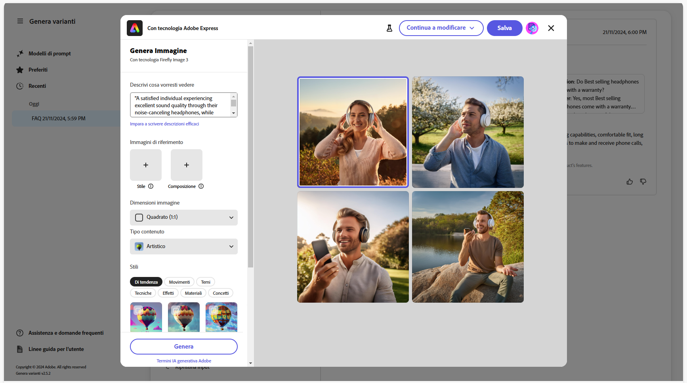
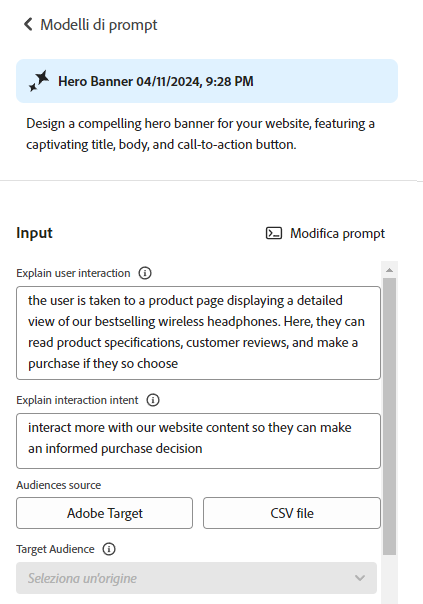

# Generare varianti {#generate-variations}


>[!NOTE]
>
>È consigliabile accedere alla funzione [Genera varianti integrata negli editor di AEM](/help/generative-ai/generate-variations-integrated-editor.md), in quanto la versione descritta in questa pagina diventerà obsoleta in futuro.

Se stai cercando un modo per ottimizzare i canali digitali e accelerare la creazione di contenuti, puoi utilizzare la funzione Genera varianti. La funzione Genera varianti utilizza l’intelligenza artificiale (IA) generativa per creare varianti di contenuto in base ai prompt; questi prompt vengono forniti da Adobe oppure creati e gestiti dagli utenti. Dopo aver creato le varianti, puoi utilizzare il contenuto del tuo sito Web e misurarne il successo utilizzando la funzionalità [Sperimentazione](https://www.aem.live/docs/experimentation) di [Edge Delivery Services](/help/edge/overview.md).

Puoi [accedere a Genera varianti](#access-generate-variations) da:

* [all’interno di Adobe Experience Manager (AEM) as a Cloud Service](#access-aemaacs)
* [dalla barra laterale di Edge Delivery Services AEM](#access-aem-sidekick)
* [all’interno dell’editor di frammenti di contenuto](/help/sites-cloud/administering/content-fragments/authoring.md#generate-variations-ai)

>[!NOTE]
>
>In tutti i casi, per utilizzare la funzione Genera varianti è necessario assicurarsi che siano soddisfatti i [prerequisiti di accesso](#access-prerequisites).

Puoi effettuare le seguenti operazioni:

* [Inizia](#get-started) utilizzando un modello di prompt creato da Adobe per un caso d’uso specifico.
* Puoi [modificare un prompt esistente](#edit-the-prompt)
* Oppure [creare e utilizzare i tuoi prompt](#create-prompt):
   * [Salvare i prompt](#save-prompt) per utilizzi futuri
   * [Accedere e utilizzare i prompt condivisi](#select-prompt) dall’intera organizzazione
* Definire i segmenti di [pubblico](#audiences) da utilizzare nel prompt durante la [generazione di contenuto personalizzato specifico per il pubblico](#generate-copy).
* Visualizzare l’anteprima dell’output insieme al prompt, prima di apportare modifiche e di perfezionare i risultati, se necessario.
* Utilizzare [Adobe Express per generare immagini](#generate-image) in base alle varianti di copia; in questo modo vengono utilizzate le funzionalità di intelligenza artificiale generativa di Firefly.
* Selezionare il contenuto da utilizzare sul tuo sito web o in un esperimento.

## Note legali e di utilizzo {#legal-usage-note}

L’intelligenza artificiale generativa e Genera varianti per AEM sono strumenti potenti, ma sei **tu** il responsabile dell’utilizzo dell’output.

I dati immessi nel servizio devono essere legati a un contesto. Questo contesto può essere costituito dai materiali di branding, dal contenuto del sito Web, dai dati, dagli schemi per tali dati, dai modelli o da altri documenti attendibili.

Devi valutare l’accuratezza di qualsiasi output in base al tuo caso d’uso.

Prima di utilizzare la funzione Genera varianti è necessario accettare le [linee guida per l’utente dell’intelligenza artificiale generativa di Adobe](https://www.adobe.com/legal/licenses-terms/adobe-dx-gen-ai-user-guidelines.html).

[L’utilizzo della funzione Genera varianti](#generative-action-usage) è legato al consumo di azioni generative.

## Panoramica {#overview}

Quando apri la funzione Genera varianti (ed espandi il pannello a sinistra) viene visualizzato:


* Pannello a destra
   * Questo dipende dalla selezione effettuata nel menu di navigazione a sinistra.
   * Per impostazione predefinita, vengono visualizzati **Modelli di prompt**.
* Navigazione a sinistra
   * A sinistra di **Genera varianti**, è presente l’opzione (menu sandwich) per espandere o nascondere il pannello di navigazione a sinistra.
   * **Modelli di prompt**:
      * Mostra collegamenti ai vari prompt, questi possono includere i seguenti tipi di prompt:
         * Forniti da Adobe per aiutarti a generare il contenuto; contrassegnati con l’icona Adobe.
         * Creati direttamente da te.
         * Creati all’interno della tua organizzazione IMS; contrassegnati con un’icona che mostra più teste.
      * Include il collegamento [Nuovo prompt](#create-prompt) per creare un prompt personalizzato.
      * Con **Elimina** puoi eliminare i prompt che hai creato o quelli creati nella tua organizzazione IMS. Questa operazione viene eseguita utilizzando il menu a cui si accede mediante i tre punti sulla scheda appropriata.
   * [Preferiti](#favorites): mostra i risultati delle generazioni precedenti che sono stati contrassegnati come Preferiti.
   * [Recenti](#recents): fornisce collegamenti ai prompt e ai relativi input utilizzati di recente.
   * **Assistenza e domande frequenti**: collegamenti alla documentazione, incluse le domande frequenti.
   * **Linee guida per l’utente**: collegamenti alle linee guida legali.

## Introduzione {#get-started}

L’interfaccia ti guida nel processo di generazione dei contenuti. Dopo aver aperto l’interfaccia, il primo passaggio consiste nella selezione del prompt da utilizzare.

### Selezionare un prompt {#select-prompt}

Dal pannello principale, puoi selezionare:

* un modello di prompt fornito da Adobe per iniziare a generare contenuti;
* [Nuovo prompt](#create-prompt) per creare un prompt personalizzato;
* un modello che hai creato esclusivamente per uso personale;
* un modello creato da te o da altri utenti nella tua organizzazione.

Per distinguerli:

* I prompt forniti da Adobe sono contrassegnati dall’icona Adobe.
* I prompt disponibili nella tua organizzazione IMS sono contrassegnati da un’icona con più teste.
* I prompt privati non sono contrassegnati in modo specifico.


### Fornire l’input {#provide-inputs}

Per ogni prompt devi fornire determinate informazioni in modo che sia possibile ottenere contenuti appropriati dall’intelligenza artificiale generativa.

I campi di input ti guidano attraverso le varie informazioni necessarie. Per facilitare questa fase, alcuni campi dispongono di valori predefiniti, che puoi utilizzare o modificare in base alle tue esigenze, e descrizioni dei requisiti.

Esistono diversi campi di input chiave comuni a più prompt (alcuni campi non sono sempre disponibili):

* **Conteggio**/**Numero di**
   * Puoi selezionare quante varianti di contenuto desideri creare con una generazione.
   * L’etichetta varia a seconda del prompt, ad esempio Conteggio, Numero di varianti, Numero di idee, ecc.
* **Pubblico di origine**/**Pubblico target**
   * Consente di generare contenuti personalizzati per un pubblico specifico.
   * Adobe fornisce tipi di pubblico predefiniti oppure è possibile specificare tipi di pubblico aggiuntivi. Consulta [Tipi di pubblico](#audiences).
* **Contesto aggiuntivo**
   * Inserisci contenuti pertinenti per consentire all’IA generativa di creare una risposta migliore in base all’input fornito. Ad esempio, se devi un banner web per una pagina o un prodotto particolare, puoi includere informazioni sulla pagina o sul prodotto.
* **Temperatura** Consente di modificare la “temperatura” dell’IA di Adobe:
   * Una temperatura più elevata si allontana dal prompt per risultati più vari, casuali e creativi.
   * Una temperatura più bassa è più deterministica e rimane più vicina a quanto indicato nel prompt.
   * Per impostazione predefinita, la temperatura è impostata su 1. Puoi sperimentare con temperature diverse se i risultati generati non sono di tuo gradimento.
* **Modifica prompt**
   * Il [prompt sottostante può essere modificato](#edit-the-prompt) per perfezionare i risultati generati.

### Generare la copia {#generate-copy}

Dopo aver compilato i campi di input e/o modificato il prompt, puoi generare il contenuto e rivedere le risposte.

Seleziona **Genera** per visualizzare le risposte generate dall’IA generativa. Le varianti di contenuto generate vengono visualizzate sotto il prompt che le ha generate.


>[!NOTE]
>
>La maggior parte dei modelli di prompt di Adobe include una **Base logica IA** nella risposta della variante. Questo fornisce la trasparenza sul motivo per cui l’intelligenza artificiale generativa ha generato quella particolare variante.

Quando selezioni una singola variante, sono disponibili le seguenti azioni:

* **Preferita**
   * Contrassegnata come **Preferita** per utilizzi futuri (verrà visualizzata in [Preferite](#favorites)).
* Pollice su/Pollice giù
   * Utilizza gli indicatori pollice su / giù per inviare una notifica ad Adobe sulla qualità delle risposte.
* **Copia**
   * Copia negli Appunti per l’utilizzo durante l’authoring dei contenuti sul sito Web o in un [Esperimento](https://www.aem.live/docs/experimentation).
* **Rimuovi**

Se devi perfezionare gli input o i prompt, puoi apportare le modifiche e selezionare di nuovo **Genera** per ottenere un set di risposte nuove. Il nuovo prompt e la nuova risposta vengono visualizzati sotto il prompt e la risposta iniziali; è possibile scorrere verso l’alto e verso il basso per visualizzare i vari set di contenuti.

Sopra ogni set di varianti viene visualizzato il prompt che li ha creati con l’opzione **Riutilizza**. Se devi eseguire nuovamente un prompt con i relativi input, seleziona **Riutilizza** per ricaricarli in **Input**.

### Genera immagine {#generate-image}

Dopo aver generato varianti di testo, puoi generare immagini in Adobe Express utilizzando le funzionalità di intelligenza artificiale generativa di Firefly.

>[!NOTE]
>
>**Genera immagine** è disponibile solo se disponi di un diritto ad Adobe Express come parte dell’organizzazione IMS e di accesso concesso in Admin Console.

Seleziona una variante, seguita da **Genera immagine**, per aprire direttamente **Da testo a immagine** in [Adobe Express](https://www.adobe.com/it/express/). Il prompt viene precompilato in base alla selezione della variante e le immagini vengono generate automaticamente in base a tale prompt.



Puoi apportare ulteriori modifiche:

* [scrivi il tuo prompt in Adobe Express](https://helpx.adobe.com/it/firefly/using/tips-and-tricks.html) descrivendo ciò che desideri visualizzare,
* modifica le opzioni **Da testo a immagine**,
* quindi **Aggiorna** le immagini generate.

Puoi anche utilizzare **Esplora altro** per ulteriori possibilità.

Al termine, seleziona l’immagine desiderata e **Salva** per chiudere Adobe Express. L’immagine viene restituita e salvata con la variante.


Qui puoi passare il mouse sull‘’immagine per visualizzare le azioni relative a:

* **Copia**: [copia l’immagine negli Appunti per utilizzarla altrove](#use-content)
* **Modifica**: apri Adobe Express per apportare modifiche all’immagine
* **Scarica**: scarica l’immagine nel computer locale
* **Elimina**: rimuovi l’immagine dalla variante

>[!NOTE]
>
>I dati [Content Credentials](https://helpx.adobe.com/it/creative-cloud/help/content-credentials.html) non vengono mantenuti se sono utilizzati nell’authoring basato su documenti.

### Usare il contenuto {#use-content}

Per utilizzare il contenuto generato con l’intelligenza artificiale generativa, devi copiarlo negli Appunti per utilizzarlo altrove.

Questa operazione viene eseguita utilizzando le icone di copia:

* Per il testo: utilizza l’icona Copia, visibile nel pannello delle varianti
* Per l’immagine: passa il puntatore del mouse sull’immagine per visualizzare l’icona Copia

Una volta copiate negli Appunti, puoi incollare le informazioni da utilizzare per l’authoring dei contenuti del sito Web. Puoi anche eseguire un [esperimento](https://www.aem.live/docs/experimentation).

## Preferiti {#favorites}

Dopo aver esaminato il contenuto, puoi salvare le varianti selezionate come preferite.

Una volta salvate, vengono visualizzate in **Preferiti** nella barra di navigazione a sinistra. I preferiti sono persistenti (fino a quando li **Elimini** o quando cancelli la cache del browser).

* I preferiti e le varianti possono essere copiati/incollati negli Appunti per essere utilizzati nel contenuto del sito Web.
* I preferiti possono essere **Rimossi**.

## Recenti {#recents}

Questa sezione fornisce collegamenti alle attività recenti. Viene aggiunta una voce **Recente** dopo la selezione di **Genera**. La voce prende il nome dal prompt e da una marca temporale. Se selezioni un collegamento, questo carica il prompt, compila i campi di input richiesti e mostra le varianti generate.

## Modificare il prompt {#edit-the-prompt}

È possibile modificare il prompt sottostante. Puoi eseguire questa operazione:

* Se i risultati generati hanno bisogno di un’ulteriore ottimizzazione
* Se desideri modificare e [salvare il prompt](#save-prompt) per utilizzi futuri

Seleziona **Modifica prompt**:


Viene aperto l’editor del prompt, in cui è possibile apportare le modifiche necessarie:


### Aggiungere input di prompt {#add-prompt-inputs}

Quando crei o modifichi un prompt, potrebbe essere necessario aggiungere dei campi di input. I campi di input funzionano come variabili nel prompt e offrono la flessibilità di utilizzare lo stesso prompt in vari scenari. Consentono agli utenti di definire elementi specifici del prompt, senza doverlo scrivere per intero.

* Un campo è definito con parentesi graffe doppie `{{ }}` che racchiudono un nome segnaposto.
Esempio: `{{tone_of_voice}}`.

  >[!NOTE]
  >
  >Non sono consentiti spazi tra le parentesi graffe doppie.

* Viene anche definito in `METADATA`, con i seguenti parametri:
   * `label`
   * `description`
   * `default`
   * `type`

#### Esempio: Aggiungi nuovo campo di testo - Tono di voce {#example-add-new-text-field-tone-of-voice}

Per aggiungere un nuovo campo di testo con titolo **Tono di voce**, utilizza nel prompt la sintassi che segue:

```prompt
{{@tone_of_voice, 
  label="Tone of voice",
  description="Indicate the desired tone of voice",
  default="optimistic, smart, engaging, human, and creative",
  type=text
}}
```


<!--
#### Example: Add new dropdown field - Page Type {#example-add-new-dropdown-field-page-type}

To create an input field Page Type providing a dropdown selection:

1. Create a spreadsheet named `pagetype.xls` in the top-level directory of your folder structure.
1. Edit the spreadsheet:

   1. Create two columns: **Key** and **Value**.
   1. In the **Key** column, enter labels that will appear in the dropdown.
   1. In the **Value** column, describe the key value so the generative AI has context.

1. In your prompt, refer to the title of the spreadsheet along with the appropriate type. 

   ```prompt
   {{@page_type, 
     label="Page Type",
     description="Describes the type of page",
     spreadsheet=pagetype
   }}
   ```
-->

## Creare un prompt {#create-prompt}

Quando selezioni **Nuovo prompt** da **Modelli di prompt**, un nuovo pannello ti consente di inserire un nuovo prompt. Potrai quindi specificare queste informazioni, insieme alla **Temperatura**, per **generare** il contenuto.

Per dettagli su come salvare il prompt in futuro, consulta la sezione [Salvare il prompt](#save-prompt).

Per dettagli sull’aggiunta di input di prompt personalizzati, consulta [Aggiungere input di prompt](#add-prompt-inputs).

Se desideri mantenere la formattazione sia nell’interfaccia utente che quando viene copiata e incollata nel flusso di authoring basato su documenti, includi quanto segue nel prompt:

<!-- CHECK - are the double-quotes needed? -->

* `"Format the response as an array of valid, iterable RFC8259 compliant JSON"`

La seguente immagine mostra i vantaggi di questa operazione:

* nel primo esempio `Title` e `Description` sono combinati
* mentre nel secondo esempio vengono formattati separatamente: questa operazione è stata eseguita includendo la richiesta JSON nel prompt.


## Salva il prompt {#save-prompt}

Dopo aver modificato o creato i prompt, questi possono essere salvati per essere utilizzati in futuro da te o dalla tua organizzazione IMS. Il prompt saltavo verrà visualizzato come scheda **Modello di prompt**.

Dopo aver modificato il prompt, l’opzione **Salva** è disponibile nella parte inferiore della sezione Input, a sinistra di **Genera**.

Se questa opzione è selezionata, si apre la finestra di dialogo **Salva prompt**:


1. Aggiungi un **Nome del prompt** univoco, utilizzato per identificare il prompt all’interno dei **Modelli di prompt**.
   1. Un nuovo nome univoco crea un nuovo modello di prompt.
   1. Un nome esistente sovrascrive il relativo prompt esistente; viene visualizzato un messaggio.
1. Facoltativamente, aggiungi una descrizione.
1. Attiva o disattiva l’opzione **Condiviso tra più organizzazioni**, a seconda che il prompt sia privato o disponibile nell’organizzazione IMS. Questo stato viene visualizzato nella [scheda risultante in Modelli di prompt](#select-prompt).
1. **Salva** il prompt oppure **Annulla** l’azione.

>[!NOTE]
>
>Un eventuale messaggio ti avvisa in caso di sovrascrittura/aggiornamento di un prompt esistente.

>[!NOTE]
>
>Da **Modelli di prompt** puoi eliminare i prompt (utilizzando il menu a cui si accede con i tre punti) creati da te o da altri utenti della tua organizzazione IMS.

## Pubblico {#audiences}

Per generare contenuti personalizzati, l’intelligenza artificiale generativa deve comprendere il pubblico. Adobe fornisce una serie di tipi di pubblico predefiniti oppure puoi aggiungerne altri.

Quando aggiungi un pubblico, dovresti descriverlo in linguaggio naturale. Ad esempio:

* per creare un pubblico:
   * `Student`
* potresti dire:
   * `The audience consists of students, typically individuals who are pursuing education at various academic levels, such as primary, secondary, or tertiary education. They are engaged in learning and acquiring knowledge in diverse subjects, seeking academic growth, and preparing for future careers or personal development.`

Sono supportate due origini di pubblico:

* [Adobe Target](#audience-adobe-target)
* [File CSV](#audience-csv-file)



### Pubblico - Adobe Target {#audience-adobe-target}

La selezione di un pubblico di **Adobe Target** nel prompt consente di personalizzare la generazione di contenuto per tale pubblico.

>[!NOTE]
>
>Per utilizzare questa opzione, l’organizzazione IMS deve avere accesso ad Adobe Target.

1. Seleziona **Adobe Target**.
1. Quindi seleziona il **Pubblico target** richiesto dall’elenco fornito.

   >[!NOTE]
   >
   >Per utilizzare un pubblico di **Adobe Target** è necessario compilare il campo relativo alla descrizione. In caso contrario, il pubblico viene visualizzato nell’elenco a discesa come non disponibile. Per aggiungere una descrizione, passa a Target e [aggiungi una descrizione del pubblico](https://experienceleague.adobe.com/it/docs/target-learn/tutorials/audiences/create-audiences).

   

#### Aggiungere pubblico di Adobe Target {#add-adobe-target-audience}

Consulta [Creare tipi di pubblico](https://experienceleague.adobe.com/it/docs/target-learn/tutorials/audiences/create-audiences) per creare un pubblico in Adobe Target.

### Pubblico - File CSV {#audience-csv-file}

La selezione di un pubblico del **file CSV** nel prompt consente di personalizzare la generazione di contenuto per il **Pubblico target** selezionato.

Adobe fornisce diversi tipi di pubblico da utilizzare.

1. Seleziona **File CSV**.
1. Quindi seleziona il **Pubblico target** richiesto dall’elenco fornito.

   

#### Aggiungere il file CSV del pubblico {#add-audience-csv-file}

Puoi aggiungere un file CSV da varie piattaforme (ad esempio, Google Drive, Dropbox, Sharepoint) che hanno la capacità di fornire un URL al file una volta reso pubblicamente disponibile.

>[!NOTE]
>
>Nelle piattaforme di condivisione è *necessario* rendere il file accessibile al pubblico.

Ad esempio, per aggiungere un pubblico da un file su Google Drive:

1. In Google Drive, crea un file di foglio di calcolo con due colonne:
   1. La prima colonna verrà visualizzata nel menu a discesa.
   1. La seconda colonna sarà la descrizione del pubblico.
1. Pubblica il file:
   1. File -> Condividi -> Pubblica sul Web -> CSV
1. Copia l’URL nel file pubblicato.
1. Passa a Genera varianti.
1. Apri l’editor del prompt.
1. Trova il pubblico **Adobe Target** nei metadati e sostituisci l’URL.

   >[!NOTE]
   >
   >Assicurati che le virgolette doppie (”) siano mantenute su entrambe le estremità dell’URL.

   Ad esempio:

   

## Utilizzo azione generativa {#generative-action-usage}

La gestione dell’utilizzo dipende dall’azione intrapresa:

* Generare varianti

  Una generazione di una variante di copia è uguale a un’azione generativa. In qualità di cliente, hai un certo numero di azioni generative che vengono fornite con la tua licenza AEM. Una volta utilizzato il diritto di base, puoi acquistare azioni aggiuntive.

  >[!NOTE]
  >
  >Consulta [Adobe Experience Manager: Cloud Service | Descrizione del prodotto](https://helpx.adobe.com/it/legal/product-descriptions/aem-cloud-service.html) per ulteriori dettagli sui diritti di base e rivolgiti al team del tuo account per acquistare più azioni generative.

* Adobe Express

  L’utilizzo della generazione di immagini viene gestito tramite diritti di Adobe Express e [crediti generativi](https://helpx.adobe.com/it/firefly/using/generative-credits-faq.html).

## Accedere a Genera varianti {#access-generate-variations}

Dopo aver soddisfatto i prerequisiti, puoi accedere a Genera varianti da AEM as a Cloud Service o dalla barra laterale di Edge Delivery Services.

### Prerequisiti di accesso {#access-prerequisites}

Per utilizzare Genera varianti è necessario assicurarsi che i prerequisiti siano soddisfatti:

* [Accesso ad Experience Manager as a Cloud Service con Edge Delivery Services](#access-to-aemaacs-with-edge-delivery-services)

#### Accesso ad Experience Manager as a Cloud Service con Edge Delivery Services{#access-to-aemaacs-with-edge-delivery-services}

Gli utenti che hanno bisogno di accedere a Genera varianti devono avere diritto a un ambiente Experience Manager as a Cloud Service con Edge Delivery Services.

>[!NOTE]
>
>Se il tuo contratto per AEM Sites as a Cloud Service non include Edge Delivery Services, dovrai firmare un nuovo contratto per ottenere l’accesso.
>
>Rivolgiti al team del tuo account per scoprire come passare ad AEM Sites as a Cloud Service con Edge Delivery Services.

Per concedere l’accesso a utenti specifici, assegna il loro account utente al rispettivo profilo di prodotto. Consulta [Assegnazione dei profili di prodotto AEM per ulteriori dettagli](/help/journey-onboarding/assign-profiles-cloud-manager.md).

### Accesso da AEM as a Cloud Service {#access-aemaacs}

Genera varianti è accessibile dal [pannello di navigazione](/help/sites-cloud/authoring/basic-handling.md#navigation-panel) di AEM as a Cloud Service:


### Accesso dalla barra laterale di AEM {#access-aem-sidekick}

Sono necessarie alcune configurazioni prima di poter accedere a Genera varianti dalla barra laterale (di Edge Delivery Services).

1. Per informazioni su come installare e configurare la barra laterale, consulta il documento [Installazione della barra laterale di AEM](https://www.aem.live/docs/sidekick-extension).

1. Per utilizzare Genera varianti nella barra laterale (di Edge Delivery Services), includi la seguente configurazione nei progetti di Edge Delivery Services in:

   * `tools/sidekick/config.json`

   Deve essere unito alla configurazione esistente e quindi implementato.

   Ad esempio:

   ```prompt
   {
     // ...
     "plugins": [
       // ...
       {
         "id": "generate-variations",
         "title": "Generate Variations",
         "url": "https://experience.adobe.com/aem/generate-variations",
         "passConfig": true,
         "environments": ["preview","live", "edit"],
         "includePaths": ["**.docx**"]
       }
       // ...
     ]
   }
   ```

1. Potresti doverti assicurare che gli utenti abbiano [Accesso ad Experience Manager as a Cloud Service con Edge Delivery Services](#access-to-aemaacs-with-edge-delivery-services).

1. Puoi quindi accedere alla funzione selezionando **Genera varianti** dalla barra degli strumenti della barra laterale:

   

## Ulteriori informazioni {#further-information}

Per ulteriori informazioni, consulta anche:

* [Genera varianti GenAI su GitHub](https://github.com/adobe/aem-genai-assistant#setting-up-aem-genai-assistant)
* [Sperimentazione di Edge Delivery Services](https://www.aem.live/docs/experimentation)
* [IA generativa in AEM as a Cloud Service](/help/ai-in-aem/overview.md#generative-ai-in-aem)

## Domande frequenti {#faqs}

### Output formattato {#formatted-outpu}

**La risposta generata non fornisce l’output formattato necessario. Come si modifica il formato? Esempio: è necessario un titolo e un sottotitolo, ma la risposta è solo un titolo**

1. Apri il prompt effettivo in modalità di modifica.
1. Passa ai requisiti.
1. Troverai requisiti che si riferiscono all’output.
   1. Esempio: “Il testo deve essere costituito da tre parti: un titolo, un corpo e un’etichetta di pulsante.” Oppure “Formatta la risposta come array JSON valido di oggetti con gli attributi “Titolo”, “Body” e “ButtonLabel”.
1. Modifica i requisiti in base alle tue esigenze.

   >[!NOTE]
   >
   >Se il nuovo output inserito è soggetto a restrizioni per il conteggio di parole/caratteri, crea un requisito.

   Esempio: “Il testo del titolo non deve superare le 10 parole o i 50 caratteri, spazi inclusi.”
1. Salva il prompt per un utilizzo futuro.

### Lunghezza della risposta {#length-of-response}

**La risposta generata è troppo lunga o troppo breve. Come si modifica la lunghezza?**

1. Apri il prompt effettivo in modalità di modifica.
1. Passa ai requisiti.
1. Troverai che per ogni output, esiste un limite corrispondente parola/carattere.
   1. Esempio: “Il testo del titolo non deve superare le 10 parole o i 50 caratteri, spazi inclusi.”
1. Modifica i requisiti in base alle tue esigenze.
1. Salva il prompt per un utilizzo futuro.

### Migliorare le risposte {#improve-responses}

**Le risposte ricevute non sono esattamente ciò che sto cercando. Che cosa posso fare per migliorarle?**

1. Prova a modificare la temperatura in Impostazioni avanzate.
   1. Una temperatura più elevata si allontana dal prompt per risultati più vari, casuali e creativi.
   1. Una temperatura più bassa è più deterministica e rispetta ciò che si trova nel prompt.
1. Apri il prompt effettivo in modalità di modifica ed esaminalo. Presta particolare attenzione alla sezione dei requisiti che descrive il tono di voce e altri criteri importanti.

### Commenti in un prompt {#comments-in-prompt}

**Come posso usare i commenti in un prompt?**

I commenti in un prompt vengono utilizzati per includere note, spiegazioni o istruzioni che non devono far parte dell’output effettivo. Questi commenti sono racchiusi in una sintassi specifica: iniziano e terminano con doppie parentesi graffe e iniziano con un hash (ad esempio, `{{# Comment Here }}`). I commenti aiutano a chiarire la struttura o l’intento del prompt senza influire sulla risposta generata.

### Trovare un prompt condiviso {#find-a-shared-prompt}

**Che cosa posso fare se non riesco a trovare un modello di prompt condiviso da qualcuno?**

In questa situazione ci sono vari dettagli da verificare:

1. Utilizza l’URL per l’ambiente.
Ad esempio: https://experience.adobe.com/#/aem/generate-variations
1. Verifica che l’organizzazione IMS selezionata sia corretta.
1. Conferma che il prompt sia stato salvato come condiviso.

### Prompt personalizzati nella versione v2.0.0 {#custom-prompts-v200}

**Nella versione 2.0.0 i prompt personalizzati non sono più visibili. Che cosa posso fare?**

Il passaggio alla versione v2.0.0 causerà l’interruzione dei modelli di prompt personalizzati, che pertanto non saranno disponibili.

Per recuperarli:

1. Passa alla cartella dei modelli di prompt in Sharepoint.
1. Copia il prompt.
1. Apri l’applicazione Genera varianti.
1. Seleziona la scheda Nuovo prompt.
1. Incolla il prompt.
1. Verifica che il prompt funzioni.
1. Salva il prompt.

## Cronologia delle versioni {#release-history}

Per informazioni dettagliate sulle versioni correnti e precedenti, consulta le [Note sulla versione per Genera varianti](/help/generative-ai/release-notes-generate-variations.md)
