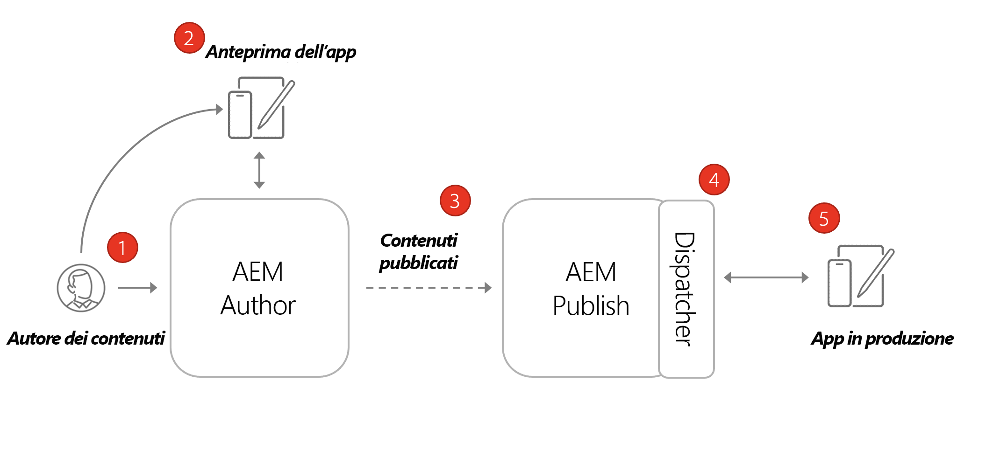
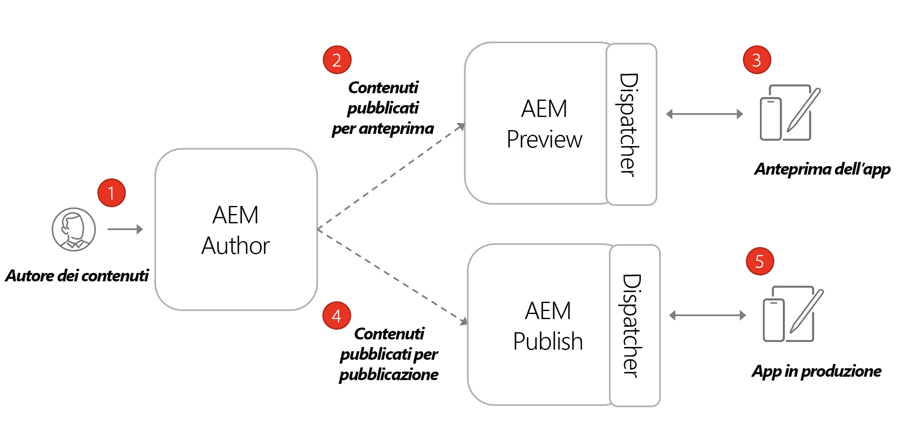

# Architettura AEM headless

Un ambiente AEM tipico è costituito da un servizio di authoring, un servizio di pubblicazione e da un servizio di anteprima opzionale.

* Il **servizio di authoring** è il luogo in cui gli utenti interni creano, gestiscono e visualizzano in anteprima i contenuti.

* Il **servizio di pubblicazione** è considerato l’ambiente “live” ed è normalmente ciò con cui gli utenti finali interagiscono. I contenuti vengono modificati e approvati nel servizio di authoring e quindi distribuiti al servizio di pubblicazione. Il modello di implementazione più comune per le applicazioni headless AEM consiste nella connessione della versione di produzione dell’applicazione a un servizio di pubblicazione AEM.

* Il **servizio di anteprima** funziona come il **servizio di pubblicazione**. Tuttavia, viene reso disponibile solo agli utenti interni. Questo lo rende un sistema ideale per consentire agli approvatori di rivedere le imminenti modifiche al contenuto prima che sia reso live per gli utenti finali.

* Il **Dispatcher** è un server web statico potenziato con il modulo dispatcher AEM. Fornisce funzionalità di caching e un ulteriore livello di sicurezza. Il **Dispatcher** è posto davanti ai servizi di **pubblicazione** e **anteprima**.

All’interno di un programma AEM as a Cloud Service puoi avere diversi ambienti: Dev, Stage e Prod. Ogni ambiente ha il proprio servizio specifico di **authoring**, **pubblicazione** e **anteprima**. Per ulteriori informazioni, consulta [Gestione degli ambienti](/help/implementing/cloud-manager/manage-environments.md).

## Modello di pubblicazione di authoring

Il modello di implementazione più comune per le applicazioni headless AEM consiste nella connessione della versione di produzione dell’applicazione a un servizio di pubblicazione AEM.

Il diagramma riportato sopra mostra questo diffuso pattern di distribuzione.

1. Un **autore del contenuto** utilizza il servizio di authoring di AEM per creare, modificare e gestire i contenuti.
1. L’**autore del contenuto** e altri utenti interni possono visualizzare in anteprima il contenuto direttamente sul servizio di authoring. È possibile impostare una versione di anteprima dell’applicazione che si connette al servizio di authoring.
1. Una volta approvato, il contenuto può essere pubblicato nel servizio di pubblicazione AEM.
1. Il **Dispatcher** è un livello davanti al servizio di **pubblicazione** che può memorizzare in cache determinate richieste e aggiunge un livello di sicurezza.
1. Gli utenti finali interagiscono con la versione di produzione dell’applicazione. L’applicazione di produzione si connette al servizio di pubblicazione tramite Dispatcher e utilizza le API GraphQL per richiedere e utilizzare i contenuti.

## Implementazione pubblicazione anteprima authoring

Un’altra opzione per le distribuzioni headless consiste nell’incorporare un servizio di **anteprima AEM**. Con questo approccio, il contenuto può essere pubblicato prima in **anteprima** in modo che una versione di anteprima dell’applicazione headless ci si possa connettere. Il vantaggio di questo approccio è che il servizio di **anteprima** può essere impostato con gli stessi requisiti e le stesse autorizzazioni di autenticazione del servizio di **pubblicazione** per simulare più facilmente l’esperienza di produzione.

1. Un **autore del contenuto** utilizza il servizio di authoring di AEM per creare, modificare e gestire i contenuti.
1. Il contenuto viene pubblicato inizialmente nel servizio anteprima AEM.
1. È possibile impostare una versione di anteprima dell’applicazione che si connette al servizio di anteprima.
1. Una volta rivisto e approvato il contenuto, questo può essere pubblicato nel servizio di pubblicazione AEM.
1. Gli utenti finali interagiscono con la versione di produzione dell’applicazione. L’applicazione di produzione si connette al servizio di pubblicazione tramite Dispatcher e utilizza le API GraphQL per richiedere e utilizzare i contenuti.
