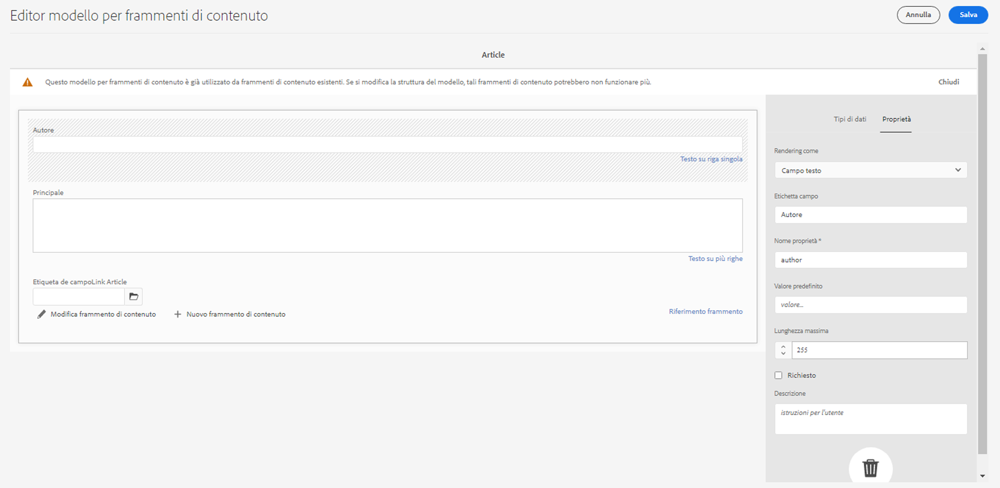

# API GraphQL AEM per l’utilizzo con Frammenti di contenuto {#graphql-api-for-use-with-content-fragments}

Scopri come utilizzare Frammenti di contenuto in Adobe Experience Manager (AEM) as a Cloud Service con l’API GraphQL AEM per la consegna di contenuti headless.

L’API GraphQL AEM as a Cloud Service utilizzata con i Frammenti di contenuto è pesantemente basata sull’API GraphQL standard open source.

L’utilizzo dell’API GraphQL in AEM consente la consegna efficiente di Frammenti di contenuto ai client JavaScript in implementazioni CMS headless:

* evita richieste API iterative come con REST,
* garantisce che la consegna sia limitata ai requisiti specifici,
* consente la consegna in massa di ciò che è esattamente necessario per il rendering come risposta a una singola query API.

>[!NOTE]
>
>GraphQL è attualmente utilizzato in due scenari (separati) in Adobe Experience Manager (AEM) as a Cloud Service:
>
>* [AEM Commerce sfrutta i dati da una piattaforma Commerce tramite GraphQL.](/help/commerce-cloud/cif-storefront/integrating/magento.md)
>* I Frammenti di contenuto AEM collaborano con l’API GraphQL di AEM (un’implementazione personalizzata, basata su GraphQL standard) per fornire contenuti strutturati da utilizzare nelle applicazioni.

>[!NOTE]
>
>Consulta [API di AEM per la distribuzione e la gestione strutturata dei contenuti](/help/headless/apis-headless-and-content-fragments.md) per una panoramica delle varie API disponibili e un confronto di alcuni dei concetti coinvolti.

>[!NOTE]
>
>Per informazioni aggiornate sulle API di Experience Manager, visita anche [API di Adobe Experience Manager as a Cloud Service](https://developer.adobe.com/experience-cloud/experience-manager-apis/).

## API GraphQL {#graphql-api}

GraphQL è:

* “*...un linguaggio di query per le API e un runtime per l’esecuzione di tali query con i dati esistenti. GraphQL fornisce una descrizione completa e comprensibile dei dati nell’API, offre ai clienti la possibilità di chiedere esattamente ciò di cui hanno bisogno e niente di più, semplifica l’evoluzione delle API nel tempo e abilita potenti strumenti per gli sviluppatori.*”.

  Vedi [GraphQL.org](https://graphql.org)

* “*...una specifica aperta per un livello API flessibile. Posiziona GraphQL sui backend esistenti per costruire prodotti più rapidamente che mai....*”.

  Vedi [Esplorare GraphQL](https://www.graphql.com).

* *“..un linguaggio e una specifica di query di dati sviluppati internamente da Facebook nel 2012 prima di essere resi open source nel 2015. Offre un’alternativa alle architetture basate su REST allo scopo di aumentare la produttività degli sviluppatori e ridurre al minimo le quantità di dati trasferiti. GraphQL viene utilizzato in produzione da centinaia di organizzazioni di tutte le dimensioni...”*

  Vedi [GraphQL Foundation](https://foundation.graphql.org/).

<!--
"*Explore GraphQL is maintained by the Apollo team. Our goal is to give developers and technical leaders around the world the tools they need to understand and adopt GraphQL.*". 
-->

Per ulteriori informazioni sull’API GraphQL, consulta le sezioni seguenti (tra molte altre risorse):

* In [graphql.org](https://graphql.org):

   * [Introduzione a GraphQL](https://graphql.org/learn)

   * [Specifiche GraphQL](https://spec.graphql.org/)

* In [graphql.com](https://graphql.com):

   * [Guide](https://www.graphql.com/guides/)

   * [Esercitazioni](https://www.graphql.com/tutorials/)

   * [Casi di studio](https://www.graphql.com/case-studies/)

L’implementazione di GraphQL per AEM si basa sulla libreria Java GraphQL standard. Consulta:

* [graphQL.org - Java](https://graphql.org/code/#java)

* [Java GraphQL su GitHub](https://github.com/graphql-java)

### Terminologia GraphQL {#graphql-terminology}

GraphQL utilizza quanto segue:

* **[Query](https://graphql.org/learn/queries/)**

* **[Schemi e tipi](https://graphql.org/learn/schema/)**:

   * Gli schemi vengono generati da AEM in base ai modelli di Frammenti di contenuto.
   * Utilizzando i tuoi schemi, GraphQL presenta i tipi e le operazioni consentiti per l’implementazione GraphQL per AEM.

* **[Campi](https://graphql.org/learn/queries/#fields)**

* **[Endpoint GraphQL](graphql-endpoint.md)**
   * Il percorso in AEM che risponde alle query GraphQL e fornisce accesso agli schemi GraphQL.

   * Consulta [Abilitazione dell’endpoint GraphQL](graphql-endpoint.md) per ulteriori dettagli.

Consulta[(GraphQL.org) Introduzione a GraphQL](https://graphql.org/learn/) per informazioni complete, che comprendono le [Best practice](https://graphql.org/learn/best-practices/).

### Tipi di query GraphQL {#graphql-query-types}

Con GraphQL è possibile eseguire query per ottenere:

* Un **ingresso singolo**

* Un **[elenco delle voci](https://graphql.org/learn/schema/#lists-and-non-null)**

AEM fornisce funzionalità per convertire le query (di entrambi i tipi) in [query persistenti, che possono essere memorizzate nella cache](/help/headless/graphql-api/persisted-queries.md) da Dispatcher e CDN.

### Best practice per le query GraphQL (Dispatcher e CDN) {#graphql-query-best-practices}

Le [Query persistenti](/help/headless/graphql-api/persisted-queries.md) sono il metodo consigliato da utilizzare nelle istanze di pubblicazione come:

* vengono memorizzate nella cache;
* sono gestite centralmente da AEM as a Cloud Service

>[!NOTE]
>
>Di solito non esiste un dispatcher/CDN sull’autore, quindi in quel caso non c’è alcun vantaggio nell’utilizzo di query persistenti; oltre ai test.

Le query GraphQL con l’utilizzo di POST non sono consigliate in quanto non sono memorizzate nella cache. Quindi, in un’istanza predefinita, Dispatcher è configurato per bloccarle.

Anche se GraphQL supporta le richieste GET, queste possono raggiungere dei limiti (ad esempio, la lunghezza dell’URL) che possono essere evitati utilizzando query persistenti.

Per ulteriori dettagli, vedere [Abilitare la memorizzazione nella cache delle query persistenti](/help/headless/deployment/dispatcher-caching.md).

>[!NOTE]
>
>Per consentire query dirette e/o POST in Dispatcher, puoi chiedere all’amministratore di sistema di:
>
>* Creare una [variabile di ambiente Cloud Manager](/help/implementing/cloud-manager/environment-variables.md) denominata `ENABLE_GRAPHQL_ENDPOINT`
>* con il valore `true`

>[!NOTE]
>
>In futuro, la capacità di eseguire query dirette potrebbe diventare obsoleta.

### IDE GraphiQL {#graphiql-ide}

Puoi testare ed eseguire il debug delle query GraphQL utilizzando [IDE GraphiQL](/help/headless/graphql-api/graphiql-ide.md).

## Casi d’uso per authoring, anteprima e pubblicazione {#use-cases-author-preview-publish}

I casi di utilizzo possono dipendere dal tipo di ambiente AEM as a Cloud Service:

* ambiente di pubblicazione; utilizzato per:
   * effettuare query sui dati per l’applicazione JS (caso di utilizzo standard)

* Ambiente di anteprima; utilizzato per:
   * Anteprima delle query prima della distribuzione nell’ambiente di pubblicazione
      * effettuare query sui dati per l’applicazione JS (caso di utilizzo standard)

* ambiente di authoring; utilizzato per:
   * effettuare query sui dati a “scopo di gestione dei contenuti”:
      * GraphQL in AEM as a Cloud Service è attualmente un’API di sola lettura.
      * L’API REST può essere utilizzata per le operazioni CR(u)D.

## Autorizzazioni {#permission}

Le autorizzazioni sono quelle necessarie per accedere ad Assets.

Le query GraphQL vengono eseguite con l’autorizzazione dell’utente AEM della richiesta sottostante. Se l’utente non dispone dell’accesso in lettura ad alcuni frammenti (memorizzati come risorse), questi non faranno parte del set di risultati.

Inoltre, l’utente deve avere accesso a un endpoint GraphQL per poter eseguire le query GraphQL.

## Generazione schema {#schema-generation}

GraphQL è un’API fortemente tipizzata, il che significa che i dati devono essere chiaramente strutturati e organizzati per tipo.

La specifica GraphQL fornisce una serie di linee guida su come creare una solida API per l’interrogazione dei dati su una determinata istanza. Per eseguire questa operazione, un client deve recuperare lo [schema](#schema-generation), che contiene tutti i tipi necessari per una query.

Per quanto riguarda i Frammenti di contenuto, gli schemi GraphQL (struttura e tipi) sono basati su [modelli di Frammenti di contenuto](/help/sites-cloud/administering/content-fragments/managing-content-fragment-models.md) **abilitati** e i relativi tipi di dati.

>[!CAUTION]
>
>Tutti gli schemi GraphQL (derivati dai modelli di Frammenti di contenuto che sono stati **abilitati**) sono leggibili attraverso l’endpoint GraphQL.
>
>Ciò significa che devi assicurarti che non siano disponibili dati sensibili, che in questo modo potrebbero trapelare; ad esempio, informazioni che potrebbero essere presenti come nomi di campo nella definizione del modello.

Ad esempio, se un utente ha creato un modello di frammento di contenuto denominato `Article`, AEM genera un tipo GraphQL `ArticleModel`. I campi all’interno di questo tipo corrispondono ai campi e ai tipi di dati definiti nel modello. Inoltre, crea alcuni punti di ingresso per le query che operano su questo tipo, come `articleByPath` o `articleList`.

1. Modello di Frammento di contenuto:

   

1. Lo schema GraphQL corrispondente (output dalla documentazione automatica GraphiQL):
   

   Questo mostra che il tipo `ArticleModel` generato contiene diversi [campi](#fields).

   * Tre di essi sono stati controllati dall’utente: `author`, `main` e `referencearticle`.

   * Gli altri campi sono stati aggiunti automaticamente da AEM e rappresentano metodi utili per fornire informazioni su un determinato Frammento di contenuto; in questo esempio (i [campi di supporto](#helper-fields)) `_path`, `_metadata`, `_variations`.

1. Un Frammento di contenuto basato sul modello di articolo creato da un utente può essere interrogato tramite GraphQL. Per esempi, consulta la sezione [Query di esempio](/help/headless/graphql-api/sample-queries.md#graphql-sample-queries) (basata su una [struttura di Frammento di contenuto di esempio da utilizzare con GraphQL](/help/headless/graphql-api/sample-queries.md#content-fragment-structure-graphql)).

In GraphQL per AEM, lo schema è flessibile. Ciò significa che viene generato automaticamente ogni volta che viene creato, aggiornato o eliminato un modello di Frammento di contenuto. Le cache dello schema dati vengono aggiornate anche quando si rivede un modello di Frammento di contenuto.

<!-- move the following to a separate "in depth" page -->

Le cache dello schema dati vengono aggiornate anche quando si rivede un modello di Frammento di contenuto.

Il servizio GraphQL di Sites ascolta (in background) le modifiche apportate a un modello di Frammento di contenuto. Quando vengono rilevati aggiornamenti, viene rigenerata solo la parte dello schema. Questa ottimizzazione consente di risparmiare tempo e garantisce stabilità.

Ad esempio, se:

1. Installi un pacchetto contenente `Content-Fragment-Model-1` e `Content-Fragment-Model-2`:

   1. sono generati tipi di GraphQL per `Model-1` e `Model-2`.

1. Poi modifica `Content-Fragment-Model-2`:

   1. verrà aggiornato solo il tipo GraphQL `Model-2`.

   1. mentre `Model-1` rimarrà lo stesso.

>[!NOTE]
>
>Questo è importante da notare nel caso in cui desideri eseguire aggiornamenti in blocco sui modelli di Frammento di contenuto tramite l’API REST o in altro modo.

Lo schema viene gestito attraverso lo stesso endpoint delle query GraphQL, dove il client gestisce il fatto che lo schema viene chiamato con l’estensione `GQLschema`. Ad esempio, l’esecuzione di una semplice richiesta `GET` di `/content/cq:graphql/global/endpoint.GQLschema` si tradurrà nell’output dello schema con il tipo di contenuto: `text/x-graphql-schema;charset=iso-8859-1`.

<!-- move through to here to a separate "in depth" page -->

### Generazione schema: modelli non pubblicati {#schema-generation-unpublished-models}

Quando i frammenti di contenuto sono nidificati, può accadere che venga pubblicato un modello di Frammento di contenuto principale, ma non il modello di riferimento.

>[!NOTE]
>
>L’interfaccia utente AEM impedisce che ciò accada, ma se la pubblicazione viene effettuata a livello di programmazione o con pacchetti di contenuto può verificarsi.

In questo caso, AEM genera uno schema *incompleto* per il modello di Frammento di contenuto principale. Ciò significa che il Riferimento al frammento, che dipende dal modello non pubblicato, viene rimosso dallo schema.

## Campi {#fields}

Nello schema sono presenti singoli campi, di due categorie di base:

* Campi generati dall’utente.

  Per creare campi in base alla modalità di configurazione del modello di frammento di contenuto, viene utilizzata una selezione di [Tipi di dati](#Data-types). I nomi dei campi vengono ricavati dal campo **Nome proprietà** della scheda **Tipo di dati**.

   * C’è da prendere in considerazione anche l’impostazione **Rendering come**, in quanto gli utenti possono configurare determinati tipi di dati. Ad esempio, è possibile configurare un campo di testo a riga singola per contenere più testi a riga singola scegliendo `multifield` dall&#39;elenco a discesa.

* GraphQL per AEM genera anche diversi [campi di supporto](#helper-fields).

### Tipi di dati {#data-types}

GraphQL per AEM supporta un elenco di tipi. Vengono rappresentati tutti i tipi di dati dei modelli di Frammento di contenuto supportati e i corrispondenti tipi GraphQL:

| Modello di Frammento di contenuto: tipo di dati | Tipo GraphQL | Descrizione |
|--- |--- |--- |
| Testo su riga singola | `String`, `[String]` | Utilizzato per stringhe semplici come nomi di autore, nomi di posizione e così via. |
| Testo su più righe | `String`, `[String]` | Utilizzato per l’output di testo, ad esempio il corpo di un articolo |
| Numero | `Float`, `[Float]` | Utilizzato per visualizzare il numero a virgola mobile e i numeri regolari |
| Booleano | `Boolean` | Utilizzato per visualizzare le caselle di controllo → semplici istruzioni true/false |
| Data e ora | `Calendar` | Utilizzato per visualizzare la data e l’ora in formato ISO 8601. A seconda del tipo selezionato, sono disponibili tre versioni da utilizzare in AEM GraphQL: `onlyDate`, `onlyTime`, `dateTime` |
| Enumerazione | `String` | Utilizzato per visualizzare un’opzione da un elenco di opzioni definito durante la creazione del modello |
| Tag | `[String]` | Utilizzato per visualizzare un elenco di stringhe che rappresentano tag utilizzati in AEM |
| Riferimento contenuto | `String`, `[String]` | Utilizzato per visualizzare il percorso per un’altra risorsa in AEM |
| Riferimento contenuto (UUID) | `String`, `[String]` | Utilizzato per visualizzare il percorso, rappresentato da un UUID, verso un’altra risorsa in AEM |
| Riferimento frammento |  *Un tipo di modello* <br><br>Campo singolo: `Model` - Tipo di modello, a cui si fa riferimento direttamente <br><br>Multifield, con un tipo a cui si fa riferimento: `[Model]` - Array di tipo `Model`, a cui si fa riferimento direttamente dall&#39;array <br><br>Multifield, con più tipi a cui si fa riferimento: `[AllFragmentModels]` - Array di tutti i tipi di modello, a cui si fa riferimento dall&#39;array con tipo di unione |  Utilizzato per fare riferimento a uno o più frammenti di contenuto di alcuni tipi di modelli, definiti al momento della creazione del modello |
| Riferimento frammento (UUID) |  *Un tipo di modello* <br><br>Campo singolo: `Model` - Tipo di modello, a cui si fa riferimento direttamente <br><br>Multifield, con un tipo a cui si fa riferimento: `[Model]` - Array di tipo `Model`, a cui si fa riferimento direttamente dall&#39;array <br><br>Multifield, con più tipi a cui si fa riferimento: `[AllFragmentModels]` - Array di tutti i tipi di modello, a cui si fa riferimento dall&#39;array con tipo di unione |  Utilizzato per fare riferimento a uno o più frammenti di contenuto di alcuni tipi di modelli, definiti al momento della creazione del modello |

{style="table-layout:auto"}

### Campi di supporto {#helper-fields}

Oltre ai tipi di dati per i campi generati dall&#39;utente, GraphQL for AEM genera anche diversi campi *helper* per identificare un frammento di contenuto o per fornire informazioni aggiuntive su un frammento di contenuto.

Tali [campi di supporto](#helper-fields) sono contrassegnati con un `_` precedente per distinguere tra ciò che è stato definito dall’utente e ciò che è stato generato automaticamente.

#### Percorso {#path}

In AEM GraphQL, il campo del percorso viene utilizzato come identificatore. Rappresenta il percorso della risorsa Frammenti di contenuto all’interno dell’archivio AEM. Abbiamo scelto questo come identificatore di un frammento di contenuto in quanto:

* è univoco all’interno di AEM,
* può essere facilmente recuperato.

Il seguente codice visualizza i percorsi di tutti i frammenti di contenuto creati in base al modello per frammenti di contenuto `Author`, come indicato nel tutorial WKND.

```graphql
{
  authorList {
    items {
      _path
    }
  }
}
```

Inoltre, per recuperare un singolo frammento di contenuto di un tipo specifico, è necessario determinarne prima il percorso. Esempio:

```graphql
{
  authorByPath(_path: "/content/dam/wknd-shared/en/contributors/sofia-sj-berg") {
    item {
      _path
      firstName
      lastName
    }
  }
}
```

Vedi [Query di esempio: un singolo frammento di città specifico](/help/headless/graphql-api/sample-queries.md#sample-single-specific-city-fragment).

#### ID (UUID) {#id-uuid}

Il campo ID viene utilizzato anche come identificatore in AEM GraphQL. Rappresenta il percorso della risorsa Frammento di contenuto all’interno dell’archivio AEM, ma invece del percorso effettivo contiene un UUID che rappresenta la risorsa. Abbiamo scelto questo come identificatore di un frammento di contenuto in quanto:

* è univoco all’interno di AEM,
* può essere facilmente recuperato,
* non cambia quando la risorsa viene spostata.

L&#39;UUID per un frammento di contenuto e per un frammento di contenuto o una risorsa di riferimento può essere restituito tramite la proprietà JSON `_id`.

```graphql
{
  articleList {
    items {
        _id
        _path
    }
  }
}
```

#### Metadati {#metadata}

Tramite GraphQL, AEM espone inoltre i metadati di un frammento di contenuto. I metadati sono informazioni che descrivono un frammento di contenuto, come ad esempio il titolo, il percorso della miniatura, la descrizione, la data di creazione e così via.

Poiché i metadati vengono generati tramite l’Editor schemi e, pertanto, non dispongono di una struttura specifica, il tipo di `TypedMetaData` GraphQL è stato implementato per esporre i metadati di un frammento di contenuto. `TypedMetaData` espone le informazioni raggruppate per i seguenti tipi scalari:

| Campo |
|--- |
| `stringMetadata:[StringMetadata]!` |
| `stringArrayMetadata:[StringArrayMetadata]!` |
| `intMetadata:[IntMetadata]!` |
| `intArrayMetadata:[IntArrayMetadata]!` |
| `floatMetadata:[FloatMetadata]!` |
| `floatArrayMetadata:[FloatArrayMetadata]!` |
| `booleanMetadata:[BooleanMetadata]!` |
| `booleanArrayMetadata:[booleanArrayMetadata]!` |
| `calendarMetadata:[CalendarMetadata]!` |
| `calendarArrayMetadata:[CalendarArrayMetadata]!` |

Ogni tipo scalare rappresenta una coppia nome-valore singola o un array di coppie nome-valore, in cui il valore di tale coppia è del tipo all&#39;interno del quale è stato raggruppato.

Ad esempio, se vuoi recuperare il titolo di un frammento di contenuto, si tratta di una proprietà stringa, pertanto è necessario eseguire una query per tutti i metadati stringa:

Per eseguire una query per i metadati:

```graphql
{
  authorByPath(_path: "/content/dam/wknd-shared/en/contributors/sofia-sj-berg") {
    item {
      _metadata {
        stringMetadata {
          name
          value
        }
      }
    }
  }
}
```

Puoi visualizzare tutti i tipi di metadati GraphQL se visualizzi lo schema GraphQL generato. Tutti i tipi di modello hanno lo stesso `TypedMetaData`.

>[!NOTE]
>
>**Differenza tra metadati normali e quelli di array**
>&#x200B;>Nota: `StringMetadata` e `StringArrayMetadata` si riferiscono a ciò che è memorizzato nell’archivio, non alla modalità di recupero.
>
>Ad esempio, effettuando una chiamata del campo `stringMetadata`, può essere restituito un array di tutti i metadati memorizzati nell’archivio come una `String`; se si effettua una chiamata dell’`stringArrayMetadata` può essere restituito un array di tutti i metadati memorizzati nell’archivio come `String[]`.

Vedi [Query di esempio per metadati: elenca i metadati per riconoscimenti con titolo GB](/help/headless/graphql-api/sample-queries.md#sample-metadata-awards-gb).

#### Varianti {#variations}

Il campo `_variations` è stato implementato per semplificare l’esecuzione delle query sulle varianti di un frammento di contenuto. Esempio:

```graphql
{
  authorByPath(_path: "/content/dam/wknd-shared/en/contributors/ian-provo") {
    item {
      _variations
    }
  }
}
```

>[!NOTE]
>
>Il campo `_variations` non contiene una variante `master`, poiché tecnicamente i dati originali (a cui si fa riferimento come *Master* nell&#39;interfaccia utente) non sono considerati una variante esplicita.

Vedi [Query di esempio: tutte le città con una variante denominata](/help/headless/graphql-api/sample-queries.md#sample-cities-named-variation).

>[!NOTE]
>
>Se per un frammento di contenuto non esiste la variante determinata, i dati originali (noti anche come variante primaria) vengono restituiti come impostazione predefinita (fallback).

<!--
## Security Considerations {#security-considerations}
-->

## Variabili GraphQL {#graphql-variables}

GraphQL consente di inserire variabili nella query. Per ulteriori informazioni, consulta la [documentazione di GraphQL per variabili](https://graphql.org/learn/queries/#variables).

Ad esempio, per ottenere tutti i frammenti di contenuto di tipo `Author` in una variante specifica (se disponibile), puoi specificare l’argomento `variation` in GraphiQL.


**Query**:

```graphql
query($variation: String!) {
  authorList(variation: $variation) {
    items {
      _variation
      lastName
      firstName
    }
  }
}
```

**Variabili di query**:

```json
{
  "variation": "another"
}
```

Questa query restituirà l’elenco completo degli autori. Autori senza la variazione `another` torneranno ai dati originali (in questo caso `_variation` riferirà `master`).

Applica un [filtro](#filtering), se desideri limitare l’elenco agli autori che forniscono la variante specificata (e saltare gli autori che ritornano ai dati originali):

```graphql
query($variation: String!) {
  authorList(variation: $variation, filter: {
    _variation: {
      _expressions: {
        value: $variation
      }
    }
  }) {
    items {
      _variation
      lastName
      firstName
    }
  }
}
```

## Direttive GraphQL {#graphql-directives}

In GraphQL è possibile modificare le query basate su variabili, denominate Direttive GraphQL.

Ad esempio, puoi includere il campo `adventurePrice` in una query per tutti i `AdventureModels` basati su una variabile `includePrice`.


**Query**:

```graphql
query GetAdventureByType($includePrice: Boolean!) {
  adventureList {
    items {
      title
      price @include(if: $includePrice)
    }
  }
}
```

**Variabili di query**:

```json
{
    "includePrice": true
}
```

## Filtro {#filtering}

Puoi inoltre utilizzare il filtro nelle query GraphQL per restituire dati specifici.

Il filtro utilizza una sintassi basata su operatori ed espressioni di tipo logico.

La parte più atomica è una singola espressione che può essere applicata al contenuto di un determinato campo. Confronta il contenuto del campo con un valore costante specificato.

Ad esempio, l’espressione

```graphql
{
  value: "some text"
  _op: EQUALS
}
```

confronta il contenuto del campo con il valore `some text` e ha successo se il contenuto è uguale al valore. In caso contrario, l’espressione avrà esito negativo.

Per confrontare i campi con un determinato valore è possibile utilizzare i seguenti operatori:

| Operatore | Tipo/i | L’espressione ha esito positivo se ... |
|--- |--- |--- |
| `EQUALS` | `String`, `ID`, `Boolean` | ... il valore è esattamente uguale al contenuto del campo |
| `EQUALS_NOT` | `String`, `ID` | ... il valore *not* è uguale al contenuto del campo |
| `CONTAINS` | `String` | ... il contenuto del campo contiene il valore (`{ value: "mas", _op: CONTAINS }` corrisponderà a `Christmas`, `Xmas`, `master`, ...) |
| `CONTAINS_NOT` | `String` | ... il contenuto del campo *non* contiene il valore |
| `STARTS_WITH` | `ID` | ... l’ID inizia con un certo valore (`{ value: "/content/dam/", _op: STARTS_WITH` corrisponderà a `/content/dam/path/to/fragment`, ma non a `/namespace/content/dam/something` |
| `EQUAL` | `Int`, `Float` | ... il valore è esattamente uguale al contenuto del campo |
| `UNEQUAL` | `Int`, `Float` | ... il valore *non* è uguale al contenuto del campo |
| `GREATER` | `Int`, `Float` | ... il contenuto del campo è maggiore del valore |
| `GREATER_EQUAL` | `Int`, `Float` | ... il contenuto del campo è maggiore o uguale al valore |
| `LOWER` | `Int`, `Float` | ... il contenuto del campo è inferiore al valore |
| `LOWER_EQUAL` | `Int`, `Float` | ... il contenuto del campo è inferiore o uguale al valore |
| `AT` | `Calendar`, `Date`, `Time` | ... il contenuto del campo è esattamente uguale al valore (inclusa l’impostazione del fuso orario) |
| `NOT_AT` | `Calendar`, `Date`, `Time` | ... il contenuto del campo *non* è uguale al valore |
| `BEFORE` | `Calendar`, `Date`, `Time` | ... il punto nel tempo indicato dal valore è precedente a quello indicato dal contenuto del campo |
| `AT_OR_BEFORE` | `Calendar`, `Date`, `Time` | ... il punto nel tempo indicato dal valore è precedente o uguale a quello indicato dal contenuto del campo |
| `AFTER` | `Calendar`, `Date`, `Time` | ... il punto nel tempo indicato dal valore è successivo a quello indicato dal contenuto del campo |
| `AT_OR_AFTER` | `Calendar`, `Date`, `Time` | ... il punto nel tempo indicato dal valore è successivo o uguale a quello indicato dal contenuto del campo |

Alcuni tipi consentono inoltre di specificare opzioni aggiuntive che modificano la modalità di valutazione di un&#39;espressione:

| Opzione | Tipo/i | Descrizione |
|--- |--- |--- |
| `_ignoreCase` | `String` | Ignora le maiuscole/minuscole di una stringa, ad esempio un valore di `time` corrisponde a `TIME`, `time`, `tImE`, ... |
| `_sensitiveness` | `Float` | Consente un certo margine per valori `float` da considerare uguali (per aggirare i limiti tecnici dovuti alla rappresentazione interna dei valori `float`; dovrebbe essere evitata, in quanto questa opzione potrebbe avere un impatto negativo sulle prestazioni |

Le espressioni possono essere combinate in un set tramite un operatore logico (`_logOp`):

* `OR`: il set di espressioni avrà esito positivo se almeno un’espressione ha esito positivo
* `AND`: il set di espressioni avrà esito positivo se tutte le espressioni hanno esito positivo (impostazione predefinita)

Ogni campo può essere filtrato in base al proprio set di espressioni. I set di espressioni di tutti i campi menzionati nell’argomento del filtro verranno infine combinati dal proprio operatore logico.

Una definizione di filtro (passata come argomento `filter` a una query) contiene:

* Sottodefinizione di ogni campo. È possibile accedere al campo tramite il nome, ad esempio è presente un campo `lastName` nel filtro per il campo `lastName` nel tipo di dati (campo)
* Ogni sottodefinizione contiene la variabile array `_expressions`, che fornisce il set di espressioni e campo `_logOp` che definisce l’operatore logico con cui combinare le espressioni
* Ciascuna espressione è definita dal valore (campo `value`) e dall’operatore (campo `_operator`) con cui il contenuto di un campo deve essere confrontato

È possibile omettere `_logOp` se si desidera combinare gli elementi con `AND` e `_operator` se si desidera verificare l&#39;uguaglianza, poiché questi sono i valori predefiniti.

L’esempio seguente illustra una query completa che filtra tutte le persone con una `lastName` di `Provo` o contenenti `sjö`, indipendentemente dal caso:

```graphql
{
  authorList(filter: {
    lastname: {
      _logOp: OR
      _expressions: [
        {
          value: "sjö",
          _operator: CONTAINS,
          _ignoreCase: true
        },
        {
          value: "Provo"
        }
      ]
    }
  }) {
    items {
      lastName
      firstName
    }
  }
}
```

È anche possibile filtrare i campi nidificati, ma non è consigliabile, in quanto potrebbe causare problemi di prestazioni.

Per altri esempi, consulta:

* informazioni dettagliate di [GraphQL per estensioni AEM](#graphql-extensions)

* [Query di esempio che utilizzano il contenuto e la struttura di esempio](/help/headless/graphql-api/sample-queries.md#graphql-sample-queries-sample-content-fragment-structure)

   * e il [contenuto e la struttura di esempio](/help/headless/graphql-api/sample-queries.md#content-fragment-structure-graphql) predisposta per l’utilizzo in query di esempio

* [Query di esempio basate sul progetto WKND](/help/headless/graphql-api/sample-queries.md#sample-queries-using-wknd-project)

## Ordinamento {#sorting}

>[!NOTE]
>
>Per ottenere prestazioni ottimali prova l’[Aggiornamento dei frammenti di contenuto per il paging e l’ordinamento nel filtro GraphQL](/help/headless/graphql-api/graphql-optimized-filtering-content-update.md).

Questa funzione consente di ordinare i risultati della query in base a un campo specificato.

I criteri di ordinamento:

* è un elenco di valori separati da virgola che rappresenta il percorso del campo
   * il primo campo dell&#39;elenco definirà l&#39;ordinamento principale, il secondo campo verrà utilizzato se due valori del criterio di ordinamento principale sono uguali, il terzo se i primi due criteri sono uguali e così via.
   * notazione punteggiata, ovvero field1.subfield.subfield e così via...
* con una direzione d’ordine opzionale
   * ASC (crescente) o DESC (decrescente); con l’applicazione di ASC come predefinito
   * la direzione può essere specificata per campo; ciò significa che è possibile ordinare un campo in ordine crescente, un altro in ordine decrescente (name, firstName DESC)

Esempio:

```graphql
query {
  authorList(sort: "lastName, firstName") {
    items {
      firstName
      lastName
    }
  }
}
```

Inoltre:

```graphql
{
  authorList(sort: "lastName DESC, firstName DESC") {
    items {
        lastName
        firstName
    }
  }
}
```

È inoltre possibile ordinare in base a un campo all’interno di un frammento nidificato utilizzando il formato `nestedFragmentname.fieldname`.

>[!NOTE]
>
>Questo potrebbe avere un impatto negativo sulle prestazioni.

Esempio:

```graphql
query {
  articleList(sort: "authorFragment.lastName")  {
    items {
      title
      authorFragment {
        firstName
        lastName
        birthDay
      }
      slug
    }
  }
}
```

## Paging {#paging}

>[!NOTE]
>
>Per ottenere prestazioni ottimali prova l&#39;[Aggiornamento dei frammenti di contenuto per il paging e l’ordinamento nel filtro GraphQL](/help/headless/graphql-api/graphql-optimized-filtering-content-update.md).

Questa funzione consente di eseguire il paging sui tipi di query che restituiscono un elenco. Vengono forniti due metodi:

* `offset` e `limit` in una query `List`
* `first` e `after` in una query `Paginated`

### Query elenco: offset e limite {#list-offset-limit}

In una `...List`query puoi utilizzare `offset` e `limit` per ottenere un sottoinsieme specifico di risultati:

* `offset`: specifica il primo set di dati da restituire
* `limit`: specifica il numero massimo di set di dati da restituire

Ad esempio, per un output con la pagina dei risultati contenente fino a cinque articoli, a partire dal quinto articolo dell’elenco dei risultati *completo*:

```graphql
query {
   articleList(offset: 5, limit: 5) {
    items {
      authorFragment {
        lastName
        firstName
      }
    }
  }
}
```

<!-- When available link to BP and replace "JCR query level" with a more neutral term. -->

<!-- When available link to BP and replace "JCR query result set" with a more neutral term. -->

>[!NOTE]
>
>* Il paging richiede un ordinamento stabile per funzionare correttamente in più query che richiedono pagine diverse dello stesso set di risultati. Per impostazione predefinita, utilizza il percorso dell’archivio di ogni elemento del set di risultati per assicurarsi che l’ordine sia sempre lo stesso. Se viene utilizzato un ordinamento diverso e se tale ordinamento non può essere eseguito a livello di query JCR, vi è un impatto negativo sulle prestazioni, poiché l’intero set di risultati deve essere caricato in memoria prima di determinare le pagine.
>
>* Maggiore è l’offset, più tempo sarà necessario per saltare gli elementi dal set di risultati completo della query JCR. Una soluzione alternativa per i set di risultati di grandi dimensioni è quella di utilizzare la query impaginata con il metodo `first` e `after`.

### Query impaginata: prima e dopo {#paginated-first-after}

Il tipo di query `...Paginated` riutilizza la maggior parte delle funzionalità del tipo di query `...List` (filtro, ordinamento), ma invece di utilizzare gli argomenti `offset`/`limit` utilizza `first`/`after` come definiti in [Specifica delle connessioni del cursore GraphQL](https://relay.dev/graphql/connections.htm). È possibile trovare un’introduzione meno formale in [Introduzione a GraphQL](https://graphql.org/learn/pagination/#pagination-and-edges).

* `first`: i primi elementi `n` da restituire.
Il valore predefinito è `50`.
Il massimo è `100`.
* `after`: il cursore che determina l’inizio della pagina richiesta; nota che la voce rappresentata dal cursore non è inclusa nel set di risultati; il cursore di un elemento è determinato dal campo `cursor` della struttura `edges`.

Ad esempio, restituisce la pagina dei risultati contenenti fino a cinque avventure, a partire dalla voce del cursore specificata nell’elenco dei risultati *completo*:

```graphql
query {
    adventurePaginated(first: 5, after: "ODg1MmMyMmEtZTAzMy00MTNjLThiMzMtZGQyMzY5ZTNjN2M1") {
        edges {
          cursor
          node {
            title
          }
        }
        pageInfo {
          endCursor
          hasNextPage
        }
    }
}
```

<!-- When available link to BP -->
<!-- Due to internal technical constraints, performance will degrade if sorting and filtering is applied on nested fields. Therefore it is recommended to use filter/sort fields stored at root level. For more information, see the [Best Practices document](link). -->

>[!NOTE]
>
>* Per impostazione predefinita, il paging utilizza l’UUID del nodo dell’archivio che rappresenta il frammento per l’ordinamento in modo che l’ordine dei risultati sia sempre lo stesso. Quando viene utilizzato `sort`, l’UUID viene utilizzato implicitamente per garantire un ordinamento univoco; anche per due elementi con chiavi di ordinamento identiche.
>
>* A causa di vincoli tecnici interni, le prestazioni peggioreranno se l’ordinamento e il filtro vengono applicati ai campi nidificati. Si consiglia pertanto di utilizzare i campi di filtro/ordinamento memorizzati a livello di radice. Questo è anche il modo consigliato per eseguire query su set di risultati impaginati di grandi dimensioni.

## Distribuzione di immagini ottimizzate per il web nelle query GraphQL {#web-optimized-image-delivery-in-graphql-queries}

La consegna di immagini ottimizzate per il web consente di utilizzare una query Graphql per:

* Richiedi un URL a un&#39;immagine di risorsa DAM (a cui fa riferimento un **Riferimento contenuto**)

* Passa i parametri con la query in modo che venga generata e restituita automaticamente una rappresentazione specifica dell’immagine

  >[!NOTE]
  >
  >La rappresentazione specificata non viene memorizzata in AEM Assets. La rappresentazione viene generata e mantenuta nella cache per un breve periodo.

* Restituisce l’URL come parte della distribuzione JSON

Puoi utilizzare AEM per:

* Passare la [Distribuzione delle immagini ottimizzate per il web](https://experienceleague.adobe.com/docs/experience-manager-core-components/using/developing/web-optimized-image-delivery.html?lang=it) nelle query GraphQL.

Ciò significa che i comandi vengono applicati durante l’esecuzione della query, allo stesso modo dei parametri URL sulle richieste GET per quelle immagini.

Questo consente di creare in modo dinamico le rappresentazioni di immagini per la distribuzione JSON, evitando di doverle creare e archiviare manualmente nell’archivio.

La soluzione GraphQL consente di:

* Richiedi un URL: utilizza `_dynamicUrl` per il riferimento a `ImageRef`

* Parametri di passaggio: aggiungi `_assetTransform` all&#39;intestazione dell&#39;elenco in cui sono definiti i filtri

>[!NOTE]
>
>È possibile utilizzare un **Riferimento contenuto** sia per le risorse DAM che per le risorse Dynamic Media. Il recupero dell’URL appropriato utilizza parametri diversi:
>* `_dynamicUrl`: una risorsa DAM
>* `_dmS7Url` : risorsa Dynamic Media
> 
>Se la risorsa a cui si fa riferimento è una risorsa DAM, il valore per `_dmS7Url` sarà `null`. Consulta [Recapito risorse Dynamic Media tramite URL nelle query GraphQL](#dynamic-media-asset-delivery-by-url).

### Struttura della richiesta di trasformazione {#structure-transformation-request}

`AssetTransform` (`_assetTransform`) viene utilizzato per effettuare le richieste di trasformazione URL.

La struttura e la sintassi sono:

* `format`: un&#39;enumerazione con tutti i formati supportati dalla relativa estensione: GIF, PNG, PNG8, JPG, PJPG, BJPG, WEBP, WEBPLL o WEBPLY
* `seoName`: una stringa che viene utilizzata come nome file invece del nome del nodo
* `crop`: una sottostruttura del frame, se la larghezza o l’altezza sono omesse, vengono utilizzate come lo stesso valore
   * `xOrigin`: l&#39;origine x del frame ed è obbligatoria
   * `yOrigin`: l&#39;origine y del frame ed è obbligatoria
   * `width`: la larghezza del frame
   * `height`: l’altezza del frame
* `size`: una sottostruttura della dimensione, se la larghezza o l’altezza sono omesse, vengono utilizzate come lo stesso valore
   * `width`: la larghezza della dimensione
   * `height`: l’altezza della dimensione
* `rotation`: un’enumerazione di tutte le rotazioni supportate: R90, R180, R270
* `flip`: un’enumerazione di HORIZONTAL, VERTICAL, HORIZONTAL_AND_VERTICAL
* `quality`: un numero intero compreso tra 1 e 100 che rileva la percentuale di qualità dell’immagine
* `width`: un numero intero che definisce la larghezza dell’immagine di output, ma che viene ignorato dal generatore di immagini

La trasformazione URL è disponibile per tutti i tipi di query: per percorso, elenco o impaginata.

### Distribuzione di immagini ottimizzate per il web con parametri completi {#web-optimized-image-delivery-full-parameters}

Di seguito è riportato un esempio di query con un set completo di parametri:

```graphql
{
  articleList(
    _assetTransform: {
      format:GIF
      seoName:"test"
      crop:{
        xOrigin:10
        yOrigin:20
        width:50
        height:45
      }
      size:{
        height:100
        width:200
      }
      rotation:R90
      flip:HORIZONTAL_AND_VERTICAL
      quality:55
      width:123
    }
  ) {
    items {
      _path
      featuredImage {
        ... on ImageRef {
          _dynamicUrl
        }
      }
    }
  }
}
```

### Distribuzione di immagini ottimizzate per il web con una singola variabile di query {#web-optimized-image-delivery-single-query-variable}

L’esempio seguente mostra l’utilizzo di una singola variabile di query:

```graphql
query ($seoName: String!) {
  articleList(
    _assetTransform: {
      format:GIF
      seoName:$seoName
      crop:{
        xOrigin:10
        yOrigin:20
        width:50
        height:45
      }
      size:{
        height:100
        width:200
      }
      rotation:R90
      flip:HORIZONTAL_AND_VERTICAL
      quality:55
      width:123
    }
  ) {
    items {
      _path
      featuredImage {
        ... on ImageRef {
          _dynamicUrl
        }
      }
    }
  }
}
```

### Distribuzione di immagini ottimizzata per il web con più variabili di query {#web-optimized-image-delivery-multiple-query-variables}

L’esempio seguente mostra l’utilizzo di più variabili di query:

```graphql
query ($seoName: String!, $format: AssetTransformFormat!) {
  articleList(
    _assetTransform: {
      format:$format
      seoName:$seoName
      crop:{
        xOrigin:10
        yOrigin:20
        width:50
        height:45
      }
      size:{
        height:100
        width:200
      }
      rotation:R90
      flip:HORIZONTAL_AND_VERTICAL
      quality:55
      width:123
    }
  ) {
    items {
      _path
      featuredImage {
        ... on ImageRef {
          _dynamicUrl
        }
      }
    }
  }
}
```

### Richiesta di distribuzione immagini ottimizzate per il web tramite URL {#web-optimized-image-delivery-request-url}

Se salvi la query come query persistente (ad esempio, con il nome `dynamic-url-x`) è possibile [eseguire direttamente la query persistente](/help/headless/graphql-api/persisted-queries.md#execute-persisted-query).

Ad esempio, per eseguire direttamente gli esempi precedenti (salvati come query persistenti), utilizza i seguenti URL:

* [Parametro singolo](#dynamic-image-delivery-single-specified-parameter); Query persistente con nome `dynamic-url-x`

   * `http://localhost:4502/graphql/execute.json/wknd-shared/dynamic-url-x;seoName=xxx`

     La risposta sarà simile a:

     

* [Parametri multipli](#dynamic-image-delivery-multiple-specified-parameters); Query persistente con nome `dynamic`

   * `http://localhost:4502/graphql/execute.json/wknd-shared/dynamic;seoName=billiboy;format=GIF;`

     >[!CAUTION]
     >
     >Il finale `;`è obbligatorio per terminare in modo pulito l’elenco dei parametri.

### Limitazioni della consegna di immagini ottimizzate per il web {#web-optimized-image-delivery-limitations}

Esistono le seguenti limitazioni:

* Modificatori applicati a tutte le immagini parte della query (parametri globali)

* Intestazioni di memorizzazione in cache

   * Nessuna memorizzazione in cache sull&#39;authoring
   * Memorizzazione in cache al momento della pubblicazione - tempo massimo di 10 minuti (non può essere modificato dal client)

## Consegna di risorse Dynamic Media tramite URL nelle query GraphQL{#dynamic-media-asset-delivery-by-url}

GraphQL per frammenti di contenuto di AEM consente di richiedere un URL a una risorsa AEM Dynamic Media (Scene7) (a cui fa riferimento un **riferimento contenuto**).

La soluzione GraphQL consente di:

* utilizzare `_dmS7Url` sul riferimento `ImageRef`
   * vedi [Query di esempio per la consegna di risorse Dynamic Media tramite URL - Riferimento immagine](#sample-query-dynamic-media-asset-delivery-by-url-imageref)
* usa `_dmS7Url` su più riferimenti; `ImageRef`, `MultimediaRef` e `DocumentRef`
   * vedi [Query di esempio per la consegna di risorse Dynamic Media tramite URL - Più riferimenti](#sample-query-dynamic-media-asset-delivery-by-url-multiple-refs)

* utilizza `_dmS7Url` con funzionalità di ritaglio avanzato

   * La proprietà `_smartCrops` espone le configurazioni di ritaglio avanzato disponibili per una risorsa specifica

   * vedi [Query di esempio per la consegna di risorse Dynamic Media tramite URL - con ritaglio avanzato](#sample-query-dynamic-media-asset-delivery-by-url-smart-crop)

>[!NOTE]
>
>Per questo è necessario disporre di una [configurazione cloud Dynamic Media](/help/assets/dynamic-media/config-dm.md).
>
>Questo aggiunge gli attributi `dam:scene7File` e `dam:scene7Domain` ai metadati della risorsa quando viene creata.

>[!NOTE]
>
>È possibile utilizzare un **Riferimento contenuto** sia per le risorse DAM che per le risorse Dynamic Media. Il recupero dell’URL appropriato utilizza parametri diversi:
>
>* `_dmS7Url` : risorsa Dynamic Media
>* `_dynamicUrl`: una risorsa DAM
> 
>Se la risorsa a cui si fa riferimento è una risorsa Dynamic Media, il valore per `_dynamicURL` sarà `null`. Consulta [consegna di immagini ottimizzate per il web nelle query GraphQL](#web-optimized-image-delivery-in-graphql-queries).

### Query di esempio per la consegna di risorse Dynamic Media tramite URL - Riferimento immagine{#sample-query-dynamic-media-asset-delivery-by-url-imageref}

Di seguito è riportato un esempio di query:
* per più frammenti di contenuto di tipo `team` e `person`, restituendo un valore `ImageRef`

```graphql
query allTeams {
  teamList {
    items {
      _path
      title
      teamMembers {
        fullName
        profilePicture {
          __typename
          ... on ImageRef{
            _dmS7Url
            height
            width
          }
        }
      }
    }
  }
} 
```

### Query di esempio per la consegna di risorse Dynamic Media tramite URL: più riferimenti{#sample-query-dynamic-media-asset-delivery-by-url-multiple-refs}

Di seguito è riportato un esempio di query:
* per più frammenti di contenuto di tipo `team` e `person`, che restituiscono un `ImageRef`, `MultimediaRef` e `DocumentRef`:

```graphql
query allTeams {
  teamList {
    items {
      _path
      title
      teamMembers {
        fullName
        profilePicture {
          __typename
          ... on ImageRef{
            _dmS7Url
            height
            width
          }
        }
       featureVideo {
          __typename
          ... on MultimediaRef{
            _dmS7Url
            size
          }
        }
      about-me {
          __typename
          ... on DocumentRef{
            _dmS7Url
            _path
          }
        }
      }
    }
  }
}
```

### Query di esempio per la consegna di risorse Dynamic Media tramite URL, con ritaglio avanzato {#sample-query-dynamic-media-asset-delivery-by-url-smart-crop}

Di seguito è riportato un esempio di query:

* per esporre le configurazioni di ritaglio avanzato disponibili per le risorse richieste

```graphql
query allTeams {
  teamList {
    items {
      title
      teamMembers {
        profilePicture {
          ... on ImageRef {
            height
            width
            _dmS7Url
            _smartCrops {
              width
              height
              name
            }
          }
        }
      }
    }
  }
} 
```

## Supporto di Dynamic Media per risorse OpenAPI (Assets remoto) {#dynamic-media-for-openapi-asset-support}

L&#39;integrazione di [Risorse remote](/help/sites-cloud/administering/content-fragments/authoring.md#reference-remote-assets) consente di fare riferimento a Assets, che non sono locali per l&#39;istanza AEM corrente, dall&#39;Editor frammento di contenuto. È implementato da Dynamic Media per il supporto di risorse OpenAPI nell’Editor frammento di contenuto e nel JSON GraphQL.

### Query di esempio per Dynamic Media per il supporto di risorse OpenAPI (Assets remoto) {#sample-query-dynamic-media-for-openapi-asset-support}

Di seguito è riportato un esempio di richiesta:

* per illustrare il concetto di riferimento alle risorse remote

  ```graphql
  {
    testModelList {
      items {
        remoteasset {
          ... on RemoteRef {
              repositoryId
                  assetId
          }
        }
        multiplecontent {
          ... on ImageRef {
            _path
            _authorUrl
            _publishUrl
          }
          ... on RemoteRef {
              repositoryId
              assetId
          }
        }
      }
      _references {
        ... on ImageRef {
            _path
            _authorUrl
            _publishUrl
          }
          ... on RemoteRef {
              repositoryId
              assetId
          }
      }
    }
  }
  ```

* la risposta

  ```graphql
  {
    "data": {
      "testModelList": {
        "items": [
          {
            "remoteasset": {
              "repositoryId": "delivery-p123456-e123456.adobeaemcloud.com",
              "assetId": "urn:aaid:aem:1fb05fe4-c12b-4f85-b1ca-aa92cdbd6a62"
            },
            "multiplecontent": [
              {
                "repositoryId": "delivery-p123456-e123456.adobeaemcloud.com",
                "assetId": "urn:aaid:aem:1fb05fe4-c12b-4f85-b1ca-aa92cdbd6a62"
              },
              {
                "_path": "/content/dam/test-folder/test.jpg",
                "_authorUrl": "http://localhost:4502/content/dam/test-folder/test.jpg",
                "_publishUrl": "http://localhost:4503/content/dam/test-folder/test.jpg"
              }
            ]
          }
        ],
        "_references": [
          {
            "repositoryId": "delivery-p123456-e123456.adobeaemcloud.com",
            "assetId": "urn:aaid:aem:1fb05fe4-c12b-4f85-b1ca-aa92cdbd6a62"
          },
          {
            "_path": "/content/dam/test-folder/test.jpg",
            "_authorUrl": "http://localhost:4502/content/dam/test-folder/test.jpg",
            "_publishUrl": "http://localhost:4503/content/dam/test-folder/test.jpg"
          }
        ]
      }
    }
  }  
  ```

**Limitazioni**

Le limitazioni attuali sono:

* Il recapito GraphQL supporta solo `repositoryId` e `assetId` (gli altri metadati della risorsa non vengono restituiti)

  >[!NOTE]
  >
  >L&#39;URL completo deve quindi essere costruito sul lato client, in base all&#39;[API di consegna risorse](https://developer.adobe.com/experience-cloud/experience-manager-apis/api/stable/assets/delivery/#operation/getAssetSeoFormat).

* Solo le *risorse approvate* saranno disponibili come riferimento dagli archivi remoti
* Se una risorsa a cui si fa riferimento viene rimossa dall’archivio remoto, il riferimento alla risorsa per frammenti di contenuto non verrà corretto.
* Tutti gli archivi di risorse per la consegna a cui l’utente ha accesso saranno disponibili per la selezione e l’elenco disponibile non può essere limitato.
* Sia l’istanza di AEM che l’istanza del repository di risorse remote devono avere la stessa versione.
* Nessun metadati di risorse esposto tramite l&#39;API [Management Sites](https://developer.adobe.com/experience-cloud/experience-manager-apis/api/stable/sites/) e la consegna dei frammenti di contenuto di [AEM con OpenAPI](https://developer.adobe.com/experience-cloud/experience-manager-apis/api/stable/contentfragments/delivery/). Per recuperare i dettagli dei metadati della risorsa, devi utilizzare l’API Asset Metadata.

## GraphQL per AEM: riepilogo delle estensioni {#graphql-extensions}

Le operazioni di base delle query con GraphQL per AEM sono conformi alle specifiche standard di GraphQL. Per le query GraphQL con AEM sono disponibili alcune estensioni:

* Se necessiti di un singolo risultato:
   * utilizza il nome del modello; ad esempio, città

* Se prevedi un elenco di risultati:
   * aggiungi `List` al nome del modello; ad esempio, `cityList`
   * Vedi [Query di esempio: informazioni su tutte le città](/help/headless/graphql-api/sample-queries.md#sample-all-information-all-cities)

  Puoi effettuare le seguenti operazioni:

   * [Ordinare i risultati](#sorting)

      * `ASC` : crescente
      * `DESC` : decrescente

   * Restituisci una pagina di risultati utilizzando:

      * [Query elenco con offset e limite](#list-offset-limit)
      * [Query impaginata con prima e dopo](#paginated-first-after)

   * Vedi [Query di esempio: informazioni su tutte le città](/help/headless/graphql-api/sample-queries.md#sample-all-information-all-cities)

* Il filtro `includeVariations` è incluso nei tipi di query `List` e `Paginated`.  Per recuperare le varianti dei frammenti di contenuto nei risultati della query, il filtro `includeVariations` deve essere impostato su `true`.

   * Consulta la query di esempio [per più frammenti di contenuto, e relative varianti, di un determinato modello](/help/headless/graphql-api/sample-queries.md#sample-wknd-multiple-fragment-variations-given-model)

  >[!CAUTION]
  >Il filtro `includeVariations` e il campo generato dal sistema `_variation` non possono essere utilizzati insieme nella stessa definizione di query.

* Se vuoi utilizzare un operatore OR logico:
   * utilizza ` _logOp: OR`
   * Vedi [Query di esempio: tutti gli utenti denominati “Jobs” o “Smith”](/help/headless/graphql-api/sample-queries.md#sample-all-persons-jobs-smith)

* Esiste anche l’operatore AND logico, ma è (spesso) implicito

* Puoi eseguire query sui nomi dei campi corrispondenti ai campi all’interno del modello per frammenti di contenuto
   * Vedi [Query di esempio: informazioni complete sull’amministratore delegato e sui dipendenti di un’azienda](/help/headless/graphql-api/sample-queries.md#sample-full-details-company-ceos-employees)

* Oltre ai campi del modello, sono disponibili alcuni campi generati dal sistema (preceduti dal carattere di sottolineatura):

   * Per il contenuto:

      * `_locale`: per visualizzare la lingua; basato su Language Manager
         * Vedi [Query di esempio per più frammenti di contenuto di una determinata lingua](/help/headless/graphql-api/sample-queries.md#sample-wknd-multiple-fragments-given-locale)

      * `_metadata`: per visualizzare i metadati del frammento
         * Vedi [Query di esempio per metadati: elenca i metadati per riconoscimenti con titolo GB](/help/headless/graphql-api/sample-queries.md#sample-metadata-awards-gb)

      * `_model`: consente di eseguire query per un modello per frammenti di contenuto (percorso e titolo)
         * Vedi [Query di esempio per un modello per frammenti di contenuto da un modello](/help/headless/graphql-api/sample-queries.md#sample-wknd-content-fragment-model-from-model)

      * `_path`: il percorso del frammento di contenuto all’interno dell’archivio
         * Vedi [Query di esempio: un singolo frammento di città specifico](/help/headless/graphql-api/sample-queries.md#sample-single-specific-city-fragment)

      * `_id` : UUID per il frammento di contenuto all’interno dell’archivio

         * Vedi [Query di esempio per un frammento di contenuto di un modello specifico con riferimenti UUID](/help/headless/graphql-api/sample-queries.md#sample-wknd-fragment-specific-model-uuid-references)
         * [Vedi Query di esempio per frammenti di contenuto per riferimento UUID](/help/headless/graphql-api/sample-queries.md#sample-wknd-fragment-specific-model-uuid-reference)

      * `_reference`: per visualizzare riferimenti; inclusi riferimenti in linea nell’Editor testo RTF
         * Vedi [Query di esempio per più frammenti di contenuto con riferimenti di prelettura](/help/headless/graphql-api/sample-queries.md#sample-wknd-multiple-fragments-prefetched-references)

      * `_variation`: per visualizzare varianti specifiche all’interno del frammento di contenuto

        >[!NOTE]
        >
        >Se per un frammento di contenuto non esiste la variante determinata, la variante principale viene restituita come impostazione predefinita (fallback).

        >[!CAUTION]
        >
        >Il campo generato dal sistema `_variation` non può essere utilizzato insieme al filtro `includeVariations`.

         * Consulta [Query di esempio: tutte le città con una variante denominata](/help/headless/graphql-api/sample-queries.md#sample-cities-named-variation)

   * Per la consegna delle immagini:

      * `_authorURL`: l&#39;URL completo della risorsa immagine su AEM Author
      * `_publishURL`: URL completo della risorsa immagine in AEM Publish

      * Per [consegna di immagini ottimizzate per il web](#web-optimized-image-delivery-in-graphql-queries) (di risorse DAM):

         * `_dynamicUrl`: URL completo della risorsa DAM ottimizzata per il web nel riferimento a `ImageRef`

           >[!NOTE]
           >
           >`_dynamicUrl` è l&#39;URL preferito da utilizzare per le risorse DAM ottimizzate per il web e dovrebbe sostituire l&#39;utilizzo di `_path`, `_authorUrl` e `_publishUrl` quando possibile.

         * `_assetTransform`: per passare parametri nell&#39;intestazione dell&#39;elenco in cui sono definiti i filtri

         * Consulta:

            * [Query di esempio per la consegna di immagini ottimizzate per il web con parametri completi](#web-optimized-image-delivery-full-parameters)

            * [Query di esempio per la consegna di immagini ottimizzate per il web con un singolo parametro specificato](#web-optimized-image-delivery-single-query-variable)

      * `_dmS7Url`: nel riferimento `ImageRef` per la consegna dell&#39;URL a una [risorsa Dynamic Media](#dynamic-media-asset-delivery-by-url)

         * Vedi [Query di esempio per la consegna di risorse Dynamic Media tramite URL - ImageRef](#sample-query-dynamic-media-asset-delivery-by-url-imageref)

         * Vedi [Query di esempio per la consegna di risorse Dynamic Media tramite URL - Riferimenti multipli](#sample-query-dynamic-media-asset-delivery-by-url-multiple-refs)

   * `_tags`: per visualizzare gli ID dei frammenti di contenuto o delle varianti che contengono tag; si tratta di un array di `cq:tags` identificatori.

      * Consulta la [Query di esempio - Nomi di tutte le città classificate come Soggiorni in città](/help/headless/graphql-api/sample-queries.md#sample-names-all-cities-tagged-city-breaks)
      * Consulta la [Query di esempio per le varianti dei frammenti di contenuto di un determinato modello a cui è assegnato un tag specifico](/help/headless/graphql-api/sample-queries.md#sample-wknd-fragment-variations-given-model-specific-tag)
      * Consulta la [Query di esempio con filtro per ID _tags e varianti di esclusione](/help/headless/graphql-api/sample-queries.md#sample-filtering-tag-not-variations)
      * Consulta la [Query di esempio con filtro per ID _tags e varianti di inclusione](/help/headless/graphql-api/sample-queries.md#sample-filtering-tag-with-variations)

     >[!NOTE]
     >
     >È inoltre possibile eseguire query sui tag elencando i metadati di un frammento di contenuto.

   * E operazioni:

      * `_operator`: applica operatori specifici; `EQUALS`, `EQUALS_NOT`, `GREATER_EQUAL`, `LOWER`, `CONTAINS`, `STARTS_WITH`
         * Vedi [Query di esempio: tutti gli utenti non denominati “Jobs”](/help/headless/graphql-api/sample-queries.md#sample-all-persons-not-jobs)
         * Vedi [Query di esempio: tutte le avventure in cui `_path` inizia con un prefisso specifico](/help/headless/graphql-api/sample-queries.md#sample-wknd-all-adventures-cycling-path-filter)

      * `_apply`: applica condizioni specifiche; ad esempio, `AT_LEAST_ONCE`
         * Vedi [Query di esempio: applica filtro su un array con un elemento che deve verificarsi almeno una volta](/help/headless/graphql-api/sample-queries.md#sample-array-item-occur-at-least-once)

      * `_ignoreCase`: per ignorare il caso durante la query
         * Vedi [Query di esempio: tutte le città che contengono SAN nel nome, indipendentemente da maiuscole/minuscole](/help/headless/graphql-api/sample-queries.md#sample-all-cities-san-ignore-case)

* I tipi di unione GraphQL sono supportati:

   * utilizza `... on`
      * Vedi [Query di esempio per un frammento di contenuto di un modello specifico con un riferimento ai contenuti](/help/headless/graphql-api/sample-queries.md#sample-wknd-fragment-specific-model-content-reference)

* Fallback durante la query dei frammenti nidificati:

   * Se una determinata variante non esiste in un frammento nidificato, viene restituita la variabile **principale**.

## Query dell’endpoint di GraphQL da un sito Web esterno {#query-graphql-endpoint-from-external-website}

Per accedere all’endpoint di GraphQL da un sito web esterno è necessario configurare i seguenti elementi:

* [Filtro CORS](/help/headless/deployment/cross-origin-resource-sharing.md)
* [Filtro referrer](/help/headless/deployment/referrer-filter.md)

## Autenticazione {#authentication}

Vedi [Autenticazione per query GraphQL AEM remote su frammenti di contenuto](/help/headless/security/authentication.md).

## Test automatizzati {#automated-testing}

Quando si esegue una pipeline di distribuzione in AEM Cloud Manager, vengono eseguiti test automatizzati durante l’esecuzione della pipeline.

Per ottenere risultati precisi, l&#39;ambiente AEM as a Cloud Service **Stage** deve rispecchiare il più possibile l&#39;ambiente **Produzione**. Ciò è particolarmente importante per il contenuto.

Per ottenere questo risultato, puoi utilizzare lo strumento [Copia contenuto](/help/implementing/developing/tools/content-copy.md) di AEM as a Cloud Service per copiare il contenuto di produzione nell&#39;ambiente di staging.

## Limitazioni {#limitations}

Per proteggere da potenziali problemi, esistono limitazioni predefinite imposte alle query:

* La query non può contenere più di 1 metro (1024 * 1024) di caratteri
* La query non può contenere più di 15000 token
* La query non può contenere più di 200000 token di spazio vuoto

È inoltre necessario essere a conoscenza di:

* Se la query GraphQL contiene campi con lo stesso nome in due o più modelli, viene restituito un errore di conflitto di campi e vengono soddisfatte le seguenti condizioni:

   * Quindi dove:

      * Due (o più modelli) sono utilizzati come riferimenti possibili; quando sono definiti come un **Tipo di modello** consentito nel riferimento Frammento di contenuto.

     e:

      * Questi due modelli hanno campi con un nome comune; ciò significa che lo stesso nome si verifica in entrambi i modelli.

     e

      * Tali campi sono di tipi di dati diversi.

   * Ad esempio:

      * Quando due (o più) frammenti con modelli diversi (ad esempio, `M1`, `M2`) vengono utilizzati come possibili riferimenti (Riferimento contenuto o Riferimento frammento) da un altro frammento; ad esempio, `Fragment1` `MultiField/List`
      * E questi due frammenti con modelli diversi (`M1`, `M2`) hanno campi con lo stesso nome, ma tipi diversi.
Per maggiore chiarezza:
         * `M1.Title` come `Text`
         * `M2.Title` come `Text/MultiField`
      * Se la query GraphQL contiene il campo `Title`, si verificherà un errore di conflitto di campi.

## Domande frequenti {#faqs}

Domande poste:

1. **D**: “*quali sono le differenze tra l’API di GraphQL per AEM e l’API di Query Builder?*”

   * **R**: 
“*l’API di GraphQL per AEM offre il controllo totale dell’output JSON ed è uno standard di settore per l’esecuzione di query sui contenuti.
In futuro, AEM prevede di investire nell’API di GraphQL per AEM.*”

## Tutorial: guida introduttiva ad AEM headless e GraphQL {#tutorial}

Cerchi un pratico tutorial? Dai un’occhiata al tutorial [Guida introduttiva di AEM headless e GraphQL](https://experienceleague.adobe.com/docs/experience-manager-learn/getting-started-with-aem-headless/graphql/overview.html?lang=it), che illustra come creare ed esporre contenuti, utilizzati da un’app esterna, mediante le API GraphQL di AEM in uno scenario CMS headless.
