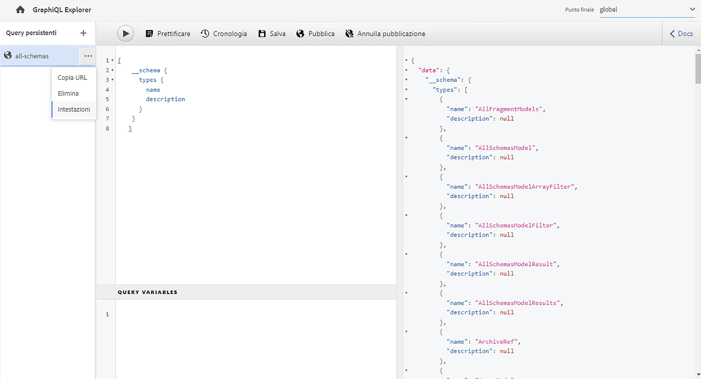
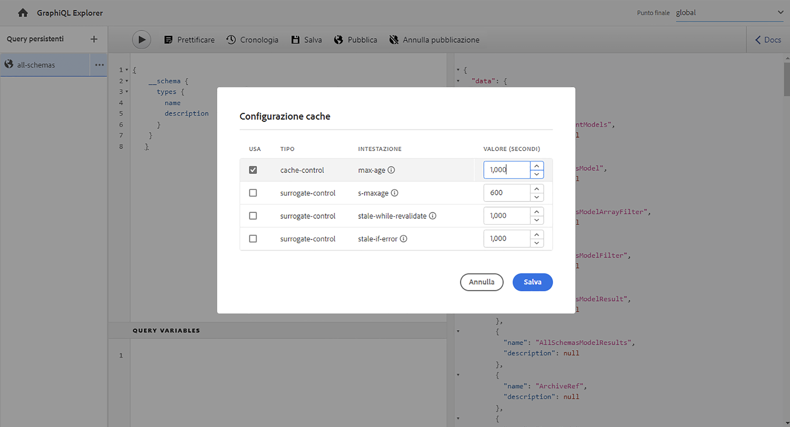
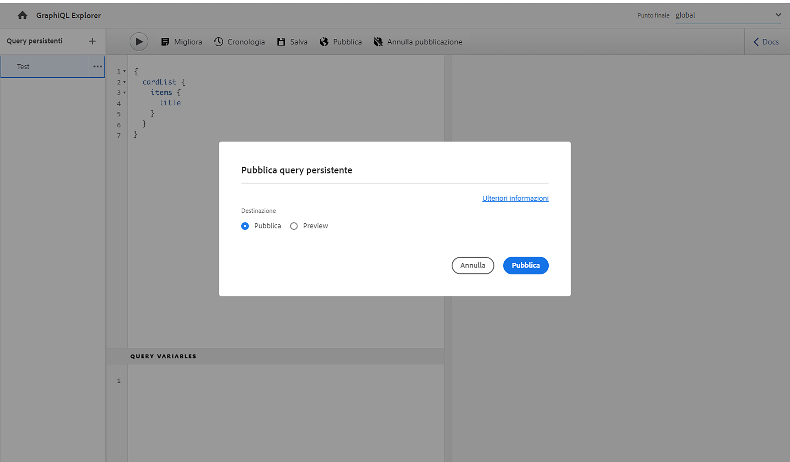
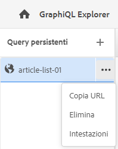

# Utilizzo dell’IDE GraphiQL {#graphiql-ide}

Un’implementazione dell’IDE [GraphiQL](https://graphql.org/learn/serving-over-http/#graphiql) standard è disponibile con l’API GraphQL di Adobe Experience Manager (AEM) as a Cloud Service.

>[!NOTE]
>
>GraphiQL è incluso in tutti gli ambienti di AEM (ma sarà accessibile/visibile solo quando configuri gli endpoint).
>
>Nelle versioni precedenti, era necessario un pacchetto per installare l’IDE GraphiQL. Se installato, ora è possibile rimuoverlo.

>[!NOTE]
>Prima di utilizzare l’IDE GraphiQL, devi avere [configurato gli endpoint](/help/headless/graphql-api/graphql-endpoint.md) nel [browser delle configurazioni](/help/sites-cloud/administering/content-fragments/setup.md#enable-content-fragment-functionality-configuration-browser).

Lo strumento **GraphiQL** consente di testare ed eseguire il debug delle query GraphQL consentendoti di:

* selezionare l’**Endpoint** appropriato per la configurazione Sites da utilizzare per le query;
* inserire direttamente nuove query;
* creare e accedere a **[query persistenti](/help/headless/graphql-api/persisted-queries.md)**;
* eseguire le query per visualizzare immediatamente i risultati
* gestire **variabili di query**;
* salvare e gestire **query persistenti**;
* pubblicare o annullare la pubblicazione di **query persistenti** sul servizio **Pubblica** o **Anteprima**; ad esempio, a/da `dev-publish`
* vedere la **cronologia** delle query precedenti;
* utilizzare **Esplora documentazione** per accedere alla documentazione, per scoprire e comprendere i metodi disponibili.

Puoi accedere all’editor di query da:

* **Strumenti** -> **Generale** -> **Editor di query GraphQL**
* direttamente; ad esempio `http://localhost:4502/aem/graphiql.html`

Puoi utilizzare GraphiQL nel tuo sistema in modo che le query possano essere richieste dall’applicazione client mediante richieste GET, nonché per pubblicarle. Per l’utilizzo in produzione, puoi quindi [spostare le query nell’ambiente di produzione](/help/headless/graphql-api/persisted-queries.md#transfer-persisted-query-production). Inizialmente devi spostarle nell’istanza Author dell’ambiente di produzione per convalidare i contenuti appena creati con le query, e infine nell’istanza Publish di produzione per l’utilizzo live.

## Selezione dell’endpoint {#selecting-endpoint}

Come primo passo è necessario selezionare l’**[endpoint](/help/headless/graphql-api/graphql-endpoint.md)** da utilizzare per le query. L’endpoint è appropriato per la configurazione Sites che desideri utilizzare per le query.

È disponibile dall’elenco a discesa in alto a destra.

## Creazione e persistenza di una nuova query {#creating-new-query}

Puoi inserire la nuova query nell’editor, che si trova nel pannello centrale a sinistra, direttamente sotto il logo GraphiQL.

>[!NOTE]
>
>Se hai già selezionato una query persistente, ed è visualizzata nel pannello editor, seleziona `+` (accanto a **query persistenti**) per svuotare l’editor approntandolo per la nuova query.

A questo punto è sufficiente iniziare a digitare. L’editor, inoltre:

* mostra ulteriori informazioni sugli elementi al passaggio del mouse;
* fornisce funzioni quali evidenziazione della sintassi, completamento automatico e suggerimento automatico

>[!NOTE]
>
>Le query GraphQL in genere iniziano con un carattere `{`.
>
>Le righe che iniziano con `#` vengono ignorate.

Utilizza **Salva con nome** per rendere persistente la nuova query.

## Aggiornamento della query persistente {#updating-persisted-query}

Seleziona la query da aggiornare dall’elenco nel pannello delle **query persistenti** (a sinistra).

La query viene visualizzata nel pannello dell’editor. Apporta le modifiche necessarie, quindi utilizza **Salva** per confermare gli aggiornamenti della query persistente.

## Esecuzione delle query {#running-queries}

Puoi eseguire immediatamente una nuova query oppure caricare ed eseguire una query persistente. Per caricare una query persistente, selezionala dall’elenco: la query viene visualizzata nel pannello dell’editor.

In entrambi i casi, la query visualizzata nel pannello dell’editor è quella che verrà eseguita quando:

* seleziona l&#39;icona **Esegui query**
* utilizzi la scelta rapida di tastiera `Control-Enter`

## Variabili di query {#query-variables}

L&#39;IDE GraphiQL consente inoltre di gestire le [variabili di query](/help/headless/graphql-api/content-fragments.md#graphql-variables).

Esempio:

## Gestione della cache per le query persistenti {#managing-cache}

Le [query persistenti](/help/headless/graphql-api/persisted-queries.md) sono consigliate in quanto possono essere memorizzate nella cache ai livelli dispatcher e CDN, migliorando in ultima analisi le prestazioni dell’applicazione client richiedente. Per impostazione predefinita, AEM renderà non valida la cache della rete per la consegna dei contenuti (CDN) in base a un valore Time -to-Live (TTL) predefinito.

>[!NOTE]
>
>Vedi [Memorizzazione in cache delle query persistenti](/help/headless/graphql-api/persisted-queries.md#caching-persisted-queries).

>[!NOTE]
>
>Le regole di riscrittura personalizzate in Dispatcher potrebbero sovrascrivere le impostazioni predefinite di AEM Publish.
>
>Se invii intestazioni di controllo cache basate su TTL da Dispatcher, in base a un pattern di corrispondenza della posizione, puoi escludere `/graphql/execute.json/*` dalle corrispondenze, se necessario.

Utilizzando GraphQL è possibile configurare le intestazioni cache HTTP per controllare questi parametri per la singola query persistente.

1. L’opzione **Intestazioni** è accessibile tramite i tre punti in verticale a destra del nome della query persistente (ultimo pannello a sinistra):

   

1. Selezionando questa opzione si apre la finestra di dialogo **Configurazione cache**:

   

1. Seleziona il parametro appropriato, quindi regola il valore come richiesto:

   * **cache-control** - **max-age**
Le cache possono memorizzare questo contenuto per un numero specificato di secondi. In genere si tratta del valore TTL (Time To Live) del browser.
   * **surrogate-control** - **s-maxage**
Uguale a max-age ma si applica in modo specifico alle cache proxy.
   * **surrogate-control** - **stale-while-revalidate**
Le cache possono continuare a fornire una risposta dalla cache dopo che questa è diventata obsoleta, per un massimo di un numero specificato di secondi.
   * **surrogate-control** - **stale-if-error**

Le cache possono continuare a fornire una risposta dalla cache in caso di errore di origine, per un massimo di un numero specificato di secondi.

1. Seleziona **Salva** per mantenere le modifiche persistenti.

## Pubblicazione e anteprima delle query persistenti {#publishing-previewing-persisted-queries}

Dopo aver selezionato la query persistente dall’elenco (pannello a sinistra), puoi utilizzare l’azione **Pubblica**.

La query verrà attivata nell’ambiente selezionato. È possibile scegliere **Pubblica** ambiente (ad esempio, `dev-publish`) o **Anteprima** ambiente per un facile accesso da parte delle applicazioni durante il test.

>[!NOTE]
>
>La definizione della cache della query persistente `Time To Live` {&quot;cache-control&quot;:&quot;parameter&quot;:value} ha un valore predefinito di 2 ore (7200 secondi).

## Annullamento della pubblicazione delle query persistenti {#unpublishing-persisted-queries}

Come per la pubblicazione, dopo aver selezionato la query persistente dall’elenco (pannello a sinistra) puoi utilizzare l’azione **Annulla pubblicazione**.

In questo modo la query verrà disattivata dall’ambiente selezionato, sia per l’ambiente **Pubblica** che per quello di **Anteprima**.

>[!NOTE]
>
>È inoltre necessario assicurarsi di aver apportato le modifiche necessarie all’applicazione client per evitare potenziali problemi.

## Copiare l’URL per accedere direttamente alla query {#copy-url}

L&#39;opzione **Copia URL** consente di simulare una query copiando l&#39;URL utilizzato per accedere direttamente alla query persistente e visualizzare i risultati. Questa può quindi essere utilizzata per i test; ad esempio, accedendo in un browser:

<!--
  >[!NOTE]
  >
  >The URL needs [encoding before using programmatically](/help/headless/graphql-api/persisted-queries.md#encoding-query-url).
  >
  >The target environment might need adjusting, depending on your requirements.
-->

Esempio:

`http://localhost:4502/graphql/execute.json/global/article-list-01`

Utilizzando questo URL in un browser, puoi confermare i risultati:

L’opzione **Copia URL** è accessibile tramite i tre punti verticali a destra del nome della query persistente (pannello a sinistra):

## Eliminazione delle query persistenti {#deleting-persisted-queries}

L’opzione **Elimina** è anch’essa accessibile tramite i tre punti verticali a destra del nome della query persistente (pannello a sinistra).

<!-- what happens if you try to delete something that is still published? -->

## Installazione della query persistente nell’ambiente di produzione {#installing-persisted-query-production}

Dopo aver sviluppato e testato la query persistente con GraphiQL, occorre [trasferirla all’ambiente di produzione](/help/headless/graphql-api/persisted-queries.md#transfer-persisted-query-production) in modo che possa essere utilizzata dalle applicazioni.

## Scelte rapide da tastiera {#keyboard-shortcuts}

Nell’IDE è disponibile una selezione di scelte rapide da tastiera per accedere direttamente alle icone di azione:

* Migliora query: `Shift-Control-P`
* Unisci query: `Shift-Control-M`
* Esegui query: `Control-Enter`
* Completamento automatico: `Control-Space`

>[!NOTE]
>
>Su alcune tastiere il tasto `Control` è etichettato come `Ctrl`.
