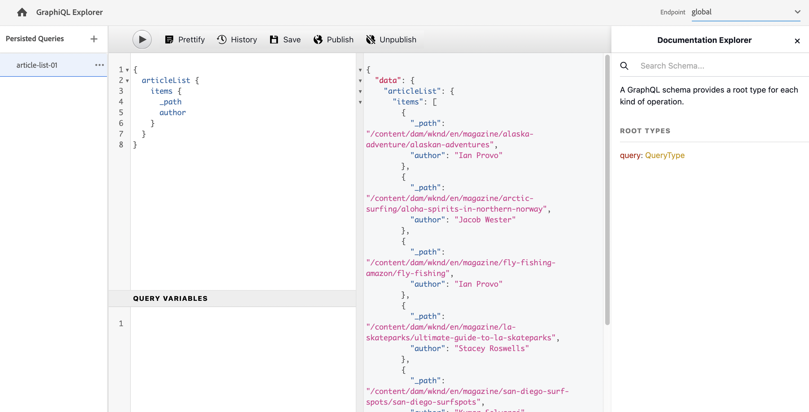

# Utilizzo dell&#39;IDE GraphiQL {#graphiql-ide}

Attuazione dello standard [GraphiQL](https://graphql.org/learn/serving-over-http/#graphiql) L’IDE è disponibile per l’uso con AEM GraphQL. Questo può essere [installato con AEM](#installing-graphiql-ide).

>[!NOTE]
>
>GraphiQL è associato all’endpoint globale (e non funziona con altri endpoint per configurazioni specifiche di Sites).

Lo strumento GraphiQL ti consente di inserire, testare ed eseguire il debug direttamente delle query. GraphiQL fornisce inoltre un facile accesso alla documentazione, facilitando l&#39;apprendimento e la comprensione dei metodi disponibili.

Esempio:

* `http://localhost:4502/content/graphiql.html`

Questo fornisce funzioni quali evidenziazione della sintassi, completamento automatico, auto-suggerimento, insieme a una cronologia e a una documentazione online:

## Installazione dell&#39;IDE GraphiQL AEM {#installing-graphiql-ide}

L&#39;IDE GraphiQL è uno strumento di sviluppo e necessario solo in ambienti di livello inferiore come uno sviluppo o un&#39;istanza locale. Pertanto non è incluso nel progetto AEM, ma viene fornito come pacchetto separato che può essere installato su base ad hoc.

1. Passa a **[Portale di distribuzione software](https://experience.adobe.com/#/downloads/content/software-distribution/it/aemcloud.html)** > **AEM as a Cloud Service**.
1. Cerca &quot;GraphiQL&quot; (assicurati di includere **i** in **GraphiQL**.
1. Scarica la versione più recente **Pacchetto di contenuti GraphiQL v.x.x.x**
1. Da **Inizio AEM** menu vai a **Strumenti** > **Distribuzione** > **Pacchetti**.
1. Fai clic su **Carica pacchetto** e scegli il pacchetto scaricato nel passaggio precedente. Fai clic su **Installa** per installare il pacchetto.

