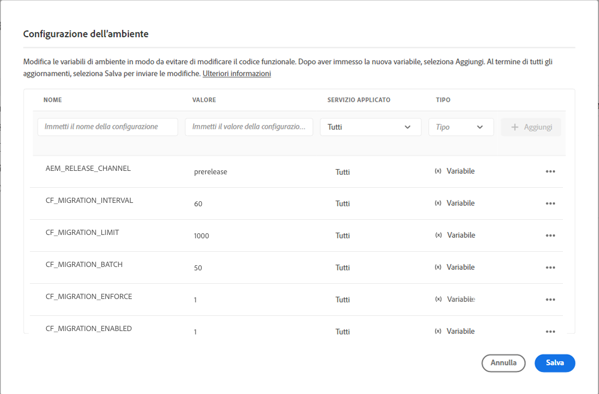

# Aggiornamento dei frammenti di contenuto per un filtro GraphQL ottimizzato {#updating-content-fragments-for-optimized-graphql-filtering}

Per ottimizzare le prestazioni dei filtri GraphQL, è necessario eseguire una procedura per aggiornare i frammenti di contenuto.

>[!NOTE]
>
>Dopo aver aggiornato i frammenti di contenuto, puoi seguire i consigli per [l’ottimizzazione delle query GraphQL](/help/headless/graphql-api/graphql-optimization.md).


## Prerequisiti {#prerequisites}

Esistono prerequisiti per questa attività:

1. Assicurati di disporre almeno della versione 2023.1.0 di AEM as a Cloud Service.

1. Assicurati che l’utente che esegue l’attività disponga delle autorizzazioni necessarie:

   * come minimo `Deployment Manager` ruolo in Cloud Manager è obbligatorio.

## Aggiornamento dei frammenti di contenuto {#updating-content-fragments}

Per eseguire la procedura, segui le indicazioni descritte di seguito.

1. Abilita l’aggiornamento impostando le seguenti variabili per l’istanza tramite l’interfaccia utente di Cloud Manager:

   

   Le variabili disponibili sono:

   <table style="table-layout:auto">
    <tbody>
     <tr>
      <th> </th>
      <th>Nome</th>
      <th>Valore</th>
      <th>Valore predefinito</th>
      <th>Servizio</th>
      <th>Applicato</th>
      <th>Tipo</th>
      <th>Note</th>
     </tr>

   <tr>
      <td>1</td>
      <td>“CF_MIGRATION_ENABLED” </td>
      <td>“1” </td>
      <td>“0” </td>
      <td>Tutti i bundle  </td>
      <td> </td>
      <td>Variabile </td>
      <td>Abilita (!=0) o disabilita (0) l’attivazione del processo di migrazione dei frammenti di contenuto. </td>
     </tr>
     <tr>
      <td>2</td>
      <td>“CF_MIGRATION_ENFORCE” </td>
      <td>“1” </td>
      <td>“0” </td>
      <td>Tutti i bundle  </td>
      <td> </td>
      <td>Variabile </td>
      <td>Applica (!=0) una nuova migrazione dei frammenti di contenuto.<br>Se si imposta questo contrassegno su 0, verrà eseguita una migrazione incrementale dei CF. Ciò significa che se il processo viene terminato per qualsiasi motivo, la successiva esecuzione del processo inizierà la migrazione dal punto in cui è stato terminato. Tieni presente che si consiglia di applicare la prima migrazione (valore=1). </td>
     </tr>
     <tr>
      <td>3</td>
      <td>“CF_MIGRATION_BATCH” </td>
      <td>“50” </td>
      <td>“50” </td>
      <td>Tutti i bundle  </td>
      <td> </td>
      <td>Variabile </td>
      <td>Dimensione del batch per il salvataggio del numero di frammenti di contenuto dopo la migrazione.<br>Questo è relativo a quanti frammenti di contenuto verranno salvati nell’archivio in un batch e può servire a ottimizzare il numero di scritture nell’archivio. </td>
     </tr>
     <tr>
      <td>4</td>
      <td>“CF_MIGRATION_LIMIT” </td>
      <td>“1000” </td>
      <td>“1000” </td>
      <td>Tutti i bundle  </td>
      <td> </td>
      <td>Variabile </td>
      <td>Numero massimo di frammenti di contenuto da elaborare alla volta.<br>Vedi anche le note per “CF_MIGRATION_INTERVAL”. </td>
     </tr>
     <tr>
      <td>5</td>
      <td>“CF_MIGRATION_INTERVAL” </td>
      <td>“60” </td>
      <td>“600” </td>
      <td>Tutti i bundle  </td>
      <td> </td>
      <td>Variabile </td>
      <td>Intervallo (in secondi) per l’elaborazione dei frammenti di contenuto rimanenti fino al limite successivo<br>Questo intervallo viene anche considerato come tempo di attesa prima di avviare il processo, nonché come ritardo tra l’elaborazione di ogni successivo numero di frammenti di contenuto CF_MIGRATION_LIMIT.<br>(*)</td>
     </tr>
    </tbody>
   </table>

   >[!NOTE]
   >
   >(*)
   >
   >Il valore di `CF_MIGRATION_INTERVAL` può inoltre essere utile per approssimare il tempo totale di esecuzione del processo di migrazione.
   >
   >Esempio:
   >
   >* Numero totale frammenti di contenuto = 20.000
   >* CF_MIGRATION_LIMIT = 1000
   >* CF_MIGRATION_INTERNAL = 60 (sec)
   >* Tempo approssimativo necessario per completare la migrazione = 60 + (20.000/1000 * 60) = 1260 sec = 21 minuti
      >  I “60” secondi aggiuntivi aggiunti all’avvio sono dovuti al ritardo iniziale all’avvio del processo.

   >
   >Tieni anche presente che questo è solo il tempo *minimo* necessario per completare il processo e non include il tempo di I/O. Il tempo effettivamente impiegato potrebbe essere notevolmente superiore a questa stima.

1. Monitora l’avanzamento e il completamento dell’aggiornamento.

   A questo scopo, controlla i registri sull’authoring e la pubblicazione in gold da:

   * `com.adobe.cq.dam.cfm.impl.upgrade.UpgradeJob`

      * Registri di authoring; ad esempio:

         ```shell
         23.01.2023 13:13:45.926 *INFO* [sling-threadpool-09cbdb47-4d99-4c4c-b6d5-781b635ee21b-(apache-sling-job-thread-pool)-1-Content Fragment Upgrade Job Queue Config(cfm/upgrader)] com.adobe.cq.dam.cfm.impl.upgrade.UpgradeJob This instance<dd9ffdc1-0c28-4d04-9a96-5d4d223e457e> is the leader, will schedule the upgrade schedule job.
         ...
         23.01.2023 13:13:45.941 *INFO* [sling-threadpool-09cbdb47-4d99-4c4c-b6d5-781b635ee21b-(apache-sling-job-thread-pool)-1-Content Fragment Upgrade Job Queue Config(cfm/upgrader)] com.adobe.cq.dam.cfm.impl.upgrade.UpgradeJob Scheduling content fragments upgrade from version 0 to 1, slingJobId: 2023/1/23/13/13/50e1a575-4cd7-497b-adf0-62cb5768eedb_0, enforce: true, limit: 1000, batch: 50, interval: 60s
         
         23.01.2023 13:20:40.960 *INFO* [sling-threadpool-09cbdb47-4d99-4c4c-b6d5-781b635ee21b-(apache-sling-job-thread-pool)-1-Content Fragment Upgrade Job Queue Config(cfm/upgrader)] com.adobe.cq.dam.cfm.impl.upgrade.UpgradeJob Finished content fragments upgrade in 6m, slingJobId: 2023/1/23/13/13/50e1a575-4cd7-497b-adf0-62cb5768eedb_0, status: MaintenanceJobStatus{jobState=SUCCEEDED, statusMessage='Upgrade to version '1' succeeded.', errors=[], successCount=3781, failedCount=0, skippedCount=0}
         ```

      * Registri di pubblicazione in gold; ad esempio:

         ```shell
         23.01.2023 12:35:05.150 *INFO* [sling-threadpool-8abcc1bb-cdcb-46d4-8565-942ad8a73209-(apache-sling-job-thread-pool)-1-Content Fragment Upgrade Job Queue Config(cfm/upgrader)] com.adobe.cq.dam.cfm.impl.upgrade.UpgradeJob This instance<ad1b399e-77be-408e-bc3f-57097498fddb> is the leader, will schedule the upgrade schedule job.
         
         23.01.2023 12:35:05.161 *INFO* [sling-threadpool-8abcc1bb-cdcb-46d4-8565-942ad8a73209-(apache-sling-job-thread-pool)-1-Content Fragment Upgrade Job Queue Config(cfm/upgrader)] com.adobe.cq.dam.cfm.impl.upgrade.UpgradeJob Scheduling content fragments upgrade from version 0 to 1, slingJobId: 2023/1/23/12/34/ad1b399e-77be-408e-bc3f-57097498fddb_0, enforce: true, limit: 1000, batch: 50, interval: 60s
         ...
         23.01.2023 12:40:45.180 *INFO* [sling-threadpool-8abcc1bb-cdcb-46d4-8565-942ad8a73209-(apache-sling-job-thread-pool)-1-Content Fragment Upgrade Job Queue Config(cfm/upgrader)] com.adobe.cq.dam.cfm.impl.upgrade.UpgradeJob Finished content fragments upgrade in 5m, slingJobId: 2023/1/23/12/34/ad1b399e-77be-408e-bc3f-57097498fddb_0, status: MaintenanceJobStatus{jobState=SUCCEEDED, statusMessage='Upgrade to version '1' succeeded.', errors=[], successCount=3781, failedCount=0, skippedCount=0}
         ```
   I clienti che hanno abilitato l’accesso ai registri dell’ambiente utilizzando Splunk possono utilizzare la query di esempio seguente per monitorare il processo di aggiornamento. Per informazioni dettagliate sull’abilitazione della registrazione Splunk, consulta [Debug di produzione e staging](/help/implementing/developing/introduction/logging.md#debugging-production-and-stage) pagina.

   ```splunk
   index=<indexName> sourcetype=aemerror aem_envId=<environmentId> msg="*com.adobe.cq.dam.cfm.impl.upgrade.UpgradeJob Finished*" 
   (aem_tier=golden-publish OR aem_tier=author) | table _time aem_tier pod_name msg | sort -_time desc
   ```

   Dove:

   * `environmentId` - un identificatore dell’ambiente del cliente; ad esempio, `e1234`
   * `indexName` - un nome di indice del cliente, raccolta `aemerror` Eventi

   Esempio di output:

   <table style="table-layout:auto">
     <thead>
       <tr>
       <th>_volta</th>
       <th>aem_tier</th>
       <th>pod_name</th>
       <th>msg</th>
       </tr>
     </thead> 
     <tbody>
       <tr>
         <td>2023-04-21 06:00:35.723</td>
         <td>creazione</td>
         <td>cm-p1234-e1234-aem-author-76d6dc4b79-8lsb5</td>
         <td>[sling-threadpool-bb5da4dd-6b05-4230-93ea-1d5cd242e24f-(apache-sling-job-thread-pool)-1-Content Fragment Upgrade Job Queue Config(cfm/upgrade)] com.adobe.cq.dam.cfm.impl.upgrade.UpgradeJob Finished content fragments upgrade in 391m, slingJobId: 2023/4/20/23/16/db796df-e267-489b-b69a-5930b0dadb37_0, stato: MaintenanceJobStatus{jobState=SUCCESSEDED, statusMessage='Aggiornamento alla versione '1' completato.', errors=[], successCount=36756, failedCount=0, skippedCount=0}</td>
       </tr>
       <tr>
         <td>2023-04-21 06:05:48.207</td>
         <td>golden-publish</td>
         <td>cm-p1234-e1234-aem-golden-publish-644487c9c5-lvkv2</td>
         <td>[sling-threadpool-284b9a9a-8454-461e-9bdb-44866c6ddfb1-(apache-sling-job-thread-pool)-1-Content Fragment Upgrade Job Queue Config(cfm/upgrade)] com.adobe.cq.dam.cfm.impl.upgrade.UpgradeJob Fine aggiornamento frammenti di contenuto in 211m, slingJobId: 2023/4/20/23/15/66c1690a-db7-4e66-bc52-90f33394ddfc_0, stato: MaintenanceJobStatus{jobState=SUCCESSEDED, statusMessage='Aggiornamento alla versione '1' completato.', errori=[], successCount=19557, failedCount=0, skippedCount=0}</td>
       </tr>
     </tbody>
   <table>

1. Disattiva la procedura di aggiornamento.

   >[!IMPORTANT]
   >
   >Questo passaggio è necessario per completare l’aggiornamento.

   Al termine della procedura di aggiornamento, reimposta la variabile di ambiente cloud `CF_MIGRATION_ENABLED` a “0”, per attivare il riutilizzo di tutti i pod.

   <table style="table-layout:auto">
    <tbody>
     <tr>
      <th> </th>
      <th>Nome</th>
      <th>Valore</th>
      <th>Valore predefinito</th>
      <th>Servizio</th>
      <th>Applicato</th>
      <th>Tipo</th>
      <th>Note</th>
     </tr>
     <tr>
      <td></td>
      <td>“CF_MIGRATION_ENABLED” </td>
      <td>“0” </td>
      <td>“0” </td>
      <td>Tutti i bundle  </td>
      <td> </td>
      <td>Variabile </td>
      <td>Disabilita(0) (o Abilita(!=0)) attivazione del processo di migrazione dei frammenti di contenuto. </td>
     </tr>
    </tbody>
   </table>

   >[!NOTE]
   >
   >Ciò è particolarmente importante per il livello di pubblicazione, in quanto l’aggiornamento del contenuto viene eseguito solo sulla pubblicazione in gold e su questa si basano tutti i normali pod di pubblicazione quando si ricicla un pod.

1. Verificare il completamento della procedura di aggiornamento.

   Puoi verificare il completamento corretto dell’aggiornamento utilizzando il browser dell’archivio nella Console per sviluppatori di Cloud Manager dove puoi controllare i dati dei frammenti di contenuto.

   * Finché la prima migrazione non è completata, la proprietà `cfGlobalVersion` non esiste.
Pertanto, la presenza di questa proprietà sul nodo JCR `/content/dam` con un valore di `1` conferma il completamento della migrazione.

   * Puoi anche controllare le seguenti proprietà sui singoli frammenti di contenuto:

      * `_strucVersion` deve avere il valore di `1`
      * La struttura `indexedData` deve esistere

      >[!NOTE]
      >
      >La procedura aggiorna i frammenti di contenuto nelle istanze di authoring e pubblicazione.
      >
      >Pertanto, si consiglia di eseguire la verifica tramite il browser dell’archivio per *almeno* un’istanza di authoring *e* una di pubblicazione.


## Limitazioni {#limitations}

Tieni presente le seguenti limitazioni:

* L’ottimizzazione delle prestazioni dei filtri di GraphQL sarà possibile solo dopo un aggiornamento completo di tutti i frammenti di contenuto (indicato dalla presenza della proprietà `cfGlobalVersion` per il nodo JCR `/content/dam`)

* Se i frammenti di contenuto vengono importati da un pacchetto di contenuti (utilizzando `crx/de`) dopo l’esecuzione della procedura di aggiornamento, tali frammenti di contenuto non vengono considerati nei risultati della query GraphQL, fino a quando la procedura di aggiornamento non viene eseguita nuovamente.
