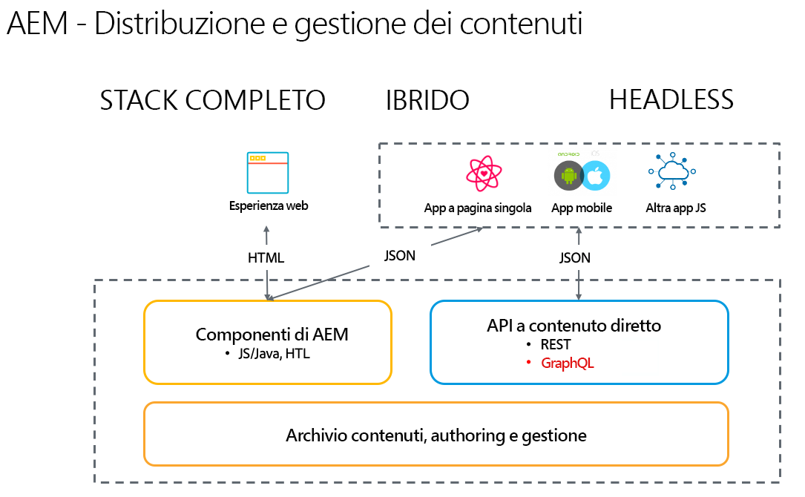

# Introduzione ad Adobe Experience Manager come CMS headless {#introduction-aem-headless}

Scopri come utilizzare Adobe Experience Manager (AEM) come CMS (sistema di gestione dei contenuti) headless, con funzioni quali Modelli di frammenti di contenuto, Frammenti di contenuto e API GraphQL che attivano le esperienze headless su larga scala.

Leggi la documentazione dettagliata delle varie funzioni coinvolte e/o segui la selezione di [percorsi headless per una panoramica dei primi passi](#first-steps).

>[!NOTE]
>
>Vedi anche [Cos’è headless?](/help/headless/what-is-headless.md) per una introduzione ai concetti e alla terminologia headless.

{{headless-trials-promotion}}

## Panoramica {#overview}

AEM Headless è una soluzione CMS di Experience Manager che consente di utilizzare contenuti strutturati (frammenti di contenuto) in AEM da qualsiasi app con HTTP tramite GraphQL. Le implementazioni headless consentono la distribuzione di esperienze su piattaforme e canali su larga scala.

L’implementazione headless ignora la gestione di pagine e componenti come avviene solitamente nelle soluzioni complete stack e ibride. Si basa invece sulla creazione di frammenti di contenuto riutilizzabili, indipendenti dai canali, e sulla loro distribuzione su più canali. Si tratta di un modello di sviluppo moderno e dinamico per l’implementazione di esperienze web.

## Funzioni {#aem-headless-features}

AEM as a Cloud Service è uno strumento flessibile per il modello di implementazione headless che offre tre potenti caratteristiche:

1. **Modelli per frammenti di contenuto**
   * I modelli per frammenti di contenuto sono rappresentazioni strutturate di contenuto.
   * I modelli di frammenti di contenuto sono definiti dagli architetti dell’informazione nell’editor di modelli per frammenti di contenuto di AEM.
   * I modelli di frammenti di contenuto fungono da base per i frammenti di contenuto.
1. **Frammenti di contenuto**
   * Un frammento di contenuto viene creato in base a un modello di frammenti di contenuto.
   * I frammenti di contenuto vengono creati dagli autori di contenuti tramite l’editor di frammenti di contenuto di AEM.
   * I frammenti di contenuto sono memorizzati come AEM Assets, ma possono essere gestiti tramite la console Risorse o la [console Frammenti di contenuto](/help/sites-cloud/administering/content-fragments/overview.md#content-fragments-console).
1. **API per la distribuzione dei contenuti**
   * Consulta [API di AEM per la distribuzione e la gestione strutturata dei contenuti](/help/headless/apis-headless-and-content-fragments.md) per una panoramica delle varie API disponibili e un confronto di alcuni dei concetti coinvolti.

   * La distribuzione diretta dei contenuti è possibile anche mediante l’[esportazione JSON del componente core Frammento di contenuto](https://experienceleague.adobe.com/docs/experience-manager-core-components/using/components/content-fragment-component.html?lang=it).

## Primi passi {#first-steps}

Sono disponibili diverse risorse per iniziare a utilizzare le funzionalità headless di AEM. Ogni guida è personalizzata per diversi casi d’uso e tipi di pubblico.

| Risorsa | Descrizione | Tipo | Pubblico | Tempo stimato |
|---|---|---|---|---|
| [Percorso per sviluppatori headless](/help/journey-headless/developer/overview.md) | **Se sei uno sviluppatore senza esperienza di AEM e tecnologie headless**, fai clic qui per un’introduzione completa ad AEM e alle sue caratteristiche headless, dalla teoria headless fino alla pubblicazione del primo progetto headless. | Guida | Sviluppatori **senza esperienza di AEM e headless** | 1 ora |
| [Configurazione headless](/help/headless/setup/introduction.md) | **Se sei un utente esperto di AEM** che necessita di un riepilogo delle principali funzioni headless di AEM, consulta questa breve panoramica. | Configurazione di riferimento | Sviluppatori e amministratori **con esperienza di AEM** | 20 minuti |
| [Tutorial pratico su headless](https://experienceleague.adobe.com/docs/experience-manager-learn/getting-started-with-aem-headless/graphql/multi-step/overview.html?lang=it) | **Se preferisci un approccio pratico e hai familiarità con AEM**, questo tutorial si concentra direttamente sull’implementazione di una semplice app headless. | Tutorial | Sviluppatori | 2 ore |
| [Percorso per architetto headless](/help/journey-headless/architect/overview.md) | **Se sei un architetto senza esperienza di AEM e tecnologie headless**, fai clic qui per un’introduzione alle potenti e flessibili funzionalità headless di Adobe Experience Manager as a Cloud Service e per vedere come modellare i contenuti per il tuo progetto. | Guida | Architetti | 1 ora |
| [Percorso per authoring headless](/help/journey-headless/author/overview.md) | **Se sei un utente business senza esperienza di AEM e tecnologie headless**, fai clic qui per un’introduzione alle potetni e flessibili funzionalità headless di Adobe Experience Manager as a Cloud Service e per vedere come modellare i contenuti per il tuo progetto. | Guida | Creatori di contenuti | 1 ora |
| [Percorso di traduzione headless](/help/journey-headless/translation/overview.md) | Per chi è interessato **all’approccio di traduzione headless di AEM**. Scopri le tecnologie headless e come creare e aggiornare progetti di traduzione in AEM dalla A alla Z. | Guida | Specialisti della traduzione | 1 ora |

## Confronto tra headful e headless {#headful-headless}

Questa guida si concentra sul modello completo di implementazione headless di AEM. Tuttavia, headful e headless non devono essere necessariamente una scelta binaria in AEM. Le funzioni headless consentono di gestire e distribuire contenuti a più punti di contatto, consentendo agli autori di contenuti di modificare le applicazioni a pagina singola. Tutto questo direttametne in AEM.

>[!TIP]
>
>Per saperne di più, consulta il documento [Headful e headless in AEM](/help/implementing/developing/headful-headless.md).