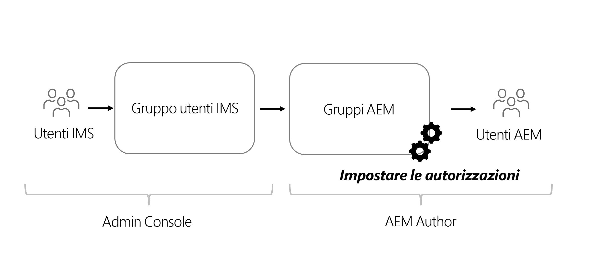

# Considerazioni sulle autorizzazioni per contenuti headless

Con un’implementazione headless, è necessario affrontare diverse aree di sicurezza e autorizzazioni. Le autorizzazioni e gli utenti tipo possono essere considerati in generale in base all’ambiente AEM **Autore** o **Pubblica**. Ogni ambiente contiene utenti tipo diversi e con esigenze diverse.

## Considerazioni sul servizio authoring

Il servizio Author è il luogo in cui gli utenti interni creano, gestiscono e pubblicano i contenuti. Le autorizzazioni ruotano intorno ai diversi utenti tipo che gestiscono il contenuto.

### Gestione delle autorizzazioni a livello di gruppo

Come best practice, le autorizzazioni devono essere impostate su Gruppi in AEM. Noti anche come gruppi locali, questi gruppi possono essere gestiti nell’ambiente di authoring AEM.

Il modo più semplice per gestire l’iscrizione al gruppo è utilizzare i gruppi Adobe Identity Management System (IMS) e assegnare [Gruppi IMS a gruppi AEM locali](https://experienceleague.adobe.com/docs/experience-manager-cloud-service/content/security/ims-support.html#managing-permissions-in-aem).

Ad alto livello, il processo è:

1. Aggiungere utenti IMS a un gruppo di utenti IMS nuovo o esistente utilizzando [Admin Console](https://adminconsole.adobe.com/).
1. I gruppi IMS vengono sincronizzati con AEM quando gli utenti accedono.
1. Assegna gruppi IMS a gruppi AEM.
1. Impostare le autorizzazioni per gruppi AEM.
1. Quando gli utenti accedono a AEM e sono autenticati tramite IMS, ereditano le autorizzazioni del gruppo AEM.

>[!TIP]
>
> È possibile trovare un video dettagliato sulla gestione di IMS e utenti e gruppi AEM [qui](https://experienceleague.adobe.com/docs/experience-manager-learn/cloud-service/accessing/overview.html?lang=it).

Per gestire **gruppi** in AEM, passa a **Strumenti** > **Sicurezza** > **Gruppi**.

Per gestire le autorizzazioni dei gruppi in AEM, passa a **Strumenti** > **Sicurezza** > **Autorizzazioni**.

### Utenti DAM

“DAM”, in questo contesto, sta per Gestione delle risorse digitali. **Utenti DAM** è un gruppo predefinito in AEM che può essere utilizzato per gli utenti quotidiani che gestiscono risorse digitali e frammenti di contenuto. Questo gruppo fornisce le autorizzazioni per **visualizzare**, **aggiungere**, **aggiornare**, **cancellare** e **pubblicare** Frammenti di contenuto e tutti gli altri file in AEM Assets.

Se utilizzi IMS per l’iscrizione al gruppo, aggiungi i gruppi IMS appropriati come membri del gruppo **Utenti DAM**. I membri del gruppo IMS ereditano le autorizzazioni del gruppo Utenti DAM durante l’accesso all’ambiente AEM.

#### Personalizzazione del gruppo utenti DAM

È meglio non modificare direttamente le autorizzazioni di un gruppo preconfigurato. Al contrario, puoi anche creare i tuoi gruppi personalizzati modellati sulle autorizzazioni del gruppo **Utenti DAM** e ulteriori restrizioni all’accesso a diverse **cartelle** in AEM Assets.

Per autorizzazioni più dettagliate, utilizza la console **Autorizzazioni** in AEM e aggiorna il percorso da `/content/dam` a un percorso più specifico, ovvero, `/content/dam/mycontentfragments`.

Potrebbe essere opportuno concedere a questo gruppo di utenti le autorizzazioni necessarie per creare e modificare frammenti di contenuto, ma non per eliminarli. Per rivedere e assegnare le autorizzazioni per la modifica, ma non per eliminarla, consulta [Frammenti di contenuto - Considerazioni sull’eliminazione](/help/sites-cloud/administering/content-fragments/delete-considerations.md).

### Editor modelli

La possibilità di modificare **Modelli per frammenti di contenuto** deve essere lasciata agli amministratori o a un **piccolo gruppo** di utenti con autorizzazioni avanzate. La modifica del modello per frammenti di contenuto ha molti effetti a valle.

>[!CAUTION]
>
>Le modifiche ai modelli di frammenti di contenuto modificano l’API GraphQL sottostante su cui le applicazioni headless si basano.

Se desideri creare un gruppo che gestisca i modelli per frammenti di contenuto ma non l’accesso completo da parte dell’amministratore, puoi creare un gruppo con le seguenti voci di controllo di accesso:

| Percorso | Autorizzazione | Privilegi |
|-----| -------------| ---------|
| `/conf` | **consenti** | `jcr:read` |
| `/conf/<config-name>/settings/dam/cfm` | **consenti** | `rep:write`, `crx:replicate` |

## Autorizzazioni del servizio di pubblicazione

Il servizio di pubblicazione è considerato l’ambiente “live” ed è tipicamente quello con cui i consumatori API GraphQL interagiscono. I contenuti, dopo essere stati modificati e approvati nel servizio di authoring, vengono pubblicati nel servizio di pubblicazione. L’applicazione headless utilizza quindi il contenuto approvato dal servizio di pubblicazione tramite API GraphQL.

Per impostazione predefinita, il contenuto esposto tramite gli endpoint GraphQL del servizio di pubblicazione di AEM è accessibile a tutti, inclusi gli utenti non autenticati.

### Autorizzazioni del contenuto

I contenuti esposti tramite API GraphQL di AEM possono essere limitati utilizzando [Gruppi di utenti chiusi (CUG)](https://experienceleague.adobe.com/docs/experience-manager-learn/assets/advanced/closed-user-groups.html?lang=it) impostati nelle cartelle delle risorse, che specificano quali gruppi di utenti AEM (e i relativi membri) possono accedere al contenuto delle cartelle Risorse.

I CUG delle risorse funzionano per:

* In primo luogo, negando l’accesso a tutte le cartelle e sottocartelle
* Quindi, consentire l’accesso in lettura alla cartella e alle sottocartelle per tutti i gruppi di utenti AEM elencati nell’elenco dei gruppi di utenti chiusi (CUG)

I CUG possono essere impostati nelle cartelle di risorse con contenuto esposto tramite API GraphQL. L’accesso alle cartelle di risorse su AEM Publish deve essere controllato tramite i Gruppi di utenti, anziché direttamente dall’utente. Crea (o riutilizza) un gruppo di utenti AEM che consente di accedere alle cartelle di risorse con contenuto esposto dalle API GraphQL.

#### Seleziona lo schema di autenticazione{#publish-permissions-users}

L’[SDK Headless di AEM](https://github.com/adobe/aem-headless-client-js#create-aemheadless-client) supporta due tipi di autenticazione:

* [Autenticazione basata su token](/help/implementing/developing/introduction/generating-access-tokens-for-server-side-apis.md) utilizzando le credenziali del servizio associate a un singolo account tecnico.
* Autenticazione di base tramite utenti AEM.

### Accedi all’API GraphQL

Le richieste HTTP che forniscono [credenziali di autenticazione appropriate](https://github.com/adobe/aem-headless-client-js#create-aemheadless-client) negli endpoint API GraphQL del servizio di pubblicazione di AEM includono contenuto che le credenziali sono autorizzate a leggere e contenuto anonimamente accessibile. Gli altri utenti dell’API GraphQL non possono leggere il contenuto nelle cartelle protette da CUG.
