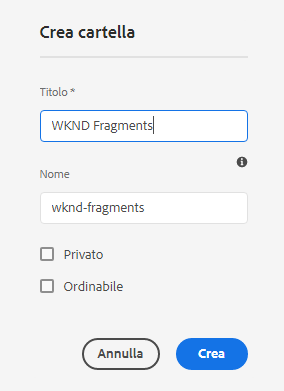
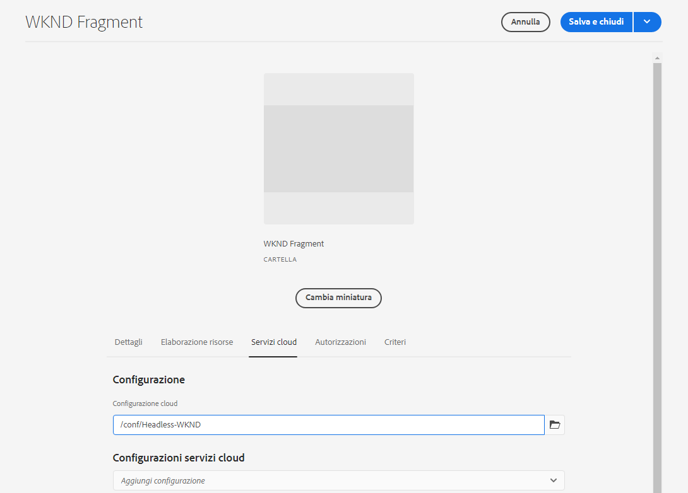
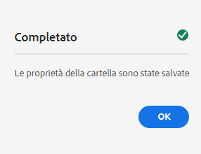

# Creazione di una cartella di risorse: configurazione headless {#creating-an-assets-folder}

Utilizza i modelli per frammenti di contenuto di AEM per definire la struttura dei frammenti di contenuto, che sta alla base dei contenuti headless. I frammenti di contenuto vengono poi memorizzati nelle cartelle di risorse.

## Cos’è una cartella di risorse? {#what-is-an-assets-folder}

[Dopo aver creato i modelli per frammenti di contenuto](create-content-model.md) che definiscono la struttura per i futuri frammenti di contenuto, è ora di creare alcuni frammenti.

Tuttavia, è necessario innanzitutto creare una cartella di risorse in cui memorizzarli.

Le cartelle di risorse vengono utilizzate per [organizzare le risorse di contenuti tradizionali](/help/assets/manage-digital-assets.md) come immagini e video e frammenti di contenuto.

## Creare una cartella di risorse {#how-to-create-an-assets-folder}

Di solito, un amministratore deve creare cartelle solo occasionalmente, per organizzare i contenuti al momento della creazione. Ai fini di questa guida introduttiva, è sufficiente creare una sola cartella.

1. Accedi ad AEM as a Cloud Service, quindi dal menu principale seleziona **Navigazione -> Risorse -> File**.
1. Tocca o fai clic su **Crea -> Cartella**.
1. Specifica il **titolo** e il **nome** da assegnare alla cartella.
   * Il **titolo** deve essere descrittivo.
   * Il **Nome** diventa il nome del nodo nell’archivio.
      * Viene generato automaticamente in base al titolo e regolato in base [Convenzioni di denominazione AEM](/help/implementing/developing/introduction/naming-conventions.md).
      * Se necessario è possibile modificarlo.

   
1. Seleziona la cartella appena creata: passa il puntatore su di essa, quindi tocca il segno di spunta. Dalla barra degli strumenti, seleziona **Proprietà** (oppure utilizza le `p` [scelte rapide da tastiera](/help/sites-cloud/authoring/getting-started/keyboard-shortcuts.md)).
1. In **Proprietà**, seleziona la scheda **Servizi cloud**.
1. In **Configurazione cloud** seleziona la [configurazione creata in precedenza.](create-configuration.md)
   
1. Tocca o fai clic su **Salva e chiudi**.
1. Nella finestra di conferma tocca o fai clic su **OK**.

   

Puoi creare ulteriori sottocartelle all’interno della cartella appena creata. Le sottocartelle ereditano la **configurazione cloud** della cartella principale. Tuttavia, questo può essere ignorato se vuoi utilizzare i modelli di un’altra configurazione.

Se utilizzi una struttura del sito localizzata, puoi [creare una directory principale della lingua](/help/assets/translate-assets.md) al di sotto della nuova cartella.

## Passaggi successivi {#next-steps}

Dopo aver creato una cartella per i frammenti di contenuto, puoi passare alla quarta parte della guida introduttiva e [creare frammenti di contenuto](create-content-fragment.md).

>[!TIP]
>
>Per informazioni complete sulla gestione dei Frammenti di contenuto, consulta la sezione [Documentazione sui Frammenti di contenuto](/help/sites-cloud/administering/content-fragments/content-fragments.md).
