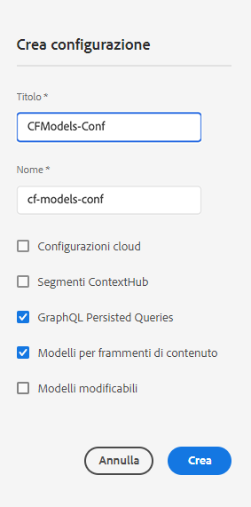

# Creazione di una configurazione: configurazione headless {#creating-configuration}

Come primo passo per iniziare a utilizzare le funzioni headless in AEM as a Cloud Service, devi creare una configurazione.

## Cos&#39;è una configurazione? {#what-is-a-configuration}

Il browser di configurazioni fornisce un’API di configurazione generica, una struttura del contenuto e un meccanismo di risoluzione per le configurazioni in AEM.

Nel contesto della gestione dei contenuti headless in AEM, considera una configurazione come un’area di lavoro all’interno di AEM dove puoi creare modelli di contenuto, che definiscono la struttura dei contenuti e dei frammenti di contenuto futuri. Puoi avere più configurazioni per separare questi modelli.

Se hai familiarità con i [modelli di pagina in un’implementazione completa di AEM,](/help/sites-cloud/authoring/sites-console/templates.md) l’utilizzo delle configurazioni per la gestione dei modelli di contenuto è simile.

## Come creare una configurazione {#how-to-create-a-configuration}

Un amministratore deve creare una configurazione solo una volta oppure, molto raramente, se è necessaria una nuova area di lavoro per organizzare i modelli di contenuto. Ai fini di questa guida introduttiva, è sufficiente creare una sola configurazione.

1. Accedi ad AEM as a Cloud Service e dal menu principale seleziona **Strumenti > Generale > Browser configurazioni**.
1. Specifica il **titolo** e il **nome** da assegnare alla configurazione.
   * Il **titolo** deve essere descrittivo.
   * Il **nome** diventa il nome del nodo nell’archivio.
      * Viene generato automaticamente dal titolo, secondo le [convenzioni di denominazione di AEM](/help/implementing/developing/introduction/naming-conventions.md).
      * Se necessario è possibile modificarlo.
1. Seleziona le seguenti opzioni:
   * **Modelli per frammenti di contenuto**
   * **Query GraphQL persistenti**

   

1. Seleziona **Crea**

Se necessario, puoi creare più configurazioni. È inoltre possibile nidificare le configurazioni.

>[!NOTE]
>
>In base ai requisiti di implementazione, oltre a **Modelli per frammenti di contenuto** e **Query GraphQL persistenti** potrebbe essere necessario selezionare anche altre opzioni di configurazione.

## Passaggi successivi {#next-steps}

Utilizzando questa configurazione, ora puoi passare alla seconda parte della guida introduttiva e [creare modelli per frammenti di contenuto.](create-content-model.md)

>[!TIP]
>
>Per informazioni complete sul browser di configurazioni, [consulta la documentazione del browser di configurazioni](/help/implementing/developing/introduction/configurations.md).
