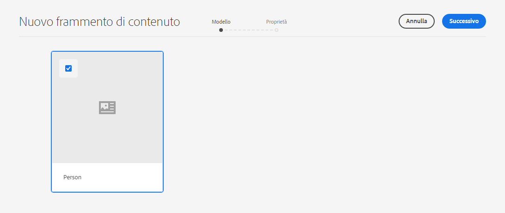
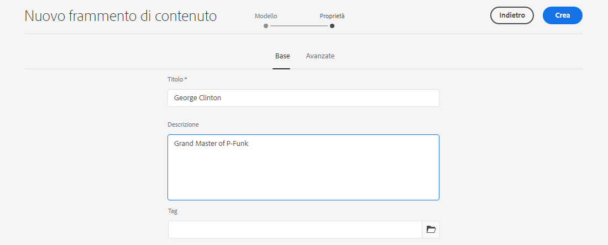
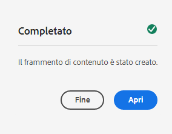
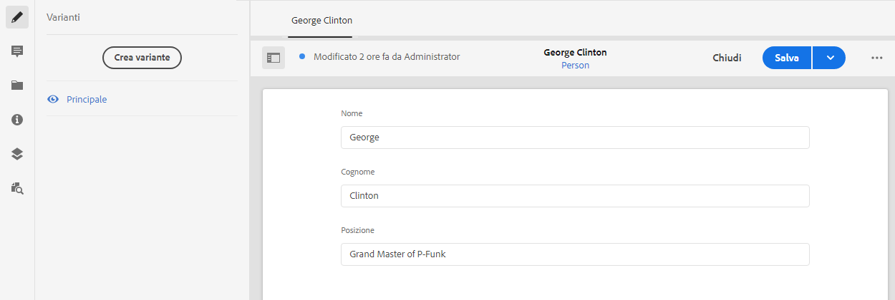

# Creazione di frammenti di contenuto - Configurazione headless {#creating-content-fragments}

Scopri come utilizzare AEM frammenti di contenuto per progettare, creare, curare e utilizzare contenuti indipendenti dalla pagina per la distribuzione headless.

## Cosa sono i frammenti di contenuto? {#what-are-content-fragments}

[Ora che hai creato una cartella risorse](create-assets-folder.md) dove è possibile archiviare i frammenti di contenuto, ora è possibile creare i frammenti.

I frammenti di contenuto consentono di progettare, creare, curare e pubblicare contenuti indipendenti dalla pagina. Consentono di preparare i contenuti pronti per l’uso in più posizioni e su più canali.

I frammenti di contenuto contengono contenuto strutturato e possono essere consegnati in formato JSON.

## Come creare un frammento di contenuto {#how-to-create-a-content-fragment}

Gli autori dei contenuti creeranno un numero qualsiasi di frammenti di contenuto per rappresentare il contenuto creato. Questo sarà il loro compito principale in AEM. Ai fini di questa guida introduttiva, è sufficiente crearne una.

1. Accedi AEM as a Cloud Service e seleziona dal menu principale **Navigazione -> Risorse**.
1. Tocca o fai clic sul pulsante [cartella creata in precedenza.](create-assets-folder.md)
1. Tocca o fai clic su **Crea -> Frammento di contenuto**.
1. La creazione di un frammento di contenuto viene presentata come una procedura guidata in due passaggi. Seleziona innanzitutto il modello da utilizzare per creare il frammento di contenuto e tocca o fai clic su **Successivo**.
   * I modelli disponibili dipendono dal [**Configurazione cloud** definito per la cartella risorse](create-assets-folder.md) in cui si sta creando il frammento di contenuto.
   * Se ricevi il messaggio `We could not find any models`, controlla la configurazione della cartella delle risorse.

   
1. Fornisci un **Titolo**, **Descrizione** e **Tag** se necessario, tocca o fai clic su **Crea**.

   
1. Tocca o fai clic su **Apri** nella finestra di conferma.

   
1. Fornisci i dettagli del frammento di contenuto nell’Editor frammento di contenuto.

   
1. Tocca o fai clic su **Salva** o  **Salva e chiudi**.

I frammenti di contenuto possono fare riferimento ad altri frammenti di contenuto, consentendo se necessario una struttura di contenuto nidificata.

I frammenti di contenuto possono fare riferimento ad altre risorse in AEM. [Queste risorse devono essere memorizzate in AEM](/help/assets/manage-digital-assets.md) prima di creare un frammento di contenuto di riferimento.

## Passaggi successivi {#next-steps}

Dopo aver creato un frammento di contenuto, puoi passare alla parte finale della guida introduttiva e [creare richieste API per accedere e distribuire frammenti di contenuto.](create-api-request.md)

>[!TIP]
>
>Per informazioni complete sulla gestione dei frammenti di contenuto, consulta la sezione [Documentazione sui frammenti di contenuto](/help/assets/content-fragments/content-fragments.md)
