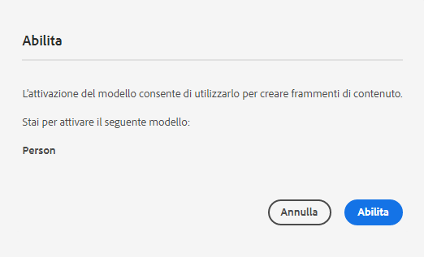

# Creazione di modelli per frammenti di contenuto: configurazione headless {#creating-content-fragment-models}

Definisci la struttura del contenuto da creare e distribuire utilizzando le funzionalità headless di AEM, mediante i modelli per frammenti di contenuto.

## Cosa sono i modelli per frammenti di contenuto? {#what-are-content-fragment-models}

[Ora che hai creato una configurazione,](create-configuration.md) puoi utilizzarla per creare modelli per frammenti di contenuto.

I modelli per frammenti di contenuto definiscono la struttura dei dati e del contenuto da creare e gestire in AEM. Servono come una sorta di impalcatura per i tuoi contenuti. Nella creazione di contenuti, questi vengono selezionati dagli autori in base ai modelli per frammenti di contenuto da te definiti, utilizzati come riferimento.

## Creare un modello per frammenti di contenuto {#how-to-create-a-content-fragment-model}

Un architetto dell’informazione esegue tali attività solo occasionalmente, quando sono necessari nuovi modelli. Ai fini di questa guida introduttiva, è necessario creare un solo modello.

1. Accedi ad AEM as a Cloud Service, quindi dal menu principale seleziona **Strumenti**, **Generale**, **Modelli per frammenti di contenuto**.
1. Seleziona la cartella creata durante la creazione della configurazione.

   
1. Seleziona **Crea**.
1. Specifica un **titolo modello**, **tag** e **descrizione**. Puoi anche selezionare/deselezionare **Abilita modello** per assicurarti che il modello venga subito abilitato al momento della creazione.

   
1. Nella finestra di conferma, seleziona **Apri** per configurare il modello.

   
1. Utilizzando l’**Editor modello per frammenti di contenuto**, crea il modello per frammenti di contenuto trascinando i campi dalla colonna **Tipi di dati**.

   

1. Dopo aver inserito un campo, è necessario configurarne le proprietà. L’editor passa automaticamente alla scheda **Proprietà** per il campo aggiunto, dove puoi specificare i campi obbligatori.

   

1. Al termine della creazione del modello, selezionare **Salva**.

1. La modalità del modello creato dipende dalla selezione o meno **Abilita modello** durante la creazione del modello:
   * selezionato: il nuovo modello è già **abilitato**
   * non selezionato: il nuovo modello viene creato nella modalità **Bozza**

1. Se non è già abilitato, per poter essere utilizzato il modello deve essere **abilitato**.
   1. Selezionate il modello creato, quindi selezionate **Abilita**.

      
   1. Conferma l’abilitazione del modello toccando o facendo clic su **Abilita** nella finestra di dialogo di conferma.

      
1. Il modello è ora abilitato e pronto per essere utilizzato.

   

L’**Editor modello per frammenti di contenuto** supporta differenti tipi di dati, ad esempio campi di testo semplice, riferimenti alle risorse, riferimenti ad altri modelli e dati JSON.

Puoi creare più modelli. I modelli possono fare riferimento ad altri frammenti di contenuto. Utilizza le [configurazioni](create-configuration.md) per organizzare i modelli.

## Passaggi successivi {#next-steps}

Dopo aver definito le strutture dei frammenti di contenuto mediante la creazione di modelli, puoi passare alla terza parte della guida introduttiva e [creare cartelle in cui memorizzare gli stessi frammenti.](create-assets-folder.md)

>[!TIP]
>
>Per informazioni complete sui modelli per frammenti di contenuto, consulta la [documentazione sui modelli per frammenti di contenuto](/help/sites-cloud/administering/content-fragments/content-fragment-models.md)
