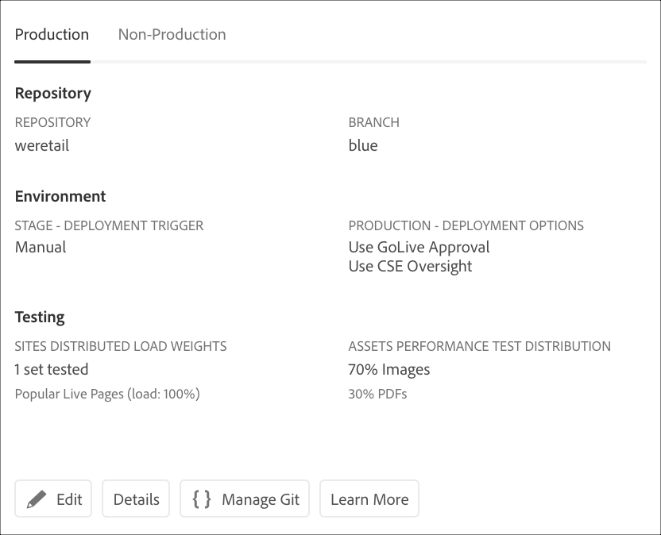
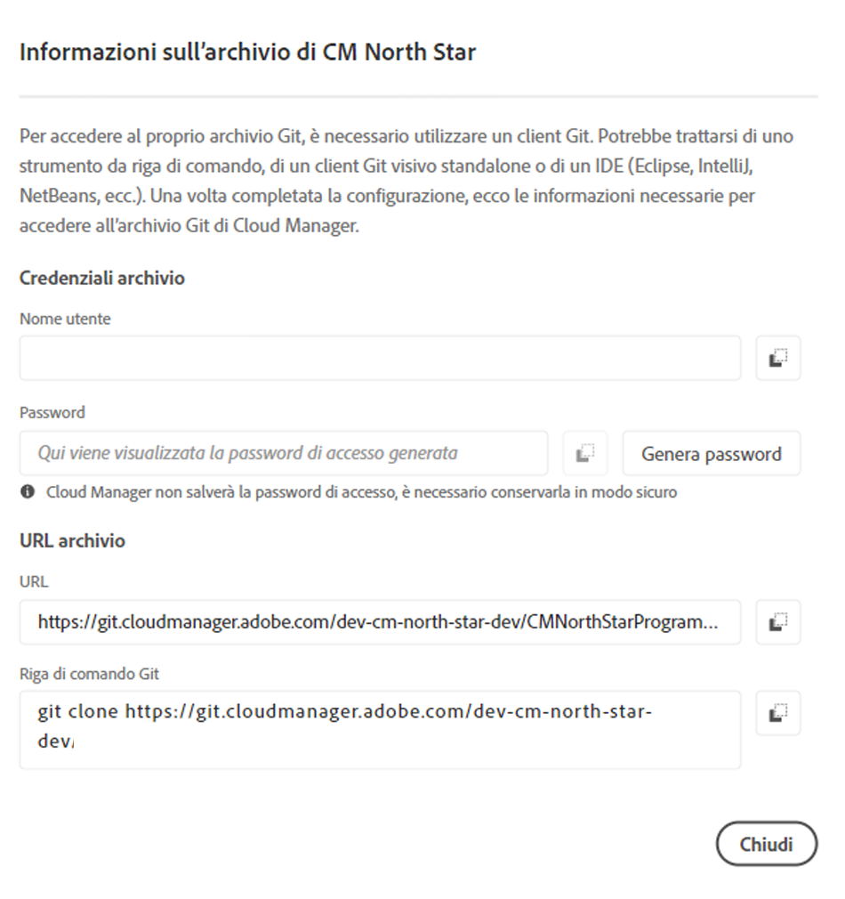

# Accesso a Git {#accessing-git}

Potete accedere e gestire il repository Git utilizzando la gestione dell&#39;account Git self-service dall&#39;interfaccia utente di Cloud Manager.

## Utilizzo della gestione account Git self-service {#self-service-git}

Utilizzate il pulsante **Gestisci Git** disponibile nell&#39;interfaccia utente di Cloud Manager, in particolare sulla scheda della pipeline.

1. Passate alla pagina Panoramica *del* programma e alla scheda Pipelines.

1. Verrà visualizzata l&#39;opzione **Gestisci Git** per accedere e gestire il repository Git.

   

   Inoltre, se si seleziona la scheda **pipeline non produzione** , verrà visualizzata anche l&#39;opzione **Gestisci Git** .

   

>[!NOTE]
>L&#39;opzione **Gestisci Git** è visibile agli utenti nel ruolo Developer o Deployment Manager. Facendo clic su questo pulsante si apre una finestra di dialogo che consente all&#39;utente di trovare l&#39;URL del repository Git di Cloud Manager insieme al nome utente e alla password.

Le considerazioni importanti per gestire il Git in Cloud Manager sono:

* **URL**: L’URL del repository
* **Nome utente**: Nome utente
* **Password**: valore visualizzato quando si fa clic sul pulsante **Generate Password (Genera password)**.

>[!NOTE]
>
>Un utente può estrarre una copia del proprio codice e apportare modifiche nell’archivio del codice locale. Una volta pronti, l&#39;utente può eseguire nuovamente il commit delle modifiche di codice nell&#39;archivio del codice remoto in Cloud Manager.

