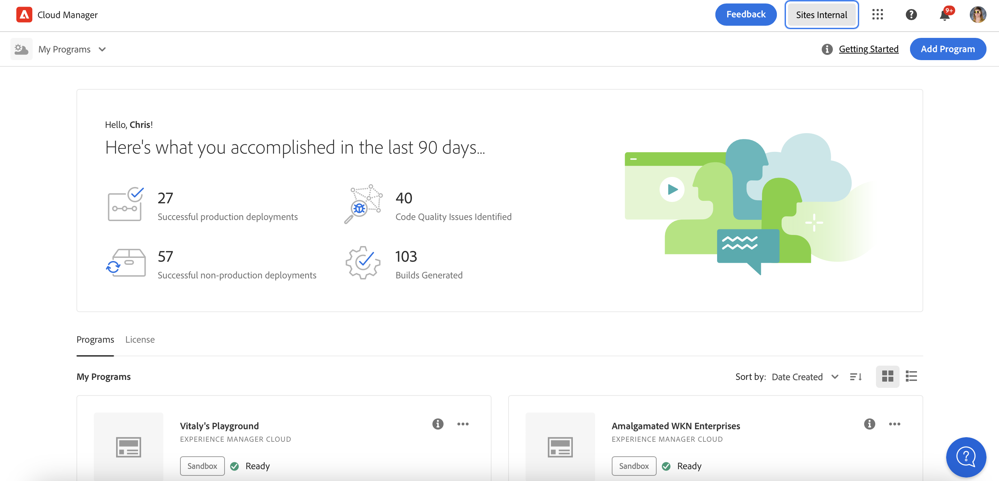

# Dashboard prestazioni CDN {#cdn-performance}

Scopri in che modo Cloud Manager valuta le prestazioni della rete CDN (Content Delivery Network) e cosa puoi imparare dal dashboard.

## Panoramica {#overview}

Ogni programma Cloud Manager ha un dashboard delle prestazioni CDN. Questa dashboard presenta un punteggio complessivo per le prestazioni CDN, oltre a tendenze, avvisi e suggerimenti per eventuali miglioramenti.


## Accedere al dashboard {#accessing}

La dashboard CDN è disponibile nella pagina di panoramica di ogni programma.

1. Accedi a Cloud Manager all’indirizzo [my.cloudmanager.adobe.com](https://my.cloudmanager.adobe.com/) e seleziona l’organizzazione appropriata.

1. Nella console **[Programmi](/help/implementing/cloud-manager/navigation.md#my-programs)** fare clic sul programma di cui si desidera visualizzare il dashboard CDN.

   

1. Nella pagina **Panoramica programma** del programma, scorri verso il basso sotto le schede **Ambienti** e **Pipeline** per visualizzare la scheda **Prestazioni**.

   

## Utilizzare il dashboard {#using}

La dashboard presenta un punteggio complessivo per le prestazioni CDN, oltre a tendenze, avvisi e suggerimenti per miglioramenti, in base alle esigenze.


Per informazioni dettagliate sulle prestazioni CDN e suggerimenti su come migliorarle, fai clic su **Visualizza tendenza**.


Fai clic su **Visualizza** sotto il grafico per modificare l&#39;intervallo di tempo del grafico.

Per suggerimenti su come migliorare le prestazioni CDN, seleziona la scheda **Consigli**.


Fai clic sulla freccia accanto a qualsiasi consiglio nell’elenco per visualizzare i dettagli su quali passi intraprendere per migliorare e la causa del problema.

## Definizione hit cache {#cache-hit}

Il rapporto di hit della cache è una misurazione del numero di richieste di contenuto che una cache può compilare correttamente, rispetto al numero di richieste che riceve. Maggiore è il rapporto cache-hit, migliori sono le prestazioni di una rete CDN.

>[!TIP]
>
>Adobe consiglia agli utenti di puntare a un rapporto di hit della cache del 99%.

```text
Cache Hit Ratio = Cache Hits / (Hits + Misses + Passes + Other)
```

* **Hit** - Dati richiesti dalla cache e trovati.
* **Errore**. Dati richiesti dalla cache non trovati.
* **Passaggio**: i dati vengono richiesti dalla cache e non sono impostati per la memorizzazione in cache di tali dati.
* **Altro** - Tutte le richieste di dati dalla cache che non corrispondono a nessun altro caso.

Le metriche della cache vengono aggiornate ogni 24 ore.

>[!TIP]
>
>Per ulteriori dettagli sull&#39;interazione di Cloud Manager e CDN con Dispatcher, vedere [Memorizzazione in cache in AEM as a Cloud Service](/help/implementing/dispatcher/caching.md).
