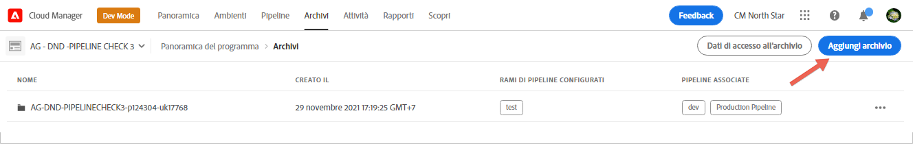
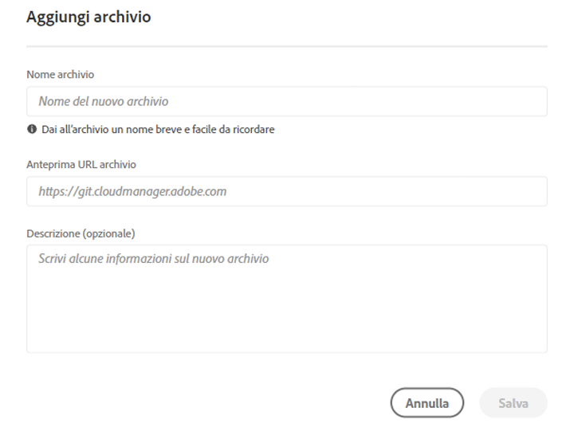
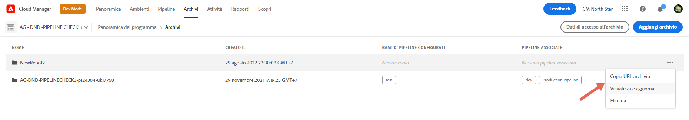

# Repository di Cloud Manager {#cloud-manager-repos}

Gli archivi creati e disponibili in Cloud Manager possono essere visualizzati e gestiti tramite la pagina Repository .

>[!NOTE]
>Esiste un limite di 300 archivi in tutti i programmi di una determinata azienda o [Adobe Identity Management System](https://experienceleague.adobe.com/docs/experience-manager-cloud-service/onboarding/onboarding-concepts/ims.html)).

## Aggiunta e gestione di archivi {#add-manage-repos}

Segui i passaggi seguenti per visualizzare e gestire gli archivi in Cloud Manager:

1. Dalla pagina **Panoramica del programma**, fai clic sulla scheda **Repository** e passa alla pagina **Repository** .

1. Fai clic su **Aggiungi repository** per avviare la procedura guidata.

   >[!NOTE]
   >Per poter aggiungere un archivio, è necessario che un utente con il ruolo di Gestione distribuzione o Proprietario business sia connesso.

   


1. Immetti il nome e la descrizione richiesti e fai clic su **Salva**.

   

1. Seleziona **Salva**. Il repository appena creato verrà visualizzato nella tabella, come illustrato di seguito.

   >[!NOTE]
   >Esiste un singolo archivio *primario* o un ramo per una determinata pipeline. Con [Supporto sottomodulo Git](#git-submodule-support), tuttavia è possibile includere molti rami secondari in fase di creazione.

   

   >[!NOTE]
   >Gli archivi creati in Cloud Manager saranno anche disponibili per la selezione durante i passaggi di aggiunta o modifica della pipeline. Per ulteriori informazioni, consulta [Configurare la pipeline CI-CD](https://experienceleague.adobe.com/docs/experience-manager-cloud-service/implementing/using-cloud-manager/configure-pipeline.html?lang=en) .

1. Puoi selezionare l&#39;archivio e fare clic sulle opzioni del menu dall&#39;estrema destra della tabella in **Copia URL archivio**, **Visualizza e aggiorna** o **Elimina** l&#39;archivio, come mostrato nella figura seguente.

   


## Supporto per i sottomoduli Git {#git-submodule-support}

I sottomoduli Git possono essere utilizzati per unire il contenuto di più rami tra archivi Git in fase di creazione. Quando viene eseguito il processo di compilazione di Cloud Manager, dopo che l’archivio configurato per la pipeline è stato clonato e il ramo configurato viene estratto, se il ramo contiene un file `.gitmodules` nella directory principale, il comando viene eseguito.

```
$ git submodule update --init
```

In questo modo, ogni sottomodulo verrà sottoposto a Check-Out nella directory appropriata. Questa tecnica rappresenta una potenziale alternativa a https://experienceleague.adobe.com/docs/experience-manager-cloud-service/implementing/managing-code/working-with-multiple-source-git-repositories.html per le organizzazioni che hanno dimestichezza con l’utilizzo dei sottomoduli git e non desiderano gestire un processo di unione esterno.

Ad esempio, supponiamo che ci siano tre archivi, ciascuno contenente un singolo ramo denominato main . Nell’archivio &quot;primario&quot;, cioè quello configurato nelle pipeline, il ramo principale ha un file pom.xml che dichiara i progetti contenuti negli altri due archivi:

```xml
<?xml version="1.0" encoding="UTF-8"?>
<project xmlns="http://maven.apache.org/POM/4.0.0" xmlns:xsi="http://www.w3.org/2001/XMLSchema-instance"
    xsi:schemaLocation="http://maven.apache.org/POM/4.0.0 http://maven.apache.org/maven-v4_0_0.xsd">
    <modelVersion>4.0.0</modelVersion>
   
    <groupId>customer.group.id</groupId>
    <artifactId>customer-reactor</artifactId>
    <version>0.0.1-SNAPSHOT</version>
    <packaging>pom</packaging>
   
    <modules>
        <module>project-a</module>
        <module>project-b</module>
    </modules>
   
</project>
```

Aggiungi quindi i sottomoduli per gli altri due archivi:

```
$ git submodule add -b main https://git.cloudmanager.adobe.com/ProgramName/projectA/ project-a
$ git submodule add -b main https://git.cloudmanager.adobe.com/ProgramName/projectB/ project-b
```

Questo si traduce in un file `.gitmodules` simile al seguente:

```
[submodule "project-a"]
    path = project-a
    url = https://git.cloudmanager.adobe.com/ProgramName/projectA/
    branch = main
[submodule "project-b"]
    path = project-b
    url = https://git.cloudmanager.adobe.com/ProgramName/projectB/
    branch = main
```

Ulteriori informazioni sui sottomoduli git sono disponibili nel [manuale di riferimento Git](https://git-scm.com/book/en/v2/Git-Tools-Submodules).

Quando utilizzi i sottomoduli git, tieni a mente quanto segue:

* L’URL Git deve essere esattamente nella sintassi descritta sopra. Per motivi di sicurezza, non incorporare le credenziali in questi URL.
* Sono supportati solo i sottomoduli nella directory principale del ramo.
* I riferimenti ai sottomoduli Git vengono archiviati in commit specifici Git. Di conseguenza, quando vengono apportate modifiche all’archivio dei sottomoduli, il commit a cui si fa riferimento deve essere aggiornato, ad esempio, utilizzando `git submodule update --remote` .

