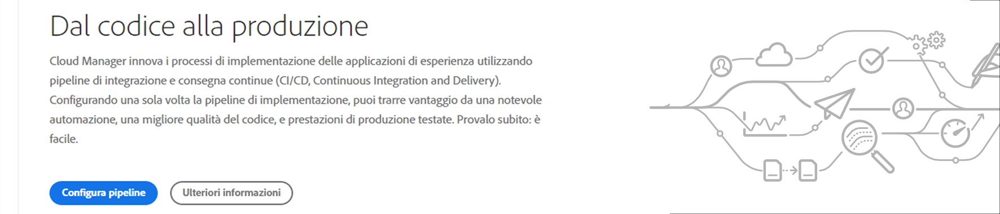
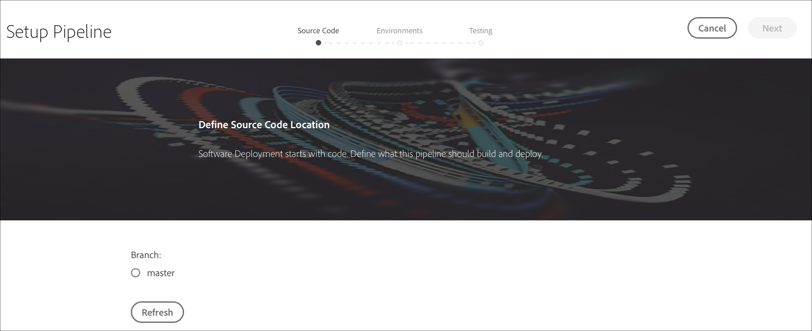
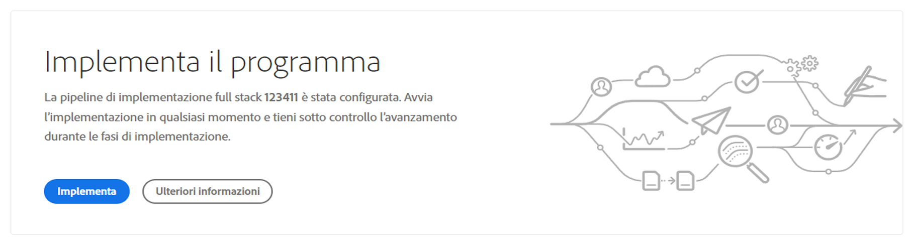
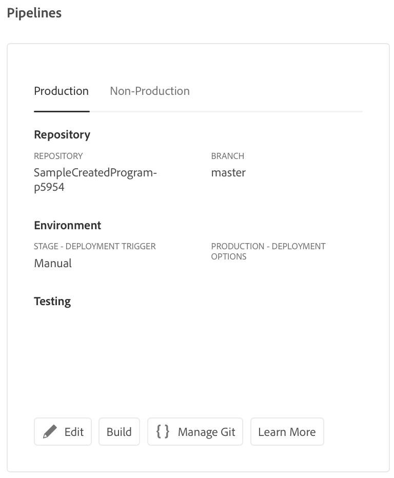

# Configurazione della pipeline CI-CD {#configure-ci-cd-pipeline}

## Informazioni sul flusso {#understanding-the-flow}

Puoi configurare la pipeline dalla sezione **Pipeline Settings (Impostazioni pipeline)** dell’interfaccia utente di [!UICONTROL Cloud Manager].

Gestione distribuzione è responsabile della configurazione della pipeline. In questo caso, selezionate prima un ramo dall&#39;archivio **Git**.

Per configurare la pipeline, l&#39;utente deve:

* definire il trigger che avvierà la pipeline.
* definire i parametri che controllano la distribuzione di produzione.
* configurare i parametri del test delle prestazioni.

## Impostazione della tubazione {#setting-up-the-pipeline}

>[!CAUTION]
>
>La pipeline non può essere impostata finché non viene completata la creazione di un programma e l&#39;archivio Git ha almeno un ramo.

Prima di iniziare a distribuire il codice, devi configurare le impostazioni della pipeline da [!UICONTROL Cloud Manager].

>[!NOTE]
>
>È possibile modificare le impostazioni della pipeline dopo la configurazione iniziale.

## Configurazione delle impostazioni della pipeline da [!UICONTROL Cloud Manager] {#configuring-the-pipeline-settings-from-cloud-manager}

Dopo aver configurato il programma e disporre di almeno un ambiente utilizzando l&#39;interfaccia utente di [!UICONTROL Cloud Manager] , potete configurare la pipeline di distribuzione.

Per configurare il comportamento e le preferenze della pipeline, effettuate le seguenti operazioni:

1. Fate clic su **Imposta tubazione** per impostare e configurare la tubazione.

   

1. Viene visualizzata la schermata **Configurazione tubazione** . Select the branch and click **Next**.

   

1. Configurare le opzioni di distribuzione.

   

   È possibile definire l&#39;attivatore per avviare la pipeline:

   * **Manuale** : l&#39;utilizzo dell&#39;interfaccia utente consente di avviare manualmente la pipeline.
   * **Su modifiche** Git - avvia la pipeline CI/CD ogni volta che vengono aggiunti impegni al ramo git configurato. Anche se selezionate questa opzione, potete sempre avviare la pipeline manualmente.
   Durante la configurazione o la modifica della pipeline, Gestione distribuzione ha la possibilità di definire il comportamento della pipeline quando si verifica un errore importante in una qualsiasi delle porte di qualità.

   Questo è utile per i clienti che desiderano un maggior numero di processi automatizzati. Le opzioni disponibili sono:

   * **Chiedi ogni volta** - Questa è l&#39;impostazione predefinita e richiede l&#39;intervento manuale su qualsiasi errore importante.
   * **Errore immediato** - Se selezionato, la pipeline verrà annullata ogni volta che si verifica un errore importante. In pratica, questo consente di emulare manualmente un utente che rifiuta ogni errore.
   * **Continua immediatamente** : se questa opzione è selezionata, la pipeline procederà automaticamente ogni volta che si verifica un errore importante. Si tratta essenzialmente di un&#39;emulazione manuale di un utente che approva ogni errore.

1. Fate clic su **Avanti** per accedere alla scheda **Test** e definire i criteri di test per il programma.

   

1. Fai clic su **Salva**. Nella pagina *Panoramica* è ora visualizzata la scheda **Implementa il programma** . Fate clic sul pulsante **Distribuisci** per distribuire il programma.

   

## Tubazioni non di produzione e di qualità del codice

Oltre alla pipeline principale che viene implementata per fasi e produzione, i clienti sono in grado di impostare altri oleodotti, denominati **Non-Production Pipelines**. Tali pipeline eseguono sempre i passaggi di creazione e qualità del codice. Facoltativamente, possono anche essere distribuiti nell&#39;ambiente Adobe Managed Services.

Nella schermata iniziale, queste condotte sono elencate in una nuova scheda:

1. Accedete alla sezione **Tubi** non di produzione dalla schermata iniziale di Cloud Manager.

   

1. Fate clic sul pulsante **Aggiungi** per specificare il nome della tubazione, il tipo di tubazione e il ramo Git.

   Inoltre, puoi impostare l&#39;attivatore di distribuzione e un importante comportamento di errore dalle opzioni della pipeline.

   

1. Fate clic su **Salva** e la pipeline viene visualizzata sulla scheda nella schermata iniziale con tre azioni, come illustrato di seguito:

   

   * **Modifica** : consente di modificare le impostazioni della pipeline
   * **Genera** : consente di passare alla pagina di esecuzione dalla quale è possibile eseguire la pipeline
   * **Gestione Git** : consente all&#39;utente di ottenere le informazioni necessarie per accedere all&#39;archivio Git di Cloud Manager

## Passaggi successivi {#the-next-steps}

Dopo aver configurato la pipeline, è necessario distribuire il codice.

Per ulteriori informazioni, consulta [Distribuzione del codice](deploy-code.md) .
