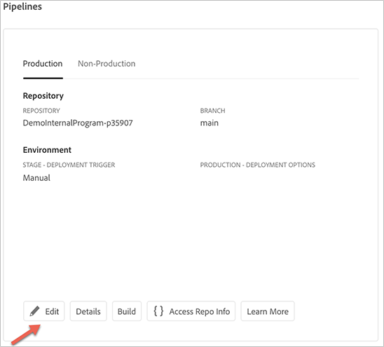
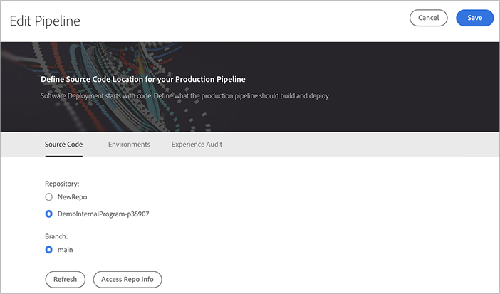
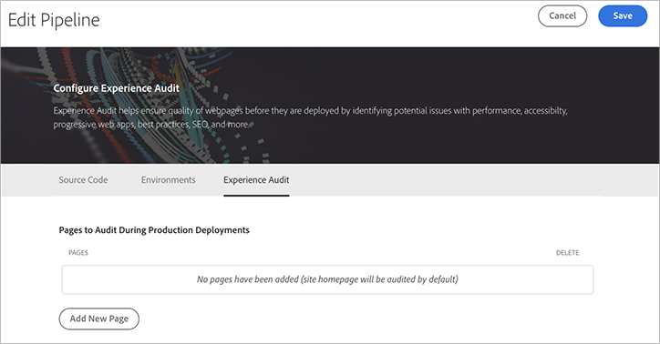
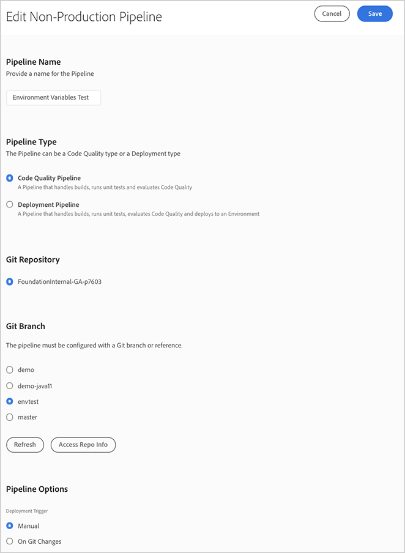

# Configurazione della pipeline CI-CD {#configure-ci-cd-pipeline}

In Cloud Manager sono disponibili due tipi di pipeline:

* **Pipeline** di produzione:

   È possibile aggiungere una pipeline di produzione solo dopo la creazione di un set di ambienti di produzione e stage.

   Per ulteriori informazioni, consulta [Configurazione della pipeline di produzione](configure-pipeline.md#setting-up-the-pipeline) .

* **Pipeline** non di produzione:

   È possibile aggiungere una pipeline non di produzione dalla pagina **Panoramica** dall’interfaccia utente di Cloud Manager.

   Per ulteriori informazioni, consulta [Solo pipeline non di produzione e qualità del codice](configure-pipeline.md#non-production-pipelines) .

>[!NOTE]
>Per configurare la pipeline, devi:
> * definisci il trigger che avvierà la pipeline.
> * definire i parametri che controllano la distribuzione di produzione.
> * configurare i parametri del test delle prestazioni.

## Impostazione della pipeline di produzione {#setting-up-production-pipeline}

Gestione distribuzione è responsabile della configurazione della pipeline di produzione.

>[!NOTE]
>Non è possibile impostare una pipeline di produzione finché non viene completata la creazione di un programma, l’archivio Git dispone di almeno un ramo e viene creato un set di ambiente Produzione e Stage.

Prima di iniziare a distribuire il codice, devi configurare le impostazioni della pipeline da [!UICONTROL Cloud Manager].

>[!NOTE]
>
>È possibile modificare le impostazioni della pipeline dopo la configurazione iniziale.

## Configurazione delle impostazioni della pipeline da [!UICONTROL Cloud Manager] {#configuring-the-pipeline-settings-from-cloud-manager}

Dopo aver configurato il programma e disporre di almeno un ambiente utilizzando l&#39;interfaccia utente di [!UICONTROL Cloud Manager], puoi configurare la pipeline di distribuzione.

Per configurare il comportamento e le preferenze per la pipeline, effettua le seguenti operazioni:

1. Fai clic su **Imposta pipeline** per impostare e configurare la pipeline.

   

1. Viene visualizzata la schermata **Pipeline di installazione**. Seleziona il ramo e fai clic su **Avanti**.

   

1. Configura le opzioni di distribuzione.

   

   Puoi definire il trigger per avviare la pipeline:

   * **Manuale** : utilizzando l’interfaccia utente si avvia manualmente la pipeline.
   * **In Modifiche Git** : avvia la pipeline CI/CD ogni volta che vengono aggiunti dei commit al ramo Git configurato. Anche se selezioni questa opzione, puoi sempre avviare la pipeline manualmente.

   Durante la configurazione o la modifica della pipeline, Deployment Manager ha la possibilità di definire il comportamento della pipeline quando si verifica un errore importante in uno qualsiasi dei gate di qualità.

   Questo è utile per i clienti che desiderano processi più automatizzati. Le opzioni disponibili sono:

   * **Chiedi ogni volta**  - Questa è l&#39;impostazione predefinita e richiede un intervento manuale su qualsiasi errore importante.
   * **Annulla immediatamente** : se selezionata, la pipeline verrà annullata ogni volta che si verifica un errore importante. In sostanza, questo sta simulando un utente che rifiuta manualmente ogni errore.
   * **Approva immediatamente** : se selezionata, la pipeline procede automaticamente ogni volta che si verifica un errore importante. In sostanza, questo sta simulando un utente che approva manualmente ogni errore.

1. Le impostazioni della pipeline di produzione includono una terza scheda etichettata come **Audit esperienze**. Questa opzione fornisce una tabella per i percorsi URL che devono sempre essere inclusi nel controllo di esperienza.

   >[!NOTE]
   >Fai clic su **Aggiungi nuova pagina** per definire il tuo collegamento personalizzato.

   

   Fai clic su **Aggiungi nuova pagina** per fornire un percorso URL da includere nel controllo di esperienza.

   Ad esempio, se desideri includere `https://wknd.site/us/en/about-us.html` in Experience Audit, immetti il percorso `us/en/about-us.html` in questo campo e fai clic su **Salva**.

   

   L’URL visualizzato nella tabella sarà:

   `https://publish-p14253-e43686.adobeaemcloud.com/us/en/about-us.html`

   

   È possibile includere un massimo di 25 righe. Se in questa sezione non sono presenti pagine inviate dall’utente, per impostazione predefinita la home page del sito verrà inclusa in Experience Audit.

   Per ulteriori informazioni, consulta [Informazioni sui risultati di Experience Audit](/help/implementing/cloud-manager/experience-audit-testing.md) .

   >[!NOTE]
   > Le pagine configurate verranno inviate al servizio e valutate in base alle prestazioni, all’accessibilità, all’ottimizzazione SEO (Search Engine Optimization), alle best practice e ai test PWA (Progressive Web App).

1. Fai clic su **Salva** nella schermata **Modifica pipeline** . Nella pagina **Panoramica** viene ora visualizzata la scheda **Implementa il programma** . Fare clic sul pulsante **Distribuisci** per distribuire il programma.

   

### Modifica di una pipeline di produzione {#editing-prod-pipeline}

Puoi modificare le configurazioni della pipeline dalla pagina **Panoramica del programma** .

Per modificare la pipeline configurata, effettua le seguenti operazioni:

1. Passa alla scheda **Pipelines** dalla pagina **Panoramica del programma** .

1. Fai clic su **Modifica** dalla scheda **Pipelines** .

   

1. La scheda **Codice sorgente** ti consente di aggiornare l’archivio. Fai clic su **Accedi a informazioni sul repository** per aggiornare il repository.

   >[!NOTE]
   >Per informazioni su come aggiungere e gestire archivi in Cloud Manager, consulta [Aggiunta e gestione di archivi](/help/implementing/cloud-manager/cloud-manager-repositories.md#add-manage-repos) .

   

1. La scheda **Ambienti** consente di aggiornare le opzioni di stage e produzione.

   

1. L’opzione **Audit esperienze** consente di aggiornare o aggiungere nuove pagine.

   

1. Fai clic su **Salva** una volta completata la modifica della pipeline.

## Solo pipeline non di produzione e di qualità del codice {#non-production-pipelines}

Oltre alla pipeline principale che viene implementata in fase e produzione, i clienti possono impostare pipeline aggiuntive, denominate **Non-Production Pipelines**. Queste pipeline eseguono sempre i passaggi di creazione e qualità del codice. Facoltativamente, possono anche distribuire in AEM come ambiente di Cloud Service.

Nella schermata iniziale, queste pipeline sono elencate in una nuova scheda:

1. Accedi alla sezione **pipeline non di produzione** dalla schermata iniziale di Cloud Manager.

   

1. Fate clic sul pulsante **Aggiungi** per specificare il nome della pipeline, il tipo di pipeline e la diramazione Git.

   Inoltre, è possibile impostare il trigger di distribuzione e il comportamento di errore importante dalle opzioni della pipeline.

   

1. Fai clic su **Salva** e la pipeline viene visualizzata sulla scheda nella schermata iniziale con cinque azioni, come illustrato di seguito:

   

   * **Modifica** : consente di modificare le impostazioni della pipeline
   * **Dettagli** : fornisce dettagli sull’esecuzione della pipeline
   * **Build** : consente di passare alla pagina di esecuzione dalla quale è possibile eseguire la pipeline.
   * **Accesso a informazioni sul repository** : consente all’utente di ottenere le informazioni necessarie per accedere all’archivio Git di Cloud Manager
   * **Ulteriori informazioni** : descrive la risorsa della documentazione della pipeline CI/CD.

### Modifica di una pipeline non di produzione {#editing-nonprod-pipeline}

Puoi modificare le configurazioni della pipeline dalla pagina **Panoramica del programma** .

Per modificare la pipeline non di produzione configurata, effettua le seguenti operazioni:

1. Passa alla scheda **Pipelines** dalla pagina **Panoramica del programma** .

1. Seleziona la scheda **Non produzione** e fai clic su **Modifica** dopo aver selezionato le pipeline desiderate.

   

1. Seleziona l&#39;archivio desiderato e gli altri aggiornamenti richiesti e fai clic su **Salva**.

   

## Passaggi successivi {#the-next-steps}

Dopo aver configurato la pipeline, devi distribuire il codice.

Per ulteriori informazioni, consulta [Implementare il codice](deploy-code.md) .
