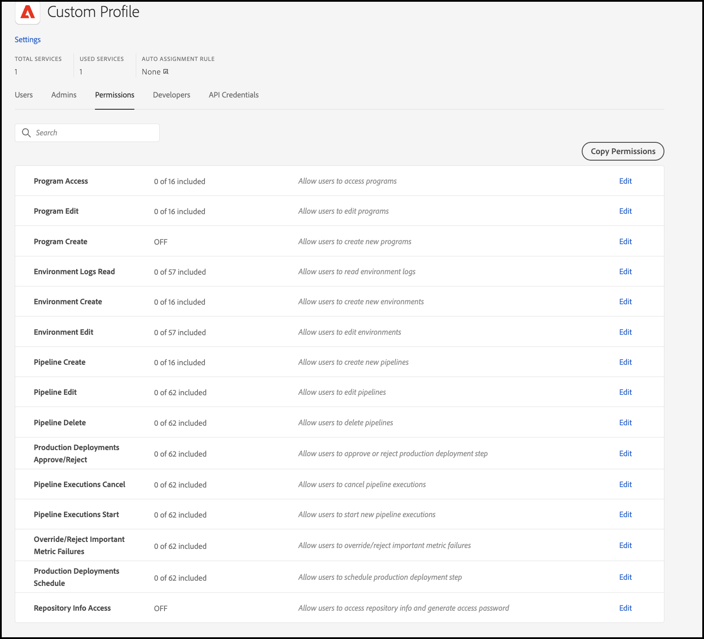

# Autorizzazioni personalizzate {#custom-permissions}

Scopri come impostare profili di autorizzazione personalizzati in Cloud Manager. Puoi configurare controlli di accesso specifici per programmi, pipeline e ambienti, per avere un controllo granulare sulle operazioni eseguibili da ogni utente.

## Introduzione {#introduction}

Cloud Manager dispone di un set di ruoli predefiniti che determinano l’accesso a varie funzioni di Cloud Manager:

* Proprietario business
* Responsabile del programma
* Responsabile della distribuzione
* Sviluppatore

Le autorizzazioni personalizzate consentono agli utenti di creare profili di autorizzazione personalizzati con autorizzazioni configurabili per limitare l’accesso degli utenti di Cloud Manager a programmi, pipeline e ambienti.

>[!TIP]
>Per informazioni dettagliate sui ruoli predefiniti, vedere [Profili team e prodotto di AEM as a Cloud Service](/help/onboarding/aem-cs-team-product-profiles.md).

## Usare le autorizzazioni personalizzate {#using}

La creazione e l’utilizzo di autorizzazioni personalizzate richiede i tre passaggi seguenti:

1. [Crea un profilo di prodotto](#create).
1. [Assegna autorizzazioni personalizzate al profilo di prodotto](#assign-permissions).
1. [Assegna utenti al profilo di prodotto](#assign-users).

>[!TIP]
>Durante la creazione di autorizzazioni personalizzate, potrebbe essere utile esaminare le sezioni [Termini](#terms) e [Autorizzazioni configurabili](#configurable-permissions).

>[!IMPORTANT]
>Per creare profili di prodotto e gestire le autorizzazioni per Cloud Manager, è necessario disporre dei diritti di amministratore del prodotto in Admin Console per Adobe Experience Manager as a Cloud Service.

### Creare un profilo di prodotto {#create}

1. Accedi a Cloud Manager all&#39;indirizzo [my.cloudmanager.adobe.com](https://my.cloudmanager.adobe.com/).

1. Nella pagina di destinazione di Cloud Manager, fai clic su **Gestisci accesso**.

   

1. In Admin Console, fai clic su **Nuovo profilo**.

   

1. Specifica i dettagli generali sul profilo.

   * **Nome del profilo di prodotto** : nome descrittivo del profilo
   * **Nome visualizzato** - Nome abbreviato visualizzato nell&#39;interfaccia utente (opzioni)
   * **Descrizione** : descrizione informativa del profilo che ne spiega la finalità (facoltativa)
   * **Notifica gli utenti via e-mail** - Gli utenti ricevono una notifica e-mail quando vengono aggiunti o rimossi da questo profilo.

1. Fai clic su **Salva**.

Il nuovo profilo di prodotto viene salvato ed è visibile nell’elenco dei profili di prodotto in Admin Console.

### Assegnare autorizzazioni personalizzate al profilo di prodotto {#assign-permissions}

1. In Admin Console, fai clic sul nome del [nuovo profilo di prodotto creato](#create).

1. Nella pagina **Profilo personalizzato**, fare clic sulla scheda **Autorizzazioni**.

   

1. Nella riga del nome di un&#39;autorizzazione, fare clic su **Modifica**.

1. Nella finestra di dialogo **Modifica autorizzazioni per il profilo personalizzato** eseguire una delle operazioni seguenti:

   * Nella parte superiore della colonna **Elementi autorizzazioni disponibili**, fare clic su  **Aggiungi tutto** per aggiungere tutte le autorizzazioni.
   * Per aggiungere una singola autorizzazione alla colonna **Elementi di autorizzazione inclusi**, fare clic sull&#39;icona associata .

     

1. Fai clic su **Salva**.

### Assegnare utenti al profilo di prodotto {#assign-users}

1. In Admin Console, fai clic sul nome del [nuovo profilo di prodotto a cui hai assegnato le autorizzazioni personalizzate](#assign-permissions).

1. Nella finestra visualizzata, fare clic sulla scheda **Utenti**.

1. Fai clic su **Aggiungi utenti** e assegna gli utenti al profilo di prodotto con autorizzazioni personalizzate.

In [Gestione dei profili di prodotto per gli utenti aziendali](https://helpx.adobe.com/it/enterprise/using/manage-product-profiles.html), consulta **Aggiungere utenti e gruppi di utenti a un profilo di prodotto** per ulteriori dettagli su come utilizzare Admin Console.

## Autorizzazioni configurabili {#configurable-permissions}

Quando crei un profilo di prodotto personalizzato, sono disponibili le seguenti autorizzazioni.

| Autorizzazione | Descrizione |
| --- | --- |
| `Program Create` | Consenti agli utenti di creare un programma. |
| `Program Access` | Consenti agli utenti di accedere ai programmi. |
| `Program Edit` | Consenti agli utenti di modificare i programmi. |
| `Environment Create` | Consenti agli utenti di creare un ambiente. |
| `Environment Edit` | Consenti agli utenti di aggiornare e modificare gli ambienti. |
| `Environment Logs Read` | Consenti agli utenti di leggere i registri dell’ambiente. |
| `Environment Variables Manage` | Consenti agli utenti di creare, modificare o eliminare configurazioni di ambiente. |
| `Environment Restore Create` | Consenti agli utenti di creare un ripristino dell’ambiente. |
| `Rapid Development Environment Reset` | Consenti agli utenti di reimpostare l’ambiente di sviluppo rapido (RDE). |
| `Content Copy Manage` | Consenti agli utenti di gestire le operazioni di copia dei contenuti. |
| `Pipeline Create` | Consenti agli utenti di creare pipeline. |
| `Pipeline Delete` | Consenti agli utenti di eliminare le pipeline. |
| `Pipeline Edit` | Consenti agli utenti di modificare le pipeline. |
| `Production Deployments Approve/Reject` | Consenti agli utenti di approvare o rifiutare un passaggio di distribuzione di produzione. |
| `Pipeline Executions Cancel` | Consenti agli utenti di annullare le esecuzioni della pipeline. |
| `Pipeline Executions Start` | Consenti agli utenti di avviare una nuova pipeline di esecuzione. |
| `Override/Reject Important Metric Failures` | Consenti agli utenti di escludere/rifiutare errori di metriche importanti. |
| `Production Deployments Schedule` | Consenti agli utenti di pianificare un passaggio di implementazione di produzione. |
| `Repository Info Access` | Consenti agli utenti di accedere alle informazioni dell’archivio e generare una password di accesso. |
| `Repository Create` | Consenti agli utenti di creare archivi Git. |
| `Repository Delete` | Consenti agli utenti di eliminare gli archivi Git. |
| `Repository Edit` | Consenti agli utenti di modificare gli archivi Git. |
| `Repository Code Generate` | Consenti agli utenti di generare un progetto da Archetipo. |
| `Domain Name Manage` | Consenti agli utenti di creare, modificare o eliminare i nomi di dominio. |
| `IP Allowlist Manage` | Consenti agli utenti di creare, modificare o eliminare i elenchi Consentiti IP di e di inserire nell&#39;elenco Consentiti l’associazione degli IP di. |
| `Network Infrastructure Manage` | Consenti agli utenti di creare, eliminare, modificare e testare infrastrutture di rete. |
| `SSL Certificate Manage` | Consenti agli utenti di creare, modificare o eliminare certificati SSL. |
| `New Relic Sub Account User Manage` | Consenti agli utenti di leggere/modificare gli utenti degli account secondari di New Relic. |

### Autorizzazioni a livello di organizzazione {#organization-level}

Le autorizzazioni a livello di organizzazione si riferiscono alle autorizzazioni che vengono sempre concesse in tutti i programmi di un’organizzazione.

Le autorizzazioni seguenti sono autorizzazioni a livello di organizzazione:

* **`Program Create`** - Questa autorizzazione consente agli utenti di creare un programma nell&#39;organizzazione.
* **Accesso alle informazioni dell&#39;archivio** - Questa autorizzazione a livello di tenant/organizzazione consente agli utenti di generare un nome utente, una password e un URL dell&#39;archivio per accedere e contribuire a un progetto cliente.
   * Il nome utente e la password per l’accesso all’archivio sono comuni a tutti gli archivi dell’organizzazione. Tuttavia, l’URL dell’archivio è univoco per ciascun programma.
   * Per ulteriori informazioni, vedere [Accesso agli archivi](/help/implementing/cloud-manager/managing-code/accessing-repos.md).

## Termini {#terms}

I seguenti termini vengono utilizzati per creare e gestire autorizzazioni personalizzate e ruoli predefiniti.

| Termine | Descrizione |
| --- | --- |
| Autorizzazioni predefinite | Ruoli predefiniti come **Proprietario business** e **Responsabile dell&#39;implementazione** per gestire varie funzioni di Cloud Manager. Per informazioni dettagliate sui ruoli predefiniti, vedere [Profili team e prodotto di AEM as a Cloud Service](/help/onboarding/aem-cs-team-product-profiles.md). |
| Autorizzazioni personalizzate | Le funzioni di Cloud Manager consentono agli utenti di creare profili di autorizzazione per definire ruoli che governino le funzioni supportate di Cloud Manager. |
| Profilo prodotto | Creato in Admin Console per gestire le autorizzazioni configurabili applicabili agli utenti che fanno parte del profilo di autorizzazione. |
| Autorizzazione configurabile | Autorizzazioni di Cloud Manager che puoi configurare nel profilo di autorizzazione. |
| Elemento di autorizzazione | Un programma, un ambiente o una risorsa pipeline a cui è possibile applicare un’autorizzazione. |

Gli elementi di autorizzazione si riferiscono all’ambito in cui verranno applicate le autorizzazioni. In genere, si tratta di uno dei seguenti.

| Tipo di elemento di autorizzazione | Esempio | Descrizione |
| --- | --- | --- |
| Organizzazione | organizzazione:companyA | Tutte le risorse applicabili di un’organizzazione. Una risorsa può essere un programma, un ambiente o una pipeline. Se l’utente aggiunge un’organizzazione per qualsiasi autorizzazione, anche tutte le nuove risorse in tale organizzazione disporranno di tale autorizzazione. |
| Programma | Programma A | Tutte le risorse applicabili di un programma. |
| Ambiente | Programma A: ambiente | Applicabile a un ambiente specifico. |
| Pipeline | Programma A: pipeline | Applicabile a una pipeline specifica. |

## Note sull’utilizzo {#usage-notes}

* Un profilo di autorizzazioni personalizzato elenca anche i programmi, gli ambienti e le pipeline di AMS durante la configurazione delle autorizzazioni.
* La visualizzazione delle risorse come programma, ambiente e pipeline create in Cloud Manager in Admin Console per la configurazione delle autorizzazioni potrebbe richiedere alcuni minuti.
* In rari scenari in cui il servizio di autorizzazioni personalizzate non risponde, i profili predefiniti restano ancora disponibili e gli utenti nei profili predefiniti dispongono ancora dell’accesso appropriato.

## Domande frequenti {#faq}

### Quali profili di autorizzazione sono profili di autorizzazione predefiniti?

* Proprietario business
* Responsabile del programma
* Responsabile della distribuzione
* Sviluppatore

Per informazioni dettagliate sui ruoli predefiniti, vedere [Profili team e prodotto di AEM as a Cloud Service](/help/onboarding/aem-cs-team-product-profiles.md).

### Cosa succederà ai profili di autorizzazione predefiniti con l’introduzione dei profili personalizzati?

I profili di prodotto predefiniti e i ruoli di Cloud Manager continuano a funzionare come prima.

### È possibile modificare i profili di autorizzazione predefiniti?

No. I profili predefiniti non sono modificabili. Impossibile aggiungere o rimuovere autorizzazioni dal profilo di autorizzazione predefinito. È possibile aggiungere o rimuovere utenti solo dai profili predefiniti.

### È necessario eliminare i profili di autorizzazione predefiniti poiché ora sono disponibili i profili personalizzati?

Non eliminare i profili di autorizzazione predefiniti da Admin Console.

### È possibile aggiungere utenti a più profili di autorizzazione?

Sì. Un utente può far parte di più profili, inclusi profili di autorizzazione predefiniti e personalizzati. Un utente assegnato a più profili ha a disposizione le autorizzazioni combinate di tutti i profili di autorizzazione assegnati.

### Cosa succede se un utente dispone dell’autorizzazione per modificare un ambiente o una pipeline ma non ha accesso a un programma che contiene l’ambiente o la pipeline?

L&#39;utente non è in grado di accedere all&#39;ambiente o alla pipeline se non dispone delle autorizzazioni **Accesso al programma** contenenti l&#39;ambiente o la pipeline.
