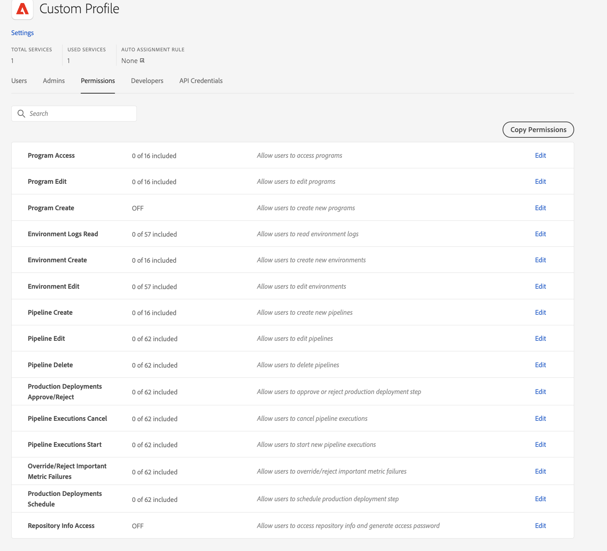

# Autorizzazioni personalizzate {#custom-permissions}

Scopri come utilizzare le autorizzazioni personalizzate per creare profili di autorizzazioni personalizzati con autorizzazioni configurabili per limitare l’accesso a programmi, pipeline e ambienti per gli utenti di Cloud Manager.

## Introduzione {#introduction}

Cloud Manager dispone di un set di ruoli predefiniti che determinano l’accesso a varie funzioni di Cloud Manager:

* Proprietario business
* Responsabile del programma
* Responsabile della distribuzione
* Sviluppatore

Le autorizzazioni personalizzate consentono agli utenti di creare profili di autorizzazione personalizzati con autorizzazioni configurabili per limitare l’accesso degli utenti di Cloud Manager a programmi, pipeline e ambienti.

>[!TIP]
>
>Per informazioni dettagliate sui ruoli predefiniti, vedere [Profili team e prodotto di AEM as a Cloud Service](/help/onboarding/aem-cs-team-product-profiles.md).

## Utilizzo di autorizzazioni personalizzate {#using}

Per creare e utilizzare autorizzazioni personalizzate, è necessario seguire tre passaggi:

1. [Crea un profilo di prodotto](#create).
1. [Assegna autorizzazioni personalizzate al profilo di prodotto](#assign-permissions).
1. [Assegna utenti al profilo di prodotto](#assign-users).

Questa sezione descrive questi passaggi. Potrebbe essere utile visualizzare le [sezioni Termini](#terms) e [Autorizzazioni configurabili](#configurable-permissions) durante la creazione di autorizzazioni personalizzate.

>[!NOTE]
>
>Per poter creare profili e gestire le autorizzazioni per Cloud Manager, devi disporre dei diritti di amministratore del prodotto in Admin Console Adobe Experience Manager as a Cloud Service.

### Creare un nuovo profilo di prodotto {#create}

Crea innanzitutto un profilo di prodotto prima del quale puoi assegnare autorizzazioni personalizzate.

1. Accedi a Cloud Manager all&#39;indirizzo [my.cloudmanager.adobe.com](https://my.cloudmanager.adobe.com/).

1. Nella pagina di destinazione di Cloud Manager, seleziona il pulsante **Gestisci accesso**.

1. Verrai reindirizzato alla scheda **Prodotti** dell’Admin Console, in cui puoi gestire gli utenti e le autorizzazioni per Cloud Manager. Nell&#39;Admin Console, selezionare il pulsante **Nuovo profilo**.

1. Specifica i dettagli generali sul profilo.

   * **Nome del profilo di prodotto** : nome descrittivo del profilo
   * **Nome visualizzato** - Nome abbreviato visualizzato nell&#39;interfaccia utente (opzioni)
   * **Descrizione** : descrizione informativa del profilo che ne spiega la finalità (facoltativa)
   * **Notifica gli utenti via e-mail** - Se selezionata, gli utenti ricevono una notifica via e-mail quando vengono aggiunti o rimossi dal profilo.

1. Al termine, seleziona **Salva**.

Il nuovo profilo di prodotto viene salvato ed è visibile nell’elenco dei profili di prodotto in Admin Console.

### Assegnare autorizzazioni personalizzate al profilo {#assign-permissions}

Ora che disponi di un nuovo profilo di prodotto, puoi assegnargli le autorizzazioni personalizzate.

1. Nell&#39;Admin Console, seleziona il nome del [nuovo profilo di prodotto creato](#create).

1. Nella finestra visualizzata, seleziona la scheda **Autorizzazioni** per visualizzare un elenco di autorizzazioni modificabili.

   

1. Seleziona il collegamento **Modifica** di un&#39;autorizzazione per modificarla.

1. Viene visualizzata la finestra **Modifica autorizzazione**.
   * L’autorizzazione selezionata nel passaggio precedente è selezionata nella colonna a sinistra.
   * Gli elementi di autorizzazione disponibili per l’assegnazione dell’autorizzazione si trovano nella colonna centrale indicata con Elementi di **Autorizzazioni disponibili**.
   * Gli elementi di autorizzazione assegnati si trovano nella colonna a destra indicata con **Elementi di autorizzazione inclusi**.

   

1. Selezionare l&#39;icona più (`+`) accanto all&#39;elemento di autorizzazione per aggiungerlo alla colonna **Elementi di autorizzazione inclusi**.

   * Per ulteriori informazioni, seleziona l&#39;icona `i` accanto a un elemento di autorizzazione.

1. Seleziona il pulsante **Aggiungi tutto** nella parte superiore della colonna **Autorizzazioni disponibili** per aggiungere tutte le autorizzazioni.

1. Seleziona **Salva** al termine della definizione degli elementi di autorizzazione per il nuovo profilo di prodotto.

Il nuovo profilo di prodotto viene ora salvato con le relative autorizzazioni personalizzate.

### Assegnare utenti alle autorizzazioni personalizzate {#assign-users}

Ora puoi assegnare gli utenti al nuovo profilo di prodotto creato con le autorizzazioni personalizzate.

1. Nell&#39;Admin Console, selezionare il nome del [nuovo profilo di prodotto a cui sono state assegnate le autorizzazioni personalizzate](#assign-permissions).

1. Nella finestra visualizzata, seleziona la scheda **Utenti**.

1. Seleziona il pulsante **Aggiungi utenti** e assegna gli utenti al tuo nuovo profilo di prodotto con autorizzazioni personalizzate.

Consulta la sezione **Aggiungere utenti e gruppi di utenti a un profilo di prodotto** del documento [Gestire i profili di prodotto per gli utenti aziendali](https://helpx.adobe.com/it/enterprise/using/manage-product-profiles.html) per ulteriori dettagli su come utilizzare l&#39;Admin Console.

## Autorizzazioni configurabili {#configurable-permissions}

Per creare profili personalizzati sono disponibili le seguenti autorizzazioni.

| Autorizzazione | Descrizione |
|---|---|
| Creazione programma | Consenti agli utenti di creare un programma |
| Accesso al programma | Consenti agli utenti di accedere ai programmi |
| Modifica programma | Consenti agli utenti di modificare i programmi |
| Creazione dell’ambiente | Consenti agli utenti di creare un ambiente |
| Modifica dell’ambiente | Consenti agli utenti di aggiornare e modificare gli ambienti |
| Lettura registri ambiente | Consenti agli utenti di leggere i registri dell’ambiente |
| Gestione variabili di ambiente | Consenti agli utenti di creare, modificare o eliminare configurazioni di ambiente |
| Creazione ripristino ambiente | Consenti agli utenti di creare il ripristino dell’ambiente |
| Ripristino rapido dell’ambiente di sviluppo | Consenti agli utenti di ripristinare l&#39;ambiente di sviluppo rapido |
| Gestione della copia dei contenuti | Consenti agli utenti di gestire le operazioni di copia dei contenuti |
| Crea pipeline | Consenti agli utenti di creare pipeline |
| Elimina pipeline | Consenti agli utenti di eliminare le pipeline |
| Modifica pipeline | Consenti agli utenti di modificare le pipeline |
| Approvazione/rifiuto delle distribuzioni in produzione | Consenti agli utenti di approvare o rifiutare un passaggio di distribuzione di produzione |
| Annullamento delle esecuzioni della pipeline | Consenti agli utenti di annullare le esecuzioni della pipeline |
| Avvio delle esecuzioni della pipeline | Consenti agli utenti di avviare una nuova esecuzione della pipeline |
| Sostituzione/Rifiuto degli errori importanti della metrica | Consenti agli utenti di ignorare/rifiutare errori importanti di metrica |
| Pianificazione delle distribuzioni in produzione | Consenti agli utenti di pianificare un passaggio di distribuzione in produzione |
| Accesso alle informazioni dell’archivio | Consenti agli utenti di accedere alle informazioni dell’archivio e generare la password di accesso |
| Creazione di un archivio | Consenti agli utenti di creare archivi Git |
| Eliminazione di un archivio | Consenti agli utenti di eliminare gli archivi Git |
| Modifica di un archivio | Consenti agli utenti di modificare gli archivi Git |
| Generazione del codice di un archivio | Consenti agli utenti di generare progetti da un archetipo |
| Gestione nome dominio | Consenti agli utenti di creare, modificare o eliminare i nomi di dominio |
| INSERIRE NELL&#39;ELENCO CONSENTITI Gestione IP | Consenti agli utenti di creare, modificare o eliminare l&#39;associazione del elenco Consentiti inserii nell&#39;elenco Consentiti di IP e del IP |
| Gestione dell&#39;infrastruttura di rete | Consenti agli utenti di creare, modificare o eliminare infrastrutture di rete |
| Gestione certificati SSL | Consenti agli utenti di creare, modificare o eliminare certificati SSL |
| Gestione utenti account secondario New Relic | Consenti agli utenti di leggere/modificare gli utenti dell’account secondario di New Relic |

### Autorizzazioni a livello di organizzazione {#organization-level}

Le autorizzazioni a livello di organizzazione si riferiscono alle autorizzazioni che vengono sempre concesse in tutti i programmi di un’organizzazione.

Le autorizzazioni seguenti sono autorizzazioni a livello di organizzazione:

* **Creazione programma** - Questa autorizzazione consente agli utenti di creare un programma nell&#39;organizzazione.
* **Accesso alle informazioni dell&#39;archivio** Questa autorizzazione a livello di tenant/organizzazione consente agli utenti di generare nome utente, password e URL dell&#39;archivio per accedere e contribuire al progetto del cliente.
   * Il nome utente e la password per l’accesso all’archivio sono comuni a tutti gli archivi nell’organizzazione, tuttavia l’URL dell’archivio è univoco per ciascun programma.
   * Per ulteriori informazioni, vedere [Accesso agli archivi](/help/implementing/cloud-manager/managing-code/accessing-repos.md).

## Termini {#terms}

I seguenti termini vengono utilizzati per creare e gestire autorizzazioni personalizzate e ruoli predefiniti.

| Termine | Descrizione |
|---|---|
| Autorizzazioni predefinite | Ruoli predefiniti come **Proprietario business** e **Responsabile dell&#39;implementazione** per gestire varie funzioni di Cloud Manager. Per informazioni dettagliate sui ruoli predefiniti, vedere [Profili team e prodotto di AEM as a Cloud Service](/help/onboarding/aem-cs-team-product-profiles.md). |
| Autorizzazioni personalizzate | Le funzioni di Cloud Manager consentono agli utenti di creare profili di autorizzazione per definire ruoli che governano le funzioni supportate di Cloud Manager |
| Profilo prodotto | Creato in Admin Console per gestire le autorizzazioni configurabili che saranno applicabili agli utenti che fanno parte del profilo di autorizzazione |
| Autorizzazione configurabile | Autorizzazioni di Cloud Manager che possono essere configurate nel profilo di autorizzazione |
| Elemento di autorizzazione | Programma, ambiente o risorsa pipeline a cui è possibile applicare un’autorizzazione |

Gli elementi autorizzazione si riferiscono all’ambito in cui viene applicata l’autorizzazione. In genere, si tratta di uno dei seguenti.

| Tipo di elemento di autorizzazione | Esempio | Descrizione |
|---|---|---|
| Organizzazione | organization:companyA | Tutte le risorse applicabili di un’organizzazione. Una risorsa può essere un programma, un ambiente o una pipeline. Se l’utente aggiunge un’organizzazione per qualsiasi autorizzazione, anche tutte le nuove risorse in tale organizzazione disporranno di tale autorizzazione. |
| Programma | Programma A | Tutte le risorse applicabili di un programma |
| Ambiente | Programma A: ambiente | Applicabile a un ambiente specifico |
| Pipeline | Programma A: pipeline | Applicabile a una pipeline specifica |

## Limitazioni {#limitations}

Quando utilizzi le autorizzazioni personalizzate, tieni presente le seguenti limitazioni.

* Il profilo di autorizzazioni personalizzato elenca anche i programmi, gli ambienti e le pipeline di AMS durante la configurazione delle autorizzazioni.
* La visualizzazione di risorse come programma, ambiente e pipeline create in Cloud Manager nell’Admin Console per la configurazione delle autorizzazioni potrebbe richiedere due minuti.
* In rari scenari in cui il servizio di autorizzazioni personalizzate non risponde, i profili predefiniti restano ancora disponibili e gli utenti nei profili predefiniti dispongono ancora dell’accesso appropriato.

## Domande frequenti {#faq}

### Quali profili di autorizzazione sono profili di autorizzazione predefiniti?

* Proprietario business
* Responsabile del programma
* Responsabile della distribuzione
* Sviluppatore

Per informazioni dettagliate sui ruoli predefiniti, vedere [Profili team e prodotto di AEM as a Cloud Service](/help/onboarding/aem-cs-team-product-profiles.md).

### Cosa succederà ai profili di autorizzazione predefiniti con l’introduzione dei profili personalizzati?

I profili di prodotto predefiniti e i ruoli di Cloud Manager continuano a funzionare come prima.

### È possibile modificare i profili di autorizzazione predefiniti?

No, i profili predefiniti non sono modificabili. Non è possibile aggiungere o rimuovere autorizzazioni al profilo di autorizzazione predefinito. È possibile aggiungere o rimuovere utenti solo dai profili predefiniti.

### È necessario eliminare i profili di autorizzazione predefiniti poiché ora sono disponibili i profili personalizzati?

Non eliminare i profili di autorizzazione predefiniti dall’Admin Console.

### È possibile aggiungere utenti a più profili di autorizzazione?

Sì, un utente può far parte di più profili, inclusi profili di autorizzazione predefiniti e personalizzati. Un utente assegnato a più profili ha a disposizione le autorizzazioni combinate di tutti i profili di autorizzazione assegnati.

### Cosa succede se un utente dispone dell’autorizzazione per modificare un ambiente o una pipeline ma non ha accesso a un programma che contiene l’ambiente o la pipeline?

In questo caso, l&#39;utente non è in grado di accedere all&#39;ambiente o alla pipeline se non dispone delle autorizzazioni **Accesso al programma** contenenti l&#39;ambiente o la pipeline.
