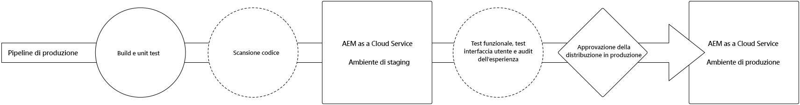
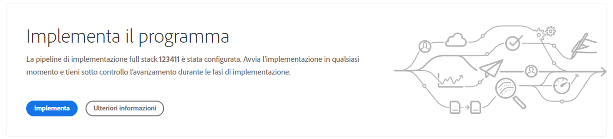
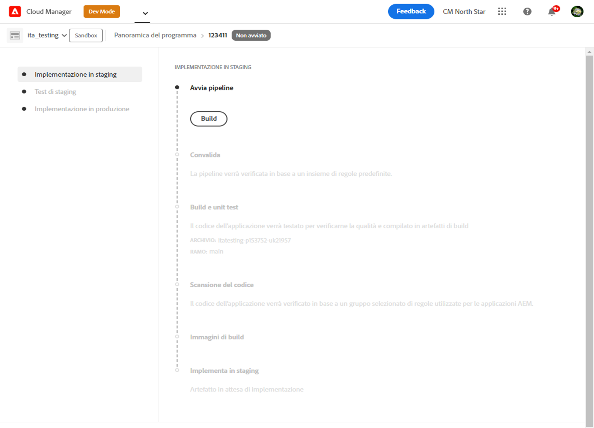
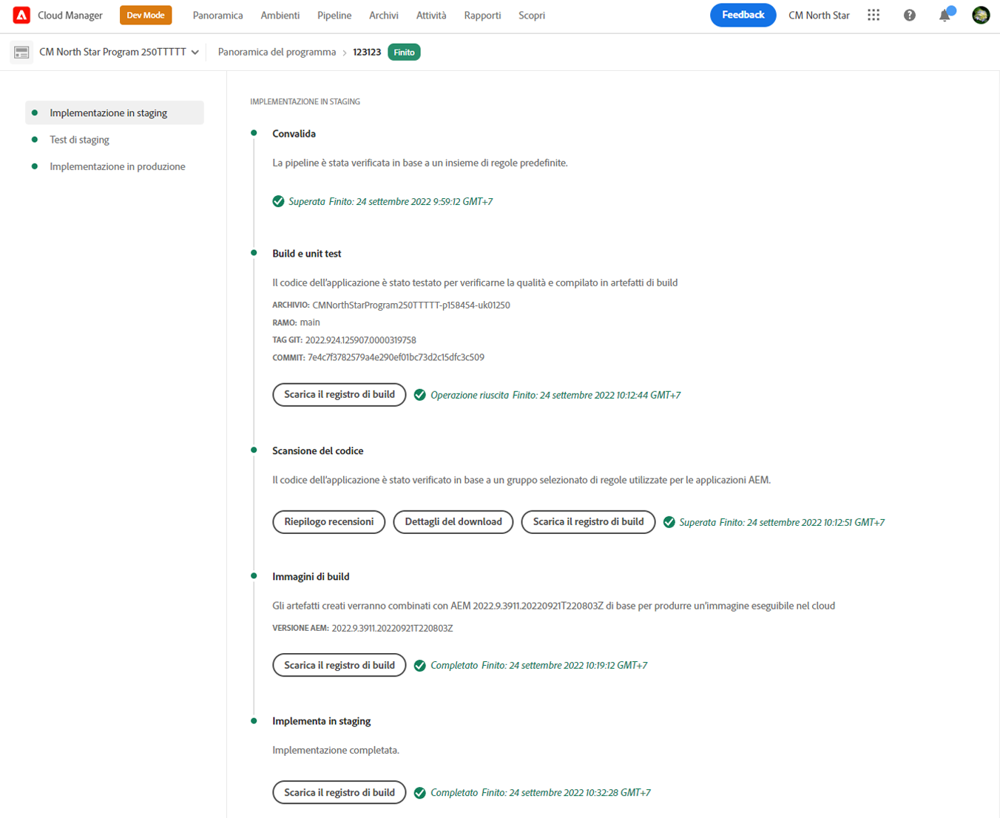
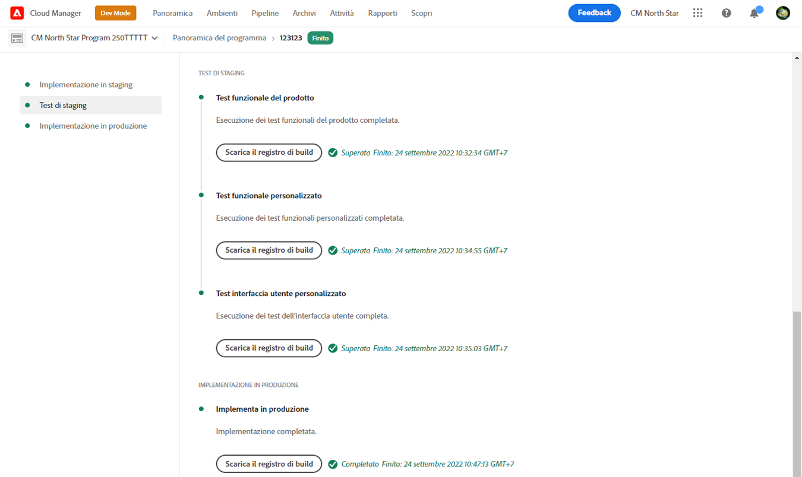
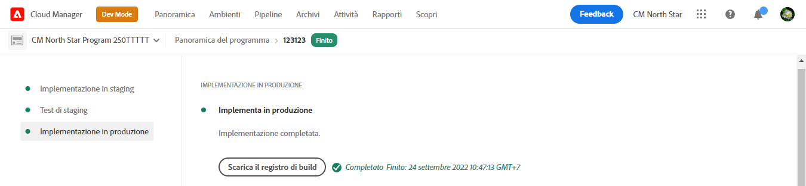

# Implementare il codice {#deploy-your-code}

Scopri come distribuire il codice nell’ambiente di produzione con le pipeline di Cloud Manager in AEM as a Cloud Service.



La distribuzione del codice nell’ambiente di staging e successivamente nell’ambiente di produzione avviene tramite una pipeline di produzione. L’esecuzione della pipeline di produzione è suddivisa nelle due fasi logiche seguenti:

1. **Distribuzione nell&#39;ambiente di staging** - Il codice viene generato e distribuito nell&#39;ambiente di staging per test funzionali automatizzati, test dell&#39;interfaccia utente, audit dell&#39;esperienza e test di accettazione utente (UAT).
1. **Distribuzione nell&#39;ambiente di produzione** - Una volta convalidata la build nell&#39;ambiente di staging e approvata per la promozione nell&#39;ambiente di produzione, lo stesso artefatto di build viene distribuito nell&#39;ambiente di produzione.

_Solo la pipeline del codice full stack supporta il controllo del codice, i test funzionali, i test dell’interfaccia utente e l’audit dell’esperienza._

## Processo di distribuzione {#deployment-process}

Tutte le distribuzioni di Cloud Service seguono un processo continuo per garantire l’operatività continua. Per ulteriori informazioni, consulta [Funzionamento delle implementazioni continue](/help/implementing/deploying/overview.md#how-rolling-deployments-work).

>[!NOTE]
>
>La cache del Dispatcher viene cancellata su ogni distribuzione. Viene successivamente &quot;riscaldato&quot; prima che i nuovi nodi di pubblicazione accettino il traffico.

## Distribuire il codice con Cloud Manager in AEM as a Cloud Service {#deploying-code-with-cloud-manager}

Dopo aver [configurato la pipeline di produzione](/help/implementing/cloud-manager/configuring-pipelines/configuring-production-pipelines.md) includendo archivio, ambiente e ambiente di test, tutto è pronto per la distribuzione del codice.

1. Accedi a Cloud Manager all’indirizzo [my.cloudmanager.adobe.com](https://my.cloudmanager.adobe.com/) e seleziona l’organizzazione appropriata.

1. Nella console **[Programmi](/help/implementing/cloud-manager/navigation.md#my-programs)** fare clic sul programma per il quale si desidera distribuire il codice.

1. Nella pagina **Panoramica**, nell&#39;area call-to-action, fare clic su **Distribuisci**.

   

1. Nella pagina **Distribuisci in produzione** fare clic su **Genera**.

   

Il processo di build distribuisce il codice attraverso le tre seguenti fasi ordinate:

1. [Fase di implementazione nell’ambiente di staging](#stage-deployment)
1. [Fase di test dello staging](#stage-testing)
1. [Fase di implementazione di produzione](#production-deployment)

>[!TIP]
>
>Puoi rivedere i passaggi da vari processi di distribuzione visualizzando i registri o rivedendo i risultati per i criteri di test.

### Fase di implementazione nell’ambiente di staging {#stage-deployment}

La fase **Distribuzione nell&#39;ambiente di staging** prevede i seguenti passaggi:

| Passaggio della distribuzione dello staging | Descrizione |
| --- | --- |
| Convalida | Assicura che la pipeline sia configurata per utilizzare le risorse attualmente disponibili. Ad esempio, i test per verificare che il ramo configurato esista e che gli ambienti siano disponibili. |
| Build e test unitari | Esegue un processo di compilazione containerizzato.<br>Per informazioni dettagliate sull&#39;ambiente di compilazione, vedere [Dettagli ambiente di compilazione](/help/implementing/cloud-manager/getting-access-to-aem-in-cloud/build-environment-details.md). |
| Scansione del codice | Valuta la qualità del codice dell’applicazione.<br>Consulta [Test di qualità del codice](/help/implementing/cloud-manager/code-quality-testing.md) per informazioni dettagliate sul processo di test. |
| Immagini di build | Questo processo converte il contenuto e i pacchetti Dispatcher dalla fase Build in immagini Docker. Genera anche configurazioni Kubernetes basate su questi pacchetti. |
| Implementa in staging | L&#39;immagine viene distribuita nell&#39;ambiente di staging in preparazione della [fase di test dello staging](#stage-testing). |



### Fase di test dello staging {#stage-testing}

La fase **Test dello staging** prevede i seguenti passaggi:

| Passaggio del test dello staging | Descrizione |
| --- | --- |
| Test funzionali del prodotto | La pipeline di Cloud Manager esegue i test per l’ambiente di staging.<br>Vedere anche [Test funzionali del prodotto](/help/implementing/cloud-manager/functional-testing.md#product-functional-testing). |
| Test funzionali personalizzati | Questo passaggio nella pipeline viene sempre eseguito e non può essere saltato. Se la build non produce un JAR di test, il test viene superato automaticamente.<br>Vedere anche [Test funzionali personalizzati](/help/implementing/cloud-manager/functional-testing.md#custom-functional-testing). |
| Test dell’interfaccia utente personalizzati | Funzione facoltativa che esegue automaticamente i test dell’interfaccia utente creati per le applicazioni personalizzate.<br>I test dell&#39;interfaccia utente sono basati su Selenium e inclusi in un&#39;immagine Docker per offrire flessibilità nel linguaggio e nei framework. Questo approccio consente di utilizzare Java e Maven, Node e WebDriver.io o qualsiasi framework o tecnologia basati su Selenium.<br>Vedi anche [Test dell&#39;interfaccia utente personalizzati](/help/implementing/cloud-manager/functional-testing.md#custom-ui-testing). |
| Audit dell’esperienza | Questo passaggio nella pipeline viene sempre eseguito e non può essere saltato. Quando si esegue una pipeline di produzione, viene incluso un passaggio di audit dell’esperienza dopo i test funzionali personalizzati che eseguono i controlli.<ul><li>Le pagine configurate vengono inviate al servizio e valutate.</li><li>I risultati sono informativi e mostrano i punteggi e cosa è cambiato tra il punteggio corrente e quello precedente.</li><li>Questo approfondimento e è utile per determinare l’eventuale introduzione di una regressione con la distribuzione corrente.</li></ul>Consulta [Informazioni sui risultati dell&#39;audit dell&#39;esperienza](/help/implementing/cloud-manager/reports/report-experience-audit.md).</li></ul> |



### Fase di implementazione di produzione {#production-deployment}

Il processo di distribuzione nelle topologie di produzione è leggermente diverso per ridurre al minimo l’impatto sui visitatori di un sito AEM.

Le distribuzioni di produzione seguono generalmente gli stessi passaggi descritti in precedenza, ma in modo continuativo. Questi passaggi includono:

1. Distribuire i pacchetti AEM nel servizio Author.
1. Scollegare `dispatcher1` dal load balancer.
1. Distribuire i pacchetti AEM in `publish1` e il pacchetto Dispatcher in `dispatcher1`. Svuotare la cache di Dispatcher.
1. Ripristina `dispatcher1` nel load balancer.
1. Quando `dispatcher1` torna in servizio, scollegare `dispatcher2` dal load balancer.
1. Distribuire i pacchetti AEM in `publish2` e il pacchetto Dispatcher in `dispatcher2`. Svuotare la cache di Dispatcher.
1. Ripristina `dispatcher2` nel load balancer.

Questo processo continua fino a quando la distribuzione non raggiunge tutti gli editori e i Dispatcher nella topologia.



## Timeout durante una distribuzione {#timeouts}

I passaggi seguenti si interrompono se vengono lasciati in attesa del feedback dell’utente durante una distribuzione:

| Passaggio | Timeout |
|--- |--- |
| Test di qualità del codice | 14 giorni |
| Test di sicurezza | 14 giorni |
| Test delle prestazioni | 14 giorni |
| Domanda di approvazione | 14 giorni |
| Pianificazione della distribuzione nell’ambiente di produzione | 14 giorni |
| Supporto CSE | 14 giorni |

## Riesecuzione di una distribuzione di produzione {#reexecute-deployment}

In rari casi, i passaggi di distribuzione nell’ambiente di produzione possono non riuscire per motivi transitori. In questi casi, la riesecuzione del passaggio di distribuzione nell’ambiente di produzione è supportata a condizione che il passaggio di distribuzione nell’ambiente di produzione sia stato completato, indipendentemente dal tipo di completamento (ad esempio, annullato o non riuscito). La riesecuzione crea una nuova esecuzione utilizzando la stessa pipeline composta dai tre passaggi seguenti:

1. **Convalida**: la stessa convalida che si verifica durante una normale esecuzione della pipeline.
1. **Build** - Nel contesto di una riesecuzione, il passaggio di compilazione copia gli artefatti e non esegue effettivamente un nuovo processo di compilazione.
1. **Distribuzione di produzione** - Utilizza la stessa configurazione e le stesse opzioni del passaggio di distribuzione di produzione in una normale esecuzione della pipeline.

In tali circostanze, in cui è possibile eseguire una riesecuzione, la pagina di stato della pipeline di produzione fornisce l’opzione **Riesegui** accanto a quella consueta di **Scarica registro build**.


>[!NOTE]
>
>In una riesecuzione, il passaggio di build viene etichettato nell’interfaccia utente in modo per rispecchiare il fatto che gli artefatti vengono copiati, e non ricompilati.

### Note sull’utilizzo {#usage-notes}

* La riesecuzione del passaggio di distribuzione di produzione è disponibile solo per l’ultima esecuzione.
* La riesecuzione non è disponibile per le esecuzioni degli aggiornamenti push. Se l’ultima esecuzione è un aggiornamento push, non è possibile eseguirla nuovamente.
* Se l’ultima esecuzione non è riuscita in un qualsiasi punto precedente al passaggio di distribuzione nell’ambiente di produzione, non è possibile eseguirla nuovamente.

### Riesecuzione dell’API {#reexecute-API}

Oltre a essere disponibile nell’interfaccia utente, è possibile utilizzare l’[API di Cloud Manager](https://developer.adobe.com/experience-cloud/cloud-manager/reference/api/#tag/Pipeline-Execution) per attivare le riesecuzioni e identificare le esecuzioni attivate come riesecuzioni.

#### Attivare una riesecuzione {#reexecute-deployment-api}

Per attivare una riesecuzione, effettuare una richiesta PUT al collegamento HAL `https://ns.adobe.com/adobecloud/rel/pipeline/reExecute` sullo stato del passaggio di distribuzione di produzione.

* Se tale collegamento è presente, l’esecuzione può essere riavviata da quel passaggio.
* Se è assente, l’esecuzione non può essere riavviata da quel passaggio.

Questo collegamento è disponibile solo per il passaggio di distribuzione nell’ambiente di produzione.

```JavaScript
 {
  "_links": {
    "https://ns.adobe.com/adobecloud/rel/pipeline/logs": {
      "href": "/api/program/4/pipeline/1/execution/953671/phase/1575676/step/2983530/logs",
      "templated": false
    },
    "https://ns.adobe.com/adobecloud/rel/pipeline/reExecute": {
      "href": "/api/program/4/pipeline/1/execution?stepId=2983530",
      "templated": false
    },
    "https://ns.adobe.com/adobecloud/rel/pipeline/metrics": {
      "href": "/api/program/4/pipeline/1/execution/953671/phase/1575676/step/2983530/metrics",
      "templated": false
    },
    "self": {
      "href": "/api/program/4/pipeline/1/execution/953671/phase/1575676/step/2983530",
      "templated": false
    }
  },
  "id": "6187842",
  "stepId": "2983530",
  "phaseId": "1575676",
  "action": "deploy",
  "environment": "weretail-global-b75-prod",
  "environmentType": "prod",
  "environmentId": "59254",
  "startedAt": "2022-01-20T14:47:41.247+0000",
  "finishedAt": "2022-01-20T15:06:19.885+0000",
  "updatedAt": "2022-01-20T15:06:20.803+0000",
  "details": {
  },
  "status": "FINISHED"
```

La sintassi del valore href del collegamento HAL è solo un esempio. Il valore effettivo deve sempre essere letto dal collegamento HAL e non generato.

L’invio di una richiesta PUT a questo endpoint genera una risposta 201 in caso di esito positivo; il corpo della risposta è la rappresentazione della nuova esecuzione. Questo flusso di lavoro è simile all’avvio di un’esecuzione regolare tramite l’API.

#### Identificare un’esecuzione rieseguita {#identify-reexecution}

Il sistema identifica le riesecuzioni impostando il campo `trigger` sul valore `RE_EXECUTE`.
